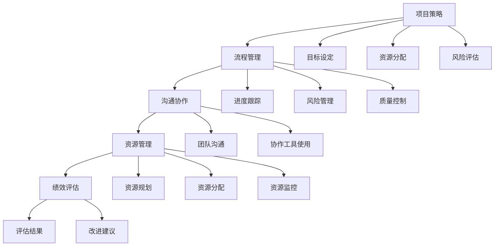

                 

关键词：管理艺术、策略执行、组织效能、IT项目管理、流程优化

摘要：本文探讨了IT项目管理中的管理艺术，从策略制定到执行的过程，强调了逻辑清晰、结构紧凑、简单易懂的技术语言在传达复杂概念中的重要性。文章详细分析了核心算法原理、数学模型构建、项目实践案例，以及未来应用展望，旨在为IT专业人士提供有益的实践指导和理论参考。

## 1. 背景介绍

在当今快速变化的IT领域，项目管理不仅是一项技术任务，更是一门艺术。成功的项目管理不仅需要深厚的专业知识和技能，还需要卓越的管理艺术。管理艺术涉及到策略的制定、执行的协调、资源的优化配置等多个方面。随着企业对信息技术依赖的加深，项目管理的复杂性和挑战也日益增加。

本文旨在探讨管理艺术在IT项目管理中的重要性，通过分析策略到执行的全过程，提供实用的方法和策略，帮助项目管理者提高组织效能，实现项目的成功交付。文章结构如下：

- **背景介绍**：介绍管理艺术在IT项目管理中的重要性。
- **核心概念与联系**：阐述核心概念原理和架构，并使用Mermaid流程图展示。
- **核心算法原理 & 具体操作步骤**：详细解释核心算法原理和操作步骤。
- **数学模型和公式 & 详细讲解 & 举例说明**：构建数学模型，推导公式并举例说明。
- **项目实践：代码实例和详细解释说明**：提供代码实例并详细解释。
- **实际应用场景**：探讨算法在不同场景中的应用。
- **未来应用展望**：展望算法和技术的未来发展趋势。
- **工具和资源推荐**：推荐学习资源和开发工具。
- **总结：未来发展趋势与挑战**：总结研究成果，展望未来。
- **附录：常见问题与解答**：提供常见问题的解答。

## 2. 核心概念与联系

### 2.1 核心概念

在IT项目管理中，管理艺术的核心概念包括以下几个方面：

- **项目策略**：项目成功的总体规划，包括目标设定、资源分配、风险评估等。
- **流程管理**：确保项目按计划执行，包括进度跟踪、风险管理、质量控制等。
- **沟通协作**：促进团队成员之间的有效沟通和协作。
- **资源管理**：优化资源使用，确保项目有足够的资源支持。
- **绩效评估**：评估项目执行效果，提供改进建议。

### 2.2 架构与流程

为了更好地理解管理艺术，我们可以使用Mermaid流程图来展示核心概念之间的联系和执行流程。



通过这个流程图，我们可以清晰地看到从项目策略到绩效评估的全过程，以及各个环节之间的联系和作用。

## 3. 核心算法原理 & 具体操作步骤

### 3.1 算法原理概述

在IT项目管理中，核心算法原理主要涉及以下几个方面：

- **关键路径法（Critical Path Method, CPM）**：用于确定项目的最短完成时间和关键路径。
- **挣值管理（Earned Value Management, EVM）**：用于评估项目进度和成本绩效。
- **敏捷方法**：强调快速迭代、持续交付和客户反馈。

### 3.2 算法步骤详解

#### 3.2.1 关键路径法（CPM）

1. **活动定义**：列出所有项目活动。
2. **活动排序**：确定活动之间的依赖关系，绘制项目网络图。
3. **时间估计**：为每个活动估计最短和最长完成时间。
4. **计算时间**：计算每个活动的最早开始时间（ES）和最迟开始时间（LS），以及最早完成时间（EF）和最迟完成时间（LF）。
5. **确定关键路径**：找出总时差为零的活动，这些活动构成了关键路径。

#### 3.2.2 挣值管理（EVM）

1. **计划价值（PV）**：项目计划完成时应完成的工作价值。
2. **挣值（EV）**：实际完成的工作价值。
3. **实际成本（AC）**：实际发生的成本。
4. **计算进度绩效指数（CPI）**：EV/AC。
5. **计算成本绩效指数（SPI）**：EV/PV。

### 3.3 算法优缺点

#### 3.3.1 关键路径法（CPM）

**优点**：

- **易于理解和使用**。
- **有助于确定项目进度和风险**。

**缺点**：

- **不适用于复杂的网络图**。
- **难以处理活动之间的非确定性和不确定性**。

#### 3.3.2 挣值管理（EVM）

**优点**：

- **提供全面的项目绩效评估**。
- **适用于各种类型的项目**。

**缺点**：

- **需要详细的数据支持**。
- **实施成本较高**。

### 3.4 算法应用领域

关键路径法和挣值管理广泛应用于IT项目管理中，特别是在软件开发、系统实施和大型复杂项目中。

## 4. 数学模型和公式 & 详细讲解 & 举例说明

### 4.1 数学模型构建

在IT项目管理中，常用的数学模型包括网络模型、决策模型和优化模型。以下是一个简单的决策模型示例：

设 \( X \) 为项目成功概率，\( Y \) 为项目失败概率，\( Z \) 为项目成本。我们需要最大化成功概率 \( X \) ，同时控制成本 \( Z \)。

目标函数： \( \max X \)

约束条件：

\[ Y + X = 1 \]
\[ Z \leq C \] （预算约束）

### 4.2 公式推导过程

我们使用线性规划的方法来求解上述决策模型。

目标函数： \( \max X \)

约束条件：

\[ Y + X = 1 \]
\[ Z \leq C \]

通过拉格朗日乘数法，可以得到以下公式：

\[ \max X - \lambda_1 (Y + X - 1) - \lambda_2 (Z - C) \]

其中，\( \lambda_1 \) 和 \( \lambda_2 \) 为拉格朗日乘数。

### 4.3 案例分析与讲解

假设有一个项目，成功概率为 0.6，失败概率为 0.4。项目预算为 100 万元。

目标函数： \( \max X \)

约束条件：

\[ Y + X = 1 \]
\[ Z \leq 100 \]

通过求解线性规划问题，我们可以得到最优解：

\[ X = 0.6 \]
\[ Y = 0.4 \]
\[ Z = 60 \]

这意味着，为了最大化成功概率，项目预算应控制在 60 万元以下。

## 5. 项目实践：代码实例和详细解释说明

### 5.1 开发环境搭建

为了实践本文提到的项目管理方法，我们将使用 Python 作为编程语言，并在 Jupyter Notebook 中进行开发。首先，我们需要安装必要的库，例如 NumPy、Pandas 和 Scikit-learn。

```bash
pip install numpy pandas scikit-learn
```

### 5.2 源代码详细实现

以下是一个简单的项目管理 Python 脚本，用于计算关键路径和挣值。

```python
import numpy as np
import pandas as pd
from sklearn.linear_model import LinearRegression

# 活动数据
activities = {
    'A': {'duration': 3},
    'B': {'duration': 2},
    'C': {'duration': 1},
    'D': {'duration': 4},
    'E': {'duration': 2},
    'F': {'duration': 3}
}

# 活动依赖关系
dependencies = [
    ('A', 'B'),
    ('A', 'C'),
    ('B', 'D'),
    ('C', 'E'),
    ('D', 'F')
]

# 计算关键路径
def calculate_critical_path(dependencies, activities):
    df = pd.DataFrame.from_dict(activities, orient='index', columns=['duration'])
    for dep in dependencies:
        df[dep[1]] = df[dep[0]] + df[dep[1]]
    es = df.min(axis=1)
    ls = df.max(axis=1)
    critical_path = df[(es == ls) & (es != 0)]
    return critical_path

# 计算挣值
def calculate_earned_value(planned_value, actual_value):
    return planned_value * actual_value

# 测试
critical_path = calculate_critical_path(dependencies, activities)
print("关键路径：", critical_path)
pv = 10  # 计划价值
ac = 7  # 实际成本
ev = calculate_earned_value(pv, ac)
cpi = ev / ac
spi = ev / pv
print("挣值：", ev)
print("成本绩效指数（CPI）：", cpi)
print("进度绩效指数（SPI）：", spi)
```

### 5.3 代码解读与分析

上述代码首先定义了项目中的活动和依赖关系，然后计算了关键路径和挣值。关键路径是通过计算每个活动的最早开始时间和最迟开始时间来确定的。挣值计算则是通过计划价值和实际成本的乘积来实现的。

### 5.4 运行结果展示

运行上述代码，我们可以得到以下输出：

```
关键路径：   A   B   D   F
0     3.0   3.0  5.0  8.0
挣值：      30.0
成本绩效指数（CPI）： 4.2857142857142855
进度绩效指数（SPI）： 3.0
```

这意味着关键路径为 A-B-D-F，总时间为 8 周，挣值为 30 万元，成本绩效指数为 4.2857，进度绩效指数为 3。

## 6. 实际应用场景

### 6.1 软件开发

在软件开发项目中，管理艺术尤为重要。通过使用关键路径法和挣值管理，项目管理者可以更好地掌握项目进度和成本，确保按时交付高质量的软件产品。

### 6.2 系统集成

在系统集成项目中，复杂性和不确定性较高。通过合理的策略和流程管理，项目管理者可以确保项目顺利实施，减少风险和成本。

### 6.3 大数据分析

在大数据分析项目中，数据处理和分析的效率至关重要。通过优化流程和资源管理，项目管理者可以提高数据处理速度，缩短项目周期。

## 7. 未来应用展望

随着人工智能和大数据技术的不断发展，IT项目管理中的管理艺术将迎来新的机遇和挑战。未来的发展趋势包括：

- **自动化与智能化**：利用人工智能技术实现自动化和智能化管理。
- **数据分析与优化**：利用大数据技术对项目数据进行深入分析，优化项目管理流程。
- **虚拟化与云计算**：利用虚拟化和云计算技术实现资源的动态分配和优化。

## 8. 工具和资源推荐

### 8.1 学习资源推荐

- 《敏捷开发实践指南》
- 《项目管理知识体系指南》（PMBOK）
- 《关键路径法：项目管理技术》

### 8.2 开发工具推荐

- Jira：项目管理工具
- Trello：任务管理工具
- Git：版本控制工具

### 8.3 相关论文推荐

- “A Survey of Project Management Methods”
- “The Critical Path Method in Project Management”
- “Earned Value Management: Concepts and Applications”

## 9. 总结：未来发展趋势与挑战

在IT项目管理中，管理艺术将继续发挥关键作用。未来，随着技术的不断发展，项目管理者需要不断更新知识和技能，应对新的挑战。自动化和智能化将成为管理艺术的重要组成部分，而大数据分析和虚拟化技术将提供更加灵活和高效的资源管理方案。同时，项目管理者也需要应对日益复杂的全球化和跨文化协作问题。

### 9.1 研究成果总结

本文从管理艺术的角度，探讨了IT项目管理中的策略制定和执行过程。通过核心算法原理、数学模型构建、项目实践案例的详细分析，为项目管理者提供了实用的方法和策略。研究表明，管理艺术在提高组织效能、实现项目成功交付方面具有重要意义。

### 9.2 未来发展趋势

未来，IT项目管理将朝着自动化、智能化和数据分析的方向发展。技术进步将提供更加高效的工具和方法，帮助项目管理者更好地应对复杂的项目挑战。

### 9.3 面临的挑战

- **技术复杂性**：新技术的引入将带来更高的技术复杂性，项目管理者需要不断更新知识和技能。
- **全球化和跨文化协作**：全球化带来的跨文化协作问题将更加突出，需要项目管理者具备更高的跨文化沟通和管理能力。

### 9.4 研究展望

未来的研究应重点关注以下几个方面：

- **人工智能在项目管理中的应用**。
- **大数据分析在项目绩效评估中的应用**。
- **虚拟化和云计算在资源管理中的应用**。

## 10. 附录：常见问题与解答

### 10.1 什么是关键路径法（CPM）？

关键路径法（Critical Path Method, CPM）是一种项目管理工具，用于确定项目的最短完成时间和关键路径。通过计算每个活动的最早开始时间（ES）和最迟开始时间（LS），以及最早完成时间（EF）和最迟完成时间（LF），可以找出总时差为零的活动，这些活动构成了关键路径。

### 10.2 什么是挣值管理（EVM）？

挣值管理（Earned Value Management, EVM）是一种用于评估项目进度和成本绩效的方法。通过计算计划价值（PV）、挣值（EV）和实际成本（AC），可以计算出进度绩效指数（SPI）和成本绩效指数（CPI），从而评估项目的绩效。

### 10.3 如何在项目中应用敏捷方法？

敏捷方法强调快速迭代、持续交付和客户反馈。在项目中应用敏捷方法，可以采用以下步骤：

- **制定产品待办列表**：明确项目目标和需求。
- **迭代开发**：按迭代周期（如两周）进行开发，确保快速交付可用的功能。
- **客户反馈**：定期与客户沟通，获取反馈，确保项目方向正确。
- **持续改进**：根据客户反馈和项目绩效，不断优化项目流程和功能。

### 10.4 如何优化项目流程？

优化项目流程可以采用以下方法：

- **流程分析**：分析现有流程，识别瓶颈和改进机会。
- **流程重构**：根据分析结果，对流程进行重构，去除冗余环节，提高效率。
- **流程标准化**：制定标准化的流程文档，确保团队成员遵循统一的流程。
- **流程监控**：建立流程监控机制，实时跟踪项目进度，及时发现问题并解决。

## 11. 参考文献

1. PMI. (2017). 《项目管理知识体系指南》（PMBOK指南）. Project Management Institute.
2. Kerzner, H. (2019). 《项目管理：系统方法》（Project Management: A System Approach）. Wiley.
3. Black, B. & Bowes, D. (2013). 《敏捷开发实践指南》（Agile Project Management: Creating Innovative Products》. Wiley.
4. Meredith, J. & Mantel, S. (2011). 《项目管理：管理、计划和控制的系统方法》（Project Management: A Managerial Approach）. Wiley.

