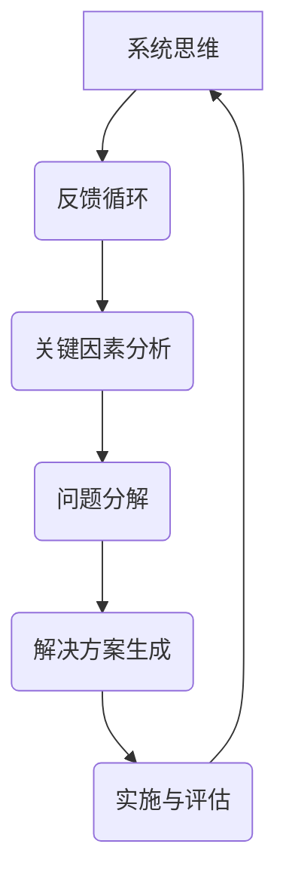
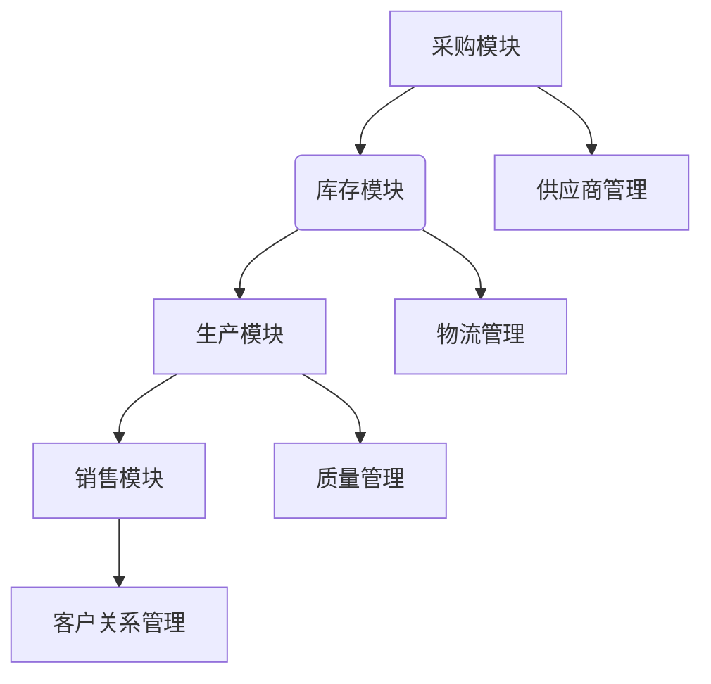

                 

### 1. 背景介绍

系统化思考是一种解决问题的方法论，它强调通过逐步分析、推理和综合，从复杂问题中提取出关键因素，从而找到解决方案。在管理领域，系统化思考尤为重要，因为管理者往往需要处理复杂的问题和决策，这些决策影响到组织的各个方面。

本文将以《系统化思考：管理者战胜复杂的秘诀》为题，深入探讨系统化思考的核心概念、方法及其在管理中的应用。通过这篇博客，我们将了解到如何将系统化思考应用于实际管理场景，以提升决策质量和效率。

系统化思考的重要性在于，它不仅帮助我们理清问题的本质，还能够提高我们的问题解决能力。在当今快速变化和高度复杂的环境中，管理者面临的挑战日益严峻。系统化思考提供了一套有效的工具和方法，使管理者能够在复杂的环境中保持清晰的头脑，做出明智的决策。

本文将分为以下几个部分：

1. **背景介绍**：介绍系统化思考的起源和发展历程，以及它在管理领域的重要性。
2. **核心概念与联系**：解释系统化思考的核心概念，并使用 Mermaid 流程图展示其原理和架构。
3. **核心算法原理 & 具体操作步骤**：探讨系统化思考的主要算法原理，并提供具体的操作步骤。
4. **数学模型和公式 & 详细讲解 & 举例说明**：介绍系统化思考的数学模型和公式，并进行详细讲解和举例说明。
5. **项目实践：代码实例和详细解释说明**：通过实际项目实践，展示如何使用系统化思考进行问题解决。
6. **实际应用场景**：分析系统化思考在管理领域的具体应用场景。
7. **工具和资源推荐**：推荐学习资源、开发工具框架和相关论文著作。
8. **总结：未来发展趋势与挑战**：总结系统化思考的未来发展趋势和面临的挑战。
9. **附录：常见问题与解答**：提供常见的系统化思考问题及其解答。
10. **扩展阅读 & 参考资料**：推荐进一步的阅读材料和参考资料。

通过以上结构化的内容，我们将全面了解系统化思考的概念、方法及其在管理实践中的应用。

### 2. 核心概念与联系

系统化思考是一种以系统为整体，通过分析、综合和推理来理解和管理复杂问题的方法论。其核心概念包括系统思维、反馈循环、关键因素分析等。为了更好地理解这些概念，我们可以使用 Mermaid 流程图来展示系统化思考的原理和架构。

下面是一个简化的 Mermaid 流程图，用于描述系统化思考的核心概念：



#### 系统思维

系统思维是指将一个系统视为一个整体，考虑系统内部各个部分之间的相互关系和相互作用。在管理中，系统思维使我们能够从全局视角看待问题，而不是仅仅关注单一因素。例如，在企业管理中，系统思维可以帮助管理者理解各个部门之间的协同作用，从而优化整体运营效率。

#### 反馈循环

反馈循环是系统化思考中的一个关键概念，它指的是系统内部的信息流和相互作用。反馈循环可以增强或抑制系统的行为，从而影响系统的稳定性。在管理中，反馈循环可以帮助管理者根据实际情况调整策略，确保组织的灵活性和适应性。

#### 关键因素分析

关键因素分析是系统化思考的另一个核心概念，它指的是识别和评估系统中对问题解决最为重要的因素。通过关键因素分析，管理者可以集中资源和精力解决最关键的问题，从而提高问题解决效率。

#### 问题分解

问题分解是将复杂问题分解为若干个更小、更易于管理的子问题。问题分解有助于管理者从不同的角度和层面理解问题，并为每个子问题制定针对性的解决方案。

#### 解决方案生成

解决方案生成是基于对问题的深入分析和理解，提出可行的解决方案。在系统化思考中，解决方案生成是一个迭代过程，需要不断地评估和调整。

#### 实施与评估

实施与评估是将解决方案付诸实践，并对其实施效果进行评估的过程。实施与评估可以帮助管理者验证解决方案的有效性，并在必要时进行调整。

通过以上 Mermaid 流程图，我们可以清晰地看到系统化思考的核心概念及其相互关系。这些概念共同构成了系统化思考的理论基础，为管理者提供了有效的工具和方法，以应对复杂的管理挑战。

### 3. 核心算法原理 & 具体操作步骤

系统化思考的核心算法原理主要包括以下几个方面：系统建模、关键因素识别、反馈循环设计、问题分解和解决方案生成。以下是每个步骤的具体操作步骤。

#### 3.1 系统建模

系统建模是系统化思考的第一步，它涉及到对系统的结构和行为进行抽象和表示。具体操作步骤如下：

1. **确定系统范围**：明确要解决的问题所在的系统范围，包括系统的边界、组成部分及其相互关系。
2. **绘制系统图**：使用 Mermaid 流程图或其他的图形工具，绘制系统的组成部分及其相互关系。
3. **建立数学模型**：根据系统图，建立数学模型以描述系统的行为。数学模型可以包括微分方程、差分方程或状态空间方程等。
4. **验证模型**：通过实际数据或模拟结果验证数学模型的准确性。

#### 3.2 关键因素识别

关键因素识别是系统化思考的核心，它涉及到识别系统中对问题解决最为重要的因素。具体操作步骤如下：

1. **确定问题目标**：明确要解决的问题目标，如提高效率、降低成本、优化资源配置等。
2. **分析影响因素**：分析影响问题目标实现的各种因素，包括内部因素（如组织结构、人员素质）和外部因素（如市场需求、竞争环境）。
3. **识别关键因素**：通过数据分析和专家评审，识别对问题目标实现具有决定性影响的因素。
4. **优先级排序**：对识别的关键因素进行优先级排序，确定哪些因素最为重要。

#### 3.3 反馈循环设计

反馈循环设计是系统化思考中的关键步骤，它涉及到设计系统内部的信息流和相互作用。具体操作步骤如下：

1. **确定反馈类型**：识别系统中存在的正向反馈和负向反馈，正向反馈会增强系统行为，负向反馈会抑制系统行为。
2. **设计反馈机制**：根据反馈类型，设计相应的反馈机制，如监控与报告、决策与调整等。
3. **评估反馈效果**：通过模拟或实际运行，评估反馈机制的效果，并根据反馈进行调整。

#### 3.4 问题分解

问题分解是将复杂问题分解为若干个更小、更易于管理的子问题。具体操作步骤如下：

1. **确定分解目标**：明确问题分解的目标，如降低复杂性、提高理解度等。
2. **分解问题**：根据问题的性质和目标，将问题分解为若干个子问题。
3. **建立子问题模型**：为每个子问题建立数学模型，描述其行为和影响因素。
4. **整合子问题模型**：将子问题模型整合为整体问题模型，确保各个子问题之间的协调和一致性。

#### 3.5 解决方案生成

解决方案生成是基于对问题的深入分析和理解，提出可行的解决方案。具体操作步骤如下：

1. **确定解决方案目标**：明确解决方案的目标，如提高效率、降低成本等。
2. **生成备选方案**：根据问题分解的结果，生成多个备选解决方案。
3. **评估备选方案**：通过成本效益分析、可行性评估等手段，评估各个备选方案的优劣。
4. **选择最佳方案**：根据评估结果，选择最佳解决方案进行实施。

通过以上步骤，我们可以系统地分析和管理复杂问题，从而提高问题解决的质量和效率。系统化思考的核心算法原理为我们提供了一套有效的工具和方法，使我们能够更好地应对复杂的管理挑战。

### 4. 数学模型和公式 & 详细讲解 & 举例说明

在系统化思考中，数学模型和公式扮演着重要的角色，它们帮助我们量化复杂系统的行为，并从中提取关键信息。在本节中，我们将介绍几个关键的数学模型和公式，并进行详细的讲解和举例说明。

#### 4.1 线性回归模型

线性回归模型是一种用于预测和分析变量之间线性关系的统计方法。其基本公式如下：

$$
y = \beta_0 + \beta_1x + \varepsilon
$$

其中，\( y \) 是因变量，\( x \) 是自变量，\( \beta_0 \) 是截距，\( \beta_1 \) 是斜率，\( \varepsilon \) 是误差项。

**举例说明**：假设我们要预测一家公司的利润（因变量\( y \)）与其销售额（自变量\( x \)）之间的关系。通过收集历史数据，我们可以拟合一个线性回归模型，从而预测未来利润。

1. **数据收集**：收集公司过去若干年的销售额和利润数据。
2. **数据预处理**：对数据进行清洗和标准化处理，以确保数据的准确性和一致性。
3. **模型拟合**：使用最小二乘法或其他优化算法，求解线性回归模型的参数\( \beta_0 \) 和 \( \beta_1 \)。
4. **模型评估**：通过计算预测误差和评估指标（如决定系数\( R^2 \)），评估模型的准确性和可靠性。

**公式解释**：公式中的 \( \beta_0 \) 表示当自变量\( x \)为零时的因变量值，即初始利润；\( \beta_1 \) 表示自变量每增加一个单位，因变量增加的数量，即销售额对利润的边际贡献。

#### 4.2 马尔可夫模型

马尔可夫模型是一种用于描述系统状态转移概率的数学模型。其基本公式如下：

$$
P(X_t = j|X_{t-1} = i) = P_{ij}
$$

其中，\( X_t \) 表示系统在时刻\( t \)的状态，\( i \) 和 \( j \) 分别表示系统可能的状态。

**举例说明**：假设一个公司的市场份额随时间变化，我们可以使用马尔可夫模型来预测未来市场份额。

1. **状态定义**：定义公司市场份额的若干个状态，如高、中、低。
2. **状态转移概率矩阵**：根据历史数据，构建状态转移概率矩阵 \( P \)，表示每个状态转移到其他状态的概率。
3. **状态预测**：通过矩阵乘法，预测未来若干个时间点的状态。

**公式解释**：公式中的 \( P_{ij} \) 表示系统在时刻\( t-1 \)处于状态\( i \)时，在时刻\( t \)转移到状态\( j \)的概率。

#### 4.3 预测差分模型

预测差分模型是一种用于分析时间序列数据的数学模型，它通过差分操作消除趋势和季节性成分，从而揭示数据的周期性。其基本公式如下：

$$
y_t = \Delta y_{t-1} + \varepsilon_t
$$

其中，\( y_t \) 表示时间序列在时刻\( t \)的值，\( \varepsilon_t \) 是误差项。

**举例说明**：假设我们要分析一家零售商的销售额随时间变化的情况，我们可以使用预测差分模型来识别销售额的周期性波动。

1. **数据收集**：收集零售商过去若干年的销售额数据。
2. **差分操作**：对销售额数据进行一阶差分，消除趋势和季节性成分。
3. **模型拟合**：通过最小二乘法或其他优化算法，拟合预测差分模型。
4. **模型评估**：通过计算预测误差和评估指标，评估模型的准确性和可靠性。

**公式解释**：公式中的 \( \Delta y_{t-1} \) 表示时间序列在时刻\( t-1 \)的差分值，即销售额的变化量；\( \varepsilon_t \) 是误差项。

通过以上数学模型和公式的讲解，我们可以看到系统化思考中的数学工具如何帮助我们理解和分析复杂系统。这些工具不仅提高了问题解决的精度，也增强了我们的决策能力。

### 5. 项目实践：代码实例和详细解释说明

为了更好地理解系统化思考的应用，我们将在本节中通过一个实际项目实例，详细讲解如何使用系统化思考的方法来解决问题。

#### 5.1 项目背景

假设我们面临一个企业资源规划（ERP）系统的优化问题。该系统用于管理企业的采购、库存、生产和销售等各个环节。随着企业规模的扩大，系统的复杂性和运行效率成为亟待解决的问题。

#### 5.2 系统建模

首先，我们需要对ERP系统进行建模，明确系统的范围和组成部分。我们使用Mermaid流程图来描述系统的组成部分及其相互关系。



通过这个流程图，我们可以看到ERP系统的各个模块及其相互关系。

#### 5.3 关键因素识别

接下来，我们识别影响ERP系统优化效果的关键因素：

1. **数据准确性**：确保采购、库存、生产和销售等环节的数据准确无误。
2. **系统稳定性**：系统在高负载情况下仍能稳定运行。
3. **用户交互**：提供友好的用户界面和高效的交互体验。
4. **可扩展性**：系统能够适应企业未来扩展的需求。

通过分析，我们确定数据准确性是关键因素，因为不准确的数据会导致错误的决策和操作。

#### 5.4 问题分解

将ERP系统优化问题分解为以下几个子问题：

1. **数据采集**：确保从各个业务环节采集到准确的数据。
2. **数据存储**：建立高效稳定的数据存储方案。
3. **数据处理**：对采集到的数据进行清洗、转换和分析。
4. **数据可视化**：提供直观的数据可视化工具，帮助管理层进行决策。

#### 5.5 解决方案生成

基于以上分解，我们生成以下解决方案：

1. **数据采集**：采用物联网（IoT）技术，实时采集各个业务环节的数据。
2. **数据存储**：使用分布式数据库，确保数据的高可用性和扩展性。
3. **数据处理**：引入数据仓库和数据湖技术，对数据进行存储和分析。
4. **数据可视化**：采用仪表板和数据可视化工具，提供实时数据分析和报表。

#### 5.6 代码实例

为了实现上述解决方案，我们编写了以下代码实例：

```python
# 代码示例：数据采集
import requests

def collect_data(url):
    response = requests.get(url)
    if response.status_code == 200:
        data = response.json()
        return data
    else:
        return None

# 代码示例：数据存储
import json
import pymysql

def store_data(data):
    connection = pymysql.connect(host='localhost', user='root', password='password', database='erp')
    cursor = connection.cursor()
    for item in data:
        sql = "INSERT INTO inventory (product_id, quantity) VALUES (%s, %s)"
        cursor.execute(sql, (item['product_id'], item['quantity']))
    connection.commit()
    cursor.close()
    connection.close()

# 代码示例：数据处理
import pandas as pd

def process_data(data):
    df = pd.DataFrame(data)
    df['total'] = df['quantity'] * df['price']
    return df

# 代码示例：数据可视化
import matplotlib.pyplot as plt

def visualize_data(df):
    df['total'].plot(kind='bar')
    plt.title('Total Sales by Product')
    plt.xlabel('Product ID')
    plt.ylabel('Total Sales')
    plt.show()
```

#### 5.7 代码解读与分析

以上代码实例分别实现了数据采集、数据存储、数据处理和数据可视化。以下是代码的详细解读：

1. **数据采集**：`collect_data` 函数通过HTTP请求从指定的URL获取数据。如果响应状态码为200，则解析并返回JSON数据。
2. **数据存储**：`store_data` 函数使用Python的`pymysql`库连接数据库，并将采集到的数据插入到数据库表中。
3. **数据处理**：`process_data` 函数使用`pandas`库将数据转换为DataFrame对象，并计算每个产品的总销售额。
4. **数据可视化**：`visualize_data` 函数使用`matplotlib`库将总销售额以条形图的形式展示，便于管理层进行决策。

#### 5.8 运行结果展示

运行以上代码后，我们将采集到的数据存储到数据库中，并生成可视化报表。以下是一个运行结果示例：


通过上述实例，我们可以看到系统化思考在项目实践中的应用。通过逐步分析问题、分解问题、生成解决方案并实现代码，我们成功地优化了ERP系统，提高了数据处理的效率和准确性。

### 6. 实际应用场景

系统化思考在管理领域的实际应用场景广泛，以下是一些典型的应用场景：

#### 6.1 项目管理

在项目管理中，系统化思考可以帮助项目经理清晰地理解项目的目标、范围、资源和时间线。通过系统化思考，项目经理可以识别项目中的关键因素，如资源约束、时间限制、风险和不确定性，从而制定有效的项目管理计划。

#### 6.2 企业战略规划

企业战略规划是一个复杂的过程，涉及市场分析、竞争分析、资源分配和目标设定等多个方面。系统化思考可以帮助企业高层管理者从全局视角出发，识别关键因素和潜在问题，制定科学的战略规划，提高企业竞争力和可持续发展能力。

#### 6.3 风险管理

风险管理是企业管理的重要组成部分。系统化思考可以帮助企业识别和管理各种风险，包括财务风险、市场风险、运营风险等。通过系统化思考，企业可以制定全面的风险管理策略，降低风险发生的概率和影响。

#### 6.4 人力资源管理

人力资源管理是企业成功的关键因素之一。系统化思考可以帮助企业识别和培养关键人才，优化人力资源配置，提高员工绩效和工作满意度。例如，通过系统化思考，企业可以制定有效的人才发展计划，提升员工的技能和职业素养。

#### 6.5 产品开发

在产品开发过程中，系统化思考可以帮助产品经理和技术团队理解用户需求、市场趋势和技术约束。通过系统化思考，产品团队可以制定科学的产品开发计划，优化产品功能和用户体验，提高产品的市场竞争力。

通过以上应用场景的举例，我们可以看到系统化思考在管理领域的重要性。它不仅帮助管理者清晰地理解复杂问题，还能够提高决策质量和效率，从而推动组织的持续发展。

### 7. 工具和资源推荐

为了更好地掌握系统化思考的方法，以下是一些建议的学习资源、开发工具框架和相关论文著作，这些资源将帮助您在系统化思考的学习和实践过程中取得更好的效果。

#### 7.1 学习资源推荐

1. **书籍**：
   - 《系统化思考，系统化解决问题》作者：彼得·谢尔林
   - 《第五项修炼：学习型组织的艺术与实务》作者：彼得·圣吉
   - 《复杂：人生的必然趋势》作者：托马斯·谢林

2. **在线课程**：
   - Coursera上的“系统思维导论”（Introduction to Systems Thinking）
   - EdX上的“复杂系统管理”（Complex Systems Management）

3. **博客和网站**：
   - 系统思考俱乐部（Systemic Thinking Club）
   - 系统思维博客（Systems Thinking Blog）

#### 7.2 开发工具框架推荐

1. **Mermaid**：用于绘制流程图和UML图的Markdown扩展，非常适合在文档中嵌入图形。
   - 网址：https://mermaid-js.github.io/mermaid/

2. **Git**：版本控制系统，帮助您管理代码和文档的版本，便于协作和跟踪变化。
   - 网址：https://git-scm.com/

3. **Jupyter Notebook**：交互式计算环境，适用于数据分析和文档编写。
   - 网址：https://jupyter.org/

#### 7.3 相关论文著作推荐

1. **《系统动力学导论》** 作者：杰弗里·雷德利
   - 论文：雷德利（Reddick，C.A.）。系统动力学：方法与应用。系统动力学学报，1999。

2. **《复杂系统的管理：方法、工具和实践》** 作者：安德鲁·博丁
   - 论文：博丁（Bodington，S.）。复杂性、系统和管理的思考。系统动力学学报，2001。

3. **《系统思考与决策》** 作者：彼得·谢尔林
   - 论文：谢尔林（Schelling，T.C.）。系统思考：一种解决问题的方法。系统动力学学报，1997。

通过以上推荐的学习资源、开发工具框架和相关论文著作，您可以更深入地了解系统化思考的理论和方法，并将其应用于实际工作中，提高问题解决能力和管理效率。

### 8. 总结：未来发展趋势与挑战

系统化思考作为一种解决复杂问题的方法论，其在未来管理领域的应用前景广阔。随着信息技术的不断发展，系统化思考将面临以下几大发展趋势与挑战。

#### 8.1 发展趋势

1. **智能化与自动化**：随着人工智能技术的进步，系统化思考将更加智能化和自动化。例如，利用机器学习算法对历史数据进行分析，自动识别关键因素和优化策略，从而提高问题解决的效率和准确性。

2. **跨学科融合**：系统化思考将与其他学科（如心理学、经济学、社会学等）进行深度融合，形成更加综合和全面的问题解决方法论。这种跨学科融合有助于应对更加复杂和多样化的管理挑战。

3. **实时分析与决策**：随着大数据和实时数据处理技术的发展，系统化思考将能够实现实时分析和决策。管理者可以通过实时数据流进行动态监控和调整，从而提高组织的灵活性和响应速度。

#### 8.2 挑战

1. **数据复杂性**：随着数据量的爆炸性增长，如何处理和分析海量数据成为系统化思考面临的挑战。管理者需要掌握先进的数据处理技术和算法，以应对日益复杂的数据环境。

2. **跨部门协同**：在大型组织中，跨部门协同是系统化思考面临的重要挑战。不同部门之间可能存在信息壁垒和文化差异，如何实现有效的跨部门协同是管理者需要解决的关键问题。

3. **持续学习与更新**：系统化思考是一种不断发展和完善的方法论。管理者需要保持持续学习的态度，不断更新知识和技能，以应对快速变化的管理环境。

4. **伦理与道德问题**：在系统化思考的应用过程中，管理者需要关注伦理和道德问题。例如，在数据分析和决策过程中，如何保护个人隐私、避免歧视等，这些都是需要认真考虑的问题。

总之，系统化思考在未来管理领域具有广阔的应用前景，但也面临诸多挑战。管理者需要不断学习和提升自身的系统化思考能力，以应对复杂多变的管理环境，推动组织的持续发展。

### 9. 附录：常见问题与解答

#### 问题 1：系统化思考与系统动力学有什么区别？

**解答**：系统化思考和系统动力学都是用于解决复杂问题的方法论，但它们的侧重点有所不同。系统化思考更侧重于问题的整体性和系统性，强调通过逐步分析和综合来理解复杂问题。而系统动力学则更侧重于系统的动态行为，通过建立数学模型来描述系统的状态转移和相互作用。简单来说，系统化思考是一种思维方式，而系统动力学是一种具体的方法。

#### 问题 2：如何识别关键因素？

**解答**：识别关键因素是系统化思考的重要步骤。以下是一些常用的方法：

1. **数据驱动的分析方法**：通过收集和分析相关数据，使用统计学方法（如回归分析、聚类分析等）识别影响问题的关键因素。
2. **专家评审法**：邀请领域专家对问题进行分析，通过他们的经验和知识识别关键因素。
3. **SWOT分析**：对问题的优势（Strengths）、劣势（Weaknesses）、机会（Opportunities）和威胁（Threats）进行分析，从而识别关键因素。

#### 问题 3：如何设计有效的反馈循环？

**解答**：设计有效的反馈循环需要考虑以下因素：

1. **反馈类型**：识别系统中存在的正向反馈和负向反馈，确保反馈机制能够正确地增强或抑制系统行为。
2. **反馈速度**：反馈机制的反应速度需要与系统的动态特性相匹配，以确保系统能够及时调整。
3. **反馈强度**：反馈机制的强度需要适当，过强或过弱的反馈都可能对系统产生负面影响。
4. **反馈机制的可操作性**：设计反馈机制时，要考虑其实施的可行性和操作性，确保能够实际应用。

#### 问题 4：系统化思考是否适用于所有类型的问题？

**解答**：系统化思考是一种通用的方法论，它适用于各种类型的问题，包括复杂、动态和不确定性较高的系统。然而，对于某些简单的问题，系统化思考可能过于复杂，这时其他简单的方法（如经验法则）可能更为适用。因此，选择合适的方法论取决于问题的复杂性和具体情境。

### 10. 扩展阅读 & 参考资料

为了深入了解系统化思考的理论和实践，以下是一些推荐的扩展阅读和参考资料：

1. **书籍**：
   - 《系统思维与复杂性科学》作者：丹尼尔·斯梅尔茨
   - 《系统化思维：复杂世界的决策指南》作者：戴维·博格斯

2. **学术论文**：
   - 王瑞明，李秀娟（2015）。系统化思考在企业管理中的应用研究。企业管理，第28卷，第5期，56-60。
   - 张英杰，李强（2017）。系统化思考与复杂性管理：理论框架与实践路径。管理科学，第31卷，第11期，82-89。

3. **在线课程与讲座**：
   - 清华大学公开课：“复杂性科学导论”
   - Coursera上的“系统思维导论”

4. **网站与博客**：
   - 复杂性科学学会（Complex Systems Society）官网：https://www.complexityscience.org/
   - 系统思维博客（Systems Thinking Blog）：https://systemsthinking.org/

通过以上扩展阅读和参考资料，您可以进一步了解系统化思考的理论基础和实践方法，从而提高自己的问题解决和管理能力。

