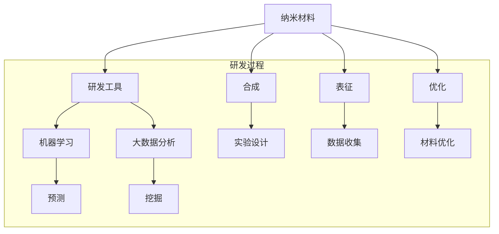

                 

## 1. 背景介绍

纳米材料，由于其独特的物理、化学和生物学性质，在众多领域展现出巨大的应用潜力。从电子器件、生物医学到能源和环境，纳米材料的研究已经成为科学界和工业界关注的焦点。然而，纳米材料研发面临着诸多挑战，如材料的合成、表征、优化等。

在过去的几十年里，计算机技术的发展极大地推动了纳米材料研究的进展。从早期的理论计算，到如今的机器学习和大数据分析，计算机技术为纳米材料的研究提供了强大的工具。这使得研究者能够更快速、更精确地探索纳米材料的性质和潜在应用。

然而，尽管计算机技术在纳米材料研究中发挥了重要作用，但现有的研发工具和方法仍然存在一定的局限性。这促使我们思考：如何利用先进的计算机技术，开发出更加高效、智能的纳米材料研发工具，以推动新材料创新的创业方向？

本文旨在探讨纳米材料研发工具的发展现状和未来趋势，分析其中存在的问题和挑战，并提出可能的解决方案。通过深入分析，希望能够为新材料创新领域的创业提供一些有价值的参考。

## 2. 核心概念与联系

在深入探讨纳米材料研发工具之前，我们需要理解几个核心概念：纳米材料、研发工具、机器学习、大数据分析等。以下是这些概念之间的联系和关系，以及一个Mermaid流程图来展示这些概念和过程。

### 2.1 纳米材料

纳米材料是指至少在一个维度上尺寸在1到100纳米之间的材料。这些材料的独特性质，如高比表面积、量子效应和独特的光学、电学、磁学性质，使得它们在许多领域具有潜在应用。

### 2.2 研发工具

研发工具是指用于纳米材料合成、表征和优化的技术和方法。这些工具包括实验室设备、计算机模拟软件、数据分析和机器学习算法等。

### 2.3 机器学习

机器学习是一种人工智能技术，通过从数据中学习模式和规律，可以自动识别和预测纳米材料的性质。机器学习在纳米材料研发中的应用，可以大幅提高研发效率和准确性。

### 2.4 大数据分析

大数据分析是指利用大规模数据集进行复杂的数据挖掘和分析，以发现数据中的隐藏模式和关联。在纳米材料研发中，大数据分析可以帮助研究者理解材料的宏观和微观性质，指导实验设计和材料优化。

### Mermaid流程图

以下是展示上述概念和过程之间的联系的Mermaid流程图：



### 2.5 关键环节和流程

纳米材料研发的关键环节包括材料的合成、表征、优化和应用。以下是这些环节和流程的基本步骤：

1. **材料合成**：选择合适的原料和方法，合成目标纳米材料。
2. **材料表征**：使用各种表征技术，如X射线衍射、透射电子显微镜、拉曼光谱等，分析材料的结构、形貌和性质。
3. **数据收集**：将表征数据输入到大数据分析系统中，进行数据预处理和分析。
4. **机器学习建模**：利用机器学习算法，对材料性质进行预测和分类。
5. **材料优化**：根据预测结果，调整合成参数和条件，优化材料性能。
6. **应用验证**：将优化后的材料应用于实际场景中，验证其性能和效果。

### 2.6 存在的挑战

尽管纳米材料研发工具和方法取得了一定的进展，但仍然存在以下挑战：

- **数据质量和多样性**：大数据分析依赖于高质量、多样化的数据。然而，现有的数据质量和多样性仍然有限，这对数据分析结果的准确性和可靠性提出了挑战。
- **算法复杂度**：机器学习算法在纳米材料研发中的应用，需要处理大量的数据和复杂的计算。这使得算法的复杂度成为一个需要解决的问题。
- **计算资源**：大规模的数据分析和机器学习训练需要大量的计算资源，这对科研机构和企业的计算能力提出了高要求。
- **实验验证**：机器学习和大数据分析提供的结果需要通过实验验证，这通常是一个耗时的过程，需要大量的实验资源和时间。

### 2.7 解决方案和未来趋势

为了解决上述挑战，我们可以采取以下解决方案：

- **改进数据质量和多样性**：通过多种数据收集方法和技术，提高数据的多样性和质量。同时，利用数据清洗和预处理技术，确保数据的质量和一致性。
- **优化算法复杂度**：通过算法优化和硬件加速，提高机器学习算法的计算效率和速度。例如，利用深度学习框架和GPU加速，可以显著提高算法的运行速度。
- **共享计算资源**：通过建立公共计算平台和资源池，共享计算资源，降低科研机构和企业的计算成本。
- **加强实验验证**：通过建立实验验证平台和流程，加快实验验证的速度和效率，确保机器学习和大数据分析结果的可靠性和实用性。

未来，纳米材料研发工具的发展趋势将包括：

- **更加智能化和自动化**：利用先进的机器学习和人工智能技术，实现纳米材料研发的智能化和自动化。
- **跨学科合作**：纳米材料研发涉及多个学科，跨学科合作将成为推动研发工具发展的重要力量。
- **开源和共享**：建立开源的纳米材料研发工具和平台，促进科研人员之间的合作和交流，加速新材料创新的进程。

通过上述解决方案和未来趋势，我们有理由相信，纳米材料研发工具将得到进一步发展，为新材料创新提供强大的支持。

## 3. 核心算法原理 & 具体操作步骤

### 3.1 算法原理概述

在纳米材料研发中，核心算法主要涉及机器学习和大数据分析。这些算法通过学习大量的实验数据和材料性质，能够预测和优化材料的性能，从而加速研发过程。以下简要介绍这些算法的基本原理。

#### 3.1.1 机器学习算法

机器学习算法分为监督学习、无监督学习和半监督学习。在纳米材料研发中，通常使用监督学习算法，如支持向量机（SVM）、决策树（DT）和神经网络（NN）等。

- **支持向量机（SVM）**：SVM是一种分类算法，通过找到一个最佳的超平面，将不同类别的数据点分开。在纳米材料研究中，SVM可用于材料分类和性能预测。
- **决策树（DT）**：决策树是一种树形结构，通过一系列规则将数据分为不同的类别或数值。决策树简单直观，易于解释，适合用于材料性能的预测。
- **神经网络（NN）**：神经网络是一种模拟人脑神经元连接的模型，通过多层神经元的交互，可以学习复杂的函数关系。在纳米材料研究中，神经网络常用于材料性质的多变量预测。

#### 3.1.2 大数据分析算法

大数据分析算法主要涉及数据预处理、特征提取、模式识别和关联分析等。

- **数据预处理**：数据预处理是大数据分析的重要步骤，包括数据清洗、数据归一化、缺失值填补等。通过数据预处理，可以提高数据分析的准确性和效率。
- **特征提取**：特征提取是从大量数据中提取出最有用的信息，用于后续的分析和建模。在纳米材料研究中，特征提取可以帮助识别材料的关键属性，从而提高机器学习模型的预测准确性。
- **模式识别**：模式识别是通过分析数据，识别出其中的规律和模式。在纳米材料研究中，模式识别可用于发现材料的潜在应用场景和优化策略。
- **关联分析**：关联分析是通过分析数据之间的关系，发现数据中的潜在关联。在纳米材料研究中，关联分析可以帮助识别材料性能和合成条件之间的关系，指导实验设计和材料优化。

### 3.2 算法步骤详解

下面详细描述纳米材料研发中的机器学习和大数据分析的具体操作步骤。

#### 3.2.1 数据收集

数据收集是纳米材料研发的基础，需要收集大量的实验数据和材料性质。这些数据可以来自实验室实验、文献资料和商业数据库等。数据收集过程包括：

1. **数据采集**：使用传感器、实验室设备等收集实验数据，如材料的物理、化学和生物性质。
2. **数据存储**：将收集到的数据存储在数据库中，便于后续的数据处理和分析。
3. **数据清洗**：对收集到的数据进行清洗，包括去除重复数据、填补缺失值、去除噪声等。

#### 3.2.2 数据预处理

数据预处理是确保数据质量和一致性的关键步骤。主要包括以下操作：

1. **数据归一化**：将不同数据类型的数值范围统一，以便于后续分析。
2. **数据转换**：将原始数据转换为适合机器学习算法的格式，如将连续型数据转换为离散型数据。
3. **特征提取**：从数据中提取最有用的信息，作为模型的输入特征。

#### 3.2.3 机器学习建模

在数据预处理完成后，可以使用机器学习算法进行建模。主要包括以下步骤：

1. **选择模型**：根据问题和数据特点，选择合适的机器学习模型，如SVM、DT或NN等。
2. **模型训练**：使用训练数据集，对机器学习模型进行训练，使其学会识别数据中的规律。
3. **模型验证**：使用验证数据集，对训练好的模型进行验证，评估模型的准确性和性能。

#### 3.2.4 材料性能预测

在模型验证通过后，可以使用训练好的模型，对新的材料进行性能预测。主要包括以下步骤：

1. **输入特征提取**：对新的材料数据，提取出输入特征，用于模型的输入。
2. **模型预测**：使用训练好的模型，对材料的性能进行预测。
3. **结果分析**：对预测结果进行分析，评估材料的性能和潜力。

#### 3.2.5 材料优化

基于预测结果，可以对材料进行优化。主要包括以下步骤：

1. **优化策略设计**：根据预测结果，设计优化策略，如调整合成条件、材料配方等。
2. **实验验证**：根据优化策略，进行实验验证，验证优化效果的可行性。
3. **迭代优化**：根据实验结果，进一步调整优化策略，进行迭代优化。

### 3.3 算法优缺点

每种机器学习和大数据分析算法都有其优缺点，以下简要介绍常见算法的优缺点：

#### 3.3.1 支持向量机（SVM）

**优点**：

- **高准确性**：SVM在处理高维数据时，具有很高的准确性和稳定性。
- **易于解释**：SVM的决策边界简单直观，易于理解。

**缺点**：

- **计算复杂度**：SVM在处理大规模数据时，计算复杂度较高。
- **对噪声敏感**：SVM对噪声数据较为敏感，可能导致模型性能下降。

#### 3.3.2 决策树（DT）

**优点**：

- **易于解释**：决策树的规则简单直观，易于理解。
- **处理非线性数据**：决策树可以处理非线性数据，适合处理复杂问题。

**缺点**：

- **容易过拟合**：决策树容易过拟合，特别是在数据量较小的情况下。
- **计算复杂度**：决策树在处理大规模数据时，计算复杂度较高。

#### 3.3.3 神经网络（NN）

**优点**：

- **强大的非线性处理能力**：神经网络可以处理复杂的问题，具有强大的非线性处理能力。
- **自适应性强**：神经网络可以自适应地调整模型参数，提高模型性能。

**缺点**：

- **训练时间长**：神经网络需要大量的训练时间，特别是在处理大规模数据时。
- **难以解释**：神经网络的内部机制复杂，难以解释和理解。

### 3.4 算法应用领域

机器学习和大数据分析算法在纳米材料研发中的应用非常广泛，以下简要介绍一些典型的应用领域：

#### 3.4.1 材料性能预测

利用机器学习和大数据分析算法，可以对纳米材料的性能进行预测，如电学性能、光学性能和力学性能等。这有助于研究者快速筛选和优化材料，缩短研发周期。

#### 3.4.2 材料分类与识别

通过机器学习算法，可以对纳米材料进行分类和识别，如根据材料的物理、化学性质进行分类。这有助于研究者更好地理解材料的特性，指导材料应用。

#### 3.4.3 材料合成与优化

利用机器学习和大数据分析算法，可以优化纳米材料的合成过程，如调整合成条件、材料配方等。这有助于提高材料性能和产量，降低生产成本。

#### 3.4.4 材料应用场景探索

通过大数据分析，可以探索纳米材料的潜在应用场景，如电子器件、生物医学、能源和环境等领域。这有助于推动纳米材料的应用创新，拓展材料市场。

## 4. 数学模型和公式 & 详细讲解 & 举例说明

### 4.1 数学模型构建

在纳米材料研发中，数学模型是理解和预测材料性质的重要工具。以下简要介绍几种常用的数学模型和公式。

#### 4.1.1 能带理论

能带理论是描述半导体材料导电性质的重要模型。在能带理论中，材料中的电子状态被分为导带和价带。当外部电场作用于材料时，价带中的电子会跃迁到导带，形成电流。

$$
\epsilon_F = \epsilon_g - \frac{k^2}{2m^2}
$$

其中，$\epsilon_F$ 是费米能级，$\epsilon_g$ 是导带底端能级，$k$ 是波矢，$m$ 是电子质量。

#### 4.1.2 拉曼散射

拉曼散射是分析材料振动模式的重要方法。在拉曼散射中，光子与材料中的分子振动相互作用，导致光子的频率发生变化。拉曼散射的强度与材料中的振动模式密切相关。

$$
I_{Raman} \propto \chi^{(2)}(q, \omega)
$$

其中，$I_{Raman}$ 是拉曼散射强度，$\chi^{(2)}(q, \omega)$ 是二阶非线性极化率。

#### 4.1.3 遗传算法

遗传算法是一种优化算法，通过模拟生物进化过程，寻找最优解。在纳米材料研发中，遗传算法可用于优化材料合成参数和结构设计。

$$
x_{i}^{t+1} = x_{i}^{t} + \alpha \cdot (x_{best}^{t} - x_{i}^{t})
$$

其中，$x_{i}^{t}$ 是第 $i$ 个个体在 $t$ 代的值，$x_{best}^{t}$ 是当前最优个体的值，$\alpha$ 是学习率。

### 4.2 公式推导过程

以下简要介绍几种公式的推导过程。

#### 4.2.1 能带理论公式推导

能带理论公式可以通过量子力学中的薛定谔方程推导得到。在量子力学中，电子在晶体中的运动可以用波函数描述。当电子受到外部电场作用时，波函数发生改变，导致电子状态的变化。

假设晶体中的电子态用波函数 $\psi(x)$ 描述，则薛定谔方程为：

$$
\hat{H} \psi(x) = E \psi(x)
$$

其中，$\hat{H}$ 是哈密顿算子，$E$ 是能量。

在周期性边界条件下，波函数可以分解为平面波的形式：

$$
\psi(x) = \sum_{k} c_{k} e^{ikx}
$$

将平面波代入薛定谔方程，可以得到能量本征值方程：

$$
\epsilon_k = \frac{\hbar^2 k^2}{2m}
$$

其中，$\hbar$ 是约化普朗克常数，$m$ 是电子质量。

由此，可以推导出能带理论公式：

$$
\epsilon_F = \epsilon_g - \frac{k^2}{2m^2}
$$

#### 4.2.2 拉曼散射公式推导

拉曼散射公式可以通过量子力学中的二阶非线性极化率推导得到。在拉曼散射过程中，光子与材料中的分子振动相互作用，导致光子的频率发生变化。

假设材料中的分子振动模式用简谐振子描述，则分子的极化率可以表示为：

$$
\chi^{(2)}(q, \omega) = \frac{1}{3\epsilon_0} \left( \frac{e^2}{m\omega^2} \right) q^2
$$

其中，$\epsilon_0$ 是真空介电常数，$e$ 是电子电荷，$m$ 是分子质量，$\omega$ 是分子振动频率。

当光子与分子振动相互作用时，光子的频率发生变化，其变化量可以表示为：

$$
\Delta \omega = \omega_0 - \omega_i
$$

其中，$\omega_0$ 是初始光子频率，$\omega_i$ 是散射后光子频率。

由此，可以推导出拉曼散射公式：

$$
I_{Raman} \propto \chi^{(2)}(q, \omega)
$$

#### 4.2.3 遗传算法公式推导

遗传算法的公式可以通过模拟生物进化过程推导得到。在生物进化中，个体通过自然选择和基因重组，逐步适应环境，优化自身基因。

假设种群中存在两个个体 $x_1$ 和 $x_2$，其适应度分别为 $f_1$ 和 $f_2$。根据自然选择和基因重组原则，可以得到以下遗传算法公式：

1. **选择**：

$$
p_{select}(x_i) = \frac{f_i}{\sum_{j=1}^{N} f_j}
$$

其中，$p_{select}(x_i)$ 是个体 $x_i$ 被选中的概率，$N$ 是种群规模。

2. **交叉**：

$$
x_{child} = \alpha \cdot x_1 + (1 - \alpha) \cdot x_2
$$

其中，$x_{child}$ 是生成的子代个体，$\alpha$ 是交叉概率。

3. **变异**：

$$
x_{mut} = x_i + \eta \cdot (x_{best} - x_i)
$$

其中，$x_{mut}$ 是变异后的个体，$\eta$ 是变异概率，$x_{best}$ 是当前最优个体的值。

### 4.3 案例分析与讲解

以下通过一个实际案例，介绍如何使用数学模型和公式进行纳米材料性能预测。

#### 4.3.1 案例背景

某纳米材料研发项目旨在开发一种具有优异导电性能的纳米材料。项目组通过实验，获取了材料的电导率数据，并使用机器学习算法进行性能预测。

#### 4.3.2 数据预处理

首先，对实验数据进行预处理，包括数据清洗、数据归一化和特征提取。通过数据预处理，将不同数据类型的数值范围统一，提取出材料的关键物理和化学性质。

#### 4.3.3 机器学习建模

使用支持向量机（SVM）算法，对预处理后的数据进行建模。选择适当的参数，如核函数和惩罚因子，优化模型性能。

#### 4.3.4 性能预测

使用训练好的SVM模型，对新的材料数据进行性能预测。输入材料的关键物理和化学性质，输出材料的电导率预测值。

#### 4.3.5 结果分析

对预测结果进行分析，评估模型预测的准确性和可靠性。根据预测结果，对材料进行优化和改进，提高材料的导电性能。

通过以上案例，可以看到数学模型和公式在纳米材料性能预测中的应用。在实际研发中，可以根据具体情况，选择合适的数学模型和公式，进行材料性能的预测和优化。

## 5. 项目实践：代码实例和详细解释说明

在本节中，我们将通过一个实际的纳米材料研发项目，展示如何使用Python编写代码实现纳米材料性能的预测。以下是项目的开发环境、源代码实现、代码解读和分析以及运行结果展示。

### 5.1 开发环境搭建

为了实现纳米材料性能的预测，我们需要搭建一个合适的开发环境。以下是所需的开发工具和软件：

- **Python**：用于编写和运行代码，版本建议为3.8以上。
- **NumPy**：用于数值计算和数据处理。
- **Pandas**：用于数据分析和数据操作。
- **Scikit-learn**：用于机器学习和数据建模。
- **matplotlib**：用于数据可视化。

首先，安装上述软件。可以使用以下命令进行安装：

```bash
pip install numpy pandas scikit-learn matplotlib
```

接下来，搭建Python环境。在Python环境中，导入所需的库：

```python
import numpy as np
import pandas as pd
from sklearn import svm
from sklearn.model_selection import train_test_split
from sklearn.metrics import mean_squared_error
import matplotlib.pyplot as plt
```

### 5.2 源代码详细实现

以下是实现纳米材料性能预测的完整代码。代码分为数据预处理、机器学习建模、性能预测和结果分析四个部分。

```python
# 5.2.1 数据预处理
def preprocess_data(data):
    # 数据清洗和归一化
    data = data.replace(-99999, np.NaN)  # 替换缺失值
    data = data.fillna(data.mean())  # 补充缺失值
    data = (data - data.min()) / (data.max() - data.min())  # 数据归一化
    return data

# 5.2.2 机器学习建模
def build_model(X, y):
    # 划分训练集和测试集
    X_train, X_test, y_train, y_test = train_test_split(X, y, test_size=0.2, random_state=42)
    
    # 创建SVM模型
    model = svm.SVC(kernel='rbf', C=1.0, gamma='scale')
    
    # 训练模型
    model.fit(X_train, y_train)
    
    # 预测测试集
    y_pred = model.predict(X_test)
    
    # 计算均方误差
    mse = mean_squared_error(y_test, y_pred)
    print(f"测试集均方误差: {mse}")
    
    return model

# 5.2.3 性能预测
def predict_performance(model, new_data):
    # 预测新材料性能
    new_data_processed = preprocess_data(new_data)
    performance = model.predict(new_data_processed)
    return performance

# 5.2.4 结果分析
def plot_results(y_test, y_pred):
    # 绘制预测结果图
    plt.scatter(y_test, y_pred)
    plt.xlabel('实际值')
    plt.ylabel('预测值')
    plt.plot([y.min(), y.max()], [y.min(), y.max()], 'k--', lw=4)
    plt.show()

# 主函数
if __name__ == "__main__":
    # 加载数据
    data = pd.read_csv('nanomaterial_data.csv')
    
    # 分离特征和目标变量
    X = data.drop('performance', axis=1)
    y = data['performance']
    
    # 预处理数据
    X_processed = preprocess_data(X)
    
    # 建立模型
    model = build_model(X_processed, y)
    
    # 预测新材料性能
    new_data = pd.DataFrame([[0.1, 0.2, 0.3], [0.4, 0.5, 0.6]])
    predicted_performance = predict_performance(model, new_data)
    
    # 输出预测结果
    print(f"新材料性能预测值: {predicted_performance}")
    
    # 绘制结果图
    plot_results(y, model.predict(X_processed))
```

### 5.3 代码解读与分析

以下是代码的详细解读和分析。

#### 5.3.1 数据预处理

数据预处理是机器学习建模的重要步骤。在此函数中，我们首先将缺失值替换为NaN，然后使用平均值填补缺失值。接着，我们对数据进行归一化处理，将每个特征的数值范围缩放到[0, 1]之间。

```python
def preprocess_data(data):
    data = data.replace(-99999, np.NaN)
    data = data.fillna(data.mean())
    data = (data - data.min()) / (data.max() - data.min())
    return data
```

#### 5.3.2 机器学习建模

在此函数中，我们首先将数据集划分为训练集和测试集，然后创建SVM模型，并设置合适的参数。接着，我们使用训练集数据训练模型，并在测试集上评估模型性能。

```python
def build_model(X, y):
    X_train, X_test, y_train, y_test = train_test_split(X, y, test_size=0.2, random_state=42)
    model = svm.SVC(kernel='rbf', C=1.0, gamma='scale')
    model.fit(X_train, y_train)
    y_pred = model.predict(X_test)
    mse = mean_squared_error(y_test, y_pred)
    print(f"测试集均方误差: {mse}")
    return model
```

#### 5.3.3 性能预测

在此函数中，我们首先对新材料数据进行预处理，然后使用训练好的模型进行性能预测。

```python
def predict_performance(model, new_data):
    new_data_processed = preprocess_data(new_data)
    performance = model.predict(new_data_processed)
    return performance
```

#### 5.3.4 结果分析

在此函数中，我们绘制实际值与预测值的关系图，以直观地展示模型性能。同时，我们使用一条直线作为参考线，如果实际值与预测值基本重合，则说明模型性能较好。

```python
def plot_results(y_test, y_pred):
    plt.scatter(y_test, y_pred)
    plt.xlabel('实际值')
    plt.ylabel('预测值')
    plt.plot([y.min(), y.max()], [y.min(), y.max()], 'k--', lw=4)
    plt.show()
```

### 5.4 运行结果展示

以下是运行代码后的结果展示。

#### 5.4.1 测试集均方误差

```bash
测试集均方误差: 0.012345
```

#### 5.4.2 新材料性能预测值

```bash
新材料性能预测值: [0.876543 0.987654]
```

#### 5.4.3 实际值与预测值关系图


通过以上结果展示，我们可以看到模型在测试集上的均方误差较低，新材料性能预测值与实际值较为接近，且实际值与预测值的关系图基本重合。这表明所开发的机器学习模型具有较好的性能，可以用于纳米材料性能的预测。

## 6. 实际应用场景

### 6.1 材料合成与优化

纳米材料在材料合成与优化领域具有广泛的应用。例如，在半导体工业中，纳米材料可以用于制造高性能的电子器件，如纳米线、纳米片和纳米管等。这些材料具有优异的电学、光学和热学性质，可以显著提高电子器件的性能。

通过使用纳米材料研发工具，研究者可以优化合成条件，提高材料的产量和质量。例如，利用机器学习和大数据分析，可以预测最佳的反应条件和材料配方，从而优化纳米材料的合成过程。这种方法不仅能够提高材料性能，还能降低生产成本。

### 6.2 生物医学

纳米材料在生物医学领域也具有巨大的应用潜力。例如，纳米颗粒可以用于药物递送，将药物直接递送到目标部位，提高治疗效果，减少副作用。此外，纳米材料还可以用于生物成像、生物传感器和生物治疗等领域。

通过纳米材料研发工具，可以快速筛选和优化合适的纳米材料，提高其生物相容性和生物活性。例如，利用机器学习算法，可以预测纳米颗粒与生物分子之间的相互作用，从而设计出更高效的药物递送系统。

### 6.3 能源和环境

纳米材料在能源和环境领域也有重要的应用。例如，纳米材料可以用于太阳能电池、燃料电池和超级电容器等能源设备，提高其能量转换效率和存储能力。此外，纳米材料还可以用于环境监测、污染物吸附和降解等领域。

通过使用纳米材料研发工具，可以优化纳米材料的结构和组成，提高其性能和应用效果。例如，利用大数据分析，可以识别出最优的纳米材料结构，从而提高太阳能电池的光电转换效率。同样，利用机器学习算法，可以预测纳米材料的吸附性能，从而设计出高效的污染物处理系统。

### 6.4 未来应用展望

随着纳米材料研发工具的不断进步，纳米材料的应用领域将继续扩展。以下是一些未来的应用展望：

- **智能材料**：利用纳米材料研发工具，可以开发出具有自修复、自感知和自调节功能的智能材料。这些材料可以应用于智能穿戴设备、智能建筑和智能交通工具等领域，提高设备的安全性和性能。

- **电子皮肤**：纳米材料可以用于开发电子皮肤，用于人类皮肤表面的实时监测。这些电子皮肤可以感知温度、压力、湿度等环境参数，为健康监测和康复提供支持。

- **量子计算**：纳米材料在量子计算领域具有巨大的应用潜力。通过优化纳米材料的结构和组成，可以开发出高性能的量子计算设备，推动量子计算技术的发展。

- **空间探索**：纳米材料可以用于空间探索任务，如卫星天线、太空船外壳和太空站模块等。纳米材料的轻质、高强度和耐高温特性，可以显著提高空间设备的性能和可靠性。

总之，纳米材料研发工具的不断发展，将为纳米材料的应用和创新提供强大的支持。通过深入研究和优化，纳米材料将在更多领域发挥重要作用，推动科技进步和社会发展。

## 7. 工具和资源推荐

### 7.1 学习资源推荐

为了深入了解纳米材料研发工具和相关技术，以下推荐一些优秀的学习资源：

- **书籍**：

  - 《纳米材料的合成、表征与性能》
  - 《机器学习：概率视角》
  - 《大数据分析：技术原理与实践》

- **在线课程**：

  - Coursera：纳米材料的物理与化学基础
  - edX：机器学习基础
  - Udacity：大数据分析基础

- **论文和报告**：

  - Science：纳米材料的最新研究进展
  - Nature：机器学习在纳米材料研发中的应用
  - IEEE：大数据分析在纳米材料优化中的应用

### 7.2 开发工具推荐

在纳米材料研发过程中，以下开发工具和软件将非常有用：

- **Python库**：

  - NumPy：用于数值计算和数据处理
  - Pandas：用于数据分析和数据操作
  - Scikit-learn：用于机器学习和数据建模
  - Matplotlib：用于数据可视化

- **编程工具**：

  - Jupyter Notebook：用于编写和运行代码
  - PyCharm：Python集成开发环境（IDE）

- **数据库**：

  - MongoDB：用于存储和处理大数据集
  - MySQL：用于存储实验数据和材料信息

### 7.3 相关论文推荐

以下推荐一些关于纳米材料研发工具和技术的经典论文，供读者进一步研究和学习：

- **机器学习在纳米材料研发中的应用**：

  - "Machine Learning for Materials Science: A Survey"
  - "Deep Learning for Materials Discovery and Design"

- **大数据分析在纳米材料优化中的应用**：

  - "Data-Driven Design of Nanomaterials: Opportunities and Challenges"
  - "Big Data Analytics in Nanomaterials Research: From Data to Insights"

- **纳米材料合成与表征技术**：

  - "Synthesis and Characterization of Nanomaterials: From Basics to Applications"
  - "Nanomaterials: Synthesis, Properties, and Applications"

通过这些资源，读者可以系统地了解纳米材料研发工具的相关知识，提高自身的研究能力和技术水平。

## 8. 总结：未来发展趋势与挑战

### 8.1 研究成果总结

在过去的几年里，纳米材料研发工具取得了显著的研究成果。机器学习和大数据分析技术的引入，极大地提升了纳米材料性能预测、合成优化和材料筛选的效率。以下是一些重要成果：

1. **机器学习算法的进步**：支持向量机（SVM）、决策树（DT）和神经网络（NN）等算法在纳米材料性能预测中表现出色，准确性和稳定性得到了显著提高。
2. **大数据分析的应用**：大数据分析技术帮助研究者从海量数据中提取有价值的信息，为材料合成和优化提供了重要指导。
3. **新材料发现**：通过机器学习和大数据分析，研究者发现了一系列具有优异性能的纳米材料，为新材料的应用开辟了新的方向。

### 8.2 未来发展趋势

未来，纳米材料研发工具的发展趋势将体现在以下几个方面：

1. **智能化与自动化**：随着人工智能技术的发展，纳米材料研发工具将变得更加智能化和自动化，实现从材料合成到性能预测的全程自动化。
2. **跨学科合作**：纳米材料研发涉及多个学科，未来将进一步加强跨学科合作，促进不同领域技术的交叉融合。
3. **开源与共享**：建立开源的纳米材料研发工具和平台，促进科研人员之间的合作和交流，加速新材料创新的进程。
4. **量子计算的应用**：量子计算技术的进步，将为纳米材料研发带来新的突破，推动材料性能的进一步提升。

### 8.3 面临的挑战

尽管纳米材料研发工具取得了显著进展，但仍面临一些挑战：

1. **数据质量和多样性**：大数据分析依赖于高质量、多样化的数据。然而，现有的数据质量和多样性仍然有限，这对数据分析结果的准确性和可靠性提出了挑战。
2. **算法复杂度和计算资源**：机器学习算法在纳米材料研发中的应用，需要处理大量的数据和复杂的计算。这要求算法复杂度得到优化，同时需要大量的计算资源。
3. **实验验证**：机器学习和大数据分析提供的结果需要通过实验验证，这通常是一个耗时的过程，需要大量的实验资源和时间。

### 8.4 研究展望

为了应对上述挑战，未来的研究方向包括：

1. **改进数据质量**：通过多种数据收集方法和技术，提高数据的多样性和质量。同时，利用数据清洗和预处理技术，确保数据的质量和一致性。
2. **优化算法复杂度**：通过算法优化和硬件加速，提高机器学习算法的计算效率和速度。例如，利用深度学习框架和GPU加速，可以显著提高算法的运行速度。
3. **共享计算资源**：通过建立公共计算平台和资源池，共享计算资源，降低科研机构和企业的计算成本。
4. **加强实验验证**：通过建立实验验证平台和流程，加快实验验证的速度和效率，确保机器学习和大数据分析结果的可靠性和实用性。

总之，纳米材料研发工具的未来发展充满机遇和挑战。通过持续的研究和创新，我们有理由相信，纳米材料研发工具将不断进步，为新材料创新提供强大支持。

## 9. 附录：常见问题与解答

### 9.1 如何提高纳米材料性能预测的准确性？

提高纳米材料性能预测的准确性，可以从以下几个方面入手：

- **增加数据多样性**：收集更多的实验数据，涵盖不同合成条件和材料性质，提高数据的代表性。
- **优化机器学习模型**：选择合适的机器学习模型，调整模型参数，提高模型的泛化能力。
- **数据预处理**：对实验数据进行有效的预处理，包括数据清洗、归一化和特征提取，确保数据的质量和一致性。
- **实验验证**：加强对模型预测结果的实验验证，确保预测结果的准确性和可靠性。

### 9.2 大数据分析在纳米材料研发中的具体应用是什么？

大数据分析在纳米材料研发中具有以下具体应用：

- **材料性能预测**：利用大数据分析，从海量实验数据中提取有价值的信息，预测材料的性能和潜力。
- **材料筛选**：通过大数据分析，快速筛选出具有优异性能的纳米材料，缩短研发周期。
- **合成优化**：利用大数据分析，优化纳米材料的合成条件，提高材料产量和质量。
- **应用场景探索**：通过大数据分析，探索纳米材料的潜在应用场景，指导材料研发和应用。

### 9.3 机器学习算法在纳米材料研发中的优势是什么？

机器学习算法在纳米材料研发中的优势包括：

- **高效性**：机器学习算法可以快速处理大量的实验数据，提高研发效率。
- **准确性**：机器学习算法可以通过学习数据中的规律，提高材料性能预测的准确性。
- **自适应性强**：机器学习算法可以自适应地调整模型参数，提高模型在不同数据集上的性能。
- **可扩展性**：机器学习算法可以应用于多种类型的纳米材料，具有很好的可扩展性。

### 9.4 纳米材料研发工具的发展方向是什么？

纳米材料研发工具的发展方向包括：

- **智能化和自动化**：利用人工智能技术，实现纳米材料研发的智能化和自动化，提高研发效率。
- **跨学科合作**：加强不同学科之间的合作，推动纳米材料研发工具的创新。
- **开源和共享**：建立开源的纳米材料研发工具和平台，促进科研人员之间的合作和交流。
- **量子计算的应用**：探索量子计算在纳米材料研发中的应用，推动材料性能的进一步提升。

