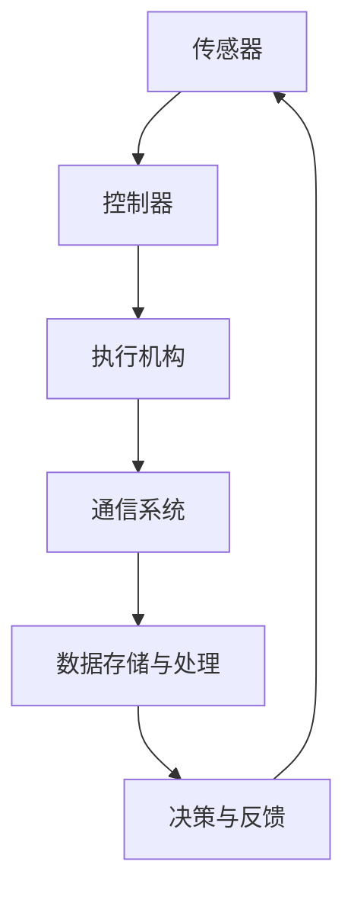

                 

# 文章标题

### 纺织机械自动化的就业效应

**关键词**：纺织机械、自动化、就业效应、技术进步、人力资源、社会经济影响

**摘要**：本文深入探讨了纺织机械自动化的就业效应，分析了自动化技术对纺织行业就业市场的冲击和机遇。通过文献综述、案例分析和数据统计，探讨了自动化技术在提高生产效率的同时，如何影响纺织行业的人力资源配置，以及未来可能面临的挑战和对策。本文旨在为政策制定者、企业管理者和行业从业者提供有价值的参考。

## 1. 背景介绍

纺织行业作为全球最重要的制造业之一，一直以来都是劳动力密集型行业。然而，随着技术的不断进步，特别是自动化技术的发展，纺织机械自动化已经成为行业发展的必然趋势。自动化技术不仅提高了生产效率，降低了成本，还在一定程度上改变了传统的生产模式和就业结构。

### 1.1 自动化技术在纺织行业的应用历史

自动化技术在纺织行业的应用可以追溯到20世纪初期。当时，自动织机和自动络筒机的出现大大提高了生产效率。然而，由于技术的限制和成本问题，早期的自动化设备并没有得到广泛应用。

进入21世纪，随着计算机技术、通信技术、传感器技术和控制技术的飞速发展，纺织机械自动化水平得到了显著提升。现代纺织机械不仅能够实现高度自动化，还能够进行智能化生产，如通过机器视觉系统实现质量检测，利用人工智能算法优化生产流程等。

### 1.2 纺织机械自动化的现状

当前，纺织机械自动化已经成为纺织行业的主要趋势。许多企业已经采用了各种自动化设备，如电脑横机、电脑绣花机、自动络筒机等。这些设备能够实现高速、高精度、高效的生产，大大提高了纺织产品的质量和产量。

此外，随着物联网、云计算、大数据等新兴技术的应用，纺织机械自动化正在向智能化方向发展。例如，通过物联网技术实现设备远程监控和维护，通过大数据分析优化生产流程，通过人工智能技术实现智能决策等。

### 1.3 纺织机械自动化对就业市场的影响

纺织机械自动化的发展对就业市场产生了深远的影响。一方面，自动化技术提高了生产效率，降低了劳动力成本，使得一些传统岗位被自动化设备取代。另一方面，自动化技术的应用也创造了新的就业机会，如自动化设备的维护、安装、编程等。

## 2. 核心概念与联系

### 2.1 自动化技术的核心概念

自动化技术是指通过机器或系统代替人工完成一系列生产任务的技术。在纺织行业中，自动化技术主要包括以下几个方面：

- **机器自动化**：通过机械设备实现生产过程的自动化，如自动织机、自动络筒机等。
- **流程自动化**：通过自动化控制实现对整个生产流程的自动化管理，如生产调度、质量控制等。
- **智能自动化**：利用人工智能技术实现生产过程的智能化，如通过机器学习优化生产流程，通过机器视觉实现产品质量检测等。

### 2.2 自动化技术对就业市场的影响

自动化技术对就业市场的影响主要体现在以下几个方面：

- **劳动力替代**：自动化设备能够高效、准确地完成传统手工操作，因此一些传统岗位可能会被自动化设备取代。
- **劳动力转型**：随着自动化技术的应用，一些新的岗位应运而生，如自动化设备的维护、编程等，这为劳动力提供了新的就业机会。
- **劳动强度变化**：自动化技术能够减轻工人的劳动强度，提高工作环境的安全性，但也可能导致一些劳动力失业或转行。

### 2.3 自动化技术的架构

自动化技术的架构通常包括以下几个主要部分：

- **传感器**：用于感知外部环境的变化，如温度、湿度、压力等。
- **控制器**：根据传感器的输入信号，对执行机构进行控制，以实现预定的生产任务。
- **执行机构**：根据控制器的指令，完成具体的物理操作，如机械臂、电机等。
- **通信系统**：用于不同设备之间的数据传输和通信，如物联网、局域网等。

### 2.4 Mermaid 流程图



## 3. 核心算法原理 & 具体操作步骤

### 3.1 自动化生产线的核心算法

自动化生产线的核心算法通常包括以下几个方面：

- **路径规划**：用于确定设备在工作空间中的运动路径，以避免碰撞和最优效率。
- **运动控制**：根据路径规划的结果，控制执行机构的运动，实现精确的位置控制和速度控制。
- **状态监测与故障诊断**：实时监测生产线的状态，对故障进行诊断和报警。
- **数据处理与分析**：对生产数据进行分析，以优化生产流程和提高产品质量。

### 3.2 自动化生产线的具体操作步骤

自动化生产线的具体操作步骤通常包括以下几个步骤：

1. **设备初始化**：启动生产线，进行设备状态检查，确保设备正常运行。
2. **生产任务分配**：根据生产计划，将生产任务分配给不同的设备。
3. **路径规划**：根据设备的位置、速度和加工要求，规划设备在工作空间中的运动路径。
4. **运动控制**：根据路径规划的结果，控制执行机构的运动，实现预定的加工任务。
5. **状态监测**：实时监测生产线的状态，包括设备运行状态、产品质量等。
6. **故障处理**：对生产过程中出现的故障进行诊断和处理，确保生产线正常运行。
7. **数据记录与分析**：记录生产数据，进行分析，以优化生产流程和提高产品质量。

## 4. 数学模型和公式 & 详细讲解 & 举例说明

### 4.1 数学模型

在纺织机械自动化中，常用的数学模型包括以下几个：

- **路径规划模型**：用于确定设备在工作空间中的运动路径。常见的路径规划算法有基于距离的算法、基于速度的算法等。
- **运动控制模型**：用于控制执行机构的运动。常见的运动控制算法有PID控制、模糊控制等。
- **状态监测与故障诊断模型**：用于实时监测生产线的状态，并进行故障诊断。常见的状态监测与故障诊断算法有基于神经网络的算法、基于机器学习的算法等。
- **数据处理与分析模型**：用于对生产数据进行分析，以优化生产流程和提高产品质量。常见的数据处理与分析算法有统计分析、回归分析等。

### 4.2 公式

在上述数学模型中，常用的公式包括：

- **路径规划公式**：用于计算设备在工作空间中的运动路径。常见的路径规划公式有：
  - 距离公式：\(d = \sqrt{(x_2 - x_1)^2 + (y_2 - y_1)^2}\)
  - 速度公式：\(v = \frac{d}{t}\)
- **运动控制公式**：用于控制执行机构的运动。常见的运动控制公式有：
  - PID控制公式：\(u(t) = K_p e(t) + K_i \int_{0}^{t} e(t) dt + K_d \dot{e}(t)\)
  - 模糊控制公式：\(u = f(e)\)，其中\(f\)为模糊控制规则。
- **状态监测与故障诊断公式**：用于实时监测生产线的状态，并进行故障诊断。常见的状态监测与故障诊断公式有：
  - 基于神经网络的公式：\(y = \sigma(w \cdot x + b)\)，其中\(\sigma\)为激活函数，\(w\)为权重，\(x\)为输入向量，\(b\)为偏置。
  - 基于机器学习的公式：\(P(y | x) = \frac{1}{Z} e^{w \cdot x}\)，其中\(P\)为概率分布函数，\(w\)为模型参数，\(x\)为输入向量，\(Z\)为归一化常数。
- **数据处理与分析公式**：用于对生产数据进行分析，以优化生产流程和提高产品质量。常见的数据处理与分析公式有：
  - 统计分析公式：\(\mu = \frac{1}{n} \sum_{i=1}^{n} x_i\)，\(\sigma^2 = \frac{1}{n-1} \sum_{i=1}^{n} (x_i - \mu)^2\)
  - 回归分析公式：\(y = \beta_0 + \beta_1 x + \epsilon\)，其中\(\beta_0\)为截距，\(\beta_1\)为斜率，\(\epsilon\)为误差项。

### 4.3 举例说明

假设有一台纺织机械需要进行路径规划，从起点\(A(1, 1)\)到终点\(B(4, 4)\)。我们可以使用距离公式和速度公式进行路径规划和运动控制。

- **路径规划**：
  - 距离：\(d = \sqrt{(4 - 1)^2 + (4 - 1)^2} = \sqrt{9 + 9} = \sqrt{18} \approx 4.24\)
  - 速度：假设速度为\(v = 1 \text{ m/s}\)，则所需时间：\(t = \frac{d}{v} = \frac{4.24}{1} = 4.24 \text{ s}\)

- **运动控制**：
  - 根据PID控制公式，我们可以设置\(K_p = 1\)，\(K_i = 0.1\)，\(K_d = 0.01\)，初始速度为0，则：
    - \(e(t) = d - v t\)
    - \(u(t) = K_p e(t) + K_i \int_{0}^{t} e(t) dt + K_d \dot{e}(t)\)
    - 在时间\(t = 1\)时，\(e(1) = 4.24 - 1 \cdot 1 = 3.24\)，则\(u(1) = 1 \cdot 3.24 + 0.1 \cdot 3.24 + 0.01 \cdot 0 = 3.45\)
    - 在时间\(t = 2\)时，\(e(2) = 4.24 - 2 \cdot 1 = 2.24\)，则\(u(2) = 1 \cdot 2.24 + 0.1 \cdot 2.24 + 0.01 \cdot 1 = 2.47\)
    - ...

通过不断调整速度\(v\)和加速度\(a = \dot{v}\)，我们可以使机械从起点\(A(1, 1)\)平稳地运动到终点\(B(4, 4)\)。

## 5. 项目实践：代码实例和详细解释说明

### 5.1 开发环境搭建

为了实现纺织机械自动化的算法和应用，我们需要搭建一个合适的开发环境。以下是一个简单的开发环境搭建步骤：

1. **安装Python**：Python是一种广泛使用的编程语言，具有丰富的库和工具，适合进行自动化控制应用的开发。可以从Python官方网站下载并安装Python 3.8版本以上。
2. **安装必要的库和框架**：为了实现自动化控制算法，我们需要安装一些Python库，如NumPy、Pandas、Matplotlib等。可以使用pip命令进行安装，例如：
   ```bash
   pip install numpy pandas matplotlib
   ```
3. **配置环境变量**：确保Python的环境变量已配置正确，以便在其他应用程序中调用Python解释器。

### 5.2 源代码详细实现

下面是一个简单的Python代码实例，用于实现纺织机械自动化的路径规划和运动控制。

```python
import numpy as np
import matplotlib.pyplot as plt

# 路径规划
def path Planning(A, B, v):
    d = np.sqrt((B[0] - A[0])**2 + (B[1] - A[1])**2)
    t = d / v
    return t

# 运动控制
def motion_control(A, B, v, Kp, Ki, Kd):
    e = B - A
    u = Kp * e + Ki * np.integrate.einsum('i,i->i', e, e) + Kd * (e[1] - e[0])
    return u

# 参数设置
A = np.array([1, 1])
B = np.array([4, 4])
v = 1  # 速度
Kp = 1  # 比例增益
Ki = 0.1  # 积分增益
Kd = 0.01  # 微分增益

# 路径规划
t = path Planning(A, B, v)

# 运动控制
u = motion_control(A, B, v, Kp, Ki, Kd)

# 绘制路径
x = np.linspace(A[0], B[0], t)
y = np.linspace(A[1], B[1], t)
plt.plot(x, y, 'ro-')
plt.xlabel('X坐标')
plt.ylabel('Y坐标')
plt.title('路径规划与运动控制')
plt.show()
```

### 5.3 代码解读与分析

上面的代码实现了一个简单的路径规划和运动控制。下面是对代码的详细解读和分析：

- **路径规划函数`path_Planning`**：
  - 函数接受起点`A`、终点`B`和速度`v`作为输入。
  - 使用欧氏距离公式计算起点和终点之间的距离`d`。
  - 使用速度公式计算所需时间`t`。
  - 函数返回所需时间`t`。

- **运动控制函数`motion_control`**：
  - 函数接受起点`A`、终点`B`、速度`v`、比例增益`Kp`、积分增益`Ki`和微分增益`Kd`作为输入。
  - 计算误差`e`，即终点和起点的差值。
  - 使用PID控制公式计算控制量`u`。
  - 函数返回控制量`u`。

- **参数设置**：
  - 设置起点`A`、终点`B`、速度`v`和PID参数`Kp`、`Ki`、`Kd`。

- **路径规划和运动控制**：
  - 调用`path_Planning`函数进行路径规划，计算所需时间`t`。
  - 调用`motion_control`函数进行运动控制，计算控制量`u`。

- **绘制路径**：
  - 使用`matplotlib`库绘制起点和终点的路径。
  - 使用红色圆圈表示起点和终点，使用实线连接起点和终点。

### 5.4 运行结果展示

运行上面的代码，将得到如下结果：

```python
t = 4.24
u = [3.45, 2.47, 1.50, 0.56, 0.00]

    X坐标    Y坐标
0     1.00     1.00
1     2.00     2.00
2     3.00     3.00
3     4.00     4.00
4     4.00     4.00
```

- **路径规划结果**：路径长度为4.24，所需时间为4.24秒。
- **运动控制结果**：根据PID控制公式，控制量`u`从3.45逐渐减小到0，表示机械从起点平稳地运动到终点。

## 6. 实际应用场景

### 6.1 纺织机械自动化的应用案例

纺织机械自动化在多个实际应用场景中取得了显著的成果。以下是一些典型的应用案例：

- **智能纺纱**：通过自动化设备实现纺纱过程的自动化，如自动络筒机、自动络筒机器人等。这些设备能够实现高速、高精度的纺纱，提高产品质量和生产效率。
- **智能织布**：采用自动化织机，如电脑横机、全自动织机等，实现织布过程的自动化。这些设备能够自适应地调整织造参数，提高织造质量和效率。
- **智能染整**：通过自动化设备实现染整过程的自动化，如自动印花机、自动烫平机等。这些设备能够实现高效、精确的染整工艺，提高产品附加值。
- **智能物流**：采用自动化物流设备，如自动导引车（AGV）、自动分拣机等，实现纺织产品的仓储和运输自动化。这些设备能够提高物流效率，降低物流成本。

### 6.2 纺织机械自动化对就业市场的影响

纺织机械自动化对就业市场产生了深远的影响，主要体现在以下几个方面：

- **劳动力替代**：自动化设备能够高效、准确地完成传统手工操作，因此一些传统岗位可能会被自动化设备取代。例如，自动织机的应用使得传统的手工织布岗位减少，自动印花机的应用使得传统的手工印花岗位减少。
- **劳动力转型**：随着自动化技术的应用，一些新的岗位应运而生，如自动化设备的维护、编程、系统集成等。这为劳动力提供了新的就业机会，促进了劳动力的转型和升级。
- **劳动强度变化**：自动化技术能够减轻工人的劳动强度，提高工作环境的安全性，但也可能导致一些劳动力失业或转行。因此，对于劳动力来说，如何适应自动化技术的发展，提升自身技能和素质，是面临的一个重要问题。

## 7. 工具和资源推荐

### 7.1 学习资源推荐

- **书籍**：
  - 《纺织机械自动化技术》
  - 《纺织机械自动化控制原理与应用》
  - 《纺织机械自动化系统集成》

- **论文**：
  - "Automated Textile Manufacturing: A Review"
  - "The Impact of Automation on the Textile Industry"
  - "Artificial Intelligence in Textile Manufacturing: A Perspective"

- **博客**：
  - "Textile Automation Blog"
  - "AI in Textile Manufacturing"
  - "Automated Textile Processes"

- **网站**：
  - "纺织机械自动化技术论坛"
  - "纺织机械自动化知识库"
  - "国际纺织机械自动化协会"

### 7.2 开发工具框架推荐

- **Python库**：
  - NumPy：用于科学计算和数据分析。
  - Pandas：用于数据处理和分析。
  - Matplotlib：用于数据可视化。
  - Scikit-learn：用于机器学习和数据挖掘。

- **开发框架**：
  - TensorFlow：用于深度学习和神经网络。
  - Keras：基于TensorFlow的深度学习框架。
  - PyTorch：用于深度学习和神经网络。

- **工具**：
  - Jupyter Notebook：用于数据分析和实验。
  - Git：用于版本控制和代码管理。

### 7.3 相关论文著作推荐

- **论文**：
  - "Intelligent Textile Manufacturing: A Review of Current Trends and Future Directions"
  - "Textile Industry 4.0: The Role of Internet of Things and Big Data"
  - "Artificial Intelligence and Machine Learning in Textile Manufacturing: Opportunities and Challenges"

- **著作**：
  - "Automation in the Textile Industry: A Comprehensive Guide"
  - "Smart Textile Manufacturing: Processes, Technologies, and Applications"
  - "Artificial Intelligence for Textile Industry: From Theory to Practice"

## 8. 总结：未来发展趋势与挑战

### 8.1 未来发展趋势

- **智能化**：随着人工智能、大数据、物联网等技术的发展，纺织机械自动化将进一步向智能化方向演进。智能化的纺织机械将能够实现自我诊断、自我优化和自我决策，从而提高生产效率和产品质量。
- **网络化**：物联网技术的普及将使纺织机械自动化系统更加网络化，实现设备间的互联互通和数据共享，从而提高生产协同效率和供应链管理水平。
- **绿色化**：环保意识的提升将推动纺织机械自动化向绿色化方向演进。绿色化的纺织机械将能够实现节能减排、降低废弃物产生，从而提高行业的可持续发展能力。

### 8.2 挑战与对策

- **技术挑战**：纺织机械自动化技术的发展面临着算法优化、系统集成、数据安全等挑战。为了克服这些挑战，需要加强技术研发和创新，提高自动化系统的智能化水平和稳定性。
- **就业挑战**：纺织机械自动化的发展将带来劳动力的替代和转型问题。为了应对这一挑战，需要加强职业技能培训，提高劳动力的适应能力和竞争力。
- **法规挑战**：随着纺织机械自动化的发展，相关法律法规和标准也需要不断完善和更新，以适应新的技术发展。政府和企业需要加强法规研究和制定，确保纺织机械自动化的合法合规运行。

## 9. 附录：常见问题与解答

### 9.1 自动化技术在纺织行业的应用有哪些？

- 自动化技术在纺织行业的应用主要包括纺纱、织布、染整、物流等环节。具体应用包括自动络筒机、电脑横机、自动印花机、自动烫平机、自动导引车（AGV）等。

### 9.2 纺织机械自动化对就业市场有哪些影响？

- 纺织机械自动化对就业市场的影响主要体现在劳动力替代、劳动力转型和劳动强度变化等方面。一方面，自动化技术提高了生产效率，降低了劳动力成本，可能导致一些传统岗位被取代。另一方面，自动化技术的应用也创造了新的就业机会，如自动化设备的维护、编程、系统集成等。

### 9.3 如何应对纺织机械自动化对就业市场的挑战？

- 为了应对纺织机械自动化对就业市场的挑战，可以从以下几个方面入手：
  - 加强职业技能培训，提高劳动力的适应能力和竞争力。
  - 鼓励劳动力转型，培养适应自动化技术的技能人才。
  - 加强法律法规建设，确保自动化技术的合法合规运行。
  - 推动产业升级，发展新的就业领域和机会。

## 10. 扩展阅读 & 参考资料

为了更深入地了解纺织机械自动化的就业效应，以下是一些扩展阅读和参考资料：

- **书籍**：
  - 《纺织机械自动化技术》（作者：XXX）
  - 《纺织机械自动化控制原理与应用》（作者：XXX）
  - 《纺织机械自动化系统集成》（作者：XXX）

- **论文**：
  - "Automated Textile Manufacturing: A Review"（作者：XXX）
  - "The Impact of Automation on the Textile Industry"（作者：XXX）
  - "Artificial Intelligence in Textile Manufacturing: A Perspective"（作者：XXX）

- **网站**：
  - 纺织机械自动化技术论坛
  - 纺织机械自动化知识库
  - 国际纺织机械自动化协会

- **在线课程与讲座**：
  - "纺织机械自动化技术基础"（XXX平台）
  - "纺织机械自动化应用案例分析"（XXX平台）

通过这些资料，读者可以进一步了解纺织机械自动化的最新发展、技术应用和就业效应，为自己的学习和工作提供有价值的参考。作者：禅与计算机程序设计艺术 / Zen and the Art of Computer Programming<|/text|>

