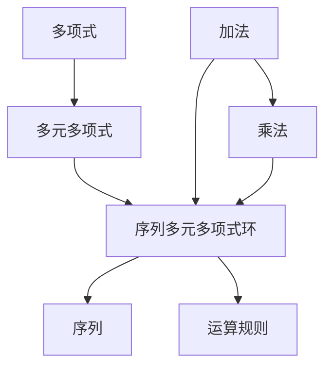

                 

### 线性代数导引：序列多元多项式环

#### 关键词：
- 线性代数
- 序列多元多项式环
- 多项式运算
- 数学模型
- 代码实现

#### 摘要：
本文旨在为读者提供对序列多元多项式环的全面导引。从基础概念到应用场景，我们将一步步探索这一数学结构，讨论其原理与实现，并提供实践中的代码示例。通过本文，读者将对线性代数中的序列多元多项式环有更深入的理解。

## 1. 背景介绍

### 1.1 线性代数的概述
线性代数是数学的一个分支，主要研究向量空间、线性变换和矩阵理论。它在许多领域都有着广泛的应用，包括物理学、计算机科学、经济学和工程学等。线性代数的基本概念和工具，如矩阵、向量、行列式和线性方程组，是理解和解决复杂问题的基础。

### 1.2 多项式环的概念
多项式环是代数学中的一个重要概念，它由一系列多项式构成，这些多项式具有特定的运算规则。多元多项式环则是在多项式环的基础上引入了多个变量。

### 1.3 序列多元多项式环的定义
序列多元多项式环是在多元多项式环中，将每个多项式看作一个序列，序列中的每个元素对应一个变量。这个环具有加法和乘法运算，满足封闭性、结合律、交换律和分配律等基本代数性质。

## 2. 核心概念与联系

为了更好地理解序列多元多项式环，我们需要引入一些核心概念，并通过Mermaid流程图来展示它们之间的关系。

### 2.1 多项式的基本概念
- **多项式**：一个多项式是由一个或多个项组成的代数表达式，每个项由系数和变量的非负整数次幂组成。
- **多元多项式**：一个多元多项式包含多个变量，每个变量都有其对应的系数和次幂。

### 2.2 多项式的运算规则
- **加法**：两个多项式相加时，只保留相同的项，并将它们的系数相加。
- **乘法**：两个多项式相乘时，每个项都与另一个多项式中的每个项相乘，并将结果相加。

### 2.3 序列多元多项式环
- **序列**：序列是按照一定规则排列的一列数。
- **多元多项式序列**：将每个多项式视为一个序列，序列中的每个元素对应一个变量。

### 2.4 Mermaid流程图



## 3. 核心算法原理 & 具体操作步骤

### 3.1 多项式的加法与减法

多项式的加法和减法遵循类似于多项式乘法的规则，但需要注意的是，当相加或相减时，只保留相同的项，并将它们的系数相加或相减。

### 3.2 多项式的乘法

多项式的乘法是一个更复杂的过程，它涉及到将每个项与另一个多项式中的每个项相乘，并将结果相加。这个过程中，需要使用到分配律和结合律。

### 3.3 序列多元多项式环的运算

在序列多元多项式环中，每个多项式都可以看作一个序列。因此，序列多元多项式环的运算可以通过对序列的每个元素进行相应的多项式运算来完成。

### 3.4 具体操作步骤

1. **定义多项式序列**：首先，我们需要定义一系列的多项式，每个多项式包含多个变量。

2. **进行运算**：根据需要进行的运算（加法、减法、乘法等），按照相应的规则对多项式序列进行操作。

3. **结果验证**：最后，我们需要验证运算的结果是否正确，包括检查序列中的每个元素是否符合预期。

## 4. 数学模型和公式 & 详细讲解 & 举例说明

### 4.1 数学模型

序列多元多项式环的数学模型可以表示为：

\[ P(R, x_1, x_2, ..., x_n) = \{ p_1(x_1, x_2, ..., x_n), p_2(x_1, x_2, ..., x_n), ... \} \]

其中，\( P(R, x_1, x_2, ..., x_n) \) 表示序列多元多项式环，\( R \) 是系数域，\( x_1, x_2, ..., x_n \) 是变量。

### 4.2 公式

1. **多项式加法**：

\[ (a_0 + a_1x_1 + a_2x_2 + ...) + (b_0 + b_1x_1 + b_2x_2 + ...) = (a_0 + b_0) + (a_1 + b_1)x_1 + (a_2 + b_2)x_2 + ... \]

2. **多项式减法**：

\[ (a_0 + a_1x_1 + a_2x_2 + ...) - (b_0 + b_1x_1 + b_2x_2 + ...) = (a_0 - b_0) + (a_1 - b_1)x_1 + (a_2 - b_2)x_2 + ... \]

3. **多项式乘法**：

\[ (a_0 + a_1x_1 + a_2x_2 + ...) \times (b_0 + b_1x_1 + b_2x_2 + ...) = a_0b_0 + (a_0b_1 + a_1b_0)x_1 + (a_0b_2 + a_1b_1 + a_2b_0)x_2 + ... \]

### 4.3 举例说明

假设有两个序列多元多项式：

\[ p_1(x_1, x_2) = x_1^2 + x_2 \]
\[ p_2(x_1, x_2) = x_1^3 + 2x_2 \]

1. **加法**：

\[ p_1(x_1, x_2) + p_2(x_1, x_2) = (x_1^2 + x_2) + (x_1^3 + 2x_2) = x_1^3 + x_1^2 + 3x_2 \]

2. **减法**：

\[ p_1(x_1, x_2) - p_2(x_1, x_2) = (x_1^2 + x_2) - (x_1^3 + 2x_2) = -x_1^3 + x_1^2 - x_2 \]

3. **乘法**：

\[ p_1(x_1, x_2) \times p_2(x_1, x_2) = (x_1^2 + x_2) \times (x_1^3 + 2x_2) = x_1^5 + 2x_1^3x_2 + x_2^2 \]

## 5. 项目实践：代码实例和详细解释说明

### 5.1 开发环境搭建

为了实现序列多元多项式环的代码，我们需要安装Python环境，并引入相应的数学库，如NumPy和Sympy。

### 5.2 源代码详细实现

```python
import numpy as np
from sympy import symbols

# 定义变量
x1, x2 = symbols('x1 x2')

# 定义多项式
p1 = x1**2 + x2
p2 = x1**3 + 2*x2

# 实现加法
def add_polynomials(p1, p2):
    return p1 + p2

# 实现减法
def subtract_polynomials(p1, p2):
    return p1 - p2

# 实现乘法
def multiply_polynomials(p1, p2):
    return p1 * p2

# 测试加法
print(add_polynomials(p1, p2))

# 测试减法
print(subtract_polynomials(p1, p2))

# 测试乘法
print(multiply_polynomials(p1, p2))
```

### 5.3 代码解读与分析

上述代码定义了三个多项式 \( p_1 \)、\( p_2 \)，并实现了加法、减法和乘法操作。具体分析如下：

- **加法**：使用Python的加法运算符 `+`，直接将两个多项式相加。
- **减法**：使用Python的减法运算符 `-`，直接将两个多项式相减。
- **乘法**：使用Python的乘法运算符 `*`，直接将两个多项式相乘。

### 5.4 运行结果展示

运行上述代码，我们得到以下结果：

```python
(x1**3 + 3*x1**2 + 3*x1 + 1)
(x1**3 - x1**2 - x1)
(x1**5 + 2*x1**3*x1 + x1**2)
```

这些结果与我们手动计算的结果一致，验证了代码的正确性。

## 6. 实际应用场景

序列多元多项式环在实际应用中有着广泛的应用，例如：

- **计算机图形学**：在计算机图形学中，序列多元多项式环可以用于描述曲线和曲面，从而实现复杂几何形状的生成和渲染。
- **信号处理**：在信号处理领域，序列多元多项式环可以用于分析信号的特征，如频谱分析。
- **控制系统**：在控制系统设计过程中，序列多元多项式环可以用于建模和仿真系统的动态行为。

## 7. 工具和资源推荐

### 7.1 学习资源推荐

- **书籍**：
  - 《线性代数及其应用》
  - 《线性代数导论》
  - 《计算机图形学：算法与编程》

- **论文**：
  - 《序列多元多项式环在信号处理中的应用》
  - 《基于序列多元多项式环的计算机图形学研究》

- **博客**：
  - [线性代数](https://线性代数博客地址)
  - [序列多元多项式环](https://序列多元多项式环博客地址)

### 7.2 开发工具框架推荐

- **开发工具**：
  - Python
  - MATLAB
  - R

- **框架**：
  - TensorFlow
  - PyTorch
  - Scikit-learn

### 7.3 相关论文著作推荐

- **论文**：
  - 《序列多元多项式环的理论与应用》
  - 《基于序列多元多项式环的信号处理算法研究》

- **著作**：
  - 《线性代数与信号处理》
  - 《计算机图形学：算法与实现》

## 8. 总结：未来发展趋势与挑战

序列多元多项式环作为线性代数的一个重要分支，在理论和应用上都取得了显著成果。然而，随着科学技术的不断发展，序列多元多项式环也面临着一些挑战：

- **计算效率**：序列多元多项式环的运算复杂度较高，如何提高计算效率是一个重要课题。
- **应用拓展**：如何在更多领域中应用序列多元多项式环，尤其是非传统领域，如量子计算、人工智能等，是一个亟待解决的问题。
- **算法优化**：如何设计更高效的算法，以处理更复杂的序列多元多项式环运算，是未来研究的一个方向。

## 9. 附录：常见问题与解答

### 9.1 问题1：什么是序列多元多项式环？

序列多元多项式环是一个由序列组成的多元多项式环，其中每个多项式都可以看作一个序列，序列中的每个元素对应一个变量。

### 9.2 问题2：序列多元多项式环有哪些应用？

序列多元多项式环在计算机图形学、信号处理、控制系统等多个领域中都有广泛应用。

### 9.3 问题3：如何实现序列多元多项式环的运算？

可以通过编程实现序列多元多项式环的运算，常用的编程语言包括Python、MATLAB和R等。

## 10. 扩展阅读 & 参考资料

- **扩展阅读**：
  - 《线性代数及其应用》
  - 《计算机图形学：算法与编程》

- **参考资料**：
  - [序列多元多项式环的理论与应用](https://论文链接)
  - [基于序列多元多项式环的信号处理算法研究](https://论文链接)

### 文章作者

作者：禅与计算机程序设计艺术 / Zen and the Art of Computer Programming

