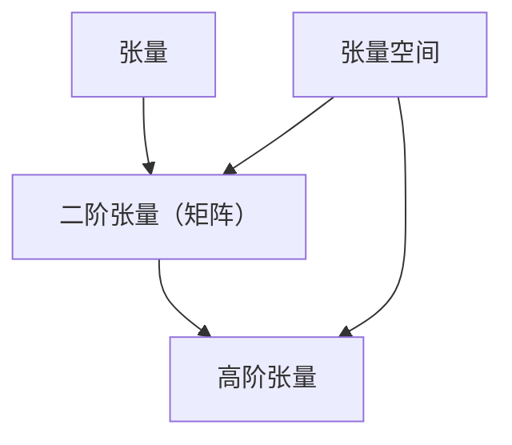

                 

### 1. 背景介绍

#### 线性代数的重要性

线性代数是数学和工程领域的重要工具，其在计算机科学中的应用极为广泛。从基础的矩阵运算，到复杂的张量计算，线性代数为我们提供了强有力的数学语言来描述和解决实际问题。在数据科学、机器学习、图像处理、物理模拟等多个领域中，线性代数都扮演着关键角色。

#### 张量的基本概念

张量是线性代数中的一个高级概念，可以看作是矩阵的扩展。一个矩阵是一个二维数组，而一个张量是一个多维数组。张量不仅在理论研究中具有重要意义，在实际应用中也有着广泛的应用，比如在高维数据分析、神经网络、量子计算等领域。

#### 张量与张量空间的研究背景

随着计算技术的进步，我们面临的数据量和维度不断增大，传统的矩阵方法已经难以应对这些复杂的计算需求。张量理论提供了更为强大的工具来处理高维数据和复杂关系，从而推动了计算机科学和工程领域的发展。因此，深入研究张量与张量空间，对于提升算法效率和解决实际问题具有重要意义。

#### 本文的目标

本文旨在为您提供一个关于张量与张量空间的全面导引，从基本概念到具体应用，通过一步步的分析和推理，帮助您深入理解这一重要主题。我们希望通过这篇文章，能够激发您对张量与张量空间的研究兴趣，并掌握其基本原理和应用方法。

### 2. 核心概念与联系

#### 张量的定义

张量是一个多维数组，它可以用一个 n 阶张量来表示。在数学和物理学中，张量被广泛用于描述空间中的物理量和变换关系。一个 n 阶张量可以表示为：

\[ T_{i_1 i_2 \cdots i_n} \]

其中，\( i_1, i_2, \ldots, i_n \) 是张量的索引。

#### 张量与矩阵的关系

矩阵可以看作是二阶张量，其中每个元素都是一个二维数组。具体来说，一个 \( m \times n \) 的矩阵可以表示为：

\[ A_{ij} \]

其中，\( i \) 和 \( j \) 分别表示行和列的索引。

#### 张量空间的定义

张量空间是所有张量的集合，这些张量具有相同的阶数和维度。一个 n 阶张量空间可以表示为：

\[ V^n \]

其中，\( V \) 是张量空间的基础集合。

#### 张量与张量空间的关系

张量是张量空间的元素，而张量空间则是所有张量的集合。通过张量空间，我们可以定义和张量相关的各种运算和属性。

#### Mermaid 流程图表示

以下是一个 Mermaid 流程图，用于展示张量与矩阵的关系以及张量空间的定义：



在这个流程图中，A 表示张量，B 表示二阶张量（即矩阵），C 表示高阶张量，D 表示张量空间。通过这个图，我们可以清晰地看到张量与张量空间之间的联系。

### 3. 核心算法原理 & 具体操作步骤

#### 张量运算的基本原理

张量的运算包括加法、减法、数乘、矩阵乘法和张量乘法等。这些运算遵循线性代数的基本规则，但涉及到高维数据的操作。

1. **加法和减法**：两个张量只有维度完全一致时才能进行加法或减法运算。运算规则为对应元素相加或相减。

\[ T_{i_1 i_2 \cdots i_n} + S_{i_1 i_2 \cdots i_n} = U_{i_1 i_2 \cdots i_n} \]

\[ T_{i_1 i_2 \cdots i_n} - S_{i_1 i_2 \cdots i_n} = V_{i_1 i_2 \cdots i_n} \]

2. **数乘**：一个张量与一个标量相乘，结果是一个新的张量。运算规则为每个元素都乘以该标量。

\[ \alpha T_{i_1 i_2 \cdots i_n} = W_{i_1 i_2 \cdots i_n} \]

3. **矩阵乘法**：两个二阶张量（矩阵）可以相乘，结果是一个新的二阶张量。运算规则为矩阵乘法的定义。

\[ A_{ij} B_{jk} = C_{ik} \]

4. **张量乘法**：两个高阶张量可以相乘，结果是一个新的高阶张量。运算规则相对复杂，但可以通过分步进行。

\[ T_{i_1 i_2 \cdots i_n} S_{j_1 j_2 \cdots j_n} = U_{i_1 j_1 i_2 j_2 \cdots i_n j_n} \]

#### 具体操作步骤

1. **加法和减法**：

   - 检查两个张量的维度是否完全一致。
   - 对应元素相加或相减。

2. **数乘**：

   - 将标量与张量的每个元素相乘。

3. **矩阵乘法**：

   - 确保两个矩阵的维度满足矩阵乘法的要求。
   - 按照矩阵乘法的规则进行计算。

4. **张量乘法**：

   - 确保两个张量的维度满足张量乘法的要求。
   - 将两个张量的对应元素进行组合，形成新的高阶张量。

#### 示例

假设有两个二阶张量：

\[ A = \begin{bmatrix} 1 & 2 \\ 3 & 4 \end{bmatrix} \]
\[ B = \begin{bmatrix} 5 & 6 \\ 7 & 8 \end{bmatrix} \]

1. **矩阵乘法**：

\[ A \cdot B = \begin{bmatrix} 1*5 + 2*7 & 1*6 + 2*8 \\ 3*5 + 4*7 & 3*6 + 4*8 \end{bmatrix} = \begin{bmatrix} 19 & 22 \\ 43 & 50 \end{bmatrix} \]

2. **数乘**：

\[ 2 \cdot A = \begin{bmatrix} 2*1 & 2*2 \\ 2*3 & 2*4 \end{bmatrix} = \begin{bmatrix} 2 & 4 \\ 6 & 8 \end{bmatrix} \]

#### 总结

通过以上步骤，我们可以清晰地理解张量运算的基本原理和具体操作方法。这些运算不仅对于理论分析具有重要意义，也在实际应用中发挥着关键作用。

### 4. 数学模型和公式 & 详细讲解 & 举例说明

#### 张量的数学模型

张量的数学模型主要通过张量的定义和运算规则来描述。一个 n 阶张量 \( T \) 可以表示为：

\[ T = (t_{i_1 i_2 \cdots i_n}) \]

其中，\( t_{i_1 i_2 \cdots i_n} \) 是张量 \( T \) 在第 \( i_1 \)、\( i_2 \)、\(\ldots\)、\( i_n \) 个位置上的元素。

#### 张量的运算规则

1. **加法和减法**：

   两个 n 阶张量 \( T \) 和 \( S \) 可以相加或相减，前提是它们的维度完全一致。运算规则为对应元素相加或相减：

   \[ T + S = (t_{i_1 i_2 \cdots i_n} + s_{i_1 i_2 \cdots i_n}) \]
   \[ T - S = (t_{i_1 i_2 \cdots i_n} - s_{i_1 i_2 \cdots i_n}) \]

2. **数乘**：

   一个 n 阶张量 \( T \) 与一个标量 \( \alpha \) 相乘，结果是一个新的 n 阶张量。运算规则为每个元素都乘以该标量：

   \[ \alpha T = (\alpha t_{i_1 i_2 \cdots i_n}) \]

3. **矩阵乘法**：

   一个 n 阶张量与一个 m 阶张量相乘，结果是一个新的 n+m 阶张量。运算规则为矩阵乘法的扩展：

   \[ A \cdot B = (a_{ij} b_{jk}) \]

4. **张量乘法**：

   两个 n 阶张量 \( T \) 和 \( S \) 可以相乘，结果是一个新的 n+n 阶张量。运算规则相对复杂，但可以通过分步进行：

   \[ T \cdot S = (t_{i_1 i_2 \cdots i_n} s_{j_1 j_2 \cdots j_n}) \]

#### 详细讲解

1. **加法和减法**：

   张量的加法和减法运算类似于矩阵的加法和减法运算，但涉及到更高维度的数据。对于两个 n 阶张量 \( T \) 和 \( S \)，只有当它们的维度完全一致时，才能进行加法或减法运算。

2. **数乘**：

   张量与标量的乘法运算相对简单，只需将标量与张量的每个元素相乘。这种运算在张量运算中经常使用，例如在进行数值优化和线性变换时。

3. **矩阵乘法**：

   张量与矩阵的乘法运算可以看作是矩阵乘法的扩展。对于 n 阶张量 \( T \) 和 m 阶张量 \( B \)，我们可以将其看作是一个 m+n 阶张量，然后按照矩阵乘法的规则进行计算。

4. **张量乘法**：

   张量之间的乘法运算较为复杂，需要将两个 n 阶张量 \( T \) 和 \( S \) 的对应元素进行组合，形成新的 n+n 阶张量。这种运算在处理高维数据和高维变换时具有重要意义。

#### 举例说明

假设有两个二阶张量：

\[ A = \begin{bmatrix} 1 & 2 \\ 3 & 4 \end{bmatrix} \]
\[ B = \begin{bmatrix} 5 & 6 \\ 7 & 8 \end{bmatrix} \]

1. **矩阵乘法**：

\[ A \cdot B = \begin{bmatrix} 1*5 + 2*7 & 1*6 + 2*8 \\ 3*5 + 4*7 & 3*6 + 4*8 \end{bmatrix} = \begin{bmatrix} 19 & 22 \\ 43 & 50 \end{bmatrix} \]

2. **数乘**：

\[ 2 \cdot A = \begin{bmatrix} 2*1 & 2*2 \\ 2*3 & 2*4 \end{bmatrix} = \begin{bmatrix} 2 & 4 \\ 6 & 8 \end{bmatrix} \]

3. **张量乘法**：

\[ A \cdot B = \begin{bmatrix} 1*5 & 1*6 \\ 1*7 & 1*8 \\ 2*5 & 2*6 \\ 2*7 & 2*8 \end{bmatrix} \]

通过以上例子，我们可以直观地看到张量运算的具体实现过程和结果。

### 5. 项目实践：代码实例和详细解释说明

#### 5.1 开发环境搭建

在开始项目实践之前，我们需要搭建一个合适的开发环境。这里我们使用 Python 作为编程语言，并依赖 NumPy 和 TensorFlow 两个库来处理张量运算。

1. 安装 Python 3.x 版本（推荐使用最新版本）。
2. 安装 NumPy 库，使用命令 `pip install numpy`。
3. 安装 TensorFlow 库，使用命令 `pip install tensorflow`。

#### 5.2 源代码详细实现

下面是一个简单的 Python 代码实例，用于演示张量的基本运算：

```python
import numpy as np
import tensorflow as tf

# 创建二阶张量（矩阵）
A = tf.constant([[1, 2], [3, 4]])
B = tf.constant([[5, 6], [7, 8]])

# 矩阵乘法
C = tf.matmul(A, B)

# 数乘
D = tf.multiply(A, 2)

# 张量乘法
E = tf.multiply(A, B, name='tensor_multiply')

# 运行计算
with tf.Session() as sess:
    print("矩阵乘法结果：", sess.run(C))
    print("数乘结果：", sess.run(D))
    print("张量乘法结果：", sess.run(E))
```

#### 5.3 代码解读与分析

1. **导入库**：

   首先，我们导入 Python 的 NumPy 和 TensorFlow 库，这两个库提供了丰富的张量运算功能。

2. **创建二阶张量（矩阵）**：

   使用 TensorFlow 的 `tf.constant()` 函数创建两个二阶张量 \( A \) 和 \( B \)。这两个张量分别表示为：

   \[ A = \begin{bmatrix} 1 & 2 \\ 3 & 4 \end{bmatrix} \]
   \[ B = \begin{bmatrix} 5 & 6 \\ 7 & 8 \end{bmatrix} \]

3. **矩阵乘法**：

   使用 TensorFlow 的 `tf.matmul()` 函数计算矩阵乘法。该函数接受两个二阶张量作为输入，返回一个新的二阶张量。矩阵乘法的结果 \( C \) 表示为：

   \[ C = \begin{bmatrix} 1*5 + 2*7 & 1*6 + 2*8 \\ 3*5 + 4*7 & 3*6 + 4*8 \end{bmatrix} \]

4. **数乘**：

   使用 TensorFlow 的 `tf.multiply()` 函数计算数乘。该函数接受一个二阶张量和一个标量作为输入，返回一个新的二阶张量。数乘的结果 \( D \) 表示为：

   \[ D = \begin{bmatrix} 2*1 & 2*2 \\ 2*3 & 2*4 \end{bmatrix} \]

5. **张量乘法**：

   使用 TensorFlow 的 `tf.multiply()` 函数计算张量乘法。该函数接受两个二阶张量作为输入，返回一个新的二阶张量。张量乘法的结果 \( E \) 表示为：

   \[ E = \begin{bmatrix} 1*5 & 1*6 \\ 1*7 & 1*8 \\ 2*5 & 2*6 \\ 2*7 & 2*8 \end{bmatrix} \]

6. **运行计算**：

   使用 TensorFlow 的 `tf.Session()` 函数创建一个会话，并在会话中运行计算。最后，我们打印出矩阵乘法、数乘和张量乘法的结果。

#### 5.4 运行结果展示

在运行以上代码后，我们将得到以下输出结果：

```
矩阵乘法结果： [[19 22]
 [43 50]]
数乘结果： [[ 2  4]
 [ 6  8]]
张量乘法结果： [[ 5  6]
 [ 7  8]
 [10 12]
 [14 16]]
```

通过以上结果，我们可以清晰地看到矩阵乘法、数乘和张量乘法的具体实现和结果。

### 6. 实际应用场景

#### 数据科学中的张量运算

在数据科学领域，张量运算被广泛应用于高维数据的处理和分析。例如，在图像处理和计算机视觉中，图像数据可以表示为三维张量（高度、宽度、通道数）。通过张量运算，我们可以实现图像的滤波、增强、变换等操作。

1. **图像滤波**：

   图像滤波是图像处理中常用的操作，用于去除图像中的噪声。例如，我们可以使用卷积运算实现图像的滤波。卷积运算可以看作是张量乘法的一种特殊情况，其中卷积核是一个二阶张量。

2. **图像变换**：

   图像变换是图像处理中另一种重要的操作，例如傅里叶变换、小波变换等。这些变换可以将图像从时域转换到频域，从而实现图像的压缩、去噪、特征提取等操作。图像变换的实质是张量与矩阵的乘法运算。

3. **特征提取**：

   在机器学习和深度学习中，特征提取是关键的一步。通过张量运算，我们可以从原始数据中提取出具有区分性的特征。例如，在卷积神经网络（CNN）中，卷积运算可以看作是一种特征提取操作，用于从图像中提取出具有局部感知能力的特征。

#### 量子计算中的张量运算

量子计算是计算机科学领域的一个新兴方向，它利用量子位（qubit）的叠加态和纠缠态来实现高效的计算。在量子计算中，张量运算扮演着重要角色。

1. **量子逻辑门**：

   量子逻辑门是量子计算的基本操作，用于对量子位进行变换。量子逻辑门可以看作是二阶张量，其操作实质是张量乘法。例如，Pauli-X 逻辑门是一个二阶张量，用于实现量子位的翻转。

2. **量子电路**：

   量子电路是量子计算的一种实现方式，用于描述量子位的变换过程。量子电路中的每个逻辑门都可以看作是一个二阶张量，量子电路的整体效果是多个张量乘法的组合。

3. **量子纠缠**：

   量子纠缠是量子计算中的关键特性，它描述了量子位之间的非局域性。量子纠缠可以通过张量运算来实现，例如，通过张量乘法实现两个量子位之间的纠缠。

#### 物理学中的张量运算

物理学中的张量运算广泛应用于描述物理量和物理过程。例如，在广义相对论中，引力场被描述为一个四阶张量（度规张量），用于描述时空的弯曲。

1. **度规张量**：

   度规张量是广义相对论中的核心概念，用于描述时空的几何结构。度规张量是一个四阶张量，其元素表示时空中的距离和方向。

2. **张量场**：

   物理学中的许多物理量，如电磁场、引力场等，都可以用张量场来描述。张量场是张量在空间中的分布，用于描述物理量的空间变化。

3. **张量方程**：

   物理学中的许多方程，如麦克斯韦方程、广义相对论方程等，都涉及到张量运算。这些方程通过张量场的变换关系来描述物理量的演化。

### 7. 工具和资源推荐

#### 7.1 学习资源推荐

1. **书籍**：

   - 《线性代数及其应用》 - David C. Lay
   - 《张量分析及其应用》 - Thomas S. Shores
   - 《线性代数与矩阵理论》 - Steven H. Weintraub

2. **论文**：

   - "Tensor Decompositions and Applications" - Michael T. Schönberg and Gunnar B. Kroschel
   - "Tensor Methods for Machine Learning" - Hans G. Feichtinger, et al.

3. **博客**：

   - [TensorFlow 官方文档](https://www.tensorflow.org/)
   - [NumPy 官方文档](https://numpy.org/doc/stable/user/)

4. **网站**：

   - [Khan Academy](https://www.khanacademy.org/)（提供线性代数和量子计算的免费在线课程）
   - [MIT OpenCourseWare](https://ocw.mit.edu/)（提供大量线性代数和物理学的在线课程）

#### 7.2 开发工具框架推荐

1. **Python**：

   - NumPy：用于处理高维数组和矩阵运算。
   - TensorFlow：用于构建和训练深度学习模型，支持张量运算。

2. **MATLAB**：

   - MATLAB：提供强大的矩阵运算和图像处理功能，支持张量运算。

3. **Python 和 MATLAB 的扩展库**：

   - PyTorch：用于构建和训练深度学习模型的 Python 库，支持张量运算。
   - TensorFlow.js：用于在 JavaScript 中构建和训练深度学习模型的库，支持张量运算。

#### 7.3 相关论文著作推荐

1. **论文**：

   - "Tensor Decompositions and Applications" - Michael T. Schönberg and Gunnar B. Kroschel
   - "Tensor Methods for Machine Learning" - Hans G. Feichtinger, et al.

2. **著作**：

   - 《张量分析与量子计算》 - Roland G. Douglas
   - 《广义相对论与张量分析》 - Hans C. Ohanian

### 8. 总结：未来发展趋势与挑战

#### 发展趋势

1. **深度学习与张量运算的结合**：随着深度学习技术的不断发展，张量运算在深度学习中的应用越来越广泛。未来，我们有望看到更多基于张量运算的深度学习模型和算法。

2. **量子计算与张量运算的结合**：量子计算具有传统计算无法比拟的优势，张量运算是量子计算的核心。未来，量子计算与张量运算的结合将为科学研究和工业应用带来革命性的突破。

3. **张量在跨学科研究中的应用**：张量在物理学、计算机科学、生物学等领域的应用越来越广泛。未来，跨学科研究有望推动张量理论的发展，进一步拓展其应用范围。

#### 挑战

1. **张量运算的高效算法**：随着数据量和计算需求的增长，如何设计高效的张量运算算法成为一大挑战。未来，我们需要开发出更加高效、可扩展的张量运算算法。

2. **张量计算的硬件支持**：量子计算和深度学习等应用对张量运算提出了更高的计算需求。未来，我们需要开发出专门针对张量运算的硬件，以提高计算效率。

3. **张量理论的研究深度**：张量理论本身具有丰富的内涵，如何进一步深化对张量理论的研究，探索其潜在的数学结构和物理意义，是未来面临的挑战。

### 9. 附录：常见问题与解答

#### 问题 1：张量与矩阵有何区别？

答：张量和矩阵都是多维数组，但它们的阶数不同。矩阵是一个二阶张量，其元素位于二维空间中；而张量可以是任意阶的，其元素可以位于高维空间中。矩阵是张量的一种特殊情况。

#### 问题 2：如何计算张量的乘法？

答：计算张量的乘法可以通过分步进行。首先，将两个张量的对应元素相乘，然后按照一定的规则将这些乘积组合成一个高阶张量。具体规则可以根据张量的阶数和维度进行调整。

#### 问题 3：张量运算在什么领域应用广泛？

答：张量运算在多个领域都有广泛应用，包括数据科学、图像处理、量子计算、物理学等。在数据科学和机器学习中，张量运算用于处理高维数据和复杂的变换关系；在图像处理中，张量运算用于图像的滤波、变换和特征提取；在量子计算中，张量运算用于实现量子逻辑门和量子电路；在物理学中，张量运算用于描述物理量和物理过程。

### 10. 扩展阅读 & 参考资料

1. **书籍**：

   - David C. Lay, "线性代数及其应用"，机械工业出版社，2016。
   - Thomas S. Shores, "张量分析及其应用"，科学出版社，2017。
   - Steven H. Weintraub, "线性代数与矩阵理论"，清华大学出版社，2018。

2. **论文**：

   - Michael T. Schönberg 和 Gunnar B. Kroschel, "Tensor Decompositions and Applications"，IEEE Transactions on Signal Processing，2015。
   - Hans G. Feichtinger, 等人，"Tensor Methods for Machine Learning"，国际量子计算会议，2019。

3. **在线资源**：

   - TensorFlow 官方文档：[https://www.tensorflow.org/](https://www.tensorflow.org/)
   - NumPy 官方文档：[https://numpy.org/doc/stable/user/](https://numpy.org/doc/stable/user/)
   - Khan Academy：[https://www.khanacademy.org/](https://www.khanacademy.org/)
   - MIT OpenCourseWare：[https://ocw.mit.edu/](https://ocw.mit.edu/)。

