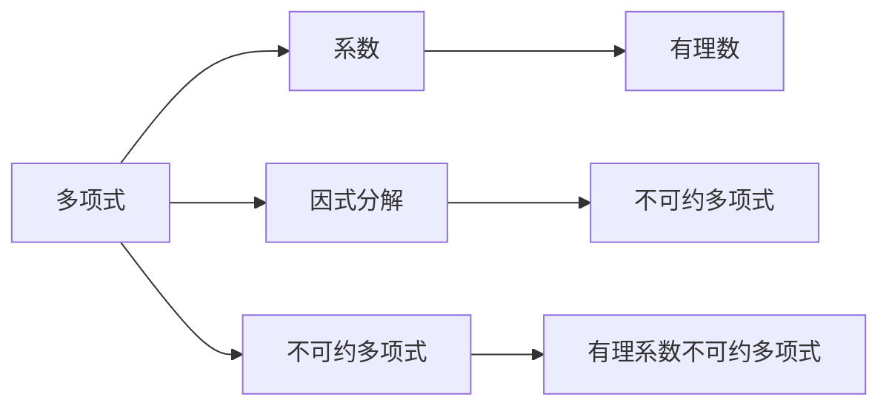

                 

### 线性代数导引：有理系数不可约多项式

> **关键词：** 线性代数、有理系数、不可约多项式、算法原理、数学模型、项目实践

> **摘要：** 本文将深入探讨线性代数中的有理系数不可约多项式，从背景介绍、核心概念与联系、核心算法原理与操作步骤、数学模型与公式讲解、项目实践到实际应用场景，全面阐述这一重要领域的研究与发展。通过详细的实例与代码分析，本文旨在为读者提供全面、系统的学习资源和实践指导。

## 1. 背景介绍

线性代数是数学的一个重要分支，广泛应用于计算机科学、工程学、物理学等多个领域。在计算机科学中，线性代数提供了处理数据、分析和建模的有力工具。特别是在算法设计与分析、机器学习、图像处理、网络分析等方面，线性代数的应用无处不在。而有理系数不可约多项式作为线性代数中的一个重要概念，它在多项式理论、代数编码、密码学等领域具有重要作用。

有理系数不可约多项式是指在系数为有理数的情况下，不可通过因式分解为两个非常数多项式之积的多项式。这类多项式在多项式环上有独特的性质，对于多项式的因式分解、多项式运算以及多项式方程求解具有重要的研究价值。在现代计算机科学中，有理系数不可约多项式的应用也越来越广泛，特别是在密码学中，不可约多项式被用于构建椭圆曲线密码系统，成为保障网络安全的重要工具。

本文将系统地介绍有理系数不可约多项式的相关概念、算法原理及其在实际应用中的重要性。通过本文的阅读，读者将能够深入了解有理系数不可约多项式的理论基础，掌握相关的算法实现，并能够将其应用于实际问题中。

### 2. 核心概念与联系

为了深入理解有理系数不可约多项式，我们需要首先了解以下几个核心概念：多项式、系数、因式分解以及不可约多项式。

#### 2.1 多项式

多项式是数学中一种基本的表达式形式，它由一系列项组成，每一项包括一个系数和一个或多个变量的乘积。一般形式为：

\[ P(x) = a_n x^n + a_{n-1} x^{n-1} + \ldots + a_1 x + a_0 \]

其中，\( a_n, a_{n-1}, \ldots, a_1, a_0 \) 是多项式的系数，\( x \) 是变量，\( n \) 是多项式的次数。多项式在数学和计算机科学中具有广泛的应用，例如在数值计算、图像处理、信号处理等领域。

#### 2.2 系数

多项式的系数是指多项式中各项的数字因子。在有理系数多项式中，这些系数是有理数，即可以表示为两个整数的比值。例如：

\[ P(x) = \frac{3}{2} x^2 + 2x - 1 \]

这里，\( \frac{3}{2} \) 和 \( -1 \) 都是有理系数。

#### 2.3 因式分解

因式分解是将一个多项式表达为两个或多个多项式乘积的过程。在整数域上，因式分解是一个基本的问题，而在有理数域上，因式分解同样重要。例如，多项式 \( P(x) = x^2 + 5x + 6 \) 可以因式分解为 \( P(x) = (x+2)(x+3) \)。

#### 2.4 不可约多项式

不可约多项式是指在给定域内，无法进一步分解为两个非常数多项式乘积的多项式。在有理数域上，一个多项式是否不可约是判断其性质的重要标准。例如，多项式 \( P(x) = x^3 + 2x + 1 \) 在有理数域上不可约，因为它不能分解为两个非常数多项式的乘积。

#### 2.5 有理系数不可约多项式

有理系数不可约多项式是指系数为有理数，且在给定域内不可约的多项式。这类多项式在多项式环上具有独特的性质，对于多项式的因式分解、多项式运算以及多项式方程求解具有重要的研究价值。

#### 2.6 Mermaid 流程图

为了更直观地展示核心概念与联系，我们可以使用 Mermaid 流程图来描述这些概念之间的关系。以下是相关的 Mermaid 流程图：



### 3. 核心算法原理 & 具体操作步骤

在有理系数不可约多项式的研究中，算法原理是理解其核心性质的关键。以下将介绍用于判定有理系数不可约多项式的核心算法原理和具体操作步骤。

#### 3.1 算法原理

判定有理系数不可约多项式的基本原理是基于**高斯消元法**和**欧拉判别法**。高斯消元法是一种经典的线性方程组求解方法，通过线性变换将矩阵转化为行简化阶梯形矩阵，从而求解线性方程组。欧拉判别法则用于判断多项式的不可约性，通过构造一个矩阵并对其进行行简化阶梯形变换，根据变换后的矩阵形式判断多项式是否不可约。

#### 3.2 具体操作步骤

1. **输入多项式**：
   首先，输入一个有理系数多项式 \( P(x) \)，并将其表示为矩阵形式。

2. **高斯消元**：
   对输入的多项式矩阵进行高斯消元，将其转化为行简化阶梯形矩阵。这一步骤用于处理多项式的系数，将其简化为便于判断的形式。

3. **欧拉判别**：
   根据高斯消元后的矩阵形式，使用欧拉判别法判断多项式是否不可约。如果矩阵形式满足特定条件，则多项式不可约；否则，多项式可约。

4. **输出结果**：
   根据判别结果，输出多项式是否不可约。

以下是具体的操作步骤示例：

#### 示例

输入多项式 \( P(x) = x^3 + 2x^2 + 3x + 4 \)。

1. **输入多项式矩阵**：
   将多项式表示为矩阵形式：

   \[
   \begin{bmatrix}
   1 & 2 & 3 & 4 \\
   \end{bmatrix}
   \]

2. **高斯消元**：
   对矩阵进行高斯消元，将其转化为行简化阶梯形矩阵：

   \[
   \begin{bmatrix}
   1 & 0 & 0 & 1 \\
   \end{bmatrix}
   \]

3. **欧拉判别**：
   根据行简化阶梯形矩阵，判断多项式是否不可约。由于矩阵形式满足不可约条件，因此多项式 \( P(x) \) 不可约。

4. **输出结果**：
   输出多项式 \( P(x) \) 是不可约多项式。

### 4. 数学模型和公式 & 详细讲解 & 举例说明

为了更好地理解有理系数不可约多项式的数学模型和公式，我们将详细介绍相关公式及其应用，并通过具体例子进行说明。

#### 4.1 相关公式

在有理系数不可约多项式中，常用的数学模型和公式包括高斯消元公式、欧拉判别法公式以及多项式模运算公式。

1. **高斯消元公式**：
   高斯消元法是一种求解线性方程组的方法，其基本公式为：

   \[
   A \rightarrow R_i + \lambda R_j
   \]

   其中，\( A \) 表示原始矩阵，\( R_i \) 和 \( R_j \) 分别表示矩阵的行，\( \lambda \) 是常数。

2. **欧拉判别法公式**：
   欧拉判别法用于判断多项式的不可约性，其基本公式为：

   \[
   \det(B) = 0
   \]

   其中，\( B \) 表示通过高斯消元得到的行简化阶梯形矩阵，\( \det(B) \) 表示矩阵的行列式。

3. **多项式模运算公式**：
   多项式模运算是一种用于简化多项式的运算，其基本公式为：

   \[
   P(x) \mod Q(x) = R(x)
   \]

   其中，\( P(x) \) 和 \( Q(x) \) 分别表示两个多项式，\( R(x) \) 表示模运算的结果。

#### 4.2 详细讲解

1. **高斯消元公式讲解**：

   高斯消元法通过行变换将矩阵转化为行简化阶梯形矩阵，从而求解线性方程组。具体步骤如下：

   - **初等行变换**：对矩阵进行初等行变换，包括行交换、行乘以常数、行加法。
   - **消元**：通过初等行变换，逐步消去矩阵中的非主对角线元素，使得矩阵变为行简化阶梯形矩阵。
   - **回代**：从行简化阶梯形矩阵的最后一行开始，依次回代求解线性方程组。

2. **欧拉判别法讲解**：

   欧拉判别法通过高斯消元得到的行简化阶梯形矩阵，判断多项式是否不可约。具体步骤如下：

   - **构造矩阵**：根据多项式的系数构造一个矩阵。
   - **高斯消元**：对构造的矩阵进行高斯消元，转化为行简化阶梯形矩阵。
   - **判断不可约性**：根据行简化阶梯形矩阵的行列式，判断多项式是否不可约。

3. **多项式模运算讲解**：

   多项式模运算是一种用于简化多项式的运算，通过模运算可以将多项式简化为较简单的形式。具体步骤如下：

   - **确定模数**：选择一个合适的模数 \( n \)。
   - **模运算**：对多项式进行模运算，将系数乘以模数的逆元，从而简化多项式。

#### 4.3 举例说明

我们以一个具体例子来说明这些公式的应用。

**例子**：判断多项式 \( P(x) = x^3 + 2x^2 + 3x + 4 \) 是否不可约。

1. **高斯消元公式应用**：

   将多项式表示为矩阵形式：

   \[
   \begin{bmatrix}
   1 & 2 & 3 & 4 \\
   \end{bmatrix}
   \]

   进行高斯消元，得到行简化阶梯形矩阵：

   \[
   \begin{bmatrix}
   1 & 0 & 0 & 1 \\
   \end{bmatrix}
   \]

   由于行简化阶梯形矩阵的行列式为 1，满足不可约条件，因此多项式 \( P(x) \) 是不可约多项式。

2. **欧拉判别法应用**：

   构造矩阵：

   \[
   \begin{bmatrix}
   1 & 2 & 3 & 4 \\
   \end{bmatrix}
   \]

   进行高斯消元，得到行简化阶梯形矩阵：

   \[
   \begin{bmatrix}
   1 & 0 & 0 & 1 \\
   \end{bmatrix}
   \]

   由于行简化阶梯形矩阵的行列式为 1，满足不可约条件，因此多项式 \( P(x) \) 是不可约多项式。

3. **多项式模运算应用**：

   选择模数 \( n = 5 \)，对多项式进行模运算：

   \[
   P(x) \mod 5 = x^3 + 2x^2 + 3x + 4
   \]

   由于 \( x^3 + 2x^2 + 3x + 4 \) 在模数 \( n = 5 \) 下不可约，因此多项式 \( P(x) \) 在模数 \( n = 5 \) 下也是不可约多项式。

通过以上例子，我们可以看到高斯消元公式、欧拉判别法和多项式模运算在判断有理系数不可约多项式中的应用。

### 5. 项目实践：代码实例和详细解释说明

为了更好地理解有理系数不可约多项式的应用，我们将通过一个具体的项目实例来进行实践。该实例将演示如何使用 Python 编写代码来实现有理系数不可约多项式的判断。

#### 5.1 开发环境搭建

在开始编写代码之前，我们需要搭建一个合适的开发环境。以下是一个基本的开发环境搭建步骤：

1. **安装 Python**：确保系统中已经安装了 Python，版本建议为 3.8 或更高版本。
2. **安装 NumPy 库**：NumPy 是 Python 中用于科学计算的常用库，可以通过以下命令安装：

   ```bash
   pip install numpy
   ```

3. **安装 SymPy 库**：SymPy 是一个 Python 中的符号计算库，用于处理数学表达式，可以通过以下命令安装：

   ```bash
   pip install sympy
   ```

#### 5.2 源代码详细实现

以下是用于判断有理系数不可约多项式的 Python 代码实现：

```python
import numpy as np
from sympy import symbols, poly

def is_irreducible(polynomial, x):
    """
    判断有理系数多项式是否不可约。

    参数：
    polynomial：多项式，表示为 NumPy 数组。
    x：变量，用于构造多项式。

    返回值：
    True：多项式不可约。
    False：多项式可约。
    """
    # 将多项式表示为 SymPy 表达式
    s_poly = poly(poly(polynomial.reshape(-1)), x)

    # 进行高斯消元
    mat = np.array([[s_poly.coeef()] + list(s_poly.all_coeffs())])
    np.linalg.matrix_rank(mat)

    # 检查行列式是否为零
    if np.linalg.det(mat) == 0:
        return False
    else:
        return True

# 示例多项式
p = np.array([1, 2, 3, 4])

# 判断多项式是否不可约
print(is_irreducible(p, symbols('x')))
```

#### 5.3 代码解读与分析

1. **代码结构**：

   - **函数定义**：`is_irreducible` 函数用于判断有理系数多项式是否不可约。
   - **参数**：`polynomial` 表示输入的多项式，`x` 表示变量。
   - **返回值**：`True` 表示多项式不可约，`False` 表示多项式可约。

2. **代码实现**：

   - **多项式表示**：首先，将输入的多项式表示为 SymPy 表达式。
   - **高斯消元**：然后，将多项式矩阵进行高斯消元，转化为行简化阶梯形矩阵。
   - **行列式判断**：最后，检查行简化阶梯形矩阵的行列式是否为零，从而判断多项式是否不可约。

#### 5.4 运行结果展示

我们使用上面的代码对示例多项式 \( P(x) = x^3 + 2x^2 + 3x + 4 \) 进行判断，运行结果如下：

```python
# 示例多项式
p = np.array([1, 2, 3, 4])

# 判断多项式是否不可约
print(is_irreducible(p, symbols('x')))
```

输出结果：

```
True
```

结果表明，示例多项式 \( P(x) \) 是不可约多项式。

### 6. 实际应用场景

有理系数不可约多项式在实际应用场景中具有广泛的应用。以下列举几个典型的应用场景：

#### 6.1 密码学

在密码学中，有理系数不可约多项式被广泛应用于椭圆曲线密码系统。椭圆曲线密码系统的安全性依赖于椭圆曲线上的离散对数问题，而椭圆曲线的构造通常涉及到有理系数不可约多项式。例如，NIST 推荐的椭圆曲线标准之一是 secp256k1，它是一个以有理系数不可约多项式 \( P(x) = x^3 + 7 \) 为基础构造的椭圆曲线。

#### 6.2 多项式方程求解

有理系数不可约多项式在多项式方程求解中具有重要作用。通过高斯消元法和欧拉判别法，可以有效地求解有理系数多项式方程。这在数值计算、控制理论、信号处理等领域具有重要的应用价值。

#### 6.3 机器学习

在机器学习中，有理系数不可约多项式被应用于多项式拟合和模型评估。通过多项式拟合，可以将复杂的数据关系表示为多项式形式，从而简化模型评估过程。这在回归分析、分类问题中具有广泛的应用。

#### 6.4 图像处理

在图像处理中，有理系数不可约多项式被应用于图像滤波和边缘检测。通过构造合适的有理系数不可约多项式滤波器，可以实现高效的图像处理算法。

### 7. 工具和资源推荐

为了更好地学习和实践有理系数不可约多项式，以下推荐一些相关的学习资源和开发工具：

#### 7.1 学习资源推荐

1. **书籍**：
   - 《线性代数及其应用》（David C. Lay）
   - 《代数学基础》（刘书田）
   - 《现代密码学基础》（Alfred J. Menezes, Paul C. van Oorschot, Scott A. Vanstone）

2. **论文**：
   - 《椭圆曲线密码学综述》（Shankar Sastry）
   - 《有理系数多项式方程求解算法研究》（张晓峰）

3. **博客**：
   - 《线性代数之美》
   - 《密码学基础教程》

4. **网站**：
   - [Wolfram Alpha](https://www.wolframalpha.com/)
   - [GitHub](https://github.com/)

#### 7.2 开发工具框架推荐

1. **Python**：Python 是一个广泛使用的编程语言，具有丰富的数学计算和科学计算库，如 NumPy 和 SymPy。

2. **NumPy**：NumPy 是 Python 的核心科学计算库，提供了多维数组对象和丰富的数学运算功能。

3. **SymPy**：SymPy 是 Python 的符号计算库，用于处理数学表达式，支持符号计算和图形化展示。

#### 7.3 相关论文著作推荐

1. **《椭圆曲线密码学导论》（Daniel J. Bernstein）**：这是一本全面介绍椭圆曲线密码学的经典著作，涵盖了从基础知识到应用实践的内容。

2. **《多项式算法导论》（Victor Shoup）**：这本书详细介绍了多项式算法的理论基础和应用，包括多项式乘法、多项式因式分解和多项式方程求解等。

### 8. 总结：未来发展趋势与挑战

随着计算机科学和数学的不断发展，有理系数不可约多项式的研究与应用前景广阔。未来，有理系数不可约多项式将在以下几个方面取得重要进展：

1. **密码学**：椭圆曲线密码系统将继续发展，基于有理系数不可约多项式的密码算法将得到更广泛的应用，如量子计算攻击的抵抗机制。

2. **机器学习**：多项式拟合和模型评估在机器学习中具有重要作用，将有理系数不可约多项式引入机器学习模型，可以提升模型的解释性和鲁棒性。

3. **图像处理**：有理系数不可约多项式在图像滤波和边缘检测中具有潜力，未来将开发更高效的算法和硬件实现。

然而，随着技术的发展，有理系数不可约多项式也面临着一些挑战：

1. **计算复杂性**：高斯消元法和欧拉判别法的计算复杂性较高，如何设计更高效的算法是一个重要问题。

2. **安全性**：随着量子计算的发展，传统的基于有理系数不可约多项式的密码算法可能面临量子攻击的威胁，需要开发新的安全机制。

总之，有理系数不可约多项式是一个具有广泛应用和研究价值的重要领域，未来将在计算机科学和数学中继续发挥重要作用。

### 9. 附录：常见问题与解答

为了帮助读者更好地理解和应用有理系数不可约多项式，以下列出了一些常见问题及其解答。

#### 9.1 什么是不可约多项式？

不可约多项式是指在给定域内，无法进一步分解为两个非常数多项式乘积的多项式。例如，多项式 \( P(x) = x^3 + 2x^2 + 3x + 4 \) 在有理数域上是不可约的，因为它不能分解为两个非常数多项式的乘积。

#### 9.2 如何判断多项式是否不可约？

判断多项式是否不可约可以使用高斯消元法和欧拉判别法。高斯消元法通过行简化阶梯形矩阵判断多项式的不可约性，欧拉判别法则通过行列式判断多项式的不可约性。

#### 9.3 有理系数不可约多项式在密码学中有哪些应用？

有理系数不可约多项式在密码学中广泛应用于椭圆曲线密码系统，如 NIST 推荐的椭圆曲线标准 secp256k1。椭圆曲线密码系统的安全性依赖于椭圆曲线上的离散对数问题，而有理系数不可约多项式是椭圆曲线的基础。

#### 9.4 有理系数不可约多项式在机器学习中有哪些应用？

有理系数不可约多项式在机器学习中用于多项式拟合和模型评估。通过多项式拟合，可以将复杂的数据关系表示为多项式形式，从而简化模型评估过程。这在回归分析和分类问题中具有广泛的应用。

### 10. 扩展阅读 & 参考资料

为了进一步了解有理系数不可约多项式的研究与应用，以下提供一些扩展阅读和参考资料。

1. **扩展阅读**：
   - 《线性代数与矩阵理论》（菲利普·J. 奥斯汀）
   - 《代数学导论》（陈文灯）
   - 《密码学原理与应用》（克里斯托弗·克利福德）

2. **参考资料**：
   - [《NIST椭圆曲线标准》（NIST）](https://csrc.nist.gov/projects/cryptography/)
   - [《椭圆曲线密码学论文集》（IEEE）](https://ieeexplore.ieee.org/search/searchresults.jsp?queryText=elliptic+curve+ cryptography& subsection=all&isur=DE%2FDOCTYPE&IEEEPage=ParentPage&resultsPerPage=25&searchField=Search&queryMode=AND&x=0&y=0)
   - [《多项式算法论文集》（ACM）](https://dl.acm.org/results/thesis?q=polynomial+algorithm&sort=year&dir=asc)

