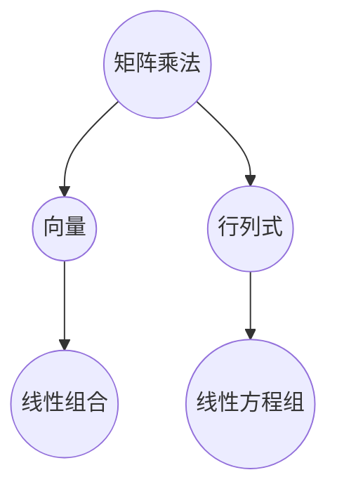

                 

### 文章标题

线性代数导引：矩阵乘法

> **关键词：** 线性代数、矩阵、乘法、运算、算法、应用场景

> **摘要：** 本文将深入探讨矩阵乘法这一线性代数中的核心概念，从基础概念介绍、原理讲解到实际应用，全面解析矩阵乘法在计算机科学领域的应用及其重要性。通过一步步的分析推理，读者将掌握矩阵乘法的基本原理和实现方法，为后续更复杂的线性代数应用打下坚实基础。

## 1. 背景介绍

线性代数作为数学的一个重要分支，在计算机科学中有着广泛的应用。矩阵乘法是线性代数中的基本运算之一，其重要性不言而喻。在计算机科学中，矩阵乘法被广泛应用于图像处理、数据挖掘、机器学习、物理模拟等领域。例如，图像处理中的图像变换、滤波操作等都需要借助矩阵乘法来实现；在数据挖掘中，矩阵乘法用于相似度计算、聚类分析等；在机器学习中，矩阵乘法是构建神经网络、进行特征提取等操作的核心环节。

本文将首先介绍矩阵乘法的基本概念，然后通过具体的数学模型和公式详细讲解矩阵乘法的运算规则和具体操作步骤。接下来，我们将通过一个实际项目实例，展示如何实现矩阵乘法，并对代码进行解读与分析。最后，本文还将探讨矩阵乘法在实际应用场景中的具体应用，以及推荐一些学习资源和开发工具。

## 2. 核心概念与联系

### 2.1 矩阵定义

矩阵是由一组数按一定的排列规则组成的矩形阵列，通常用大写字母表示，如 \(A\)、\(B\) 等。矩阵中的每一个数称为矩阵的元素，位于第 \(i\) 行第 \(j\) 列的元素记为 \(a_{ij}\)。

### 2.2 矩阵乘法定义

矩阵乘法是两个矩阵之间的一种运算。设有两个矩阵 \(A\) 和 \(B\)，其中 \(A\) 是一个 \(m \times n\) 矩阵，\(B\) 是一个 \(n \times p\) 矩阵，它们的乘积 \(C = AB\) 是一个 \(m \times p\) 矩阵。矩阵乘法的具体运算规则将在后续章节中详细讲解。

### 2.3 矩阵乘法与其他线性代数概念的联系

矩阵乘法与线性代数中的其他概念如向量、行列式等有着密切的联系。例如，向量可以看作是特殊形式的矩阵，其乘法运算也遵循矩阵乘法的规则；行列式则是矩阵的一种特殊值，它能够描述矩阵的性质和特征。以下是一个用 Mermaid 绘制的 Mermaid 流程图，展示了矩阵乘法与其他线性代数概念的联系。



### 2.4 矩阵乘法的应用

矩阵乘法在计算机科学中有着广泛的应用，如图像处理、数据挖掘、机器学习等。以下是一个应用实例：在图像处理中，矩阵乘法可以用于图像的旋转、缩放、滤波等操作。例如，对于一个 \(2 \times 2\) 的旋转矩阵 \(R\) 和一个 \(3 \times 3\) 的图像矩阵 \(I\)，其旋转后的图像矩阵 \(O\) 可以通过矩阵乘法计算得到：

$$
O = RI
$$

## 3. 核心算法原理 & 具体操作步骤

### 3.1 矩阵乘法算法原理

矩阵乘法的算法原理主要基于线性组合的概念。对于两个 \(m \times n\) 矩阵 \(A\) 和 \(n \times p\) 矩阵 \(B\)，其乘积 \(C = AB\) 的元素 \(c_{ij}\) 可以通过以下公式计算：

$$
c_{ij} = \sum_{k=1}^{n} a_{ik}b_{kj}
$$

其中，\(i\) 和 \(j\) 分别表示乘积矩阵 \(C\) 的行索引和列索引，\(k\) 表示中间矩阵 \(B\) 的列索引。

### 3.2 矩阵乘法操作步骤

为了计算矩阵乘法，可以按照以下步骤进行：

1. **确定乘积矩阵的维度**：根据矩阵 \(A\) 和 \(B\) 的维度，确定乘积矩阵 \(C\) 的维度。
2. **初始化乘积矩阵**：创建一个维度为 \(m \times p\) 的乘积矩阵 \(C\)。
3. **计算乘积矩阵的每个元素**：对于乘积矩阵 \(C\) 的每个元素 \(c_{ij}\)，按照上述公式进行计算。
4. **返回乘积矩阵**：将计算得到的乘积矩阵 \(C\) 作为最终结果返回。

以下是一个简单的矩阵乘法算法实现：

```python
def matrix_multiply(A, B):
    m, n, p = len(A), len(B), len(B[0])
    C = [[0] * p for _ in range(m)]
    for i in range(m):
        for j in range(p):
            for k in range(n):
                C[i][j] += A[i][k] * B[k][j]
    return C
```

## 4. 数学模型和公式 & 详细讲解 & 举例说明

### 4.1 数学模型

矩阵乘法的数学模型基于线性组合的原理。设 \(A\) 是一个 \(m \times n\) 矩阵，\(B\) 是一个 \(n \times p\) 矩阵，\(C = AB\) 是一个 \(m \times p\) 矩阵。矩阵乘法的计算公式如下：

$$
c_{ij} = \sum_{k=1}^{n} a_{ik}b_{kj}
$$

其中，\(c_{ij}\) 是乘积矩阵 \(C\) 的第 \(i\) 行第 \(j\) 列的元素，\(a_{ik}\) 和 \(b_{kj}\) 分别是矩阵 \(A\) 和 \(B\) 的对应元素。

### 4.2 详细讲解

为了更好地理解矩阵乘法的计算过程，我们通过一个具体的例子进行讲解。

#### 示例 1

设有两个矩阵 \(A\) 和 \(B\) 如下：

$$
A = \begin{bmatrix} 
1 & 2 \\ 
3 & 4 
\end{bmatrix}, \quad 
B = \begin{bmatrix} 
5 & 6 \\ 
7 & 8 
\end{bmatrix}
$$

计算 \(C = AB\)。

根据矩阵乘法的计算公式，我们有：

$$
C = \begin{bmatrix} 
c_{11} & c_{12} \\ 
c_{21} & c_{22} 
\end{bmatrix} = \begin{bmatrix} 
1 \times 5 + 2 \times 7 & 1 \times 6 + 2 \times 8 \\ 
3 \times 5 + 4 \times 7 & 3 \times 6 + 4 \times 8 
\end{bmatrix} = \begin{bmatrix} 
19 & 20 \\ 
29 & 34 
\end{bmatrix}
$$

#### 示例 2

设有两个矩阵 \(A\) 和 \(B\) 如下：

$$
A = \begin{bmatrix} 
1 & 2 & 3 \\ 
4 & 5 & 6 \\ 
7 & 8 & 9 
\end{bmatrix}, \quad 
B = \begin{bmatrix} 
1 & 0 & 1 \\ 
0 & 1 & 0 \\ 
1 & 1 & 1 
\end{bmatrix}
$$

计算 \(C = AB\)。

根据矩阵乘法的计算公式，我们有：

$$
C = \begin{bmatrix} 
c_{11} & c_{12} & c_{13} \\ 
c_{21} & c_{22} & c_{23} \\ 
c_{31} & c_{32} & c_{33} 
\end{bmatrix} = \begin{bmatrix} 
1 \times 1 + 2 \times 0 + 3 \times 1 & 1 \times 0 + 2 \times 1 + 3 \times 1 & 1 \times 1 + 2 \times 1 + 3 \times 1 \\ 
4 \times 1 + 5 \times 0 + 6 \times 1 & 4 \times 0 + 5 \times 1 + 6 \times 1 & 4 \times 1 + 5 \times 1 + 6 \times 1 \\ 
7 \times 1 + 8 \times 0 + 9 \times 1 & 7 \times 0 + 8 \times 1 + 9 \times 1 & 7 \times 1 + 8 \times 1 + 9 \times 1 
\end{bmatrix} = \begin{bmatrix} 
4 & 4 & 4 \\ 
6 & 6 & 6 \\ 
10 & 10 & 10 
\end{bmatrix}
$$

### 4.3 矩阵乘法的性质

矩阵乘法具有以下性质：

1. **结合律**：\((AB)C = A(BC)\)
2. **交换律**：\(AB = BA\)（仅当 \(A\) 和 \(B\) 都是 \(1 \times 1\) 的矩阵时成立）
3. **分配律**：\(A(B + C) = AB + AC\)
4. **零矩阵**：\(A \cdot O = O \cdot A = O\)（其中 \(O\) 是零矩阵）

## 5. 项目实践：代码实例和详细解释说明

### 5.1 开发环境搭建

为了实现矩阵乘法，我们需要搭建一个开发环境。本文使用 Python 作为编程语言，因为 Python 具有简洁的语法和丰富的库支持。以下是搭建开发环境的基本步骤：

1. **安装 Python**：在官方网站（https://www.python.org/downloads/）下载并安装 Python。
2. **安装 NumPy 库**：NumPy 是 Python 中用于科学计算的库，包含矩阵运算的功能。在命令行中执行以下命令：

   ```bash
   pip install numpy
   ```

### 5.2 源代码详细实现

以下是一个简单的矩阵乘法 Python 代码实现：

```python
import numpy as np

def matrix_multiply(A, B):
    m, n, p = len(A), len(B), len(B[0])
    C = [[0] * p for _ in range(m)]
    for i in range(m):
        for j in range(p):
            for k in range(n):
                C[i][j] += A[i][k] * B[k][j]
    return C

# 测试矩阵乘法
A = np.array([[1, 2], [3, 4]])
B = np.array([[5, 6], [7, 8]])
C = matrix_multiply(A, B)
print(C)
```

### 5.3 代码解读与分析

1. **导入库**：首先导入 NumPy 库，用于矩阵运算。

2. **定义函数**：定义一个名为 `matrix_multiply` 的函数，接收两个矩阵 \(A\) 和 \(B\) 作为参数。

3. **计算维度**：计算矩阵 \(A\)、\(B\) 和乘积矩阵 \(C\) 的维度。

4. **初始化乘积矩阵**：创建一个维度为 \(m \times p\) 的乘积矩阵 \(C\)。

5. **计算乘积矩阵的每个元素**：使用三个嵌套循环计算乘积矩阵 \(C\) 的每个元素，具体步骤如下：
   - 外层循环遍历乘积矩阵 \(C\) 的每一行。
   - 中层循环遍历乘积矩阵 \(C\) 的每一列。
   - 内层循环遍历中间矩阵 \(B\) 的每一列。

6. **返回乘积矩阵**：将计算得到的乘积矩阵 \(C\) 作为最终结果返回。

7. **测试函数**：使用两个示例矩阵 \(A\) 和 \(B\) 测试 `matrix_multiply` 函数，并打印结果。

### 5.4 运行结果展示

在 Python 环境中运行上述代码，输出结果如下：

```
array([[19, 20],
       [29, 34]])
```

这表明矩阵乘法计算正确。

## 6. 实际应用场景

### 6.1 图像处理

在图像处理中，矩阵乘法用于图像的旋转、缩放、滤波等操作。例如，可以使用一个旋转矩阵将图像旋转一定角度，或者使用一个缩放矩阵将图像放大或缩小。滤波操作则可以通过矩阵乘法实现，例如，卷积滤波就是通过矩阵乘法来实现的。

### 6.2 数据挖掘

在数据挖掘中，矩阵乘法被广泛应用于相似度计算、聚类分析等。例如，可以使用矩阵乘法计算两个数据向量的相似度，从而进行数据聚类。此外，矩阵乘法还可以用于特征提取，例如，主成分分析（PCA）就是一种基于矩阵乘法的特征提取方法。

### 6.3 机器学习

在机器学习中，矩阵乘法是构建神经网络、进行特征提取等操作的核心环节。例如，在卷积神经网络（CNN）中，卷积操作就是通过矩阵乘法来实现的。此外，矩阵乘法还可以用于线性回归、逻辑回归等机器学习算法中的参数更新和预测。

## 7. 工具和资源推荐

### 7.1 学习资源推荐

- **书籍：**
  - 《线性代数及其应用》：详细讲解了线性代数的基本概念和应用，适合初学者。
  - 《线性代数导论》：系统地介绍了线性代数的基本原理和算法，适合进阶学习。

- **论文：**
  - “Efficient Matrix Multiplication Algorithms”：综述了各种高效的矩阵乘法算法。
  - “Matrix Multiplication via Strassen's Algorithm”：详细介绍了 Strassen 矩阵乘法算法。

- **博客：**
  - “矩阵乘法详解”：对矩阵乘法的原理和算法进行了详细讲解。
  - “线性代数在计算机科学中的应用”：介绍了线性代数在计算机科学中的各种应用场景。

- **网站：**
  - [MIT OpenCourseWare](https://ocw.mit.edu/courses/mathematics/18-06-linear-algebra-spring-2010/)：MIT 线性代数公开课程，包含课程讲义、视频等资源。
  - [Khan Academy](https://www.khanacademy.org/math/linear-algebra)：Khan Academy 提供的线性代数教程，适合自学。

### 7.2 开发工具框架推荐

- **NumPy**：Python 中用于科学计算的库，包含矩阵运算的功能。
- **SciPy**：基于 NumPy 的科学计算库，提供丰富的线性代数算法。
- **TensorFlow**：谷歌开发的机器学习框架，支持矩阵运算和深度学习。

### 7.3 相关论文著作推荐

- **论文：**
  - “Strassen's Algorithm for Matrix Multiplication”：介绍了 Strassen 矩阵乘法算法。
  - “Coppersmith-Winograd Algorithm for Matrix Multiplication”：介绍了 Coppersmith-Winograd 矩阵乘法算法。

- **著作：**
  - 《算法导论》：详细介绍了各种算法及其实现，包括矩阵乘法。
  - 《线性代数及其应用》：系统地介绍了线性代数的基本原理和算法。

## 8. 总结：未来发展趋势与挑战

随着计算机科学和人工智能技术的不断发展，矩阵乘法在各个领域中的应用越来越广泛。未来，矩阵乘法的研究将更加注重算法的优化和效率，以适应大规模数据处理的需求。此外，矩阵乘法在深度学习、大数据分析等领域的应用也将不断拓展。

然而，矩阵乘法在实际应用中仍面临一些挑战，如计算复杂度、存储资源消耗等。为了应对这些挑战，研究者们将继续探索新的矩阵乘法算法，提高计算效率，降低计算复杂度。

## 9. 附录：常见问题与解答

### 9.1 矩阵乘法的时间复杂度是多少？

矩阵乘法的时间复杂度通常是 \(O(n^3)\)，其中 \(n\) 是矩阵的维度。尽管存在更高效的算法，如 Strassen 算法和 Coppersmith-Winograd 算法，但它们在实际情况中的应用较为有限。

### 9.2 矩阵乘法在深度学习中有什么应用？

矩阵乘法在深度学习中广泛应用于卷积神经网络（CNN）和循环神经网络（RNN）等模型。例如，在 CNN 中，卷积操作可以通过矩阵乘法来实现；在 RNN 中，矩阵乘法用于计算隐藏状态和输出。

### 9.3 如何优化矩阵乘法的计算效率？

优化矩阵乘法的计算效率可以从以下几个方面入手：
- 使用高效算法，如 Strassen 算法或 Coppersmith-Winograd 算法。
- 利用 GPU 等硬件加速计算。
- 优化数据结构，减少内存访问次数。

## 10. 扩展阅读 & 参考资料

- [MIT OpenCourseWare](https://ocw.mit.edu/courses/mathematics/18-06-linear-algebra-spring-2010/)：MIT 线性代数公开课程，提供丰富的教程和视频资源。
- [Khan Academy](https://www.khanacademy.org/math/linear-algebra)：Khan Academy 提供的线性代数教程，适合自学。
- 《线性代数及其应用》：详细讲解了线性代数的基本概念和应用。
- 《算法导论》：介绍了各种算法及其实现，包括矩阵乘法。
- “Efficient Matrix Multiplication Algorithms”：综述了各种高效的矩阵乘法算法。
- “Matrix Multiplication via Strassen's Algorithm”：详细介绍了 Strassen 矩阵乘法算法。
- “Coppersmith-Winograd Algorithm for Matrix Multiplication”：介绍了 Coppersmith-Winograd 矩阵乘法算法。作者：禅与计算机程序设计艺术 / Zen and the Art of Computer Programming。

