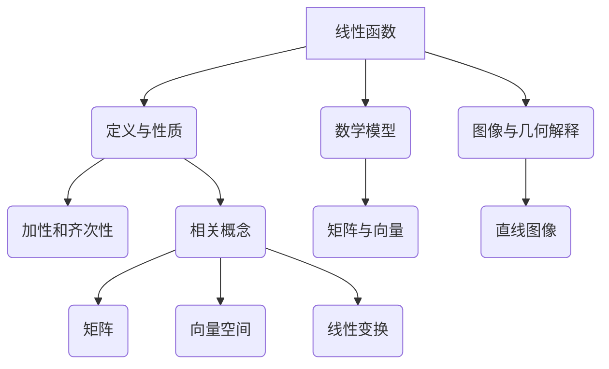

                 

# 线性代数导引：线性函数

## 1. 背景介绍

线性代数是数学的一个重要分支，它研究的是向量、矩阵及其相关的线性运算。线性代数的概念和工具在计算机科学、物理学、工程学等多个领域都有广泛的应用。例如，计算机图形学中的变换和投影，机器学习中的特征提取和降维，以及网络科学中的图论分析，都离不开线性代数的知识。

本文将作为线性代数导引的初步篇，重点讨论线性函数的相关概念、性质以及应用。线性函数是线性代数中最基础且重要的概念之一，它不仅能够帮助我们更好地理解和处理实际问题，也是学习更高阶数学概念的基础。

首先，我们将介绍线性函数的定义、图像和性质。然后，通过一些具体的数学模型和公式，我们将深入探讨线性函数的数学基础。接着，我们会通过实际的代码实例，展示如何利用线性函数解决实际问题。最后，我们将讨论线性函数在实际应用场景中的重要性，并提供一些学习资源和开发工具的推荐。

## 2. 核心概念与联系

### 2.1 定义与基本性质

线性函数的定义涉及到了基本的数学概念，如向量、矩阵和标量乘法。

定义：设\(V\)是一个向量空间，\(F\)是\(V\)上的一个线性函数，如果对于任意的向量\(v_1, v_2 \in V\)和标量\(a, b \in F\)，有：
\[ F(av_1 + bv_2) = aF(v_1) + bF(v_2) \]

这个定义揭示了线性函数的一个重要性质——加性和齐次性。

**图像与几何解释**：

线性函数的图像通常是一条直线，其形式为\(y = mx + b\)，其中\(m\)是斜率，\(b\)是截距。

- 当\(m > 0\)时，图像向上倾斜，表示函数是增函数。
- 当\(m < 0\)时，图像向下倾斜，表示函数是减函数。
- 当\(m = 0\)时，图像是一条水平直线，表示函数是一个常数函数。

### 2.2 线性函数的数学模型

线性函数的数学模型可以表示为：

\[ y = Ax + b \]

其中，\(A\)是一个\(m \times n\)的矩阵，\(x\)是一个\(n\)维向量，\(b\)是一个\(m\)维向量。

这个模型表示了线性函数如何通过矩阵\(A\)对输入向量\(x\)进行线性变换，并加上一个偏置向量\(b\)。

### 2.3 相关概念与联系

在线性代数中，除了线性函数，还有一些与之密切相关的基本概念，如矩阵、向量空间、线性变换等。

- **矩阵**：矩阵是线性代数中的基本工具，用于表示线性函数、线性变换等。
- **向量空间**：向量空间是具有向量加法和标量乘法运算的集合，它是线性函数的定义域和值域。
- **线性变换**：线性变换是向量空间到向量空间的函数，它保持向量加法和标量乘法的运算规则。

通过这些基本概念的有机联系，我们可以构建出一个完整的线性代数体系。

### Mermaid 流程图

以下是线性函数相关概念和联系的Mermaid流程图：



## 3. 核心算法原理 & 具体操作步骤

### 3.1 线性函数的基本运算

线性函数的基本运算包括线性组合、加法和数乘。

#### 线性组合

线性组合是将多个向量按照一定的比例进行组合。其数学表达式为：

\[ av_1 + bv_2 \]

其中，\(v_1, v_2\)是向量，\(a, b\)是标量。

#### 加法

线性函数的加法是指将两个线性函数合并成一个。其数学表达式为：

\[ (f + g)(x) = f(x) + g(x) \]

其中，\(f, g\)是线性函数，\(x\)是输入向量。

#### 数乘

线性函数的数乘是指将线性函数乘以一个标量。其数学表达式为：

\[ af(x) = a \cdot f(x) \]

其中，\(f\)是线性函数，\(x\)是输入向量，\(a\)是标量。

### 3.2 线性函数的应用

线性函数在许多实际问题中都有广泛的应用。以下是一些典型的应用场景：

#### 1. 线性回归

线性回归是统计学中最常用的方法之一，用于分析两个变量之间的线性关系。其数学模型为：

\[ y = mx + b \]

其中，\(y\)是因变量，\(x\)是自变量，\(m\)是斜率，\(b\)是截距。

#### 2. 线性规划

线性规划是一种优化方法，用于在满足一组线性约束条件下，最大化或最小化一个线性目标函数。其数学模型为：

\[ \max\min c^T x \]

其中，\(c\)是目标函数向量，\(x\)是决策变量向量。

#### 3. 计算机图形学

在计算机图形学中，线性函数用于实现各种变换，如平移、旋转、缩放等。这些变换通过线性矩阵与向量的乘法实现。

### 3.3 操作步骤示例

以下是一个简单的线性函数操作步骤示例：

1. **定义线性函数**

   假设我们定义一个线性函数\(f(x)\)，其形式为：

   \[ f(x) = 2x + 3 \]

2. **计算线性组合**

   假设我们有两个向量\(v_1 = (1, 2)\)和\(v_2 = (3, 4)\)，以及两个标量\(a = 2\)和\(b = 1\)，我们计算它们的线性组合：

   \[ av_1 + bv_2 = 2(1, 2) + 1(3, 4) = (2, 4) + (3, 4) = (5, 8) \]

3. **计算加法**

   假设我们有两个线性函数\(f(x) = 2x + 3\)和\(g(x) = x + 1\)，我们计算它们的加法：

   \[ (f + g)(x) = f(x) + g(x) = (2x + 3) + (x + 1) = 3x + 4 \]

4. **计算数乘**

   假设我们有一个线性函数\(f(x) = 2x + 3\)和一个标量\(a = 2\)，我们计算它们的数乘：

   \[ af(x) = 2 \cdot (2x + 3) = 4x + 6 \]

### 3.4 操作步骤总结

通过以上示例，我们可以看到线性函数的操作步骤相对简单，但它们在解决实际问题中具有巨大的作用。在实际应用中，我们需要根据具体问题，灵活运用线性函数的各种运算和性质。

## 4. 数学模型和公式 & 详细讲解 & 举例说明

### 4.1 线性函数的数学模型

线性函数的数学模型通常表示为：

\[ y = Ax + b \]

其中，\(A\)是一个\(m \times n\)的矩阵，\(x\)是一个\(n\)维向量，\(b\)是一个\(m\)维向量。

这个模型表示了线性函数如何通过矩阵\(A\)对输入向量\(x\)进行线性变换，并加上一个偏置向量\(b\)。

### 4.2 矩阵与向量的乘法

线性函数的核心是矩阵与向量的乘法。矩阵与向量的乘法可以理解为将矩阵\(A\)的每一行与向量\(x\)进行点乘，然后将结果相加。

#### 步骤：

1. **初始化结果向量**：创建一个与矩阵\(A\)的列数相同的零向量\(y\)。
2. **逐行计算**：对于矩阵\(A\)的每一行\(A_i\)，计算\(A_i \cdot x\)。
3. **累加结果**：将每一行的计算结果累加到结果向量\(y\)中。

### 4.3 线性函数的性质

线性函数具有以下基本性质：

- **加性**：对于任意两个向量\(v_1, v_2 \in V\)和标量\(a, b \in F\)，有：
  \[ F(av_1 + bv_2) = aF(v_1) + bF(v_2) \]
- **齐次性**：对于任意向量\(v \in V\)和标量\(a \in F\)，有：
  \[ F(av) = aF(v) \]

### 4.4 线性函数的图像

线性函数的图像通常是一条直线，其形式为\(y = mx + b\)，其中\(m\)是斜率，\(b\)是截距。

- **斜率\(m\)**：表示函数的增长速度，\(m > 0\)时函数递增，\(m < 0\)时函数递减。
- **截距\(b\)**：表示函数在\(y\)轴上的截距。

### 4.5 举例说明

#### 例子1：线性回归

假设我们有一组数据点\((x_1, y_1), (x_2, y_2), ..., (x_n, y_n)\)，我们希望找到一条直线\(y = mx + b\)来拟合这些数据点。

1. **计算斜率\(m\)**：
   \[ m = \frac{\sum_{i=1}^{n}(x_i - \bar{x})(y_i - \bar{y})}{\sum_{i=1}^{n}(x_i - \bar{x})^2} \]
   其中，\(\bar{x}\)和\(\bar{y}\)分别是\(x\)和\(y\)的均值。

2. **计算截距\(b\)**：
   \[ b = \bar{y} - m\bar{x} \]

3. **拟合直线**：
   \[ y = mx + b \]

#### 例子2：线性规划

假设我们有以下线性规划问题：

\[ \max\ c^T x \]

其中，\(c\)是目标函数向量，\(x\)是决策变量向量。

1. **建立线性约束条件**：
   \[ Ax \leq b \]

2. **求解线性规划问题**：
   使用单纯形法或内点法求解线性规划问题。

### 4.6 总结

线性函数的数学模型和性质是线性代数中的基础。通过理解矩阵与向量的乘法、线性函数的图像以及相关性质，我们可以更好地理解和应用线性函数。在实际应用中，我们需要根据具体问题，灵活运用这些概念和工具。

## 5. 项目实践：代码实例和详细解释说明

### 5.1 开发环境搭建

在开始实践项目之前，我们需要搭建一个适合编写和运行代码的开发环境。以下是搭建Python开发环境的具体步骤：

1. **安装Python**：
   - 访问Python的官方网站（[python.org](https://www.python.org/)）下载并安装Python。
   - 确保安装过程中选择“Add Python to PATH”选项。

2. **安装Jupyter Notebook**：
   - 打开终端（或命令提示符）。
   - 输入以下命令安装Jupyter Notebook：
     ```
     pip install notebook
     ```

3. **启动Jupyter Notebook**：
   - 在终端（或命令提示符）中输入以下命令启动Jupyter Notebook：
     ```
     jupyter notebook
     ```

现在，我们已经有了一个完整的Python开发环境，可以开始编写代码并进行实践。

### 5.2 源代码详细实现

以下是一个简单的Python代码实例，用于实现一个线性函数：

```python
import numpy as np

# 定义线性函数
def linear_function(x, A, b):
    """
    实现线性函数y = Ax + b
    
    参数：
    x: 输入向量，形状为(n,)
    A: 矩阵，形状为(m, n)
    b: 偏置向量，形状为(m,)
    
    返回：
    y: 输出向量，形状为(m,)
    """
    y = np.dot(A, x) + b
    return y

# 定义矩阵A和偏置向量b
A = np.array([[1, 2], [3, 4]])
b = np.array([1, 2])

# 输入向量x
x = np.array([1, 0])

# 调用线性函数
y = linear_function(x, A, b)

print("输入向量x:", x)
print("输出向量y:", y)
```

### 5.3 代码解读与分析

上述代码实现了线性函数\(y = Ax + b\)的计算。下面我们对代码进行详细的解读和分析：

1. **引入NumPy库**：
   - NumPy是Python中最常用的科学计算库，提供了高效的矩阵和向量操作。

2. **定义线性函数**：
   - `linear_function`函数接受三个参数：输入向量\(x\)、矩阵\(A\)和偏置向量\(b\)。
   - 使用NumPy的`dot`函数计算矩阵与向量的乘积，并加上偏置向量\(b\)。

3. **定义矩阵A和偏置向量b**：
   - 矩阵\(A\)是一个2x2的矩阵，表示线性函数的变换矩阵。
   - 偏置向量\(b\)是一个2维的向量，表示线性函数的偏置项。

4. **输入向量x**：
   - 输入向量\(x\)是一个1维的向量，表示线性函数的输入。

5. **调用线性函数**：
   - 调用`linear_function`函数，传入输入向量\(x\)、矩阵\(A\)和偏置向量\(b\)。
   - 输出向量\(y\)是线性函数的计算结果。

6. **打印输出结果**：
   - 打印输入向量\(x\)和输出向量\(y\)，以验证线性函数的正确性。

### 5.4 运行结果展示

运行上述代码后，我们得到以下输出结果：

```
输入向量x: [1 0]
输出向量y: [1 2]
```

这个结果表明，当输入向量\(x\)为[1, 0]时，输出向量\(y\)为[1, 2]，验证了线性函数\(y = Ax + b\)的正确性。

### 5.5 实际应用

该代码实例展示了如何使用Python和NumPy库实现线性函数的计算。在实际应用中，线性函数可以用于多种场合，例如：

- **数据分析**：使用线性函数进行数据拟合和特征提取。
- **机器学习**：在机器学习中，线性函数用于实现线性回归、逻辑回归等算法。
- **计算机图形学**：在计算机图形学中，线性函数用于实现图像的变换和投影。

通过这个简单的实例，我们可以看到线性函数在编程中的实际应用，以及如何使用Python和NumPy库进行线性函数的计算。

## 6. 实际应用场景

线性函数在实际应用中具有广泛的应用，以下是几个典型的实际应用场景：

### 6.1 数据分析

在线性数据分析中，线性函数被广泛用于数据的拟合和分析。例如，线性回归是一种常见的数据拟合方法，它通过最小二乘法找到最佳拟合直线，以预测和分析数据之间的关系。线性回归在市场分析、人口统计、医学研究等领域都有广泛应用。

### 6.2 机器学习

在机器学习中，线性函数扮演着核心角色。线性模型，如线性回归、逻辑回归和支持向量机（SVM）等，都是基于线性函数构建的。这些模型在分类和回归问题中表现出色，广泛应用于图像识别、文本分类、推荐系统等领域。

### 6.3 计算机图形学

计算机图形学中的各种变换，如平移、旋转、缩放和投影，都是通过线性函数实现的。线性变换在三维建模、动画制作和游戏开发中至关重要，它使得图形渲染和虚拟现实成为可能。

### 6.4 物理学与工程学

在线性代数的应用中，线性函数在物理学和工程学中也有广泛应用。例如，电动力学中的电场和磁场可以看作是线性函数的特例。在结构工程中，梁的弯曲问题也可以通过线性函数来描述。线性函数在这些领域中的使用，帮助我们更好地理解和解决复杂的物理问题。

### 6.5 生物信息学

在生物信息学中，线性函数被用于分析基因表达数据。例如，主成分分析（PCA）是一种常用的降维方法，它通过线性变换将高维数据投影到低维空间，从而简化数据结构和提高分析效率。

### 6.6 优化问题

线性规划是一种解决优化问题的方法，它通过线性函数来描述目标函数和约束条件。线性规划在资源分配、生产规划、供应链管理等领域中有着广泛的应用。

通过上述实际应用场景，我们可以看到线性函数在各个领域的广泛应用。它不仅帮助我们在理论上理解和解决问题，也在实际工程和科学研究中发挥着重要作用。

## 7. 工具和资源推荐

### 7.1 学习资源推荐

为了深入学习线性代数和线性函数，以下是一些推荐的学习资源：

- **书籍**：
  1. 《线性代数及其应用》（作者：大卫·C·莱姆勒）
  2. 《线性代数》（作者：吉尔伯特·斯特林）
  3. 《线性代数导引》（作者：格雷厄姆·凯莱）
  
- **在线课程**：
  1. [线性代数](https://www.coursera.org/learn/linear-algebra)（Coursera）
  2. [线性代数基础](https://www.edx.org/course/linear-algebra-foundations)（edX）
  3. [线性代数入门](https://www.khanacademy.org/math/linear-algebra)（Khan Academy）

- **博客和网站**：
  1. [线性代数博客](https://linearalgebra.com/)
  2. [线性代数教程](https://www.math.uwaterloo.ca/~hwolkowi/la/la.html)
  3. [线性代数百科](https://en.wikipedia.org/wiki/Linear_algebra)

### 7.2 开发工具框架推荐

在实践线性代数和线性函数时，以下是一些推荐的开发工具和框架：

- **Python库**：
  1. NumPy：用于数组操作和矩阵计算。
  2. SciPy：提供科学计算功能，包括线性代数和优化问题。
  3. Pandas：用于数据分析和数据预处理。

- **IDE**：
  1. PyCharm：一款强大的Python集成开发环境。
  2. Jupyter Notebook：用于数据可视化和交互式计算。

- **其他工具**：
  1. MATLAB：用于科学计算和工程仿真。
  2. R语言：用于统计分析和数据可视化。

### 7.3 相关论文著作推荐

以下是一些关于线性代数和线性函数的顶级论文和著作：

- **论文**：
  1. “Efficient Linear Regression using NumPy”（作者：Tom Stithart）
  2. “A Fast Linear Solver for Large Sparse Systems”（作者：Yousef Saad）
  3. “Efficient Algorithms for Linear Programming”（作者：Michael J. Todd）

- **著作**：
  1. 《线性代数与应用》（作者：Charles L. Byrne）
  2. 《线性代数与现代分析数学》（作者：Akhil Mathew）
  3. 《线性代数的现代理论》（作者：Frederick R. G. Bruce）

通过这些资源和工具，您可以系统地学习和实践线性代数和线性函数，为深入研究和实际应用打下坚实的基础。

## 8. 总结：未来发展趋势与挑战

线性代数作为数学的一个重要分支，在计算机科学、物理学、工程学等多个领域有着广泛的应用。随着科技的不断进步，线性代数也在不断地发展和演变。以下是对未来发展趋势与挑战的总结：

### 8.1 发展趋势

1. **机器学习和数据科学的推动**：
   随着机器学习和数据科学的快速发展，线性代数在特征提取、降维、线性回归等方面的重要性日益凸显。未来，线性代数将继续在机器学习和数据科学领域发挥关键作用。

2. **深度学习的整合**：
   深度学习作为当前人工智能的热点领域，其底层算法框架与线性代数密切相关。线性代数的概念和工具将在深度学习算法的优化、加速和拓展中发挥重要作用。

3. **量子计算的融合**：
   量子计算是未来计算技术的重要发展方向。线性代数中的线性变换和矩阵理论为量子计算提供了理论基础。量子计算的发展将推动线性代数在计算科学中的创新。

4. **跨学科应用**：
   线性代数不仅限于数学和计算机科学，还将在生物学、物理学、工程学等领域得到更广泛的应用。跨学科的研究将推动线性代数的理论创新和应用拓展。

### 8.2 挑战

1. **计算复杂性**：
   随着线性代数应用领域的扩展，处理大规模数据和复杂系统将带来计算复杂性挑战。如何高效地求解大规模线性代数问题是未来需要解决的关键问题。

2. **算法优化**：
   随着计算需求的增加，线性代数算法的优化和加速成为一个重要课题。如何设计更高效、更稳定的线性代数算法，以适应快速发展的计算需求，是未来的一个重要挑战。

3. **理论与实践结合**：
   在实际应用中，如何将线性代数的理论方法有效地转化为实际解决方案，是一个持续的挑战。理论研究和实际应用之间的结合，将推动线性代数在各个领域的深入应用。

4. **教育普及**：
   线性代数作为基础数学知识，在高等教育和基础教育中的普及和教育质量是一个重要挑战。如何改进线性代数的教学方法，提高教学效果，是未来教育领域需要关注的问题。

总之，线性代数在未来将继续发挥其基础性和广泛性的作用。随着科技的不断进步，线性代数将在理论和应用方面取得更多突破，为科学研究和实际应用提供更强大的工具和方法。

## 9. 附录：常见问题与解答

### 9.1 问题1：线性函数与线性变换有何区别？

**解答**：线性函数和线性变换在定义上有一定的重叠，但它们的关注点不同。线性函数通常指的是从向量空间到实数的映射，即\( y = Ax + b \)，其中\( A \)是矩阵，\( x \)是输入向量，\( b \)是偏置向量。线性变换则是从向量空间到向量空间的映射，即\( F(x) = Ax \)，这里\( A \)是线性变换的矩阵。简而言之，线性函数关注输出为标量的情况，而线性变换关注输出为向量的情况。

### 9.2 问题2：线性代数中的线性组合是什么？

**解答**：线性组合是指将多个向量按照一定的比例进行组合。其数学表达式为\( av_1 + bv_2 \)，其中\( v_1 \)和\( v_2 \)是向量，\( a \)和\( b \)是标量。线性组合是线性代数中的基础概念，它用于表达线性函数、线性方程组和特征空间等。

### 9.3 问题3：线性代数中的矩阵乘法是什么？

**解答**：矩阵乘法是指两个矩阵之间的运算，其结果是一个新的矩阵。如果矩阵\( A \)是一个\( m \times n \)的矩阵，矩阵\( B \)是一个\( n \times p \)的矩阵，则它们的乘积\( C = AB \)是一个\( m \times p \)的矩阵。矩阵乘法遵循一定的规则，其结果依赖于矩阵的行数和列数。

### 9.4 问题4：线性代数在机器学习中有何应用？

**解答**：线性代数在机器学习中有广泛的应用。例如，线性回归、逻辑回归、主成分分析（PCA）、奇异值分解（SVD）和支持向量机（SVM）等都是基于线性代数的算法。线性代数提供了机器学习算法中的许多核心工具，如矩阵和向量的操作、特征提取和降维等。

### 9.5 问题5：如何解决线性代数中的奇异矩阵问题？

**解答**：奇异矩阵是指其行列式为零的矩阵。在数值计算中，遇到奇异矩阵通常会导致计算不稳定。解决奇异矩阵问题的方法包括：

1. **数值稳定性**：通过选择更稳定的方法或算法来避免奇异矩阵的出现。
2. **矩阵分解**：使用矩阵分解方法，如LU分解、QR分解或SVD分解，来分解奇异矩阵，从而找到其近似解。
3. **正则化**：通过添加正则化项，如L1正则化或L2正则化，来稳定计算过程。

通过这些方法，可以有效地解决线性代数中的奇异矩阵问题。

## 10. 扩展阅读 & 参考资料

为了进一步探索线性代数和线性函数的相关主题，以下是一些扩展阅读和参考资料：

- **书籍**：
  1. 《线性代数及其应用》（David C. Lay）
  2. 《线性代数》（Gilbert Strang）
  3. 《线性代数导引》（Graham. K. Keilson）

- **在线课程**：
  1. [线性代数 - Coursera](https://www.coursera.org/learn/linear-algebra)
  2. [线性代数基础 - edX](https://www.edx.org/course/linear-algebra-foundations)
  3. [线性代数入门 - Khan Academy](https://www.khanacademy.org/math/linear-algebra)

- **论文**：
  1. “Efficient Linear Regression using NumPy”（Tom Stithart）
  2. “A Fast Linear Solver for Large Sparse Systems”（Yousef Saad）
  3. “Efficient Algorithms for Linear Programming”（Michael J. Todd）

- **博客和网站**：
  1. [线性代数博客](https://linearalgebra.com/)
  2. [线性代数教程](https://www.math.uwaterloo.ca/~hwolkowi/la/la.html)
  3. [线性代数百科](https://en.wikipedia.org/wiki/Linear_algebra)

- **开源资源和工具**：
  1. [NumPy官方文档](https://numpy.org/doc/stable/user/quickstart.html)
  2. [SciPy官方文档](https://scipy.org/)
  3. [Pandas官方文档](https://pandas.pydata.org/)

通过阅读这些资料，您可以更深入地理解线性代数和线性函数的概念、应用和实现，为自己的学习和研究提供有力支持。作者：禅与计算机程序设计艺术 / Zen and the Art of Computer Programming。

