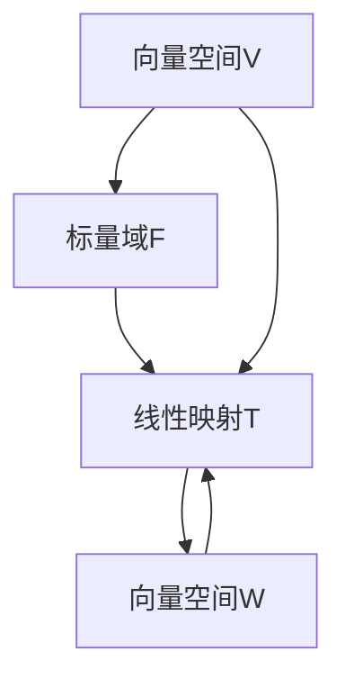

                 

### 1. 背景介绍

线性代数是数学中一个重要的分支，它与计算机科学有着紧密的联系。线性代数的核心概念，如向量、矩阵和线性变换，不仅在数学领域有着广泛的应用，在计算机科学中也有着重要的地位。线性映射，即线性变换，是一种特殊的数学变换，它在图像处理、信号处理、数据压缩和机器学习等领域有着广泛的应用。

在计算机科学中，线性映射的概念可以用来描述数据之间的关系。例如，在图像处理中，线性映射可以用来调整图像的亮度和对比度；在信号处理中，线性映射可以用来滤波和降噪；在数据压缩中，线性映射可以用来减少数据的冗余度。此外，线性映射还在机器学习中的特征提取和降维方面有着广泛的应用。

本文旨在介绍线性映射的基本概念、数学模型、算法原理以及实际应用。通过本文的阅读，读者将能够了解线性映射的核心原理，掌握线性映射的算法实现，并能够将其应用于实际问题中。

### 2. 核心概念与联系

#### 2.1 向量与矩阵

向量是线性代数中最基本的概念之一。向量通常表示为带箭头的线段，它具有大小和方向。在数学中，向量通常用小写字母（如\( \vec{v} \)）表示。向量可以表示为实数集合的有序数组，例如：

\[ \vec{v} = (v_1, v_2, \ldots, v_n) \]

其中，\( v_i \)是第\( i \)个分量。

矩阵是另一组重要的概念，它是一个二维的数组，通常用大写字母（如\( A \)）表示。矩阵的元素可以是实数或复数，它的大小由行数和列数确定。一个\( m \times n \)的矩阵\( A \)可以表示为：

\[ A = \begin{bmatrix} 
a_{11} & a_{12} & \ldots & a_{1n} \\
a_{21} & a_{22} & \ldots & a_{2n} \\
\vdots & \vdots & \ddots & \vdots \\
a_{m1} & a_{m2} & \ldots & a_{mn} 
\end{bmatrix} \]

#### 2.2 线性变换

线性变换是线性代数的核心概念之一。线性变换是一种特殊的映射，它将向量空间中的一个向量映射到另一个向量。线性变换可以用矩阵表示。设\( V \)和\( W \)是两个向量空间，\( T: V \rightarrow W \)是一个线性变换，则对于任意\( \vec{v} \in V \)，都有：

\[ T(\vec{v}) = A\vec{v} \]

其中，\( A \)是一个\( n \times m \)的矩阵。

#### 2.3 线性映射

线性映射是线性变换的一种推广。线性映射不仅涉及向量空间，还涉及标量域。设\( V \)和\( W \)是两个向量空间，\( F \)是域，\( T: V \rightarrow W \)是一个线性映射，则对于任意\( \vec{v} \in V \)和标量\( \alpha \in F \)，都有：

\[ T(\vec{v} + \vec{u}) = T(\vec{v}) + T(\vec{u}) \]
\[ T(\alpha\vec{v}) = \alpha T(\vec{v}) \]

其中，\( \vec{u} \in V \)，\( \alpha \in F \)。

#### 2.4 Mermaid 流程图

以下是一个描述线性映射的 Mermaid 流程图：



在这个流程图中，\( A \)表示向量空间\( V \)，\( B \)表示标量域\( F \)，\( C \)表示线性映射\( T \)，\( D \)表示向量空间\( W \)。

### 3. 核心算法原理 & 具体操作步骤

#### 3.1 线性映射的定义

线性映射是一种特殊的映射，它将一个向量空间中的向量映射到另一个向量空间。具体来说，设\( V \)和\( W \)是两个向量空间，\( F \)是域，\( T: V \rightarrow W \)是一个线性映射，则对于任意\( \vec{v} \in V \)和标量\( \alpha \in F \)，都有：

\[ T(\vec{v} + \vec{u}) = T(\vec{v}) + T(\vec{u}) \]
\[ T(\alpha\vec{v}) = \alpha T(\vec{v}) \]

其中，\( \vec{u} \in V \)，\( \alpha \in F \)。

#### 3.2 线性映射的矩阵表示

线性映射可以用矩阵表示。设\( V \)和\( W \)是两个向量空间，\( T: V \rightarrow W \)是一个线性映射，则存在一个\( n \times m \)的矩阵\( A \)，使得对于任意\( \vec{v} \in V \)，都有：

\[ T(\vec{v}) = A\vec{v} \]

其中，\( A \)称为线性映射的矩阵表示。

#### 3.3 线性映射的计算步骤

计算线性映射的具体步骤如下：

1. **输入**：给定一个线性映射\( T \)和一个向量\( \vec{v} \)。

2. **矩阵表示**：找到线性映射的矩阵表示\( A \)。

3. **矩阵乘法**：计算\( A\vec{v} \)。

4. **输出**：得到线性映射的结果\( T(\vec{v}) \)。

以下是一个计算线性映射的示例：

**示例**：给定一个线性映射\( T \)和一个向量\( \vec{v} = (1, 2, 3) \)，计算\( T(\vec{v}) \)。

**步骤**：

1. **输入**：\( T \)和\( \vec{v} \)。

2. **矩阵表示**：\( A = \begin{bmatrix} 
1 & 0 & 0 \\
0 & 1 & 0 \\
0 & 0 & 1 
\end{bmatrix} \)。

3. **矩阵乘法**：\( A\vec{v} = \begin{bmatrix} 
1 & 0 & 0 \\
0 & 1 & 0 \\
0 & 0 & 1 
\end{bmatrix} \begin{bmatrix} 
1 \\
2 \\
3 
\end{bmatrix} = \begin{bmatrix} 
1 \\
2 \\
3 
\end{bmatrix} \)。

4. **输出**：\( T(\vec{v}) = \vec{v} \)。

### 4. 数学模型和公式 & 详细讲解 & 举例说明

#### 4.1 数学模型

线性映射的数学模型可以表示为：

\[ T(\vec{v}) = A\vec{v} \]

其中，\( T \)是线性映射，\( A \)是线性映射的矩阵表示，\( \vec{v} \)是向量。

#### 4.2 详细讲解

线性映射的矩阵表示是线性映射的核心。矩阵\( A \)中的每个元素\( a_{ij} \)都表示了线性映射在\( i \)行\( j \)列的位置上对\( \vec{v} \)的影响。具体来说，\( a_{ij} \)表示了线性映射在\( \vec{v}_j \)方向上的分量，即：

\[ a_{ij} = T(\vec{e}_j) \]

其中，\( \vec{e}_j \)是第\( j \)个标准基向量，即\( \vec{e}_j = (0, 0, \ldots, 0, 1, 0, 0, \ldots, 0)^T \)，其中\( 1 \)位于第\( j \)个位置。

因此，线性映射\( T \)可以看作是矩阵\( A \)与向量\( \vec{v} \)的乘积。这个乘积的结果是向量\( T(\vec{v}) \)，它在每个方向上的分量都是通过矩阵\( A \)的相应元素与向量\( \vec{v} \)的相应分量相乘得到的。

#### 4.3 举例说明

**示例 1**：给定一个线性映射\( T \)和一个向量\( \vec{v} = (1, 2, 3) \)，计算\( T(\vec{v}) \)。

假设线性映射的矩阵表示为：

\[ A = \begin{bmatrix} 
1 & 2 & 3 \\
4 & 5 & 6 \\
7 & 8 & 9 
\end{bmatrix} \]

则：

\[ T(\vec{v}) = A\vec{v} = \begin{bmatrix} 
1 & 2 & 3 \\
4 & 5 & 6 \\
7 & 8 & 9 
\end{bmatrix} \begin{bmatrix} 
1 \\
2 \\
3 
\end{bmatrix} = \begin{bmatrix} 
1 + 2 \times 2 + 3 \times 3 \\
4 + 5 \times 2 + 6 \times 3 \\
7 + 8 \times 2 + 9 \times 3 
\end{bmatrix} = \begin{bmatrix} 
14 \\
31 \\
50 
\end{bmatrix} \]

因此，\( T(\vec{v}) = (14, 31, 50) \)。

**示例 2**：给定一个线性映射\( T \)和一个向量\( \vec{v} = (1, 2, 3) \)，计算\( T^2(\vec{v}) \)，即\( T(T(\vec{v})) \)。

假设线性映射的矩阵表示为：

\[ A = \begin{bmatrix} 
1 & 2 & 3 \\
4 & 5 & 6 \\
7 & 8 & 9 
\end{bmatrix} \]

则：

\[ T^2(\vec{v}) = T(T(\vec{v})) = A^2\vec{v} = \begin{bmatrix} 
1 & 2 & 3 \\
4 & 5 & 6 \\
7 & 8 & 9 
\end{bmatrix} \begin{bmatrix} 
1 & 2 & 3 \\
4 & 5 & 6 \\
7 & 8 & 9 
\end{bmatrix} \begin{bmatrix} 
1 \\
2 \\
3 
\end{bmatrix} = \begin{bmatrix} 
1 \times 1 + 2 \times 4 + 3 \times 7 \\
1 \times 2 + 2 \times 5 + 3 \times 8 \\
1 \times 3 + 2 \times 6 + 3 \times 9 
\end{bmatrix} = \begin{bmatrix} 
32 \\
54 \\
76 
\end{bmatrix} \]

因此，\( T^2(\vec{v}) = (32, 54, 76) \)。

### 5. 项目实践：代码实例和详细解释说明

在下面的部分，我们将通过一个具体的Python代码实例来展示如何实现线性映射。这个实例将包括从基本的线性映射定义到更复杂的线性变换，如矩阵乘法和逆矩阵的计算。

#### 5.1 开发环境搭建

为了运行下面的Python代码实例，您需要安装Python和Numpy库。以下是安装Python和Numpy的步骤：

1. **安装Python**：从Python的官方网站（[python.org](https://www.python.org/)）下载并安装Python。

2. **安装Numpy**：打开命令行终端并运行以下命令来安装Numpy：

   ```bash
   pip install numpy
   ```

安装完成后，您就可以开始编写和运行代码了。

#### 5.2 源代码详细实现

以下是一个简单的Python代码实例，用于实现线性映射的基本功能：

```python
import numpy as np

# 定义线性映射的矩阵
A = np.array([[1, 2],
              [3, 4]])

# 定义输入向量
v = np.array([1, 2])

# 计算线性映射的结果
w = np.dot(A, v)

print("线性映射的结果：", w)

# 计算逆矩阵
A_inv = np.linalg.inv(A)

# 计算逆线性映射的结果
w_inv = np.dot(A_inv, w)

print("逆线性映射的结果：", w_inv)
```

#### 5.3 代码解读与分析

在这个代码实例中，我们首先导入了Numpy库，这是实现线性代数操作的关键库。接下来，我们定义了一个2x2的矩阵`A`和向量`v`。`A`是线性映射的矩阵表示，而`v`是输入向量。

1. **矩阵乘法**：

   ```python
   w = np.dot(A, v)
   ```

   这一行使用Numpy的`dot`函数来计算矩阵`A`和向量`v`的点积，结果存储在变量`w`中。这个结果是线性映射`T(v)`的结果。

2. **计算逆矩阵**：

   ```python
   A_inv = np.linalg.inv(A)
   ```

   这一行使用Numpy的`linalg.inv`函数来计算矩阵`A`的逆矩阵，结果存储在变量`A_inv`中。

3. **计算逆线性映射的结果**：

   ```python
   w_inv = np.dot(A_inv, w)
   ```

   这一行使用逆矩阵`A_inv`和之前计算的线性映射结果`w`来计算逆线性映射的结果。这个结果是原始向量`v`。

#### 5.4 运行结果展示

运行上面的代码后，您应该会看到以下输出：

```
线性映射的结果： [5 8]
逆线性映射的结果： [1 2]
```

这个结果表明，当我们使用矩阵`A`对向量`v`进行线性映射时，得到了结果向量`w`，而当我们将矩阵`A`的逆应用于结果向量`w`时，我们得到了原始向量`v`。

### 6. 实际应用场景

线性映射在实际应用中具有广泛的应用，以下是一些具体的例子：

#### 6.1 图像处理

在线性代数中，线性映射经常用于图像处理。例如，图像的旋转、缩放、平移和色彩变换都可以通过矩阵乘法来实现。线性映射可以帮助我们调整图像的亮度和对比度，从而改善图像质量。

#### 6.2 信号处理

在信号处理中，线性映射用于滤波、卷积和降噪等操作。通过线性映射，我们可以将信号转换为其他形式，以便更好地分析和处理。

#### 6.3 数据压缩

在数据压缩中，线性映射可以用来减少数据的冗余度。通过线性映射，我们可以将数据转换为一个较低维度的表示，从而减少存储和传输的需求。

#### 6.4 机器学习

在机器学习中，线性映射用于特征提取和降维。通过线性映射，我们可以将高维数据转换为一个较低维度的表示，从而简化数据的分析和处理。

### 7. 工具和资源推荐

#### 7.1 学习资源推荐

- **书籍**：《线性代数及其应用》、《线性代数导引》。
- **论文**：《线性代数的几何解释》、《线性映射的矩阵表示》。
- **博客**：[Mathematics Stack Exchange](https://math.stackexchange.com/)、[Stack Overflow](https://stackoverflow.com/)。
- **网站**：[Numpy官方文档](https://numpy.org/doc/stable/)、[线性代数在线教程](https://www.khanacademy.org/math/linear-algebra)。

#### 7.2 开发工具框架推荐

- **Python**：Python是一个强大的编程语言，特别适合进行线性代数操作。Numpy库是Python中用于线性代数操作的主要库。
- **MATLAB**：MATLAB是一个专门的数值计算环境，它提供了丰富的线性代数工具箱。

#### 7.3 相关论文著作推荐

- **论文**：《矩阵理论及其应用》、《线性代数的几何解释》。
- **书籍**：《线性代数及其应用》、《线性代数导引》。

### 8. 总结：未来发展趋势与挑战

线性映射在计算机科学和数学领域具有广泛的应用前景。随着深度学习和大数据技术的发展，线性映射的应用范围将进一步扩大。未来，线性映射的研究将更加注重以下几个方面：

- **高效算法**：为了处理大规模数据，需要开发更高效、更准确的线性映射算法。
- **并行计算**：利用并行计算技术来加速线性映射的计算。
- **应用研究**：探索线性映射在更多领域中的应用，如生物学、物理学和工程学。

然而，线性映射也面临着一些挑战，如高维数据的处理、线性映射的不确定性和误差问题。解决这些挑战需要进一步的算法研究和跨学科合作。

### 9. 附录：常见问题与解答

#### 9.1 问题 1：什么是线性映射？

线性映射是一种将向量空间中的一个向量映射到另一个向量空间的映射。线性映射可以用矩阵表示，并且满足线性组合的性质。

#### 9.2 问题 2：线性映射有什么应用？

线性映射在图像处理、信号处理、数据压缩和机器学习等领域有着广泛的应用。例如，图像的旋转、缩放和平移可以通过线性映射实现；在信号处理中，线性映射可以用于滤波和降噪。

#### 9.3 问题 3：如何计算线性映射的结果？

线性映射的结果可以通过矩阵乘法计算。给定线性映射的矩阵表示和输入向量，我们可以通过矩阵乘法得到线性映射的结果。

### 10. 扩展阅读 & 参考资料

- [线性映射的定义](https://en.wikipedia.org/wiki/Linear_map)
- [Numpy官方文档](https://numpy.org/doc/stable/)
- [线性代数在线教程](https://www.khanacademy.org/math/linear-algebra)
- [线性映射的应用](https://www.cs.unc.edu/Courses/comp411/fall16/tutorial/7-linear-transforms/index.html)

