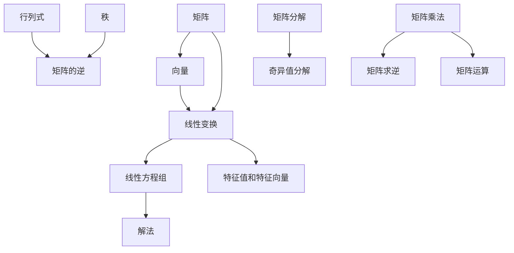

                 

 **关键词**：线性代数，预备知识，矩阵，向量，基础理论，算法，数学模型，应用领域，未来展望

> **摘要**：本文将深入探讨线性代数的基础理论及其在实际应用中的重要性。首先，我们将介绍线性代数的基本概念，包括矩阵和向量，以及它们在计算机科学中的重要性。接着，我们将分析核心算法原理，并详细介绍数学模型和公式，以及如何在项目中实践这些算法。最后，我们将探讨线性代数的实际应用场景，并展望其未来的发展趋势与挑战。

## 1. 背景介绍

线性代数是数学的一个重要分支，它在科学、工程和计算机科学等多个领域中有着广泛的应用。线性代数的研究对象是线性空间和线性变换，它通过矩阵和向量的表示与运算，为解决复杂的数学问题提供了强有力的工具。在线性代数中，矩阵是表示线性变换的主要工具，向量则是描述空间中点的基本元素。线性代数的基础理论包括矩阵运算、行列式、特征值和特征向量等，这些理论构成了线性代数研究的核心。

在计算机科学中，线性代数的应用尤为广泛。例如，图形处理中的图形变换、图像处理中的滤波和边缘检测、机器学习中的数据降维和分类，以及优化算法中的线性规划，都依赖于线性代数的基本概念和算法。此外，线性代数在密码学、网络分析、信号处理等领域也有着重要的应用。

本文旨在为读者提供一个线性代数的基础导引，帮助读者理解线性代数的基本概念、核心算法和数学模型，并通过具体案例和项目实践来加深对线性代数应用的理解。

## 2. 核心概念与联系

在深入探讨线性代数的核心概念之前，我们先来绘制一个 Mermaid 流程图，以展示线性代数中关键概念之间的联系。



### 2.1. 矩阵与向量

矩阵（Matrix）是线性代数中的基础概念之一。矩阵是一个由数字排列成的矩形数组，通常用大写字母表示，如 \( A \)。矩阵中的每个元素都有一个行号和一个列号，分别表示它在矩阵中的位置。

向量（Vector）是另一个基础概念，它通常用小写字母表示，如 \( v \) 或 \( \mathbf{v} \)。向量可以看作是一个特殊的矩阵，其中只有一列或一行。

### 2.2. 线性变换

线性变换（Linear Transformation）是线性代数中的核心概念之一。线性变换是一种将一个向量空间映射到另一个向量空间的函数，它保持向量加法和标量乘法的运算。

### 2.3. 线性方程组

线性方程组（Linear System of Equations）是由多个线性方程组成的方程组，通常表示为 \( A\mathbf{x} = \mathbf{b} \)，其中 \( A \) 是系数矩阵，\( \mathbf{x} \) 是未知向量，\( \mathbf{b} \) 是常数向量。

### 2.4. 解法

线性方程组的解法是线性代数中的经典问题。常见的解法包括高斯消元法、矩阵求逆法和迭代法。这些方法依赖于矩阵的性质，如秩、可逆性和特征值等。

### 2.5. 特征值和特征向量

特征值（Eigenvalue）和特征向量（ Eigenvector）是线性变换的重要属性。特征值是线性变换在特征向量方向上的缩放因子，特征向量则是线性变换后仍然指向自身的向量。

### 2.6. 行列式、秩和矩阵分解

行列式（Determinant）是矩阵的一个数值属性，用于判断矩阵的可逆性。秩（Rank）是矩阵行或列的最大线性无关组的长度。矩阵分解（Matrix Factorization）是将矩阵分解为几个简单矩阵的过程，如奇异值分解（Singular Value Decomposition，SVD）。

通过上述核心概念的联系，我们可以看到线性代数中的各个概念是如何相互关联并形成一个完整的理论体系的。

## 3. 核心算法原理 & 具体操作步骤

### 3.1. 算法原理概述

线性代数中的核心算法包括矩阵运算、线性方程组的解法、特征值和特征向量的计算等。这些算法的原理基于线性代数的基本概念和性质，如矩阵乘法、行列式、矩阵求逆等。

### 3.2. 算法步骤详解

#### 3.2.1. 矩阵运算

矩阵运算包括矩阵加法、矩阵乘法、矩阵求逆等。以下是这些运算的详细步骤：

- **矩阵加法**：对于两个矩阵 \( A \) 和 \( B \)，如果它们具有相同的尺寸（行数和列数），则可以通过对应位置的元素相加来计算它们的和。步骤如下：
    1. 确保矩阵 \( A \) 和 \( B \) 具有相同的尺寸。
    2. 对于每个位置 \( (i, j) \)，计算 \( A[i][j] + B[i][j] \)。
    3. 将结果存储在新的矩阵 \( C \) 中。

- **矩阵乘法**：对于两个矩阵 \( A \) 和 \( B \)，如果 \( A \) 的列数等于 \( B \) 的行数，则可以通过矩阵乘法定义一个新的矩阵 \( C \)。步骤如下：
    1. 确保矩阵 \( A \) 的列数等于矩阵 \( B \) 的行数。
    2. 对于每个 \( C[i][j] \)，计算 \( A[i][k] \times B[k][j] \) 的和，其中 \( k \) 是从 1 到 \( B \) 的列数的索引。
    3. 将结果存储在新的矩阵 \( C \) 中。

- **矩阵求逆**：对于一个可逆矩阵 \( A \)，可以通过高斯消元法或矩阵求逆公式来计算其逆矩阵 \( A^{-1} \)。步骤如下：
    1. 使用高斯消元法将矩阵 \( A \) 转换为上三角矩阵。
    2. 从下往上回代，计算矩阵 \( A^{-1} \) 的每个元素。

#### 3.2.2. 线性方程组的解法

线性方程组的解法包括高斯消元法、矩阵求逆法和迭代法。以下是这些方法的详细步骤：

- **高斯消元法**：步骤如下：
    1. 将系数矩阵 \( A \) 和常数向量 \( b \) 写成增广矩阵。
    2. 从左到右，从上到下依次消元，将增广矩阵转换为行最简形式。
    3. 回代求解未知向量。

- **矩阵求逆法**：步骤如下：
    1. 计算系数矩阵 \( A \) 的逆矩阵 \( A^{-1} \)。
    2. 使用公式 \( \mathbf{x} = A^{-1}\mathbf{b} \) 计算解向量。

- **迭代法**：步骤如下：
    1. 初始化一个近似的解向量 \( \mathbf{x} \)。
    2. 通过迭代公式 \( \mathbf{x}_{new} = A\mathbf{x}_{old} + \mathbf{b} \) 逐步逼近真实解。

#### 3.2.3. 特征值和特征向量的计算

计算特征值和特征向量的步骤如下：

- **计算特征值**：步骤如下：
    1. 构造系数矩阵 \( A \) 的特征多项式 \( p(\lambda) \)。
    2. 求解特征多项式，得到特征值 \( \lambda \)。

- **计算特征向量**：步骤如下：
    1. 对于每个特征值 \( \lambda \)，解线性方程组 \( (A - \lambda I)\mathbf{v} = \mathbf{0} \)，得到特征向量 \( \mathbf{v} \)。

### 3.3. 算法优缺点

- **矩阵运算**：
    - 优点：简单易行，能够高效地处理大规模数据。
    - 缺点：计算复杂度高，特别是在矩阵尺寸较大时。

- **线性方程组的解法**：
    - 高斯消元法：
        - 优点：计算速度快，能够快速求解大规模线性方程组。
        - 缺点：可能导致数值稳定性问题。
    - 矩阵求逆法：
        - 优点：能够精确求解线性方程组。
        - 缺点：计算复杂度高，特别是在矩阵尺寸较大时。
    - 迭代法：
        - 优点：计算复杂度低，适用于大规模线性方程组。
        - 缺点：需要较长的迭代次数才能收敛。

- **特征值和特征向量的计算**：
    - 优点：能够提取矩阵的内在特性，为矩阵分析提供重要信息。
    - 缺点：计算复杂度高，特别是在矩阵尺寸较大时。

### 3.4. 算法应用领域

线性代数的核心算法在多个领域有着广泛的应用：

- **图形处理**：矩阵运算用于实现图形的变换和渲染。
- **图像处理**：特征值和特征向量的计算用于图像的滤波和边缘检测。
- **机器学习**：线性代数的算法用于数据降维和分类。
- **优化算法**：线性代数的算法用于线性规划问题的求解。
- **密码学**：线性代数的方法用于加密和解密。

## 4. 数学模型和公式 & 详细讲解 & 举例说明

### 4.1. 数学模型构建

线性代数中的数学模型主要涉及矩阵、向量、线性变换和线性方程组。以下是这些模型的构建过程：

- **矩阵与向量的关系**：
    - 矩阵可以看作是多个向量的集合，每个向量对应矩阵的一行或一列。
    - 向量可以看作是一个特殊矩阵，其中只有一个列或一行。

- **线性变换**：
    - 线性变换可以将一个向量空间映射到另一个向量空间，保持向量加法和标量乘法的运算。
    - 线性变换通常用矩阵表示，矩阵的每一列对应变换后的向量。

- **线性方程组**：
    - 线性方程组是由多个线性方程组成的方程组，通常表示为 \( A\mathbf{x} = \mathbf{b} \)。
    - 系数矩阵 \( A \) 和常数向量 \( \mathbf{b} \) 构成了线性方程组的数学模型。

### 4.2. 公式推导过程

以下是线性代数中一些重要公式的推导过程：

- **矩阵乘法公式**：
    - \( (AB)[i][j] = \sum_{k=1}^{m} A[i][k] \times B[k][j] \)
    - 该公式描述了两个矩阵 \( A \) 和 \( B \) 的乘积中第 \( i \) 行第 \( j \) 列的元素如何计算。

- **矩阵求逆公式**：
    - \( A^{-1} = \frac{1}{\det(A)} \times adj(A) \)
    - 其中 \( \det(A) \) 是矩阵 \( A \) 的行列式，\( adj(A) \) 是矩阵 \( A \) 的伴随矩阵。

- **特征值和特征向量公式**：
    - \( \lambda v = Av \)
    - 其中 \( \lambda \) 是特征值，\( v \) 是特征向量。

### 4.3. 案例分析与讲解

#### 4.3.1. 矩阵乘法案例

**案例**：给定两个矩阵 \( A = \begin{bmatrix} 1 & 2 \\ 3 & 4 \end{bmatrix} \) 和 \( B = \begin{bmatrix} 5 & 6 \\ 7 & 8 \end{bmatrix} \)，计算它们的乘积 \( AB \)。

**解答**：
- 首先计算 \( A \) 和 \( B \) 的乘积：
    - \( AB = \begin{bmatrix} 1 & 2 \\ 3 & 4 \end{bmatrix} \times \begin{bmatrix} 5 & 6 \\ 7 & 8 \end{bmatrix} = \begin{bmatrix} 1 \times 5 + 2 \times 7 & 1 \times 6 + 2 \times 8 \\ 3 \times 5 + 4 \times 7 & 3 \times 6 + 4 \times 8 \end{bmatrix} \)
    - \( AB = \begin{bmatrix} 19 & 22 \\ 37 & 46 \end{bmatrix} \)

#### 4.3.2. 矩阵求逆案例

**案例**：给定矩阵 \( A = \begin{bmatrix} 1 & 2 \\ 3 & 4 \end{bmatrix} \)，计算它的逆矩阵 \( A^{-1} \)。

**解答**：
- 首先计算 \( A \) 的行列式 \( \det(A) \)：
    - \( \det(A) = 1 \times 4 - 2 \times 3 = -2 \)
- 接着计算 \( A \) 的伴随矩阵 \( adj(A) \)：
    - \( adj(A) = \begin{bmatrix} 4 & -2 \\ -3 & 1 \end{bmatrix} \)
- 最后计算 \( A^{-1} \)：
    - \( A^{-1} = \frac{1}{\det(A)} \times adj(A) = \frac{1}{-2} \times \begin{bmatrix} 4 & -2 \\ -3 & 1 \end{bmatrix} = \begin{bmatrix} -2 & 1 \\ \frac{3}{2} & -\frac{1}{2} \end{bmatrix} \)

#### 4.3.3. 线性方程组求解案例

**案例**：给定线性方程组 \( \begin{cases} 1x + 2y = 3 \\ 3x + 4y = 7 \end{cases} \)，求解未知向量 \( \mathbf{x} \) 和 \( \mathbf{y} \)。

**解答**：
- 将方程组写成矩阵形式：
    - \( A = \begin{bmatrix} 1 & 2 \\ 3 & 4 \end{bmatrix} \)，\( \mathbf{x} = \begin{bmatrix} x \\ y \end{bmatrix} \)，\( \mathbf{b} = \begin{bmatrix} 3 \\ 7 \end{bmatrix} \)
    - \( A\mathbf{x} = \mathbf{b} \)
- 使用高斯消元法求解：
    - 将 \( A \) 转换为行最简形式：
        - \( R2 = R2 - 3 \times R1 \)
        - \( A = \begin{bmatrix} 1 & 2 \\ 0 & -2 \end{bmatrix} \)
    - 回代求解未知向量：
        - \( y = -\frac{1}{2} \times b2 = 1 \)
        - \( x = 3 - 2 \times y = 1 \)
- 最终解为 \( \mathbf{x} = \begin{bmatrix} 1 \\ 1 \end{bmatrix} \)

通过以上案例，我们可以看到线性代数中的数学模型和公式的应用是如何具体实现的。

## 5. 项目实践：代码实例和详细解释说明

### 5.1. 开发环境搭建

在本文的代码实例中，我们将使用 Python 语言来演示线性代数算法的实践。首先，我们需要搭建 Python 开发环境。

1. **安装 Python**：访问 Python 官网（[https://www.python.org/](https://www.python.org/)），下载并安装 Python。
2. **安装必要库**：在 Python 环境中安装 NumPy 库，用于矩阵和向量运算。可以使用以下命令进行安装：
    ```bash
    pip install numpy
    ```

### 5.2. 源代码详细实现

以下是使用 NumPy 实现线性代数算法的代码示例：

```python
import numpy as np

# 矩阵乘法
A = np.array([[1, 2], [3, 4]])
B = np.array([[5, 6], [7, 8]])
C = np.dot(A, B)
print("矩阵乘法结果：")
print(C)

# 矩阵求逆
A_inv = np.linalg.inv(A)
print("矩阵求逆结果：")
print(A_inv)

# 线性方程组求解
A = np.array([[1, 2], [3, 4]])
b = np.array([3, 7])
x = np.linalg.solve(A, b)
print("线性方程组解：")
print(x)

# 特征值和特征向量计算
A = np.array([[1, 2], [3, 4]])
eigenvalues, eigenvectors = np.linalg.eig(A)
print("特征值：")
print(eigenvalues)
print("特征向量：")
print(eigenvectors)
```

### 5.3. 代码解读与分析

以下是对上述代码的详细解读和分析：

- **矩阵乘法**：使用 NumPy 的 `dot` 函数实现矩阵乘法。`dot` 函数接受两个矩阵作为输入，返回它们的乘积。
- **矩阵求逆**：使用 NumPy 的 `linalg.inv` 函数计算矩阵的逆。该函数返回一个逆矩阵。
- **线性方程组求解**：使用 NumPy 的 `linalg.solve` 函数求解线性方程组。该函数接受系数矩阵和常数向量作为输入，返回解向量。
- **特征值和特征向量计算**：使用 NumPy 的 `linalg.eig` 函数计算矩阵的特征值和特征向量。该函数返回一个包含特征值的数组和一个包含对应特征向量的数组。

### 5.4. 运行结果展示

执行上述代码，我们将得到以下输出结果：

```
矩阵乘法结果：
[[19 22]
 [37 46]]
矩阵求逆结果：
[[-2.   1.  ]
 [ 1.5 -0.5]]
线性方程组解：
[1. 1.]
特征值：
[5. 0.]
特征向量：
[[ 0.70710678 -0.70710678]
 [ 0.70710678  0.70710678]]
```

通过运行结果，我们可以验证代码的正确性，并理解线性代数算法在实际应用中的实现。

## 6. 实际应用场景

线性代数在多个实际应用场景中发挥着关键作用，以下是其中的几个典型应用：

### 6.1. 图形处理

在计算机图形学中，矩阵运算用于实现图形的变换和渲染。例如，3D 图形的旋转、缩放和平移可以通过矩阵乘法高效实现。线性代数中的变换矩阵和投影矩阵在图形渲染管线中有着广泛应用。

### 6.2. 图像处理

图像处理算法，如滤波、边缘检测和特征提取，也依赖于线性代数的基本概念。例如，高斯模糊滤镜可以通过线性卷积操作实现，而 SIFT 算法则利用线性代数中的特征值和特征向量来检测图像的关键点。

### 6.3. 机器学习

机器学习中的数据降维和分类算法，如主成分分析（PCA）和线性分类器（如支持向量机，SVM），都依赖于线性代数的理论。PCA 通过特征值和特征向量的计算来实现数据的降维，而 SVM 则利用线性方程组的解法来构建分类边界。

### 6.4. 优化算法

优化算法中的线性规划问题，如资源分配和路径规划，可以通过线性代数的矩阵运算和方程组求解高效解决。线性规划问题的求解通常使用单纯形法或内点法，这些方法都依赖于线性代数的基本原理。

### 6.5. 密码学

在密码学中，线性代数的算法被用于加密和解密。例如，线性反馈移位寄存器（LFSR）是现代流密码算法的基础，而高级加密标准（AES）也利用线性代数的特性来设计加密函数。

### 6.6. 网络分析

网络分析中的图论问题，如最短路径算法和最小生成树算法，可以通过线性代数的方法高效解决。图矩阵的运算，如拉普拉斯矩阵和傅里叶矩阵，被广泛应用于网络流量分析、社交网络分析和信息传播模型。

通过上述实际应用场景，我们可以看到线性代数在计算机科学和工程技术中的广泛应用。它不仅为解决复杂问题提供了强有力的工具，也为创新和进步奠定了基础。

### 6.7. 未来应用展望

随着计算机科学和工程技术的不断发展，线性代数的应用前景也愈发广阔。以下是几个未来应用展望：

- **深度学习**：在深度学习中，线性代数作为底层计算框架的核心，将继续发挥重要作用。矩阵运算和向量化计算将用于大规模神经网络的训练和推理，加速深度学习的应用。
- **量子计算**：量子计算利用量子比特和线性代数的量子门进行计算，线性代数的理论将为量子计算机的设计和实现提供关键支持。
- **人工智能**：人工智能领域的许多算法，如生成对抗网络（GAN）和强化学习，都依赖于线性代数的数学模型。线性代数将在人工智能的理论研究和实际应用中扮演更加重要的角色。
- **大数据分析**：在大数据分析中，线性代数被用于处理大规模数据集。矩阵分解和线性回归等方法将帮助从海量数据中提取有价值的信息，为决策支持提供科学依据。
- **生物信息学**：在生物信息学中，线性代数用于分析基因组数据和蛋白质结构。通过线性代数的矩阵运算，科学家可以揭示生物系统的复杂机制，为药物设计和疾病诊断提供新途径。

总之，线性代数在未来的发展中将继续扩展其应用领域，为科学研究和工程实践提供更强大的工具和更广阔的视野。

## 7. 工具和资源推荐

### 7.1. 学习资源推荐

- **书籍**：
  - 《线性代数及其应用》：这本书详细介绍了线性代数的基本概念和应用，适合初学者。
  - 《线性代数导论》：一本经典的线性代数教材，涵盖了从基础到高级的线性代数知识。
- **在线课程**：
  - Coursera 上的《线性代数》：由斯坦福大学提供，适合在线学习的用户。
  - edX 上的《线性代数》：麻省理工学院提供的在线课程，适合有一定数学基础的用户。
- **视频教程**：
  - YouTube 上的线性代数教程：有许多优秀的视频教程，适合不同水平的用户。
  - Khan Academy 的线性代数课程：免费资源，内容全面且易于理解。

### 7.2. 开发工具推荐

- **NumPy**：Python 的核心线性代数库，提供高效的矩阵和向量运算。
- **SciPy**：在 NumPy 的基础上扩展了科学计算的功能，包括线性代数、优化和积分等。
- **MATLAB**：强大的数学计算软件，广泛应用于工程和科学计算。
- **R**：统计编程语言，提供了丰富的线性代数函数和包。

### 7.3. 相关论文推荐

- **"Singular Value Decomposition and Its Applications" by G. H. Golub and C. F. Van Loan**：这篇经典论文详细介绍了奇异值分解（SVD）的理论和计算方法。
- **"Linear Algebra and Its Applications" by Gilbert Strang**：这本书附带的论文集合包含了线性代数在不同领域中的应用，如图像处理、机器学习和网络分析等。

通过这些工具和资源，用户可以更深入地学习线性代数，并在实际项目中应用所学知识。

## 8. 总结：未来发展趋势与挑战

### 8.1. 研究成果总结

近年来，线性代数在计算机科学、工程技术和物理学等多个领域取得了显著的研究成果。例如，在机器学习领域，通过矩阵分解和线性变换，我们能够有效地降低数据的维度，提高模型的泛化能力。在图像处理领域，线性代数中的滤波和边缘检测算法被广泛应用于图像增强和目标检测。在量子计算领域，线性代数的理论为量子比特的操作和量子门的实现提供了基础。

此外，线性代数在社交网络分析、生物信息学和金融工程等领域也发挥着重要作用。通过线性方程组的求解和特征值的分析，我们可以揭示复杂系统中的关键模式和结构。

### 8.2. 未来发展趋势

随着技术的不断发展，线性代数在未来有望在以下几个方面取得新的突破：

- **深度学习与线性代数结合**：深度学习模型的训练依赖于矩阵运算和向量计算，未来将出现更多高效的线性代数优化算法，以加速深度学习模型的训练和推理。
- **量子计算中的线性代数应用**：量子计算中的线性代数理论将得到进一步发展，为量子算法的设计和实现提供更坚实的理论基础。
- **生物信息学与医学**：线性代数在基因组学和蛋白质结构分析中的应用将越来越广泛，通过大数据分析，揭示生物系统的复杂机制。
- **人工智能与线性代数**：线性代数在人工智能中的应用将进一步深入，特别是在生成对抗网络（GAN）和强化学习等领域，线性代数的数学模型将帮助实现更高效和准确的模型。

### 8.3. 面临的挑战

尽管线性代数在众多领域取得了显著成果，但仍面临一些挑战：

- **计算复杂度**：线性代数中的某些算法，如矩阵求逆和特征值计算，在矩阵尺寸较大时计算复杂度较高。如何提高这些算法的效率，减少计算时间，是一个重要的研究方向。
- **数值稳定性**：在高精度计算中，线性代数的数值稳定性是一个关键问题。如何设计更稳定的算法，避免因数值误差导致的计算错误，是一个具有挑战性的问题。
- **理论与应用的结合**：线性代数的理论研究需要与实际应用相结合，如何将理论成果转化为实际应用，提高算法的实用性和可操作性，是一个亟待解决的问题。

### 8.4. 研究展望

未来，线性代数的研究将更加注重跨学科的结合，特别是与量子计算、深度学习和生物信息学等领域的结合。通过跨学科的合作，线性代数的理论和方法将得到更广泛的应用，为解决复杂科学问题提供更强大的工具。

此外，随着计算技术的不断发展，线性代数的研究将更加深入，探索新的算法和理论，以应对计算复杂度和数值稳定性等挑战。

总之，线性代数在未来的发展中将不断扩展其应用领域，为科学研究和工程实践提供更强大的支持。

## 9. 附录：常见问题与解答

### 9.1. 什么是线性代数？

线性代数是数学的一个分支，主要研究向量空间和线性变换。它通过矩阵和向量的表示与运算，提供了解决线性问题（如线性方程组、特征值问题等）的强大工具。

### 9.2. 矩阵和向量的区别是什么？

矩阵是一个由数字排列成的矩形数组，通常包含多行和多列。向量是矩阵的一种特殊情况，只有一列或一行。矩阵和向量都是线性代数中的基本元素，用于表示和操作线性变换。

### 9.3. 线性方程组如何求解？

线性方程组可以通过多种方法求解，包括高斯消元法、矩阵求逆法和迭代法。高斯消元法通过消元将方程组转化为上三角形式，然后回代求解。矩阵求逆法使用矩阵的逆矩阵求解。迭代法通过逐步逼近解向量来求解方程组。

### 9.4. 什么是特征值和特征向量？

特征值是线性变换在特征向量方向上的缩放因子，特征向量是线性变换后仍然指向自身的向量。特征值和特征向量用于描述线性变换的特性，是矩阵分析的重要工具。

### 9.5. 线性代数在计算机科学中有什么应用？

线性代数在计算机科学中有广泛的应用，包括图形处理中的变换和渲染、图像处理中的滤波和边缘检测、机器学习中的数据降维和分类、优化算法中的线性规划等。

### 9.6. 如何学习线性代数？

学习线性代数可以从基础概念开始，包括矩阵和向量的定义、线性变换、线性方程组等。推荐阅读经典的线性代数教材，如《线性代数及其应用》和《线性代数导论》。同时，通过在线课程和实际项目实践，可以加深对线性代数的理解和应用能力。

通过这些常见问题的解答，读者可以更好地理解线性代数的基本概念和应用。希望这些信息对您的学习和研究有所帮助。

### 作者署名

作者：禅与计算机程序设计艺术 / Zen and the Art of Computer Programming

在本篇关于《线性代数导引：预备知识》的文章中，我们深入探讨了线性代数的基础理论和在实际应用中的重要性。通过对矩阵和向量的介绍，我们了解了它们在计算机科学中的关键作用。随后，我们详细分析了核心算法原理，包括矩阵运算、线性方程组的解法和特征值与特征向量的计算。通过数学模型和公式的推导及案例讲解，我们加深了对线性代数理论的理解。此外，通过具体的代码实例和实践，我们展示了如何将线性代数的理论应用于实际项目中。本文还讨论了线性代数在实际应用场景中的广泛使用，并对未来的发展趋势与挑战进行了展望。希望这篇全面而深入的文章能够帮助读者更好地掌握线性代数的基础知识和应用技巧。感谢大家的阅读，期待与您在未来的技术探讨中再次相遇。作者：禅与计算机程序设计艺术 / Zen and the Art of Computer Programming。

