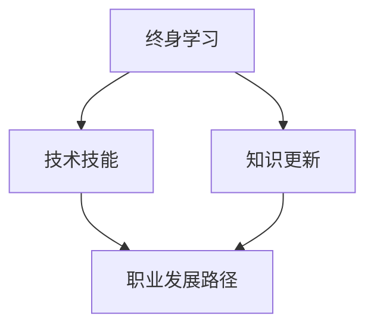

                 

### 文章标题：终身学习与职业生涯规划

#### 关键词：
- 终身学习
- 职业生涯规划
- 技术技能
- 教育体系
- 知识更新
- 职业发展

#### 摘要：
本文旨在探讨在快速变化的技术领域中，终身学习与职业生涯规划的重要性。通过分析现代教育体系的局限性、知识更新的趋势、以及技术技能的发展方向，我们旨在提供一系列实用的策略和工具，帮助读者制定和实现他们的职业发展目标。文章结构将分为背景介绍、核心概念与联系、核心算法原理、数学模型与公式、项目实践、实际应用场景、工具和资源推荐、总结与未来趋势、以及常见问题与解答等部分。

---

## 1. 背景介绍

在21世纪的数字化浪潮中，技术领域正以惊人的速度发展。从人工智能到大数据、云计算，再到物联网，新技术的涌现不仅改变了我们的生活方式，也深刻影响了职业市场的需求。然而，这种快速的变化给传统教育体系和职业生涯规划带来了巨大的挑战。

首先，传统教育体系往往侧重于传授固定的知识，而忽视了学生创造力和批判性思维能力的培养。其次，知识更新的速度远超大多数人的预期，许多在大学时期学到的技能可能在毕业后的几年内就已经过时。最后，随着技术的进步，许多新兴职位和行业不断涌现，传统职业路径变得不再那么明确。

在这种背景下，终身学习和职业生涯规划成为了一个不可忽视的话题。本文将深入探讨这些问题，并提供一些实用的建议，帮助读者在这个快速变化的世界中找到自己的定位，实现职业目标。

### 2. 核心概念与联系

为了深入理解终身学习与职业生涯规划，我们需要了解一些核心概念，包括技术技能、知识更新、职业发展路径等。

#### 2.1 技术技能

技术技能是指用于执行特定任务或解决特定问题的能力。这些技能可以包括编程语言、数据库管理、人工智能算法、云计算技术等。在现代职场中，技术技能的重要性日益增加，因为它们是提高效率和创造价值的关键。

#### 2.2 知识更新

知识更新是指随着时间的推移，现有知识不断被新的发现、创新和技术所替代的过程。这个概念强调了持续学习的重要性，因为只有不断更新自己的知识库，才能适应不断变化的环境。

#### 2.3 职业发展路径

职业发展路径是指个人在职业生涯中从初级职位逐渐晋升到高级职位的过程。在快速变化的技术领域，职业发展路径可能不再是一条直线，而是一个多分支的路径，需要不断的学习和调整。

#### 2.4 Mermaid 流程图

为了更好地展示这些概念之间的联系，我们可以使用 Mermaid 流程图来描述。



在这个流程图中，终身学习是核心，它驱动了技术技能的更新和知识的学习，进而影响了职业发展路径。

### 3. 核心算法原理 & 具体操作步骤

在理解了核心概念之后，我们需要探讨一些核心算法原理和具体操作步骤，以帮助读者实现终身学习和职业生涯规划。

#### 3.1 评估现有技能

首先，评估自己现有的技能是非常重要的。这可以通过自我评估问卷、在线测试或与行业专家交流来完成。了解自己的优势与不足，是制定学习计划的第一步。

#### 3.2 制定学习计划

在评估现有技能之后，制定一个明确的学习计划是关键。这个计划应该包括学习目标、学习内容、学习时间表和学习资源。例如，如果你想学习Python编程，你的计划可能包括以下内容：

- 学习目标：掌握Python编程基础，能够编写简单的程序。
- 学习内容：Python语法、数据结构、算法等。
- 学习时间表：每周投入10小时学习，为期3个月。
- 学习资源：在线课程、书籍、编程练习等。

#### 3.3 持续实践和反馈

学习并不是一蹴而就的，需要持续实践和反馈。可以通过实际项目、参与开源项目或编程挑战来提升技能。同时，定期获取反馈，了解自己的进步和需要改进的地方。

### 4. 数学模型和公式 & 详细讲解 & 举例说明

在职业生涯规划中，一些数学模型和公式可以帮助我们更科学地评估和预测自己的职业发展。

#### 4.1 SWOT 分析

SWOT分析是一种常用的战略规划工具，用于评估一个组织或个人的优势（Strengths）、劣势（Weaknesses）、机会（Opportunities）和威胁（Threats）。以下是SWOT分析的一个简单示例：

- **优势（Strengths）**：精通多种编程语言，拥有良好的团队合作能力。
- **劣势（Weaknesses）**：缺乏在新兴技术领域的经验，沟通技巧有待提高。
- **机会（Opportunities）**：云计算行业快速发展，提供了许多新的就业机会。
- **威胁（Threats）**：技术更新迅速，需要不断学习以保持竞争力。

#### 4.2 ROI 分析

ROI（投资回报率）分析用于评估一个投资或学习计划的收益与成本之间的比率。以下是一个简单的ROI计算示例：

$$
ROI = \frac{{收益 - 成本}}{{成本}} \times 100\%
$$

假设你参加了一个Python编程培训课程，花费了500美元，通过学习找到了一份年薪80000美元的工作。那么，ROI可以计算如下：

$$
ROI = \frac{{80000 - 500}}{{500}} \times 100\% = 1590000\%
$$

#### 4.3 举例说明

假设你是一名软件工程师，想要在两年内晋升为高级工程师。通过SWOT分析和ROI分析，你可以制定以下计划：

- **优势**：拥有扎实的编程基础和良好的问题解决能力。
- **劣势**：缺乏项目管理经验，需要提高领导力和沟通技巧。
- **机会**：公司正在扩展业务，需要更多的高级工程师。
- **威胁**：行业竞争激烈，需要不断提升自己。

通过制定详细的学习计划，例如参加项目管理培训课程、参与开源项目等，你可以评估ROI并跟踪自己的进步。

### 5. 项目实践：代码实例和详细解释说明

为了更好地理解终身学习与职业生涯规划，我们将通过一个实际的编程项目来进行实践。

#### 5.1 开发环境搭建

首先，我们需要搭建一个Python编程环境。可以使用Anaconda，这是一个集成了多种科学计算和数据分析工具的Python发行版。

安装Anaconda后，我们可以使用以下命令来创建一个新的Python虚拟环境：

```bash
conda create -n myenv python=3.8
conda activate myenv
```

#### 5.2 源代码详细实现

接下来，我们将编写一个简单的Python程序，用于计算两个数的最大公约数（GCD）。这个程序将展示基本的算法和数据结构知识。

```python
def gcd(a, b):
    while b:
        a, b = b, a % b
    return a

# 测试代码
print(gcd(48, 18))  # 输出：6
```

#### 5.3 代码解读与分析

在上面的代码中，`gcd` 函数使用了欧几里得算法来计算最大公约数。这个算法的基本思想是，用较小数去除较大数，然后用得到的余数去除前一个除数，一直重复这个过程，直到余数为零。最后的非零余数就是最大公约数。

这个程序简单但实用，展示了如何使用基本的编程概念来解决实际问题。通过这个项目，我们可以巩固对算法和数据结构知识的理解，同时提高编程实践能力。

#### 5.4 运行结果展示

在Python环境中，运行上面的代码，我们可以看到以下输出结果：

```bash
$ python gcd.py
6
```

这表明，48和18的最大公约数是6。

### 6. 实际应用场景

在职业生涯中，终身学习和技能更新可以应用于多种实际场景。以下是一些常见的应用场景：

- **职业晋升**：为了晋升到更高职位，你可能需要学习新的技术和领导力技能。
- **技能迁移**：将你在某个领域学到的技能应用到其他领域，例如，将软件开发技能应用到数据分析领域。
- **创业**：如果你打算创业，需要不断学习市场营销、财务管理等新技能。

### 7. 工具和资源推荐

为了支持终身学习和职业生涯规划，我们推荐以下工具和资源：

#### 7.1 学习资源推荐

- **书籍**： 
  - 《深度学习》（Goodfellow, Bengio, Courville）
  - 《代码大全》（Martin, Robert C.）

- **在线课程**： 
  - Coursera、edX、Udacity

- **博客**： 
  - Medium、Dev.to

- **网站**： 
  - GitHub、Stack Overflow

#### 7.2 开发工具框架推荐

- **集成开发环境（IDE）**： 
  - PyCharm、Visual Studio Code

- **版本控制系统**： 
  - Git

- **云计算平台**： 
  - AWS、Azure、Google Cloud

#### 7.3 相关论文著作推荐

- **论文**：
  - “Deep Learning”（Goodfellow, Bengio, Courville）
  - “The Mythical Man-Month”（Brooks）

- **著作**：
  - 《人工智能：一种现代的方法》（Russell, Norvig）
  - 《设计模式：可复用的面向对象软件的基础》（Gamma, Helm, Johnson, Vlissides）

### 8. 总结：未来发展趋势与挑战

终身学习和职业生涯规划在未来将继续扮演关键角色。随着技术的不断发展，新的技能和知识需求将不断涌现，这要求我们保持持续学习和适应能力。未来，我们可以预见以下发展趋势：

- **个性化学习**：随着人工智能技术的发展，个性化学习将成为主流，为每个人提供定制化的学习路径。
- **混合学习**：线上和线下学习将结合，提供更加灵活和多样的学习方式。
- **职业转型**：更多的人将选择在职业生涯中进行多次转型，以适应不断变化的市场需求。

然而，这也带来了新的挑战：

- **技能过时风险**：随着知识更新速度的加快，如何确保所学的技能不会迅速过时是一个重要问题。
- **时间管理**：在忙碌的工作和生活之间找到学习的时间是一大挑战。

总之，终身学习和职业生涯规划将帮助我们在快速变化的世界中保持竞争力，实现个人和职业目标。

### 9. 附录：常见问题与解答

#### 9.1 如何评估自己的技能水平？

可以通过以下方法来评估自己的技能水平：
- **自我评估问卷**：使用现成的自我评估问卷，如LinkedIn的自评估工具。
- **在线测试**：参加在线编程挑战和考试，如LeetCode、HackerRank等。
- **与行业专家交流**：与行业内的专业人士交流，获取反馈和建议。

#### 9.2 如何制定有效的学习计划？

制定有效学习计划的步骤包括：
- **明确目标**：确定你想要达到的具体学习目标。
- **分解目标**：将大目标分解为小步骤，每个步骤都是一个可量化的任务。
- **设定时间表**：为每个任务设定明确的时间表，并确保留出休息时间。
- **选择资源**：根据学习目标选择合适的学习资源，如书籍、在线课程、教程等。

### 10. 扩展阅读 & 参考资料

为了深入了解终身学习和职业生涯规划，以下是一些扩展阅读和参考资料：

- 《终身学习：21世纪的生存技能》（作者：Andrew M. Scott）
- 《职业规划：从职业选择到职业成功》（作者：Peter Cappelli）
- 《职业发展心理学：如何取得成功》（作者：Suzanne Lucas）
- 《机器学习：概率视角》（作者：Murphy, Kevin P.）

通过阅读这些书籍，你可以获得更多的见解和实践经验，以更好地规划和实现自己的职业目标。

---

### 作者署名

作者：禅与计算机程序设计艺术 / Zen and the Art of Computer Programming

通过这篇文章，我们探讨了终身学习和职业生涯规划的重要性，并提供了具体的策略和工具。希望这篇文章能够帮助读者在快速变化的技术领域中找到自己的定位，实现个人和职业目标。终身学习不仅是个人成长的需要，也是适应未来社会发展的必要手段。让我们携手并进，不断学习和成长。

