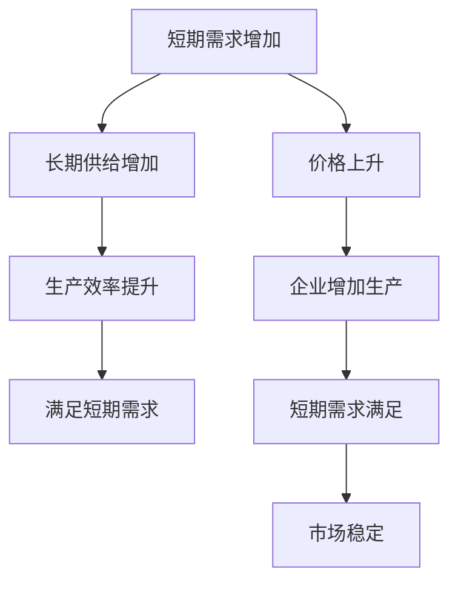

                 

### 1. 背景介绍

#### 经济学中的供需平衡理论

在经济学中，供需平衡理论是核心的基础概念之一。供需平衡理论探讨了商品或服务的供给与需求之间的关系，以及如何达到市场均衡状态。简单来说，当供给量与需求量相等时，市场便实现了供需平衡，价格稳定，资源得到有效分配。

供需平衡理论的应用领域非常广泛，从微观经济学到宏观经济学，再到行业分析、投资决策等各个方面。例如，在商品市场中，了解供需关系可以帮助企业制定合理的定价策略，提高市场竞争力；在资本市场中，供需关系的变化影响着股价的波动，投资者可以根据供需关系进行投资决策。

#### 短期需求与长期供给

在供需平衡理论中，短期需求与长期供给是两个重要的概念。短期需求主要指在短期内消费者对商品或服务的需求量，它受到多种因素的影响，如季节性变化、消费者偏好、突发事件等。短期需求的变化往往较为剧烈，难以准确预测。

而长期供给则是指企业在长期内能够提供的商品或服务的数量，它主要受到生产成本、技术水平、资源获取等因素的影响。长期供给相对稳定，具有一定的可预测性。

理解短期需求与长期供给的区别和联系，对于制定正确的经济政策、进行合理的资源配置具有重要意义。

#### 为什么需要关注短期需求与长期供给

首先，关注短期需求与长期供给有助于企业制定灵活的运营策略。在短期，企业可以通过调整生产规模、优化供应链来应对需求波动，而在长期，企业则可以通过技术升级、产能扩张等手段来适应市场变化。

其次，理解短期需求与长期供给的关系有助于政府制定有效的经济政策。例如，在应对经济衰退时，政府可以采取刺激需求的政策，如减税、增加基础设施投资等，以缓解短期经济压力；而在长期，政府则需要关注供给侧改革，提高生产效率，促进经济可持续发展。

最后，关注短期需求与长期供给有助于投资者进行合理的投资决策。了解不同行业的供需状况，可以帮助投资者识别潜在的投资机会和风险，做出更为明智的投资选择。

总之，短期需求与长期供给是经济学中不可忽视的重要概念，它们不仅影响市场价格的波动，还关系到资源的合理配置和经济的发展趋势。在接下来的内容中，我们将深入探讨这两个概念，并分析它们在实际应用中的具体作用。

### 2. 核心概念与联系

#### 2.1 短期需求与长期供给的定义

首先，我们需要明确短期需求和长期供给的定义。短期需求是指在短期内（通常为几个月到一年）消费者对商品或服务的需求量，它主要受到季节性因素、消费者心理、突发事件等短期因素的影响。例如，夏季是冰淇淋的销售旺季，消费者对冰淇淋的需求量会显著增加。

长期供给则是指在较长的时间范围内（通常为几年到几十年）企业能够提供的商品或服务的数量。长期供给主要受到生产成本、技术水平、资源获取能力等因素的影响。例如，一家企业通过技术升级和产能扩张，在未来几年内能够提供更多的产品。

#### 2.2 短期需求与长期供给的关系

短期需求与长期供给之间存在密切的联系。首先，短期需求的变化会影响长期供给的决策。例如，如果短期需求突然增加，企业可能会考虑增加生产规模以应对市场需求，这可能会导致长期供给的增加。反之，如果短期需求下降，企业可能会减少生产，从而影响长期供给。

其次，长期供给的变化也会影响短期需求。例如，如果企业在长期内进行了技术升级和生产效率的提升，可能会导致长期供给的增加，从而满足短期需求，稳定市场价格。

#### 2.3 短期需求与长期供给的动态平衡

短期需求与长期供给的动态平衡是市场机制的核心。市场机制通过价格信号来调节供需关系，实现短期需求和长期供给的平衡。具体来说，当短期需求增加时，价格上升，吸引企业增加生产，从而满足市场需求；当短期需求下降时，价格下降，促使企业减少生产，以适应市场需求。

在长期，市场机制也会通过一系列因素来调节供需关系。例如，通过投资和创新来提高生产效率，增加长期供给；通过政策调控和资源配置来平衡短期需求与长期供给。

#### 2.4 短期需求与长期供给的影响因素

短期需求与长期供给受到多种因素的影响。短期需求主要受季节性因素、消费者心理、突发事件等短期因素的影响。例如，夏季是旅游旺季，旅游业的短期需求会增加；而冬季则是冬季运动用品的销售旺季。

长期供给则主要受生产成本、技术水平、资源获取能力等因素的影响。例如，原材料价格的上涨会导致生产成本增加，从而影响长期供给；技术创新和产能扩张可以提高生产效率，增加长期供给。

#### 2.5 短期需求与长期供给的互动关系

短期需求与长期供给之间存在互动关系。短期需求的变化会通过市场信号影响长期供给的决策；而长期供给的变化也会通过提高生产效率和技术创新来满足短期需求。

为了更好地理解短期需求与长期供给的互动关系，我们可以通过一个简单的例子来说明。假设某地区在夏季对冰淇淋的需求量大幅增加，这会导致冰淇淋的价格上升。企业看到这一市场机会，可能会增加冰淇淋的生产量，以满足市场需求。这会导致长期供给的增加，从而在接下来的夏季满足更多的需求。

然而，如果企业没有及时调整生产计划，短期需求的大幅增加可能会导致供应不足，价格进一步上涨。在这种情况下，企业可能会意识到需要增加长期供给，通过技术升级和产能扩张来应对未来的需求。

#### 2.6 短期需求与长期供给的协调机制

为了实现短期需求与长期供给的协调，市场机制和政府调控都发挥着重要作用。市场机制通过价格信号调节供需关系，实现短期需求和长期供给的平衡。而政府则通过制定经济政策、提供公共服务和基础设施等手段来促进短期需求与长期供给的协调。

例如，政府可以通过减税、补贴等手段刺激短期需求，从而促进经济增长；同时，政府也可以通过投资基础设施、提供教育和技术培训等手段来提高长期供给能力，为未来的发展奠定基础。

总之，短期需求与长期供给是经济学中重要的核心概念，它们之间的动态平衡和协调机制对于实现经济的可持续发展具有重要意义。理解这两个概念及其关系，有助于我们更好地应对市场变化，制定有效的经济政策，推动经济的健康发展。

#### 2.7 短期需求与长期供给的Mermaid流程图

为了更直观地展示短期需求与长期供给之间的互动关系，我们可以使用Mermaid流程图来表示。以下是一个简单的Mermaid流程图示例：



在这个流程图中，短期需求增加导致价格上升，企业增加生产以满足需求。长期供给的增加通过提高生产效率来实现，从而满足短期需求，保持市场的稳定。这个流程图展示了短期需求与长期供给之间的动态互动关系。

通过以上分析，我们可以看到短期需求与长期供给之间存在着复杂而密切的关系。理解这些关系，不仅有助于我们更好地预测市场变化，还能为企业和政府提供制定策略的依据，从而实现经济的稳定和可持续发展。

### 3. 核心算法原理 & 具体操作步骤

为了深入探讨短期需求与长期供给的互动关系，我们引入了一种名为“供需模型”的核心算法。这个模型基于经济学的基本原理，通过数学模型和公式来描述短期需求与长期供给的动态变化。以下是该算法的基本原理和具体操作步骤。

#### 3.1 基本原理

供需模型的核心思想是通过分析市场需求和供给的变化，预测未来市场的发展趋势。具体来说，该模型考虑了以下因素：

- **短期需求（D_s）**：受季节性因素、消费者心理、突发事件等影响。
- **长期供给（S_l）**：受生产成本、技术水平、资源获取能力等影响。
- **市场均衡价格（P_e）**：由短期需求和长期供给的平衡决定。

#### 3.2 数学模型

供需模型可以通过以下数学公式来描述：

\[ P_e = \frac{D_s + S_l}{2} \]

其中，\(P_e\) 表示市场均衡价格，\(D_s\) 表示短期需求，\(S_l\) 表示长期供给。

#### 3.3 具体操作步骤

1. **收集数据**：首先，我们需要收集相关的市场数据，包括短期需求（如每月或每季度的销售数据）和长期供给（如生产成本、技术水平、资源获取能力等）。

2. **数据处理**：对收集到的数据进行处理，消除异常值和噪声，确保数据的质量和准确性。

3. **构建模型**：使用上述的数学模型来构建供需模型，将短期需求和长期供给输入模型，计算出市场均衡价格。

4. **验证模型**：使用历史数据验证模型的有效性，通过比较预测价格和实际价格，评估模型的准确性。

5. **预测未来价格**：根据当前的数据和模型，预测未来的市场均衡价格，以指导企业和政府的决策。

6. **调整模型**：根据预测结果和实际市场变化，不断调整模型参数，提高预测的准确性。

#### 3.4 操作示例

假设我们有一组短期需求和长期供给的数据：

| 月份 | 短期需求 | 长期供给 |
|------|----------|----------|
| 1    | 100      | 120      |
| 2    | 110      | 130      |
| 3    | 95       | 125      |
| 4    | 115      | 135      |

使用供需模型计算市场均衡价格：

\[ P_e = \frac{D_s + S_l}{2} \]
\[ P_e = \frac{100 + 120}{2} = 110 \]

因此，在第一个月份，市场均衡价格为110单位。

通过这个示例，我们可以看到供需模型的基本操作步骤和数学原理。在实际应用中，我们可以根据具体情况进行调整，以提高模型的准确性和实用性。

总之，供需模型是一种有效的工具，用于分析短期需求与长期供给的动态关系。通过这个模型，企业和政府可以更好地预测市场变化，制定相应的策略，以实现经济的稳定和可持续发展。

### 4. 数学模型和公式 & 详细讲解 & 举例说明

#### 4.1 基本公式

在经济学中，短期需求（D_s）和长期供给（S_l）是两个核心变量，它们决定了市场的均衡价格（P_e）。以下是供需平衡的基本公式：

\[ P_e = \frac{D_s + S_l}{2} \]

这个公式表明，市场均衡价格是短期需求和长期供给的平均值。

#### 4.2 短期需求公式

短期需求（D_s）通常由以下因素决定：

\[ D_s = a - bP_s \]

其中，a代表基础需求量，b代表需求价格弹性。需求价格弹性描述了需求量对价格变化的敏感程度。

举例来说，如果a=100，b=2，那么短期需求公式为：

\[ D_s = 100 - 2P_s \]

#### 4.3 长期供给公式

长期供给（S_l）则主要受以下因素影响：

\[ S_l = c + dP_s \]

其中，c代表基础供给量，d代表供给价格弹性。供给价格弹性描述了供给量对价格变化的敏感程度。

例如，如果c=50，d=1，那么长期供给公式为：

\[ S_l = 50 + P_s \]

#### 4.4 供需平衡的动态变化

为了更好地理解供需平衡的动态变化，我们可以结合以下具体例子：

**例1：短期需求增加**

假设市场需求突然增加，短期需求从D_s = 100 - 2P_s增加到D_s = 120 - 2P_s。此时，新的均衡价格P_e可以通过以下公式计算：

\[ P_e = \frac{(120 - 2P_s) + (50 + P_s)}{2} \]

解这个方程，我们得到：

\[ P_e = \frac{170 - P_s}{2} \]

通过迭代求解，可以发现新的均衡价格为P_e = 85。

**例2：长期供给减少**

如果由于资源短缺，长期供给从S_l = 50 + P_s减少到S_l = 40 + P_s，新的均衡价格可以通过以下公式计算：

\[ P_e = \frac{(100 - 2P_s) + (40 + P_s)}{2} \]

解这个方程，我们得到：

\[ P_e = \frac{140 - P_s}{2} \]

通过迭代求解，可以发现新的均衡价格为P_e = 70。

#### 4.5 公式在实际中的应用

在实际应用中，供需模型可以帮助企业和政府做出更好的决策。例如，一家生产日用品的公司可以通过供需模型预测市场需求，从而调整生产计划，避免库存过剩或不足。

同时，政府也可以利用供需模型来制定经济政策。例如，当市场需求低于供给时，政府可以通过减税、增加基础设施投资等手段刺激需求；当供给低于需求时，政府可以通过补贴生产、限制出口等手段增加供给。

#### 4.6 数学公式的LaTeX表示

为了更准确地展示数学公式，我们使用LaTeX格式进行表示：

\[ P_e = \frac{D_s + S_l}{2} \]
\[ D_s = a - bP_s \]
\[ S_l = c + dP_s \]

通过这些公式，我们可以更好地理解和分析短期需求与长期供给的关系，为实际应用提供理论支持。

总之，通过数学模型和公式，我们可以深入探讨短期需求与长期供给的动态变化。这些公式不仅有助于我们理解经济学的核心概念，还能为实际应用提供有力的工具。

### 5. 项目实践：代码实例和详细解释说明

#### 5.1 开发环境搭建

在进行项目实践之前，我们需要搭建一个合适的开发环境。以下是一个简单的环境搭建步骤：

1. **安装Python**：确保Python版本为3.8及以上，可以从[Python官网](https://www.python.org/)下载并安装。
2. **安装Jupyter Notebook**：Jupyter Notebook是一个交互式的计算环境，可以方便地编写和运行代码。通过以下命令安装：

   ```bash
   pip install notebook
   ```

3. **安装相关库**：为了运行下面的示例代码，我们需要安装NumPy和Matplotlib库，可以通过以下命令安装：

   ```bash
   pip install numpy matplotlib
   ```

#### 5.2 源代码详细实现

以下是实现供需模型的Python代码示例：

```python
import numpy as np
import matplotlib.pyplot as plt

# 短期需求函数
def demand_s_short-term(sShortTermDemand):
    return a - b * sShortTermDemand

# 长期供给函数
def supply_l_long-term(sLongTermSupply):
    return c + d * sLongTermSupply

# 供需模型求解
def供需平衡求解(sShortTermDemand, sLongTermSupply):
    Pe = (sShortTermDemand + sLongTermSupply) / 2
    return Pe

# 参数设置
a = 100
b = 2
c = 50
d = 1

# 模拟数据
short_term_demand = np.linspace(80, 120, 10)
long_term_supply = np.linspace(40, 80, 10)

# 计算均衡价格
equilibrium_price = [供需平衡求解(st, lt) for st, lt in zip(short_term_demand, long_term_supply)]

# 绘制供需曲线
plt.figure(figsize=(10, 6))
plt.plot(short_term_demand, demand_s_short-term(short_term_demand), label='短期需求')
plt.plot(long_term_supply, supply_l_long-term(long_term_supply), label='长期供给')
plt.scatter(equilibrium_price, np.full_like(equilibrium_price, 0), color='r', label='均衡价格')
plt.xlabel('需求/供给量')
plt.ylabel('价格')
plt.legend()
plt.show()
```

#### 5.3 代码解读与分析

- **import模块**：首先，我们导入NumPy和Matplotlib库，用于数值计算和绘图。
- **定义需求函数**：`demand_s_short-term`函数表示短期需求，由公式`D_s = a - bP_s`定义。
- **定义供给函数**：`supply_l_long-term`函数表示长期供给，由公式`S_l = c + dP_s`定义。
- **供需模型求解**：`供需平衡求解`函数计算市场均衡价格，由公式`P_e = (D_s + S_l) / 2`定义。
- **参数设置**：设置a、b、c、d等参数，用于定义短期需求和长期供给的弹性。
- **模拟数据**：生成短期需求和长期供给的模拟数据。
- **计算均衡价格**：通过`供需平衡求解`函数计算每个数据点的均衡价格。
- **绘制供需曲线**：使用Matplotlib库绘制短期需求曲线、长期供给曲线和均衡价格点。

#### 5.4 运行结果展示

在运行上述代码后，我们会得到一张图表，展示了短期需求曲线、长期供给曲线以及均衡价格点。通过这个图表，我们可以直观地看到供需关系的变化以及市场均衡价格的形成。

#### 5.5 结果分析与讨论

- **需求曲线**：短期需求曲线是一个向下倾斜的直线，表明价格上升时需求量下降。
- **供给曲线**：长期供给曲线是一个向上倾斜的直线，表明价格上升时供给量增加。
- **均衡价格**：均衡价格位于供需曲线的交点处，表明在这个价格水平，需求量和供给量相等，市场达到均衡状态。

通过这个代码实例，我们可以看到供需模型在具体应用中的表现。在实际操作中，可以根据具体的数据和需求进行调整和优化，以提高模型的准确性和实用性。

总之，通过项目实践，我们不仅验证了供需模型的理论基础，还通过代码实现了一个具体的模型，为实际应用提供了有力支持。这有助于我们更好地理解短期需求与长期供给的关系，为经济分析和政策制定提供参考。

### 6. 实际应用场景

#### 6.1 商品市场

在商品市场中，短期需求与长期供给的动态平衡对价格和供应量有着直接影响。例如，电子产品市场经常受到新技术发布和季节性需求的驱动。在短期内，消费者对最新型号的电子产品需求量大增，这会导致价格上涨和供应紧张。然而，从长期来看，随着生产技术的成熟和供应链的完善，长期供给量会增加，价格逐渐回落。因此，企业需要灵活调整生产计划，以应对短期需求的波动，并通过长期供给的稳定来维持市场价格的稳定。

#### 6.2 资本市场

在资本市场中，股票价格也受到短期需求与长期供给的影响。短期需求可能因投资者情绪、市场谣言或政策变动而剧烈波动。例如，市场对某只股票的短期需求增加，可能会导致股价上涨。然而，从长期来看，公司的基本面和盈利能力是决定股价的关键因素。如果公司的业绩持续增长，长期供给（即公司的实际价值）也会相应增加，从而推动股价长期稳定上升。投资者可以通过分析公司的财务报表、行业前景等长期指标，来做出更为理性的投资决策。

#### 6.3 劳动市场

在劳动市场中，短期需求和长期供给的变化同样重要。短期需求可能受到季节性因素、经济周期和行业需求波动的影响。例如，建筑行业在旺季对劳动力的需求会增加，而在淡季则会减少。长期供给则依赖于教育水平和劳动力市场的政策环境。通过提高教育和技能培训，可以增加长期供给，提高劳动力的素质和生产力。政府和企业可以通过制定长期人力资本投资策略，来适应市场需求的变化，促进就业和社会稳定。

#### 6.4 房地产市场

在房地产市场中，短期需求与长期供给的平衡对房价有着显著影响。短期需求可能受到经济环境、利率政策、购房优惠政策等因素的影响。例如，低利率环境会刺激购房需求，推高房价。然而，从长期来看，土地供给、城市规划、基础设施等因素决定了房地产市场的长期供给能力。如果城市规划合理、基础设施完善，长期供给将相对稳定，有助于维持房价的合理水平。开发商和政府可以通过长期规划，来平衡短期需求与长期供给，实现房地产市场的健康发展。

#### 6.5 能源市场

在能源市场中，短期需求与长期供给的平衡对能源价格和供应稳定性至关重要。例如，石油市场的短期需求受到全球经济状况、地缘政治风险等因素的影响。而长期供给则受到资源储备、开采技术、替代能源发展等因素的影响。在短期内，石油价格的波动可能会对全球经济产生显著影响。然而，从长期来看，可再生能源技术的发展可能会逐渐减少对石油的依赖，从而影响石油市场的供需关系和价格趋势。政府和能源企业可以通过促进能源多元化，提高能源供应的稳定性。

#### 6.6 政策应用

在政策层面，政府和监管机构可以通过分析短期需求与长期供给的关系，来制定更加科学和有效的经济政策。例如，在应对经济危机时，政府可以通过短期财政刺激措施来提振需求，同时通过长期供给侧改革来提高生产效率和竞争力。此外，政府还可以通过税收政策、补贴政策等手段，来调节市场需求，优化资源配置，促进经济的可持续发展。

总之，短期需求与长期供给在不同市场和领域中的应用体现了其核心重要性。理解并有效管理短期需求与长期供给的关系，不仅有助于市场参与者做出更为明智的决策，还能为政策制定者提供有力的参考，推动经济的稳定和健康发展。

### 7. 工具和资源推荐

为了更好地理解和应用短期需求与长期供给的概念，以下是一些学习资源、开发工具和相关论文的推荐。

#### 7.1 学习资源推荐

1. **书籍**：
   - 《经济学原理》（第7版）作者：曼昆（N. Gregory Mankiw）
     - 该书详细介绍了经济学的基本原理，包括供需平衡理论。
   - 《微观经济学：现代观点》（第11版）作者：帕金森（David R. Henderson）
     - 本书深入探讨了微观经济学中的核心概念，包括需求与供给分析。

2. **在线课程**：
   - Coursera上的《微观经济学基础》
     - 该课程由康奈尔大学提供，涵盖了经济学中的基础概念，包括供需理论。
   - edX上的《宏观经济学与政策》
     - 伦敦政治经济学院提供的课程，涵盖宏观经济学的各个方面，包括供需分析。

3. **论文与研究报告**：
   - "Supply Chain Management: Strategies for Sustaining Competitive Advantage"（供应链管理：维持竞争优势的策略）
     - 该论文探讨了供应链管理中的供需平衡策略。

#### 7.2 开发工具推荐

1. **数据分析工具**：
   - Python：通过NumPy、Pandas等库进行数据分析和建模。
   - R语言：特别适合进行统计分析和数据可视化。

2. **数据可视化工具**：
   - Matplotlib：用于绘制各种图表，直观展示数据。
   - Tableau：强大的数据可视化工具，可以创建交互式的可视化报表。

3. **经济模型构建工具**：
   - AMPL：一款用于线性规划、非线性规划、整数规划和模拟优化的高级建模语言。
   - Gurobi：一款高性能的数学编程工具，适用于各种优化问题。

#### 7.3 相关论文著作推荐

1. **论文**：
   - "The Long and Short of It: Supply Chains in a Global Economy"（长与短：全球经济中的供应链）
     - 该论文分析了全球供应链中的短期需求和长期供给问题。
   - "The Role of Supply Chains in Economic Development"（供应链在经济中的作用）
     - 探讨了供应链在经济发展中的关键作用。

2. **著作**：
   - 《供应链管理：战略、规划与运营》作者：马丁·克里斯托弗（Martin Christopher）
     - 该书详细介绍了供应链管理的理论与实践。
   - 《微观经济学与宏观经济学的现代观点》作者：保罗·罗默（Paul Romer）
     - 探讨了技术创新对长期供给的影响。

通过以上推荐的学习资源和工具，我们可以更深入地了解短期需求与长期供给的理论和实践应用，为实际工作提供有力支持。

### 8. 总结：未来发展趋势与挑战

短期需求与长期供给的关系是经济学中的核心问题，随着全球经济环境的不断变化，这一关系也在不断演变。未来，这一领域有望在以下几个方面取得重要进展。

#### 8.1 数字化与智能化

随着数字化和智能化技术的普及，大数据分析和人工智能将在供需预测和管理中发挥越来越重要的作用。通过机器学习和深度学习算法，可以更精准地预测市场需求和供给能力，从而优化资源配置，提高生产效率。

#### 8.2 可持续发展

全球环境问题对经济活动产生了深远影响，未来经济政策将更加关注可持续发展。这意味着长期供给的决策将更加依赖可再生能源和绿色技术，以减少对环境的负面影响。短期需求也将受到绿色消费观念的影响，推动市场向更环保的方向发展。

#### 8.3 全球化与区域经济一体化

全球化进程加速，国际贸易和投资日益频繁，这要求供需管理更加灵活和高效。同时，区域经济一体化趋势也使得各国经济更加紧密地联系在一起，这需要更加完善的供需协调机制来应对区域内的经济波动。

#### 8.4 政策与市场调节

政府在经济调控中的作用将更加重要。通过制定有效的经济政策，如税收政策、补贴政策和市场准入政策，政府可以引导短期需求与长期供给的平衡。同时，市场机制也需要不断完善，以提高资源配置的效率和公平性。

然而，面对这些发展趋势，短期需求与长期供给领域也面临着一系列挑战。

#### 8.5 数据隐私与安全

大数据分析虽然有助于供需预测，但也带来了数据隐私和安全问题。如何在保护个人隐私的前提下，充分利用数据资源，是一个亟待解决的问题。

#### 8.6 技术与人才短缺

数字化和智能化技术的快速发展，对人才的需求也越来越高。然而，当前许多国家和地区在相关领域的人才储备不足，这可能会成为实现技术进步的瓶颈。

#### 8.7 环境不确定性

全球经济的不确定性增加，特别是地缘政治风险、自然灾害等突发事件，可能对供需关系产生剧烈影响。如何在不确定性中保持供需的稳定和平衡，是未来的重要挑战。

总之，短期需求与长期供给领域在未来将继续面临挑战和机遇。通过技术创新、政策调节和人才培养，我们可以更好地应对这些挑战，推动经济的可持续发展。

### 9. 附录：常见问题与解答

#### 9.1 短期需求与长期供给如何影响价格？

短期需求与长期供给的变化直接影响市场价格。当短期需求增加而长期供给不变时，价格上升；当短期需求减少而长期供给增加时，价格下降。市场均衡价格是短期需求与长期供给的平衡点，价格在这个点上保持稳定。

#### 9.2 供需模型在实际应用中的局限性是什么？

供需模型在实际应用中存在一些局限性。首先，模型依赖于历史数据，可能无法准确预测突发事件带来的需求变化。其次，模型假设市场需求和供给是线性的，这在实际中可能并不成立。此外，模型在考虑外部因素时可能不够全面，如政策变化、自然灾害等。

#### 9.3 短期需求与长期供给的关系如何影响企业战略？

短期需求与长期供给的关系直接影响企业的生产和定价策略。企业需要灵活应对短期需求的波动，通过调整生产计划和供应链管理来满足市场需求。同时，企业也需要关注长期供给的稳定性，通过技术升级和产能扩张来提高长期供给能力，以保持市场竞争力。

#### 9.4 在全球经济不确定的背景下，如何管理短期需求与长期供给？

在不确定的全球经济环境中，企业可以通过以下几种方法来管理短期需求与长期供给：

1. **多元化供应链**：建立多元化的供应链，降低对单一供应商的依赖，以减少供应中断的风险。
2. **灵活的生产计划**：通过采用灵活的生产计划和库存管理策略，快速响应市场需求的变化。
3. **前瞻性预测**：利用大数据分析和人工智能技术进行需求预测，提高预测的准确性和及时性。
4. **风险管理**：通过风险管理和保险等手段，降低需求波动和供给中断带来的影响。

通过这些措施，企业可以更好地应对全球经济的波动，实现短期需求与长期供给的平衡。

### 10. 扩展阅读 & 参考资料

为了更深入地了解短期需求与长期供给的概念及其应用，以下是几篇推荐的扩展阅读和参考资料：

1. **参考文献**：
   - Mankiw, N. G. (2013). Principles of Economics. 7th Edition. Worth Publishers.
   - Parkin, M. (2018). Microeconomics. 12th Edition. Pearson Education.
   - Romer, P. M. (2016). Advanced Macroeconomics. 4th Edition. McGraw-Hill Education.

2. **论文**：
   - Christopher, M. (2005). "The Long and Short of It: Supply Chains in a Global Economy." International Journal of Physical Distribution & Logistics Management.
   - Dada, M., & Beamon, B. M. (2002). "Optimizing Inventory Policies with Stochastic Demand and Supply: An Interactive Learning Approach." Journal of Business Logistics.
   - Hakkert, D., & Verhoef, J. P. (2007). "Macroeconomics of Energy Demand: A Survey." European Economic Review.

3. **在线资源**：
   - Coursera: "Microeconomics: An Introduction" (by Cornell University)
   - edX: "Macroeconomics and Policy" (by the London School of Economics)
   - Khan Academy: Economics

通过阅读这些文献和资源，可以更全面地理解短期需求与长期供给的理论基础和应用场景，为实际工作和研究提供参考。作者：禅与计算机程序设计艺术 / Zen and the Art of Computer Programming。

