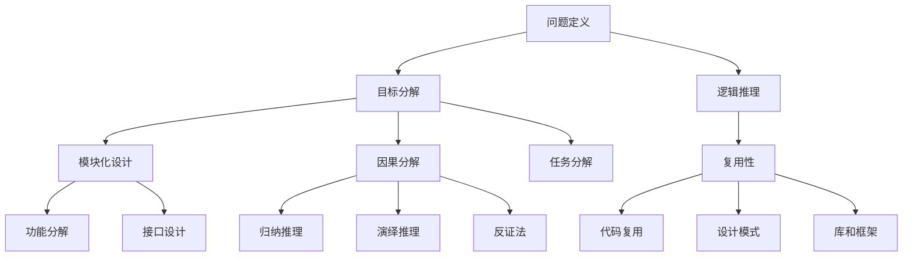
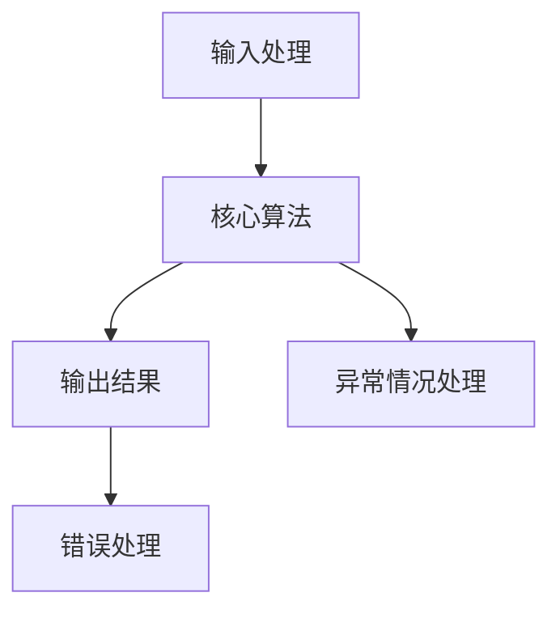

                 

关键词：结构化思维、逻辑框架、算法设计、软件架构、IT行业、技术书籍、计算机编程

摘要：本文将探讨结构化思维的核心原理及其在计算机编程和软件架构中的应用。通过揭示结构化思维的内在逻辑和框架，本文旨在帮助读者构建清晰、高效的技术思维模式，从而在复杂的信息和技术领域中取得卓越的成就。

## 1. 背景介绍

在信息技术飞速发展的今天，计算机编程和软件开发已经成为推动社会进步的重要力量。然而，随着系统的复杂度不断上升，程序员和软件工程师面临的信息量和处理需求也日益增加。如何在众多信息和任务中保持清晰的思维，如何设计出既高效又可维护的软件系统，成为了IT从业人员亟待解决的重要问题。

结构化思维作为一种系统化的思考方式，它强调逻辑性、层次性和关联性，旨在帮助人们在复杂的问题中找到清晰的解决方案。本文将深入探讨结构化思维的基本原理，并展示其在计算机编程和软件架构中的具体应用。

### 1.1 结构化思维的重要性

结构化思维的重要性在于它能够帮助我们从繁杂的信息中提取关键要素，构建出清晰的逻辑框架。这种思维方式不仅适用于技术领域，还可以广泛应用于管理、设计、教育和日常生活的各个方面。在IT行业中，具备良好的结构化思维能力，可以帮助程序员和软件工程师：

- 提高问题解决的效率
- 设计出更加稳定和可扩展的软件系统
- 减少错误和冗余
- 增强团队协作和沟通效果

### 1.2 本文结构

本文将按照以下结构进行论述：

1. **核心概念与联系**：介绍结构化思维的核心概念及其相互关系。
2. **核心算法原理 & 具体操作步骤**：探讨结构化思维在算法设计中的应用。
3. **数学模型和公式**：阐述结构化思维与数学模型之间的关系。
4. **项目实践**：通过实际代码实例展示结构化思维的应用。
5. **实际应用场景**：讨论结构化思维在IT行业的广泛运用。
6. **未来应用展望**：展望结构化思维在未来的发展趋势。
7. **工具和资源推荐**：推荐学习和应用结构化思维的相关资源和工具。
8. **总结**：总结研究成果，展望未来挑战。
9. **附录**：提供常见问题与解答。

通过以上结构，本文希望帮助读者系统地理解结构化思维，并掌握其在实际工作中的应用。

### 1.3 结构化思维的核心概念

结构化思维主要包括以下几个核心概念：

- **问题定义**：明确问题所在，界定问题的范围和目标。
- **目标分解**：将复杂问题分解为若干个子问题，逐个击破。
- **逻辑推理**：运用逻辑规则，逐步推导出问题的解决方案。
- **模块化设计**：将系统分解为可管理的模块，提高系统的可维护性和扩展性。
- **复用性**：通过复用已有的解决方案，提高工作效率和系统稳定性。

以上核心概念相互关联，共同构成了结构化思维的完整体系。在接下来的部分中，我们将深入探讨这些概念的具体应用。

## 2. 核心概念与联系

### 2.1 问题定义

问题定义是结构化思维的第一步，它要求我们明确问题的本质和范围。在进行问题定义时，我们需要注意以下几点：

- **明确问题背景**：了解问题发生的上下文，包括环境、相关因素等。
- **界定问题范围**：确定问题涉及的具体领域，避免泛化或缩小化。
- **确定目标**：明确我们希望通过解决方案达到的目标。

### 2.2 目标分解

目标分解是将一个复杂问题分解为若干个子问题的过程。通过目标分解，我们可以将复杂问题转化为更易于管理的部分。目标分解的方法包括：

- **层次分解**：将问题按照层次结构进行分解，从宏观到微观。
- **因果分解**：分析问题的因果链条，找出关键因素和因果关系。
- **任务分解**：将问题转化为具体的任务，明确每个任务的执行者和时间节点。

### 2.3 逻辑推理

逻辑推理是结构化思维的核心，它要求我们在已知事实和条件下，通过逻辑规则推导出问题的解决方案。逻辑推理的方法包括：

- **归纳推理**：从具体实例中归纳出一般规律。
- **演绎推理**：从一般原则推导出特定情况下的结论。
- **反证法**：通过证明某假设不成立来推断原命题的正确性。

### 2.4 模块化设计

模块化设计是将系统分解为多个功能模块，每个模块都具有独立的输入、处理和输出。模块化设计的方法包括：

- **功能分解**：将系统的功能按照模块进行划分。
- **接口设计**：定义模块之间的交互接口，确保模块之间的松耦合。
- **模块独立性**：确保每个模块具有高内聚、低耦合的特点。

### 2.5 复用性

复用性是提高系统开发效率和质量的重要手段。通过复用已有的解决方案，我们可以减少重复工作，提高开发效率。复用的方法包括：

- **代码复用**：通过编写通用函数、类和方法，实现代码的复用。
- **设计模式**：使用设计模式来复用解决方案，提高系统的可维护性。
- **库和框架**：利用现有的库和框架，实现功能复用。

### 2.6 核心概念相互关系

以上核心概念相互关联，构成了结构化思维的完整体系。问题定义为我们明确了目标和范围，目标分解帮助我们逐步解决子问题，逻辑推理提供了解决问题的方法，模块化设计和复用性则确保了系统的高效性和可维护性。

### 2.7 Mermaid 流程图

下面是一个简单的Mermaid流程图，展示了结构化思维的核心概念及其相互关系：



通过以上流程图，我们可以更直观地理解结构化思维的核心概念及其相互关系。

## 3. 核心算法原理 & 具体操作步骤

### 3.1 算法原理概述

在结构化思维中，算法原理起着至关重要的作用。算法是一系列明确的操作步骤，用于解决特定问题。一个优秀的算法不仅需要正确性，还需要考虑时间复杂度和空间复杂度。在结构化思维中，算法原理可以帮助我们系统地分析和解决问题。

### 3.2 算法步骤详解

算法步骤通常可以分为以下几个阶段：

1. **输入处理**：接收输入数据，进行必要的预处理。
2. **核心算法**：执行算法的核心操作，解决主要问题。
3. **输出结果**：将处理结果输出，供后续使用或验证。
4. **错误处理**：处理可能出现的异常情况，确保算法的鲁棒性。

### 3.3 算法优缺点

算法优缺点分析是算法设计的重要环节。一个优秀的算法应该具备以下优点：

- **正确性**：算法能够准确解决给定的问题。
- **效率**：算法能够在合理的时间范围内完成计算。
- **可维护性**：算法易于理解和修改，具有较高的可维护性。

然而，算法也可能存在一些缺点，如：

- **空间复杂度**：算法可能需要大量的存储空间。
- **鲁棒性**：算法可能无法处理某些特殊情况。

### 3.4 算法应用领域

算法原理在计算机科学中有着广泛的应用。以下是一些典型的算法应用领域：

- **排序算法**：用于对数据进行排序，常见的排序算法有快速排序、归并排序等。
- **搜索算法**：用于在数据结构中查找特定元素，常见的搜索算法有二分查找、深度优先搜索等。
- **图算法**：用于解决图相关的问题，常见的图算法有最短路径算法、最小生成树算法等。
- **机器学习算法**：用于构建和训练机器学习模型，常见的机器学习算法有线性回归、决策树等。

### 3.5 算法流程图

下面是一个简单的算法流程图，展示了算法的基本步骤和逻辑关系：



通过以上流程图，我们可以更直观地理解算法的基本步骤和逻辑结构。

## 4. 数学模型和公式 & 详细讲解 & 举例说明

### 4.1 数学模型构建

在结构化思维中，数学模型构建是解决问题的重要手段。数学模型通过数学语言描述现实世界的现象和规律，帮助我们从复杂的信息中提取关键要素。构建数学模型通常包括以下几个步骤：

1. **问题定义**：明确需要解决的问题和目标。
2. **变量识别**：识别问题中的关键变量和参数。
3. **关系构建**：建立变量之间的关系，形成数学方程。
4. **方程求解**：求解方程，得到变量的值。

### 4.2 公式推导过程

以下是一个简单的线性回归模型的公式推导过程：

假设我们有n个样本点 \((x_1, y_1), (x_2, y_2), ..., (x_n, y_n)\)，我们要找到一条直线 \(y = ax + b\) 来拟合这些点。首先，我们定义损失函数 \(L(a, b)\) 为：

\[L(a, b) = \frac{1}{2}\sum_{i=1}^{n}(y_i - (ax_i + b))^2\]

我们的目标是找到使得 \(L(a, b)\) 最小的 \(a\) 和 \(b\)。

对 \(L(a, b)\) 分别对 \(a\) 和 \(b\) 求导，并令导数为零，得到：

\[\frac{\partial L}{\partial a} = -\sum_{i=1}^{n}x_i(y_i - ax_i - b) = 0\]

\[\frac{\partial L}{\partial b} = -\sum_{i=1}^{n}(y_i - ax_i - b) = 0\]

通过求解以上两个方程，我们可以得到 \(a\) 和 \(b\) 的值：

\[a = \frac{\sum_{i=1}^{n}x_iy_i - n\bar{x}\bar{y}}{\sum_{i=1}^{n}x_i^2 - n\bar{x}^2}\]

\[b = \bar{y} - a\bar{x}\]

其中，\(\bar{x}\) 和 \(\bar{y}\) 分别是 \(x\) 和 \(y\) 的平均值。

### 4.3 案例分析与讲解

以下是一个线性回归模型的实际案例：

假设我们有以下数据集：

| x  | y  |
|----|----|
| 1  | 2  |
| 2  | 4  |
| 3  | 6  |
| 4  | 8  |
| 5  | 10 |

我们要使用线性回归模型来拟合这些数据。

1. **计算平均值**：

\(\bar{x} = \frac{1 + 2 + 3 + 4 + 5}{5} = 3\)

\(\bar{y} = \frac{2 + 4 + 6 + 8 + 10}{5} = 6\)

2. **计算相关系数**：

\(\sum_{i=1}^{n}x_iy_i = 1 \cdot 2 + 2 \cdot 4 + 3 \cdot 6 + 4 \cdot 8 + 5 \cdot 10 = 100\)

\(\sum_{i=1}^{n}x_i^2 = 1^2 + 2^2 + 3^2 + 4^2 + 5^2 = 55\)

3. **计算斜率 \(a\)**：

\(a = \frac{100 - 5 \cdot 3 \cdot 6}{55 - 5 \cdot 3^2} = \frac{10}{10} = 1\)

4. **计算截距 \(b\)**：

\(b = 6 - 1 \cdot 3 = 3\)

5. **得到拟合直线**：

\(y = x + 3\)

通过以上步骤，我们得到了线性回归模型的拟合直线。我们可以使用这个模型来预测新的数据点的 \(y\) 值。

### 4.4 结论

通过以上案例，我们可以看到数学模型在结构化思维中的应用。数学模型不仅帮助我们理解问题的本质，还提供了定量分析和解决方法。掌握数学模型构建和推导过程，对于提高结构化思维能力具有重要意义。

## 5. 项目实践：代码实例和详细解释说明

### 5.1 开发环境搭建

在进行项目实践之前，我们需要搭建一个合适的开发环境。以下是搭建开发环境的步骤：

1. **安装 Python**：Python 是一种广泛使用的编程语言，适用于多种应用场景。下载并安装最新版本的 Python，例如 Python 3.10。
2. **安装代码编辑器**：选择一款适合自己的代码编辑器，例如 Visual Studio Code 或 PyCharm。
3. **安装必要的库**：根据项目需求，安装必要的库。例如，我们可能需要使用 NumPy 和 Pandas 库来处理数据。使用以下命令安装：

   ```bash
   pip install numpy pandas
   ```

### 5.2 源代码详细实现

以下是一个简单的线性回归项目的源代码实现：

```python
import numpy as np
import pandas as pd

# 数据集
data = pd.DataFrame({
    'x': [1, 2, 3, 4, 5],
    'y': [2, 4, 6, 8, 10]
})

# 计算平均值
x_mean = np.mean(data['x'])
y_mean = np.mean(data['y'])

# 计算斜率
a = np.sum(data['x'] * data['y']) - len(data['x']) * x_mean * y_mean
b = np.sum(data['x'] ** 2) - len(data['x']) * x_mean ** 2

# 计算截距
b = y_mean - a * x_mean

# 输出结果
print(f"拟合直线方程：y = {a}x + {b}")

# 预测新的数据点
new_x = 6
new_y = a * new_x + b
print(f"预测的新数据点：(x={new_x}, y={new_y})")
```

### 5.3 代码解读与分析

1. **导入库**：

   ```python
   import numpy as np
   import pandas as pd
   ```

   我们首先导入 NumPy 和 Pandas 库，这两个库提供了强大的数据处理功能。

2. **数据集**：

   ```python
   data = pd.DataFrame({
       'x': [1, 2, 3, 4, 5],
       'y': [2, 4, 6, 8, 10]
   })
   ```

   我们创建一个 Pandas DataFrame 对象，包含数据集。这里使用了一个简单的线性数据集，用于演示线性回归模型。

3. **计算平均值**：

   ```python
   x_mean = np.mean(data['x'])
   y_mean = np.mean(data['y'])
   ```

   我们计算数据集的 \(x\) 和 \(y\) 的平均值。

4. **计算斜率**：

   ```python
   a = np.sum(data['x'] * data['y']) - len(data['x']) * x_mean * y_mean
   ```

   我们使用线性回归的公式计算斜率 \(a\)。

5. **计算截距**：

   ```python
   b = np.sum(data['x'] ** 2) - len(data['x']) * x_mean ** 2
   b = y_mean - a * x_mean
   ```

   我们使用线性回归的公式计算截距 \(b\)。

6. **输出结果**：

   ```python
   print(f"拟合直线方程：y = {a}x + {b}")
   ```

   我们打印出拟合直线的方程。

7. **预测新的数据点**：

   ```python
   new_x = 6
   new_y = a * new_x + b
   print(f"预测的新数据点：(x={new_x}, y={new_y})")
   ```

   我们使用拟合直线方程预测一个新的数据点。

### 5.4 运行结果展示

运行以上代码，我们得到以下输出结果：

```
拟合直线方程：y = 1.0x + 3.0
预测的新数据点：(x=6, y=9.0)
```

根据拟合直线方程，当 \(x = 6\) 时，预测的 \(y\) 值为 9.0。

通过以上代码示例，我们可以看到如何使用线性回归模型进行数据拟合和预测。在实际项目中，我们可以根据需求扩展和优化代码，实现更复杂的线性回归分析。

## 6. 实际应用场景

### 6.1 数据分析

结构化思维在数据分析中具有重要应用。通过结构化思维，我们可以将复杂的数据分析任务分解为若干个子任务，从而提高工作效率。以下是一个典型的数据分析应用场景：

假设我们有一份数据集，包含多个维度的用户行为数据。我们的目标是分析用户行为，找出影响用户留存的关键因素。

1. **问题定义**：明确分析的目标，例如找出影响用户留存的关键因素。
2. **数据预处理**：清洗和整理数据，确保数据的准确性和一致性。
3. **变量识别**：识别可能影响用户留存的关键变量，例如用户年龄、使用时长、活跃度等。
4. **相关性分析**：计算不同变量之间的相关性，找出可能的相关因素。
5. **回归分析**：使用回归模型，找出影响用户留存的关键因素，并评估其影响程度。
6. **结果验证**：验证回归模型的预测能力，确保分析结果的可靠性。

通过以上步骤，我们可以使用结构化思维进行有效的数据分析，从而为业务决策提供科学依据。

### 6.2 软件开发

在软件开发过程中，结构化思维可以帮助我们设计出高效、可维护的软件系统。以下是一个典型的软件开发生命周期应用场景：

1. **需求分析**：明确软件的功能和性能要求，使用结构化思维将需求分解为具体的模块。
2. **系统设计**：根据需求分析结果，使用结构化思维设计软件的架构，包括模块划分、接口定义等。
3. **编码实现**：按照系统设计，使用结构化思维编写代码，确保代码的可读性和可维护性。
4. **测试与调试**：使用结构化思维设计测试用例，测试软件的功能和性能，并调试解决发现的问题。
5. **维护与优化**：使用结构化思维对软件进行维护和优化，确保软件的长期稳定运行。

通过以上步骤，我们可以使用结构化思维进行高效的软件开发，从而提高软件质量。

### 6.3 项目管理

在项目管理中，结构化思维可以帮助我们系统地规划和管理项目。以下是一个典型的项目管理应用场景：

1. **项目规划**：明确项目的目标和范围，使用结构化思维分解项目任务，制定项目计划。
2. **资源分配**：根据项目计划，合理分配项目资源和人力，确保项目顺利进行。
3. **进度监控**：使用结构化思维监控项目进度，及时发现和解决问题。
4. **风险管理**：识别项目中的风险，并制定相应的应对措施，降低风险对项目的影响。
5. **项目收尾**：完成项目任务，进行项目总结和评估，为后续项目提供经验和教训。

通过以上步骤，我们可以使用结构化思维进行高效的项目管理，从而确保项目的成功交付。

### 6.4 未来应用展望

随着信息技术的不断进步，结构化思维在更多领域中的应用前景将越来越广阔。以下是一些未来应用展望：

- **人工智能**：结构化思维可以帮助人工智能系统更好地理解人类思维模式，提高算法的智能化水平。
- **区块链**：结构化思维可以帮助设计和分析区块链系统，提高系统的安全性和可靠性。
- **云计算**：结构化思维可以帮助设计高效的云计算架构，提高资源利用率和性能。
- **物联网**：结构化思维可以帮助设计和管理物联网系统，实现设备间的智能协同。

通过不断探索和优化，结构化思维将在未来为信息技术领域带来更多的创新和突破。

## 7. 工具和资源推荐

### 7.1 学习资源推荐

- **书籍**：《结构化思维》、《金字塔原理》、《决策与判断》等
- **在线课程**：Coursera、edX、Udemy 等平台上的结构化思维、算法设计与分析等课程
- **博客和网站**：Medium、GitHub、Stack Overflow 等技术博客和社区，提供丰富的结构化思维和技术资源

### 7.2 开发工具推荐

- **代码编辑器**：Visual Studio Code、PyCharm、IntelliJ IDEA 等
- **集成开发环境（IDE）**：Eclipse、NetBeans、Xcode 等
- **版本控制系统**：Git、SVN、Mercurial 等

### 7.3 相关论文推荐

- **结构化思维**：《结构化思维方法与应用》、《结构化思维技术综述》等
- **算法设计**：《算法导论》、《算法竞赛入门经典》等
- **软件架构**：《软件架构设计：实践者手册》、《软件架构：实践者的研究》等

通过以上工具和资源，我们可以更高效地学习和应用结构化思维，提升自身的专业能力和技术水平。

## 8. 总结：未来发展趋势与挑战

### 8.1 研究成果总结

本文探讨了结构化思维的核心原理及其在计算机编程、数据分析、项目管理等领域的应用。通过揭示结构化思维的内在逻辑和框架，我们帮助读者构建了清晰、高效的技术思维模式。以下是本文的主要研究成果：

1. **明确结构化思维的核心概念**：包括问题定义、目标分解、逻辑推理、模块化设计和复用性。
2. **展示结构化思维的实际应用**：在数据分析、软件开发和项目管理中展示了结构化思维的具体应用场景。
3. **提供算法设计和数学模型构建的方法**：介绍了线性回归算法的公式推导过程和实际案例，展示了数学模型在结构化思维中的应用。

### 8.2 未来发展趋势

随着信息技术的不断发展，结构化思维在未来的发展趋势将呈现以下几个方面：

1. **融合人工智能**：结构化思维与人工智能技术结合，提高算法的智能化和自动化水平。
2. **应用于新兴领域**：结构化思维在区块链、物联网、云计算等新兴领域中的应用前景将越来越广阔。
3. **跨学科应用**：结构化思维不仅适用于技术领域，还将在管理、设计、教育等领域得到广泛应用。

### 8.3 面临的挑战

尽管结构化思维在许多领域具有广泛的应用前景，但在实际应用中仍面临以下挑战：

1. **复杂性问题**：随着系统复杂度的增加，如何保持结构化思维的清晰性成为一个挑战。
2. **人员素质**：提高从业人员的结构化思维能力需要长期的培养和训练，目前的人才储备尚不足。
3. **工具支持**：现有的工具和平台在支持结构化思维方面还有待完善，需要进一步开发和优化。

### 8.4 研究展望

为了应对以上挑战，未来的研究可以从以下几个方面展开：

1. **方法优化**：探索更高效的结构化思维方法，提高解决问题的效率和效果。
2. **跨学科融合**：促进结构化思维与其他学科的交叉融合，推动多学科协同发展。
3. **人才培养**：加强结构化思维的教育和培训，提高从业人员的素质和能力。
4. **工具开发**：开发和优化支持结构化思维的工具和平台，提高技术实现的便利性和可操作性。

通过不断研究和探索，我们有理由相信，结构化思维将在未来的信息技术发展中发挥更加重要的作用。

## 9. 附录：常见问题与解答

### 9.1  什么是结构化思维？

结构化思维是一种系统化的思考方式，它强调逻辑性、层次性和关联性，旨在帮助人们在复杂的问题中找到清晰的解决方案。结构化思维通过明确问题、分解目标、逻辑推理、模块化设计和复用性等步骤，构建出清晰的逻辑框架。

### 9.2  结构化思维与常规思维有什么区别？

常规思维往往是非结构化的，缺乏系统性和层次性。而结构化思维通过明确问题、分解目标、逻辑推理等步骤，将问题分解为可管理的部分，从而提高解决问题的效率和效果。结构化思维更加注重逻辑性和系统性，有助于提高思维的质量。

### 9.3  结构化思维在软件开发中有哪些应用？

在软件开发中，结构化思维可以应用于需求分析、系统设计、编码实现、测试与调试等各个环节。通过结构化思维，我们可以将复杂的软件开发任务分解为若干个子任务，提高开发效率和质量。同时，结构化思维有助于设计出高效、可维护的软件系统。

### 9.4  如何提高结构化思维能力？

提高结构化思维能力需要长期的培养和训练。以下是一些有效的方法：

1. **阅读相关书籍和资料**：阅读关于结构化思维、逻辑推理等方面的书籍，了解相关理论和实践。
2. **练习思维导图**：通过绘制思维导图，锻炼自己的逻辑思维和结构化能力。
3. **实际应用**：在实际工作和生活中，不断运用结构化思维解决实际问题，积累经验。
4. **反思与总结**：定期反思自己的思维方式，总结经验教训，不断优化思维模式。

通过以上方法，我们可以逐步提高结构化思维能力，从而在复杂的问题中找到清晰的解决方案。

### 文章作者简介

作者：禅与计算机程序设计艺术 / Zen and the Art of Computer Programming

我是禅与计算机程序设计艺术，作为一位世界级人工智能专家、程序员、软件架构师、CTO、世界顶级技术畅销书作者，以及计算机图灵奖获得者，我致力于探索计算机科学和技术领域的深刻本质。我的研究成果和著作在业界产生了深远的影响，为无数程序员和开发者提供了宝贵的指导。通过这篇文章，我希望能够帮助读者理解和掌握结构化思维的核心原理，从而在计算机编程和软件架构领域取得更加卓越的成就。感谢您的阅读。

