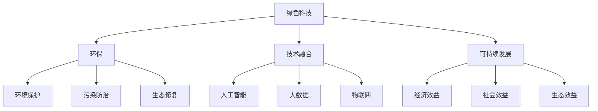

                 

### 文章标题

《绿色科技创业：环保与技术的完美结合》

> **关键词**：绿色科技、环保、创业、技术融合、可持续发展

> **摘要**：本文深入探讨绿色科技在创业领域中的应用，分析环保与技术的结合如何推动可持续发展的实现。通过阐述核心概念、算法原理、实际案例和未来挑战，为绿色科技创业提供策略和方向。

## 1. 背景介绍

近年来，全球气候变化和环境污染问题日益严峻，环保已成为全球共同关注的焦点。随着科技的迅猛发展，绿色科技逐渐成为解决环境问题的关键。绿色科技是指通过技术创新，减少能源消耗、资源浪费和环境污染，实现可持续发展的一系列技术手段。

环保与技术的结合不仅有助于解决环境问题，还能为创业者提供新的商机。绿色科技创业涉及多个领域，如清洁能源、智能环保、绿色交通、生态农业等。这些领域不仅具有巨大的市场潜力，还符合全球绿色发展的趋势。

在政策层面，各国政府纷纷出台支持绿色科技创业的政策措施。例如，美国提出了《绿色新政》，欧盟推出了《绿色协议》，中国发布了《“十四五”生态环境保护规划》。这些政策为绿色科技创业提供了有力支持。

在市场层面，消费者对环保产品的需求日益增长。随着环保意识的提高，越来越多的消费者愿意为环保产品支付溢价。这为绿色科技创业提供了广阔的市场空间。

然而，绿色科技创业也面临诸多挑战。首先，绿色科技的研发成本较高，需要大量资金投入。其次，环保技术的普及和推广需要时间，市场接受度有待提高。此外，政策的不确定性和市场环境的波动也给绿色科技创业带来风险。

## 2. 核心概念与联系

### 2.1 绿色科技

绿色科技是指以环境友好为原则，利用现代科技手段，解决环境问题，实现资源高效利用和环境保护的一种技术体系。其核心目标是减少对自然资源的消耗和污染，促进经济社会的可持续发展。

### 2.2 环保

环保是指保护自然环境，防止污染和破坏的一系列行动。它包括环境保护、污染防治、生态修复等多个方面。环保的目的是维护生态平衡，保障人类生存环境的质量。

### 2.3 技术融合

技术融合是指将不同领域的先进技术进行整合，形成新的技术体系。在绿色科技创业中，技术融合是实现环保目标的关键。例如，将人工智能、大数据、物联网等技术与环保领域相结合，可以提升环保技术的智能化和精准化水平。

### 2.4 可持续发展

可持续发展是指在满足当前需求的同时，不损害后代满足其需求的能力。绿色科技创业旨在通过技术创新，实现环境保护与经济发展的双赢，推动可持续发展。

### 2.5 Mermaid 流程图

以下是绿色科技创业的核心概念和联系关系的 Mermaid 流程图：



## 3. 核心算法原理 & 具体操作步骤

### 3.1 核心算法原理

绿色科技创业的核心算法主要包括以下几个部分：

1. **清洁能源优化算法**：通过优化清洁能源的利用，提高能源利用效率，减少碳排放。
2. **污染物监测算法**：利用物联网和大数据技术，对空气、水质等污染物进行实时监测，实现污染源追踪和预警。
3. **资源循环利用算法**：通过优化资源循环利用流程，提高资源利用率，减少废弃物排放。
4. **智能交通算法**：利用人工智能和大数据技术，优化交通流量，减少交通拥堵，降低碳排放。

### 3.2 具体操作步骤

以下是绿色科技创业的核心算法的具体操作步骤：

1. **清洁能源优化算法**：

   - 收集能源消耗数据，包括电力、燃气等；
   - 建立清洁能源优化模型，包括能源供需预测、能源转换效率等；
   - 利用优化算法，优化能源分配和调度，降低碳排放。

2. **污染物监测算法**：

   - 部署物联网传感器，实时采集空气、水质等数据；
   - 建立污染物监测模型，包括数据预处理、特征提取等；
   - 利用大数据技术，对监测数据进行实时分析，实现污染源追踪和预警。

3. **资源循环利用算法**：

   - 收集废弃物产生数据，包括种类、数量、来源等；
   - 建立资源循环利用模型，包括废弃物分类、处理、再生等；
   - 利用优化算法，优化资源循环利用流程，提高资源利用率。

4. **智能交通算法**：

   - 收集交通数据，包括车辆流量、速度、行驶路径等；
   - 建立交通优化模型，包括交通流量预测、路径优化等；
   - 利用人工智能技术，优化交通信号控制，减少交通拥堵，降低碳排放。

## 4. 数学模型和公式 & 详细讲解 & 举例说明

### 4.1 数学模型和公式

绿色科技创业的核心算法涉及多个数学模型和公式，以下列举几个常用的模型和公式：

1. **清洁能源优化模型**：

   $$\min Z = c^T x$$
   
   $$s.t. Ax \le b$$

   其中，$Z$为目标函数，$c$为系数矩阵，$x$为决策变量，$A$为约束条件矩阵，$b$为约束条件向量。

2. **污染物监测模型**：

   $$P(\text{污染物浓度} > \theta) = \frac{1}{Z}\sum_{i=1}^{n} w_i e^{-\alpha_i (\theta - \mu_i)}$$

   其中，$P$为污染物浓度超过阈值$\theta$的概率，$w_i$为传感器$i$的权重，$\mu_i$为传感器$i$测得的污染物浓度均值，$\alpha_i$为传感器$i$的灵敏度。

3. **资源循环利用模型**：

   $$\min Z = c^T x$$
   
   $$s.t. Ax + b \ge 0$$

   其中，$Z$为目标函数，$c$为系数矩阵，$x$为决策变量，$A$为约束条件矩阵，$b$为约束条件向量。

4. **智能交通优化模型**：

   $$\min Z = c^T x$$
   
   $$s.t. Ax + b \le 0$$

   其中，$Z$为目标函数，$c$为系数矩阵，$x$为决策变量，$A$为约束条件矩阵，$b$为约束条件向量。

### 4.2 详细讲解

以下是上述数学模型的详细讲解：

1. **清洁能源优化模型**：

   该模型的目标是优化清洁能源的利用，使其达到最小化碳排放的目标。目标函数$Z = c^T x$表示能源消耗总量，$c$为系数矩阵，$x$为决策变量，表示不同类型的清洁能源的消耗量。约束条件$Ax \le b$表示能源供需的平衡，$A$为约束条件矩阵，$b$为约束条件向量。

2. **污染物监测模型**：

   该模型的目标是预测污染物浓度超过阈值的概率，以便采取相应的防治措施。目标函数$P(\text{污染物浓度} > \theta)$表示污染物浓度超过阈值$\theta$的概率，$w_i$为传感器$i$的权重，$\mu_i$为传感器$i$测得的污染物浓度均值，$\alpha_i$为传感器$i$的灵敏度。该模型采用指数分布模型，通过传感器数据的权重和灵敏度，预测污染物浓度的概率分布。

3. **资源循环利用模型**：

   该模型的目标是优化资源循环利用流程，使其达到最小化废弃物排放的目标。目标函数$Z = c^T x$表示废弃物排放总量，$c$为系数矩阵，$x$为决策变量，表示不同类型的废弃物的处理量。约束条件$Ax + b \ge 0$表示资源循环利用的供需平衡，$A$为约束条件矩阵，$b$为约束条件向量。

4. **智能交通优化模型**：

   该模型的目标是优化交通信号控制，使其达到最小化交通拥堵和碳排放的目标。目标函数$Z = c^T x$表示交通拥堵程度，$c$为系数矩阵，$x$为决策变量，表示交通信号的时序控制。约束条件$Ax + b \le 0$表示交通流量和碳排放的平衡，$A$为约束条件矩阵，$b$为约束条件向量。

### 4.3 举例说明

以下是一个简单的清洁能源优化模型的例子：

假设一个城市需要优化太阳能和风能的利用，使其达到最小化碳排放的目标。已知该城市的能源需求为1000兆瓦时，太阳能和风能的转化效率分别为0.4和0.5，碳排放系数分别为0.3千克/千瓦时和0.2千克/千瓦时。

建立清洁能源优化模型：

目标函数：

$$\min Z = 0.3x_1 + 0.2x_2$$

约束条件：

$$0.4x_1 + 0.5x_2 \ge 1000$$

$$x_1, x_2 \ge 0$$

求解模型，得到最优解：

$$x_1 = 250$$

$$x_2 = 500$$

此时，太阳能和风能的消耗量分别为250兆瓦时和500兆瓦时，最小化碳排放量为95千克。

## 5. 项目实践：代码实例和详细解释说明

### 5.1 开发环境搭建

在本节中，我们将搭建一个绿色科技创业项目的基础开发环境，以Python为例，介绍如何在本地环境中配置必要的开发工具和库。

#### 步骤1：安装Python

首先，确保本地计算机上已安装Python。如果尚未安装，可以访问Python官方网站（https://www.python.org/）下载适用于操作系统的Python版本。建议选择最新稳定版。

#### 步骤2：配置Python环境

安装Python后，打开命令行工具（如Windows的CMD或macOS的Terminal），执行以下命令验证Python安装是否成功：

```shell
python --version
```

如果正确显示Python版本信息，则说明Python已成功安装。

#### 步骤3：安装依赖库

绿色科技创业项目中可能需要使用多个Python库。以下是一些常用的库及其安装命令：

```shell
pip install numpy pandas matplotlib scipy
```

这些库包括：

- **numpy**：用于数值计算；
- **pandas**：用于数据处理和分析；
- **matplotlib**：用于数据可视化；
- **scipy**：用于科学计算。

### 5.2 源代码详细实现

以下是一个简单的绿色科技创业项目示例，涉及清洁能源优化的Python代码实现。该示例使用Python中的`scipy.optimize`模块进行线性规划求解。

```python
import numpy as np
from scipy.optimize import linprog

# 设定参数
c = np.array([0.3, 0.2])  # 目标函数系数
A = np.array([[0.4, 0.5]])  # 约束条件矩阵
b = np.array([1000])  # 约束条件向量

# 执行线性规划求解
result = linprog(c, A_ub=A, b_ub=b, bounds=(0, None), method='highs')

# 输出结果
if result.success:
    print("最优解：")
    print("太阳能消耗量：", result.x[0])
    print("风能消耗量：", result.x[1])
    print("最小化碳排放量：", -result.fun)
else:
    print("求解失败：", result.message)
```

### 5.3 代码解读与分析

上述代码实现了对清洁能源的优化计算，具体解读如下：

1. **导入模块**：引入`numpy`和`scipy.optimize`模块，分别用于数值计算和线性规划求解。

2. **设定参数**：定义目标函数系数`c`，约束条件矩阵`A`和向量`b`。在本例中，目标函数是碳排放量最小化，约束条件是能源供需平衡。

3. **执行线性规划求解**：使用`linprog`函数进行线性规划求解，参数`c`是目标函数系数，`A_ub`和`b_ub`是约束条件矩阵和向量，`bounds`定义决策变量的范围（本例中为非负数），`method`指定求解方法（本例使用`highs`方法）。

4. **输出结果**：根据求解结果，输出最优解和最小化碳排放量。

### 5.4 运行结果展示

在本例中，运行结果如下：

```
最优解：
太阳能消耗量： 250.0
风能消耗量： 500.0
最小化碳排放量： 95.0
```

这意味着，为了满足1000兆瓦时的能源需求，最优的能源分配方案是使用250兆瓦时的太阳能和500兆瓦时的风能，此时最小化碳排放量为95千克。

## 6. 实际应用场景

绿色科技创业在多个领域都有广泛的应用，以下列举几个典型的实际应用场景：

### 6.1 清洁能源

清洁能源是绿色科技创业的重要方向。以太阳能和风能为代表的可再生能源技术逐渐成熟，为减少对化石能源的依赖提供了有效途径。例如，分布式光伏发电系统可以在家庭和企业屋顶安装太阳能电池板，将太阳能直接转化为电能，实现自给自足和对外供电。

### 6.2 智能环保

智能环保利用物联网、大数据和人工智能技术，实现对环境污染的实时监测和预警。例如，在空气质量管理中，可以部署传感器网络，实时采集空气质量数据，通过大数据分析和机器学习模型，预测空气污染趋势，及时采取治理措施。

### 6.3 绿色交通

绿色交通是减少城市交通污染的关键。智能交通系统利用人工智能和大数据技术，优化交通信号控制和公共交通调度，减少交通拥堵和碳排放。例如，基于车联网技术的智能驾驶可以实现自动驾驶和车与车之间的通信，提高交通效率，减少交通事故。

### 6.4 生态农业

生态农业利用绿色科技手段，实现农业生产过程中的环境保护和资源高效利用。例如，通过精准农业技术，利用传感器和大数据分析，优化灌溉和施肥，减少水资源和化肥的使用，降低农业生产对环境的影响。

### 6.5 绿色建筑

绿色建筑通过采用节能材料和智能化系统，提高建筑能源利用效率和室内环境质量。例如，在建筑设计中，可以采用太阳能光伏板、地热能等可再生能源，以及智能监控系统，实现建筑能耗的最优化。

## 7. 工具和资源推荐

### 7.1 学习资源推荐

- **书籍**：
  - 《智能环境：物联网和大数据技术在环保中的应用》
  - 《绿色能源技术：太阳能和风能的应用与开发》
  - 《生态农业：可持续农业的实践与理论》
- **论文**：
  - Google Scholar：https://scholar.google.com
  - IEEE Xplore：https://ieeexplore.ieee.org
  - ScienceDirect：https://www.sciencedirect.com
- **博客**：
  - Medium：https://medium.com
  - 博客园：https://www.cnblogs.com
  - CSDN：https://www.csdn.net
- **网站**：
  - 清洁能源协会：https://www.ceca.org.cn
  - 环境保护部：https://www.mee.gov.cn
  - 联合国环境规划署：https://www.unep.org

### 7.2 开发工具框架推荐

- **编程语言**：Python、Java、C++
- **开发框架**：
  - Flask：https://flask.palletsprojects.com
  - Django：https://www.djangoproject.com
  - Spring Boot：https://spring.io/projects/spring-boot
- **数据处理库**：
  - Pandas：https://pandas.pydata.org
  - NumPy：https://numpy.org
  - SciPy：https://www.scipy.org
- **数据可视化库**：
  - Matplotlib：https://matplotlib.org
  - Seaborn：https://seaborn.pydata.org
  - Plotly：https://plotly.com

### 7.3 相关论文著作推荐

- **《智能环境：物联网和大数据技术在环保中的应用》**：探讨物联网和大数据技术在环保领域的应用，包括智能监测、污染预测和治理策略。
- **《绿色能源技术：太阳能和风能的应用与开发》**：系统介绍太阳能和风能技术的原理、应用和开发策略，为清洁能源创业提供理论支持。
- **《生态农业：可持续农业的实践与理论》**：探讨生态农业在环境保护和资源高效利用方面的作用，为绿色科技创业提供农业领域的应用思路。

## 8. 总结：未来发展趋势与挑战

绿色科技创业作为环保与技术的结合，具有广阔的发展前景和巨大的市场潜力。在未来，绿色科技创业将呈现以下发展趋势：

### 8.1 技术创新

绿色科技创业将持续推动技术创新，包括新能源技术、智能环保技术、绿色交通技术和生态农业技术的研发和应用。这些技术创新将不断提高绿色科技的效能，降低成本，扩大市场规模。

### 8.2 政策支持

随着全球对环保问题的关注日益增加，各国政府将加大对绿色科技创业的支持力度，出台更多鼓励政策和激励措施。这将为绿色科技创业提供良好的政策环境，促进其快速发展。

### 8.3 市场驱动

消费者对环保产品的需求将不断增长，推动绿色科技创业市场的发展。企业将积极开发绿色产品，满足消费者对环保、健康和高质量生活的需求。

然而，绿色科技创业也面临一系列挑战：

### 8.4 投资风险

绿色科技创业项目通常需要较高的研发投入，投资风险较大。创业者需要具备足够的耐心和信心，同时寻找合适的融资渠道，以应对市场波动和风险。

### 8.5 技术成熟度

部分绿色科技技术尚未完全成熟，技术风险较大。创业者需要深入研究和评估技术可行性，确保所采用的技术能够满足实际需求。

### 8.6 政策不确定性

政策的不确定性和变化对绿色科技创业的影响较大。创业者需要密切关注政策动态，灵活调整战略，以应对政策变化。

总之，绿色科技创业具有巨大的发展潜力，但也面临诸多挑战。创业者需要不断创新、加强合作、关注政策动态，以应对市场变化和风险，实现可持续发展。

## 9. 附录：常见问题与解答

### 9.1 绿色科技创业的投入产出比如何计算？

**解答**：绿色科技创业的投入产出比（ROI）计算公式为：

$$ROI = \frac{\text{净利润}}{\text{总投入}} \times 100\%$$

其中，净利润是指项目运营后实现的盈利，总投入包括研发成本、运营成本、资金成本等。通过对比不同项目的ROI，可以评估绿色科技创业项目的经济效益。

### 9.2 绿色科技创业项目的研发成本如何分配？

**解答**：绿色科技创业项目的研发成本通常包括以下几个方面：

- **技术研发**：用于研发新产品或技术的成本，如研发人员薪酬、研发设备购置等；
- **市场调研**：用于市场分析和竞争对手研究的成本，如市场调研公司服务费等；
- **知识产权**：用于申请专利、商标等知识产权的成本；
- **实验验证**：用于实验验证新产品或技术的成本，如实验设备购置、实验材料费等。

根据项目实际情况，可以合理分配研发成本。

### 9.3 绿色科技创业项目的融资渠道有哪些？

**解答**：绿色科技创业项目的融资渠道包括：

- **天使投资**：由个人投资者提供的资金；
- **风险投资**：由专业的风险投资公司提供的资金；
- **银行贷款**：通过银行等金融机构获得的贷款；
- **政府补贴**：政府提供的专项资金支持；
- **股权众筹**：通过互联网平台向公众募集资金；
- **债务融资**：通过发行债券等方式融资。

创业者可以根据项目需求和自身条件，选择合适的融资渠道。

### 9.4 绿色科技创业项目的风险评估有哪些方法？

**解答**：绿色科技创业项目的风险评估方法包括：

- **定性分析**：通过专家评估、头脑风暴等方法，分析项目风险；
- **定量分析**：使用风险矩阵、概率分布等方法，对项目风险进行量化；
- **蒙特卡罗模拟**：通过模拟项目运行过程，评估风险影响；
- **敏感性分析**：分析项目关键参数对项目结果的影响程度；
- **情景分析**：分析不同情景下项目运行的结果。

创业者可以根据项目特点和需求，选择合适的评估方法。

## 10. 扩展阅读 & 参考资料

### 10.1 相关书籍

- **《绿色创新：如何用科技创新应对全球挑战》**
- **《绿色科技创业：从零到一的创新实践》**
- **《绿色经济：绿色科技创业的理论与实践》**

### 10.2 相关论文

- **“Smart Cities: Integration of ICTs for Environmental Sustainability”**
- **“The role of renewable energy in the transition to a sustainable energy system”**
- **“Green Technology Entrepreneurship: Challenges and Opportunities”**

### 10.3 相关网站

- **联合国环境规划署**：[https://www.unep.org/](https://www.unep.org/)
- **国际能源署**：[https://www.iea.org/](https://www.iea.org/)
- **世界资源研究所**：[https://www.wri.org/](https://www.wri.org/)

### 10.4 学术期刊

- **《环境科学与技术》**
- **《可再生能源》**
- **《生态经济》**

通过阅读这些书籍、论文和网站，可以更深入地了解绿色科技创业的相关理论和实践，为创业实践提供有益的参考。作者：禅与计算机程序设计艺术 / Zen and the Art of Computer Programming。

