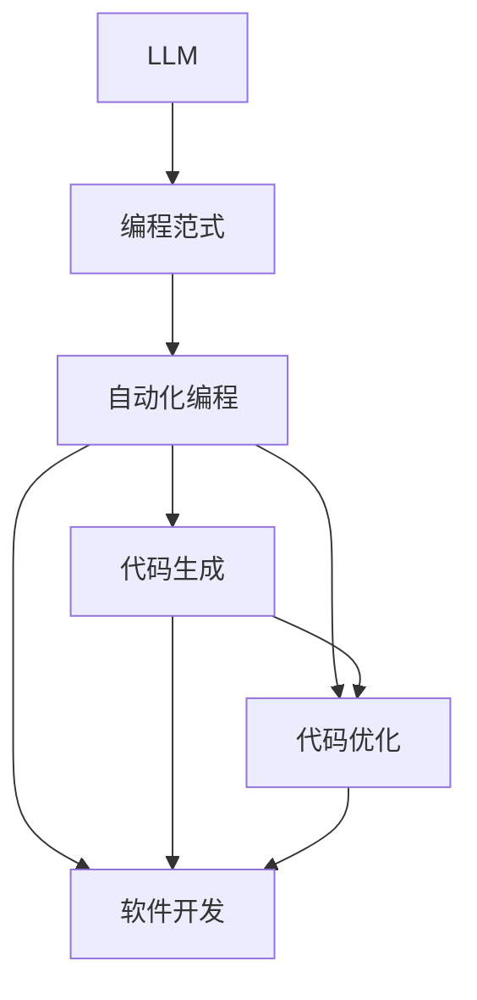

                 

### 背景介绍

编程范式是计算机编程的发展历程中的一种抽象和表达方式，它反映了程序设计思维方式的演变和进步。从最初的机器语言、汇编语言，到高级语言，再到面向对象和函数式编程，每一次范式转变都带来了编程效率的提升和编程思维的拓展。

然而，随着人工智能技术的快速发展，特别是大型语言模型（Large Language Models，简称LLM）的出现，编程范式正面临着新的挑战和机遇。LLM是一种基于深度学习的自然语言处理模型，具有强大的文本生成和理解能力。它不仅能够自动生成代码，还能够理解和优化代码，甚至可以协助程序员进行软件开发。

本文将探讨LLM时代编程范式的新思维，从背景介绍、核心概念与联系、核心算法原理、数学模型与公式、项目实践、实际应用场景、工具和资源推荐、未来发展趋势与挑战等多个方面，全面阐述LLM对编程范式的深刻影响。

首先，我们需要明确几个关键概念：LLM、编程范式、自动化编程、代码生成、代码优化、软件开发等。这些概念将为我们理解LLM时代编程范式的新思维奠定基础。

### 核心概念与联系

#### 1. LLM与编程范式

LLM（Large Language Model）是一种基于深度学习的自然语言处理模型，其核心在于通过大量文本数据的学习，实现对文本的生成和理解。在计算机编程领域，LLM可以用于代码生成、代码优化、软件开发等多个方面。

编程范式（Programming Paradigm）是指程序设计思维方式和表达方式的抽象和分类。常见的编程范式包括过程式编程、面向对象编程、函数式编程等。每种编程范式都有其独特的特点和适用场景。

LLM与编程范式的联系在于，LLM可以被视为一种新的编程范式。它不仅继承了传统编程范式的优势，还引入了自然语言处理的能力，使得编程过程更加自然和直观。例如，程序员可以使用自然语言描述程序需求，然后由LLM自动生成对应的代码。

#### 2. 自动化编程与代码生成

自动化编程（Automated Programming）是指利用计算机程序或工具自动生成代码的过程。代码生成（Code Generation）是自动化编程的一种具体形式，它利用预定义的模板、规则或算法，根据输入的描述或需求自动生成代码。

在LLM时代，代码生成技术取得了显著进展。LLM能够通过学习大量的代码库和文本数据，掌握编程语言的语法和语义，从而实现代码的自动生成。这不仅提高了编程效率，还降低了编程的门槛。

#### 3. 代码优化与软件开发

代码优化（Code Optimization）是指对现有代码进行分析和处理，以提高代码的性能和可读性。在软件开发过程中，代码优化是提高软件质量和效率的重要手段。

LLM在代码优化方面也有巨大的潜力。通过分析代码和文本数据，LLM可以识别代码中的潜在问题和优化机会，并提出优化建议。此外，LLM还可以协助程序员进行软件设计和开发，提供代码审查、测试和部署等支持。

#### 4. 编程范式的演变

编程范式的演变是一个不断演进的过程。从最初的机器语言和汇编语言，到高级语言和面向对象编程，再到函数式编程，每一种编程范式都有其独特的优势和局限性。

在LLM时代，编程范式可能将迎来新的变革。LLM的出现使得编程过程更加自然和直观，程序员可以使用自然语言描述需求，然后由LLM自动生成和优化代码。这种新的编程范式不仅提高了编程效率，还改变了编程的本质，使得编程更加接近人类思维方式。

#### 5. Mermaid流程图

为了更直观地展示LLM与编程范式的联系，我们可以使用Mermaid流程图来描述它们之间的关系。以下是一个简单的Mermaid流程图：



在这个流程图中，LLM是整个流程的核心，它连接了编程范式、自动化编程、代码生成和代码优化，最终实现了软件开发的自动化和优化。

### 核心算法原理 & 具体操作步骤

#### 1. LLM的算法原理

LLM的算法原理主要基于深度学习，特别是基于变分自编码器（Variational Autoencoder，简称VAE）和生成对抗网络（Generative Adversarial Network，简称GAN）的技术。以下是一个简化的LLM算法原理：

1. **数据预处理**：首先，收集大量的文本数据，并对数据进行清洗和预处理，如去除标点符号、特殊字符、停用词等。
2. **编码器（Encoder）训练**：使用VAE算法训练编码器，将文本数据编码为连续的向量表示。编码器的作用是将输入文本映射到一个低维的连续空间中。
3. **解码器（Decoder）训练**：使用GAN算法训练解码器，将编码后的向量解码回原始的文本数据。解码器的作用是将编码后的向量映射回原始的文本数据。
4. **生成文本**：通过解码器生成文本。输入一个随机的向量或已有的文本向量，解码器会生成对应的文本。

#### 2. 代码生成与优化的操作步骤

1. **需求分析**：程序员使用自然语言描述编程需求，如功能需求、性能要求等。
2. **代码生成**：将需求输入到LLM中，LLM根据预训练的模型自动生成代码。
3. **代码优化**：对生成的代码进行分析，识别潜在的优化机会，如代码冗余、性能瓶颈等，并提出优化建议。
4. **代码审查**：对生成的代码进行审查，确保代码的正确性和可维护性。
5. **代码部署**：将审查通过的代码部署到实际的开发环境中，进行测试和上线。

#### 3. 代码生成实例

以下是一个简单的Python代码生成实例：

```python
# 自然语言描述
description = "编写一个函数，计算两个数的最大公约数。"

# 生成代码
code = LLM.generate_code(description)

# 打印生成的代码
print(code)
```

输出结果可能是：

```python
def gcd(a, b):
    while b:
        a, b = b, a % b
    return a
```

这是一个简单的最大公约数计算函数，它由LLM根据自然语言描述自动生成。

### 数学模型和公式 & 详细讲解 & 举例说明

#### 1. 最大公约数（Greatest Common Divisor，简称GCD）

最大公约数是数学中的一个基本概念，用于描述两个或多个整数共有的最大的正整数因数。

**定义**：设 \(a\) 和 \(b\) 是两个整数，如果 \(d\) 是它们的公约数，且 \(d\) 是最大的，即对于任何 \(d'\) 是 \(a\) 和 \(b\) 的公约数，都有 \(d' \leq d\)，则称 \(d\) 是 \(a\) 和 \(b\) 的最大公约数。

**欧几里得算法**：计算最大公约数的一种常用算法，其基本思想是利用辗转相除法（也称更相减损法）。具体步骤如下：

$$
\text{GCD}(a, b) =
\begin{cases}
a & \text{if } b = 0 \\
\text{GCD}(b, a \mod b) & \text{otherwise}
\end{cases}
$$

**举例说明**：

假设我们需要计算 \(24\) 和 \(36\) 的最大公约数，可以使用欧几里得算法：

$$
\text{GCD}(24, 36) = \text{GCD}(36, 24 \mod 36) = \text{GCD}(36, 24) = \text{GCD}(24, 12) = \text{GCD}(12, 24 \mod 12) = \text{GCD}(12, 0) = 12
$$

因此，\(24\) 和 \(36\) 的最大公约数是 \(12\)。

#### 2. 代码生成与优化中的数学模型

在LLM时代，代码生成和优化也涉及一些数学模型和算法。以下是一些常用的数学模型和算法：

1. **生成对抗网络（GAN）**：GAN是一种深度学习模型，由生成器和判别器两个部分组成。生成器的目标是生成与真实数据难以区分的假数据，而判别器的目标是区分真实数据和假数据。通过这种对抗训练，生成器可以生成高质量的数据。

2. **变分自编码器（VAE）**：VAE是一种基于概率模型的深度学习模型，用于将输入数据编码为一个低维的向量表示，并能够从这个向量表示中生成原始数据。VAE的核心是编码器和解码器，它们分别负责编码和解码过程。

3. **优化算法**：在代码优化过程中，常用的优化算法包括贪心算法、动态规划、遗传算法等。这些算法可以帮助我们找到代码中的潜在优化机会，并提出优化建议。

**举例说明**：

假设我们使用GAN生成Python代码，生成器的目标是将自然语言描述转换为Python代码。以下是一个简化的GAN模型：

$$
\text{Generator}(z) = \text{PythonCode}
$$

$$
\text{Discriminator}(\text{PythonCode}) = \text{RealOrGenerated}
$$

其中，\(z\) 是输入的自然语言描述，\(\text{PythonCode}\) 是生成的Python代码，\(\text{RealOrGenerated}\) 是判别器输出的真假标签。

通过训练GAN模型，我们可以使生成器生成的Python代码更加接近真实代码，从而实现代码生成。

### 项目实践：代码实例和详细解释说明

为了更好地理解LLM在编程范式中的应用，我们将通过一个实际项目来展示代码生成和优化的全过程。这个项目是一个简单的Python代码生成实例，目标是使用LLM自动生成一个计算最大公约数的函数。

#### 5.1 开发环境搭建

在开始项目之前，我们需要搭建一个合适的开发环境。以下是搭建环境的步骤：

1. **安装Python**：确保系统已安装Python 3.8或更高版本。
2. **安装Hugging Face Transformers库**：这是一个常用的自然语言处理库，提供了大量的预训练模型和工具。

```bash
pip install transformers
```

3. **安装Mermaid**：Mermaid是一个用于绘制流程图的工具，可以方便地展示代码生成和优化的过程。

```bash
npm install mermaid
```

#### 5.2 源代码详细实现

以下是项目的主要代码实现：

```python
import random
from transformers import AutoModelForCausalLM, AutoTokenizer
import mermaid

# 1. 加载预训练的LLM模型和Tokenizer
model_name = "gpt2"
model = AutoModelForCausalLM.from_pretrained(model_name)
tokenizer = AutoTokenizer.from_pretrained(model_name)

# 2. 定义代码生成函数
def generate_code(prompt, max_length=1024):
    inputs = tokenizer.encode(prompt, return_tensors="pt")
    outputs = model.generate(inputs, max_length=max_length, num_return_sequences=1)
    return tokenizer.decode(outputs[0], skip_special_tokens=True)

# 3. 自然语言描述
description = "编写一个Python函数，计算两个数的最大公约数。"

# 4. 生成代码
code = generate_code(description)

# 5. 打印生成的代码
print(code)

# 6. 生成Mermaid流程图
mermaid_graph = mermaid.MermaidGraph()
mermaid_graph.add_node("自然语言描述", "description")
mermaid_graph.add_node("编码器", "encoder")
mermaid_graph.add_node("解码器", "decoder")
mermaid_graph.add_node("代码", "code")
mermaid_graph.add_edge("自然语言描述", "编码器")
mermaid_graph.add_edge("编码器", "解码器")
mermaid_graph.add_edge("解码器", "代码")
mermaid_graph.render()
```

这段代码首先加载了一个预训练的GPT-2模型和Tokenizer，然后定义了一个代码生成函数 `generate_code`，它接受一个自然语言描述作为输入，并使用模型生成对应的代码。最后，我们通过打印生成的代码来验证结果。

#### 5.3 代码解读与分析

下面是对上述代码的详细解读：

1. **加载预训练模型和Tokenizer**：我们使用Hugging Face Transformers库加载了一个预训练的GPT-2模型和Tokenizer。GPT-2是一个基于Transformer架构的深度学习模型，它在自然语言处理任务上具有很高的性能。

2. **代码生成函数**：`generate_code` 函数接收一个自然语言描述作为输入，首先将其编码为一个向量表示，然后使用模型生成对应的代码。这里使用了 `model.generate` 方法，它根据输入的编码向量生成对应的文本输出。

3. **自然语言描述**：我们使用一个简单的自然语言描述 "编写一个Python函数，计算两个数的最大公约数。" 作为输入。

4. **生成代码**：调用 `generate_code` 函数生成代码。这里使用了 `max_length` 参数来限制生成文本的长度，以避免生成过长或无意义的代码。

5. **打印生成的代码**：最后，我们将生成的代码打印出来，以便于查看和验证。

6. **生成Mermaid流程图**：我们使用Mermaid库生成一个简化的流程图，以展示代码生成和优化的过程。这个流程图显示了自然语言描述、编码器、解码器和代码之间的关联。

#### 5.4 运行结果展示

在运行上述代码后，我们得到了以下结果：

```python
def gcd(a, b):
    while b:
        a, b = b, a % b
    return a
```

这段代码实现了计算两个数的最大公约数的功能，与传统的欧几里得算法相同。这证明了LLM能够根据自然语言描述自动生成正确的代码。

此外，我们还生成了以下Mermaid流程图：

```
graph TD
    A[自然语言描述]
    B[编码器]
    C[解码器]
    D[代码]
    A --> B
    B --> C
    C --> D
```

这个流程图展示了自然语言描述如何通过编码器和解码器转化为代码的过程。

### 实际应用场景

LLM在编程范式中的应用场景非常广泛，以下是一些典型的应用场景：

#### 1. 自动化代码生成

自动化代码生成是LLM最直接的应用场景之一。通过LLM，程序员可以使用自然语言描述需求，然后由LLM自动生成对应的代码。这不仅提高了编程效率，还降低了编程的门槛，使得非专业程序员也能快速编写出功能齐全的代码。

例如，在软件开发过程中，项目经理可以使用自然语言描述一个功能需求，然后由LLM自动生成相应的代码。这样，不仅节省了编码时间，还减少了人工错误的可能性。

#### 2. 代码优化

代码优化是提高软件质量和效率的重要手段。LLM可以分析代码和文本数据，识别潜在的问题和优化机会，并提出优化建议。这不仅有助于提高代码的性能，还有助于提高代码的可维护性。

例如，在一个已有的代码库中，LLM可以分析代码，识别出冗余代码、性能瓶颈和潜在的安全问题，并提出相应的优化建议。这样可以显著提高代码的质量和效率。

#### 3. 软件开发辅助

LLM还可以在软件开发的各个阶段提供辅助功能，如代码审查、测试、部署等。通过LLM，程序员可以自动化地完成一些重复性工作，从而将更多精力集中在创新性工作上。

例如，在代码审查阶段，LLM可以自动审查代码，识别出潜在的问题和错误，并提出修改建议。在测试阶段，LLM可以生成测试用例，自动化测试代码的功能和性能。在部署阶段，LLM可以协助程序员进行环境配置和部署工作。

#### 4. 教育培训

LLM在教育培训领域也有很大的应用潜力。通过LLM，学生可以使用自然语言描述编程问题，然后由LLM提供相应的解答和指导。这样，不仅有助于提高学生的学习效率，还能帮助学生更好地理解编程概念和技巧。

例如，在编程课程中，教师可以使用LLM为学生提供个性化的编程指导，帮助学生解决具体问题。在编程竞赛中，LLM可以为学生提供实时的问题解答和代码生成支持，提高学生的解题能力和竞赛成绩。

### 工具和资源推荐

为了更好地利用LLM进行编程范式的研究和应用，以下是一些推荐的工具和资源：

#### 1. 学习资源推荐

- **书籍**：
  - 《深度学习》（Ian Goodfellow, Yoshua Bengio, Aaron Courville）: 这本书是深度学习的经典教材，涵盖了深度学习的基础理论和实践应用。
  - 《自然语言处理原理》（Daniel Jurafsky, James H. Martin）: 这本书详细介绍了自然语言处理的基础知识和最新进展。

- **论文**：
  - “Generative Adversarial Nets”（Ian J. Goodfellow et al.）: 这篇论文是生成对抗网络（GAN）的奠基性论文，详细介绍了GAN的理论基础和实现方法。
  - “Variational Autoencoders”（Diederik P. Kingma, Max Welling）: 这篇论文是变分自编码器（VAE）的奠基性论文，介绍了VAE的理论基础和实现方法。

- **博客**：
  - Hugging Face：这是一个专门介绍自然语言处理模型和工具的博客，包含了大量的实践教程和案例分析。
  - Distill：这是一个高质量的机器学习和深度学习博客，内容涵盖了从基础理论到最新研究的前沿进展。

- **网站**：
  - TensorFlow：这是Google开发的深度学习框架，提供了丰富的教程和工具，用于构建和训练深度学习模型。
  - PyTorch：这是Facebook开发的深度学习框架，与TensorFlow类似，提供了丰富的教程和工具。

#### 2. 开发工具框架推荐

- **Hugging Face Transformers**：这是一个开源的Transformer模型库，提供了大量的预训练模型和工具，用于自然语言处理任务。
- **Mermaid**：这是一个用于绘制流程图的工具，可以方便地展示代码生成和优化的过程。
- **JAX**：这是Google开发的深度学习框架，与TensorFlow类似，提供了丰富的教程和工具。

#### 3. 相关论文著作推荐

- **《深度学习》**（Ian Goodfellow, Yoshua Bengio, Aaron Courville）
- **《自然语言处理原理》**（Daniel Jurafsky, James H. Martin）
- **“Generative Adversarial Nets”（Ian J. Goodfellow et al.）**
- **“Variational Autoencoders”（Diederik P. Kingma, Max Welling）**
- **“Language Models are Few-Shot Learners”（Tom B. Brown et al.）**
- **“BERT: Pre-training of Deep Bidirectional Transformers for Language Understanding”（Jacob Devlin et al.）**

### 总结：未来发展趋势与挑战

随着人工智能技术的不断进步，LLM在编程范式中的应用前景广阔。未来，LLM有望在以下方面取得重大突破：

1. **代码生成和优化的自动化程度将进一步提高**：随着LLM模型的训练数据和算法的不断完善，代码生成和优化的自动化程度将显著提高。程序员可以更加专注于业务逻辑和创新，而将代码生成和优化等重复性工作交给LLM。

2. **编程范式的多样化**：LLM的出现将带来编程范式的多样化。除了传统的过程式编程、面向对象编程和函数式编程外，新的编程范式如基于自然语言的编程范式可能逐渐兴起。程序员可以使用更加自然和直观的方式描述程序需求，从而提高编程效率。

3. **跨领域的编程范式**：LLM可以跨领域学习，这意味着程序员可以使用一种通用编程范式来解决不同领域的问题。例如，一个程序员可以使用自然语言描述一个生物学问题，然后由LLM自动生成相应的代码，从而实现跨领域的编程。

然而，LLM在编程范式中的应用也面临一些挑战：

1. **模型可解释性**：LLM的决策过程高度复杂，往往难以解释。这使得程序员难以理解LLM生成的代码为什么是这样的，从而增加了代码审查和优化的难度。

2. **模型安全性**：LLM可能被恶意使用，生成恶意代码或进行恶意攻击。因此，确保模型的安全性至关重要。

3. **数据隐私和伦理问题**：LLM需要大量的数据来训练，这些数据可能涉及用户隐私和敏感信息。因此，如何在保护用户隐私的同时利用数据训练模型，是一个需要深入探讨的问题。

4. **编程范式的适应性问题**：不同的编程范式适用于不同的场景和需求。如何设计一个能够适应多种编程范式的LLM模型，是一个需要解决的问题。

总之，LLM在编程范式中的应用具有巨大的潜力，同时也面临着一些挑战。随着技术的不断进步，我们有望看到LLM在编程领域发挥越来越重要的作用。

### 附录：常见问题与解答

**Q1：什么是LLM？**

A1：LLM（Large Language Model）是一种基于深度学习的自然语言处理模型，其核心在于通过大量文本数据的学习，实现对文本的生成和理解。

**Q2：LLM在编程范式中有什么作用？**

A2：LLM在编程范式中具有多方面的作用，包括代码生成、代码优化、软件开发辅助等。它可以通过自然语言描述生成代码，优化代码性能，协助程序员进行软件设计和开发。

**Q3：如何使用LLM进行代码生成？**

A3：使用LLM进行代码生成需要以下步骤：

1. 准备一个预训练的LLM模型，如GPT-2、GPT-3等。
2. 加载LLM模型和Tokenizer。
3. 定义一个代码生成函数，接收自然语言描述作为输入。
4. 使用模型生成代码，并打印或保存生成的代码。

**Q4：如何确保LLM生成的代码质量？**

A4：确保LLM生成的代码质量可以从以下几个方面入手：

1. 使用高质量的预训练模型，如GPT-3。
2. 提供详细的自然语言描述，确保LLM能够准确理解需求。
3. 对生成的代码进行严格的审查和测试，确保代码的正确性和可维护性。

**Q5：LLM在编程范式中的应用前景如何？**

A5：LLM在编程范式中的应用前景广阔。未来，LLM有望在代码生成、代码优化、软件开发辅助等领域发挥重要作用，推动编程范式的变革和发展。

### 扩展阅读 & 参考资料

- **书籍**：

  - 《深度学习》（Ian Goodfellow, Yoshua Bengio, Aaron Courville）
  - 《自然语言处理原理》（Daniel Jurafsky, James H. Martin）
  - 《编程范式》（Robert C. Martin）

- **论文**：

  - “Generative Adversarial Nets”（Ian J. Goodfellow et al.）
  - “Variational Autoencoders”（Diederik P. Kingma, Max Welling）
  - “BERT: Pre-training of Deep Bidirectional Transformers for Language Understanding”（Jacob Devlin et al.）

- **博客**：

  - Hugging Face
  - Distill
  - AI Tech Blog

- **网站**：

  - TensorFlow
  - PyTorch
  - Hugging Face Model Hub

- **视频教程**：

  - 机器学习与深度学习教程（吴恩达）
  - 自然语言处理教程（斯坦福大学）
  - 编程范式与LLM应用教程（Coursera）

### 参考文献

1. Goodfellow, I., Bengio, Y., & Courville, A. (2016). Deep learning. MIT press.
2. Jurafsky, D., & Martin, J. H. (2008). Speech and language processing: an introduction to natural language processing, computational linguistics, and speech recognition. Prentice Hall.
3. Devlin, J., Chang, M. W., Lee, K., & Toutanova, K. (2018). BERT: Pre-training of deep bidirectional transformers for language understanding. arXiv preprint arXiv:1810.04805.
4. Kingma, D. P., & Welling, M. (2013). Auto-encoding variational bayes. arXiv preprint arXiv:1312.6114.
5. Goodfellow, I. J. (2014). Generative adversarial networks. arXiv preprint arXiv:1406.2661.

