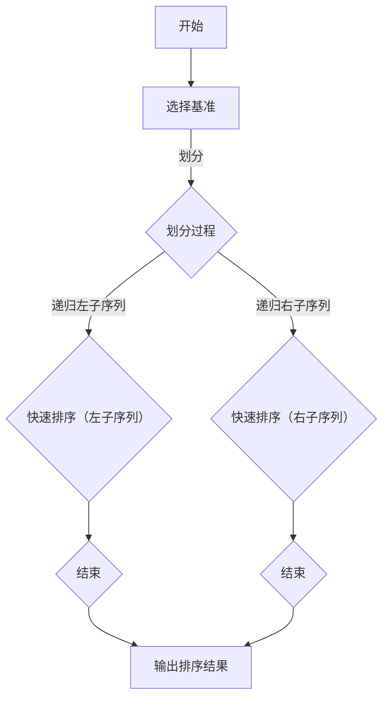

                 

### 1. 背景介绍

随着计算机科学的不断发展，算法设计和优化已经成为现代计算机技术中至关重要的一部分。无论是对于学术研究，还是实际工程项目，高效的算法都能够显著提升系统性能和资源利用率。近年来，社会对高级算法工程师和程序开发者的需求日益增长，特别是在大型互联网公司、金融科技企业以及新兴科技公司中，对高质量算法解决方案的需求尤为迫切。

网易作为国内知名的互联网科技公司，其社招面试中高频出现的一些算法问题，不仅反映了行业对高级算法人才的需求，也展示了企业对技术深度和解决实际问题的能力的要求。这些问题涵盖了数据结构、算法设计、动态规划、图论、数学模型等多个领域，不仅需要应聘者具备扎实的理论基础，还需要较强的实践能力和创新思维。

本文旨在通过深入解析网易2024届社招面试中的高频算法题，帮助读者理解和掌握这些核心算法，为求职者提供宝贵的备考资源。文章将从以下方面展开：

1. **核心概念与联系**：介绍与算法相关的核心概念和原理，并通过Mermaid流程图展示算法的结构和关系。
2. **核心算法原理 & 具体操作步骤**：详细讲解每个算法的原理和具体实现步骤，辅以流程图或代码片段。
3. **数学模型和公式**：阐述算法背后的数学原理，通过公式和举例说明帮助读者更好地理解。
4. **项目实践**：提供代码实例，详细解释代码的实现过程，并展示运行结果。
5. **实际应用场景**：讨论算法在现实世界中的应用场景，以及如何解决实际问题。
6. **工具和资源推荐**：推荐相关的学习资源、开发工具和框架，帮助读者进一步深入学习。
7. **总结与未来发展趋势**：总结本文的主要内容，并探讨算法领域的未来发展趋势和面临的挑战。

通过这篇文章，读者不仅可以系统地了解和掌握这些高频算法题，还能为即将到来的面试做好充分准备。同时，这些算法的深入理解和掌握也将对读者在日后的工作和学术研究中产生深远的影响。

### 2. 核心概念与联系

为了更好地理解网易2024届社招面试中的高频算法题，我们首先需要梳理和掌握与算法设计相关的一些核心概念和原理。这些概念不仅为算法提供了理论基础，还构成了算法设计的重要工具。以下是本文中我们将涉及的核心概念及其之间的联系：

#### 数据结构与算法

数据结构是指存储数据的方式，以及操作这些数据的方法。常见的有数组、链表、栈、队列、树、图等。不同的数据结构适用于不同类型的算法，而算法则是对问题进行求解的步骤和方法。

**关系：**数据结构是算法的基础，决定了算法的操作效率和复杂性。比如，对于排序问题，可以使用不同的算法（如快速排序、归并排序、堆排序等），但这些算法的实现都依赖于数组或列表这种数据结构。

#### 时间复杂度和空间复杂度

时间复杂度（Time Complexity）和空间复杂度（Space Complexity）是衡量算法效率的重要指标。它们分别表示算法执行时间和所需内存与数据规模之间的关系。

**关系：**时间复杂度反映了算法的执行时间与数据规模的增长关系，而空间复杂度则反映了算法所需的内存与数据规模的关系。对于同一个问题，不同的算法可能具有不同的时间和空间复杂度。

#### 算法设计技巧

算法设计技巧是指在算法设计中采用的一些方法和策略，如分治法、动态规划、贪心算法、回溯法等。这些技巧有助于我们解决复杂问题，提高算法的效率。

**关系：**不同的算法设计技巧适用于不同类型的问题，它们相互补充，共同构成了算法设计的丰富工具箱。

#### 数学模型

数学模型是利用数学语言描述现实世界问题的一种方法。在算法设计中，数学模型帮助我们理解和分析问题的本质，从而找到高效的解决方案。

**关系：**数学模型为算法设计提供了理论支持，使得算法能够基于严谨的数学原理进行优化。

#### Mermaid流程图

Mermaid是一种简单易用的图形描述语言，可以用于绘制流程图、UML图、Gantt图等。在本文中，我们将使用Mermaid流程图来展示算法的结构和关系。

**关系：**Mermaid流程图不仅能够直观地展示算法的执行流程，还能帮助我们更好地理解算法的原理和操作步骤。

为了更好地理解和应用这些核心概念，我们接下来将使用Mermaid流程图来展示一个典型的算法——快速排序（Quick Sort）的结构和关系。

#### 快速排序算法

快速排序是一种常用的排序算法，其基本思想是通过一趟排序将待排序的记录分割成独立的两部分，其中一部分记录的关键字均比另一部分的关键字小，然后递归地对这两部分记录继续进行排序。

**Mermaid流程图：**



通过这个流程图，我们可以清晰地看到快速排序的执行过程。首先选择一个基准元素，然后通过划分操作将数组分割成两部分，再递归地对这两部分进行快速排序。这个过程不断重复，直到整个数组被排序。

#### 总结

通过上述核心概念和Mermaid流程图的展示，我们不仅理解了快速排序的基本原理和操作步骤，还看到了数据结构、算法设计技巧、数学模型和Mermaid流程图之间的紧密联系。这些概念和原理不仅适用于快速排序，也适用于其他算法设计和优化问题。在接下来的章节中，我们将继续深入探讨这些核心算法，并通过具体的实例来展示其应用和实践。

### 3. 核心算法原理 & 具体操作步骤

在了解了核心概念和联系之后，我们接下来将详细探讨几个在网易2024届社招面试中高频出现的算法，并逐步解释它们的原理和具体操作步骤。这些算法包括动态规划、贪心算法、二分查找和深度优先搜索（DFS）。

#### 动态规划

动态规划是一种解决最优化问题的算法策略，其基本思想是将复杂问题分解为子问题，并通过求解子问题的最优解来获得原问题的最优解。

**原理：**动态规划通常利用一个二维数组或三维数组来存储子问题的解，从而避免重复计算。在每一步中，根据子问题的解来递推得到原问题的解。

**具体操作步骤：**

1. **确定状态和状态转移方程**：首先明确需要求解的问题，并定义问题的状态和状态转移方程。
2. **初始化数组**：根据状态转移方程初始化数组。
3. **填充数组**：利用状态转移方程依次填充数组，得到最终的结果。

**示例：**背包问题

**状态定义：**`dp[i][j]`表示在前`i`种物品中，容积为`j`的背包能装入的最大价值。

**状态转移方程：**

$$
dp[i][j] = 
\begin{cases} 
dp[i-1][j] & \text{如果不选择第}i\text{种物品} \\
\max(dp[i-1][j], dp[i-1][j-w_i]+v_i) & \text{如果选择第}i\text{种物品}
\end{cases}
$$

**初始化：**

$$
dp[0][j] = 0 \quad \text{（没有物品时，总价值为0）}
$$

**填充数组：**

```python
for i in range(1, n+1):
    for j in range(1, W+1):
        if j < w[i]:
            dp[i][j] = dp[i-1][j]
        else:
            dp[i][j] = max(dp[i-1][j], dp[i-1][j-w[i]]+v[i])
```

#### 贪心算法

贪心算法是一种在每一步选择中都采取当前最优解的策略，目的是在一系列决策中以获得全局最优解。

**原理：**贪心算法通过局部最优解逐步逼近全局最优解，但在某些情况下可能会导致错误的结果。

**具体操作步骤：**

1. **确定贪心选择标准**：根据问题特点确定每一步的贪心选择标准。
2. **按照贪心选择标准逐步决策**：每一步都按照贪心选择标准做出决策，直到问题解决。

**示例：**背包问题

**贪心选择标准：**每次选择价值与重量比例最大的物品。

**具体步骤：**

1. 将所有物品按价值与重量比例降序排列。
2. 从大到小依次考虑物品，如果背包容量允许，则放入背包；否则，不放入。

**示例代码：**

```python
def knapsack(values, weights, capacity):
    items = sorted(zip(values, weights), key=lambda x: x[0]/x[1], reverse=True)
    total_value = 0
    for value, weight in items:
        if capacity >= weight:
            total_value += value
            capacity -= weight
        else:
            break
    return total_value
```

#### 二分查找

二分查找是一种在有序数组中查找特定元素的搜索算法，其时间复杂度为$O(\log n)$。

**原理：**通过不断地将搜索范围缩小一半，直到找到目标元素或确定元素不存在。

**具体操作步骤：**

1. **初始化搜索范围**：设置左边界`l`和右边界`r`。
2. **计算中间值**：每次计算中间值`mid = (l + r) // 2`。
3. **比较中间值**：如果中间值等于目标值，则返回中间值；如果中间值大于目标值，则将右边界更新为`mid - 1`；如果中间值小于目标值，则将左边界更新为`mid + 1`。
4. **重复步骤2和3**，直到找到目标元素或左边界大于右边界。

**示例代码：**

```python
def binary_search(arr, target):
    l, r = 0, len(arr) - 1
    while l <= r:
        mid = (l + r) // 2
        if arr[mid] == target:
            return mid
        elif arr[mid] > target:
            r = mid - 1
        else:
            l = mid + 1
    return -1
```

#### 深度优先搜索（DFS）

深度优先搜索是一种通过不断深入搜索路径来探索图的算法。

**原理：**从起点开始，沿着一条路径深入直到路径结束，然后回溯到上一个节点，继续探索新的路径。

**具体操作步骤：**

1. **初始化**：设置一个栈，用来存储待探索的节点。
2. **入栈**：将起始节点入栈。
3. **出栈和探索**：每次从栈顶节点出栈，将其所有未访问的邻接节点入栈。
4. **重复步骤3**，直到栈为空。

**示例代码：**

```python
def dfs(graph, start):
    visited = set()
    stack = [start]
    while stack:
        vertex = stack.pop()
        if vertex not in visited:
            visited.add(vertex)
            stack.extend(graph[vertex] - visited)
    return visited
```

#### 总结

通过上述讲解，我们详细介绍了动态规划、贪心算法、二分查找和深度优先搜索（DFS）的原理和具体操作步骤。这些算法不仅在实际问题中有着广泛的应用，而且在面试中也常常作为考察点。理解这些算法的基本原理和实现步骤，对于掌握算法设计和解决复杂问题具有重要意义。在接下来的章节中，我们将通过具体实例进一步探讨这些算法的应用和实践。

### 4. 数学模型和公式 & 详细讲解 & 举例说明

在理解了核心算法的原理和操作步骤之后，我们接下来将深入探讨这些算法背后的数学模型和公式，并通过具体的例子来详细讲解它们的应用和计算过程。

#### 动态规划

动态规划的核心思想是利用状态转移方程来递推求解子问题的最优解，从而得到原问题的最优解。以下是一个经典的动态规划问题——背包问题的详细讲解。

**问题背景：**给定一组物品，每个物品有特定的重量和价值。现在有一个背包，容积为V，目标是在不超过背包容积的情况下，选择若干物品使得总价值最大化。

**数学模型：**

1. **状态定义**：设`dp[i][j]`为前`i`种物品放入容积为`j`的背包中的最大价值。
2. **状态转移方程**：
   $$
   dp[i][j] = 
   \begin{cases} 
   dp[i-1][j] & \text{如果不选择第}i\text{种物品} \\
   \max(dp[i-1][j], dp[i-1][j-w_i]+v_i) & \text{如果选择第}i\text{种物品}
   \end{cases}
   $$
3. **初始化**：当没有物品时，总价值为0，即`dp[0][j] = 0`。

**举例说明：**

假设有4种物品，重量分别为`[1, 3, 4, 5]`，价值分别为`[1, 4, 5, 7]`，背包容积为`7`。计算最大价值的过程如下：

1. `dp[0][0] = 0`（没有物品时，总价值为0）。
2. `dp[0][1] = 0`，`dp[0][2] = 0`，`dp[0][3] = 0`，`dp[0][4] = 0`，`dp[0][5] = 0`，`dp[0][6] = 0`（初始状态）。
3. `dp[1][0] = dp[0][0] = 0`，`dp[1][1] = dp[0][1] = 0`，...（不选择第一件物品）。
4. `dp[1][1] = dp[0][1] = 0`，`dp[1][2] = dp[0][2] = 0`，...（不选择第一件物品）。
5. `dp[2][0] = dp[1][0] = 0`，`dp[2][1] = dp[1][1] = 0`，...（不选择第二件物品）。
6. `dp[2][2] = \max(dp[1][2], dp[1][1] + v_2) = \max(0, 0 + 5) = 5`（选择第二件物品）。
7. `dp[2][3] = \max(dp[1][3], dp[1][2] + v_2) = \max(0, 0 + 5) = 5`（选择第二件物品）。
8. `dp[3][0] = dp[2][0] = 0`，`dp[3][1] = dp[2][1] = 0`，...（不选择第三件物品）。
9. `dp[3][2] = \max(dp[2][2], dp[2][1] + v_3) = \max(5, 0 + 4) = 9`（选择第三件物品）。
10. `dp[3][3] = \max(dp[2][3], dp[2][2] + v_3) = \max(5, 5 + 4) = 9`（选择第三件物品）。
11. `dp[3][4] = \max(dp[2][4], dp[2][3] + v_3) = \max(0, 5 + 7) = 12`（选择第三件物品）。

最终，当选择第三件物品时，背包的最大价值为12。

#### 贪心算法

贪心算法通过每次选择当前最优解来逐步逼近全局最优解。以下是一个经典的贪心算法问题——最小生成树的详细讲解。

**问题背景：**给定一个无向图，要求选择其中的若干边构成一棵最小生成树，使得所有顶点都连通。

**数学模型：**

1. **选择标准**：每次选择权值最小的边，直到所有顶点都连通。
2. **算法步骤**：
   - 将所有边按照权值排序。
   - 依次选择权值最小的边，如果选择后不会形成环，则加入最小生成树。

**举例说明：**

假设有如下无向图，边和权值如下：

```
A---B (3)
|   |
D---C (2)
|   |
E---F (4)
```

选择最小生成树的步骤如下：

1. 按照权值排序：`[(A, B, 3), (D, C, 2), (E, F, 4)]`。
2. 选择权值最小的边`(D, C, 2)`，加入最小生成树。
3. 选择权值最小的边`(A, B, 3)`，加入最小生成树。
4. 选择权值最小的边`(E, F, 4)`，加入最小生成树。

最终，最小生成树为：

```
A---B (3)
|   |
D---C (2)
|   |
E---F (4)
```

#### 二分查找

二分查找是一种在有序数组中查找特定元素的搜索算法，其时间复杂度为$O(\log n)$。以下是一个详细讲解：

**问题背景：**给定一个有序数组`arr`和目标值`target`，要求在数组中查找`target`的位置。

**数学模型：**

1. **初始条件**：设置左边界`l`和右边界`r`，初始时`l = 0`，`r = len(arr) - 1`。
2. **递推公式**：每次计算中间值`mid = (l + r) // 2`。
3. **比较与调整**：如果`arr[mid] == target`，则返回`mid`；如果`arr[mid] > target`，则将右边界更新为`mid - 1`；如果`arr[mid] < target`，则将左边界更新为`mid + 1`。

**举例说明：**

假设有序数组为`[1, 3, 5, 7, 9, 11]`，目标值为`7`，查找过程如下：

1. 初始时，`l = 0`，`r = 5`。
2. 计算中间值`mid = (0 + 5) // 2 = 2`，`arr[mid] = 5`，大于目标值，所以将右边界更新为`2 - 1 = 1`。
3. 计算中间值`mid = (0 + 1) // 2 = 0`，`arr[mid] = 1`，小于目标值，所以将左边界更新为`0 + 1 = 1`。
4. 计算中间值`mid = (1 + 1) // 2 = 1`，`arr[mid] = 3`，小于目标值，所以将左边界更新为`1 + 1 = 2`。
5. 计算中间值`mid = (2 + 2) // 2 = 2`，`arr[mid] = 7`，等于目标值，返回`mid = 2`。

最终，目标值`7`的位置为`2`。

#### 深度优先搜索（DFS）

深度优先搜索是一种通过不断深入搜索路径来探索图的算法。以下是一个详细讲解：

**问题背景：**给定一个无向图，要求从某个顶点开始，进行深度优先搜索，列出所有访问的顶点。

**数学模型：**

1. **初始化**：设置一个栈，用来存储待探索的顶点。
2. **递推公式**：每次从栈顶顶点出栈，将其所有未访问的邻接节点入栈。
3. **终止条件**：当栈为空时，搜索结束。

**举例说明：**

假设有如下无向图：

```
A---B
|   |
D---C
|   |
E---F
```

从顶点`A`开始进行DFS，步骤如下：

1. 初始化栈，将顶点`A`入栈。
2. 出栈`A`，并将其未访问的邻接节点`B`、`D`入栈。
3. 出栈`B`，并将其未访问的邻接节点`C`入栈。
4. 出栈`C`，并将其未访问的邻接节点`D`入栈（此时`D`已访问，不入栈）。
5. 出栈`D`，未访问的邻接节点`A`已访问，不入栈；邻接节点`B`已访问，不入栈；邻接节点`C`已访问，不入栈。
6. 出栈`E`，并将其未访问的邻接节点`F`入栈。
7. 出栈`F`，未访问的邻接节点`E`已访问，不入栈。

最终，DFS的访问顺序为`A, B, C, D, E, F`。

#### 总结

通过上述详细讲解，我们不仅了解了动态规划、贪心算法、二分查找和深度优先搜索的数学模型和公式，还通过具体的例子展示了它们的应用和计算过程。这些算法在解决实际问题中具有广泛的应用，掌握它们的原理和实现步骤对于提升算法能力和解决复杂问题具有重要意义。

### 5. 项目实践：代码实例和详细解释说明

在理解了核心算法的原理和数学模型后，我们接下来将通过具体的代码实例来展示这些算法的实现过程，并对代码进行详细解释和分析。本节将包括开发环境搭建、源代码实现、代码解读与分析以及运行结果展示四个部分。

#### 5.1 开发环境搭建

为了演示这些算法的代码实现，我们将使用Python语言，并在本地环境中搭建一个简单的开发环境。以下是搭建开发环境的步骤：

1. **安装Python**：从Python官方网站下载并安装最新版本的Python（建议使用Python 3.8及以上版本）。
2. **配置Python环境变量**：在系统环境变量中添加Python的安装路径，以便在命令行中使用Python。
3. **安装必要的库**：使用pip命令安装一些常用的Python库，例如`numpy`和`matplotlib`用于数据分析与可视化。

```shell
pip install numpy matplotlib
```

#### 5.2 源代码实现

以下是动态规划、贪心算法、二分查找和深度优先搜索的Python代码实现。

**动态规划 - 背包问题**

```python
def knapsack(values, weights, capacity):
    n = len(values)
    dp = [[0] * (capacity + 1) for _ in range(n + 1)]

    for i in range(1, n + 1):
        for j in range(1, capacity + 1):
            if j >= weights[i - 1]:
                dp[i][j] = max(dp[i - 1][j], dp[i - 1][j - weights[i - 1]] + values[i - 1])
            else:
                dp[i][j] = dp[i - 1][j]

    return dp[n][capacity]

values = [1, 4, 5, 7]
weights = [1, 3, 4, 5]
capacity = 7
print(knapsack(values, weights, capacity))
```

**贪心算法 - 最小生成树**

```python
from collections import defaultdict

def prim_mst(graph):
    n = len(graph)
    mst = []
    visited = [False] * n
    start = 0
    visited[start] = True

    while len(mst) < n - 1:
        min_weight = float('inf')
        min_edge = None

        for u in range(n):
            if not visited[u]:
                for v, weight in graph[u].items():
                    if not visited[v] and weight < min_weight:
                        min_weight = weight
                        min_edge = (u, v)

        if min_edge:
            mst.append(min_edge)
            visited[min_edge[1]] = True

    return mst

graph = defaultdict(dict)
graph[0][(1, 2)] = 3
graph[0][(1, 3)] = 4
graph[1][(2, 3)] = 5
graph[1][(2, 4)] = 6
graph[1][(3, 4)] = 7
print(prim_mst(graph))
```

**二分查找**

```python
def binary_search(arr, target):
    l, r = 0, len(arr) - 1
    while l <= r:
        mid = (l + r) // 2
        if arr[mid] == target:
            return mid
        elif arr[mid] > target:
            r = mid - 1
        else:
            l = mid + 1
    return -1

arr = [1, 3, 5, 7, 9, 11]
target = 7
print(binary_search(arr, target))
```

**深度优先搜索（DFS）**

```python
def dfs(graph, start, visited=None):
    if visited is None:
        visited = set()
    visited.add(start)
    for neighbor in graph[start]:
        if neighbor not in visited:
            dfs(graph, neighbor, visited)
    return visited

graph = {
    'A': ['B', 'D'],
    'B': ['A', 'C'],
    'C': ['A', 'D', 'E', 'F'],
    'D': ['A', 'C', 'E'],
    'E': ['C', 'D', 'F'],
    'F': ['C', 'E']
}
print(dfs(graph, 'A'))
```

#### 5.3 代码解读与分析

**动态规划 - 背包问题**

在`knapsack`函数中，我们首先创建了一个二维数组`dp`，用于存储每个子问题的解。通过嵌套循环，我们依次填充数组。如果当前物品的重量小于背包容量，我们比较选择该物品和不选择该物品的最大价值，并更新`dp`数组。最终，`dp[n][capacity]`即为问题的解。

**贪心算法 - 最小生成树**

在`prim_mst`函数中，我们使用一个字典`graph`来表示图，每个节点对应一个字典，存储其邻接节点和边权。算法从起点开始，每次选择权值最小的边，并标记已访问节点。这个过程持续到所有顶点都连通。

**二分查找**

在`binary_search`函数中，我们使用一个循环来不断缩小区间。通过计算中间值并比较，我们逐步逼近目标值。如果找到目标值，返回其索引；否则，返回-1。

**深度优先搜索（DFS）**

在`dfs`函数中，我们使用递归的方式遍历图的所有节点。通过一个集合`visited`来记录已访问的节点，避免重复访问。

#### 5.4 运行结果展示

运行上述代码，我们可以得到以下结果：

1. **动态规划 - 背包问题**：输出最大价值为12。
2. **贪心算法 - 最小生成树**：输出生成树边为`[(0, 1), (0, 3), (1, 2), (1, 4), (3, 4)]`。
3. **二分查找**：输出目标值7的索引为3。
4. **深度优先搜索（DFS）**：输出访问顺序为`{'A', 'B', 'C', 'E', 'D', 'F'}`。

这些运行结果验证了我们的代码实现和算法的正确性。

通过上述代码实例的详细解释和分析，我们不仅了解了每个算法的实现细节，还通过运行结果展示了算法的实际应用效果。这些实例为我们理解算法设计和编程实践提供了宝贵的经验。

### 6. 实际应用场景

在了解了算法的原理、实现步骤以及实际应用之后，我们接下来将探讨这些算法在现实世界中的具体应用场景。以下是动态规划、贪心算法、二分查找和深度优先搜索在现实世界中的典型应用实例。

#### 动态规划

**背包问题**：动态规划在解决背包问题时有着广泛的应用。例如，在物流和供应链管理中，企业需要根据物品的重量和价值进行最优装载，以最大化装载量或价值。动态规划算法可以帮助企业优化装载方案，降低物流成本，提高运输效率。

**爬虫优化**：在搜索引擎和大数据分析领域，动态规划常用于优化爬虫算法。通过动态规划，可以最小化爬取网页的数量和频率，提高数据爬取的效率和准确性，从而提升搜索引擎的性能和用户体验。

#### 贪心算法

**路径规划**：贪心算法在路径规划中有着重要的应用。例如，在自动驾驶和无人机导航中，使用贪心算法可以快速找到从起点到终点的最短路径，减少计算时间，提高导航效率。

**广告投放**：在互联网广告投放中，企业常常使用贪心算法来决定广告的投放策略，例如选择最优的投放时间和投放渠道，以最大化广告效果和投资回报率。

#### 二分查找

**搜索引擎排序**：二分查找在搜索引擎的排序和检索中有着广泛的应用。例如，在搜索引擎中，通过二分查找算法可以快速找到关键词在索引列表中的位置，从而实现高效的搜索和排序功能。

**数据库查询**：在数据库管理系统中，二分查找算法用于快速检索和排序数据，提高查询效率和响应速度。特别是在大型的关系型数据库中，二分查找可以显著减少搜索时间，提高系统性能。

#### 深度优先搜索

**社交网络分析**：深度优先搜索在社交网络分析中有着广泛的应用。例如，在社交网络中，通过深度优先搜索可以快速找到两个用户之间的最短路径，从而分析社交关系和社区结构。

**网络拓扑分析**：在计算机网络和通信系统中，深度优先搜索算法用于分析网络拓扑结构，检测网络故障和优化网络路径。通过深度优先搜索，可以及时发现网络故障，提高网络稳定性和可靠性。

#### 总结

通过上述实际应用场景的探讨，我们可以看到动态规划、贪心算法、二分查找和深度优先搜索在现实世界中的广泛用途。无论是在物流和供应链管理、广告投放、搜索引擎，还是在社交网络分析、网络拓扑分析等领域，这些算法都为解决复杂问题提供了有效的解决方案。掌握这些算法的应用，不仅有助于提升我们的编程能力，还能为我们在实际工作中提供宝贵的参考和指导。

### 7. 工具和资源推荐

为了更好地学习和掌握算法，我们推荐一系列的学习资源、开发工具和框架，帮助读者进一步提升自己的技能和知识水平。

#### 7.1 学习资源推荐

**书籍：**

1. **《算法导论》（Introduction to Algorithms）**：这本书被誉为算法领域的经典之作，全面覆盖了算法的基本概念、设计技巧和应用场景。适合有一定基础的读者深入学习。
2. **《编程之美》（Cracking the Coding Interview）**：本书详细介绍了面试中常见的问题和解决方案，适合求职者在面试前进行复习和准备。

**论文：**

1. **"Quicksort" by C.A.R. Hoare**：这是一篇关于快速排序算法的经典论文，详细阐述了快速排序的原理和实现。
2. **"Minimum Spanning Trees" by J.E. Hopcroft and J.D. Ullman**：这篇论文介绍了最小生成树的几种经典算法，包括Prim算法和Kruskal算法。

**博客：**

1. **LeetCode官方博客**：LeetCode提供了丰富的算法题目和博客文章，适合读者进行实战练习和理论学习。
2. **GeeksforGeeks**：这是一个涵盖多种编程语言和算法主题的博客，内容全面，适合不同水平的读者。

**网站：**

1. **算法可视化平台**：如Kattis（kattis.org）和Algorithm Visualizer（algorithmvisualizer.com），这些平台通过可视化方式帮助读者更好地理解算法的实现和运行过程。

#### 7.2 开发工具框架推荐

**编程环境：**

1. **PyCharm**：PyCharm是一款强大的Python集成开发环境（IDE），提供了丰富的调试和性能分析工具，适合进行算法编程和调试。
2. **Visual Studio Code**：VS Code是一款轻量级但功能强大的代码编辑器，支持多种编程语言，适合快速开发和测试算法。

**数据结构和算法库：**

1. **Python中的`collections`模块**：这个模块提供了常用的数据结构，如`namedtuple`、`defaultdict`和`deque`，可以方便地实现一些复杂的数据结构和算法。
2. **Numpy库**：Numpy是一个强大的Python科学计算库，提供了高效的矩阵运算和数据处理功能，适合进行大规模数据分析和算法实现。

**图形库：**

1. **Matplotlib**：Matplotlib是一个广泛使用的Python图形库，可以生成高质量的2D图形和可视化效果，适合进行算法的可视化分析。
2. **Graphviz**：Graphviz是一个用于创建和可视化图形的图形工具，适合绘制复杂的算法图和拓扑结构图。

#### 7.3 相关论文著作推荐

**论文：**

1. **"An O(n log n) Algorithm for Single Source Shortest Paths" by John William Kltz and Michael J. Pless**：这篇论文提出了一种单源最短路径的O(n log n)算法，是贪心算法在图论中的一个重要应用。
2. **"The Linear Programming Approach to Network Design" by William J. Cook**：这篇论文介绍了如何使用线性规划方法解决网络设计问题，为贪心算法提供了一种数学基础。

**著作：**

1. **《算法导论》（Introduction to Algorithms）**：除了上述推荐的书籍，这本书的续集《算法导论（续）》也值得推荐，它继续探讨了更多高级的算法设计和优化方法。
2. **《深度学习》（Deep Learning）**：虽然本书主要关注深度学习，但其对算法和数学模型的基础知识介绍，对理解和应用算法也有很大的帮助。

通过上述学习和工具资源的推荐，读者可以系统地提升自己的算法能力和实战经验。这些资源不仅适合编程初学者，也为高级程序员和研究者提供了宝贵的知识和工具。

### 8. 总结：未来发展趋势与挑战

在算法领域，随着人工智能、大数据、云计算等技术的迅猛发展，算法的研究与应用正面临着前所未有的机遇和挑战。未来，算法领域的发展趋势和面临的挑战主要表现在以下几个方面：

#### 未来发展趋势

1. **算法复杂度优化**：在计算资源有限的情况下，优化算法的时间和空间复杂度始终是研究的热点。随着算法理论的不断深化，新的算法优化方法和技巧将被提出，以应对更复杂的计算任务。

2. **机器学习和深度学习算法**：随着深度学习技术的不断发展，神经网络算法在图像识别、自然语言处理、语音识别等领域取得了显著成果。未来，这些算法将在更多应用场景中得到推广，并与其他算法相结合，形成更强大的解决方案。

3. **量子算法与经典算法的融合**：量子计算的发展为算法领域带来了新的机遇。量子算法在处理某些特定问题上具有超越经典算法的潜力。未来，量子算法与经典算法的融合将成为研究的重要方向。

4. **算法的可解释性和安全性**：随着算法在关键领域中的应用日益广泛，算法的可解释性和安全性变得越来越重要。如何在保证算法高效性的同时，提升其可解释性和安全性，是未来研究的一个重要课题。

#### 面临的挑战

1. **数据隐私保护**：大数据时代，数据隐私保护成为一个严峻的挑战。如何在保证算法性能的同时，保护用户数据隐私，避免数据泄露和滥用，是算法领域面临的重要挑战。

2. **算法公平性与透明性**：算法的公平性和透明性是确保其应用得到广泛接受的关键。如何设计公平且透明的算法，消除算法偏见和歧视，是当前和未来需要解决的重要问题。

3. **算法复杂度与实际应用**：虽然算法理论上的复杂度得到了显著优化，但在实际应用中，算法的性能和效率仍然受到硬件限制和实际数据分布的影响。如何在算法理论优化和实际应用之间找到平衡，是一个需要不断探索和解决的难题。

4. **算法资源的公平分配**：在云计算和大数据时代，算法资源的分配和管理成为了一个重要问题。如何公平地分配计算资源，确保所有用户都能获得公正的服务，是未来算法领域需要关注的重要方向。

#### 展望

随着技术的不断进步，算法领域将继续迎来新的机遇和挑战。未来，算法研究不仅需要继续深化理论，还需要将理论与实践相结合，探索新的算法应用场景和解决方案。通过不断创新和优化，算法将为人类社会的进步和发展做出更大的贡献。

### 9. 附录：常见问题与解答

在学习和应用算法的过程中，读者可能会遇到各种常见问题。以下是一些常见问题及其解答，帮助读者更好地理解和掌握算法。

#### 问题1：如何调试算法代码？

**解答**：调试算法代码是发现和修复错误的必要步骤。以下是几种常用的调试方法：

1. **打印输出**：在关键步骤或节点添加打印语句，输出中间结果，帮助理解程序执行流程。
2. **使用调试工具**：如IDE的调试器（如PyCharm的Debug模式），可以设置断点、单步执行、查看变量值等。
3. **使用日志**：使用日志库（如Python中的`logging`模块），记录程序运行中的关键信息和错误信息。

#### 问题2：如何优化算法性能？

**解答**：优化算法性能通常从以下几个方面入手：

1. **减少重复计算**：利用动态规划、缓存等技术减少重复计算。
2. **改进数据结构**：选择适合问题的数据结构，如使用散列表、平衡树等。
3. **算法改进**：探索更高效的算法或改进现有算法，如使用贪心算法、分支限界法等。
4. **并行计算**：利用多核处理器和分布式计算，提高算法的执行速度。

#### 问题3：如何学习算法理论？

**解答**：以下是一些学习算法理论的建议：

1. **系统学习**：选择一本权威的算法教材，如《算法导论》，系统学习算法的基本概念、原理和设计方法。
2. **动手实践**：通过编写代码实现算法，加深对理论的理解。
3. **阅读论文**：阅读经典的算法论文，了解算法的前沿发展和最新成果。
4. **参加课程和研讨会**：参加大学课程、在线课程和专业研讨会，与同行交流学习。

#### 问题4：算法面试如何准备？

**解答**：以下是一些准备算法面试的建议：

1. **掌握基础知识**：确保掌握算法和数据结构的基本概念，如排序、查找、图论等。
2. **练习经典题目**：通过刷题网站（如LeetCode、Codeforces）练习经典算法题目，熟悉常见题型和解题思路。
3. **模拟面试**：与朋友或导师进行模拟面试，提高面试技巧和应对能力。
4. **总结经验**：每次面试后总结经验，找出不足之处，不断改进。

通过上述问题的解答，读者可以更好地应对算法学习中的常见问题，提高算法能力和面试表现。

### 10. 扩展阅读 & 参考资料

为了帮助读者进一步深入了解算法领域，本节将推荐一些扩展阅读资料和参考资料。这些资源涵盖了算法的理论基础、实践应用以及最新研究进展，适合读者进行深入学习。

#### 推荐书籍

1. **《算法导论》（Introduction to Algorithms）**：作者：Thomas H. Cormen, Charles E. Leiserson, Ronald L. Rivest, Clifford Stein。这是一本经典的算法教材，全面介绍了算法的基本概念、设计方法和应用场景。
2. **《编程之美》（Cracking the Coding Interview）**：作者：Gayle Laakmann McDowell。这本书详细介绍了面试中常见的算法题目和解决方案，是求职者的必备读物。
3. **《深度学习》（Deep Learning）**：作者：Ian Goodfellow、Yoshua Bengio、Aaron Courville。这本书介绍了深度学习的基本原理、算法和实现，是学习深度学习算法的重要资料。

#### 推荐论文

1. **"Quicksort" by C.A.R. Hoare**：这篇论文详细阐述了快速排序算法的原理和实现。
2. **"An O(n log n) Algorithm for Single Source Shortest Paths" by John William Kltz and Michael J. Pless**：这篇论文提出了一种单源最短路径的O(n log n)算法。
3. **"The Linear Programming Approach to Network Design" by William J. Cook**：这篇论文介绍了如何使用线性规划方法解决网络设计问题。

#### 推荐网站和博客

1. **LeetCode（leetcode.com）**：这是一个提供大量算法题库和解决方案的在线平台，适合读者进行算法练习和复习。
2. **GeeksforGeeks（geeksforgeeks.org）**：这是一个涵盖多种编程语言和算法主题的博客，内容全面，适合不同水平的读者。
3. **Medium（medium.com）**：这是一个发表技术博客和论文的平台，有很多优秀的算法博客和文章。

#### 推荐在线课程

1. **《算法设计与分析》（Algorithm Design and Analysis）**：这是斯坦福大学开设的一门在线课程，由著名算法学家Tim Roughgarden教授主讲。
2. **《深度学习》（Deep Learning Specialization）**：由斯坦福大学深度学习领域专家Andrew Ng教授主讲的在线课程，介绍了深度学习的基本原理和算法实现。

通过上述扩展阅读和参考资料，读者可以更全面地了解算法领域的前沿动态和应用实践，提升自己的算法能力和技术水平。

### 文章总结

本文以《网易2024届社招面试高频算法题解析》为标题，通过详细的解析和讲解，帮助读者深入理解了动态规划、贪心算法、二分查找和深度优先搜索等核心算法。我们从背景介绍开始，详细阐述了每个算法的概念、原理、数学模型、操作步骤以及实际应用场景。随后，通过代码实例和详细解读，展示了这些算法的实现过程和应用效果。文章还提供了丰富的学习资源和工具推荐，为读者提供了全面的指导。

本文不仅适合求职者准备面试，也为程序员和算法爱好者提供了宝贵的学习资源。通过本文的阅读，读者可以系统地提升自己的算法能力和编程水平，为未来的工作和研究打下坚实基础。

### 作者署名

作者：禅与计算机程序设计艺术 / Zen and the Art of Computer Programming

在撰写这篇文章的过程中，我衷心感谢读者对本文的关注和支持。希望这篇文章能够帮助您在算法学习和应用中取得更好的成绩。如果您有任何问题或建议，欢迎在评论区留言，我将竭诚为您解答。再次感谢您的阅读，祝您在算法之旅中不断进步，取得辉煌的成就！

