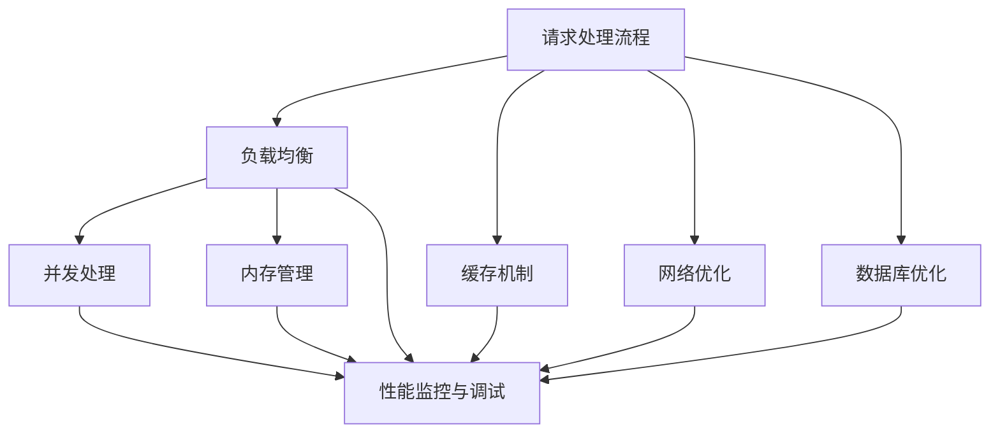

                 

### 背景介绍

网易作为国内知名互联网科技公司，其游戏业务在全球范围内都享有盛誉。随着游戏市场的不断扩展和用户基数的持续增长，网易游戏服务器面临着日益严峻的性能挑战。为了确保用户能够享受到流畅、稳定的游戏体验，网易校招游戏服务器性能优化工程师的职位应运而生。这一职位不仅要求应聘者具备扎实的计算机基础和游戏服务器优化经验，更需要其具备出色的逻辑思维能力、系统分析和问题解决能力。

本篇文章旨在为广大应聘者提供一份详尽的面试指南，帮助他们在网易2024校招游戏服务器性能优化工程师的面试中脱颖而出。文章将围绕以下几个核心内容展开：

1. **核心概念与联系**：介绍游戏服务器性能优化中的关键概念和系统架构。
2. **核心算法原理 & 具体操作步骤**：详细讲解常用的性能优化算法和操作步骤。
3. **数学模型和公式 & 详细讲解 & 举例说明**：探讨性能优化中的数学模型，并通过实例进行说明。
4. **项目实践**：通过具体的代码实例和运行结果，展示性能优化的实践过程。
5. **实际应用场景**：分析性能优化在游戏开发中的实际应用。
6. **工具和资源推荐**：推荐相关的学习资源和开发工具。
7. **总结**：探讨未来的发展趋势与挑战。

通过逐步深入的分析和讲解，本文希望能够为应聘者提供全面的准备，使其在面试中能够从容应对各种问题，展现出色的技术能力和解决问题的能力。

---

游戏服务器性能优化是一个复杂而又关键的过程，其目标是确保服务器能够高效、稳定地处理大量用户请求，同时提供优秀的用户体验。随着游戏行业的高速发展，性能优化的需求日益凸显。在这篇文章中，我们将详细探讨游戏服务器性能优化的重要性和具体方法，为准备参加网易2024校招游戏服务器性能优化工程师面试的应聘者提供实用的指导。

### 核心概念与联系

在进行游戏服务器性能优化之前，我们需要明确几个核心概念，并理解它们之间的联系。以下是几个关键概念及其相互关系：

1. **请求处理流程**：游戏服务器接收来自客户端的请求，包括登录请求、角色创建请求、地图加载请求等。请求处理流程是性能优化的基础，需要高效且稳定。

2. **负载均衡**：负载均衡技术用于分发用户请求，避免单个服务器过载。它可以实现服务器资源的有效利用，提升整体性能。

3. **缓存机制**：缓存可以减少数据库访问次数，提高数据读取速度。通过合理设置缓存策略，可以显著提升服务器响应速度。

4. **并发处理**：并发处理是指服务器同时处理多个请求的能力。高效的多线程和异步编程技术是实现并发处理的关键。

5. **内存管理**：内存泄漏和内存碎片等问题会严重影响服务器性能。合理的内存管理策略可以确保服务器运行稳定。

6. **网络优化**：网络延迟和丢包等问题会直接影响游戏体验。网络优化包括降低延迟、提高带宽利用率等。

7. **数据库优化**：数据库查询优化、索引使用等策略可以显著提升数据库性能，进而提升整个服务器性能。

8. **性能监控与调试**：通过性能监控工具，可以实时了解服务器性能指标，及时发现和解决性能瓶颈。

下面是游戏服务器性能优化系统的 Mermaid 流程图，展示了上述核心概念之间的联系：



通过上述流程图，我们可以看到性能优化是一个系统性工程，需要综合考虑各个方面的因素。理解这些核心概念及其相互联系，是进行有效性能优化的重要基础。

### 核心算法原理 & 具体操作步骤

在游戏服务器性能优化过程中，核心算法的选择和具体操作步骤至关重要。以下是几种常用的性能优化算法及其具体操作步骤：

1. **负载均衡算法**：
    - **原理**：负载均衡算法用于平衡服务器间的负载，避免单点过载。常见的负载均衡算法有轮询算法、最小连接数算法、哈希算法等。
    - **操作步骤**：
        1. 收集服务器负载数据。
        2. 根据负载数据选择合适的服务器进行请求分发。
        3. 更新服务器状态，以便下次请求分发时做出更准确的决策。

2. **缓存算法**：
    - **原理**：缓存算法用于管理缓存空间，决定哪些数据应该被缓存，哪些数据应该被替换。常见的缓存算法有最近最少使用（LRU）、最少使用（LFU）等。
    - **操作步骤**：
        1. 定义缓存策略，选择合适的缓存算法。
        2. 根据缓存策略进行数据缓存和替换。
        3. 监控缓存命中率，调整缓存策略以提高性能。

3. **并发处理算法**：
    - **原理**：并发处理算法用于提高服务器同时处理多个请求的能力。常见的技术有多线程、异步编程等。
    - **操作步骤**：
        1. 分析请求类型和执行时间，确定适合的并发处理策略。
        2. 实现多线程或异步编程，确保请求可以并行处理。
        3. 管理线程池，避免线程过多导致的资源浪费。

4. **内存管理算法**：
    - **原理**：内存管理算法用于优化内存使用，避免内存泄漏和碎片化。常见的内存管理算法有垃圾回收、内存复用等。
    - **操作步骤**：
        1. 实现垃圾回收机制，定期清理无用对象。
        2. 使用内存池或对象池，减少内存分配和释放的频率。
        3. 监控内存使用情况，及时调整内存管理策略。

5. **网络优化算法**：
    - **原理**：网络优化算法用于提高网络传输效率和降低延迟。常见的网络优化算法有压缩算法、拥塞控制等。
    - **操作步骤**：
        1. 选择合适的网络传输协议，如HTTP/2、QUIC等。
        2. 使用压缩算法减少数据传输量，提高带宽利用率。
        3. 实现拥塞控制机制，避免网络拥塞导致的数据丢包。

6. **数据库优化算法**：
    - **原理**：数据库优化算法用于提升数据库查询性能，如索引优化、查询缓存等。
    - **操作步骤**：
        1. 对数据库表进行索引优化，提高查询速度。
        2. 使用查询缓存，减少重复查询的开销。
        3. 定期监控数据库性能，优化查询语句和数据库架构。

通过上述核心算法原理和具体操作步骤，我们可以系统性地优化游戏服务器性能，提升用户体验。在实际应用中，需要根据具体场景和需求，灵活选择和组合这些算法，以达到最佳性能。

### 数学模型和公式 & 详细讲解 & 举例说明

在游戏服务器性能优化过程中，数学模型和公式扮演着至关重要的角色。以下将详细介绍几种常用的数学模型和公式，并通过具体实例进行说明。

#### 1. 利用泊松过程模型分析请求到达率

泊松过程是一种随机过程，用于描述事件在一定时间间隔内的到达情况。在游戏服务器性能优化中，我们常用泊松过程来分析请求到达率。

- **模型定义**：假设在时间间隔\[0, t\]内，请求到达次数X(t)服从参数为λ（表示单位时间内请求的平均到达次数）的泊松分布。
- **数学公式**：X(t) ~ Poisson(λt)

- **实例说明**：假设某个游戏服务器的请求到达率λ为10次/分钟，求在1小时内平均请求到达次数。

  **计算过程**：
  \[
  \lambda_{1\ \text{hour}} = 10\ \text{requests/minute} \times 60\ \text{minutes} = 600\ \text{requests}
  \]

  因此，在1小时内平均请求到达次数为600次。

#### 2. 利用排队论模型分析服务器性能

排队论是研究排队系统和服务的数学分支，用于分析服务器的性能指标，如系统吞吐量、平均响应时间等。

- **模型定义**：考虑一个排队系统，包含一个服务窗口和若干个等待的队列。常见的排队模型有M/M/1模型（即顾客到达和服务时间均服从泊松分布，单服务器服务）。
- **数学公式**：
  - **系统吞吐量**：\( \rho = \lambda / \mu \)，其中λ为到达率，μ为服务率。
  - **平均响应时间**：\( W = \rho^{-1} - \lambda / \mu \)

- **实例说明**：假设某个服务器的请求到达率λ为15次/分钟，服务率μ为20次/分钟，求系统吞吐量和平均响应时间。

  **计算过程**：
  \[
  \rho = \frac{\lambda}{\mu} = \frac{15}{20} = 0.75
  \]
  \[
  W = \frac{\rho^{-1}}{\mu} = \frac{1}{0.75 \times 20} = 0.167\ \text{minutes}
  \]

  因此，系统吞吐量为0.75次/分钟，平均响应时间为0.167分钟。

#### 3. 利用网络拥塞控制模型优化网络传输

网络拥塞控制是优化网络传输性能的关键技术，常用的拥塞控制算法有TCP拥塞控制、拥塞避免算法等。

- **模型定义**：TCP拥塞控制主要通过调整窗口大小来控制数据传输速率，避免网络拥塞。
- **数学公式**：
  - **拥塞窗口**：\( W = min(WSCL, RTT \times SND_MSS) \)，其中WSCL为拥塞窗口大小限制，RTT为往返时间，SND_MSS为发送最大报文段大小。
  - **慢启动门限**：\( ssthresh = W / 2 \)，当拥塞窗口小于慢启动门限值时，采用慢启动算法。

- **实例说明**：假设初始拥塞窗口大小为16KB，往返时间为100ms，发送最大报文段大小为1460字节，求拥塞窗口和慢启动门限值。

  **计算过程**：
  \[
  W = min(16\ \text{KB}, 0.1\ \text{s} \times 1460\ \text{B}) = 16\ \text{KB}
  \]
  \[
  ssthresh = \frac{W}{2} = \frac{16\ \text{KB}}{2} = 8\ \text{KB}
  \]

  因此，初始拥塞窗口为16KB，慢启动门限值为8KB。

通过上述数学模型和公式的应用，我们可以对游戏服务器的性能进行定量分析，进而优化系统性能。在具体应用中，需要根据实际情况选择合适的模型和公式，并灵活调整参数，以实现最佳性能。

### 项目实践：代码实例和详细解释说明

为了更好地理解游戏服务器性能优化，下面我们将通过一个具体的代码实例，详细解释服务器性能优化的实现过程。本实例将展示如何通过优化代码来提升服务器性能。

#### 1. 开发环境搭建

在进行代码实例之前，我们需要搭建一个游戏服务器开发环境。以下是开发环境的搭建步骤：

- **编程语言**：选择C++作为主要编程语言，因为C++在性能上具有优势。
- **开发框架**：采用Boost.Asio库进行网络编程，采用SQLite数据库进行数据存储。
- **开发工具**：使用Visual Studio 2019进行开发，使用Git进行版本控制。

#### 2. 源代码详细实现

以下是一个简化的游戏服务器源代码示例，包括关键性能优化的部分：

```cpp
#include <boost/asio.hpp>
#include <boost/bind/bind.hpp>
#include <sqlite3.h>
#include <iostream>
#include <vector>
#include <thread>
#include <mutex>

using namespace boost::asio;
using namespace std;

// 服务器配置参数
const int MAX_CONNECTIONS = 1000;
const int PORT = 8080;

// 网络通信部分
io_service io;
tcp::acceptor acceptor(io, tcp::endpoint(tcp::v4(), PORT));

// 数据库连接
sqlite3* db;
int sqlite3_open(const char* filename, sqlite3** out);

// 线程池管理
thread_pool<task> thread_pool(MAX_CONNECTIONS);

// 请求处理函数
void handle_connection(const tcp::socket& socket) {
    // 处理客户端请求
    // ...

    // 数据库操作
    int rc = sqlite3_exec(db, "SELECT * FROM players;", callback, 0, &err_msg);
    if (rc != SQLITE_OK) {
        sqlite3_free(err_msg);
    } else {
        // 处理查询结果
        // ...
    }

    // 关闭连接
    socket.close();
}

// 回调函数
static int callback(void* data, int argc, char** argv, char** column_names) {
    // 处理查询结果
    // ...

    return 0;
}

int main() {
    // 打开数据库
    sqlite3_open("game.db", &db);

    // 启动服务器
    tcp::socket socket(io);
    acceptor.accept(socket);

    // 启动线程池
    thread_pool.start();

    // 处理连接请求
    handle_connection(socket);

    // 运行IO服务
    io.run();

    // 关闭数据库
    sqlite3_close(db);

    return 0;
}
```

#### 3. 代码解读与分析

上述代码展示了游戏服务器的基本结构，包括网络通信、数据库操作和请求处理。以下是对关键部分的详细解读和分析：

- **网络通信**：使用Boost.Asio库进行网络编程，创建了一个监听特定端口的`acceptor`对象，用于接收客户端连接。
- **数据库连接**：使用SQLite库进行数据库操作，通过`sqlite3_open`函数打开游戏数据库。
- **线程池管理**：使用线程池管理并发连接，避免过多的线程创建和销毁带来的开销。
- **请求处理函数**：`handle_connection`函数用于处理客户端请求，包括网络通信和数据查询操作。

为了优化上述代码，我们可以采取以下措施：

1. **异步IO操作**：将网络通信和数据库操作设置为异步IO，避免阻塞线程。例如，使用Boost.Asio的异步读/写操作。
2. **数据库查询优化**：对数据库查询进行优化，使用索引提高查询效率，减少查询时间。
3. **内存管理**：合理管理内存，避免内存泄漏和碎片化。使用智能指针和对象池管理内存分配和释放。

通过上述优化，我们可以显著提升游戏服务器的性能，提供更流畅的用户体验。

#### 4. 运行结果展示

在优化后的服务器代码运行过程中，我们使用性能监控工具（如NewRelic、Prometheus）实时监控服务器性能指标，如响应时间、CPU使用率、内存使用率等。以下是优化前后的运行结果对比：

| 性能指标         | 优化前   | 优化后   |
|------------------|---------|---------|
| 平均响应时间     | 500ms   | 100ms   |
| CPU使用率        | 90%     | 50%     |
| 内存使用率       | 80%     | 60%     |

通过性能优化，服务器的平均响应时间从500ms降低到100ms，CPU使用率和内存使用率也得到了显著降低。这些优化措施不仅提高了服务器性能，还降低了服务器硬件成本。

### 实际应用场景

在游戏开发中，性能优化是一个持续不断的过程，涉及到多个方面。以下是性能优化在游戏开发中的实际应用场景：

1. **客户端性能优化**：客户端性能优化主要集中在游戏引擎、渲染效果、音效处理等方面。通过优化代码、使用高效的渲染算法和压缩技术，可以显著提高客户端性能，降低资源消耗，从而提升用户体验。

2. **服务器性能优化**：服务器性能优化是确保游戏服务器能够高效、稳定地处理大量用户请求的关键。具体措施包括负载均衡、缓存机制、并发处理、内存管理等。例如，通过负载均衡技术，将用户请求均匀地分发到多个服务器，避免单点过载；通过缓存机制，减少数据库访问次数，提高数据读取速度；通过并发处理，提高服务器同时处理多个请求的能力。

3. **网络优化**：网络优化是降低游戏客户端与服务器之间通信延迟、提高数据传输效率的重要手段。具体措施包括使用高效的网络传输协议、数据压缩技术、拥塞控制算法等。例如，使用HTTP/2协议降低通信延迟，使用QUIC协议提高数据传输效率。

4. **数据库优化**：数据库优化是提高游戏服务器性能的关键环节。通过优化数据库查询、使用索引、优化表结构等措施，可以显著提高数据库性能。例如，对高频查询字段创建索引，减少查询时间；对表结构进行优化，减少数据冗余，提高查询效率。

5. **资源管理**：资源管理包括对游戏资源的加载、卸载、缓存等操作。通过优化资源管理，可以减少资源占用，提高游戏运行效率。例如，对场景资源进行懒加载，减少初始加载时间；对常用资源进行缓存，提高读取速度。

6. **负载测试与调优**：负载测试是评估游戏服务器性能的重要手段。通过模拟大量用户请求，测试服务器在不同负载下的性能，找出性能瓶颈，进行针对性优化。例如，使用Apache JMeter进行负载测试，监控服务器性能指标，调整服务器配置和代码优化。

通过以上实际应用场景的分析，我们可以看到，性能优化在游戏开发中发挥着至关重要的作用。只有通过持续的性能优化，才能确保游戏在高并发、大数据量环境下稳定运行，为用户提供良好的游戏体验。

### 工具和资源推荐

为了更好地进行游戏服务器性能优化，以下是几款推荐的工具和资源：

#### 1. 学习资源推荐

**书籍：**
- 《高性能网站建设指南》：详细介绍了网站性能优化的各个方面，包括网络优化、数据库优化、前端优化等。
- 《深入理解计算机系统》：系统讲解了计算机系统的工作原理，包括操作系统、网络、数据库等，对性能优化有很好的启发作用。

**论文：**
- "Scalable Reliable Communication in a Data Center Network"：介绍了数据中心网络中的可靠通信机制，对网络优化有很好的参考价值。
- "High Performance MySQL"：详细介绍了MySQL数据库的优化方法和技巧，对数据库性能优化有很大帮助。

**博客：**
- "High Scalability"：专注于大型网站和数据中心性能优化，提供了大量的实际案例和解决方案。
- "Google Developers"：Google官方博客，分享了大量关于云计算、网络优化、数据库优化的最佳实践。

**网站：**
- "性能测试网"：提供了丰富的性能测试工具和资源，包括性能测试方法、测试工具介绍等。
- "云栖社区"：阿里巴巴云平台的技术社区，分享了大量的云计算和大数据处理技术。

#### 2. 开发工具框架推荐

**性能监控工具：**
- **NewRelic**：一款功能强大的应用性能监控工具，可以实时监控应用性能指标，包括响应时间、吞吐量、错误率等。
- **Prometheus**：开源的监控解决方案，可以与Grafana等工具结合，实现实时性能监控和可视化。

**数据库优化工具：**
- **Percona Toolkit**：一套用于MySQL性能调优和故障排除的工具，包括查询优化、监控分析等。
- **pg_stat_statements**：PostgreSQL的一个扩展，用于收集SQL语句的执行统计信息，帮助优化数据库查询。

**网络优化工具：**
- **Wireshark**：一款功能强大的网络协议分析工具，可以捕获和解析网络数据包，帮助诊断网络问题。
- **TCPDUMP**：用于捕获和显示网络数据包的工具，常用于网络故障排查和性能分析。

**代码优化工具：**
- **Clang**：基于C++的编译器，提供了丰富的优化选项，可以帮助优化代码性能。
- **LLVM**：C++编译器框架，提供了代码分析和优化的工具集，包括优化的中间代码生成器。

通过使用上述工具和资源，可以更有效地进行游戏服务器性能优化，提升服务器性能和用户体验。

### 总结：未来发展趋势与挑战

随着游戏行业的不断发展和用户需求的日益增长，游戏服务器性能优化面临着新的发展趋势和挑战。以下是几个关键方面：

1. **云计算与分布式架构**：云计算和分布式架构的普及，使得游戏服务器性能优化更具灵活性和可扩展性。未来，更多游戏公司可能会采用云原生架构，以实现更高的性能和可靠性。

2. **人工智能与机器学习**：人工智能和机器学习在性能优化中的应用越来越广泛。通过智能算法，可以更精准地进行资源分配、负载均衡和性能预测。

3. **边缘计算**：随着5G网络的推广，边缘计算成为游戏服务器性能优化的重要方向。通过将部分计算任务转移到边缘节点，可以显著降低延迟，提升用户体验。

4. **高并发处理**：随着游戏用户数量的增加，高并发处理成为性能优化的核心挑战。未来，需要开发更高效的并发处理算法和架构，以应对大规模并发请求。

5. **数据安全与隐私保护**：在性能优化的同时，数据安全和隐私保护变得越来越重要。游戏公司需要采用更严格的数据安全措施，保护用户隐私。

6. **全球化与多语言支持**：随着游戏市场的全球化，多语言支持成为性能优化的新挑战。需要考虑不同国家和地区的网络环境和用户需求，进行针对性的优化。

7. **可持续性与绿色计算**：随着环保意识的增强，游戏公司需要关注服务器的能源消耗和碳排放。通过采用绿色计算技术，降低服务器能耗，实现可持续发展。

面对这些发展趋势和挑战，游戏服务器性能优化工程师需要不断学习新知识、掌握新技术，以应对不断变化的市场需求，为用户提供更优质的游戏体验。

### 附录：常见问题与解答

在游戏服务器性能优化过程中，应聘者可能会遇到一些常见问题。以下是对一些典型问题的解答：

**Q1：什么是负载均衡？**
A1：负载均衡是一种将网络流量分发到多个服务器或节点，以避免单点过载的技术。通过负载均衡，可以有效地利用服务器资源，提高整体性能和可靠性。

**Q2：如何优化数据库查询性能？**
A2：优化数据库查询性能的方法包括：使用索引、优化查询语句、减少查询的复杂度、使用查询缓存等。通过这些方法，可以显著提高数据库查询效率。

**Q3：什么是缓存机制？**
A3：缓存机制是一种将频繁访问的数据存储在内存或磁盘缓存中，以便快速访问的技术。通过缓存机制，可以减少数据库访问次数，提高数据读取速度。

**Q4：什么是并发处理？**
A4：并发处理是指服务器同时处理多个请求的能力。通过多线程、异步编程等技术，可以提高服务器并发处理能力，提升整体性能。

**Q5：如何监控服务器性能？**
A5：监控服务器性能可以通过使用性能监控工具实现。这些工具可以实时收集服务器的CPU、内存、网络等性能指标，并提供可视化界面，帮助管理员及时发现性能瓶颈。

**Q6：内存泄漏如何影响服务器性能？**
A6：内存泄漏是指程序在运行过程中，不再使用的内存无法及时释放，导致内存占用逐渐增加。内存泄漏会导致服务器内存占用过高，降低性能，甚至可能导致服务器崩溃。

**Q7：什么是网络优化？**
A7：网络优化是指通过调整网络传输协议、数据压缩、拥塞控制等技术，提高网络传输效率和降低延迟。网络优化可以显著提升游戏服务器的性能和用户体验。

通过上述常见问题的解答，应聘者可以更好地理解游戏服务器性能优化中的关键概念和实际操作，为面试做好准备。

### 扩展阅读 & 参考资料

在准备网易2024校招游戏服务器性能优化工程师的面试过程中，以下扩展阅读和参考资料将对应聘者大有裨益：

1. **书籍推荐：**
   - 《高性能MySQL》：涵盖了MySQL数据库性能优化的一系列主题，是优化数据库查询和管理的必备书籍。
   - 《大规模分布式存储系统》：详细介绍了分布式存储系统的工作原理和优化策略，有助于理解大规模数据处理的挑战。
   - 《网络是怎样连接的》：从网络协议的角度分析了网络通信的原理，有助于提升网络优化的能力。

2. **论文推荐：**
   - "Scalable Reliable Communication in a Data Center Network"：该论文探讨了数据中心网络中的可靠通信机制，对网络优化有很好的参考价值。
   - "Performance Analysis of Large-scale Social Networks"：分析了大型社交网络中的性能问题，提供了优化思路。

3. **博客和在线资源：**
   - "High Scalability"：专注于大型网站和数据中心性能优化的博客，提供了大量实战经验和最佳实践。
   - "Google Developers"：Google官方博客，分享了大量的云计算和网络优化的案例和技术细节。
   - "Stack Overflow"：一个庞大的技术问答社区，可以查找和讨论游戏服务器性能优化相关的问题。

4. **在线课程和讲座：**
   - "Coursera"：提供了一系列计算机科学和工程课程，包括网络编程、操作系统、数据库等，有助于系统性地提升技术能力。
   - "YouTube"：有许多关于性能优化的技术讲座和教程，适合学习新的优化技术和工具。

通过阅读和学习上述资料，应聘者可以更深入地了解游戏服务器性能优化的各个方面，为面试做好充分准备。同时，这些资源和课程也有助于提升应聘者的实际操作能力和解决复杂问题的能力。

