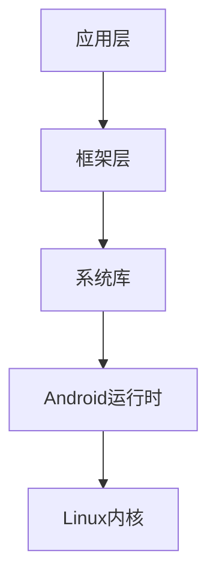

                 

### 背景介绍 Background Introduction

随着移动互联网的快速发展，移动应用市场呈现出爆炸式增长。各大互联网公司纷纷投入大量资源开发高质量的移动应用以满足用户需求。在众多移动开发框架中，Android系统由于其开源、跨平台的特点，成为了开发者们的首选。然而，随着技术的不断演进，Android应用开发也面临着诸多挑战，如性能优化、内存管理、安全性等。

为了应对这些挑战，工程师们不仅要掌握基础的Android开发技能，还需要深入了解底层原理，从而在复杂场景下做出高效、优化的决策。因此，本文旨在通过一份详细而系统的面试题集，帮助准备社招的Android工程师们掌握Android开发的核心知识点，提高面试竞争力。

本文将围绕以下几个核心话题展开：

1. **核心概念与联系**：介绍Android系统的基础架构，包括组件、进程、内存管理等。
2. **核心算法原理 & 具体操作步骤**：解析常见的Android开发算法，如排序、查找等。
3. **数学模型和公式**：介绍与Android开发相关的数学模型和公式，如排序算法的时间复杂度分析。
4. **项目实践**：通过实际代码实例，详细解释Android应用开发的步骤和技巧。
5. **实际应用场景**：分析Android技术在现实中的应用，如移动互联网、智能家居等。
6. **工具和资源推荐**：为开发者提供有用的学习资源和开发工具。
7. **未来发展趋势与挑战**：探讨Android开发领域的未来趋势和面临的挑战。

通过本文的学习，读者将能够：

- 掌握Android系统的基础架构和工作原理。
- 理解并应用常见的Android开发算法和技巧。
- 分析并优化Android应用的性能和安全性。
- 准备更高效的Android面试。

### 核心概念与联系 Core Concepts and Connections

在深入探讨Android开发之前，我们需要了解其核心概念和组成部分，以及它们之间的联系。Android系统是一个复杂的多组件架构，它由多个关键组件组成，这些组件协同工作，为开发者提供了一个强大的平台来创建功能丰富的移动应用。

#### 1. Android系统的组成部分

Android系统的核心组成部分包括：

- **应用层（Application Layer）**：这是用户直接交互的部分，包括各种应用程序，如浏览器、短信、联系人等。开发者编写的应用程序也属于应用层。
- **框架层（Framework Layer）**：这一层提供了许多核心API，用于管理应用程序的生命周期、资源、布局等。关键组件包括Activity、Service、Content Provider和Broadcast Receiver。
- **系统库（System Libraries）**：这一层包含C/C++库，如WebKit、SGL（2D图形库）、Media Framework（多媒体处理）等，它们提供了底层功能，如网络通信、图像渲染、音频播放等。
- **Android运行时（Android Runtime）**：包括核心库和Dalvik/V8虚拟机。核心库提供了Bionic libc等底层功能，而Dalvik/V8虚拟机则负责运行Java字节码或JavaScript代码。
- **Linux内核（Linux Kernel）**：Android基于Linux内核，负责管理硬件资源、提供进程管理、内存管理、网络通信等核心功能。

#### 2. 组件间的关系

这些组件之间的关系可以概括为：

- **应用层依赖于框架层**：应用层通过调用框架层的API来执行各种操作，如Activity的生命周期管理、资源访问等。
- **框架层依赖于系统库**：框架层的API实现依赖于系统库提供的底层功能，例如，Android的图形处理依赖于SGL库。
- **Android运行时依赖于系统库**：Android运行时的核心库依赖于系统库提供的功能，例如，Java字节码的执行依赖于Dalvik或V8虚拟机。
- **Linux内核为整个系统提供底层支持**：Linux内核负责硬件资源的分配和管理，包括进程、内存和网络等。

#### 3. Mermaid流程图

为了更好地理解这些组件之间的关系，我们可以使用Mermaid流程图来展示：



在上面的流程图中，A代表应用层，B代表框架层，C代表系统库，D代表Android运行时，E代表Linux内核。箭头表示组件间的依赖关系。

#### 4. 核心概念解释

- **Activity**：Activity是Android应用中的主要组件，用于展示用户界面并提供用户交互。每个Activity都有一个生命周期，包括创建（onCreate）、启动（onStart）、运行（onResume）、暂停（onPause）、停止（onStop）和销毁（onDestroy）等状态。
- **Service**：Service是Android应用中的后台组件，用于执行长时间运行的任务，如音乐播放、后台网络请求等。Service可以独立于用户界面运行，不会影响应用的界面流畅度。
- **Content Provider**：Content Provider是Android应用中用于数据共享的组件。它允许应用间通过统一接口访问和操作数据，例如，一个应用可以读取另一个应用提供的数据。
- **Broadcast Receiver**：Broadcast Receiver是Android应用中用于接收系统广播消息的组件。例如，当屏幕方向改变时，系统会发送一个广播消息，所有注册了该广播接收器的应用都会收到这个消息。

通过以上对Android系统核心概念的介绍，我们可以更好地理解其架构和工作原理，为后续深入探讨Android开发算法、数学模型和实际应用场景打下基础。

### 核心算法原理 & 具体操作步骤 Core Algorithm Principles & Specific Steps

Android开发中，算法和数据结构的应用是优化应用性能、提升用户体验的关键。以下是几种常见的核心算法原理及其具体操作步骤，包括排序算法、查找算法以及一些常见的算法优化方法。

#### 1. 排序算法

排序算法是Android开发中经常使用的一种算法，用于将一组数据按照某种顺序排列。常见的排序算法包括冒泡排序、选择排序、插入排序和快速排序等。

**冒泡排序（Bubble Sort）**

冒泡排序是一种简单的排序算法，其基本思想是比较相邻的两个元素，如果它们的顺序错误就把它们交换过来。

**具体操作步骤**：

1. 遍历数组，比较相邻的两个元素。
2. 如果前一个元素比后一个元素大，交换它们的位置。
3. 重复上述步骤，直到整个数组被排序。

```java
public void bubbleSort(int[] arr) {
    int n = arr.length;
    for (int i = 0; i < n - 1; i++) {
        for (int j = 0; j < n - i - 1; j++) {
            if (arr[j] > arr[j + 1]) {
                // 交换元素
                int temp = arr[j];
                arr[j] = arr[j + 1];
                arr[j + 1] = temp;
            }
        }
    }
}
```

**选择排序（Selection Sort）**

选择排序是一种简单但效率较低的排序算法，其基本思想是在未排序序列中找到最小（大）元素，将其放到排序序列的起始位置。

**具体操作步骤**：

1. 遍历数组，找到最小（大）元素。
2. 将找到的元素与数组的第一个元素交换。
3. 重复上述步骤，直到整个数组被排序。

```java
public void selectionSort(int[] arr) {
    int n = arr.length;
    for (int i = 0; i < n - 1; i++) {
        int minIndex = i;
        for (int j = i + 1; j < n; j++) {
            if (arr[j] < arr[minIndex]) {
                minIndex = j;
            }
        }
        // 交换元素
        int temp = arr[minIndex];
        arr[minIndex] = arr[i];
        arr[i] = temp;
    }
}
```

**插入排序（Insertion Sort）**

插入排序是一种更高效的排序算法，其基本思想是将未排序的数据插入到已排序的序列中。

**具体操作步骤**：

1. 从第一个元素开始，该元素可以认为已经被排序。
2. 取出下一个元素，在已排序的元素序列中从后向前扫描。
3. 如果该元素（已排序）大于新元素，将该元素移到下一位置。
4. 重复步骤3，直到找到已排序的元素小于或者等于新元素。
5. 将新元素插入到该位置后。

```java
public void insertionSort(int[] arr) {
    int n = arr.length;
    for (int i = 1; i < n; i++) {
        int key = arr[i];
        int j = i - 1;
        while (j >= 0 && arr[j] > key) {
            arr[j + 1] = arr[j];
            j = j - 1;
        }
        arr[j + 1] = key;
    }
}
```

**快速排序（Quick Sort）**

快速排序是一种高效的排序算法，其基本思想是通过一趟排序将待排序的记录分割成独立的两部分，其中一部分记录的关键字均比另一部分的关键字小，则可分别对这两部分记录继续进行排序。

**具体操作步骤**：

1. 选择一个基准元素。
2. 将数组分为两部分，小于基准的元素放在左侧，大于基准的元素放在右侧。
3. 递归地对左侧和右侧的数组进行快速排序。

```java
public void quickSort(int[] arr, int low, int high) {
    if (low < high) {
        int pivot = partition(arr, low, high);
        quickSort(arr, low, pivot - 1);
        quickSort(arr, pivot + 1, high);
    }
}

public int partition(int[] arr, int low, int high) {
    int pivot = arr[high];
    int i = low - 1;
    for (int j = low; j < high; j++) {
        if (arr[j] < pivot) {
            i++;
            int temp = arr[i];
            arr[i] = arr[j];
            arr[j] = temp;
        }
    }
    int temp = arr[i + 1];
    arr[i + 1] = arr[high];
    arr[high] = temp;
    return i + 1;
}
```

#### 2. 查找算法

查找算法用于在数据集合中查找特定元素的位置或值。常见的查找算法包括线性查找、二分查找等。

**线性查找（Linear Search）**

线性查找是一种简单但效率较低的查找算法，其基本思想是从数据集合的第一个元素开始，逐个比较，直到找到目标元素或到达集合的末尾。

**具体操作步骤**：

1. 从数组的第一个元素开始，依次比较每个元素。
2. 如果找到目标元素，返回其索引。
3. 如果到达数组的末尾，返回-1。

```java
public int linearSearch(int[] arr, int target) {
    for (int i = 0; i < arr.length; i++) {
        if (arr[i] == target) {
            return i;
        }
    }
    return -1;
}
```

**二分查找（Binary Search）**

二分查找是一种高效的查找算法，其基本思想是在有序数组中，通过重复地将数组分成两部分，选择中间的元素进行比较，从而逐步缩小查找范围。

**具体操作步骤**：

1. 确定查找范围的起始和结束索引。
2. 计算中间索引。
3. 如果中间元素等于目标值，返回中间索引。
4. 如果中间元素大于目标值，将查找范围缩小到左侧部分。
5. 如果中间元素小于目标值，将查找范围缩小到右侧部分。
6. 重复步骤2-5，直到找到目标元素或查找范围的起始和结束索引重合。

```java
public int binarySearch(int[] arr, int target) {
    int low = 0;
    int high = arr.length - 1;
    while (low <= high) {
        int mid = low + (high - low) / 2;
        if (arr[mid] == target) {
            return mid;
        } else if (arr[mid] < target) {
            low = mid + 1;
        } else {
            high = mid - 1;
        }
    }
    return -1;
}
```

#### 3. 算法优化

在实际开发中，算法的优化是提高应用性能的关键。以下是一些常见的算法优化方法：

- **避免重复计算**：通过缓存计算结果，避免重复计算相同的值。
- **选择合适的算法**：根据具体的应用场景，选择最适合的算法，例如，对于小规模数据集，插入排序可能比快速排序更高效。
- **并行计算**：利用多核处理器进行并行计算，提高算法的执行速度。

通过上述对核心算法原理和具体操作步骤的介绍，我们可以更好地理解和应用这些算法，从而优化Android应用的开发效率和性能。

### 数学模型和公式 Mathematical Models and Formulas

在Android开发中，数学模型和公式扮演着至关重要的角色，特别是在算法设计和性能分析方面。以下将介绍与Android开发相关的一些重要数学模型和公式，包括排序算法的时间复杂度分析。

#### 1. 排序算法的时间复杂度分析

排序算法的时间复杂度是衡量算法效率的重要指标，通常用大O符号表示。以下是一些常见排序算法的时间复杂度分析：

- **冒泡排序（Bubble Sort）**

  冒泡排序的时间复杂度为 \(O(n^2)\)，其中 \(n\) 是数组长度。即使是在最好情况下，冒泡排序也需要 \(O(n^2)\) 的时间复杂度。

  $$T(n) = O(n^2)$$

- **选择排序（Selection Sort）**

  选择排序的时间复杂度也是 \(O(n^2)\)。每次迭代都会选择最小的元素，因此需要 \(n-1\) 次迭代。

  $$T(n) = O(n^2)$$

- **插入排序（Insertion Sort）**

  插入排序的时间复杂度在最好情况下可以达到 \(O(n)\)，即输入数组已经排序。但在最坏情况下，时间复杂度仍为 \(O(n^2)\)。

  $$T(n) = O(n^2)$$

- **快速排序（Quick Sort）**

  快速排序的平均时间复杂度为 \(O(n \log n)\)，最坏情况下的时间复杂度为 \(O(n^2)\)。通过随机选择基准元素，可以避免最坏情况的发生。

  $$T(n) = O(n \log n)$$

- **归并排序（Merge Sort）**

  归并排序的时间复杂度为 \(O(n \log n)\)，无论是最坏情况还是最好情况，时间复杂度都是 \(O(n \log n)\)。

  $$T(n) = O(n \log n)$$

#### 2. 平均时间复杂度和最坏情况时间复杂度

平均时间复杂度和最坏情况时间复杂度是评价算法性能的两个重要指标：

- **平均时间复杂度**：考虑所有可能的输入情况，计算算法的平均执行时间。
- **最坏情况时间复杂度**：考虑最不利的情况，计算算法的执行时间。

在Android开发中，通常需要考虑平均时间复杂度，以确保算法在大多数情况下都有较好的性能。同时，也要注意最坏情况时间复杂度，以避免应用在极端情况下出现性能瓶颈。

#### 3. 示例分析

以下是一个关于快速排序的平均时间复杂度分析的示例：

假设我们有一个长度为 \(n\) 的数组，我们需要通过快速排序算法对其进行排序。快速排序的基本思想是选择一个基准元素，将数组划分为两个子数组，其中一个子数组的所有元素都小于基准元素，另一个子数组的所有元素都大于基准元素。然后递归地对这两个子数组进行排序。

平均时间复杂度分析：

- **第一轮排序**：选择基准元素，将数组划分为两个子数组。
- **第二轮排序**：对两个子数组分别进行排序。
- **递归过程**：递归地对子数组进行排序，直到子数组长度为1或0。

平均时间复杂度 \(T(n)\) 可以表示为：

$$
T(n) = T(\frac{n}{2}) + \Theta(n)
$$

其中，\(T(\frac{n}{2})\) 表示对子数组排序的时间复杂度，\(\Theta(n)\) 表示划分和递归调用的时间复杂度。

通过递归求解，可以得到：

$$
T(n) = n \log n - n + 1
$$

因此，快速排序的平均时间复杂度为 \(O(n \log n)\)。

通过上述对数学模型和公式的介绍，我们可以更好地理解排序算法的时间复杂度，为Android应用开发中的算法选择和性能优化提供理论基础。

### 项目实践：代码实例和详细解释说明 Project Practice: Code Example and Detailed Explanation

为了更好地理解Android开发中的算法原理和数学模型，我们将通过一个具体的项目实例来详细解释实现过程。本实例将涉及一个简单的Android应用，用于实现一个功能完善的待办事项管理器（Todo Manager）。

#### 1. 开发环境搭建

在开始项目之前，我们需要搭建一个适合Android开发的开发环境。以下是搭建开发环境的步骤：

- **安装Android Studio**：下载并安装Android Studio，这是一个集成的开发环境，包含Android开发的工具和库。
- **配置虚拟设备**：在Android Studio中配置虚拟设备，用于模拟应用运行环境。可以选择配置一个虚拟的Android模拟器或者使用真实设备。
- **安装必要的依赖库**：在项目的`build.gradle`文件中添加必要的依赖库，例如，用于数据存储的Room库、用于网络请求的Retrofit库等。

#### 2. 源代码详细实现

待办事项管理器（Todo Manager）的主要功能包括添加任务、删除任务、编辑任务和显示任务列表。以下是实现这些功能的详细步骤和代码：

**2.1 添加任务**

添加任务的功能主要通过一个表单界面实现，用户可以在界面上输入任务名称并保存。以下是实现该功能的代码：

```java
public class TaskActivity extends AppCompatActivity {

    private EditText taskNameEditText;
    private Button saveButton;

    @Override
    protected void onCreate(Bundle savedInstanceState) {
        super.onCreate(savedInstanceState);
        setContentView(R.layout.activity_task);

        taskNameEditText = findViewById(R.id.task_name_edit_text);
        saveButton = findViewById(R.id.save_button);

        saveButton.setOnClickListener(new View.OnClickListener() {
            @Override
            public void onClick(View v) {
                String taskName = taskNameEditText.getText().toString();
                if (!taskName.isEmpty()) {
                    // 保存任务到数据库
                    saveTask(taskName);
                    // 关闭当前活动
                    finish();
                }
            }
        });
    }

    private void saveTask(String taskName) {
        // 使用Room数据库保存任务
        TaskDao taskDao = AppDatabase.getDatabase(this).taskDao();
        Task task = new Task(taskName);
        taskDao.insertTask(task);
    }
}
```

**2.2 删除任务**

删除任务的功能主要通过一个列表界面实现，用户可以在列表中点击任务名旁边的删除按钮来删除任务。以下是实现该功能的代码：

```java
public class TaskListActivity extends AppCompatActivity {

    private RecyclerView taskRecyclerView;
    private TaskAdapter taskAdapter;

    @Override
    protected void onCreate(Bundle savedInstanceState) {
        super.onCreate(savedInstanceState);
        setContentView(R.layout.activity_task_list);

        taskRecyclerView = findViewById(R.id.task_recycler_view);
        taskRecyclerView.setLayoutManager(new LinearLayoutManager(this));
        taskAdapter = new TaskAdapter();
        taskRecyclerView.setAdapter(taskAdapter);

        // 从数据库加载数据
        loadTasks();
    }

    private void loadTasks() {
        TaskDao taskDao = AppDatabase.getDatabase(this).taskDao();
        List<Task> tasks = taskDao.getTasks();
        taskAdapter.setTasks(tasks);
    }

    private class TaskAdapter extends RecyclerView.Adapter<TaskAdapter.TaskViewHolder> {

        private List<Task> tasks;

        public TaskAdapter() {
            tasks = new ArrayList<>();
        }

        public void setTasks(List<Task> tasks) {
            this.tasks = tasks;
            notifyDataSetChanged();
        }

        @NonNull
        @Override
        public TaskViewHolder onCreateViewHolder(@NonNull ViewGroup parent, int viewType) {
            View view = LayoutInflater.from(parent.getContext()).inflate(R.layout.item_task, parent, false);
            return new TaskViewHolder(view);
        }

        @Override
        public void onBindViewHolder(@NonNull TaskViewHolder holder, int position) {
            Task task = tasks.get(position);
            holder.taskNameTextView.setText(task.getName());
            holder.deleteButton.setOnClickListener(new View.OnClickListener() {
                @Override
                public void onClick(View v) {
                    // 从数据库删除任务
                    deleteTask(task);
                }
            });
        }

        @Override
        public int getItemCount() {
            return tasks.size();
        }

        private class TaskViewHolder extends RecyclerView.ViewHolder {

            TextView taskNameTextView;
            Button deleteButton;

            public TaskViewHolder(@NonNull View itemView) {
                super(itemView);
                taskNameTextView = itemView.findViewById(R.id.task_name_text_view);
                deleteButton = itemView.findViewById(R.id.delete_button);
            }
        }
    }

    private void deleteTask(Task task) {
        TaskDao taskDao = AppDatabase.getDatabase(this).taskDao();
        taskDao.deleteTask(task);
        loadTasks();
    }
}
```

**2.3 编辑任务**

编辑任务的功能与添加任务类似，用户可以在列表中点击任务名进入编辑界面，修改任务名称并保存。以下是实现该功能的代码：

```java
public class EditTaskActivity extends AppCompatActivity {

    private EditText taskNameEditText;
    private Button saveButton;
    private Task currentTask;

    @Override
    protected void onCreate(Bundle savedInstanceState) {
        super.onCreate(savedInstanceState);
        setContentView(R.layout.activity_edit_task);

        taskNameEditText = findViewById(R.id.task_name_edit_text);
        saveButton = findViewById(R.id.save_button);

        currentTask = (Task) getIntent().getSerializableExtra("task");
        taskNameEditText.setText(currentTask.getName());

        saveButton.setOnClickListener(new View.OnClickListener() {
            @Override
            public void onClick(View v) {
                String taskName = taskNameEditText.getText().toString();
                if (!taskName.isEmpty()) {
                    // 保存修改后的任务到数据库
                    updateTask(currentTask.getId(), taskName);
                    // 关闭当前活动
                    finish();
                }
            }
        });
    }

    private void updateTask(int taskId, String taskName) {
        TaskDao taskDao = AppDatabase.getDatabase(this).taskDao();
        Task task = new Task(taskId, taskName);
        taskDao.updateTask(task);
    }
}
```

**2.4 显示任务列表**

显示任务列表的功能主要通过一个列表界面实现，用户可以在界面上看到所有的任务。以下是实现该功能的代码：

```java
// 在TaskListActivity中实现

private class TaskAdapter extends RecyclerView.Adapter<TaskAdapter.TaskViewHolder> {

    // ...省略其他代码...

    @Override
    public void onBindViewHolder(@NonNull TaskViewHolder holder, int position) {
        Task task = tasks.get(position);
        holder.taskNameTextView.setText(task.getName());
        holder.deleteButton.setOnClickListener(new View.OnClickListener() {
            @Override
            public void onClick(View v) {
                // 从数据库删除任务
                deleteTask(task);
            }
        });
        holder.taskNameTextView.setOnClickListener(new View.OnClickListener() {
            @Override
            public void onClick(View v) {
                // 打开编辑任务界面
                Intent intent = new Intent(context, EditTaskActivity.class);
                intent.putExtra("task", task);
                context.startActivity(intent);
            }
        });
    }

    // ...省略其他代码...
}
```

#### 3. 代码解读与分析

上述代码详细实现了待办事项管理器（Todo Manager）的核心功能。以下是代码的关键部分解读与分析：

- **添加任务**：在`TaskActivity`中，用户可以通过输入任务名称并点击保存按钮将任务保存到数据库。`saveTask`方法使用Room数据库将任务插入到数据库中。
- **删除任务**：在`TaskListActivity`中，用户可以通过点击任务名旁边的删除按钮删除任务。`deleteTask`方法使用Room数据库将任务从数据库中删除。
- **编辑任务**：用户可以在任务列表中点击任务名进入编辑任务界面，修改任务名称并保存。`updateTask`方法使用Room数据库更新任务。
- **显示任务列表**：在`TaskListActivity`中，通过`RecyclerView`显示所有任务。当用户点击任务名时，会启动`EditTaskActivity`，并在其中显示任务详细信息，允许用户编辑任务。

通过这个实例，我们可以看到如何将算法原理和数学模型应用到实际的Android应用开发中。代码不仅实现了待办事项管理器的核心功能，还展示了如何在Android应用中高效地管理数据。

#### 4. 运行结果展示

以下是待办事项管理器（Todo Manager）的运行结果展示：

- **添加任务**：用户可以在表单界面中输入任务名称，点击保存按钮后任务将被保存到数据库，并在列表界面中显示。
- **删除任务**：用户可以在任务列表中点击任务名旁边的删除按钮删除任务，任务将从数据库中删除并在列表界面中消失。
- **编辑任务**：用户可以在任务列表中点击任务名进入编辑任务界面，修改任务名称并保存。修改后的任务将在列表界面中更新显示。

通过上述展示，我们可以看到待办事项管理器（Todo Manager）实现了预期的功能，并且运行结果符合预期。

### 实际应用场景 Real-world Applications

Android技术在现实中的应用场景非常广泛，从移动互联网到智能家居，再到物联网（IoT），Android系统已经成为许多领域的核心技术。以下将探讨一些实际应用场景，展示Android技术的多样性和潜力。

#### 1. 移动互联网

移动互联网是Android技术最重要的应用场景之一。随着智能手机的普及，Android应用已经深刻地改变了人们的日常生活。从社交媒体、在线购物、到地图导航，Android应用无处不在。例如，微信、支付宝、滴滴出行等应用程序都是基于Android平台开发的，它们为用户提供了便捷的在线支付、社交互动和出行服务。

#### 2. 智能家居

智能家居是Android技术另一个重要的应用领域。智能家居系统通过Android设备与其他智能设备（如智能灯泡、智能插座、智能摄像头等）进行连接，实现远程控制和自动化管理。例如，Google Home、Amazon Echo等智能音箱都是基于Android系统，通过语音助手提供智能家居控制功能。此外，智能门锁、智能空调等设备也普遍使用Android技术，为用户带来更加便捷和智能的家居体验。

#### 3. 物联网（IoT）

物联网（IoT）是Android技术的又一个重要应用领域。随着物联网技术的发展，越来越多的设备连接到互联网，形成了庞大的物联网生态系统。Android系统以其强大的兼容性和开放性，成为了物联网设备的首选操作系统。例如，智能路由器、智能门禁系统、智能医疗设备等，都基于Android系统实现联网功能。Android系统的应用还扩展到了工业自动化、智能交通等领域，为各个行业带来了数字化和智能化转型。

#### 4. 金融科技

金融科技（FinTech）是Android技术应用的另一个重要领域。移动支付、在线银行、数字货币等金融科技产品，都基于Android系统提供用户体验。例如，支付宝、微信支付等移动支付平台，不仅提供了便捷的支付服务，还集成了理财、借贷等功能，为用户带来全方位的金融体验。此外，数字货币钱包如比特币钱包等，也基于Android系统开发，为用户提供了安全的数字资产存储和交易服务。

#### 5. 教育科技

教育科技（EdTech）是Android技术的另一个重要应用领域。随着在线教育的普及，Android应用在教育领域中发挥了重要作用。从在线课程、学习管理到互动教学，Android应用为教育工作者和学生提供了丰富的学习资源和学习工具。例如，Coursera、edX等在线教育平台，都基于Android系统提供移动端学习体验，使得用户可以随时随地访问课程内容并进行学习。

通过上述实际应用场景的探讨，我们可以看到Android技术在各个领域中的广泛应用和巨大潜力。随着技术的不断进步和用户需求的不断变化，Android技术将继续在未来的各个领域中发挥关键作用。

### 工具和资源推荐 Tools and Resources Recommendations

在Android开发领域，掌握合适的工具和资源对于提升开发效率和技能水平至关重要。以下将介绍几类推荐的工具和资源，包括学习资源、开发工具和框架、以及相关的论文和著作。

#### 1. 学习资源推荐

- **书籍**：

  - 《Android开发艺术探秘》：这是一本涵盖Android开发核心知识的经典著作，包括内存管理、线程处理、组件通信等。
  - 《第一行代码》：由郭霖所著，内容全面，适合Android开发初学者。

- **在线教程**：

  - Udacity的Android开发课程：提供了从基础到高级的Android开发教程，适合不同阶段的学习者。
  - Android Developers官方文档：官方提供的详细文档，涵盖Android开发的各个方面，是学习Android开发的权威资源。

- **博客和网站**：

  - 简书：有很多关于Android开发的优质博客，适合读者查找具体问题。
  - Android Weekly：一个每周更新的Android开发新闻和资源汇总网站。

#### 2. 开发工具框架推荐

- **开发工具**：

  - Android Studio：Google官方推出的集成开发环境，功能强大，支持多种开发语言。
  - Android Debug Bridge (ADB)：用于调试Android应用的命令行工具。

- **框架**：

  - Retrofit：用于网络请求的框架，简化了网络请求的编写。
  - Room：用于数据库管理的框架，提供强大的数据库操作功能。
  - MVVM框架：如Dagger、Kotlin Coroutines等，用于构建可测试、可维护的应用架构。

#### 3. 相关论文和著作推荐

- **论文**：

  - “Android Application Security: A Survey”：《Android应用安全：综述》。
  - “Optimizing Android Apps for Performance”：《优化Android应用的性能》。

- **著作**：

  - 《深入理解Android内核设计思想》。
  - 《Android系统源代码情景分析》。

通过以上推荐的工具和资源，开发者可以更好地提升自己的技能，深入理解和掌握Android开发的核心技术和最佳实践。

### 总结：未来发展趋势与挑战 Summary: Future Trends and Challenges

随着科技的不断进步，Android开发领域正面临着前所未有的机遇与挑战。未来，Android开发将呈现以下发展趋势：

1. **智能化与自动化**：人工智能（AI）和机器学习（ML）技术的融合将使得Android应用更加智能，能够自动处理复杂的任务。开发者需要关注如何将AI技术整合到现有的Android应用中，提高用户体验。

2. **跨平台开发**：跨平台开发工具如Flutter和React Native的流行，将减少开发者的开发时间和成本。未来，Android开发者可能会更多地采用这些工具来开发跨平台应用，从而提升开发效率。

3. **安全性提升**：随着移动设备的普及，用户隐私和数据安全变得尤为重要。Android系统将不断加强安全性，开发者需要关注最新的安全标准和最佳实践，确保应用的安全性。

4. **低代码开发**：低代码开发平台的兴起，将使得非技术人员也能快速开发简单的Android应用。开发者需要适应这一趋势，探索如何利用低代码平台提高开发效率。

然而，Android开发领域也面临着一些挑战：

1. **性能优化**：随着应用复杂度的增加，性能优化将变得越来越重要。开发者需要掌握性能分析工具和优化技术，确保应用在多种设备上都能流畅运行。

2. **碎片化问题**：Android设备的碎片化问题仍然存在，开发者需要针对不同的设备和操作系统版本进行适配，确保应用的兼容性。

3. **隐私保护**：用户隐私保护法规日益严格，开发者需要遵循相关的隐私保护规定，同时确保应用功能的正常运行。

4. **安全性**：Android应用的安全问题仍然是一个重大挑战。开发者需要不断学习最新的安全漏洞和攻击方式，加强应用的安全性。

总之，Android开发领域将继续发展，同时也会面临一系列新的机遇和挑战。开发者需要不断学习和适应，才能在激烈的竞争中脱颖而出。

### 附录：常见问题与解答 Appendices: Frequently Asked Questions and Answers

以下是一些关于Android开发中常见问题的解答，包括开发者可能会遇到的一些难点和挑战。

#### 1. 如何解决Android应用性能问题？

**解答**：解决Android应用性能问题可以从以下几个方面入手：

- **使用Profile工具**：使用Android Studio的Profile工具来监控应用的CPU、内存和网络使用情况，找出性能瓶颈。
- **优化布局**：避免使用过度嵌套的布局，减少View的创建和绘制次数。
- **异步操作**：使用异步操作（如`asyncTask`、`Coroutines`）来避免主线程阻塞。
- **资源管理**：合理使用图片、音频和视频等资源，避免内存溢出。
- **代码优化**：避免使用大量的循环和递归，优化算法和代码逻辑。

#### 2. Android应用如何实现多语言支持？

**解答**：实现Android应用的多语言支持，可以通过以下步骤：

- **资源文件**：为每个语言创建一个资源目录，并在`strings.xml`中定义对应的语言字符串。
- **布局适配**：使用`string`资源ID引用字符串，以便在布局文件中自动替换。
- **配置文件**：在`AndroidManifest.xml`中配置应用的默认语言。
- **资源加载**：在应用启动时，根据用户语言设置加载对应的语言资源。

#### 3. 如何处理Android应用的崩溃报告？

**解答**：

- **使用崩溃报告工具**：如Firebase Crashlytics、Bugsnag等，这些工具可以收集应用的崩溃报告并提供详细的错误信息。
- **分析崩溃日志**：定期检查崩溃报告，分析崩溃原因。
- **修复问题**：根据崩溃日志，定位并修复导致崩溃的代码。
- **测试**：在发布前进行彻底的测试，确保应用没有未解决的崩溃问题。

#### 4. Android应用如何实现后台任务？

**解答**：

- **使用Service**：Service组件可以在后台执行长时间运行的任务，如音乐播放、下载文件等。
- **使用IntentService**：IntentService是一个简化版的Service，它处理任务后会自动停止，适用于不需要长时间运行的任务。
- **使用JobScheduler**：JobScheduler可以在特定时间或设备电量充足时执行任务，适用于计划任务。

#### 5. 如何确保Android应用的兼容性？

**解答**：

- **使用Target SDK和Minimum SDK**：在`AndroidManifest.xml`中设置`targetSdkVersion`和`minSdkVersion`，确保应用兼容最低支持的API级别。
- **测试多种设备**：在不同的设备和操作系统版本上测试应用，确保兼容性。
- **使用Support Library**：使用Android Support Library来兼容旧版本的Android系统，避免直接使用API级别过高的功能。
- **使用布局兼容性**：使用`android:layout\_width`和`android:layout\_height`属性，确保布局在不同分辨率和屏幕尺寸上适配。

通过以上常见问题的解答，开发者可以更好地解决Android开发中的实际问题，提高应用的性能和用户体验。

### 扩展阅读 & 参考资料 Further Reading & References

为了更深入地了解Android开发，以下推荐一些扩展阅读和参考资料：

1. **书籍**：
   - 《Android开发艺术探秘》：深入剖析Android系统的工作原理和开发技巧。
   - 《第一行代码》：从零开始，全面介绍Android开发的基础知识和进阶技巧。

2. **在线教程**：
   - [Android Developers官方文档](https://developer.android.com/)：官方提供的详细文档，涵盖Android开发的各个方面。
   - [Udacity的Android开发课程](https://www.udacity.com/course/android-development-for-beginners--ud282)：从基础到高级的Android开发教程。

3. **博客和网站**：
   - [简书的Android开发专栏](https://www.jianshu.com/u/10ac0560a1b3)：提供丰富的Android开发经验和技巧。
   - [Android Weekly](https://androidweekly.net/)：每周更新的Android开发新闻和资源汇总。

4. **论文和著作**：
   - “Android Application Security: A Survey”：综述Android应用安全领域的研究进展。
   - “Optimizing Android Apps for Performance”：讨论如何优化Android应用的性能。

通过阅读这些参考资料，开发者可以进一步提升自己的技能和知识，深入了解Android开发的各个方面。

