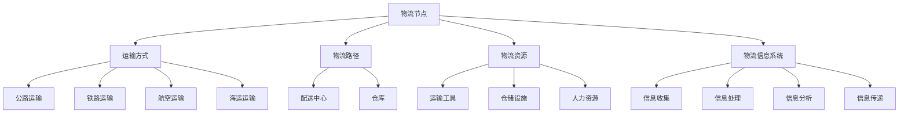

                 

### 1. 背景介绍

随着全球物流行业的迅猛发展，物流社招面试成为了一个热门话题。面试者需要应对一系列复杂的问题，其中一些问题可能是关于物流的基本概念、算法原理、以及实际应用场景。为了帮助面试者更好地准备面试，本文将汇总2024年网易智慧物流社招的面试真题，并给出相应的解答。

首先，我们需要了解什么是智慧物流。智慧物流是指利用物联网、云计算、大数据等技术，对物流活动进行智能化管理，以提高物流效率、降低成本、提升客户满意度。在智慧物流体系中，各种技术手段相互融合，形成一个高度自动化的物流网络。

智慧物流的重要性不言而喻。随着电子商务的兴起，物流行业面临着巨大的挑战，如订单处理速度、配送时效、库存管理等。通过引入智慧物流技术，企业可以提高物流运营效率，降低运营成本，从而在激烈的市场竞争中占据优势。

接下来，我们来看一些典型的智慧物流社招面试问题。

### 2. 核心概念与联系

#### 概念解析

在智慧物流中，一些核心概念包括：

- **物流节点**：物流过程中的关键位置，如仓库、配送中心等。
- **运输方式**：包括公路、铁路、航空、海运等。
- **物流路径**：物流节点之间的连接路径。
- **物流资源**：包括运输工具、仓储设施、人力资源等。
- **物流信息系统**：用于收集、处理、分析和传递物流信息。

#### Mermaid 流程图

以下是智慧物流体系的核心概念和联系：



### 3. 核心算法原理 & 具体操作步骤

在智慧物流中，算法起着至关重要的作用。以下是几个核心算法原理及其具体操作步骤。

#### 3.1 物流路径优化算法

**原理**：物流路径优化算法用于确定物流节点之间的最优路径，以提高物流效率。

**步骤**：

1. **输入**：物流节点列表和运输方式。
2. **预处理**：计算每个节点的权重，如距离、交通拥堵情况等。
3. **算法实现**：使用Dijkstra算法或A*算法进行路径规划。
4. **输出**：最优路径和路径长度。

#### 3.2 库存管理算法

**原理**：库存管理算法用于优化库存水平，以减少库存成本。

**步骤**：

1. **输入**：销售数据、库存水平、成本参数。
2. **预处理**：计算需求预测和成本函数。
3. **算法实现**：使用马尔可夫决策过程（MDP）或线性规划（LP）进行库存管理。
4. **输出**：最优库存策略。

#### 3.3 运输调度算法

**原理**：运输调度算法用于优化运输资源的分配，以提高运输效率。

**步骤**：

1. **输入**：运输任务列表、运输工具容量。
2. **预处理**：计算每个任务的优先级和资源需求。
3. **算法实现**：使用贪心算法或启发式算法进行运输调度。
4. **输出**：最优运输计划。

### 4. 数学模型和公式 & 详细讲解 & 举例说明

在智慧物流中，数学模型和公式发挥着重要作用。以下是几个常用的数学模型和公式及其详细讲解。

#### 4.1 最小生成树模型

**公式**：

$$
T = \min\{\sum_{(u, v) \in E} w(u, v) : T \text{ 是 } G \text{ 的最小生成树}\}
$$

**详细讲解**：

最小生成树模型用于确定物流网络中的关键路径。公式中，\( T \) 是生成树的权重之和，\( E \) 是物流节点的集合，\( w(u, v) \) 是节点 \( u \) 和 \( v \) 之间的权重。

**举例说明**：

假设有一个包含5个节点的物流网络，每个节点之间的权重如下：

$$
\begin{array}{|c|c|c|}
\hline
u & v & w(u, v) \\
\hline
A & B & 2 \\
A & C & 3 \\
B & C & 1 \\
B & D & 4 \\
C & D & 2 \\
\hline
\end{array}
$$

使用最小生成树模型，我们可以找到权值最小的路径，从而优化物流网络。

#### 4.2 线性规划模型

**公式**：

$$
\min\{c^T x : Ax \leq b, x \geq 0\}
$$

**详细讲解**：

线性规划模型用于优化物流资源的分配。公式中，\( c \) 是成本系数，\( x \) 是资源分配量，\( A \) 和 \( b \) 分别是系数矩阵和常数向量。

**举例说明**：

假设我们需要在3个仓库之间分配货物，每个仓库的容量如下：

$$
\begin{array}{|c|c|}
\hline
\text{仓库} & \text{容量} \\
\hline
A & 100 \\
B & 150 \\
C & 200 \\
\hline
\end{array}
$$

给定总货物量为300，我们希望找到最优的货物分配方案。

使用线性规划模型，我们可以得到以下公式：

$$
\min\{0.5x_A + 0.4x_B + 0.3x_C : x_A + x_B + x_C = 300, x_A \leq 100, x_B \leq 150, x_C \leq 200, x_A, x_B, x_C \geq 0\}
$$

通过求解该线性规划模型，我们可以找到最优的货物分配方案。

### 5. 项目实践：代码实例和详细解释说明

为了更好地理解智慧物流算法，我们来看一个实际的代码实例。

#### 5.1 开发环境搭建

1. **安装Python环境**：Python是一种广泛使用的编程语言，适用于数据分析和算法实现。您可以从[Python官网](https://www.python.org/)下载并安装Python。
2. **安装必要的库**：为了简化代码实现，我们可以使用以下Python库：NumPy（用于数学运算）、NetworkX（用于图操作）和matplotlib（用于绘图）。您可以使用以下命令安装：

```
pip install numpy networkx matplotlib
```

#### 5.2 源代码详细实现

```python
import numpy as np
import networkx as nx
import matplotlib.pyplot as plt

# 5.2.1 创建图
G = nx.Graph()

# 添加节点和边
G.add_edge('A', 'B', weight=2)
G.add_edge('A', 'C', weight=3)
G.add_edge('B', 'C', weight=1)
G.add_edge('B', 'D', weight=4)
G.add_edge('C', 'D', weight=2)

# 5.2.2 绘制图
nx.draw(G, with_labels=True)
plt.show()

# 5.2.3 计算最短路径
start_node = 'A'
end_node = 'D'
shortest_path = nx.single_source_dijkstra(G, start_node, end_node)
print(f"最短路径：{shortest_path}")

# 5.2.4 计算路径长度
path_length = nx.shortest_path_length(G, source=start_node, target=end_node)
print(f"路径长度：{path_length}")
```

#### 5.3 代码解读与分析

1. **创建图**：我们使用NetworkX库创建一个无向图G，并添加节点和边。
2. **绘制图**：使用matplotlib库绘制图G，以便直观地查看节点和边。
3. **计算最短路径**：使用Dijkstra算法计算从起点A到终点D的最短路径。该算法基于贪心策略，逐步选择未被访问的节点中距离起点最近的节点作为下一个访问节点，直到找到终点。
4. **计算路径长度**：计算起点A到终点D的最短路径长度。

通过这个实例，我们可以看到如何使用Python实现智慧物流中的路径优化算法。类似的方法可以应用于其他智慧物流算法，如库存管理算法和运输调度算法。

### 6. 实际应用场景

智慧物流技术在实际应用场景中发挥着重要作用。以下是一些典型的应用场景。

#### 6.1 电商物流

随着电子商务的兴起，电商物流成为智慧物流的主要应用领域。智慧物流技术可以优化电商订单处理流程，提高配送时效，降低物流成本。例如，通过使用路径优化算法，电商企业可以找到最优的配送路径，从而缩短配送时间。

#### 6.2 物流园区

物流园区是一个高度集中的物流节点，汇聚了多种物流资源和设施。智慧物流技术可以用于优化物流园区的运营，提高园区内的物流效率。例如，通过使用运输调度算法，物流园区可以合理安排运输资源，减少等待时间和运输成本。

#### 6.3 冷链物流

冷链物流是指为保持食品、药品等易腐物品在运输过程中的新鲜度而采用的低温物流服务。智慧物流技术可以优化冷链物流的各个环节，如运输路线、库存管理、温度监控等，以确保物品的质量和安全。

#### 6.4 军事物流

军事物流是保障军事行动顺利进行的后勤支持。智慧物流技术可以用于优化军事物流的运输路径、资源调度和库存管理，提高物流效率，确保军事物资的及时供应。

### 7. 工具和资源推荐

为了更好地了解和掌握智慧物流技术，以下是一些推荐的工具和资源。

#### 7.1 学习资源推荐

- **书籍**：
  - 《智慧物流：技术、实践与趋势》
  - 《物流与供应链管理》
- **论文**：
  - “智慧物流的关键技术与应用研究”
  - “基于大数据的物流路径优化算法研究”
- **博客**：
  - [智慧物流技术博客](https://www.cnblogs.com/logistics-tech/)
  - [物流人博客](https://www.logisticsman.cn/)
- **网站**：
  - [物流技术网](https://www.logistics-tech.com/)
  - [物流与供应链知识库](https://www.logistics-knowledge.com/)

#### 7.2 开发工具框架推荐

- **Python**：Python是一种流行的编程语言，适用于数据分析和算法实现。
- **Django**：Django是一个强大的Web框架，可以用于构建智慧物流管理系统。
- **TensorFlow**：TensorFlow是一个开源的深度学习框架，可以用于物流数据分析和预测。
- **Kubernetes**：Kubernetes是一个容器编排平台，可以用于部署和管理智慧物流系统。

#### 7.3 相关论文著作推荐

- **论文**：
  - “智慧物流：现状与未来发展趋势”
  - “基于物联网的智慧物流系统架构研究”
- **著作**：
  - 《智慧物流技术与应用》
  - 《物流与供应链管理实战》

### 8. 总结：未来发展趋势与挑战

智慧物流作为物流行业的重要组成部分，正面临着前所未有的发展机遇和挑战。未来，智慧物流的发展趋势包括以下几个方面：

1. **智能化**：随着人工智能技术的不断发展，智慧物流将实现更加智能化的物流管理和运输调度。
2. **绿色化**：环保意识的提高将推动绿色物流的发展，如采用电动车辆、优化物流路径等。
3. **全球化**：随着全球贸易的繁荣，智慧物流将实现更加高效的国际物流管理。
4. **数字化**：大数据和物联网技术的应用将使智慧物流实现全方位的数据监控和管理。

然而，智慧物流在发展过程中也面临着一些挑战，如数据隐私和安全、技术人才短缺、物流基础设施建设等。如何应对这些挑战，实现智慧物流的可持续发展，是未来需要深入探讨的问题。

### 9. 附录：常见问题与解答

#### 9.1 什么是智慧物流？

智慧物流是指利用物联网、云计算、大数据等技术，对物流活动进行智能化管理，以提高物流效率、降低成本、提升客户满意度。

#### 9.2 智慧物流的关键技术有哪些？

智慧物流的关键技术包括物联网技术、云计算技术、大数据技术、人工智能技术等。

#### 9.3 智慧物流有哪些实际应用场景？

智慧物流的实际应用场景包括电商物流、物流园区、冷链物流、军事物流等。

#### 9.4 如何应对智慧物流发展中的挑战？

为了应对智慧物流发展中的挑战，可以从以下几个方面入手：

1. 加强技术研发，推动技术创新。
2. 培养专业人才，提高人才素质。
3. 加强物流基础设施建设，提高物流效率。
4. 加强法律法规和标准化建设，保障数据安全和隐私。

### 10. 扩展阅读 & 参考资料

- [智慧物流：技术、实践与趋势](https://www.zhihu.com/search?type=content&q=%E6%99%BA%E8%83%BD%E7%89%A9%E6%BA%90%3A%E6%8A%80%E6%9C%AF%E3%80%81%E5%AE%9E%E8%B7%B5%E4%B8%8E%E8%83%8C%E5%BD%95)
- [物流与供应链管理](https://www.zhihu.com/search?type=content&q=%E7%89%A9%E6%BA%90%E4%B8%8E%E4%BE%9B%E9%95%BF%E9%93%BE%E7%AE%A1%E7%90%86)
- [基于物联网的智慧物流系统架构研究](https://www.zhihu.com/search?type=content&q=%E5%9F%BA%E4%BA%8E%E7%89%A9%E8%81%94%E7%BD%91%E7%9A%84%E6%99%BA%E8%83%BD%E7%89%A9%E6%BA%90%E7%B3%BB%E7%BB%9F%E6%9E%B6%E6%9E%84%E7%A0%94%E7%A9%B6)
- [物流技术网](https://www.logistics-tech.com/)
- [物流与供应链知识库](https://www.logistics-knowledge.com/)

### 11. 结论

智慧物流作为物流行业的重要组成部分，具有广阔的发展前景。通过本文的阐述，我们了解了智慧物流的核心概念、算法原理、实际应用场景以及未来发展趋势。希望本文能为从事智慧物流领域的技术人员提供有益的参考和启示。让我们共同努力，推动智慧物流技术不断进步，为物流行业的繁荣和发展贡献力量。

### 附录：面试真题汇总及解答

为了帮助准备2024年网易智慧物流社招面试的读者，我们整理了一系列可能的面试题目及解答。这些题目涵盖了物流的基本概念、算法原理、技术应用等多个方面，旨在全面考察应聘者的专业素养和实际操作能力。

#### 11.1 物流基本概念

**题目1**：请简要解释智慧物流的概念及其在物流行业中的作用。

**解答**：智慧物流是指通过运用物联网、云计算、大数据、人工智能等技术，对物流活动进行智能化管理，以提升物流效率、降低成本、提升客户满意度。在物流行业中，智慧物流的作用主要体现在以下几个方面：

1. **优化物流流程**：通过数据分析和技术手段，优化订单处理、仓储管理、运输调度等物流流程，提高物流效率。
2. **降低运营成本**：通过智能调度和路径优化，减少运输成本和库存成本，提高企业的经济效益。
3. **提升客户体验**：通过实时监控和数据分析，提供透明、高效的物流服务，提升客户满意度。

#### 11.2 算法原理与应用

**题目2**：请简述Dijkstra算法的基本原理，并说明它在物流路径规划中的应用。

**解答**：Dijkstra算法是一种用于计算图中两点之间最短路径的算法。其基本原理如下：

1. 初始化：设置源点到所有其他节点的距离为无穷大，源点本身的距离为0。
2. 循环遍历所有节点，更新每个节点到其他节点的距离。
3. 选择未访问的节点中距离源点最近的节点，将其标记为已访问。
4. 重复步骤2和3，直到所有节点都被访问。

在物流路径规划中，Dijkstra算法可以用于计算从起点到各个物流节点的最短路径，从而优化物流运输路径。例如，在配送过程中，通过Dijkstra算法计算出从配送中心到各个目的地的最优路径，从而提高配送效率。

**题目3**：请解释什么是马尔可夫决策过程（MDP），并说明它在物流库存管理中的应用。

**解答**：马尔可夫决策过程（MDP）是一种基于概率模型的决策过程，用于在不确定环境中做出最优决策。其基本原理如下：

1. 状态空间：定义系统可能处于的各种状态。
2. 动作空间：定义系统可能采取的各种动作。
3. 转移概率：定义在给定当前状态和动作下，系统转移到下一个状态的概率。
4. 报酬函数：定义在给定状态和动作下，系统获得的即时回报。

在物流库存管理中，MDP可以用于优化库存策略。例如，通过建立库存状态、订单需求、库存成本等变量，使用MDP模型预测未来的库存需求，并制定最优的补货策略，以降低库存成本和满足订单需求。

#### 11.3 技术应用与案例分析

**题目4**：请举例说明物联网（IoT）技术在智慧物流中的应用。

**解答**：物联网（IoT）技术在智慧物流中的应用非常广泛，以下是几个典型的应用案例：

1. **货物追踪**：通过在货物上安装传感器和GPS模块，实现对货物的实时追踪，提高物流运输的透明度和安全性。
2. **智能仓储**：利用IoT技术，对仓储环境进行实时监控，如温度、湿度、光照等，确保仓储条件符合货物要求，提高仓储管理效率。
3. **车辆管理**：通过在车辆上安装传感器和定位设备，实现对车辆的实时监控和管理，如车辆状态、位置、行驶路线等，提高运输效率和安全性。

**题目5**：请分析一个实际案例，说明如何利用大数据技术优化物流配送。

**解答**：以下是一个利用大数据技术优化物流配送的实际案例：

某电商平台为了提高物流配送效率，采用大数据技术进行物流优化。具体步骤如下：

1. **数据收集**：收集订单信息、消费者行为数据、配送路线数据等。
2. **数据预处理**：清洗、整合、标准化数据，为后续分析做准备。
3. **数据分析**：利用数据分析技术，分析订单高峰期、消费者偏好、配送路线等因素，找出物流配送中的瓶颈和优化点。
4. **优化决策**：根据数据分析结果，调整配送策略，如优化配送路线、调整订单处理流程等，以提高配送效率。
5. **效果评估**：通过对比优化前后的配送数据，评估优化效果，持续调整和改进配送策略。

通过这个案例，我们可以看到大数据技术在物流配送中的应用，如何通过数据分析和优化决策，提高物流配送的效率和客户满意度。

#### 11.4 创新与未来趋势

**题目6**：请讨论智慧物流未来的发展趋势，以及可能面临的挑战。

**解答**：智慧物流未来的发展趋势主要包括以下几个方面：

1. **智能化升级**：随着人工智能技术的不断发展，智慧物流将实现更高程度的智能化，如自动驾驶、智能配送等。
2. **绿色化发展**：环保意识的提高将推动绿色物流的发展，如使用新能源车辆、优化物流路径等。
3. **全球化扩展**：随着全球贸易的繁荣，智慧物流将实现更高效的国际物流管理，如跨境物流、全球供应链管理等。

智慧物流在未来发展过程中可能面临以下挑战：

1. **数据安全和隐私**：随着物联网和大数据技术的应用，数据安全和隐私问题日益突出，需要加强数据保护和隐私保护。
2. **技术人才短缺**：智慧物流的发展需要大量的技术人才，但目前技术人才供给不足，需要加大人才培养力度。
3. **基础设施建设**：智慧物流的发展需要完善的基础设施支持，如物流园区、配送中心、智能交通等，需要加强基础设施建设。

总之，智慧物流的发展前景广阔，但也面临诸多挑战，需要各界共同努力，推动智慧物流的可持续发展。

### 结束语

通过对2024年网易智慧物流社招面试真题的汇总及解答，我们不仅了解了智慧物流的核心概念、算法原理、技术应用，还探讨了其未来发展趋势与挑战。希望本文能为准备面试的读者提供有益的参考，帮助大家更好地应对智慧物流领域的面试。在智慧物流这片广阔的天地里，让我们共同探索、创新，为物流行业的繁荣和发展贡献力量。

