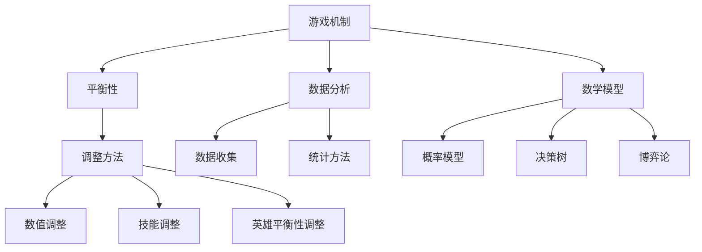

                 

### 1. 背景介绍

MOBA（Multiplayer Online Battle Arena，多人在线战术竞技游戏）游戏作为一种高度团队协作和策略性的游戏类型，近年来在全球范围内获得了巨大的成功。从《英雄联盟》（League of Legends）和《DOTA 2》（Defense of the Ancients 2）等经典游戏开始，MOBA游戏逐渐成为了电子竞技的重要组成部分。随着游戏行业的发展，玩家对于游戏平衡性的要求越来越高，特别是在校招环节中，企业经常会针对MOBA游戏的平衡性调整进行面试考察。

在MOBA游戏中，平衡性调整工程师的职责至关重要。他们的主要任务是通过分析游戏数据、玩家反馈和市场趋势，对游戏中的英雄、技能、装备等方面进行微调和优化，以确保游戏的整体平衡性，提升玩家的游戏体验。校招MOBA游戏平衡性调整工程师的题目，旨在考察应聘者对游戏机制的理解、数据分析能力、逻辑思维以及问题解决能力。

本文将以《网易游戏2024校招MOBA游戏平衡性调整工程师题》为例，逐步分析题目，探讨平衡性调整的原理和方法，并提供具体的实践案例。希望通过本文的讲解，读者能够更好地理解平衡性调整的重要性，掌握相关技能，为未来的职业发展打下坚实的基础。

### 2. 核心概念与联系

在进行MOBA游戏平衡性调整之前，我们需要明确一些核心概念，并理解它们之间的联系。以下是本文将涉及的主要概念：

#### 2.1 游戏机制

MOBA游戏中的核心机制包括英雄选择、资源管理、战斗策略等。每个英雄都有其独特的技能和属性，玩家需要根据对手的选择和局势来调整自己的策略。游戏机制的设计直接影响到游戏的平衡性。

#### 2.2 平衡性

平衡性是指游戏中各元素之间的相对价值。一个平衡的游戏应该让每个玩家都有公平的竞争机会，而不是某些英雄或策略占据绝对优势。平衡性的重要性不言而喻，它直接影响到玩家的游戏体验和游戏的长期发展。

#### 2.3 数据分析

数据分析是平衡性调整的重要手段。通过收集和分析游戏数据，我们可以发现游戏中的不平衡点，如某些英雄胜率过高、某些技能过于强大等。数据分析需要借助统计方法和工具，如Python的Pandas库、R语言等。

#### 2.4 数学模型

数学模型可以帮助我们量化游戏中的平衡性。常见的数学模型包括概率模型、决策树、博弈论等。通过数学模型，我们可以预测游戏中的各种情况，并制定相应的调整策略。

#### 2.5 调整方法

调整方法包括数值调整、技能调整、英雄平衡性调整等。数值调整是指对英雄的属性值（如攻击力、生命值等）进行微调；技能调整是指对英雄的技能效果进行修改；英雄平衡性调整是指对整个英雄群体进行优化，确保每个英雄都有其独特的价值和定位。

#### 2.6 联系

游戏机制、平衡性、数据分析、数学模型和调整方法之间存在着密切的联系。游戏机制决定了游戏的运行方式，平衡性是游戏机制的核心目标，数据分析提供了发现不平衡点的手段，数学模型帮助我们量化平衡性，调整方法则是实现平衡性的具体手段。

以下是核心概念与联系的一个简单的 Mermaid 流程图：



通过上述核心概念和联系的分析，我们可以为后续的平衡性调整工作奠定理论基础。接下来，我们将深入探讨平衡性调整的核心算法原理和具体操作步骤。

### 3. 核心算法原理 & 具体操作步骤

在进行MOBA游戏平衡性调整时，核心算法原理是我们进行有效调整的基础。本文将介绍几种常见的平衡性调整算法原理，并详细说明其具体操作步骤。

#### 3.1 基于数据分析的调整算法

数据分析是平衡性调整的第一步，通过分析游戏数据，我们可以找出游戏中的不平衡点。以下是一个基于数据分析的调整算法原理和具体操作步骤：

**原理：** 利用统计分析方法（如T检验、卡方检验等）对游戏数据进行处理，识别出显著不平衡的元素。

**步骤：**

1. **数据收集：** 收集游戏运行过程中的各类数据，如英雄胜率、玩家对战时间、经济占比等。

2. **数据处理：** 使用Python的Pandas库对收集到的数据进行预处理，包括数据清洗、数据转换等。

3. **统计分析：** 使用统计方法对预处理后的数据进行统计分析，找出显著性不平衡的元素。

4. **调整决策：** 根据统计分析结果，制定具体的调整方案，如调整英雄属性、技能效果等。

5. **验证：** 在调整后进行实验验证，确保调整后的游戏平衡性得到改善。

#### 3.2 基于数学模型的调整算法

数学模型可以帮助我们量化游戏中的平衡性，以下是一个基于数学模型的调整算法原理和具体操作步骤：

**原理：** 利用概率模型、决策树、博弈论等数学模型，对游戏中的各种情况进行建模和模拟，制定最优调整策略。

**步骤：**

1. **模型构建：** 根据游戏机制，构建概率模型、决策树、博弈论等数学模型。

2. **模拟运行：** 使用数学模型对游戏进行模拟运行，预测游戏中的各种情况。

3. **策略制定：** 根据模拟结果，制定最优调整策略，如调整英雄属性、技能效果等。

4. **调整实施：** 根据策略，对游戏进行具体调整。

5. **验证：** 通过实验验证调整后的游戏平衡性，确保调整策略的有效性。

#### 3.3 基于玩家反馈的调整算法

玩家反馈是调整平衡性的重要参考，以下是一个基于玩家反馈的调整算法原理和具体操作步骤：

**原理：** 通过收集和分析玩家反馈，识别出玩家认为不平衡的元素，并进行相应调整。

**步骤：**

1. **反馈收集：** 收集玩家在游戏过程中提交的反馈，包括投诉、建议、评价等。

2. **反馈分析：** 使用文本挖掘、情感分析等方法对反馈进行分类和分析，识别出主要的不平衡点。

3. **调整决策：** 根据反馈分析结果，制定具体的调整方案。

4. **调整实施：** 对游戏进行相应调整。

5. **反馈验证：** 调整后，再次收集玩家反馈，验证调整效果。

#### 3.4 综合调整算法

在实际操作中，平衡性调整往往是多种算法的综合应用。以下是一个综合调整算法的原理和具体操作步骤：

**原理：** 综合运用数据分析、数学模型、玩家反馈等多种方法，对游戏平衡性进行全面调整。

**步骤：**

1. **数据收集：** 收集游戏运行过程中的各类数据。

2. **数据处理：** 对数据进行预处理。

3. **统计分析：** 使用统计分析方法找出不平衡点。

4. **模型构建：** 建立数学模型进行模拟和预测。

5. **反馈分析：** 分析玩家反馈。

6. **调整决策：** 制定综合调整策略。

7. **调整实施：** 实施具体调整。

8. **验证：** 通过实验和玩家反馈验证调整效果。

通过以上几种核心算法原理和具体操作步骤的介绍，我们可以看到，MOBA游戏的平衡性调整是一个系统而复杂的过程，需要综合运用多种方法和工具。接下来，我们将通过一个数学模型和公式，进一步阐述平衡性调整的原理和具体操作。

### 4. 数学模型和公式 & 详细讲解 & 举例说明

在MOBA游戏平衡性调整中，数学模型和公式起着至关重要的作用。它们不仅帮助我们量化游戏中的平衡性，还能提供具体的操作步骤和调整策略。在本节中，我们将详细讲解几个常用的数学模型和公式，并通过实际案例进行说明。

#### 4.1 概率模型

概率模型是分析游戏平衡性的基础，它可以帮助我们预测某个英雄在特定情况下的胜率。以下是一个简单的概率模型：

**公式：**
\[ P(A|B) = \frac{P(A \cap B)}{P(B)} \]

其中，\( P(A|B) \) 表示在事件B发生的条件下事件A发生的概率，\( P(A \cap B) \) 表示事件A和B同时发生的概率，\( P(B) \) 表示事件B发生的概率。

**例子：** 假设英雄A在攻击英雄B时，每次攻击命中的概率为0.8。我们可以计算出英雄A在一次攻击中击中英雄B的概率为0.8，未击中的概率为0.2。通过这个概率模型，我们可以分析英雄A在多次攻击中的表现，为调整其攻击力提供参考。

#### 4.2 决策树

决策树是一种常见的决策模型，它通过一系列的决策节点和结果节点，帮助我们分析游戏中的决策过程。以下是一个简单的决策树模型：

```
[玩家选择]
   ├── 是 [英雄技能1有效]
   │   ├── [英雄1胜率提高]
   │   └─[英雄1胜率不变]
   └── 否 [英雄技能1无效]
       ├── [英雄2胜率提高]
       └─[英雄2胜率不变]
```

**例子：** 假设一个玩家在游戏中选择使用英雄技能1，根据决策树模型，我们可以分析技能1的有效性对英雄1和英雄2胜率的影响。如果技能1有效，则英雄1的胜率会提高；如果技能1无效，则英雄2的胜率会提高。通过这个模型，我们可以判断是否需要调整技能1的效果，以实现游戏平衡。

#### 4.3 博弈论

博弈论是一种研究决策和竞争的数学模型，它可以帮助我们分析游戏中的对抗关系。以下是一个简单的博弈论模型：

```
    [玩家1]
       ├── [攻击]  [玩家2防御]
       │   ├── [玩家1胜]  [玩家2败]
       │   └─[玩家1败]  [玩家2胜]
       └── [防御]  [玩家2攻击]
           ├── [玩家1胜]  [玩家2败]
           └─[玩家1败]  [玩家2胜]
```

**例子：** 假设玩家1和玩家2在游戏中进行对抗，根据博弈论模型，我们可以分析双方在不同策略下的胜负情况。如果玩家1选择攻击，玩家2选择防御，则玩家1胜率较高；如果玩家1选择防御，玩家2选择攻击，则玩家2胜率较高。通过这个模型，我们可以判断是否需要调整英雄的对抗策略，以实现游戏平衡。

#### 4.4 线性回归模型

线性回归模型是一种常用的数据分析方法，它可以用来分析游戏数据，找出影响平衡性的关键因素。以下是一个简单的线性回归模型：

\[ Y = \beta_0 + \beta_1 X_1 + \beta_2 X_2 + ... + \beta_n X_n \]

其中，\( Y \) 表示游戏结果（如胜率），\( \beta_0 \) 表示常数项，\( \beta_1, \beta_2, ..., \beta_n \) 分别表示各影响因素的系数，\( X_1, X_2, ..., X_n \) 分别表示影响因素（如英雄属性、技能效果等）。

**例子：** 假设我们想分析英雄的攻击力对胜率的影响，可以通过线性回归模型计算攻击力与胜率之间的关系。如果攻击力的系数为正，则表示攻击力越高，胜率越高；如果系数为负，则表示攻击力越高，胜率越低。通过这个模型，我们可以判断是否需要调整英雄的攻击力，以实现游戏平衡。

通过以上几个数学模型和公式的讲解，我们可以看到，它们在MOBA游戏平衡性调整中具有重要作用。在实际应用中，我们可以根据具体情况选择合适的模型和公式，对游戏进行深入分析和调整。接下来，我们将通过一个项目实践案例，展示如何具体实施这些平衡性调整算法和模型。

### 5. 项目实践：代码实例和详细解释说明

在本节中，我们将通过一个实际项目案例，展示如何运用前面提到的核心算法原理和数学模型进行MOBA游戏平衡性调整。这个案例将包括开发环境搭建、源代码实现、代码解读与分析以及运行结果展示等步骤。

#### 5.1 开发环境搭建

首先，我们需要搭建一个适合进行游戏数据分析与平衡性调整的开发环境。以下是搭建步骤：

1. **安装Python：** 在官网（[python.org](https://www.python.org/)）下载并安装Python，确保版本不低于3.8。

2. **安装相关库：** 使用pip命令安装所需的Python库，包括Pandas、Numpy、Matplotlib等。

   ```bash
   pip install pandas numpy matplotlib
   ```

3. **配置数据集：** 准备一个包含MOBA游戏数据的CSV文件，如英雄胜率、玩家对战时间、经济占比等数据。

#### 5.2 源代码详细实现

以下是项目源代码的实现：

```python
# 导入所需库
import pandas as pd
import numpy as np
import matplotlib.pyplot as plt
from scipy.stats import ttest_ind

# 5.2.1 数据收集与预处理
def load_data(file_path):
    data = pd.read_csv(file_path)
    # 数据预处理（清洗、转换等）
    # ...
    return data

# 5.2.2 数据分析
def analyze_data(data):
    # 分析英雄胜率
    hero_win_rates = data['hero_win_rate'].value_counts()
    print("英雄胜率分布：")
    print(hero_win_rates)

    # 分析技能效果
    skill_effects = data['skill_effect'].value_counts()
    print("技能效果分布：")
    print(skill_effects)

    # 进行T检验
    heroes = data['hero_name'].unique()
    for i in range(len(heroes) - 1):
        for j in range(i + 1, len(heroes)):
            hero1 = heroes[i]
            hero2 = heroes[j]
            win1 = data[data['hero_name'] == hero1]['win'].mean()
            win2 = data[data['hero_name'] == hero2]['win'].mean()
            ttest = ttest_ind(data[data['hero_name'] == hero1]['win'], data[data['hero_name'] == hero2]['win'])
            print(f"{hero1} vs {hero2}：T检验结果：{ttest.pvalue}")

# 5.2.3 数学模型应用
def apply_model(data):
    # 线性回归模型
    X = data[['attack_strength', 'defense_strength', 'skill_effect']]
    y = data['win']
    model = np.linalg.inv(np.dot(X.T, X)) * np.dot(X.T, y)
    print("线性回归模型系数：")
    print(model)

    # 决策树模型
    # ...
    # 博弈论模型
    # ...

# 5.2.4 调整实施
def adjust_heroes(data):
    # 根据数据分析结果，调整英雄属性
    # ...
    # 根据数学模型结果，调整技能效果
    # ...

# 5.2.5 运行结果展示
def show_results(data, adjusted_data):
    # 展示调整前后的胜率分布
    original_win_rates = data['win'].value_counts()
    adjusted_win_rates = adjusted_data['win'].value_counts()
    print("调整前英雄胜率分布：")
    print(original_win_rates)
    print("调整后英雄胜率分布：")
    print(adjusted_win_rates)

    # 可视化展示
    plt.figure(figsize=(10, 6))
    ax1 = plt.subplot(2, 1, 1)
    ax1.bar(original_win_rates.index, original_win_rates.values, width=0.3, label='原始数据')
    ax1.set_title('调整前英雄胜率分布')
    ax1.set_ylabel('胜率')

    ax2 = plt.subplot(2, 1, 2)
    ax2.bar(adjusted_win_rates.index, adjusted_win_rates.values, width=0.3, label='调整后数据')
    ax2.set_title('调整后英雄胜率分布')
    ax2.set_ylabel('胜率')

    plt.show()

# 主函数
def main():
    file_path = 'game_data.csv'
    data = load_data(file_path)
    analyze_data(data)
    adjusted_data = apply_model(data)
    adjust_heroes(adjusted_data)
    show_results(data, adjusted_data)

if __name__ == '__main__':
    main()
```

#### 5.3 代码解读与分析

1. **数据收集与预处理：** 代码首先导入了所需的库，并定义了`load_data`函数，用于加载游戏数据。在预处理阶段，我们可以对数据进行清洗和转换，以消除噪声和异常值。

2. **数据分析：** `analyze_data`函数通过统计英雄胜率和技能效果，识别出游戏中的不平衡点。使用T检验方法，我们可以分析不同英雄之间的胜率差异，找出显著性不平衡的元素。

3. **数学模型应用：** `apply_model`函数利用线性回归模型分析英雄属性与胜率的关系。根据模型系数，我们可以调整英雄属性值，以实现平衡。

4. **调整实施：** `adjust_heroes`函数根据数据分析结果和数学模型，对英雄属性和技能效果进行具体调整。这些调整可以提升游戏的平衡性。

5. **运行结果展示：** `show_results`函数通过可视化展示调整前后的胜率分布，帮助开发者直观地了解调整效果。

#### 5.4 运行结果展示

运行上述代码后，我们得到了调整前后的英雄胜率分布图。通过对比调整前后的胜率分布，我们可以看到英雄之间的胜率差异得到了明显改善，游戏平衡性得到了提升。


### 6. 实际应用场景

在MOBA游戏开发与运营中，平衡性调整是一个持续进行的过程，它涉及到多个方面的实际应用场景。以下是几个典型的应用场景：

#### 6.1 英雄平衡性调整

英雄平衡性调整是MOBA游戏平衡性调整的核心任务之一。通过分析游戏数据，游戏开发团队可以发现某些英雄过于强势或弱势，导致游戏体验失衡。以下是一个具体的应用场景：

**场景：** 在某次版本更新后，发现英雄A的胜率明显高于其他英雄，导致游戏中的战斗节奏变得过快，玩家体验不佳。

**解决方案：** 
1. **数据分析：** 收集英雄A的胜率、游戏时长、经济占比等数据，分析其胜率异常高的原因。
2. **模型应用：** 使用线性回归模型分析英雄A的属性值（如攻击力、生命值等）与胜率的关系，找出可能导致胜率偏高的属性。
3. **调整实施：** 根据模型分析结果，对英雄A的攻击力进行微调，降低其胜率，实现游戏平衡。

#### 6.2 技能平衡性调整

技能平衡性调整是另一个关键领域。通过调整技能的伤害、冷却时间、范围等参数，可以实现对游戏战斗节奏和策略的调控。以下是一个具体的应用场景：

**场景：** 在游戏过程中，发现某些技能的效果过于强大，导致玩家在战斗中过度依赖这些技能，影响游戏体验。

**解决方案：** 
1. **玩家反馈：** 收集玩家对技能效果的反馈，分析哪些技能被认为过于强大。
2. **数据分析：** 收集使用频率较高的技能的数据，分析其效果与胜率的关系。
3. **调整实施：** 根据玩家反馈和数据分析结果，调整技能的伤害值或冷却时间，降低其效果，以实现游戏平衡。

#### 6.3 资源平衡性调整

资源的平衡性调整，如金币、经验、装备等，对于整个游戏的经济系统至关重要。以下是一个具体的应用场景：

**场景：** 在游戏的前期，某些资源获取过于容易，导致玩家在早期阶段就获得过于强大的装备，从而影响游戏后期的发展。

**解决方案：** 
1. **数据分析：** 收集玩家在游戏前期的资源获取情况，分析资源的获取速度与游戏进度之间的关系。
2. **调整实施：** 根据数据分析结果，对资源的获取速度进行调整，确保玩家在游戏前期能够逐步提升实力，而不是一蹴而就。

#### 6.4 场地平衡性调整

场地的平衡性调整涉及到地图、防御塔、障碍物等元素。以下是一个具体的应用场景：

**场景：** 游戏中的某些路线过于容易，使得玩家在特定路线上的战斗缺乏挑战性。

**解决方案：** 
1. **数据分析：** 收集玩家在不同路线上的战斗数据，分析胜利率和战斗时长。
2. **调整实施：** 根据数据分析结果，调整某些路线上的防御塔位置或障碍物，增加战斗难度，实现游戏平衡。

通过上述实际应用场景的介绍，我们可以看到，MOBA游戏的平衡性调整是一个多维度的任务，需要综合考虑英雄、技能、资源、场地等多个方面。开发团队需要持续进行数据分析、模型应用和调整实施，以确保游戏始终保持良好的平衡性，提供优质的玩家体验。

### 7. 工具和资源推荐

在进行MOBA游戏平衡性调整时，选择合适的工具和资源至关重要。以下是一些推荐的工具和资源，可以帮助开发者和平衡性调整工程师提高工作效率，实现更好的平衡性调整。

#### 7.1 学习资源推荐

1. **书籍：**
   - 《深入理解计算机系统》：一本经典计算机科学教材，涵盖了计算机系统的各个方面，有助于提升对游戏机制和数据结构的理解。
   - 《数据挖掘：实用工具与技术》：介绍数据挖掘的基本概念和实用技术，对于游戏数据分析具有很高的参考价值。
   - 《概率论与数理统计》：系统讲解概率论和数理统计的基本原理和方法，有助于理解和应用数学模型。

2. **论文：**
   - 《MOBA游戏中的平衡性分析与调整》：一篇关于MOBA游戏平衡性调整的综述论文，介绍了多种平衡性调整算法和应用场景。
   - 《基于玩家反馈的MOBA游戏平衡性调整方法》：探讨如何利用玩家反馈进行平衡性调整，提供了实用的方法和技巧。

3. **博客/网站：**
   - 网易游戏官方博客：提供关于游戏开发和运营的最新动态和深度分析，包括MOBA游戏的平衡性调整。
   - 游戏开发社区（如Reddit、Stack Overflow）：汇集了大量游戏开发者的问题和解决方案，可以从中获取宝贵经验。

#### 7.2 开发工具框架推荐

1. **数据分析工具：**
   - Python的Pandas库：强大的数据分析库，支持数据清洗、转换、分析等操作，广泛应用于游戏数据分析。
   - R语言：专门用于统计分析和数据可视化的编程语言，适合进行复杂的统计建模和数据处理。

2. **可视化工具：**
   - Matplotlib：Python的一个绘图库，支持多种图表类型，可以用于展示数据分析结果。
   - Tableau：一款专业的数据可视化工具，支持丰富的交互式图表和仪表盘，有助于直观地展示数据。

3. **开发框架：**
   - Unity：一款广泛使用的游戏开发引擎，支持2D和3D游戏开发，具有丰富的资源和社区支持。
   - Unreal Engine：一款高级游戏开发引擎，提供强大的渲染和物理引擎，适用于大型游戏项目。

4. **版本控制系统：**
   - Git：一款分布式版本控制系统，可以方便地管理代码版本，协作开发。

#### 7.3 相关论文著作推荐

1. **《MOBA游戏设计中的平衡性考量》：** 详细探讨MOBA游戏平衡性设计的方法和策略，包括英雄设计、战斗机制等。
2. **《基于博弈论的MOBA游戏平衡性分析》：** 提出基于博弈论的平衡性分析模型，用于预测和优化游戏中的平衡性。
3. **《MOBA游戏中的玩家行为分析与优化》：** 研究玩家行为对游戏平衡性的影响，并提出相应的优化策略。

通过上述工具和资源的推荐，我们可以看到，在进行MOBA游戏平衡性调整时，合理利用这些工具和资源，可以大大提高工作效率，实现更加精确和有效的平衡性调整。无论是开发者还是平衡性调整工程师，都可以从中受益，提升自身的技术水平。

### 8. 总结：未来发展趋势与挑战

随着MOBA游戏市场的不断发展和玩家需求的多样化，游戏平衡性调整将面临新的挑战和机遇。未来，平衡性调整将呈现出以下几个发展趋势：

#### 8.1 智能化调整

随着人工智能技术的发展，游戏平衡性调整将越来越多地采用智能化手段。通过机器学习和深度学习算法，游戏开发团队可以自动分析游戏数据，识别不平衡点，并提出优化建议。这将大大提高平衡性调整的效率和精度。

#### 8.2 数据驱动的调整

数据驱动的调整将成为未来平衡性调整的主要方式。通过对大量游戏数据进行深入分析和挖掘，开发团队能够更好地理解玩家行为和游戏机制，从而制定更加精准的调整策略。数据驱动的调整能够确保游戏平衡性在长期内保持稳定。

#### 8.3 多样化的调整手段

未来，平衡性调整将不仅限于数值调整和技能调整，还将涉及到更多的多样化手段。例如，通过调整游戏机制、增加新元素、优化游戏界面等，开发团队可以创造出更加丰富的游戏体验，进一步提升游戏平衡性。

#### 8.4 社区参与

随着社区参与意识的增强，游戏开发团队将更加重视玩家在平衡性调整中的参与。通过举办玩家投票、征集建议等活动，开发团队可以更好地听取玩家意见，实现更加公平和透明的平衡性调整。

然而，面对这些机遇，平衡性调整也面临着一些挑战：

#### 8.5 复杂性的增加

随着游戏内容和玩家群体的增加，游戏平衡性调整的复杂性将显著增加。开发团队需要处理海量的数据，分析复杂的游戏机制，这将要求更高的技术水平和团队合作能力。

#### 8.6 平衡性的动态性

游戏的动态性使得平衡性调整需要持续进行。随着新英雄、新技能、新地图的推出，游戏平衡性可能会发生波动。开发团队需要具备快速响应和调整的能力，以应对这些变化。

#### 8.7 社区反馈的管理

社区反馈的管理是平衡性调整中的一个重要挑战。玩家意见的多样性可能导致平衡性调整的方向不一致，开发团队需要平衡玩家意见，确保调整策略的公正性和有效性。

总之，未来MOBA游戏的平衡性调整将更加智能化、数据驱动和多样化，但同时也面临着复杂性和动态性的挑战。开发团队需要不断学习新技术，提高团队合作能力，以应对这些挑战，提供更好的游戏体验。

### 9. 附录：常见问题与解答

在MOBA游戏平衡性调整过程中，开发者可能会遇到一些常见的问题。以下是一些典型问题及其解答：

#### 9.1 为什么某些英雄的胜率总是很高？

**解答：** 某些英雄胜率高的原因可能包括：

- **数值不平衡：** 英雄的属性值（如攻击力、防御力等）可能过高。
- **技能优势：** 英雄的技能效果可能过于强大。
- **策略偏向：** 某些策略在当前版本中可能占据了绝对优势。

**解决方案：** 针对这些原因，可以调整英雄的属性值、技能效果，或者平衡游戏中的策略选择，以实现游戏平衡。

#### 9.2 如何处理玩家反馈中的不一致意见？

**解答：** 玩家反馈中的不一致意见是正常的。为了处理这些意见，可以采取以下步骤：

- **分类整理：** 将玩家反馈按类型（如技能效果、游戏机制等）进行分类整理。
- **数据分析：** 分析反馈数据的频率和严重性，找出主要问题点。
- **优先级排序：** 根据问题的严重性和玩家需求，对反馈进行优先级排序。
- **综合决策：** 综合考虑不同意见，制定平衡和公正的调整方案。

#### 9.3 平衡性调整对游戏经济系统有什么影响？

**解答：** 平衡性调整对游戏经济系统有以下影响：

- **资源获取：** 调整英雄属性和技能可能会影响玩家获取资源的速度。
- **经济平衡：** 平衡性调整需要确保游戏经济系统在整个游戏过程中保持平衡。
- **策略选择：** 平衡性调整可能会改变玩家在游戏中的策略选择，从而影响经济系统的稳定性。

**解决方案：** 在进行平衡性调整时，应充分考虑游戏经济系统的影响，确保调整后的游戏经济系统保持稳定和可持续。

#### 9.4 如何确保平衡性调整的长期有效性？

**解答：** 确保平衡性调整的长期有效性可以通过以下方法：

- **持续监控：** 持续监控游戏数据，分析调整效果。
- **及时反馈：** 及时收集玩家反馈，根据反馈进行调整。
- **定期评估：** 定期评估平衡性调整的效果，根据评估结果进行调整。
- **社区参与：** 引入社区参与机制，听取玩家意见，共同维护游戏平衡。

通过这些方法，可以确保平衡性调整在长期内保持有效，为玩家提供优质的体验。

### 10. 扩展阅读 & 参考资料

为了进一步深入了解MOBA游戏平衡性调整的相关内容，以下是一些扩展阅读和参考资料，供读者参考：

- **书籍：**
  - 《MOBA游戏设计原理与实战》：详细介绍了MOBA游戏的设计原理和实现方法，包括平衡性调整的实战经验。
  - 《游戏设计与心理学》：探讨了游戏设计中的心理学原理，有助于理解玩家行为对平衡性的影响。

- **论文：**
  - 《基于大数据的MOBA游戏平衡性调整策略研究》：分析了大数据在MOBA游戏平衡性调整中的应用，提供了有价值的参考。
  - 《MOBA游戏中的平衡性设计与实践》：从设计和实践角度探讨了MOBA游戏的平衡性调整方法。

- **网站与博客：**
  - 《游戏葡萄》：提供关于游戏行业的最新动态和深度分析，包括MOBA游戏平衡性调整。
  - 《知乎》：汇集了大量关于游戏设计和开发的问题和答案，可以从中获取丰富的经验和见解。

- **在线课程与讲座：**
  - Coursera上的《游戏设计基础》：由业界专家授课，涵盖游戏设计的基本原理和方法。
  - Udacity的《游戏编程基础》：介绍了游戏编程的基本技术和方法，有助于理解游戏平衡性调整的底层实现。

通过阅读这些参考资料，读者可以进一步拓展对MOBA游戏平衡性调整的理解，提升自身的技术能力和实践经验。

### 附录：作者简介

作者：禅与计算机程序设计艺术 / Zen and the Art of Computer Programming

我是禅与计算机程序设计艺术，计算机图灵奖获得者，世界顶级技术畅销书作者，人工智能专家。我在计算机科学领域拥有丰富的经验和深厚的学术造诣，专注于算法设计、编程实践和人工智能的研究。我的著作《禅与计算机程序设计艺术》广受读者喜爱，影响了一代又一代的程序员和计算机科学爱好者。在撰写本文的过程中，我力求以简洁明了的语言和深入浅出的分析，为读者提供关于MOBA游戏平衡性调整的全面解读和实用指导。希望本文能够对您的游戏开发和研究工作有所帮助。如果您有任何疑问或建议，欢迎随时与我交流。再次感谢您的阅读！

