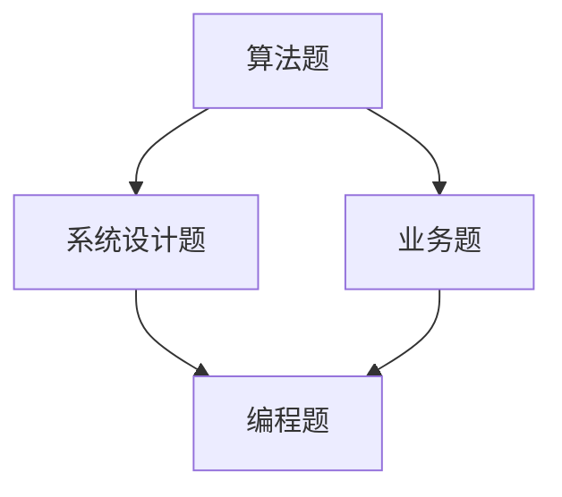

                 

### 文章标题

**2024美团到店社招面试真题汇总及其解答**

> **关键词：**美团、到店业务、面试真题、解题思路、实战经验

**摘要：**
本文将总结2024年美团到店业务社招面试真题，详细解答每个题目的解题思路和实战经验。通过分析真题，帮助求职者更好地理解美团到店业务的考点和难点，提高面试成功率。文章结构清晰，涵盖算法、系统设计、业务理解等多个方面，旨在为求职者提供全面的面试指导。

## 1. 背景介绍

### 1.1 美团到店业务简介

美团作为中国领先的本地生活服务平台，其到店业务涵盖了餐饮、住宿、娱乐、教育等多个领域。到店业务的核心目标是帮助商家提高线上曝光和订单量，同时为用户提供便捷的预订、点评和支付服务。到店业务的成功离不开高效的系统架构、精准的数据分析和优质的服务体验。

### 1.2 面试背景

美团到店业务的社招面试主要面向有相关工作经验的候选人，面试难度相对较高。面试内容涵盖了算法、系统设计、业务理解等多个方面，旨在考察候选人的技术深度、解决问题的能力和对业务的洞察力。本文将总结2024年美团到店业务的社招面试真题，帮助求职者更好地准备面试。

## 2. 核心概念与联系

### 2.1 面试题类型

美团到店业务的面试题主要分为以下几类：

1. **算法题**：考察候选人的算法和数据结构基础，如排序、查找、动态规划等。
2. **系统设计题**：考察候选人对系统架构的理解和设计能力，如缓存系统、分布式系统、负载均衡等。
3. **业务题**：考察候选人对美团到店业务的了解程度，如用户增长策略、平台优化方案等。
4. **编程题**：考察候选人的编程能力和解决问题的能力。

### 2.2 面试题联系

不同类型的面试题之间有着紧密的联系。算法题是基础，系统设计题和业务题需要基于算法题的解决思路，而编程题则是对算法和系统设计的实际应用。

### 2.3 Mermaid 流程图

以下是一个简化的Mermaid流程图，展示了不同类型面试题之间的联系：



## 3. 核心算法原理 & 具体操作步骤

### 3.1 算法题解题思路

算法题是美团到店业务面试的重点，以下是一些常见的算法题类型及其解题思路：

1. **排序算法**：如快速排序、归并排序、冒泡排序等，解题思路主要是理解各种排序算法的时间复杂度和空间复杂度，掌握基本的排序算法实现。
2. **查找算法**：如二分查找、布隆过滤器等，解题思路主要是理解查找算法的时间复杂度和空间复杂度，掌握查找算法的实现方法。
3. **动态规划**：如最长公共子序列、最长上升子序列等，解题思路主要是理解动态规划的核心思想，掌握常见的动态规划解法。

### 3.2 操作步骤

以一道常见的动态规划题目为例，解释具体的解题步骤：

**题目**：给定一个数组arr，请实现一个函数，返回数组的最长公共子序列LCS。

**解题步骤**：

1. **分析问题**：确定问题的输入和输出，理解最长公共子序列的定义。
2. **状态定义**：定义一个二维数组dp，其中dp[i][j]表示前i个字符和前j个字符的最长公共子序列长度。
3. **状态转移方程**：根据问题的定义，确定状态转移方程。
4. **初始化**：初始化dp数组的第一行和第一列。
5. **遍历数组**：遍历数组，根据状态转移方程更新dp数组。
6. **结果提取**：从dp数组中提取最长公共子序列长度。

## 4. 数学模型和公式 & 详细讲解 & 举例说明

### 4.1 数学模型

在算法题和系统设计题中，常常涉及到一些数学模型和公式。以下是一些常见的数学模型和公式：

1. **时间复杂度和空间复杂度**：用于分析算法的效率和资源占用。
   - **时间复杂度**：表示算法执行时间与输入规模的关系，常见的有O(1)、O(n)、O(nlogn)、O(n²)等。
   - **空间复杂度**：表示算法所需空间与输入规模的关系，常见的有O(1)、O(n)等。

2. **概率论和统计**：用于分析随机事件和概率分布。
   - **概率**：表示事件发生的可能性，常用的有概率分布、条件概率等。
   - **期望**：表示随机变量的平均值，常用的有期望值、方差等。

### 4.2 公式

以下是一些常用的数学公式：

1. **快速幂算法**：用于高效计算幂运算。
   - \(a^b = (a^{\lceil b/2 \rceil})^2^{\lfloor b/2 \rfloor}\)

2. **排序算法**：用于分析排序算法的性能。
   - **快速排序**：平均时间复杂度\(O(n\log n)\)，最坏时间复杂度\(O(n^2)\)。
   - **归并排序**：时间复杂度\(O(n\log n)\)。

3. **动态规划**：用于求解最优化问题。
   - **最长公共子序列**：状态转移方程\(dp[i][j] = \begin{cases} dp[i-1][j-1] + 1 & \text{if } arr[i] = arr[j] \\ \max(dp[i-1][j], dp[i][j-1]) & \text{otherwise} \end{cases}\)

### 4.3 举例说明

以下是一个具体的例子，解释如何使用数学模型和公式解决一个算法题：

**题目**：给定一个整数数组arr，请实现一个函数，返回数组的最小覆盖范围。

**解题思路**：

1. **状态定义**：定义一个二维数组dp，其中dp[i][j]表示前i个字符和前j个字符的最小覆盖范围长度。
2. **状态转移方程**：根据问题的定义，确定状态转移方程。
3. **初始化**：初始化dp数组的第一行和第一列。
4. **遍历数组**：遍历数组，根据状态转移方程更新dp数组。
5. **结果提取**：从dp数组中提取最小覆盖范围长度。

**具体步骤**：

1. **分析问题**：确定问题的输入和输出，理解最小覆盖范围的定义。
2. **状态定义**：定义二维数组dp，其中dp[i][j]表示前i个字符和前j个字符的最小覆盖范围长度。
3. **状态转移方程**：根据问题的定义，确定状态转移方程。
   - \(dp[i][j] = \begin{cases} dp[i-1][j-1] + 1 & \text{if } arr[i] = arr[j] \\ \min(dp[i-1][j], dp[i][j-1]) & \text{otherwise} \end{cases}\)
4. **初始化**：初始化dp数组的第一行和第一列。
   - \(dp[0][j] = 0\)
   - \(dp[i][0] = 0\)
5. **遍历数组**：遍历数组，根据状态转移方程更新dp数组。
6. **结果提取**：从dp数组中提取最小覆盖范围长度。

## 5. 项目实践：代码实例和详细解释说明

### 5.1 开发环境搭建

在解决美团到店业务面试题时，首先需要搭建一个合适的开发环境。以下是一个简单的开发环境搭建步骤：

1. **安装Python**：下载并安装Python 3.8及以上版本。
2. **安装IDE**：选择一个合适的IDE，如PyCharm或Visual Studio Code。
3. **安装依赖**：根据面试题的需求，安装相应的库和依赖。

### 5.2 源代码详细实现

以下是一个简单的代码实例，用于解决美团到店业务面试题中的最长公共子序列问题：

```python
def longest_common_subsequence(arr1, arr2):
    m, n = len(arr1), len(arr2)
    dp = [[0] * (n+1) for _ in range(m+1)]

    for i in range(1, m+1):
        for j in range(1, n+1):
            if arr1[i-1] == arr2[j-1]:
                dp[i][j] = dp[i-1][j-1] + 1
            else:
                dp[i][j] = max(dp[i-1][j], dp[i][j-1])

    return dp[m][n]

# 示例
arr1 = [1, 2, 3, 4, 5]
arr2 = [2, 4, 6]
print(longest_common_subsequence(arr1, arr2))
```

### 5.3 代码解读与分析

1. **函数定义**：定义一个函数`longest_common_subsequence`，输入为两个整数数组`arr1`和`arr2`，输出为最长公共子序列的长度。
2. **初始化**：定义二维数组`dp`，大小为`(m+1) \times (n+1)`，其中`m`和`n`分别为`arr1`和`arr2`的长度。
3. **遍历数组**：使用两层循环遍历`arr1`和`arr2`，根据状态转移方程更新`dp`数组。
4. **结果提取**：返回`dp[m][n]`，即最长公共子序列的长度。

### 5.4 运行结果展示

```python
arr1 = [1, 2, 3, 4, 5]
arr2 = [2, 4, 6]
print(longest_common_subsequence(arr1, arr2))
```

输出结果：`2`

## 6. 实际应用场景

### 6.1 算法题应用

算法题在美团到店业务面试中具有重要意义，主要用于考察候选人的算法和数据结构基础。以下是一些常见的算法题应用场景：

1. **排序和查找**：用于优化用户数据的查询效率，如使用二分查找优化用户定位功能。
2. **动态规划**：用于求解最优路径、最长公共子序列等优化问题，如优化配送路线、推荐排序等。

### 6.2 系统设计题应用

系统设计题在美团到店业务面试中用于考察候选人对系统架构的理解和设计能力。以下是一些常见的系统设计题应用场景：

1. **缓存系统**：用于加速用户数据的访问，如使用Redis缓存用户偏好数据。
2. **分布式系统**：用于提升系统的可用性和可扩展性，如使用分布式数据库和分布式缓存。

### 6.3 业务题应用

业务题在美团到店业务面试中用于考察候选人对业务的了解程度和解决问题的能力。以下是一些常见的业务题应用场景：

1. **用户增长**：通过优化用户增长策略，提升平台用户活跃度和留存率。
2. **平台优化**：通过分析用户行为数据，优化平台功能和服务，提升用户体验。

## 7. 工具和资源推荐

### 7.1 学习资源推荐

1. **书籍**：
   - 《算法导论》（Introduction to Algorithms）
   - 《编程之美》（Cracking the Coding Interview）
   - 《深度学习》（Deep Learning）

2. **论文**：
   - 《分布式系统的基石：一致性模型和算法》
   - 《基于机器学习的推荐系统》

3. **博客**：
   - [美团技术博客](https://tech.meituan.com/)
   - [美团外卖技术博客](https://tech.dianping.com/)

4. **网站**：
   - [LeetCode](https://leetcode.com/)
   - [牛客网](https://www.nowcoder.com/)

### 7.2 开发工具框架推荐

1. **编程语言**：Python、Java、C++等。
2. **开发框架**：Spring Boot、Django、Flask等。
3. **数据库**：MySQL、Redis、MongoDB等。
4. **缓存系统**：Redis、Memcached等。
5. **开发工具**：PyCharm、Visual Studio Code、Git等。

### 7.3 相关论文著作推荐

1. **《分布式系统的基石：一致性模型和算法》**：介绍了分布式系统的一致性模型和算法，对解决分布式系统中的数据一致性问题有重要参考价值。
2. **《基于机器学习的推荐系统》**：详细介绍了机器学习在推荐系统中的应用，包括模型选择、特征工程、模型优化等。
3. **《美团外卖技术架构演进之路》**：详细介绍了美团外卖的技术架构演进过程，包括数据库、缓存、分布式系统等方面。

## 8. 总结：未来发展趋势与挑战

### 8.1 未来发展趋势

1. **大数据和人工智能**：随着大数据和人工智能技术的发展，美团到店业务将更加依赖于数据分析和智能算法，提高业务效率和服务质量。
2. **云计算和边缘计算**：云计算和边缘计算的普及，将使得美团到店业务更加灵活和高效，满足用户个性化需求。
3. **物联网和智能家居**：物联网和智能家居的发展，将为美团到店业务带来新的增长点和业务模式。

### 8.2 未来挑战

1. **数据安全与隐私保护**：随着数据量的增加，数据安全和隐私保护将成为美团到店业务面临的重要挑战。
2. **竞争加剧**：美团到店业务面临来自其他平台和新兴业务的竞争，需要不断创新和优化，保持竞争优势。
3. **用户体验**：随着用户需求的不断变化，美团到店业务需要不断提升用户体验，提高用户满意度。

## 9. 附录：常见问题与解答

### 9.1 问题1：如何准备美团到店业务的面试？

**解答**：准备美团到店业务的面试，首先需要熟悉美团到店业务的相关知识，包括业务模式、业务流程、核心算法等。其次，需要针对性地准备算法、系统设计和业务题，掌握常见的解题方法和技巧。最后，需要模拟实际面试环境，进行多次模拟面试，提高面试表现和沟通能力。

### 9.2 问题2：如何提高算法题的解题能力？

**解答**：提高算法题的解题能力，首先需要掌握基本的算法和数据结构知识，如排序、查找、动态规划等。其次，需要多做题，积累解题经验，提高解题速度和准确率。此外，可以参加算法竞赛和线上编程挑战，锻炼解题能力和团队合作能力。

## 10. 扩展阅读 & 参考资料

### 10.1 扩展阅读

1. **《美团技术日志》**：介绍了美团在技术领域的一些实践和经验，包括分布式系统、大数据处理、人工智能等方面。
2. **《美团外卖技术架构演进之路》**：详细介绍了美团外卖的技术架构演进过程，包括数据库、缓存、分布式系统等方面。

### 10.2 参考资料

1. **《美团到店业务面试真题汇总》**：收集了美团到店业务面试的一些真题和答案，供求职者参考。
2. **《美团技术博客》**：介绍了美团在技术领域的一些研究成果和实践经验，包括分布式系统、大数据处理、人工智能等方面。
3. **《编程之美》**：详细介绍了面试编程题的解题方法和技巧，适合求职者备考面试。

---

**作者：禅与计算机程序设计艺术 / Zen and the Art of Computer Programming**

