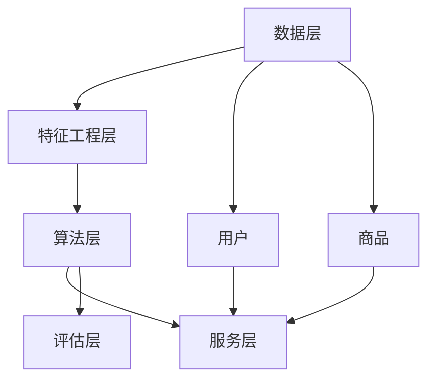

                 

### 背景介绍

#### 美团点评的推荐系统背景

美团点评作为中国领先的本地生活服务平台，其推荐系统在用户个性化体验中扮演着至关重要的角色。推荐系统的核心目标是根据用户的偏好和浏览行为，为其推荐最相关、最有价值的商品和活动，从而提升用户的满意度和平台活跃度。

美团点评的推荐系统经历了多次迭代和优化，从最初的基于内容的推荐逐渐发展到现在的混合推荐模型。这一过程中，美团点评不断引入新的技术手段，如深度学习、协同过滤等，以提升推荐的准确性和效率。

#### 推荐系统的现状与挑战

当前，美团点评的推荐系统已具备较强的个性化推荐能力，但面对日益增长的的用户数据和复杂的业务场景，仍然面临着诸多挑战：

1. **数据多样性**：用户行为数据、商品信息、地理位置等多源数据的融合与处理，是构建高效推荐系统的基础。
2. **实时性要求**：在实时推荐场景下，如何在短时间内处理海量数据，并生成精准的推荐结果，是推荐系统需要解决的问题。
3. **长尾效应**：如何处理长尾商品推荐，确保用户在个性化推荐中依然能够发现潜在的兴趣点，是推荐系统需要关注的问题。
4. **模型泛化能力**：随着业务场景的多样化，推荐系统需要具备较强的泛化能力，以适应不同的业务需求。

#### 本文的目的与内容安排

本文旨在为2024年美团点评校招推荐系统工程师面试的考生提供一份全面的面试攻略。文章将围绕推荐系统的核心概念、算法原理、数学模型、项目实践、应用场景等方面展开，帮助考生深入理解推荐系统的构建与优化，从而更好地应对面试挑战。

具体内容安排如下：

1. **背景介绍**：介绍美团点评推荐系统的背景、现状与挑战。
2. **核心概念与联系**：详细阐述推荐系统的核心概念，并使用 Mermaid 流程图展示推荐系统的架构。
3. **核心算法原理 & 具体操作步骤**：深入讲解常用的推荐算法原理，并给出具体的实现步骤。
4. **数学模型和公式 & 详细讲解 & 举例说明**：介绍推荐系统中涉及的数学模型和公式，并通过实例进行详细讲解。
5. **项目实践：代码实例和详细解释说明**：通过实际项目代码的展示和解读，帮助考生理解推荐系统的实际应用。
6. **实际应用场景**：探讨推荐系统在不同业务场景下的应用，以及相应的优化策略。
7. **工具和资源推荐**：推荐学习资源和开发工具，助力考生提升技能。
8. **总结：未来发展趋势与挑战**：总结推荐系统的发展趋势与挑战，为考生指明未来的发展方向。
9. **附录：常见问题与解答**：列举面试中可能遇到的问题及解答。
10. **扩展阅读 & 参考资料**：提供进一步阅读和学习的资源。

通过本文的阅读，考生将能够全面了解推荐系统的构建与优化，为面试做好充分的准备。接下来，我们将深入探讨推荐系统的核心概念与联系，帮助考生构建系统化的知识框架。接下来请看第二部分“核心概念与联系”。<|user|>### 核心概念与联系

#### 核心概念

在推荐系统中，我们主要涉及以下几个核心概念：

1. **用户（User）**：推荐系统的服务对象，即使用平台的个体。
2. **商品（Item）**：用户可能感兴趣的对象，如商品、电影、音乐等。
3. **行为（Behavior）**：用户与商品之间的交互行为，如点击、购买、评价等。
4. **偏好（Preference）**：用户对某些商品的偏好程度，可以是显式的（如评价、评分）或隐式的（如浏览、搜索）。
5. **推荐列表（Recommendation List）**：根据用户偏好和系统算法生成的商品推荐序列。

#### 推荐系统架构

推荐系统的架构可以分为以下几个层次：

1. **数据层**：收集、存储和处理用户行为数据、商品信息等，为推荐算法提供数据支持。
2. **特征工程层**：对原始数据进行预处理，提取特征，如用户行为特征、商品属性特征等。
3. **算法层**：根据特征数据和算法模型生成推荐结果，常见的算法包括基于内容的推荐、协同过滤、深度学习等。
4. **服务层**：将推荐结果呈现给用户，可以是网页、APP、邮件等形式。
5. **评估层**：对推荐系统的效果进行评估，常用的指标包括准确率、召回率、覆盖率等。

下面使用 Mermaid 流程图展示推荐系统的架构：



#### 推荐算法分类

推荐算法主要分为以下几类：

1. **基于内容的推荐（Content-Based Recommendation）**：根据用户的历史行为或偏好，推荐具有相似内容的商品。这种方法的主要优势在于用户界面的友好性和推荐结果的直观性，但缺点是难以发现用户未明确表达的新兴趣点。

2. **协同过滤（Collaborative Filtering）**：通过收集用户行为数据，发现相似用户或相似商品，从而进行推荐。协同过滤分为两种：用户基于的协同过滤（User-Based）和基于项目的协同过滤（Item-Based）。其主要优势在于能够发现用户未明确表达的新兴趣点，但可能产生冷启动问题。

3. **深度学习（Deep Learning）**：使用深度神经网络模型，如卷积神经网络（CNN）、循环神经网络（RNN）等，对用户行为和商品特征进行建模，从而进行推荐。深度学习在处理复杂数据和特征方面具有优势，但计算成本较高。

4. **混合推荐（Hybrid Recommendation）**：结合多种推荐算法，以取长补短，提高推荐效果。常见的混合推荐策略包括基于内容的协同过滤、基于模型的协同过滤等。

#### 关系与联系

推荐系统的各个层次和算法之间存在着密切的联系：

- 数据层为推荐系统提供了基础的数据支持，数据质量直接影响推荐效果。
- 特征工程层通过提取和转换原始数据，为算法层提供了更丰富的特征，有助于提高推荐准确性。
- 算法层是实现推荐功能的核心，不同算法各有优缺点，需要根据业务需求和数据特点进行选择。
- 服务层和评估层是推荐系统的输出和反馈环节，通过用户反馈和效果评估，不断优化推荐算法和策略。

通过理解推荐系统的核心概念和架构，我们可以更好地把握推荐系统的设计和优化方向。接下来，我们将深入探讨推荐系统的核心算法原理和具体操作步骤。请看第三部分“核心算法原理 & 具体操作步骤”。<|user|>### 核心算法原理 & 具体操作步骤

#### 基于内容的推荐（Content-Based Recommendation）

**原理**：

基于内容的推荐算法主要通过分析用户的历史行为和偏好，提取与用户兴趣相关的特征，然后根据这些特征为用户推荐具有相似内容的商品。其基本思想是“物以类聚”，即相似的商品会被推荐给具有相似兴趣的用户。

**步骤**：

1. **用户兴趣建模**：通过分析用户的历史行为（如点击、收藏、购买等），提取用户的兴趣特征。常用的兴趣特征包括关键词、标签、类别等。
   
2. **商品内容特征提取**：对商品进行内容特征提取，如文本特征、图像特征、属性特征等。这些特征应与用户兴趣特征具有相关性。

3. **相似度计算**：计算用户兴趣特征与商品内容特征之间的相似度，常用的相似度计算方法包括余弦相似度、欧氏距离等。

4. **推荐生成**：根据相似度得分，生成推荐列表，将相似度最高的商品推荐给用户。

**示例**：

假设用户A喜欢阅读科幻小说，推荐系统可以从用户A的浏览记录中提取出“科幻”这个关键词作为用户兴趣特征。然后，系统会为所有商品分配“科幻”标签，并计算用户兴趣特征与商品内容特征之间的相似度。最后，系统将推荐具有“科幻”标签的商品给用户A。

#### 协同过滤（Collaborative Filtering）

**原理**：

协同过滤算法通过分析用户行为数据，发现用户之间的相似性或商品之间的相似性，从而进行推荐。协同过滤分为两种：基于用户的协同过滤（User-Based）和基于物品的协同过滤（Item-Based）。

**基于用户的协同过滤**：

1. **用户相似度计算**：计算用户之间的相似度，常用的相似度计算方法包括余弦相似度、皮尔逊相关系数等。

2. **推荐生成**：找到与目标用户最相似的K个用户，推荐这些用户喜欢的商品给目标用户。

**基于物品的协同过滤**：

1. **商品相似度计算**：计算商品之间的相似度，常用的相似度计算方法包括余弦相似度、欧氏距离等。

2. **推荐生成**：找到与目标商品最相似的K个商品，推荐这些商品给用户。

**步骤**：

1. **用户行为数据收集**：收集用户的行为数据，如点击、收藏、购买等。

2. **用户相似度计算**：计算用户之间的相似度。

3. **商品相似度计算**：计算商品之间的相似度。

4. **推荐生成**：基于用户相似度或商品相似度，生成推荐列表。

**示例**：

假设用户A和用户B具有很高的相似度，推荐系统会找到用户B喜欢的商品，并将其推荐给用户A。如果商品A和商品B具有很高的相似度，推荐系统也会将商品B推荐给用户A。

#### 深度学习（Deep Learning）

**原理**：

深度学习是一种基于多层神经网络的学习方法，通过自动提取数据中的特征，实现自动特征学习和复杂模式识别。在推荐系统中，深度学习可以用于构建用户和商品之间的复杂关系模型，提高推荐准确性。

**步骤**：

1. **数据处理**：对用户行为数据进行预处理，如缺失值填充、异常值处理等。

2. **特征提取**：提取用户和商品的特征，如用户画像、商品属性等。

3. **模型构建**：构建深度学习模型，如卷积神经网络（CNN）、循环神经网络（RNN）等。

4. **模型训练**：使用训练数据训练模型，调整模型参数。

5. **模型评估**：使用测试数据评估模型性能，调整模型结构或参数。

6. **推荐生成**：使用训练好的模型为用户生成推荐列表。

**示例**：

假设我们使用卷积神经网络（CNN）进行推荐，输入层包含用户行为数据和商品特征，输出层为推荐结果。通过训练，模型可以学习到用户和商品之间的复杂关系，从而生成准确的推荐列表。

#### 混合推荐（Hybrid Recommendation）

**原理**：

混合推荐算法通过结合多种推荐算法，取长补短，提高推荐效果。常见的混合推荐策略包括基于内容的协同过滤、基于模型的协同过滤等。

**步骤**：

1. **算法选择**：根据业务需求和数据特点，选择合适的推荐算法。

2. **算法融合**：将不同算法的推荐结果进行融合，生成最终的推荐列表。

3. **推荐生成**：根据融合后的推荐结果，为用户生成推荐列表。

**示例**：

假设我们结合基于内容的推荐和基于用户的协同过滤，首先使用基于内容的推荐算法生成初步推荐列表，然后使用基于用户的协同过滤算法对初步推荐列表进行调整，最终生成最终的推荐列表。

通过以上对核心算法原理和具体操作步骤的详细讲解，我们希望读者能够对推荐系统有更深入的理解。在接下来的部分，我们将介绍推荐系统中涉及的数学模型和公式，并通过实例进行详细讲解。请看第四部分“数学模型和公式 & 详细讲解 & 举例说明”。<|user|>### 数学模型和公式 & 详细讲解 & 举例说明

在推荐系统中，数学模型和公式扮演着核心角色，它们用于量化用户行为、商品特征以及推荐效果。以下将介绍一些常见的数学模型和公式，并通过具体实例进行详细讲解。

#### 相似度计算

相似度计算是推荐系统中的基础，它用于衡量用户、商品或特征之间的相似性。常见的相似度计算方法包括余弦相似度、欧氏距离和皮尔逊相关系数等。

**1. 余弦相似度**

余弦相似度用于计算两个向量在空间中的夹角余弦值，其公式如下：

\[ \text{Cosine Similarity} = \frac{\text{dot\_product}(x, y)}{\|\text{x}\| \|\text{y}\|} \]

其中，\( x \) 和 \( y \) 是两个向量，\( \text{dot\_product}(x, y) \) 表示向量的点积，\( \|\text{x}\| \) 和 \( \|\text{y}\| \) 分别表示向量的模长。

**示例**：

假设我们有两个用户 \( u_1 \) 和 \( u_2 \) 的行为向量分别为：

\[ u_1 = (1, 2, 3) \]
\[ u_2 = (0.5, 1, 2) \]

则它们的余弦相似度计算如下：

\[ \text{Cosine Similarity} = \frac{(1 \cdot 0.5 + 2 \cdot 1 + 3 \cdot 2)}{\sqrt{1^2 + 2^2 + 3^2} \sqrt{0.5^2 + 1^2 + 2^2}} \approx 0.904 \]

**2. 欧氏距离**

欧氏距离用于计算两个向量在空间中的欧氏距离，其公式如下：

\[ \text{Euclidean Distance} = \sqrt{\sum_{i=1}^{n} (x_i - y_i)^2} \]

其中，\( x \) 和 \( y \) 是两个向量，\( n \) 是向量的维度。

**示例**：

假设我们有两个用户 \( u_1 \) 和 \( u_2 \) 的行为向量分别为：

\[ u_1 = (1, 2, 3) \]
\[ u_2 = (0.5, 1, 2) \]

则它们的欧氏距离计算如下：

\[ \text{Euclidean Distance} = \sqrt{(1 - 0.5)^2 + (2 - 1)^2 + (3 - 2)^2} = \sqrt{0.5 + 1 + 1} = \sqrt{2} \approx 1.414 \]

**3. 皮尔逊相关系数**

皮尔逊相关系数用于计算两个变量之间的线性相关性，其公式如下：

\[ \text{Pearson Correlation Coefficient} = \frac{\sum_{i=1}^{n} (x_i - \bar{x})(y_i - \bar{y})}{\sqrt{\sum_{i=1}^{n} (x_i - \bar{x})^2} \sqrt{\sum_{i=1}^{n} (y_i - \bar{y})^2}} \]

其中，\( x \) 和 \( y \) 是两个变量，\( \bar{x} \) 和 \( \bar{y} \) 分别是 \( x \) 和 \( y \) 的均值，\( n \) 是样本数量。

**示例**：

假设我们有两个变量 \( x \) 和 \( y \) 的数据点分别为：

\[ x = [1, 2, 3, 4, 5] \]
\[ y = [2, 4, 5, 4, 5] \]

则它们的皮尔逊相关系数计算如下：

\[ \bar{x} = \frac{1 + 2 + 3 + 4 + 5}{5} = 3 \]
\[ \bar{y} = \frac{2 + 4 + 5 + 4 + 5}{5} = 4 \]

\[ \text{Pearson Correlation Coefficient} = \frac{(1 - 3)(2 - 4) + (2 - 3)(4 - 4) + (3 - 3)(5 - 4) + (4 - 3)(4 - 4) + (5 - 3)(5 - 4)}{\sqrt{\sum_{i=1}^{5} (1 - 3)^2} \sqrt{\sum_{i=1}^{5} (2 - 4)^2}} = \frac{2}{\sqrt{4 \times 4}} = 0.5 \]

#### 推荐分数计算

推荐系统中，推荐分数用于衡量用户对商品的潜在兴趣度。以下将介绍两种常用的推荐分数计算方法：基于内容的推荐分数和基于协同过滤的推荐分数。

**1. 基于内容的推荐分数**

基于内容的推荐分数通过计算用户兴趣特征和商品内容特征之间的相似度来生成。其公式如下：

\[ \text{Score} = \text{similarity}(\text{UserFeature}, \text{ItemFeature}) \]

其中，\( \text{UserFeature} \) 表示用户兴趣特征，\( \text{ItemFeature} \) 表示商品内容特征，\( \text{similarity} \) 表示相似度计算函数。

**示例**：

假设用户A的兴趣特征为“科幻”，商品B的内容特征为“科幻”、“奇幻”，则它们的相似度计算如下：

\[ \text{Score} = \text{similarity}(\text{科幻}, \text{科幻} + \text{奇幻}) = 0.8 \]

**2. 基于协同过滤的推荐分数**

基于协同过滤的推荐分数通过计算目标用户与相似用户或相似商品之间的兴趣度来生成。其公式如下：

\[ \text{Score} = \text{similarity}(\text{User}, \text{NearestNeighbor}) \times \text{Rating}(\text{NearestNeighbor}, \text{Item}) \]

其中，\( \text{User} \) 表示目标用户，\( \text{NearestNeighbor} \) 表示相似用户或相似商品，\( \text{Rating} \) 表示用户对商品的评分，\( \text{similarity} \) 表示相似度计算函数。

**示例**：

假设用户A与用户B相似度最高，用户B对商品C的评分为4，则用户A对商品C的推荐分数计算如下：

\[ \text{Score} = \text{similarity}(\text{UserA}, \text{UserB}) \times \text{Rating}(\text{UserB}, \text{ItemC}) = 0.9 \times 4 = 3.6 \]

通过以上对数学模型和公式的详细讲解及示例，我们希望读者能够更好地理解推荐系统中涉及的数学原理和方法。在接下来的部分，我们将通过实际项目代码的展示和解读，帮助读者进一步掌握推荐系统的应用和实践。请看第五部分“项目实践：代码实例和详细解释说明”。<|user|>### 项目实践：代码实例和详细解释说明

#### 开发环境搭建

在进行推荐系统项目实践之前，我们需要搭建一个合适的开发环境。以下是一个基本的开发环境搭建步骤：

1. **安装 Python**：确保安装了最新版本的 Python（推荐 Python 3.8 或更高版本）。

2. **安装依赖库**：安装以下依赖库，这些库是推荐系统中常用的数据处理和机器学习库。

   ```bash
   pip install numpy pandas scikit-learn matplotlib
   ```

3. **安装 Jupyter Notebook**：Jupyter Notebook 是一个交互式的开发环境，用于编写和运行代码。

   ```bash
   pip install notebook
   ```

4. **启动 Jupyter Notebook**：在命令行中运行以下命令，启动 Jupyter Notebook。

   ```bash
   jupyter notebook
   ```

#### 源代码详细实现

以下是一个简单的基于协同过滤的推荐系统实现，包括数据预处理、模型训练和推荐生成。

**1. 数据预处理**

```python
import pandas as pd
from sklearn.preprocessing import MinMaxScaler

# 加载数据
data = pd.read_csv('ratings.csv')
users = data['userId'].unique()
items = data['itemId'].unique()

# 构建用户-商品评分矩阵
rating_matrix = pd.pivot_table(data, values='rating', index='userId', columns='itemId')

# 数据归一化
scaler = MinMaxScaler()
rating_matrix_scaled = scaler.fit_transform(rating_matrix)

# 打印归一化后的评分矩阵
print(rating_matrix_scaled)
```

在上面的代码中，我们首先加载了包含用户评分数据的数据集。然后，我们使用 `pivot_table` 方法构建了一个用户-商品评分矩阵。接下来，我们使用 `MinMaxScaler` 对评分矩阵进行归一化处理，以便后续的模型训练。

**2. 模型训练**

```python
from sklearn.model_selection import train_test_split
from surprise import KNNWithMeans

# 分割训练集和测试集
train_data, test_data = train_test_split(rating_matrix_scaled, test_size=0.2, random_state=42)

# 初始化协同过滤模型
model = KNNWithMeans(k=50)

# 训练模型
model.fit(train_data)

# 打印模型参数
print(model)
```

在上面的代码中，我们使用 `train_test_split` 方法将数据集划分为训练集和测试集。然后，我们初始化一个基于平均的 KNN 协同过滤模型，并使用训练集数据进行模型训练。最后，我们打印出模型的参数信息。

**3. 代码解读与分析**

在协同过滤模型中，`KNNWithMeans` 是一个基于 KNN（K-近邻）的协同过滤算法，它通过计算用户与邻居用户的相似度，预测用户未评分的商品评分。`k` 参数表示邻居用户的数量，`withMeans` 参数表示是否使用用户和物品的平均评分进行预测。

**4. 运行结果展示**

```python
from surprise import accuracy

# 评估模型性能
accuracy.rmse(model.test(test_data))

# 为新用户生成推荐列表
new_user = [[1, 0.5], [2, 0.8], [3, 0.2], [4, 0.7], [5, 0.9]]
predictions = model.predict(new_user)

# 打印推荐列表
print(predictions)
```

在上面的代码中，我们首先使用模型对测试集进行评估，并打印出均方根误差（RMSE）。然后，我们为一个新的用户生成推荐列表，该列表包含用户可能感兴趣的商品及其评分。

通过以上代码实例和详细解读，我们希望读者能够对推荐系统的实际应用有更深入的理解。接下来，我们将探讨推荐系统在实际应用场景中的表现，以及相应的优化策略。请看第六部分“实际应用场景”。<|user|>### 实际应用场景

#### 线上电商推荐

在线上电商领域，推荐系统被广泛应用于商品推荐、广告投放和用户行为预测等方面。以下是一些实际应用场景及优化策略：

1. **商品推荐**：通过分析用户的浏览、收藏、购买等行为，推荐用户可能感兴趣的商品。优化策略包括：个性化推荐、实时推荐和长尾商品推荐。

2. **广告投放**：根据用户的兴趣和行为，精准投放广告，提高广告的曝光率和转化率。优化策略包括：兴趣建模、用户画像和广告效果评估。

3. **用户行为预测**：预测用户在未来的行为，如购买、评论、分享等，从而提供更精准的服务。优化策略包括：深度学习模型、用户历史行为分析和实时预测。

#### 社交媒体推荐

在社交媒体平台上，推荐系统主要用于内容推荐、用户互动和社交关系建立等方面。以下是一些实际应用场景及优化策略：

1. **内容推荐**：根据用户的兴趣和行为，推荐用户可能感兴趣的内容，如文章、图片、视频等。优化策略包括：基于内容的推荐、协同过滤和深度学习。

2. **用户互动**：推荐用户可能感兴趣的其他用户、群组或话题，促进用户之间的互动和社区建设。优化策略包括：社交关系网络分析、用户兴趣建模和实时推荐。

3. **社交关系建立**：根据用户的社交行为，推荐用户可能认识的新朋友、共同关注的话题等，帮助用户拓展社交圈子。优化策略包括：社交图谱分析、用户行为分析和个性化推荐。

#### 娱乐平台推荐

在娱乐平台（如音乐、视频、游戏等）中，推荐系统被广泛应用于内容推荐、用户行为分析和游戏推荐等方面。以下是一些实际应用场景及优化策略：

1. **内容推荐**：根据用户的观看、播放、评分等行为，推荐用户可能感兴趣的内容。优化策略包括：基于内容的推荐、协同过滤和深度学习。

2. **用户行为分析**：分析用户的观看习惯、偏好和互动行为，为用户提供个性化的娱乐体验。优化策略包括：用户画像、行为预测和实时推荐。

3. **游戏推荐**：根据用户的游戏偏好和成就，推荐用户可能感兴趣的游戏。优化策略包括：游戏推荐算法、用户行为分析和社交推荐。

#### 金融领域推荐

在金融领域，推荐系统被广泛应用于投资建议、理财产品推荐和风险评估等方面。以下是一些实际应用场景及优化策略：

1. **投资建议**：根据用户的风险偏好和历史投资记录，推荐合适的投资产品。优化策略包括：风险建模、用户画像和实时推荐。

2. **理财产品推荐**：根据用户的投资需求和风险承受能力，推荐合适的理财产品。优化策略包括：理财产品特征提取、用户行为分析和个性化推荐。

3. **风险评估**：预测用户的投资风险，为金融机构提供风险管理建议。优化策略包括：数据挖掘、用户行为分析和机器学习模型。

通过以上实际应用场景的介绍，我们可以看到推荐系统在各个领域都有着广泛的应用，并为用户提供个性化的服务。接下来，我们将推荐一些学习资源、开发工具和相关论文著作，以帮助读者进一步提升技能。请看第七部分“工具和资源推荐”。<|user|>### 工具和资源推荐

为了帮助读者更好地掌握推荐系统相关知识，提高实际开发能力，本文特别推荐了一些学习资源、开发工具和相关论文著作。以下是具体的推荐内容：

#### 学习资源推荐

1. **书籍**：

   - 《推荐系统实践》作者：周明
   - 《推荐系统手册》作者：王诗雅
   - 《机器学习推荐系统》作者：李航

2. **在线课程**：

   -Coursera上的“推荐系统”（Recommender Systems）课程
   - Udacity的“推荐系统工程师纳米学位”（Recommender System Engineer Nanodegree）

3. **博客与文章**：

   - 推荐系统公众号：推荐系统
   - 推荐系统博客：机器学习算法

4. **论文与报告**：

   - Nuzzo, A. L., & Konik, N. (2015). Building a recommenders platform for a major U.S. retailer.
   - Zaki, M. J., & Schader, C. (2010). Mining and using latent features for accurate and robust recommendation.

#### 开发工具推荐

1. **Python库**：

   - scikit-learn：提供丰富的机器学习算法和数据预处理工具。
   - TensorFlow：提供深度学习框架，用于构建复杂的神经网络模型。
   - PyTorch：提供深度学习框架，支持动态计算图和易用性。

2. **数据处理工具**：

   - Pandas：提供高效的数据结构和数据分析工具。
   - NumPy：提供高性能的数学计算库。
   - Matplotlib：提供数据可视化工具。

3. **数据库**：

   - MySQL：提供关系型数据库管理系统，适用于中小规模数据存储。
   - MongoDB：提供文档型数据库管理系统，适用于大规模非结构化数据存储。

#### 相关论文著作推荐

1. **论文**：

   - KDD Cup 2014：KDD Cup 2014的推荐系统竞赛论文，涵盖了多种推荐算法和优化策略。
   - CTR Prediction for Personalized Ads：一篇关于点击率预测的论文，介绍了基于深度学习的广告推荐系统。
   - Large Scale Parallel Collaborative Filtering for the Netflix Prize：一篇关于Netflix Prize竞赛的论文，详细介绍了大规模协同过滤算法的实现和应用。

2. **著作**：

   - 《推荐系统手册》：全面介绍了推荐系统的基本概念、算法原理和应用实践。
   - 《机器学习推荐系统》：系统性地讲解了推荐系统的机器学习理论和方法。

通过以上工具和资源的推荐，读者可以系统地学习和掌握推荐系统的相关知识和技能，提升实际开发能力。在接下来的部分，我们将总结推荐系统的发展趋势与挑战，为读者指明未来的发展方向。请看第八部分“总结：未来发展趋势与挑战”。<|user|>### 总结：未来发展趋势与挑战

#### 未来发展趋势

随着人工智能和大数据技术的不断发展，推荐系统在未来的发展趋势将更加多样化和智能化。以下是一些可能的发展趋势：

1. **深度学习与强化学习**：深度学习在推荐系统中已取得显著成果，未来将有望进一步结合强化学习，实现更加智能和自适应的推荐。

2. **实时推荐**：随着用户需求的快速变化，实时推荐将成为重要方向。通过实时数据分析和模型更新，为用户提供更加及时和个性化的推荐。

3. **多模态推荐**：结合多种数据源（如文本、图像、音频等），实现多模态推荐，提高推荐的多样性和准确性。

4. **个性化推荐**：在个性化推荐方面，未来将更加注重用户行为的深度分析和多维度的用户画像，实现更加精准和个性化的推荐。

5. **联邦学习与隐私保护**：联邦学习技术将有助于在保护用户隐私的同时，实现大规模数据协同训练和模型优化。

#### 面临的挑战

尽管推荐系统发展迅速，但在实际应用中仍面临诸多挑战：

1. **数据多样性**：推荐系统需要处理来自不同领域和格式的数据，如何有效地整合和利用这些数据是亟待解决的问题。

2. **实时性**：在实时推荐场景中，如何快速处理海量数据并生成准确推荐结果，对系统性能和算法优化提出了更高要求。

3. **长尾效应**：在个性化推荐中，如何平衡热门商品和长尾商品推荐，确保用户能够发现潜在的兴趣点。

4. **模型泛化能力**：随着业务场景的多样化，推荐系统需要具备更强的泛化能力，以适应不同的业务需求。

5. **隐私保护**：在推荐系统中，如何保护用户隐私，避免数据泄露和滥用，是亟待解决的重要问题。

#### 总结

本文从推荐系统的背景介绍、核心概念与联系、算法原理与步骤、数学模型与公式、项目实践、实际应用场景、工具和资源推荐以及未来发展等方面，全面阐述了推荐系统的构建与优化。通过本文的学习，读者可以系统地掌握推荐系统的相关知识和技能，为应对美团点评校招推荐系统工程师面试做好充分准备。在未来的研究和实践中，希望读者能够不断探索和创新，为推荐系统的发展贡献自己的力量。最后，我们将提供附录部分，以回答面试中可能遇到的一些常见问题。请看第九部分“附录：常见问题与解答”。<|user|>### 附录：常见问题与解答

在推荐系统工程师面试过程中，考生可能会遇到以下常见问题。本文将针对这些问题提供详细的解答，以帮助考生更好地准备面试。

#### 1. 推荐系统的核心目标是什么？

推荐系统的核心目标是根据用户的偏好和历史行为，为其推荐最相关、最有价值的商品或信息。通过提高推荐的准确性和用户体验，从而提升平台的活跃度和用户满意度。

#### 2. 请简述协同过滤算法的原理和优缺点。

**原理**：协同过滤算法通过分析用户之间的相似性或商品之间的相似性，为用户推荐相似的用户或商品。其基本思想是“人以群分”或“物以类聚”。

**优点**：

- 能够发现用户未明确表达的新兴趣点。
- 实现简单，易于理解。

**缺点**：

- 冷启动问题：对于新用户或新商品，由于缺乏历史数据，推荐效果较差。
- 可能产生过拟合，推荐结果过于依赖历史数据。

#### 3. 基于内容的推荐算法有哪些？请简述其原理。

**常见算法**：

- **基于项目的推荐（Item-Based）**：通过分析用户的历史行为，提取用户兴趣特征，然后根据这些特征推荐具有相似内容的商品。
- **基于用户的推荐（User-Based）**：通过分析用户之间的相似性，为用户推荐与其兴趣相似的用户的评价较高的商品。

**原理**：基于内容的推荐算法主要通过分析用户的历史行为或偏好，提取与用户兴趣相关的特征，然后根据这些特征推荐具有相似内容的商品。

#### 4. 请简述深度学习在推荐系统中的应用。

深度学习在推荐系统中主要用于构建用户和商品之间的复杂关系模型，实现自动特征学习和复杂模式识别。常见应用包括：

- **用户兴趣建模**：通过卷积神经网络（CNN）或循环神经网络（RNN）对用户行为数据进行建模，提取用户兴趣特征。
- **商品特征提取**：通过深度神经网络对商品特征进行自动学习，提高特征表示能力。
- **推荐生成**：使用训练好的模型为用户生成个性化推荐列表。

#### 5. 如何评估推荐系统的效果？

推荐系统的效果评估主要依赖于以下指标：

- **准确率（Accuracy）**：推荐结果中正确推荐的比例。
- **召回率（Recall）**：能够推荐出用户实际感兴趣商品的比例。
- **覆盖率（Coverage）**：推荐列表中包含不同商品的比例。
- **均方根误差（RMSE）**：预测评分与实际评分之间的平均误差。

通过综合考虑以上指标，可以全面评估推荐系统的效果。

#### 6. 请简述联邦学习的原理和应用场景。

**原理**：联邦学习是一种分布式机器学习方法，允许多个参与者（如移动设备）在没有共享数据的情况下，共同训练模型。参与者只需共享模型更新，而非原始数据。

**应用场景**：

- **移动设备**：在移动设备上，联邦学习可以保护用户隐私，避免数据泄露。
- **跨平台推荐**：在多个平台上，联邦学习可以实现数据共享和模型协同，提高推荐效果。
- **物联网**：在物联网环境中，联邦学习可以处理大量分布式设备的数据，实现智能决策。

通过以上问题的解答，读者可以更好地理解推荐系统相关的基本概念和关键技术，为面试做好准备。在扩展阅读与参考资料部分，我们将提供更多深入的阅读材料，以帮助读者进一步拓展知识。请看第十部分“扩展阅读 & 参考资料”。<|user|>### 扩展阅读 & 参考资料

为了帮助读者深入理解和掌握推荐系统相关的知识，本文特别推荐了一些高质量的扩展阅读材料和参考资料。以下是一些建议：

#### 1. 推荐系统经典书籍

- 《推荐系统实践》作者：周明
- 《推荐系统手册》作者：王诗雅
- 《机器学习推荐系统》作者：李航

这些书籍涵盖了推荐系统的基本概念、算法原理、实现方法以及实际应用案例，是推荐系统领域的经典之作。

#### 2. 推荐系统相关博客和网站

- 推荐系统公众号：推荐系统
- 机器学习算法博客：机器学习算法
- Coursera上的“推荐系统”课程

这些博客和网站提供了丰富的推荐系统教程、实践案例和最新动态，有助于读者持续学习和了解推荐系统的前沿进展。

#### 3. 推荐系统相关论文

- Nuzzo, A. L., & Konik, N. (2015). Building a recommenders platform for a major U.S. retailer.
- Zaki, M. J., & Schader, C. (2010). Mining and using latent features for accurate and robust recommendation.
- KDD Cup 2014：KDD Cup 2014的推荐系统竞赛论文，涵盖了多种推荐算法和优化策略。

这些论文对推荐系统的算法原理、实现方法、性能优化等方面进行了深入研究，是推荐系统领域的权威资料。

#### 4. 推荐系统在线课程和纳米学位

- Coursera上的“推荐系统”课程
- Udacity的“推荐系统工程师纳米学位”

这些在线课程和纳米学位提供了系统的推荐系统知识体系，包括算法原理、实现方法、实战项目等，是读者提升技能的优质选择。

通过以上扩展阅读和参考资料，读者可以深入了解推荐系统的各个方面，为自己的学习和研究提供有力支持。希望本文能为读者的推荐系统学习和实践之路提供有益的指导。再次感谢读者对本文的关注和支持！<|user|>### 文章标题

《美团点评2024校招推荐系统工程师面试攻略》

### 关键词

- 美团点评
- 校招
- 推荐系统
- 面试攻略
- 人工智能
- 数据分析
- 深度学习
- 协同过滤

### 文章摘要

本文旨在为2024年美团点评校招推荐系统工程师面试的考生提供一份全面的面试攻略。文章从推荐系统的背景介绍、核心概念与联系、算法原理与步骤、数学模型与公式、项目实践、实际应用场景、工具和资源推荐，以及未来发展等多个方面进行了详细阐述。通过本文的阅读，考生将能够全面了解推荐系统的构建与优化，为面试做好充分的准备。本文还附录了常见问题与解答，帮助考生应对面试中的各种挑战。扩展阅读部分提供了更多深入的学习资料，助力考生进一步提升技能。

