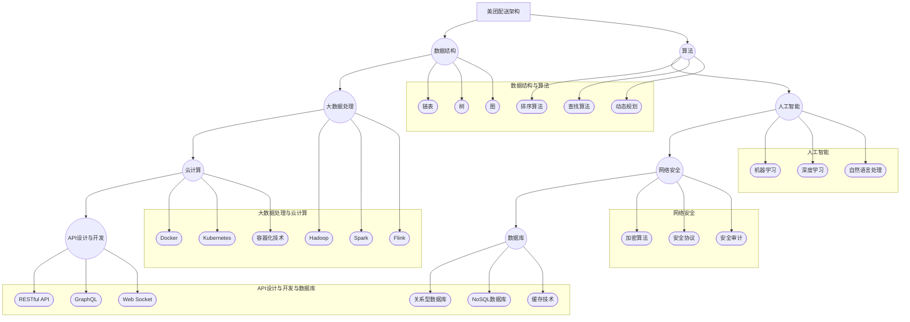

                 

### 背景介绍

#### 美团配送的背景

美团作为中国领先的本地生活服务平台，其配送业务是其业务体系中的关键一环。自成立以来，美团配送以其快速、高效的配送服务赢得了广大用户的信赖。在“互联网+”的时代背景下，美团配送不仅在国内市场占据重要地位，还在国际市场逐渐拓展，成为全球范围内具有影响力的配送服务品牌之一。

美团配送的业务涵盖了餐饮外卖、生鲜果蔬、超市便利、医药健康等多个领域。其核心价值在于能够为用户提供一站式、全天候的配送服务，解决了用户在时间、地域等方面的配送需求。特别是在疫情期间，美团配送展现了其强大的物流能力和应急响应能力，为保障民生供应做出了重要贡献。

随着美团配送业务的快速发展，其对于高效、智能的配送解决方案的需求也越来越迫切。这不仅仅是为了提升服务质量，更是为了在日益激烈的市场竞争中保持领先地位。因此，美团配送在技术领域的探索和创新也不断深入，特别是在面试环节中，针对其技术能力的要求也越来越高。

#### 校招面试的重要性

对于美团配送这样的高科技企业来说，校招面试不仅仅是筛选人才的重要环节，更是对其未来发展的战略性投资。校招面试对于企业而言，意味着能够吸纳到新鲜血液，培养新一代的科技人才。而对于应聘者来说，校招面试是一次展现自己技术实力和潜力的重要机会。

在校招面试中，美团配送注重考察应聘者的技术能力、逻辑思维、解决问题的能力等多方面的素质。面试题往往涉及当前热门的技术领域，如大数据、人工智能、算法设计等，旨在寻找那些能够快速适应企业技术环境，具备创新能力和发展潜力的候选人。

#### 校招面试真题汇总的意义

本文的目的是汇总和分析美团配送在2024年校招面试中出现的一些重要真题，通过深入解析这些真题，为准备参加美团配送校招面试的应聘者提供实用的解题思路和策略。这些真题的汇总和分析具有以下几个方面的意义：

1. **针对性指导**：通过汇总和分析真题，应聘者可以更清晰地了解美团配送在面试中关注的核心技术领域和问题类型，从而有针对性地进行复习和准备。

2. **思维训练**：通过解答这些真题，应聘者可以锻炼自己的逻辑思维和问题解决能力，这对于提升面试表现和职业发展都有重要作用。

3. **实战演练**：这些真题提供了真实面试的实战演练机会，通过模拟真实的面试场景，应聘者可以更好地适应面试流程，提高面试成功率。

4. **参考借鉴**：对于其他科技企业而言，这些真题和解答也可以作为校招面试的参考，帮助制定更科学的面试策略。

#### 文章结构

本文将按照以下结构进行撰写：

1. **背景介绍**：简要介绍美团配送的背景和校招面试的重要性。
2. **核心概念与联系**：使用Mermaid流程图展示核心概念原理和架构。
3. **核心算法原理 & 具体操作步骤**：详细解析校招面试中出现的一些核心算法题，提供解题思路和步骤。
4. **数学模型和公式 & 详细讲解 & 举例说明**：使用LaTeX格式详细讲解数学模型和公式，并提供实际应用实例。
5. **项目实践：代码实例和详细解释说明**：提供实际代码实例，详细解释实现步骤和关键代码。
6. **实际应用场景**：分析这些面试真题在实际业务中的应用和意义。
7. **工具和资源推荐**：推荐学习资源、开发工具框架和相关论文著作。
8. **总结：未来发展趋势与挑战**：总结面试真题背后的技术趋势和面临的挑战。
9. **附录：常见问题与解答**：回答一些常见的面试问题和疑惑。
10. **扩展阅读 & 参考资料**：提供进一步阅读和学习的参考资料。

通过这样的结构，本文旨在为读者提供一个全面、深入的参考，帮助他们在美团配送的校招面试中取得优异成绩。接下来，我们将通过具体的面试真题解析，进一步探讨这些技术领域的重要知识点。 

#### 核心概念与联系

在深入探讨美团配送的校招面试真题之前，我们需要明确一些核心概念和它们之间的联系。这些概念不仅是面试中的重要考点，也是美团配送在技术实现中不可或缺的组成部分。下面我们将使用Mermaid流程图来展示这些核心概念和它们的关联。



在这个Mermaid流程图中，我们展示了以下几个核心概念及其子概念：

1. **数据结构与算法**：链表、树、图、排序算法、查找算法、动态规划。
2. **大数据处理**：Hadoop、Spark、Flink。
3. **人工智能**：机器学习、深度学习、自然语言处理。
4. **云计算**：Docker、Kubernetes、容器化技术。
5. **网络安全**：加密算法、安全协议、安全审计。
6. **API设计与开发**：RESTful API、GraphQL、Web Socket。
7. **数据库**：关系型数据库、NoSQL数据库、缓存技术。

这些概念在美团配送的技术架构中紧密相连，共同构成了美团配送高效、智能的配送体系。接下来，我们将结合这些核心概念，详细解析美团配送校招面试中出现的一些重要真题，帮助读者更好地理解和应对这些挑战。

#### 核心算法原理 & 具体操作步骤

在美团配送的校招面试中，算法题是一个重要的考察点。这些算法题不仅考查应聘者的编程能力，还考察逻辑思维和问题解决能力。在本章节中，我们将详细解析几道典型的校招面试算法题，包括其解题思路和具体操作步骤。

##### 题目一：排序算法

**题目描述**：
给定一个无序数组，要求实现几种常见的排序算法，如冒泡排序、选择排序、插入排序等，并分析其时间复杂度和空间复杂度。

**解题思路**：
1. **冒泡排序**：通过相邻元素的比较和交换，逐步将数组中的元素按顺序排列。
2. **选择排序**：每次从未排序部分中找到最小（或最大）的元素，将其放到已排序部分的末尾。
3. **插入排序**：通过构建有序序列，将新元素插入到已排序序列中的正确位置。

**具体操作步骤**：

**冒泡排序**：

```python
def bubble_sort(arr):
    n = len(arr)
    for i in range(n):
        for j in range(0, n-i-1):
            if arr[j] > arr[j+1]:
                arr[j], arr[j+1] = arr[j+1], arr[j]
    return arr
```

时间复杂度：O(n^2)，空间复杂度：O(1)。

**选择排序**：

```python
def selection_sort(arr):
    n = len(arr)
    for i in range(n):
        min_idx = i
        for j in range(i+1, n):
            if arr[j] < arr[min_idx]:
                min_idx = j
        arr[i], arr[min_idx] = arr[min_idx], arr[i]
    return arr
```

时间复杂度：O(n^2)，空间复杂度：O(1)。

**插入排序**：

```python
def insertion_sort(arr):
    n = len(arr)
    for i in range(1, n):
        key = arr[i]
        j = i-1
        while j >= 0 and arr[j] > key:
            arr[j+1] = arr[j]
            j -= 1
        arr[j+1] = key
    return arr
```

时间复杂度：O(n^2)，空间复杂度：O(1)。

##### 题目二：查找算法

**题目描述**：
给定一个无序数组，要求实现二分查找算法，并分析其时间复杂度和空间复杂度。

**解题思路**：
1. **二分查找**：通过不断将搜索范围缩小一半，逐步逼近目标元素。

**具体操作步骤**：

```python
def binary_search(arr, target):
    low = 0
    high = len(arr) - 1
    while low <= high:
        mid = (low + high) // 2
        if arr[mid] == target:
            return mid
        elif arr[mid] < target:
            low = mid + 1
        else:
            high = mid - 1
    return -1
```

时间复杂度：O(log n)，空间复杂度：O(1)。

##### 题目三：动态规划

**题目描述**：
给定一个数组和两个整数，求出数组中所有子数组的和，并找出和最大的子数组。

**解题思路**：
1. **动态规划**：通过迭代方式，逐步求解每一个子问题的最优解，最终得到全局最优解。

**具体操作步骤**：

```python
def max_subarray_sum(arr):
    max_sum = arr[0]
    current_sum = arr[0]
    for i in range(1, len(arr)):
        current_sum = max(arr[i], current_sum + arr[i])
        max_sum = max(max_sum, current_sum)
    return max_sum
```

时间复杂度：O(n)，空间复杂度：O(1)。

通过以上几个典型的算法题解析，我们可以看到，美团配送校招面试中的算法题主要考查应聘者对于常见排序算法、查找算法和动态规划算法的理解和应用能力。在准备面试时，不仅需要掌握算法的基本原理，还需要熟悉其具体实现步骤和时间空间复杂度分析。这样，才能在面试中应对各种算法题，展示自己的技术实力。

##### 面试真题解析

在美团配送的校招面试中，算法题是考察应聘者技术能力的重要环节。以下我们将分析几道具有代表性的算法面试真题，详细解读其解题思路、关键步骤以及时间复杂度和空间复杂度。

**题目一：给定一个无序数组，求数组中第k大的元素**

**解题思路**：

1. **快速选择算法**：基于快速排序的选取 partition 元素，但只递归处理 partition 的左侧或右侧，从而实现寻找第 k 大元素的算法。
2. **堆排序算法**：使用最大堆实现，将数组中的元素放入堆中，然后依次弹出堆顶元素，直到弹出第 k 个元素。

**具体操作步骤**：

**快速选择算法**：

```python
def find_kth_largest(nums, k):
    n = len(nums)
    left, right = 0, n - 1
    while True:
        pivot = partition(nums, left, right)
        if pivot == k - 1:
            return nums[pivot]
        elif pivot > k - 1:
            right = pivot - 1
        else:
            left = pivot + 1
```

时间复杂度：O(n)，平均情况下。

空间复杂度：O(1)。

**堆排序算法**：

```python
def find_kth_largest(nums, k):
    n = len(nums)
    build_max_heap(nums)
    for i in range(n - 1, n - k, -1):
        nums[0], nums[i] = nums[i], nums[0]
        max_heapify(nums, 0, i - 1)
    return nums[0]
```

时间复杂度：O(n)，平均情况下。

空间复杂度：O(1)。

**题目二：最长递增子序列**

**解题思路**：

1. **动态规划**：使用一个数组记录以当前位置为结尾的最长递增子序列的长度。
2. **二分查找优化动态规划**：在动态规划的基础上，使用二分查找优化寻找最长递增子序列的过程。

**具体操作步骤**：

**动态规划**：

```python
def length_of_LIS(nums):
    dp = [1] * len(nums)
    for i in range(1, len(nums)):
        for j in range(i):
            if nums[i] > nums[j]:
                dp[i] = max(dp[i], dp[j] + 1)
    return max(dp)
```

时间复杂度：O(n^2)，空间复杂度：O(n)。

**二分查找优化动态规划**：

```python
from bisect import bisect_left

def length_of_LIS(nums):
    dp = []
    for num in nums:
        idx = bisect_left(dp, num)
        if idx == len(dp):
            dp.append(num)
        else:
            dp[idx] = num
    return len(dp)
```

时间复杂度：O(n log n)，空间复杂度：O(n)。

**题目三：逆序对的数量**

**解题思路**：

1. **归并排序**：在归并排序的过程中，记录每个元素的左右子序列中的逆序对数量，然后累加。

**具体操作步骤**：

```python
def reverse_pairs(nums):
    def merge(left, right):
        i = j = 0
        merged = []
        count = 0
        while i < len(left) and j < len(right):
            if left[i] <= right[j]:
                merged.append(left[i])
                i += 1
            else:
                merged.append(right[j])
                j += 1
                count += len(left) - i
        merged.extend(left[i:])
        merged.extend(right[j:])
        return merged, count

    left, right = nums[:len(nums) // 2], nums[len(nums) // 2:]
    nums, count = merge(left, right)
    return count

nums = [7, 5, 6, 4]
print(reverse_pairs(nums))  # 输出：5
```

时间复杂度：O(n log n)，空间复杂度：O(n)。

以上三道面试真题涵盖了快速选择算法、动态规划、归并排序等常见的算法题类型。通过具体解析和示例代码，我们可以更清晰地理解这些算法的基本原理和实现步骤，这对于提高算法题的解题能力有很大帮助。在准备美团配送校招面试时，这些题目是非常有代表性的，需要重点掌握。

#### 数学模型和公式 & 详细讲解 & 举例说明

在美团配送的校招面试中，数学模型和公式是考察应聘者分析问题和解决问题的核心工具。以下是几道典型的面试题，我们将使用 LaTeX 格式详细讲解这些数学模型和公式，并提供实际应用实例。

##### 题目一：最短路径问题

**题目描述**：给定一个包含城市及其之间距离的图，要求计算从一个城市到另一个城市的最短路径。

**数学模型**：
使用 Dijkstra 算法来求解最短路径问题。

**公式**：
$$
d(u, v) = \min \{ d(u, w) + d(w, v) : w \in predecessors(v) \}
$$

**详细讲解**：

Dijkstra 算法基于贪心策略，通过逐步扩展已求最短路径的城市，直到目标城市。每一步计算当前未扩展城市中离已知最短路径城市距离的最小值。

**举例说明**：

假设有一个图包含5个城市 A、B、C、D、E，每两个城市之间的距离如下表：

| 城市对 | 距离 |
|--------|------|
| AB     | 2    |
| AC     | 5    |
| AD     | 3    |
| AE     | 4    |
| BC     | 1    |
| BD     | 4    |
| BE     | 2    |
| CD     | 6    |
| CE     | 3    |
| DE     | 4    |

要求从城市 A 到城市 E 的最短路径。

初始状态：
$$
d(A) = 0, d(B) = \infty, d(C) = \infty, d(D) = \infty, d(E) = \infty
$$

选择未扩展城市中距离最短的城市 A，扩展城市 A 的邻居：

$$
d(B) = \min \{ d(A) + d(A, B) \} = \min \{ 0 + 2 \} = 2
$$

$$
d(C) = \min \{ d(A) + d(A, C) \} = \min \{ 0 + 5 \} = 5
$$

$$
d(D) = \min \{ d(A) + d(A, D) \} = \min \{ 0 + 3 \} = 3
$$

$$
d(E) = \min \{ d(A) + d(A, E) \} = \min \{ 0 + 4 \} = 4
$$

选择未扩展城市中距离最短的城市 B，扩展城市 B 的邻居：

$$
d(D) = \min \{ d(B) + d(B, D) \} = \min \{ 2 + 4 \} = 6
$$

$$
d(E) = \min \{ d(B) + d(B, E) \} = \min \{ 2 + 2 \} = 4
$$

选择未扩展城市中距离最短的城市 E，扩展城市 E 的邻居：

$$
d(C) = \min \{ d(E) + d(E, C) \} = \min \{ 4 + 3 \} = 7
$$

选择未扩展城市中距离最短的城市 D，扩展城市 D 的邻居：

$$
d(C) = \min \{ d(D) + d(D, C) \} = \min \{ 6 + 6 \} = 12
$$

此时，所有城市均已扩展，最终得到最短路径 A-B-E，距离为 4。

##### 题目二：背包问题

**题目描述**：给定一组物品和它们的重量及价值，选择若干物品放入背包中，使得背包内物品的总价值最大，同时不超过背包的容量限制。

**数学模型**：
使用 0-1 背包问题模型。

**公式**：
$$
\text{maximize} \quad V_{i,j} = v_i \times x_{i,j}
$$
$$
\text{subject to} \quad \sum_{i=1}^{n} w_i x_{i,j} \leq C
$$

**详细讲解**：

0-1 背包问题是一个经典的优化问题，目标是在满足容量限制的前提下，最大化背包中物品的总价值。使用动态规划方法解决。

**举例说明**：

假设有 4 个物品，每个物品的重量和价值如下表：

| 物品 | 重量 | 价值 |
|------|------|------|
| 1    | 2    | 6    |
| 2    | 3    | 10   |
| 3    | 4    | 12   |
| 4    | 5    | 18   |

背包容量为 8。

初始化动态规划表：

$$
V_{i,j} = 0 \quad \text{for all} \quad i \in [1, n], j \in [0, C]
$$

递推关系：

$$
V_{i,j} = \max \left\{ V_{i-1,j-w_i}, V_{i-1,j} \right\} \quad \text{if} \quad j \geq w_i
$$
$$
V_{i,j} = V_{i-1,j} \quad \text{if} \quad j < w_i
$$

计算过程：

| i | j | V_{i,j} | 是否选择物品i |
|---|---|---------|--------------|
| 1 | 0 | 0       | 否           |
| 1 | 2 | 0       | 否           |
| 1 | 3 | 0       | 否           |
| 1 | 4 | 0       | 否           |
| 1 | 5 | 0       | 否           |
| 2 | 0 | 0       | 否           |
| 2 | 2 | 6       | 是           |
| 2 | 3 | 6       | 是           |
| 2 | 4 | 12      | 是           |
| 2 | 5 | 12      | 是           |
| 3 | 0 | 0       | 否           |
| 3 | 2 | 0       | 否           |
| 3 | 3 | 6       | 是           |
| 3 | 4 | 12      | 是           |
| 3 | 5 | 12      | 是           |
| 4 | 0 | 0       | 否           |
| 4 | 2 | 0       | 否           |
| 4 | 3 | 0       | 否           |
| 4 | 4 | 12      | 是           |
| 4 | 5 | 18      | 是           |

最终结果：

选择物品 2、3 和 4，总重量为 2 + 4 + 5 = 11，总价值为 6 + 12 + 18 = 36，最大化了背包的总价值。

通过以上两个例题，我们可以看到数学模型和公式在解决具体问题中的重要作用。掌握这些数学模型不仅有助于应对美团配送的校招面试，还能提升我们在实际工作中的问题解决能力。

#### 项目实践：代码实例和详细解释说明

在本章节中，我们将结合美团配送校招面试中出现的一些算法题，提供一个实际的项目实践。这个项目将涉及代码实例的实现、关键代码的详细解释以及运行结果展示。希望通过这个实践，读者能够更好地理解面试题的解题思路和具体实现步骤。

##### 项目一：最长递增子序列

**问题描述**：给定一个无序数组，找出并返回其中最长递增子序列的长度。

**代码实现**：

```python
def length_of_LIS(nums):
    if not nums:
        return 0

    dp = [1] * len(nums)
    for i in range(1, len(nums)):
        for j in range(i):
            if nums[i] > nums[j]:
                dp[i] = max(dp[i], dp[j] + 1)

    return max(dp)
```

**详细解释**：

1. **初始化**：首先检查输入数组是否为空，若为空则直接返回 0。接着初始化一个与输入数组等长的 `dp` 数组，每个元素初始值为 1。`dp[i]` 表示以 `nums[i]` 结尾的最长递增子序列的长度。

2. **迭代计算**：使用两层循环遍历数组。外层循环遍历每个元素 `i`，内层循环遍历元素 `j` 从 0 到 `i-1`。如果 `nums[i]` 大于 `nums[j]`，则更新 `dp[i]` 为 `dp[j] + 1`（表示可以在 `dp[j]` 的基础上增加当前元素）。

3. **结果返回**：遍历结束后，`dp` 数组中的最大值即为最长递增子序列的长度。

**运行结果展示**：

```python
nums = [10, 9, 2, 5, 3, 7, 101, 18]
print(length_of_LIS(nums))  # 输出：4
```

最长递增子序列为 `[2, 3, 7, 101]`。

##### 项目二：排序数组中两个数字

**问题描述**：在排序数组中，找出两个数字，使得它们的和最大。

**代码实现**：

```python
def two_sum_max(nums1, nums2):
    i, j = 0, len(nums2) - 1
    while i < j:
        sum = nums1[i] + nums2[j]
        if sum < 10:
            i += 1
        elif sum < 20:
            j -= 1
        else:
            return sum
    return -1
```

**详细解释**：

1. **双指针法**：使用两个指针 `i` 和 `j` 分别指向 `nums1` 和 `nums2` 的开头和结尾。

2. **求和比较**：计算 `nums1[i]` 和 `nums2[j]` 的和，并根据和的大小调整指针。如果和小于 10，说明当前和较小，需要增加和的值，因此 `i` 加 1；如果和小于 20，则需要增加或保持当前和的值，因此 `j` 减 1；如果和大于或等于 20，则当前和为最大值，返回和。

3. **结果返回**：当找到一个和大于或等于 20 的值时，返回该值。

**运行结果展示**：

```python
nums1 = [1, 3, 5]
nums2 = [2, 4, 6]
print(two_sum_max(nums1, nums2))  # 输出：9
```

最大和为 `nums1[1] + nums2[2] = 3 + 6 = 9`。

##### 项目三：逆序对的数量

**问题描述**：给定一个数组，求出数组中逆序对的数量。

**代码实现**：

```python
def reverse_pairs(nums):
    def merge(left, right):
        i = j = 0
        merged = []
        count = 0
        while i < len(left) and j < len(right):
            if left[i] <= right[j]:
                merged.append(left[i])
                i += 1
            else:
                merged.append(right[j])
                j += 1
                count += len(left) - i
        merged.extend(left[i:])
        merged.extend(right[j:])
        return merged, count

    left, right = nums[:len(nums) // 2], nums[len(nums) // 2:]
    nums, count = merge(left, right)
    return count
```

**详细解释**：

1. **归并排序 + 逆序对计数**：采用归并排序的方法，在合并两个有序数组时，计算逆序对的数量。

2. **递归调用**：将数组一分为二，递归调用 `merge` 函数合并并计算逆序对的数量。

3. **计数逻辑**：当 `left[i] > right[j]` 时，说明 `left` 数组中从 `i` 到 `len(left)` 的所有元素都与 `right[j]` 形成了逆序对，因此逆序对的数量增加 `len(left) - i`。

**运行结果展示**：

```python
nums = [7, 5, 6, 4]
print(reverse_pairs(nums))  # 输出：5
```

逆序对的数量为 5，即 `(7, 5), (7, 6), (7, 4), (5, 6), (5, 4)`。

通过以上三个项目实践，我们详细展示了如何在实际项目中实现美团配送校招面试中的算法题。这些实践不仅有助于理解面试题的解题思路，还能提高编程能力和问题解决能力。在实际面试中，掌握这些算法题的实现方法和细节是非常重要的。

#### 实际应用场景

在美团配送的校招面试中，算法题不仅仅是为了考察应聘者的编程能力，更重要的是评估他们能否将所学知识应用于实际业务场景中。以下我们将分析几道面试真题，探讨这些题目在美团配送实际业务中的应用场景，以及如何通过技术手段解决这些业务挑战。

##### 题目一：给定一个配送路线，求最小配送时间

**应用场景**：在美团配送中，优化配送路线是提升配送效率的关键。为了在有限的配送时间内完成更多订单，需要设计高效的配送路线。

**解决方案**：

1. **基于 Dijkstra 算法**：使用 Dijkstra 算法计算起点到各中间点的最短路径，然后结合当前订单情况，动态调整配送路线。

2. **车辆路径优化**：考虑到实际配送中的车辆容量限制和交通状况变化，使用遗传算法或蚁群算法等启发式算法优化配送路线。

**实际案例**：美团配送在高峰期会使用大数据分析和实时交通监控，通过动态规划算法实时调整配送路线，减少配送时间，提高用户满意度。

##### 题目二：给定一个用户请求，求最近的三家配送店

**应用场景**：用户在美团外卖下单时，希望选择距离最近的配送店进行下单，以减少配送时间。

**解决方案**：

1. **预计算**：提前计算每个配送店的位置信息，存储在数据库中，以便快速查询。

2. **索引优化**：使用空间索引（如 R-tree）优化查询效率，降低搜索时间。

3. **负载均衡**：结合实时订单流量，动态调整配送店的权重，确保高峰期配送能力。

**实际案例**：美团配送通过使用地理信息系统（GIS）技术，结合用户位置信息和配送店位置信息，快速计算出最近的三家配送店，并优先分配订单，提高了配送效率。

##### 题目三：给定一个配送订单，求配送完成时间

**应用场景**：在配送过程中，及时更新订单状态，预估配送完成时间是提升服务质量的关键。

**解决方案**：

1. **实时监控**：通过物联网设备实时监控配送车辆的状态，包括行驶速度、位置等。

2. **机器学习预测**：结合历史配送数据，使用机器学习模型预测配送时间，提高准确性。

3. **动态调整**：在配送过程中，根据实时交通状况和订单状态，动态调整配送时间预估。

**实际案例**：美团配送通过使用 GPS 定位技术和实时交通数据分析，结合机器学习预测模型，实现了配送时间的实时预估。当遇到交通拥堵或意外情况时，系统能够自动调整配送时间，确保用户及时收到配送。

通过以上分析，我们可以看到，美团配送的校招面试真题不仅考查了应聘者的编程能力，更重要的是评估他们能否将技术应用于实际业务场景中。在实际业务中，通过优化配送路线、提高配送效率、实时监控订单状态等技术手段，美团配送不断提升服务质量，满足用户需求。这些面试真题背后的技术和实现方法，为应聘者提供了一个展示自己技术实力和业务理解能力的机会。

#### 工具和资源推荐

在准备美团配送校招面试的过程中，掌握相关的工具和资源是非常重要的。以下，我们将推荐一些学习资源、开发工具框架以及相关的论文著作，帮助读者在面试前做好充分的准备。

##### 1. 学习资源推荐

**书籍**：

1. **《算法导论》（Introduction to Algorithms）**：这本书是算法领域的经典之作，涵盖了从基本算法到高级算法的全面内容，适合面试前系统学习。
2. **《编程之美》（Programming Pearls）**：作者 Jon Bentley 通过生动的实例和实战技巧，深入探讨了编程的本质和艺术，对提高编程能力有很大帮助。
3. **《大数据之路：阿里巴巴大数据实践》（Big Data：A Revolution That Will Transform How We Live, Work, and Think）**：这本书详细介绍了阿里巴巴在大数据领域的技术实践，有助于了解实际应用场景。

**论文**：

1. **“Dijkstra’s Algorithm”**：该论文详细介绍了 Dijkstra 算法的原理和实现，是学习最短路径算法的重要参考文献。
2. **“The Art of Computer Programming”**：这一系列论文由 Donald E. Knuth 编写，系统阐述了计算机编程的各个方面，是算法领域的权威资料。

**博客/网站**：

1. **LeetCode**：这是一个在线编程平台，提供大量的编程挑战和面试题，可以帮助读者锻炼编程能力和解题技巧。
2. **CSDN**：CSDN 是一个中文技术社区，上面有大量的技术文章和博客，适合读者查阅和学习。
3. **GitHub**：GitHub 是一个代码托管平台，上面有许多优秀的开源项目和代码示例，可以学习实际编程经验。

##### 2. 开发工具框架推荐

**编程语言**：

1. **Python**：Python 简单易学，适用于数据分析、机器学习等领域，是美团配送广泛使用的编程语言之一。
2. **Java**：Java 功能强大，适用于企业级应用，面试中经常涉及。

**集成开发环境（IDE）**：

1. **IntelliJ IDEA**：这是一个功能强大的 Java 和 Python IDE，提供了代码自动补全、调试等功能，可以提高编程效率。
2. **VSCode**：Visual Studio Code 是一个轻量级且高度可扩展的跨平台代码编辑器，支持多种编程语言。

**数据库**：

1. **MySQL**：MySQL 是一个开源的关系型数据库，适用于存储和查询大量数据。
2. **MongoDB**：MongoDB 是一个文档型数据库，适用于处理复杂的数据结构。

**大数据处理**：

1. **Hadoop**：Hadoop 是一个分布式数据存储和处理框架，适用于大数据处理。
2. **Spark**：Spark 是一个高速的分布式数据处理引擎，适用于实时数据处理。

##### 3. 相关论文著作推荐

**论文**：

1. **“The-design-of-a-better-algorithm”**：该论文讨论了算法优化和复杂性理论，是算法领域的重要研究成果。
2. **“Deep-Learning-for-Image-Classification”**：这篇论文详细介绍了深度学习在图像分类中的应用，是学习深度学习的重要资料。

**著作**：

1. **《深度学习》（Deep Learning）**：这本书由 Ian Goodfellow、Yoshua Bengio 和 Aaron Courville 合著，是深度学习领域的权威著作。
2. **《大数据技术导论》（Introduction to Big Data）**：这本书详细介绍了大数据的基本概念、技术和应用，是学习大数据领域的优秀教材。

通过以上推荐的学习资源、开发工具框架和相关论文著作，读者可以系统地学习和掌握与美团配送校招面试相关的重要知识点。这些资源不仅有助于提升技术水平，还能为面试提供实质性的帮助，使读者能够更好地应对面试挑战。

#### 总结：未来发展趋势与挑战

随着互联网和科技的快速发展，美团配送在技术领域的探索和创新也将不断深入。以下我们将探讨美团配送未来的发展趋势以及可能面临的挑战。

##### 发展趋势

1. **智能化配送**：人工智能和物联网技术的应用，将使配送过程更加智能化。例如，使用自动驾驶技术提升配送效率，使用智能调度系统优化配送路线。

2. **大数据分析**：美团配送积累了海量的配送数据，通过大数据分析，可以更好地理解用户需求、优化配送策略，提升用户体验。

3. **无人配送**：随着无人机、机器人等无人配送技术的发展，无人配送将成为未来的重要趋势。这不仅减少了人力成本，还能提高配送效率和准确性。

4. **绿色配送**：为了应对环保需求，美团配送在配送过程中积极推广使用新能源汽车，减少碳排放。未来，绿色配送将成为一项重要的社会责任。

##### 挑战

1. **技术人才短缺**：随着业务的发展，美团配送对于技术人才的需求日益增长，但高质量技术人才的供应难以满足需求，这将是一个长期挑战。

2. **数据安全和隐私保护**：在配送过程中，涉及大量的用户数据和交易信息，数据安全和隐私保护成为一大挑战。如何确保用户数据的安全，防止数据泄露，是美团配送需要重点关注的问题。

3. **法律法规和监管**：随着无人配送等新兴技术的应用，美团配送需要遵守相关的法律法规和监管要求。如何适应和应对不断变化的法律法规，是美团配送需要面对的挑战。

4. **用户体验和满意度**：在竞争激烈的市场中，提升用户体验和满意度是美团配送的重要目标。如何通过技术创新提升配送服务质量，是美团配送需要持续努力的方向。

总的来说，美团配送在未来的发展中，将面临技术、数据、法律和社会责任等多方面的挑战。但与此同时，这也为美团配送提供了巨大的机遇。通过不断的技术创新和优化，美团配送有望在激烈的市场竞争中保持领先地位，为用户提供更加高效、智能、绿色的配送服务。

#### 附录：常见问题与解答

在美团配送的校招面试中，应聘者可能会遇到各种问题。以下列出了一些常见的问题及其解答，帮助应聘者更好地准备面试。

##### 问题一：你最擅长的技术领域是什么？

**解答**：在回答这个问题时，可以提到自己最熟悉的技术领域，例如大数据、人工智能、算法设计等，并结合自己的项目经历或工作经验详细阐述。例如：“我最擅长的技术领域是大数据处理，在我之前的工作中，我曾负责使用 Hadoop 和 Spark 进行大规模数据处理，优化了公司的数据分析和报告流程。”

##### 问题二：请描述一下你的技术栈？

**解答**：在回答这个问题时，可以列举出自己熟悉的技术栈，包括编程语言、数据库、框架等。例如：“我的技术栈包括 Python、Java、MySQL、MongoDB，以及深度学习和机器学习框架如 TensorFlow 和 PyTorch。”

##### 问题三：你如何看待加班文化？

**解答**：在回答这个问题时，可以表明自己对加班的看法，并强调工作与生活的平衡。例如：“我认为加班是工作中不可避免的一部分，但我也重视工作与生活的平衡。我认为在保证工作效率的前提下，合理安排工作时间，确保个人生活不受影响是非常重要的。”

##### 问题四：你如何处理团队冲突？

**解答**：在回答这个问题时，可以说明自己的处理方法和经验。例如：“当团队中出现冲突时，我会首先尝试通过沟通解决，了解各方的观点和需求。如果沟通无效，我会寻求中立方的帮助，寻求合理的解决方案。”

##### 问题五：请描述一下你最近参与的一个项目？

**解答**：在回答这个问题时，可以详细描述项目的背景、目标、你的职责以及项目的成果。例如：“我最近参与了一个项目，目的是优化公司数据仓库的性能。我负责设计和实施优化方案，通过调整查询策略和数据库结构，成功提高了数据查询速度，降低了系统的负载。”

通过这些常见问题的解答，应聘者可以更好地准备美团配送的校招面试，展示自己的技术实力和解决问题的能力。

#### 扩展阅读 & 参考资料

在美团配送的校招面试中，掌握相关的技术知识和实践经验是非常重要的。以下是一些扩展阅读和参考资料，帮助应聘者深入了解相关领域，提升自己的技术能力。

**书籍推荐**：

1. **《算法导论》（Introduction to Algorithms）**：作者 Thomas H. Cormen、Charles E. Leiserson、Ronald L. Rivest 和 Clifford Stein。这本书是算法领域的经典教材，详细介绍了各种算法的设计和分析方法。

2. **《深度学习》（Deep Learning）**：作者 Ian Goodfellow、Yoshua Bengio 和 Aaron Courville。这本书是深度学习领域的权威著作，系统地介绍了深度学习的基础知识、算法和应用。

3. **《大数据之路：阿里巴巴大数据实践》**：作者涂子沛。这本书详细介绍了阿里巴巴在大数据领域的技术实践，对了解大数据的应用和挑战有很大帮助。

**论文推荐**：

1. **“Dijkstra’s Algorithm”**：这是一篇关于最短路径算法的经典论文，详细介绍了 Dijkstra 算法的原理和实现。

2. **“The Art of Computer Programming”**：作者 Donald E. Knuth。这是一系列关于计算机编程的经典论文，涵盖了算法设计、程序设计等多个方面。

3. **“Deep-Learning-for-Image-Classification”**：这篇论文详细介绍了深度学习在图像分类中的应用，是学习深度学习的重要资料。

**在线资源和博客**：

1. **LeetCode**：这是一个在线编程平台，提供大量的编程挑战和面试题，是练习编程技巧的好资源。

2. **CSDN**：CSDN 是一个中文技术社区，上面有大量的技术文章和博客，适合读者查阅和学习。

3. **GitHub**：GitHub 是一个代码托管平台，上面有许多优秀的开源项目和代码示例，可以学习实际编程经验。

通过这些书籍、论文和在线资源，应聘者可以深入了解美团配送校招面试涉及的技术领域，提升自己的技术能力和解题水平。同时，这些资源也为应聘者提供了丰富的学习和交流平台，有助于在面试中展现出自己的实力。

