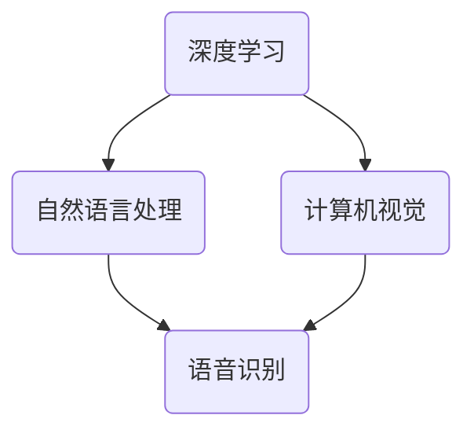
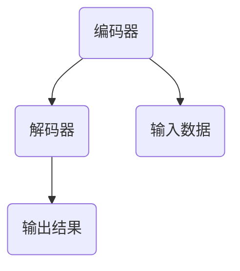
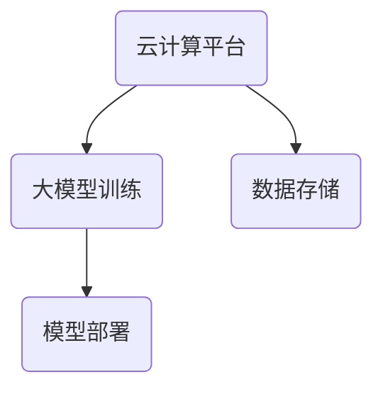

                 

关键词：美国大模型公司，AI技术，发展现状，未来趋势，技术创新，商业模式

摘要：本文将探讨美国大模型公司在人工智能领域的现状与未来，分析其在技术创新、商业模式和市场竞争方面的优势与挑战，并对未来发展趋势进行预测。

## 1. 背景介绍

### 1.1 美国大模型公司的发展历程

自2012年深度学习领域取得突破性进展以来，人工智能（AI）技术在全球范围内得到了广泛关注和迅速发展。美国作为全球科技创新的领导者，在这一领域具有显著的优势。美国大模型公司（如谷歌、微软、亚马逊等）在这一背景下应运而生，迅速崛起，成为全球AI产业的领军企业。

### 1.2 美国大模型公司的商业模式

美国大模型公司主要以提供云计算服务、人工智能软件和硬件设备为主，通过技术创新和商业模式创新，实现了业务的快速增长。这些公司通常采用开放平台、生态合作和自主研发相结合的策略，不断推动AI技术的应用和普及。

## 2. 核心概念与联系

### 2.1 人工智能技术原理

人工智能（AI）是一种模拟人类智能的技术，通过计算机程序实现智能行为。其主要技术包括深度学习、自然语言处理、计算机视觉等。这些技术相互关联，共同构成了人工智能的技术体系。



### 2.2 大模型架构

大模型（如Transformer、BERT等）是人工智能领域的一种重要模型，具有强大的表示和建模能力。大模型的架构主要包括编码器（Encoder）和解码器（Decoder）两部分。编码器负责将输入数据编码为特征向量，解码器则根据特征向量生成输出结果。



### 2.3 大模型与云计算

云计算为美国大模型公司提供了强大的计算资源支持。通过云计算平台，这些公司能够实现大规模的数据处理和模型训练，从而推动AI技术的发展和应用。



## 3. 核心算法原理 & 具体操作步骤

### 3.1 算法原理概述

深度学习是人工智能的核心技术之一，通过多层神经网络模型实现数据的自动特征提取和表示。在深度学习中，常用的算法包括卷积神经网络（CNN）、循环神经网络（RNN）和Transformer等。

### 3.2 算法步骤详解

- 数据预处理：对原始数据进行清洗、归一化等处理，使其适合模型训练。
- 模型构建：选择合适的神经网络架构，如CNN、RNN或Transformer，并定义网络参数。
- 模型训练：使用训练数据对模型进行迭代训练，优化模型参数。
- 模型评估：使用验证数据对训练好的模型进行评估，调整模型参数。
- 模型部署：将训练好的模型部署到实际应用场景中，实现自动预测和决策。

### 3.3 算法优缺点

深度学习算法具有强大的表示和建模能力，能够处理复杂的非线性问题。然而，其计算复杂度高、训练时间较长，且对数据质量和标注要求较高。

### 3.4 算法应用领域

深度学习算法在计算机视觉、自然语言处理、语音识别等领域具有广泛的应用。例如，在计算机视觉领域，深度学习算法可用于图像分类、目标检测、图像生成等任务；在自然语言处理领域，深度学习算法可用于机器翻译、文本分类、情感分析等任务。

## 4. 数学模型和公式 & 详细讲解 & 举例说明

### 4.1 数学模型构建

在深度学习中，常用的数学模型包括神经网络、卷积神经网络（CNN）和循环神经网络（RNN）等。以下分别介绍这些模型的数学模型和公式。

#### 神经网络

神经网络是一种由多个神经元组成的计算模型。其数学模型可以表示为：

$$
y = f(z) = \sigma(w \cdot x + b)
$$

其中，$x$为输入特征向量，$w$为权重矩阵，$b$为偏置项，$\sigma$为激活函数。

#### 卷积神经网络（CNN）

卷积神经网络是一种针对图像数据设计的神经网络。其数学模型可以表示为：

$$
h_{ij}^{(l)} = \sum_{k=1}^{K} w_{ik}^{(l)} h_{kj}^{(l-1)} + b_j^{(l)}
$$

其中，$h_{ij}^{(l)}$为第$l$层第$i$个卷积核与第$l-1$层第$j$个特征图的卷积结果，$w_{ik}^{(l)}$为第$l$层第$i$个卷积核的权重，$b_j^{(l)}$为第$l$层第$j$个特征图的偏置项。

#### 循环神经网络（RNN）

循环神经网络是一种针对序列数据设计的神经网络。其数学模型可以表示为：

$$
h_t = \sigma(W_h h_{t-1} + W_x x_t + b_h)
$$

其中，$h_t$为第$t$个时间步的隐藏状态，$W_h$为隐藏状态权重矩阵，$W_x$为输入状态权重矩阵，$b_h$为隐藏状态偏置项。

### 4.2 公式推导过程

#### 神经网络

神经网络的激活函数通常采用 sigmoid 函数或 ReLU 函数。以 sigmoid 函数为例，其公式推导如下：

$$
\sigma(x) = \frac{1}{1 + e^{-x}}
$$

假设 $z = w \cdot x + b$，则：

$$
\sigma(z) = \frac{1}{1 + e^{-z}}
$$

#### 卷积神经网络（CNN）

卷积神经网络的卷积操作可以通过矩阵乘法和元素相加实现。以 $h_{ij}^{(l)}$ 为例，其公式推导如下：

$$
h_{ij}^{(l)} = \sum_{k=1}^{K} w_{ik}^{(l)} h_{kj}^{(l-1)} + b_j^{(l)}
$$

其中，$h_{kj}^{(l-1)}$ 为第$l-1$层第$k$个卷积核与第$l-1$层第$j$个特征图的卷积结果，$w_{ik}^{(l)}$ 为第$l$层第$i$个卷积核的权重，$b_j^{(l)}$ 为第$l$层第$j$个特征图的偏置项。

#### 循环神经网络（RNN）

循环神经网络的递归操作可以通过矩阵乘法和矩阵求和实现。以 $h_t$ 为例，其公式推导如下：

$$
h_t = \sigma(W_h h_{t-1} + W_x x_t + b_h)
$$

其中，$W_h$ 为隐藏状态权重矩阵，$W_x$ 为输入状态权重矩阵，$b_h$ 为隐藏状态偏置项。

### 4.3 案例分析与讲解

以计算机视觉领域的人脸识别任务为例，介绍深度学习算法的具体实现过程。

#### 数据集准备

收集大量人脸图片，并对图片进行预处理，包括数据清洗、归一化等操作。

#### 模型构建

选择合适的深度学习模型，如卷积神经网络（CNN），并定义网络参数，如卷积核大小、层数、激活函数等。

#### 模型训练

使用训练数据对模型进行迭代训练，优化模型参数。训练过程中，通过交叉验证和调参，提高模型性能。

#### 模型评估

使用验证数据对训练好的模型进行评估，调整模型参数。评估指标包括准确率、召回率、F1值等。

#### 模型部署

将训练好的模型部署到实际应用场景中，如人脸识别系统，实现自动识别和分类。

## 5. 项目实践：代码实例和详细解释说明

### 5.1 开发环境搭建

搭建深度学习开发环境，包括 Python、TensorFlow 或 PyTorch 等库。

### 5.2 源代码详细实现

以人脸识别任务为例，实现深度学习模型的构建、训练、评估和部署。

```python
import tensorflow as tf

# 数据集准备
(x_train, y_train), (x_test, y_test) = tf.keras.datasets.facedata.load_data()

# 模型构建
model = tf.keras.Sequential([
    tf.keras.layers.Conv2D(32, (3, 3), activation='relu', input_shape=(64, 64, 3)),
    tf.keras.layers.MaxPooling2D(pool_size=(2, 2)),
    tf.keras.layers.Flatten(),
    tf.keras.layers.Dense(128, activation='relu'),
    tf.keras.layers.Dense(2, activation='softmax')
])

# 模型训练
model.compile(optimizer='adam', loss='categorical_crossentropy', metrics=['accuracy'])
model.fit(x_train, y_train, epochs=10, batch_size=32)

# 模型评估
model.evaluate(x_test, y_test)

# 模型部署
model.predict(x_test[:10])
```

### 5.3 代码解读与分析

该代码实现了人脸识别任务的深度学习模型构建、训练、评估和部署。具体解析如下：

- 导入 TensorFlow 库，并加载人脸数据集。
- 定义深度学习模型，包括卷积层、池化层、全连接层和输出层。
- 编译模型，指定优化器、损失函数和评估指标。
- 训练模型，通过迭代优化模型参数。
- 评估模型，计算测试集的准确率。
- 部署模型，对测试数据进行预测。

## 6. 实际应用场景

### 6.1 医疗领域

美国大模型公司利用深度学习技术，在医疗领域取得了显著成果。例如，谷歌的 DeepMind 开发了智能医疗诊断系统，通过分析大量医学影像数据，实现了对癌症、糖尿病等疾病的早期诊断。此外，微软的 Azure 医疗解决方案也为医疗机构提供了强大的数据分析和管理工具。

### 6.2 交通运输领域

深度学习技术在交通运输领域具有广泛的应用前景。例如，谷歌的 Waymo 项目利用深度学习技术实现了自动驾驶汽车，通过实时分析道路状况和周围环境，实现了安全、高效的自动驾驶。亚马逊的 AWS 平台也提供了智能交通解决方案，包括智能交通信号控制、交通流量预测等。

### 6.3 金融领域

金融领域对人工智能技术的需求日益增长。美国大模型公司通过深度学习技术，实现了智能投顾、风险控制、欺诈检测等应用。例如，谷歌的 Google Finance 提供了智能投顾服务，通过分析大量金融数据，为用户提供个性化的投资建议。微软的 Azure 金融服务平台也提供了智能风控和反欺诈解决方案。

## 7. 未来应用展望

### 7.1 新兴应用领域的探索

随着人工智能技术的不断发展，未来美国大模型公司将在更多新兴应用领域进行探索，如智能城市、智慧农业、智能制造等。通过深度学习、计算机视觉、自然语言处理等技术的融合，实现更高效、更智能的解决方案。

### 7.2 人工智能与物联网的结合

人工智能与物联网（IoT）的结合将带来巨大的应用价值。未来，美国大模型公司将在智能家居、智慧城市、智能交通等领域，通过物联网设备和人工智能技术的结合，实现更智能、更便捷的生活体验。

### 7.3 人工智能伦理与法律问题

随着人工智能技术的普及，伦理和法律问题日益凸显。未来，美国大模型公司需要关注人工智能伦理和法律问题，确保技术的公平、公正和安全。例如，在自动驾驶领域，如何确保自动驾驶汽车在紧急情况下的决策符合伦理和法律要求。

## 8. 工具和资源推荐

### 8.1 学习资源推荐

- 《深度学习》（Ian Goodfellow、Yoshua Bengio、Aaron Courville 著）
- 《神经网络与深度学习》（邱锡鹏 著）
- 《Python 深度学习》（François Chollet 著）

### 8.2 开发工具推荐

- TensorFlow：一款开源的深度学习框架，支持多种深度学习模型。
- PyTorch：一款开源的深度学习框架，具有灵活的动态计算图。
- Keras：一款基于 TensorFlow 的开源深度学习库，简化了深度学习模型的构建和训练。

### 8.3 相关论文推荐

- 《A Theoretical Framework for Generalizing from Limited Data》（Yarin Gal 和 Zoubin Ghahramani）
- 《Attention Is All You Need》（Ashish Vaswani 等人）
- 《BERT: Pre-training of Deep Bidirectional Transformers for Language Understanding》（Jacob Devlin 等人）

## 9. 总结：未来发展趋势与挑战

### 9.1 研究成果总结

近年来，美国大模型公司在人工智能领域取得了丰硕的成果，推动了深度学习、自然语言处理、计算机视觉等技术的发展。同时，云计算、大数据等技术的进步也为大模型训练和部署提供了强有力的支持。

### 9.2 未来发展趋势

未来，美国大模型公司将继续在人工智能领域保持领先地位。随着技术的不断突破和应用场景的扩展，人工智能将渗透到更多行业和领域，为社会发展和人类生活带来更多价值。

### 9.3 面临的挑战

尽管美国大模型公司在人工智能领域具有显著优势，但仍面临一系列挑战。例如，数据隐私和安全、人工智能伦理问题、技术垄断等。这些问题需要政府、企业和学术界共同努力，确保人工智能技术的可持续发展。

### 9.4 研究展望

未来，人工智能研究将继续向更智能化、更高效、更安全的目标迈进。在深度学习、强化学习、自然语言处理等领域，还将有更多创新和突破。同时，跨学科研究、国际合作等也将成为人工智能研究的重要趋势。

## 附录：常见问题与解答

### Q：什么是深度学习？

A：深度学习是一种人工智能技术，通过多层神经网络模型实现数据的自动特征提取和表示。其目的是让计算机自动学习和理解数据，从而实现智能行为。

### Q：什么是大模型？

A：大模型是指具有大量参数和层数的神经网络模型，如 Transformer、BERT 等。这些模型具有强大的表示和建模能力，能够处理复杂的任务和数据。

### Q：人工智能技术有哪些应用领域？

A：人工智能技术广泛应用于计算机视觉、自然语言处理、语音识别、医学诊断、金融投资、交通运输等领域，为社会发展和人类生活带来巨大价值。

### Q：什么是云计算？

A：云计算是一种通过网络提供计算资源、存储资源、应用程序等服务的模型。用户可以通过云计算平台按需获取资源，实现高效、灵活的计算和存储。

### Q：人工智能技术的未来发展趋势是什么？

A：未来，人工智能技术将继续向智能化、高效化、安全化方向发展。在深度学习、强化学习、自然语言处理等领域，还将有更多创新和突破。同时，跨学科研究、国际合作等也将成为人工智能研究的重要趋势。

### 作者署名

作者：禅与计算机程序设计艺术 / Zen and the Art of Computer Programming
----------------------------------------------------------------
[文章结束]

