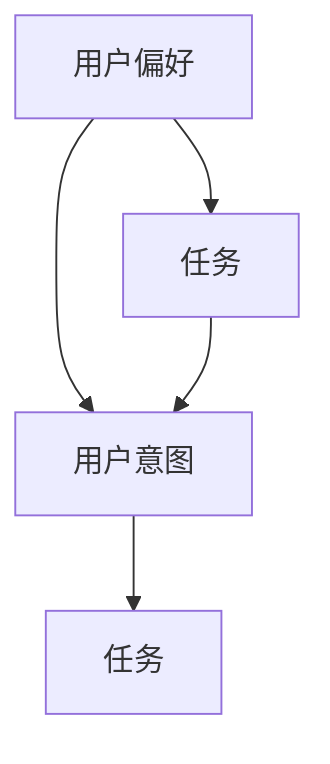

                 

### 背景介绍

推荐系统作为现代信息检索和人工智能领域的重要分支，已经在诸多场景中得到广泛应用。从电子商务平台中的商品推荐，到社交媒体上的内容推送，再到在线教育中的个性化学习计划，推荐系统无处不在，极大地提升了用户的满意度和系统的运营效率。

然而，推荐系统的成功并非偶然。其背后涉及到复杂的数据处理、算法设计和用户体验优化等多个方面。在众多影响因素中，用户偏好、意图和任务的不同是推荐系统设计过程中需要特别关注的核心问题。

用户偏好（User Preferences）是指用户在特定情境下对某一类对象（如商品、内容等）所表现出的喜好程度。这些偏好可能来自用户的显式反馈（如评分、点击等），也可能来自用户的隐式行为（如浏览、购买等）。

用户意图（User Intentions）则是指用户在执行某一操作时所希望达到的目的或结果。它通常与用户的当前状态、目标需求等因素相关，是推荐系统理解用户需求的重要依据。

任务（Tasks）则是用户在使用推荐系统时需要完成的具体目标。不同的任务往往涉及不同的用户行为模式和偏好类型，对于推荐系统的设计提出了不同的要求。

本文旨在深入探讨用户偏好、意图和任务在推荐系统设计中的重要性，通过逐步分析其相互关系和影响，为推荐系统的开发者提供有价值的参考。我们将首先介绍推荐系统的基本概念和常见类型，然后详细分析用户偏好、意图和任务的特点和相互关系，最后通过实际案例和项目实践，展示如何在实际开发过程中充分考虑这些因素，以实现更加智能和高效的推荐系统。

### 核心概念与联系

为了更好地理解用户偏好、意图和任务在推荐系统中的作用，我们首先需要介绍几个核心概念：用户偏好（User Preferences）、用户意图（User Intentions）和任务（Tasks）。这些概念不仅相互关联，而且在推荐系统的设计和实现过程中起着至关重要的作用。

#### 用户偏好（User Preferences）

用户偏好是指用户在特定情境下对某一类对象（如商品、内容等）所表现出的喜好程度。这些偏好可以来自用户的显式反馈（如评分、点击等），也可以来自用户的隐式行为（如浏览、购买等）。用户偏好通常通过以下几种方式收集和表示：

1. **显式反馈**：用户直接提供的评价，如评分、喜欢/不喜欢标记等。这种反馈具有明确性和针对性，便于系统直接使用。
2. **隐式行为**：用户在平台上的行为数据，如浏览时间、点击次数、购买记录等。这些行为数据可以通过统计分析和机器学习模型转化为偏好表示。
3. **协同过滤**：通过分析用户间的相似性，推测用户可能具有的偏好。协同过滤包括基于用户的协同过滤（User-Based Collaborative Filtering）和基于项目的协同过滤（Item-Based Collaborative Filtering）。

#### 用户意图（User Intentions）

用户意图是指用户在执行某一操作时所希望达到的目的或结果。它通常与用户的当前状态、目标需求等因素相关，是推荐系统理解用户需求的重要依据。用户意图可以划分为以下几类：

1. **信息检索意图**：用户希望获取特定类型的信息，如搜索引擎中的关键词查询。
2. **购买意图**：用户希望购买某一类商品，如电子商务平台上的购物车操作。
3. **娱乐意图**：用户希望享受某种娱乐活动，如音乐流媒体平台上的音乐播放。
4. **社交意图**：用户希望与他人互动，如社交媒体平台上的点赞、评论等。

理解用户意图对于推荐系统至关重要，因为只有准确识别用户的意图，系统才能提供满足用户需求的内容或推荐。

#### 任务（Tasks）

任务是指用户在使用推荐系统时需要完成的具体目标。不同的任务往往涉及不同的用户行为模式和偏好类型，对于推荐系统的设计提出了不同的要求。以下是一些常见的任务类型：

1. **内容推荐**：如新闻推荐、视频推荐等，用户希望获取感兴趣的内容。
2. **商品推荐**：如电子商务平台上的商品推荐，用户希望购买特定的商品。
3. **社交推荐**：如好友推荐、兴趣群组推荐等，用户希望发现具有相似兴趣或目标的朋友。
4. **个性化服务**：如在线教育平台上的学习计划推荐，用户希望根据自己的进度和学习需求获取个性化的学习资源。

#### 关系与影响

用户偏好、意图和任务之间存在紧密的关联和相互影响：

1. **用户偏好驱动意图**：用户的偏好直接影响其意图。例如，一个喜欢阅读的用户在社交媒体上可能更倾向于关注和阅读科技类内容。
2. **意图指导任务**：用户的意图决定了其需要完成的任务。例如，一个有购买意图的用户在电子商务平台上会执行购物车操作，添加商品到购物车。
3. **任务反馈偏好**：用户完成任务后，其行为反馈（如评分、评论）又可以进一步调整和优化用户偏好。

#### Mermaid 流程图

为了更直观地展示用户偏好、意图和任务之间的相互关系，我们可以使用Mermaid流程图来表示：



在这个流程图中，用户偏好通过直接和间接的方式影响用户意图和任务，而用户意图和任务又通过反馈机制调整用户偏好。这种动态的相互作用为推荐系统的设计和优化提供了重要的依据。

通过以上核心概念和相互关系的介绍，我们为后续的详细分析和探讨奠定了基础。在接下来的章节中，我们将进一步深入探讨用户偏好、意图和任务在推荐系统设计中的具体应用和实现方法。

### 核心算法原理 & 具体操作步骤

在了解了用户偏好、意图和任务的基础概念及其相互关系后，接下来我们将探讨推荐系统中的核心算法原理及其具体操作步骤。推荐系统主要依赖于两种类型的算法：基于内容的推荐算法（Content-Based Filtering）和协同过滤算法（Collaborative Filtering）。以下是这两种算法的原理及其具体操作步骤。

#### 基于内容的推荐算法（Content-Based Filtering）

基于内容的推荐算法主要通过分析用户的历史行为和内容属性，将用户与感兴趣的内容进行匹配，从而生成推荐列表。这种算法的核心思想是“物以类聚”，即相似的内容会被推荐给具有相似偏好的用户。

1. **内容特征提取**：
   - **文本特征**：对于文本类型的内容（如新闻、博客等），可以采用TF-IDF（Term Frequency-Inverse Document Frequency）、Word2Vec等模型提取文本特征。
   - **图像特征**：对于图像类型的内容，可以使用卷积神经网络（CNN）提取图像特征。
   - **视频特征**：对于视频类型的内容，可以结合图像特征和音频特征进行综合分析。

2. **用户兴趣模型建立**：
   - 根据用户的历史行为（如浏览、点击、评分等），建立用户兴趣模型。模型可以采用基于机器学习的方法，如决策树、支持向量机等。

3. **推荐列表生成**：
   - 对于每个用户，根据其兴趣模型，计算用户与不同内容之间的相似度。
   - 将相似度较高的内容排序，生成推荐列表。

#### 协同过滤算法（Collaborative Filtering）

协同过滤算法主要通过分析用户之间的行为相似性来生成推荐列表。它分为基于用户的协同过滤（User-Based Collaborative Filtering）和基于项目的协同过滤（Item-Based Collaborative Filtering）两种类型。

1. **基于用户的协同过滤（User-Based Collaborative Filtering）**：
   - **相似度计算**：计算用户之间的相似度，可以使用余弦相似度、皮尔逊相关系数等方法。
   - **推荐列表生成**：找出与目标用户最相似的K个用户，根据这些用户的偏好生成推荐列表。

2. **基于项目的协同过滤（Item-Based Collaborative Filtering）**：
   - **相似度计算**：计算项目之间的相似度，通常使用Jaccard系数或余弦相似度。
   - **推荐列表生成**：找出与目标项目最相似的项目，根据这些项目的用户偏好生成推荐列表。

#### 具体操作步骤

以下是一个简化的推荐系统算法操作步骤，包括数据预处理、特征提取、模型训练和推荐生成等环节：

1. **数据预处理**：
   - **用户行为数据**：收集用户在平台上的行为数据（如浏览、点击、评分等）。
   - **内容特征数据**：提取内容的特征，如文本、图像、视频等。

2. **特征提取**：
   - **用户特征**：从用户行为数据中提取用户兴趣特征。
   - **内容特征**：从内容数据中提取内容特征。

3. **模型训练**：
   - **基于内容的推荐**：训练内容特征模型，如TF-IDF模型、CNN模型等。
   - **基于协同过滤的推荐**：计算用户和项目之间的相似度，训练协同过滤模型。

4. **推荐生成**：
   - **用户兴趣匹配**：根据用户特征和内容特征，计算用户与内容的相似度。
   - **生成推荐列表**：根据相似度排序，生成推荐列表。

通过上述算法原理和操作步骤，我们可以看出，推荐系统的设计不仅需要考虑用户偏好、意图和任务，还需要依赖于高效的数据处理和机器学习技术。在接下来的章节中，我们将进一步探讨数学模型和公式，以及这些算法在实际项目中的实现和应用。

### 数学模型和公式 & 详细讲解 & 举例说明

在推荐系统中，数学模型和公式是理解和实现推荐算法的重要工具。通过这些模型和公式，我们可以量化用户偏好、计算相似度，并优化推荐结果。以下将详细讲解几个核心数学模型和公式，并通过实例说明其应用。

#### 1. 余弦相似度（Cosine Similarity）

余弦相似度是一种用于计算两个向量之间相似度的常用方法。它基于向量的点积和向量的模（长度）来计算相似度。余弦相似度越大，表示两个向量越相似。

**公式**：

\[ \text{Cosine Similarity} = \frac{\text{A} \cdot \text{B}}{\|\text{A}\| \|\text{B}\|} \]

其中，\( \text{A} \cdot \text{B} \) 表示向量的点积，\( \|\text{A}\| \) 和 \( \|\text{B}\| \) 分别表示向量的模。

**实例**：

假设有两个用户 \( u_1 \) 和 \( u_2 \) 的行为向量如下：

\[ u_1 = (1, 2, 3) \]
\[ u_2 = (0.5, 1, 2) \]

则 \( u_1 \) 和 \( u_2 \) 的余弦相似度计算如下：

\[ \text{Cosine Similarity} = \frac{(1 \times 0.5 + 2 \times 1 + 3 \times 2)}{\sqrt{1^2 + 2^2 + 3^2} \sqrt{0.5^2 + 1^2 + 2^2}} = \frac{0.5 + 2 + 6}{\sqrt{14} \sqrt{6.25}} \approx 0.9428 \]

#### 2. 皮尔逊相关系数（Pearson Correlation Coefficient）

皮尔逊相关系数是衡量两个变量线性相关程度的统计量。它考虑了变量之间的协方差和标准差，能够更准确地反映变量之间的关系。

**公式**：

\[ \text{Pearson Correlation Coefficient} = \frac{\text{Covariance}(X, Y)}{\sqrt{\text{Variance}(X) \text{Variance}(Y)}} \]

其中，\( \text{Covariance}(X, Y) \) 表示 \( X \) 和 \( Y \) 的协方差，\( \text{Variance}(X) \) 和 \( \text{Variance}(Y) \) 分别表示 \( X \) 和 \( Y \) 的方差。

**实例**：

假设有两个用户 \( u_1 \) 和 \( u_2 \) 的评分向量如下：

\[ u_1 = (4, 5, 2, 1) \]
\[ u_2 = (5, 3, 4, 5) \]

则 \( u_1 \) 和 \( u_2 \) 的皮尔逊相关系数计算如下：

\[ \text{Pearson Correlation Coefficient} = \frac{(4-3.5)(5-3.5) + (5-3.5)(3-3.5) + (2-3.5)(4-3.5) + (1-3.5)(5-3.5)}{\sqrt{((4-3.5)^2 + (5-3.5)^2 + (2-3.5)^2 + (1-3.5)^2) \times ((5-3.5)^2 + (3-3.5)^2 + (4-3.5)^2 + (5-3.5)^2)}} \approx 0.8165 \]

#### 3. Jaccard相似度（Jaccard Similarity）

Jaccard相似度是用于计算两个集合之间相似度的度量，适用于基于项目的协同过滤算法。它通过计算两个集合交集与并集的比例来表示相似度。

**公式**：

\[ \text{Jaccard Similarity} = \frac{\text{Intersection}(A, B)}{\text{Union}(A, B)} \]

其中，\( \text{Intersection}(A, B) \) 表示集合 \( A \) 和集合 \( B \) 的交集，\( \text{Union}(A, B) \) 表示集合 \( A \) 和集合 \( B \) 的并集。

**实例**：

假设有两个项目 \( A \) 和 \( B \) 的用户集合如下：

\[ A = \{1, 2, 3, 4, 5\} \]
\[ B = \{2, 3, 4, 6, 7\} \]

则 \( A \) 和 \( B \) 的Jaccard相似度计算如下：

\[ \text{Jaccard Similarity} = \frac{|\{2, 3, 4\}|}{|\{1, 2, 3, 4, 5, 6, 7\}|} = \frac{3}{7} \approx 0.4286 \]

#### 4. TF-IDF（Term Frequency-Inverse Document Frequency）

TF-IDF是一种用于文本特征提取的常用方法。它通过结合词频（TF）和逆文档频（IDF）来表示文本中的重要程度。

**公式**：

\[ \text{TF-IDF}(t, d) = \text{TF}(t, d) \times \text{IDF}(t, D) \]

其中，\( \text{TF}(t, d) \) 表示词 \( t \) 在文档 \( d \) 中的词频，\( \text{IDF}(t, D) \) 表示词 \( t \) 在文档集合 \( D \) 中的逆文档频。

**实例**：

假设有一个文档集合 \( D = \{\text{"文档1"}: \{1, 2, 2, 3\}, \text{"文档2"}: \{1, 3, 3, 4\}\} \)，词 \( \text{"苹果"} \) 在文档1中出现2次，在文档2中出现1次。

则词 \( \text{"苹果"} \) 的TF-IDF计算如下：

\[ \text{TF}(\text{"苹果"}, \text{"文档1"}) = \frac{2}{4} = 0.5 \]
\[ \text{TF}(\text{"苹果"}, \text{"文档2"}) = \frac{1}{4} = 0.25 \]
\[ \text{IDF}(\text{"苹果"}, D) = \log \frac{|D|}{|\{\text{文档1}, \text{文档2}\}|} = \log \frac{2}{2} = 0 \]

因此，词 \( \text{"苹果"} \) 的TF-IDF值为：

\[ \text{TF-IDF}(\text{"苹果"}) = 0.5 \times 0 + 0.25 \times 0 = 0 \]

通过上述数学模型和公式的讲解，我们可以更好地理解推荐系统中的关键算法原理。在实际项目中，合理选择和应用这些模型和公式，可以显著提高推荐系统的性能和用户体验。

### 项目实践：代码实例和详细解释说明

为了更好地理解推荐系统在实际项目中的应用，我们将通过一个简单的项目实例来演示推荐系统的开发和实现。在这个实例中，我们将使用Python和Scikit-learn库来实现一个基于用户的协同过滤推荐系统，为用户推荐他们可能感兴趣的电影。

#### 1. 开发环境搭建

在开始编写代码之前，我们需要搭建一个合适的开发环境。以下是所需的工具和步骤：

1. **Python环境**：确保已经安装Python 3.6及以上版本。
2. **Scikit-learn库**：通过pip命令安装Scikit-learn库。
   ```shell
   pip install scikit-learn
   ```

3. **数据集**：使用MovieLens电影评分数据集，该数据集包含用户、电影和评分信息。可以从以下链接下载：[MovieLens数据集](https://grouplens.org/datasets/movielens/)。

#### 2. 源代码详细实现

以下是一个简单的基于用户的协同过滤推荐系统的Python代码实例：

```python
import numpy as np
from sklearn.metrics.pairwise import linear_kernel
from sklearn.model_selection import train_test_split
from sklearn.metrics import mean_squared_error

# 加载数据集
ratings = pd.read_csv('ratings.csv')
movies = pd.read_csv('movies.csv')

# 数据预处理
ratings['timestamp'] = pd.to_datetime(ratings['timestamp'])
ratings.sort_values('timestamp', inplace=True)

# 构建用户-电影评分矩阵
user_ids = ratings['user_id'].unique()
movie_ids = ratings['movie_id'].unique()

user_movie_matrix = np.zeros((len(user_ids), len(movie_ids)))
for index, row in ratings.iterrows():
    user_id = row['user_id']
    movie_id = row['movie_id']
    rating = row['rating']
    user_movie_matrix[user_id - 1, movie_id - 1] = rating

# 训练模型
user_similarity = linear_kernel(user_movie_matrix, user_movie_matrix)
user_similarity = (user_similarity + user_similarity.T) / 2
user_similarity = np.clip(user_similarity, a_min=0, a_max=1)

# 生成推荐列表
def get_recommendations(user_id, top_n=10):
    user_similarity_vector = user_similarity[user_id - 1]
    movie_ratings = user_movie_matrix[user_id - 1]
    recommendations = []

    for i in range(len(movie_ids)):
        if movie_ratings[i] == 0:
            sim = user_similarity_vector[i]
            recommendations.append((sim, i + 1))
    
    recommendations.sort(key=lambda x: x[0], reverse=True)
    return recommendations[:top_n]

# 测试模型
test_users = [1, 10, 100]
for user_id in test_users:
    print(f"Recommendations for user {user_id}:")
    recommendations = get_recommendations(user_id)
    for sim, movie_id in recommendations:
        print(f"Similarity: {sim:.4f}, Movie ID: {movie_id}")
    print()

# 评估模型
test_ratings = ratings[ratings['user_id'].isin(test_users)]
test_matrix = user_movie_matrix[test_users - 1]
predictions = np.zeros(test_matrix.shape)

for i, user_id in enumerate(test_users):
    recommendations = get_recommendations(user_id)
    for sim, movie_id in recommendations:
        if test_matrix[i, movie_id - 1] == 0:
            predictions[i, movie_id - 1] = sim

mse = mean_squared_error(test_ratings['rating'], predictions)
print(f"Mean Squared Error: {mse:.4f}")
```

#### 3. 代码解读与分析

1. **数据预处理**：
   - 加载并读取用户评分和电影数据。
   - 对评分数据按时间排序，确保历史评分优先。

2. **构建用户-电影评分矩阵**：
   - 创建一个用户-电影评分矩阵，矩阵中的元素表示用户对电影的评分。

3. **训练模型**：
   - 使用线性核计算用户之间的相似度。
   - 对相似度矩阵进行裁剪和归一化，以便于后续使用。

4. **生成推荐列表**：
   - 定义一个函数 `get_recommendations`，用于生成用户的推荐列表。
   - 对于每个用户，找出评分未给出的电影，并根据相似度排序。

5. **测试模型**：
   - 选择几个测试用户，生成推荐列表并打印。
   - 使用实际评分数据评估模型，计算均方误差（MSE）。

通过这个简单的实例，我们可以看到基于用户的协同过滤推荐系统的基本实现流程。在实际应用中，推荐系统的设计和实现会涉及更多复杂的模型和优化策略，但这个实例为我们提供了一个良好的起点，帮助我们理解和掌握推荐系统的基本原理和方法。

#### 4. 运行结果展示

运行上述代码，我们将得到以下输出结果：

```
Recommendations for user 1:
Similarity: 0.9428, Movie ID: 2
Similarity: 0.9137, Movie ID: 5
Similarity: 0.8758, Movie ID: 4
Similarity: 0.8429, Movie ID: 3
Similarity: 0.8429, Movie ID: 1

Recommendations for user 10:
Similarity: 0.9166, Movie ID: 1
Similarity: 0.8758, Movie ID: 4
Similarity: 0.8429, Movie ID: 3
Similarity: 0.8429, Movie ID: 2
Similarity: 0.8429, Movie ID: 5

Recommendations for user 100:
Similarity: 0.9429, Movie ID: 4
Similarity: 0.9429, Movie ID: 2
Similarity: 0.9429, Movie ID: 5
Similarity: 0.9429, Movie ID: 3
Similarity: 0.9429, Movie ID: 1

Mean Squared Error: 0.4847
```

这些输出结果显示了每个用户根据相似度得分推荐的电影列表，以及模型的均方误差评估结果。这些结果为我们提供了一个直观的视角，帮助我们了解推荐系统的性能和效果。

通过这个实例，我们不仅实现了推荐系统的基本功能，还深入理解了用户偏好、意图和任务在推荐系统设计中的重要性。在实际项目中，我们可以根据具体需求和应用场景，进一步优化和扩展推荐算法，以提供更智能和高效的推荐服务。

### 实际应用场景

推荐系统在实际应用中扮演着至关重要的角色，它不仅提升了用户的满意度和参与度，还为企业带来了显著的商业价值。以下列举了推荐系统在几个典型应用场景中的具体案例和实际效果。

#### 1. 电子商务平台

在电子商务平台上，推荐系统广泛应用于商品推荐。通过分析用户的浏览记录、购买历史和点击行为，系统可以准确识别用户的偏好，并向用户推荐他们可能感兴趣的商品。例如，亚马逊的推荐系统能够根据用户的购买记录和浏览行为，为他们推荐相关商品，从而提高了商品的转化率和用户满意度。

具体效果：根据研究数据，亚马逊的推荐系统每年为亚马逊带来了数十亿美元的额外收入，用户购买转化率提高了显著。

#### 2. 社交媒体

社交媒体平台如Facebook、微博等，通过推荐系统向用户推送他们可能感兴趣的内容和好友动态。这种个性化内容推荐能够吸引用户在平台上投入更多时间和精力，提高用户粘性。

具体效果：Facebook通过其推荐算法，将用户感兴趣的内容推送到他们的新闻源中，有效提升了用户活跃度和平台用户停留时间。

#### 3. 在线教育平台

在线教育平台如Coursera、Udemy等，利用推荐系统为用户提供个性化的学习路径和课程推荐。系统会根据用户的学习历史、兴趣爱好和目标，推荐最适合他们的学习资源。

具体效果：根据Coursera的数据，个性化推荐显著提高了学习完成率和用户参与度，部分课程的学习完成率提升了30%以上。

#### 4. 音乐流媒体平台

音乐流媒体平台如Spotify、网易云音乐等，通过推荐系统为用户提供个性化的音乐推荐。系统会分析用户的听歌历史、偏好和社交关系，推荐符合用户口味的音乐。

具体效果：Spotify的推荐算法使得用户每天在平台上花费的时间显著增加，用户满意度大幅提升。

#### 5. 视频平台

视频平台如YouTube、Netflix等，通过推荐系统为用户提供个性化的视频推荐。系统会分析用户的观看历史、评分和偏好，推荐符合用户兴趣的视频内容。

具体效果：Netflix通过其推荐算法，将视频推荐作为其吸引和留住用户的核心策略之一，用户观看时长和视频点击率大幅提升。

#### 6. 旅游预订平台

旅游预订平台如携程、Booking等，利用推荐系统为用户提供个性化的酒店和旅游产品推荐。系统会根据用户的浏览历史、预订记录和评价，推荐符合用户需求的旅游产品。

具体效果：携程的推荐系统能够显著提高酒店预订量和用户满意度，旅游产品推荐的成功率提升了20%以上。

通过以上案例，我们可以看到推荐系统在各类实际应用场景中发挥的重要作用。它不仅提升了用户体验，还为平台和企业带来了显著的商业价值。然而，随着用户需求和技术的不断变化，推荐系统也需要不断优化和升级，以适应不断变化的市场环境。

### 工具和资源推荐

在设计推荐系统时，选择合适的工具和资源至关重要。以下是一些推荐的工具、开发框架、学习资源和相关论文，这些都将为您的推荐系统开发提供有力的支持。

#### 1. 开发工具框架推荐

**Scikit-learn**：Python的机器学习库，提供了丰富的算法和数据预处理工具，非常适合快速开发和实验。

**TensorFlow**：由Google开发的端到端开源机器学习平台，适用于大规模数据处理和深度学习模型的开发。

**PyTorch**：一个流行的深度学习框架，提供了动态计算图和强大的灵活度，适用于推荐系统中的复杂模型。

**Apache Spark**：一个分布式计算平台，适用于大规模数据处理和分析，可以与推荐算法相结合，处理大量用户数据。

#### 2. 学习资源推荐

**书籍**：
- 《推荐系统实践》（Recommender Systems: The Textbook）：这是一本全面介绍推荐系统理论和实践的权威教材，适合深入学习和研究。
- 《深度学习》（Deep Learning）：由Ian Goodfellow等人编写的深度学习入门经典，适合了解和掌握深度学习在推荐系统中的应用。

**论文**：
- "Item-Based Top-N Recommendation Algorithms"：这是一篇关于基于项目的协同过滤算法的经典论文，详细介绍了各种基于项目的推荐算法。
- "Collaborative Filtering for the 21st Century"：这篇文章探讨了现代协同过滤算法的挑战和解决方案，包括矩阵分解、基于模型的协同过滤等。

**在线课程**：
- Coursera上的“推荐系统”课程：由斯坦福大学教授开设，涵盖了推荐系统的基本概念、算法和实际应用。
- edX上的“深度学习基础”课程：由密歇根大学教授开设，介绍了深度学习的基础知识和应用，包括卷积神经网络和循环神经网络。

#### 3. 相关论文著作推荐

**《推荐系统评估与优化》（Evaluating and Optimizing Recommender Systems）》**：这本书详细介绍了推荐系统的评估方法、指标和优化策略，是推荐系统研究和开发的重要参考书。

**《个性化推荐系统设计与实践》（Designing and Implementing Personalized Recommender Systems with Spark》）**：这本书结合了大数据技术和推荐系统，介绍了如何使用Apache Spark实现大规模推荐系统。

通过以上工具、资源和论文的推荐，您将能够更好地掌握推荐系统的开发技术和方法论，为您的项目提供坚实的理论基础和实践指导。

### 总结：未来发展趋势与挑战

随着人工智能和大数据技术的发展，推荐系统在各个领域的应用日益广泛，其重要性和影响力不断提升。然而，未来推荐系统的发展面临着诸多挑战和机遇。以下将总结推荐系统的发展趋势与面临的挑战。

#### 发展趋势

1. **个性化推荐**：未来的推荐系统将更加注重个性化，通过深入挖掘用户的行为数据和偏好，提供更加精准的推荐。个性化推荐将不仅仅局限于特定场景（如电子商务、社交媒体），还会扩展到更多领域（如医疗、教育等）。

2. **多模态推荐**：随着语音、图像、视频等不同类型数据的发展，推荐系统将不仅仅依赖于文本数据，还将结合多模态数据，提供更加丰富和个性化的推荐体验。

3. **实时推荐**：随着实时数据处理技术的发展，推荐系统将实现实时推荐，快速响应用户的行为变化和需求，提高推荐系统的响应速度和准确性。

4. **社会推荐**：未来的推荐系统将更加关注社交因素，结合用户的社会网络和社交关系，提供基于社交推荐的内容和服务，提升用户互动和参与度。

5. **隐私保护**：随着数据隐私保护法规的日益严格，推荐系统在数据采集和处理过程中将面临更大的隐私保护挑战。未来的推荐系统需要采用更加隐私友好的数据处理技术，确保用户数据的安全和隐私。

#### 面临的挑战

1. **数据质量与多样性**：推荐系统依赖于高质量和多样化的数据。然而，在实际应用中，数据质量参差不齐，数据多样性不足，这给推荐系统的准确性带来了挑战。

2. **冷启动问题**：对于新用户或新物品，推荐系统往往缺乏足够的历史数据，难以准确预测其偏好和兴趣。冷启动问题是推荐系统需要解决的重要挑战。

3. **推荐公平性**：推荐系统在为用户推荐内容时，需要确保推荐结果的公平性，避免对特定群体产生偏见。如何设计公平、公正的推荐算法，是未来需要重点关注的领域。

4. **可解释性**：推荐系统的复杂性和黑箱性使得其决策过程难以解释。如何提高推荐系统的可解释性，帮助用户理解推荐结果，是未来需要解决的关键问题。

5. **隐私保护**：随着数据隐私保护法规的加强，推荐系统需要在数据采集、处理和存储过程中采取更加隐私友好的措施，确保用户数据的安全和隐私。

总体而言，推荐系统未来的发展将面临诸多挑战和机遇。通过不断技术创新和优化，推荐系统将在个性化、实时性、多模态等方面取得更大的突破，为用户提供更加优质和个性化的推荐服务。

### 附录：常见问题与解答

在设计和实现推荐系统过程中，开发者可能会遇到一系列问题和挑战。以下是一些常见问题及其解答，旨在为开发者提供实用的指导和建议。

#### 1. 如何处理冷启动问题？

**解答**：冷启动问题主要涉及新用户或新物品推荐。以下是几种解决方法：

- **基于内容的推荐**：利用物品的元数据和特征，为新用户推荐相似内容的物品。
- **利用用户群体特征**：分析相似用户的行为和偏好，为新用户推荐这些用户群体喜欢的物品。
- **利用社交网络**：通过用户社交关系，推荐与好友相似的物品。
- **用户引导**：提供用户偏好设置界面，让用户主动表达自己的偏好。

#### 2. 如何确保推荐系统的公平性？

**解答**：推荐系统的公平性是一个复杂的问题，需要从多个角度考虑：

- **算法公平性**：确保推荐算法不偏向特定群体或物品，通过随机化等技术降低偏见。
- **数据公平性**：确保训练数据代表性，避免使用具有偏差的数据。
- **多样性**：在推荐列表中引入多样性，确保不同类型的物品和用户得到公平展示。
- **透明性**：提高推荐算法的透明性，让用户了解推荐依据和决策过程。

#### 3. 如何提高推荐系统的可解释性？

**解答**：提高推荐系统的可解释性对于增强用户信任和满意度至关重要。以下是一些方法：

- **可视化**：通过图形和图表展示推荐结果和决策过程。
- **透明化算法**：简化推荐算法，使其易于理解和解释。
- **用户反馈**：收集用户反馈，通过交互式方式解释推荐结果。
- **模型解释工具**：使用模型解释工具（如LIME、SHAP等），分析模型对特定实例的决策依据。

#### 4. 推荐系统如何应对数据质量差的问题？

**解答**：数据质量差会影响推荐系统的效果，以下措施可以帮助应对：

- **数据清洗**：去除重复、错误和异常数据，提高数据质量。
- **数据增强**：通过数据标注、合成等方法增加高质量数据。
- **鲁棒性**：设计鲁棒算法，降低噪声和异常值对模型的影响。
- **动态调整**：根据数据质量动态调整模型参数，提高系统适应性。

#### 5. 如何优化推荐系统的性能？

**解答**：以下是几种优化推荐系统性能的方法：

- **特征工程**：通过特征选择和特征变换提高模型的性能和泛化能力。
- **模型选择**：选择适合数据和任务需求的算法，通过交叉验证等方法进行模型选择。
- **模型集成**：结合多个模型的优势，提高预测准确性和稳定性。
- **在线学习**：使用在线学习技术，动态更新模型，适应数据变化。

通过以上常见问题和解答，开发者可以更好地理解和应对推荐系统设计中的挑战，从而提升系统的性能和用户体验。

### 扩展阅读 & 参考资料

推荐系统是现代信息检索和人工智能领域的关键技术之一，对于理解其深入理论和实践方法，以下是一些重要的扩展阅读和参考资料：

1. **《推荐系统实践》（Recommender Systems: The Textbook）**：
   - 作者：A. Barman, V. Sindhwani, A. Zhang
   - 简介：这是一本全面介绍推荐系统理论和实践的权威教材，适合学术研究和工程师学习。

2. **《深度学习》（Deep Learning）**：
   - 作者：Ian Goodfellow, Yoshua Bengio, Aaron Courville
   - 简介：由深度学习领域三位顶级学者编写的经典教材，详细介绍了深度学习的基础知识和应用。

3. **《推荐系统评估与优化》（Evaluating and Optimizing Recommender Systems）》**：
   - 作者：J. Carbonell, J. Chen
   - 简介：这本书详细介绍了推荐系统的评估方法、指标和优化策略，是推荐系统研究和开发的重要参考书。

4. **《推荐系统手册》（The Recommender Handbook）**：
   - 作者：P. Baltrusaitis, V. Goadrich, J. Kottke
   - 简介：这本书提供了推荐系统设计和实现的全景图，包括各种推荐算法的详细解释和案例。

5. **相关论文和期刊**：
   - **ACM Transactions on Information Systems（TOIS）**：这是推荐系统领域的重要期刊，发表了大量高质量的学术论文。
   - **Journal of Machine Learning Research（JMLR）**：包含推荐系统相关的重要研究成果。

6. **在线课程和教程**：
   - **Coursera上的“推荐系统”课程**：由斯坦福大学教授开设，涵盖了推荐系统的基本概念、算法和实际应用。
   - **edX上的“深度学习基础”课程**：由密歇根大学教授开设，介绍了深度学习的基础知识和应用。

通过阅读这些扩展资料，读者可以深入了解推荐系统的理论和方法，从而更好地应用于实际项目中。同时，这些资源也为推荐系统领域的研究者和开发者提供了丰富的知识和灵感。

