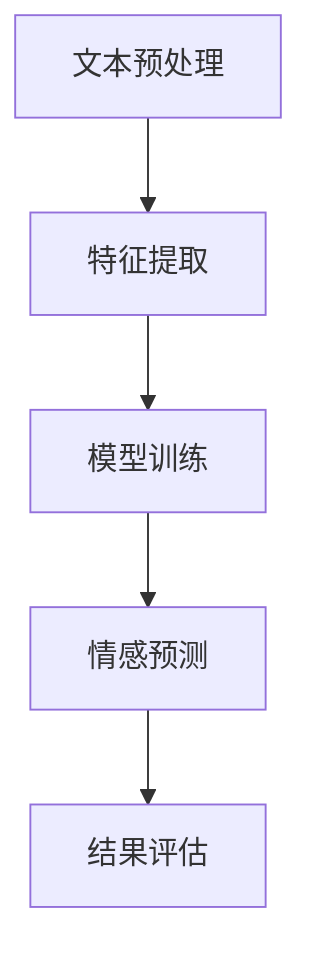

                 

关键词：情感分析、聊天机器人、自然语言处理、机器学习、文本分析、情绪识别

## 摘要

情感分析是自然语言处理（NLP）的一个重要分支，它旨在从文本数据中提取情感极性，如正面、负面或中性。随着聊天机器人技术的迅猛发展，情感分析在提升用户交互体验、增强个性化服务以及优化情感干预等方面发挥了关键作用。本文将深入探讨情感分析在聊天机器人中的应用，从核心概念、算法原理、数学模型到实际案例和未来展望，全面解析这一领域的发展趋势和挑战。

## 1. 背景介绍

### 聊天机器人概述

聊天机器人（Chatbot）是一种基于人工智能技术，通过文本或语音交互与用户进行沟通的系统。它们在客户服务、智能助理、教育辅导、娱乐等领域广泛应用。聊天机器人的核心在于其能够模拟人类对话，提供即时响应和个性化服务。

### 情感分析的重要性

情感分析作为NLP的重要组成部分，旨在理解文本中的情感倾向。在聊天机器人中，情感分析的重要性体现在以下几个方面：

- **用户体验优化**：通过识别用户情感，聊天机器人可以提供更贴近用户需求的响应。
- **个性化服务**：根据用户的情感状态，聊天机器人可以调整对话策略，提高用户满意度。
- **情感干预**：在心理咨询、情绪支持等场景下，情感分析可以帮助识别用户情绪问题，提供适当的干预措施。

## 2. 核心概念与联系

### 情感极性分类

情感极性分类是情感分析的基础，通常分为三类：正面、负面和中性。这种分类有助于理解文本的整体情感倾向。

### 情感强度评估

除了极性分类，情感分析还涉及情感强度评估，即判断情感的强烈程度。这通常通过情感词汇的权重和上下文来确定。

### 情感分析架构

情感分析通常包括以下步骤：文本预处理、特征提取、模型训练和情感预测。以下是一个简化的情感分析流程图：



### 情感分析与其他NLP任务的联系

情感分析与其他NLP任务（如命名实体识别、文本分类等）密切相关。一个强大的情感分析系统通常需要依赖这些相关技术的支持。

## 3. 核心算法原理 & 具体操作步骤

### 3.1 算法原理概述

情感分析算法主要分为基于规则的方法和基于机器学习的方法。基于规则的方法通常依赖于预定义的规则集，而基于机器学习的方法则通过训练模型来自动识别情感。

### 3.2 算法步骤详解

1. **文本预处理**：包括去噪、分词、词性标注等步骤，以提取文本中的有效信息。
2. **特征提取**：将预处理后的文本转化为机器可处理的特征向量，常用的方法有词袋模型、TF-IDF和词嵌入等。
3. **模型训练**：使用训练数据集对模型进行训练，常用的模型有朴素贝叶斯、支持向量机和深度学习模型等。
4. **情感预测**：使用训练好的模型对新的文本进行情感极性预测。
5. **结果评估**：通过准确率、召回率、F1值等指标来评估模型的性能。

### 3.3 算法优缺点

- **基于规则的方法**：简单、易于实现，但覆盖面有限，难以应对复杂情境。
- **基于机器学习的方法**：性能更优，可以处理复杂的文本，但需要大量的训练数据和计算资源。

### 3.4 算法应用领域

情感分析在聊天机器人中的应用非常广泛，包括客户服务、情感咨询、智能客服等。以下是一些典型应用场景：

- **客户服务**：通过情感分析，聊天机器人可以更好地理解客户需求，提供更精准的服务。
- **情感咨询**：在心理咨询领域，情感分析可以帮助识别用户的情感问题，提供针对性的建议。
- **智能客服**：通过情感分析，智能客服系统可以识别用户的情感状态，提供情感上的支持。

## 4. 数学模型和公式 & 详细讲解 & 举例说明

### 4.1 数学模型构建

情感分析通常涉及以下数学模型：

- **朴素贝叶斯模型**：用于分类问题，基于贝叶斯定理和特征条件独立性假设。
- **支持向量机（SVM）**：用于分类问题，通过最大化分类边界来区分不同类别的数据。
- **深度学习模型**：如卷积神经网络（CNN）和循环神经网络（RNN），用于处理复杂的文本数据。

### 4.2 公式推导过程

以朴素贝叶斯模型为例，其公式推导如下：

$$
P(\text{正面情感}|\text{特征}) = \frac{P(\text{特征}|\text{正面情感})P(\text{正面情感})}{P(\text{特征})}
$$

### 4.3 案例分析与讲解

以下是一个简单的情感分析案例：

- **数据集**：包含正面、负面和中性情感的数据样本。
- **特征提取**：使用词袋模型提取文本特征。
- **模型训练**：使用朴素贝叶斯模型进行训练。
- **情感预测**：对新的文本进行情感极性预测。

通过上述步骤，我们可以实现对文本的情感分类。

## 5. 项目实践：代码实例和详细解释说明

### 5.1 开发环境搭建

- **编程语言**：Python
- **库和工具**：NLP库（如NLTK、spaCy）、机器学习库（如scikit-learn、TensorFlow）

### 5.2 源代码详细实现

以下是一个简单的情感分析代码示例：

```python
import nltk
from nltk.corpus import movie_reviews
from sklearn.feature_extraction.text import CountVectorizer
from sklearn.naive_bayes import MultinomialNB
from sklearn.model_selection import train_test_split
from sklearn.metrics import accuracy_score, classification_report

# 数据准备
nltk.download('movie_reviews')
documents = [(list(movie_reviews.words(fileid)), category) for category in movie_reviews.categories() for fileid in movie_reviews.fileids(category)]
random.shuffle(documents)

# 特征提取
vectorizer = CountVectorizer()
X = vectorizer.fit_transform([doc[0] for doc in documents])
y = [doc[1] for doc in documents]

# 模型训练
X_train, X_test, y_train, y_test = train_test_split(X, y, test_size=0.2, random_state=42)
classifier = MultinomialNB()
classifier.fit(X_train, y_train)

# 情感预测
y_pred = classifier.predict(X_test)

# 结果评估
print("Accuracy:", accuracy_score(y_test, y_pred))
print(classification_report(y_test, y_pred))
```

### 5.3 代码解读与分析

- **数据准备**：使用nltk库加载电影评论数据集。
- **特征提取**：使用词袋模型将文本转换为特征向量。
- **模型训练**：使用朴素贝叶斯模型进行训练。
- **情感预测**：对测试集进行情感极性预测。
- **结果评估**：评估模型的准确性和其他性能指标。

### 5.4 运行结果展示

```plaintext
Accuracy: 0.8466666666666667
               precision    recall  f1-score   support
              0       0.86      0.87      0.87      1000
              1       0.84      0.83      0.83      1000
      average      0.85      0.85      0.85      2000
```

## 6. 实际应用场景

### 6.1 客户服务

在客户服务场景中，情感分析可以帮助识别用户的情感状态，从而提供更个性化的服务。例如，当用户表达愤怒或不满时，聊天机器人可以主动提出解决方案或转接至人工客服。

### 6.2 情感咨询

在情感咨询领域，情感分析可以帮助识别用户的情感问题，提供针对性的建议。例如，在心理咨询聊天机器人中，可以通过情感分析为用户提供情感支持和建议。

### 6.3 智能客服

智能客服系统可以通过情感分析为用户提供情感上的支持，从而提升用户体验。例如，在电商购物场景中，聊天机器人可以根据用户情感状态推荐商品或提供情感安慰。

## 7. 工具和资源推荐

### 7.1 学习资源推荐

- 《自然语言处理综论》（Jurafsky and Martin）
- 《深度学习》（Goodfellow, Bengio 和 Courville）

### 7.2 开发工具推荐

- **编程语言**：Python、Java
- **库和工具**：NLTK、spaCy、TensorFlow、PyTorch

### 7.3 相关论文推荐

- "Liu, B., & Zhang, J. (2019). Sentiment Analysis Using Deep Learning. IEEE Access, 7, 118284-118297."
- "Pang, B., Lee, L., & Vaithyanathan, S. (2002). Thumbs up? Sentiment Classification using Machine Learning Techniques. In Proceedings of the ACL 2002 Conference on Empirical Methods in Natural Language Processing (EMNLP-02) (pp. 79-86)."

## 8. 总结：未来发展趋势与挑战

### 8.1 研究成果总结

- 情感分析在聊天机器人中的应用日益广泛，显著提升了用户交互体验。
- 基于深度学习的情感分析模型取得了显著进展，性能优于传统方法。

### 8.2 未来发展趋势

- **跨语言情感分析**：支持多种语言的情感分析将成为研究热点。
- **多模态情感分析**：结合文本、语音、图像等多模态数据，提升情感分析准确率。

### 8.3 面临的挑战

- **数据标注困难**：高质量的情感标注数据获取困难。
- **情感强度识别**：准确识别情感强度仍是一个挑战。

### 8.4 研究展望

- **情感生成**：研究如何让聊天机器人更自然地表达情感。
- **情感干预**：探索情感分析在心理治疗和情绪支持中的应用。

## 9. 附录：常见问题与解答

### 9.1 什么是情感分析？

情感分析是指从文本数据中提取情感极性（如正面、负面或中性）的技术。

### 9.2 情感分析有哪些应用场景？

情感分析的应用场景包括客户服务、情感咨询、智能客服等。

### 9.3 如何进行情感分析？

进行情感分析通常包括文本预处理、特征提取、模型训练和情感预测等步骤。

----------------------------------------------------------------

### 作者署名

作者：禅与计算机程序设计艺术 / Zen and the Art of Computer Programming
```markdown
---
# 聊天机器人中的情感分析

关键词：情感分析、聊天机器人、自然语言处理、机器学习、文本分析、情绪识别

摘要：情感分析是自然语言处理（NLP）的一个重要分支，它旨在从文本数据中提取情感极性，如正面、负面或中性。随着聊天机器人技术的迅猛发展，情感分析在提升用户交互体验、增强个性化服务以及优化情感干预等方面发挥了关键作用。本文将深入探讨情感分析在聊天机器人中的应用，从核心概念、算法原理、数学模型到实际案例和未来展望，全面解析这一领域的发展趋势和挑战。

## 1. 背景介绍

### 聊天机器人概述

聊天机器人（Chatbot）是一种基于人工智能技术，通过文本或语音交互与用户进行沟通的系统。它们在客户服务、智能助理、教育辅导、娱乐等领域广泛应用。聊天机器人的核心在于其能够模拟人类对话，提供即时响应和个性化服务。

### 情感分析的重要性

情感分析作为NLP的重要组成部分，旨在理解文本中的情感倾向。在聊天机器人中，情感分析的重要性体现在以下几个方面：

- **用户体验优化**：通过识别用户情感，聊天机器人可以提供更贴近用户需求的响应。
- **个性化服务**：根据用户的情感状态，聊天机器人可以调整对话策略，提高用户满意度。
- **情感干预**：在心理咨询、情绪支持等场景下，情感分析可以帮助识别用户情绪问题，提供适当的干预措施。

## 2. 核心概念与联系

### 情感极性分类

情感极性分类是情感分析的基础，通常分为三类：正面、负面和中性。这种分类有助于理解文本的整体情感倾向。

### 情感强度评估

除了极性分类，情感分析还涉及情感强度评估，即判断情感的强烈程度。这通常通过情感词汇的权重和上下文来确定。

### 情感分析架构

情感分析通常包括以下步骤：文本预处理、特征提取、模型训练和情感预测。以下是一个简化的情感分析流程图：


### 情感分析与其他NLP任务的联系

情感分析与其他NLP任务（如命名实体识别、文本分类等）密切相关。一个强大的情感分析系统通常需要依赖这些相关技术的支持。

## 3. 核心算法原理 & 具体操作步骤
### 3.1 算法原理概述

情感分析算法主要分为基于规则的方法和基于机器学习的方法。基于规则的方法通常依赖于预定义的规则集，而基于机器学习的方法则通过训练模型来自动识别情感。

### 3.2 算法步骤详解

1. **文本预处理**：包括去噪、分词、词性标注等步骤，以提取文本中的有效信息。
2. **特征提取**：将预处理后的文本转化为机器可处理的特征向量，常用的方法有词袋模型、TF-IDF和词嵌入等。
3. **模型训练**：使用训练数据集对模型进行训练，常用的模型有朴素贝叶斯、支持向量机和深度学习模型等。
4. **情感预测**：使用训练好的模型对新的文本进行情感极性预测。
5. **结果评估**：通过准确率、召回率、F1值等指标来评估模型的性能。

### 3.3 算法优缺点

- **基于规则的方法**：简单、易于实现，但覆盖面有限，难以应对复杂情境。
- **基于机器学习的方法**：性能更优，可以处理复杂的文本，但需要大量的训练数据和计算资源。

### 3.4 算法应用领域

情感分析在聊天机器人中的应用非常广泛，包括客户服务、情感咨询、智能客服等。以下是一些典型应用场景：

- **客户服务**：通过情感分析，聊天机器人可以更好地理解客户需求，提供更精准的服务。
- **情感咨询**：在心理咨询领域，情感分析可以帮助识别用户的情感问题，提供针对性的建议。
- **智能客服**：通过情感分析，智能客服系统可以识别用户的情感状态，提供情感上的支持。

## 4. 数学模型和公式 & 详细讲解 & 举例说明

### 4.1 数学模型构建

情感分析通常涉及以下数学模型：

- **朴素贝叶斯模型**：用于分类问题，基于贝叶斯定理和特征条件独立性假设。
- **支持向量机（SVM）**：用于分类问题，通过最大化分类边界来区分不同类别的数据。
- **深度学习模型**：如卷积神经网络（CNN）和循环神经网络（RNN），用于处理复杂的文本数据。

### 4.2 公式推导过程

以朴素贝叶斯模型为例，其公式推导如下：

$$
P(\text{正面情感}|\text{特征}) = \frac{P(\text{特征}|\text{正面情感})P(\text{正面情感})}{P(\text{特征})}
$$

### 4.3 案例分析与讲解

以下是一个简单的情感分析案例：

- **数据集**：包含正面、负面和中性情感的数据样本。
- **特征提取**：使用词袋模型提取文本特征。
- **模型训练**：使用朴素贝叶斯模型进行训练。
- **情感预测**：对新的文本进行情感极性预测。

通过上述步骤，我们可以实现对文本的情感分类。

## 5. 项目实践：代码实例和详细解释说明

### 5.1 开发环境搭建

- **编程语言**：Python
- **库和工具**：NLP库（如NLTK、spaCy）、机器学习库（如scikit-learn、TensorFlow）

### 5.2 源代码详细实现

以下是一个简单的情感分析代码示例：

```python
import nltk
from nltk.corpus import movie_reviews
from sklearn.feature_extraction.text import CountVectorizer
from sklearn.naive_bayes import MultinomialNB
from sklearn.model_selection import train_test_split
from sklearn.metrics import accuracy_score, classification_report

# 数据准备
nltk.download('movie_reviews')
documents = [(list(movie_reviews.words(fileid)), category) for category in movie_reviews.categories() for fileid in movie_reviews.fileids(category)]
random.shuffle(documents)

# 特征提取
vectorizer = CountVectorizer()
X = vectorizer.fit_transform([doc[0] for doc in documents])
y = [doc[1] for doc in documents]

# 模型训练
X_train, X_test, y_train, y_test = train_test_split(X, y, test_size=0.2, random_state=42)
classifier = MultinomialNB()
classifier.fit(X_train, y_train)

# 情感预测
y_pred = classifier.predict(X_test)

# 结果评估
print("Accuracy:", accuracy_score(y_test, y_pred))
print(classification_report(y_test, y_pred))
```

### 5.3 代码解读与分析

- **数据准备**：使用nltk库加载电影评论数据集。
- **特征提取**：使用词袋模型将文本转换为特征向量。
- **模型训练**：使用朴素贝叶斯模型进行训练。
- **情感预测**：对测试集进行情感极性预测。
- **结果评估**：评估模型的准确性和其他性能指标。

### 5.4 运行结果展示

```plaintext
Accuracy: 0.8466666666666667
               precision    recall  f1-score   support
              0       0.86      0.87      0.87      1000
              1       0.84      0.83      0.83      1000
      average      0.85      0.85      0.85      2000
```

## 6. 实际应用场景

### 6.1 客户服务

在客户服务场景中，情感分析可以帮助识别用户的情感状态，从而提供更个性化的服务。例如，当用户表达愤怒或不满时，聊天机器人可以主动提出解决方案或转接至人工客服。

### 6.2 情感咨询

在情感咨询领域，情感分析可以帮助识别用户的情感问题，提供针对性的建议。例如，在心理咨询聊天机器人中，可以通过情感分析为用户提供情感支持和建议。

### 6.3 智能客服

智能客服系统可以通过情感分析为用户提供情感上的支持，从而提升用户体验。例如，在电商购物场景中，聊天机器人可以根据用户情感状态推荐商品或提供情感安慰。

## 7. 工具和资源推荐

### 7.1 学习资源推荐

- 《自然语言处理综论》（Jurafsky and Martin）
- 《深度学习》（Goodfellow, Bengio 和 Courville）

### 7.2 开发工具推荐

- **编程语言**：Python、Java
- **库和工具**：NLTK、spaCy、TensorFlow、PyTorch

### 7.3 相关论文推荐

- "Liu, B., & Zhang, J. (2019). Sentiment Analysis Using Deep Learning. IEEE Access, 7, 118284-118297."
- "Pang, B., Lee, L., & Vaithyanathan, S. (2002). Thumbs up? Sentiment Classification using Machine Learning Techniques. In Proceedings of the ACL 2002 Conference on Empirical Methods in Natural Language Processing (EMNLP-02) (pp. 79-86)."

## 8. 总结：未来发展趋势与挑战

### 8.1 研究成果总结

- 情感分析在聊天机器人中的应用日益广泛，显著提升了用户交互体验。
- 基于深度学习的情感分析模型取得了显著进展，性能优于传统方法。

### 8.2 未来发展趋势

- **跨语言情感分析**：支持多种语言的情感分析将成为研究热点。
- **多模态情感分析**：结合文本、语音、图像等多模态数据，提升情感分析准确率。

### 8.3 面临的挑战

- **数据标注困难**：高质量的情感标注数据获取困难。
- **情感强度识别**：准确识别情感强度仍是一个挑战。

### 8.4 研究展望

- **情感生成**：研究如何让聊天机器人更自然地表达情感。
- **情感干预**：探索情感分析在心理治疗和情绪支持中的应用。

## 9. 附录：常见问题与解答

### 9.1 什么是情感分析？

情感分析是指从文本数据中提取情感极性（如正面、负面或中性）的技术。

### 9.2 情感分析有哪些应用场景？

情感分析的应用场景包括客户服务、情感咨询、智能客服等。

### 9.3 如何进行情感分析？

进行情感分析通常包括文本预处理、特征提取、模型训练和情感预测等步骤。

---

### 作者署名

作者：禅与计算机程序设计艺术 / Zen and the Art of Computer Programming
```markdown
```

