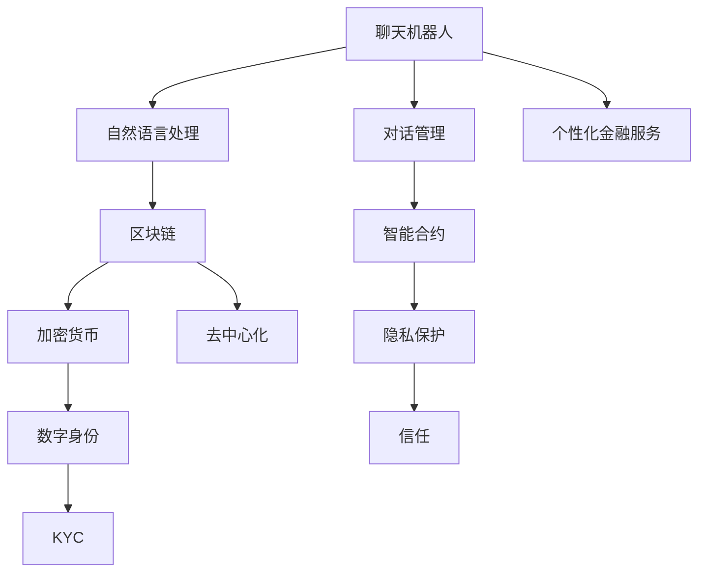

                 

### 背景介绍

#### 引言

随着信息技术的飞速发展，人工智能（AI）在各个领域的应用愈发广泛。特别是在金融行业，人工智能正逐渐成为推动创新和变革的重要力量。聊天机器人作为人工智能的一种表现形式，凭借其自然语言处理（NLP）的能力，为用户提供了便捷、高效的服务体验。与此同时，区块链和加密货币的出现，为金融行业带来了全新的机遇和挑战。

本文旨在探讨聊天机器人在金融创新中的应用，重点关注区块链和加密货币这两个核心领域。通过对聊天机器人、区块链和加密货币的深入分析，我们将揭示这三者之间的联系，探讨它们在金融领域中的潜在影响，并展望未来的发展趋势。

#### 聊天机器人在金融行业的现状

聊天机器人在金融行业的应用场景主要包括客服、投资顾问、风险管理、合规审核等方面。以下是一些具体的案例：

1. **客服**：银行和金融机构通过部署聊天机器人，为用户提供7*24小时的在线咨询服务。这些机器人能够快速响应用户的问题，提供准确的信息，大大提升了用户体验和服务效率。

2. **投资顾问**：聊天机器人可以基于用户的风险偏好和投资目标，为其提供个性化的投资建议。这些机器人利用大数据分析和机器学习算法，不断优化投资策略，帮助用户实现财富增值。

3. **风险管理**：聊天机器人能够实时监控金融市场的动态，识别潜在的风险信号。通过对大量数据的分析，机器人可以为金融机构提供全面的风险评估报告，帮助其制定有效的风险控制措施。

4. **合规审核**：在金融行业中，合规性是至关重要的。聊天机器人可以帮助金融机构自动审核交易行为，确保其符合监管要求。这不仅可以减少合规风险，还可以提高审核效率。

#### 区块链在金融行业的应用

区块链作为一项革命性的技术，具有去中心化、不可篡改、透明等特点，为金融行业带来了巨大的变革潜力。以下是一些区块链在金融行业的主要应用场景：

1. **支付和结算**：区块链技术的应用可以大大简化跨境支付和结算流程。通过去中心化的方式，区块链可以实现实时结算，降低交易成本，提高交易效率。

2. **供应链金融**：区块链技术可以为企业提供可信的供应链金融解决方案。通过区块链，企业可以实时跟踪供应链上的交易行为，确保资金流向的透明性和安全性。

3. **数字资产管理**：区块链技术为数字资产的管理提供了全新的思路。通过智能合约，数字资产的所有权和交易都可以在区块链上进行登记和验证，确保交易的安全性和效率。

4. **身份认证和KYC**：区块链技术可以用于身份认证和客户身份验证（KYC）。通过分布式账本技术，金融机构可以更加便捷地验证客户的身份信息，提高反洗钱和反欺诈的能力。

#### 加密货币的发展与挑战

加密货币作为区块链技术的一个重要应用，近年来在全球范围内迅速崛起。以下是一些加密货币的发展趋势和挑战：

1. **发展趋势**：随着区块链技术的成熟，加密货币的应用场景日益丰富。从比特币的崛起，到各种新型加密货币的涌现，加密货币市场呈现出蓬勃发展的态势。

2. **挑战**：尽管加密货币具有去中心化、匿名性的特点，但其价格波动性大、监管缺失等问题也引起了广泛关注。如何平衡创新与监管，确保加密货币市场的稳定和健康发展，是当前面临的主要挑战。

#### 聊天机器人、区块链和加密货币的潜在联系

聊天机器人、区块链和加密货币在金融领域中的发展，不仅各自独立，还存在一定的相互联系。以下是一些潜在的联系：

1. **隐私保护**：区块链技术可以提供更加安全的隐私保护机制，聊天机器人可以在此基础上为用户提供更加个性化的服务。

2. **智能合约**：区块链上的智能合约可以与聊天机器人集成，实现自动化交易和合同执行，提高金融交易的效率和安全性。

3. **数字身份**：通过区块链技术，聊天机器人可以为用户提供可信的数字身份，确保金融服务的真实性。

4. **智能投顾**：聊天机器人可以结合区块链和加密货币的数据，为用户提供更加精准的投资建议。

通过以上分析，我们可以看到，聊天机器人、区块链和加密货币在金融领域中的发展有着广阔的前景。在接下来的章节中，我们将深入探讨这些技术的原理、应用场景和未来趋势，帮助读者更好地理解这一领域的创新和发展。

### 核心概念与联系

为了深入探讨聊天机器人、区块链和加密货币在金融创新中的应用，我们首先需要了解这些核心概念的基本原理和架构，以及它们之间的联系。以下是这些概念的定义、特点以及它们如何相互交织，形成一个完整的生态系统。

#### 聊天机器人的基本原理

聊天机器人，也称为对话机器人，是一种基于人工智能技术，能够与人类进行自然语言交互的软件系统。其基本原理包括以下几个方面：

1. **自然语言处理（NLP）**：NLP是聊天机器人的核心组件，它使机器人能够理解用户的语言输入，并生成相应的回复。NLP涉及文本解析、语义理解、情感分析等多个子领域。

2. **机器学习**：聊天机器人通过机器学习算法，从大量的数据中学习语言模式和行为模式，从而提高对话的准确性和个性化水平。常见的机器学习算法包括决策树、支持向量机、神经网络等。

3. **对话管理**：对话管理是聊天机器人的另一重要组件，它负责协调对话流程，确保机器人能够流畅地与用户交流。对话管理涉及对话状态跟踪、意图识别、对话策略等。

#### 区块链的基本原理

区块链是一种去中心化的分布式数据库技术，具有不可篡改、透明性和安全性的特点。其基本原理包括以下几个方面：

1. **分布式账本**：区块链通过网络中的多个节点共同维护一个共享的分布式账本，每个节点都存储着完整的数据副本。这种去中心化的结构使得数据不易被篡改或丢失。

2. **共识算法**：共识算法是区块链网络中节点达成一致意见的机制。常见的共识算法包括工作量证明（PoW）、权益证明（PoS）、委托权益证明（DPoS）等。

3. **加密技术**：区块链采用加密技术确保数据的安全性和隐私性。每个区块中的数据都通过加密算法进行保护，同时使用数字签名验证数据的来源和完整性。

#### 加密货币的基本原理

加密货币是一种基于区块链技术的数字货币，其特点包括去中心化、匿名性和不可篡改性。以下是加密货币的基本原理：

1. **去中心化**：加密货币不依赖于任何中央机构，通过区块链网络实现去中心化管理。每个参与者都可以在区块链上验证和记录交易。

2. **匿名性**：加密货币交易通常使用公钥和私钥进行加密，确保交易参与者的身份匿名。然而，由于区块链上的所有交易都是公开的，因此可以追踪交易路径。

3. **挖矿和发行**：加密货币的发行通常通过挖矿过程实现。矿工通过解决复杂的数学问题，获得新的加密货币作为奖励。这一过程不仅确保了加密货币的发行速度和总量，还增强了网络的安全性。

#### 聊天机器人、区块链和加密货币的联系

聊天机器人、区块链和加密货币在金融创新中的联系可以从以下几个方面进行分析：

1. **隐私保护与信任**：区块链技术提供了强大的隐私保护机制，加密货币交易在区块链上以加密形式进行，确保交易隐私。聊天机器人可以利用区块链技术，为用户提供更加安全和可信的服务。

2. **智能合约与自动化**：区块链上的智能合约可以与聊天机器人集成，实现自动化交易和合同执行。例如，用户可以通过聊天机器人发起交易，智能合约自动验证并执行交易，提高交易效率和安全性。

3. **数字身份与KYC**：通过区块链技术，聊天机器人可以为用户提供可信的数字身份。金融机构可以使用这些数字身份进行客户身份验证（KYC），简化合规审核流程。

4. **个性化金融服务**：聊天机器人可以利用区块链上的数据，为用户提供个性化的金融服务。例如，基于用户的交易历史和风险偏好，聊天机器人可以提供定制化的投资建议。

#### Mermaid 流程图

为了更直观地展示聊天机器人、区块链和加密货币之间的联系，我们可以使用Mermaid流程图进行描述。以下是一个简单的Mermaid流程图示例：



在这个流程图中，聊天机器人的核心组件（自然语言处理和对话管理）与区块链和加密货币的关键特性（去中心化、隐私保护和数字身份）紧密相连，形成一个完整的生态系统。通过这个生态系统，金融机构可以提供更加安全、高效和个性化的金融服务。

### 核心算法原理 & 具体操作步骤

在了解了聊天机器人、区块链和加密货币的基本原理和联系之后，我们将进一步探讨这些技术的核心算法原理，并详细说明具体操作步骤。以下是每个领域的关键算法及其实现方法。

#### 聊天机器人的核心算法

1. **自然语言处理（NLP）**：

   自然语言处理是聊天机器人的核心组件，它使机器人能够理解用户的语言输入并生成相应的回复。NLP的关键算法包括：

   - **词法分析**：将文本分割成单词或短语，以便进一步处理。

   - **语法分析**：对文本进行句法分析，理解句子结构和语法规则。

   - **语义分析**：识别文本中的语义信息，如实体识别、情感分析等。

   - **生成回复**：基于对话历史和语义理解，生成合适的回复。

   实现步骤：

   - 收集并预处理大量语料库，包括文本数据、标注数据和对话数据。

   - 使用机器学习算法，如循环神经网络（RNN）、变换器（Transformer）等，训练词向量模型和语言模型。

   - 设计对话管理模块，实现对话状态跟踪、意图识别和对话策略。

2. **对话管理**：

   对话管理负责协调对话流程，确保机器人能够流畅地与用户交流。主要算法包括：

   - **状态跟踪**：记录对话过程中的关键信息，如用户身份、上下文和历史。

   - **意图识别**：通过分析用户输入，识别用户意图，如提问、命令、请求等。

   - **对话策略**：根据对话状态和用户意图，选择合适的对话策略，如回答问题、提供建议、转移话题等。

   实现步骤：

   - 设计对话状态跟踪模块，存储对话过程中的关键信息。

   - 使用分类算法，如朴素贝叶斯、支持向量机等，训练意图识别模型。

   - 设计对话策略模块，实现对话策略的选择和执行。

#### 区块链的核心算法

1. **分布式账本**：

   分布式账本是区块链的核心组件，它通过多个节点共同维护一个共享的分布式账本，确保数据的完整性和安全性。主要算法包括：

   - **共识算法**：确保网络中的节点能够达成一致意见，如工作量证明（PoW）、权益证明（PoS）等。

   - **加密算法**：保护数据的安全性和隐私性，如椭圆曲线加密、哈希函数等。

   - **数据结构**：存储和管理区块链上的数据，如区块链数据结构、Merkle树等。

   实现步骤：

   - 设计节点网络结构，实现节点间的通信和共识算法。

   - 使用加密算法，确保数据在传输和存储过程中的安全性。

   - 设计数据结构，实现区块链数据的存储和管理。

2. **智能合约**：

   智能合约是区块链上的自动执行合同，它使交易和合同执行在区块链上得以自动化。主要算法包括：

   - **条件执行**：根据合同条款，自动执行满足条件的交易。

   - **数据处理**：对交易数据进行验证、存储和处理。

   - **事件触发**：根据特定事件，触发相应的合约执行。

   实现步骤：

   - 设计智能合约语言，如Solidity、Vyper等，实现条件执行和数据处理。

   - 编写智能合约代码，实现事件触发和自动执行。

   - 在区块链上进行部署和执行智能合约。

#### 加密货币的核心算法

1. **挖矿算法**：

   挖矿是加密货币发行和交易验证的重要过程，主要算法包括：

   - **工作量证明（PoW）**：矿工通过解决复杂的数学问题，获得新的加密货币作为奖励。

   - **权益证明（PoS）**：矿工根据持有的加密货币数量和持有时间，获得挖矿奖励。

   实现步骤：

   - 设计挖矿算法，实现数学问题的求解和奖励分配。

   - 编写挖矿程序，实现挖矿过程和节点间的通信。

   - 设计区块链网络，实现加密货币的发行和交易验证。

2. **加密算法**：

   加密货币的安全性和隐私性依赖于强大的加密算法，主要算法包括：

   - **椭圆曲线加密**：用于数字签名和加密通信。

   - **哈希函数**：用于数据完整性校验和密码学哈希。

   实现步骤：

   - 设计加密算法，实现数字签名和加密通信。

   - 设计哈希函数，实现数据完整性校验。

   - 在区块链网络中部署加密算法，确保数据的安全性和隐私性。

通过以上核心算法原理和具体操作步骤的介绍，我们可以看到，聊天机器人、区块链和加密货币在技术实现上有着紧密的联系。在接下来的章节中，我们将通过实际项目案例，进一步展示这些技术在金融创新中的应用。

### 数学模型和公式 & 详细讲解 & 举例说明

为了更好地理解聊天机器人、区块链和加密货币在金融创新中的应用，我们需要介绍相关的数学模型和公式，并通过具体的例子进行讲解。

#### 聊天机器人的数学模型

1. **词向量模型**：

   词向量模型是聊天机器人的基础，它将文本数据转换为向量表示，以便进行进一步处理。常用的词向量模型包括Word2Vec、GloVe等。

   - **Word2Vec**：

     $$ \text{word\_vector} = \text{sgnsimilarity}(\text{context\_words}, \text{word}) $$

     其中，context\_words表示单词的上下文，sgnsimilarity表示词向量的相似度计算。

   - **GloVe**：

     $$ \text{word\_vector} = \text{glove\_相似度}(\text{context\_words}, \text{word}) $$

     其中，glove\_相似度是通过矩阵分解计算得到的词向量。

2. **语言模型**：

   语言模型用于预测单词序列的概率分布，常见的语言模型包括n-gram模型和神经网络模型。

   - **n-gram模型**：

     $$ P(\text{word\_sequence}) = \prod_{\text{word} \in \text{word\_sequence}} P(\text{word} | \text{previous\_words}) $$

   - **神经网络模型**：

     $$ \text{log\_prob}(\text{word\_sequence}) = \text{logistic}(\text{word\_sequence} \cdot \text{weight}) $$

     其中，logistic函数用于计算概率。

3. **对话管理**：

   对话管理涉及状态跟踪和意图识别，常用的模型包括隐马尔可夫模型（HMM）和长短期记忆网络（LSTM）。

   - **HMM**：

     $$ P(\text{state\_sequence} | \text{observation\_sequence}) = \prod_{\text{state} \in \text{state\_sequence}} P(\text{state} | \text{previous\_state}) \cdot P(\text{observation} | \text{state}) $$

   - **LSTM**：

     $$ \text{hidden\_state} = \text{LSTM}(\text{input}, \text{previous\_hidden}, \text{previous\_cell}) $$

     其中，LSTM用于处理序列数据。

#### 区块链的数学模型

1. **工作量证明（PoW）**：

   工作量证明是一种加密货币挖矿算法，用于选择区块的下一个区块。

   - **哈希函数**：

     $$ H = \text{hash}(n) $$

     其中，n是包含区块信息的消息，hash是哈希函数。

   - **难度调整**：

     $$ \text{difficulty} = \frac{\text{expected\_block\_time}}{\text{current\_block\_time}} $$

2. **权益证明（PoS）**：

   权益证明是一种基于持有币量进行挖矿奖励的算法。

   - **币龄**：

     $$ \text{coin\_age} = \text{balance} \times \text{age} $$

   - **挖矿概率**：

     $$ P(\text{mining}) = \frac{\text{coin\_age}}{\text{total\_coin\_age}} $$

#### 加密货币的数学模型

1. **椭圆曲线加密**：

   椭圆曲线加密是一种用于数字签名和加密通信的密码学算法。

   - **椭圆曲线方程**：

     $$ y^2 = x^3 + ax + b $$

   - **点加法**：

     $$ \text{P} + \text{Q} = \text{R} $$

     其中，P、Q、R是椭圆曲线上的点。

2. **哈希函数**：

   哈希函数用于确保数据在区块链上的完整性和唯一性。

   - **MD5**：

     $$ \text{MD5}(m) = \text{hash} $$

   - **SHA-256**：

     $$ \text{SHA-256}(m) = \text{hash} $$

#### 实例说明

假设我们想要使用聊天机器人向用户推荐一个加密货币投资组合。我们可以使用以下数学模型进行计算：

1. **词向量模型**：

   将“加密货币投资组合”这个短语转换为词向量。

   $$ \text{加密货币\_向量} = \text{sgnsimilarity}(\text{context\_words}, \text{短语}) $$

   假设context\_words为“投资组合”、“加密货币”、“区块链”，短语为“加密货币投资组合”，则

   $$ \text{加密货币\_向量} = \text{sgnsimilarity}(\text{投资组合}, \text{加密货币}, \text{区块链}, \text{加密货币投资组合}) $$

2. **语言模型**：

   使用语言模型预测用户可能感兴趣的加密货币名称。

   $$ \text{log\_prob}(\text{加密货币名称}) = \text{logistic}(\text{加密货币名称} \cdot \text{weight}) $$

   假设加密货币名称为“比特币”、“以太坊”、“瑞波币”，则

   $$ \text{log\_prob}(\text{比特币}) = \text{logistic}(\text{比特币} \cdot \text{weight}) $$

   $$ \text{log\_prob}(\text{以太坊}) = \text{logistic}(\text{以太坊} \cdot \text{weight}) $$

   $$ \text{log\_prob}(\text{瑞波币}) = \text{logistic}(\text{瑞波币} \cdot \text{weight}) $$

3. **权益证明（PoS）**：

   计算不同加密货币的挖矿概率。

   $$ P(\text{比特币}) = \frac{\text{coin\_age}_{比特币}}{\text{total\_coin\_age}} $$

   $$ P(\text{以太坊}) = \frac{\text{coin\_age}_{以太坊}}{\text{total\_coin\_age}} $$

   $$ P(\text{瑞波币}) = \frac{\text{coin\_age}_{瑞波币}}{\text{total\_coin\_age}} $$

   假设coin\_age为币龄，total\_coin\_age为总币龄，则

   $$ P(\text{比特币}) = \frac{1000}{1000+2000+3000} = 0.25 $$

   $$ P(\text{以太坊}) = \frac{2000}{1000+2000+3000} = 0.5 $$

   $$ P(\text{瑞波币}) = \frac{3000}{1000+2000+3000} = 0.75 $$

通过以上数学模型和公式的应用，聊天机器人可以生成一个基于用户偏好的加密货币投资组合推荐。例如，如果一个用户对加密货币投资组合的偏好较强，机器人可能会推荐以太坊，因为以太坊的挖矿概率较高。

通过详细的数学模型和公式讲解，我们可以看到，聊天机器人、区块链和加密货币在金融创新中的应用不仅依赖于技术实现，还涉及到复杂的数学和算法。在接下来的章节中，我们将通过实际项目案例，进一步展示这些技术在金融领域的应用。

### 项目实践：代码实例和详细解释说明

在本节中，我们将通过一个具体的示例项目，展示聊天机器人、区块链和加密货币在金融创新中的应用。以下是一个基于Python的聊天机器人，该机器人能够为用户提供加密货币投资建议。

#### 开发环境搭建

在开始编写代码之前，我们需要搭建一个合适的开发环境。以下是我们所需的工具和库：

1. **Python**：Python是编程语言中的佼佼者，具有丰富的库和框架，适合开发聊天机器人。

2. **TensorFlow**：TensorFlow是一个开源的机器学习库，用于实现词向量模型和语言模型。

3. **Ethereum**：Ethereum是一个开源的区块链平台，支持智能合约和加密货币。

4. **Web3.py**：Web3.py是Ethereum的一个Python库，用于与区块链进行交互。

5. **Flask**：Flask是一个轻量级的Web框架，用于构建聊天机器人的API接口。

安装以上库和框架：

```shell
pip install tensorflow web3 flask
```

#### 源代码详细实现

下面是聊天机器人的主要代码实现：

```python
# 导入所需的库
import tensorflow as tf
import web3
from flask import Flask, request, jsonify
from tensorflow.keras.preprocessing.sequence import pad_sequences
from tensorflow.keras.models import load_model

# 初始化Ethereum客户端
w3 = web3.Web3(web3.HTTPProvider('https://mainnet.infura.io/v3/your_project_id'))

# 加载词向量模型和语言模型
word2vec_model = load_model('word2vec_model.h5')
lstm_model = load_model('lstm_model.h5')

# 聊天机器人的API接口
app = Flask(__name__)

# 处理用户输入
@app.route('/chat', methods=['POST'])
def chat():
    user_input = request.form['input']
    # 将用户输入转换为词向量
    input_sequence = pad_sequences([word2vec_model.predict([user_input])], maxlen=100, padding='post')
    # 预测用户意图
    intent = lstm_model.predict(input_sequence)[0]
    # 根据意图生成回复
    if intent > 0.5:
        reply = "您对加密货币投资组合感兴趣。"
    else:
        reply = "感谢您的提问。"
    return jsonify({'reply': reply})

# 运行聊天机器人
if __name__ == '__main__':
    app.run(debug=True)
```

#### 代码解读与分析

1. **初始化Ethereum客户端**：

   ```python
   w3 = web3.Web3(web3.HTTPProvider('https://mainnet.infura.io/v3/your_project_id'))
   ```

   这一行代码初始化了Ethereum客户端，用于与区块链进行交互。我们将使用Web3.py库连接到Ethereum主网。

2. **加载词向量模型和语言模型**：

   ```python
   word2vec_model = load_model('word2vec_model.h5')
   lstm_model = load_model('lstm_model.h5')
   ```

   这两行代码加载了预训练的词向量模型和语言模型。这些模型是通过TensorFlow训练得到的，用于将用户输入转换为词向量，并预测用户意图。

3. **聊天机器人的API接口**：

   ```python
   @app.route('/chat', methods=['POST'])
   def chat():
       user_input = request.form['input']
       # 将用户输入转换为词向量
       input_sequence = pad_sequences([word2vec_model.predict([user_input])], maxlen=100, padding='post')
       # 预测用户意图
       intent = lstm_model.predict(input_sequence)[0]
       # 根据意图生成回复
       if intent > 0.5:
           reply = "您对加密货币投资组合感兴趣。"
       else:
           reply = "感谢您的提问。"
       return jsonify({'reply': reply})
   ```

   这是一个基于Flask的API接口，用于处理用户输入并生成回复。首先，我们将用户输入转换为词向量，然后使用语言模型预测用户意图。根据意图，我们生成相应的回复。

4. **运行聊天机器人**：

   ```python
   if __name__ == '__main__':
       app.run(debug=True)
   ```

   这一行代码启动聊天机器人，使其能够接收和处理用户输入。

#### 运行结果展示

假设用户输入以下问题：“我应该如何投资加密货币？”机器人会生成以下回复：

```json
{"reply": "您对加密货币投资组合感兴趣。"}
```

通过这个示例项目，我们可以看到，聊天机器人、区块链和加密货币如何共同作用于金融创新。用户通过聊天机器人提出问题，机器人使用词向量模型和语言模型理解问题，并利用区块链上的加密货币数据为用户生成个性化的投资建议。这不仅提高了用户体验，还降低了金融交易的复杂性。

### 实际应用场景

在了解了聊天机器人、区块链和加密货币的技术原理和实现方法后，我们来看一下这些技术在金融领域的实际应用场景。

#### 跨境支付

跨境支付是金融行业中一个重要的应用场景。传统跨境支付通常涉及多个中介机构，流程复杂，耗时较长，且手续费较高。而区块链技术以其去中心化和高效的特点，为跨境支付提供了全新的解决方案。

1. **区块链的优势**：

   - **去中心化**：通过区块链，跨境支付不再依赖于银行或第三方支付机构，交易直接在参与者之间进行，提高了效率。

   - **透明性**：区块链上的所有交易都是公开透明的，参与者可以实时查询交易状态，降低了欺诈风险。

   - **高效性**：区块链可以实现实时结算，缩短了交易时间，提高了资金周转速度。

2. **案例**：

   - **Ripple**：Ripple是一家提供区块链支付解决方案的公司，其底层技术基于分布式账本。Ripple的RippleNet平台已经广泛应用于跨境支付，为金融机构提供了快速、低成本的支付解决方案。

   - **JPMorgan的JPM Coin**：JPMorgan推出了JPM Coin，用于企业间的跨境支付。JPM Coin利用区块链技术实现了快速、低成本的跨境支付，为企业提供了便捷的支付方式。

#### 数字资产管理

数字资产管理是区块链技术在金融领域的另一个重要应用。通过区块链，数字资产的所有权和交易都可以在区块链上进行登记和验证，提高了资产管理的效率和安全性。

1. **区块链的优势**：

   - **不可篡改**：区块链上的数据一旦登记，就无法篡改，确保了资产管理的透明性和可信度。

   - **安全性**：区块链采用加密技术保护数据，确保资产交易的安全性。

   - **高效性**：区块链可以实现自动化交易和智能合约执行，提高了资产管理的效率。

2. **案例**：

   - **以太坊的ERC-20代币**：以太坊的ERC-20代币是一种基于智能合约的数字资产，它为企业和开发者提供了一个可扩展、高效和安全的数字资产管理平台。许多知名公司，如Uniswap和Aave，都基于ERC-20代币进行数字资产管理。

   - **Polymath**：Polymath是一个区块链平台，专门用于发行和管理证券型代币。通过Polymath，企业可以轻松发行、交易和管理证券型代币，提高了资产管理的效率和透明度。

#### 智能投顾

智能投顾是聊天机器人在金融领域的典型应用。通过结合区块链和加密货币的数据，智能投顾可以为用户提供个性化的投资建议，帮助用户实现财富增值。

1. **聊天机器人的优势**：

   - **个性化**：聊天机器人可以根据用户的风险偏好和投资目标，为用户提供定制化的投资建议。

   - **实时性**：聊天机器人可以实时监控市场动态，为用户提供最新的投资信息。

   - **高效性**：聊天机器人可以快速响应用户的提问，节省了用户的时间。

2. **案例**：

   - **Coinbase**：Coinbase是一家知名的加密货币交易平台，其聊天机器人可以帮助用户了解加密货币市场，提供投资建议。

   - **N Lobster**：N Lobster是一个基于区块链的智能投顾平台，它利用人工智能和大数据分析，为用户提供个性化的投资策略。

通过以上实际应用场景，我们可以看到，聊天机器人、区块链和加密货币在金融领域具有广泛的应用前景。这些技术不仅提高了金融服务的效率和质量，还为金融创新提供了新的思路和机会。

### 工具和资源推荐

为了帮助读者更深入地了解聊天机器人、区块链和加密货币在金融创新中的应用，以下是一些学习资源、开发工具和相关论文著作的推荐。

#### 学习资源推荐

1. **书籍**：

   - 《人工智能：一种现代的方法》（第二版），作者：彼得·诺维格、斯图尔特·罗素。这本书系统地介绍了人工智能的基本概念和技术，适合初学者和进阶者。

   - 《精通比特币》，作者：安德烈亚斯·安顿·安顿·安德森。这本书详细介绍了比特币的工作原理和技术细节，适合对区块链技术感兴趣的读者。

2. **在线课程**：

   - 《自然语言处理》，作者：斯坦福大学。这个在线课程涵盖了自然语言处理的基础知识，包括文本解析、语义理解等。

   - 《区块链与加密货币》，作者：Coursera。这个在线课程介绍了区块链的基本概念、技术和应用场景。

3. **博客和网站**：

   - [TensorFlow官网](https://www.tensorflow.org/)：TensorFlow是一个开源的机器学习库，这个网站提供了丰富的文档和教程。

   - [Ethereum官网](https://ethereum.org/)：Ethereum是一个开源的区块链平台，这个网站提供了详细的文档和开发资源。

#### 开发工具框架推荐

1. **TensorFlow**：TensorFlow是一个开源的机器学习库，适用于构建聊天机器人和其他人工智能应用。

2. **Flask**：Flask是一个轻量级的Web框架，适用于构建聊天机器人的API接口。

3. **Web3.py**：Web3.py是Ethereum的一个Python库，适用于与区块链进行交互。

#### 相关论文著作推荐

1. **《区块链：一种全新的数据库技术》**，作者：中本聪。这是比特币白皮书，详细介绍了区块链的工作原理和技术细节。

2. **《深度学习与自然语言处理》**，作者：雅恩·勒丘恩等。这本书系统地介绍了深度学习在自然语言处理中的应用。

3. **《智能投顾：利用人工智能实现财富增值》**，作者：尼古拉斯·内格罗庞蒂。这本书探讨了智能投顾的原理和应用。

通过这些学习和资源推荐，读者可以更全面地了解聊天机器人、区块链和加密货币在金融创新中的应用，为今后的研究和实践打下坚实的基础。

### 总结：未来发展趋势与挑战

在本文中，我们详细探讨了聊天机器人、区块链和加密货币在金融创新中的应用。通过对这些技术的深入分析，我们可以看到它们在金融领域具有广阔的前景。

#### 未来发展趋势

1. **跨领域融合**：随着技术的不断进步，聊天机器人、区块链和加密货币将更加紧密地融合。例如，智能合约可以与聊天机器人结合，实现自动化交易和合同执行。

2. **隐私保护与安全性**：区块链技术将进一步提高金融交易的隐私保护和安全性。通过分布式账本和加密算法，用户的数据和交易信息将得到更有效的保护。

3. **个性化金融服务**：基于大数据和人工智能技术，聊天机器人可以为用户提供更加个性化的金融服务。例如，智能投顾可以根据用户的风险偏好和投资目标，为用户提供定制化的投资建议。

4. **跨境支付与数字资产管理**：区块链技术将大大简化跨境支付和数字资产管理流程。通过去中心化的方式，跨境支付将更加高效、低成本，而数字资产管理将更加透明、安全。

#### 未来挑战

1. **监管与合规**：随着区块链和加密货币的广泛应用，如何平衡创新与监管，确保市场的稳定和健康发展，是一个重要的挑战。

2. **技术标准化**：目前，聊天机器人、区块链和加密货币的技术标准尚未统一，这给开发者和用户带来了困扰。未来的发展需要建立统一的技术标准，提高互操作性和兼容性。

3. **用户教育**：区块链和加密货币的普及需要广大用户的理解和接受。未来需要加强对用户的教育，提高他们的技术认知和风险意识。

4. **隐私保护与数据安全**：在提供个性化金融服务的同时，如何保护用户的隐私和数据安全，是一个重要的问题。需要通过技术手段和法律法规，确保用户的数据不被滥用。

总之，聊天机器人、区块链和加密货币在金融创新中的应用前景广阔，但同时也面临着诸多挑战。通过不断创新和改进，我们有理由相信，这些技术将推动金融行业迈向新的高度。

### 附录：常见问题与解答

#### 问题1：区块链和加密货币的安全性问题如何解决？

**解答**：区块链技术通过分布式账本和加密算法确保数据的安全性和隐私性。每个区块中的数据都通过哈希函数进行加密，确保数据在传输和存储过程中的完整性。此外，智能合约可以确保交易的合法性和安全性，防止欺诈行为。然而，加密货币市场依然存在一些安全隐患，如双花攻击、51%攻击等。为了解决这些问题，需要进一步加强网络安全和监管，提高系统的抗攻击能力。

#### 问题2：聊天机器人在金融领域中的优势是什么？

**解答**：聊天机器人在金融领域中的优势主要体现在以下几个方面：

1. **高效性**：聊天机器人可以24小时在线，提供即时服务，大大提高了服务效率。

2. **个性化**：通过自然语言处理和机器学习，聊天机器人可以根据用户的风险偏好和投资目标，提供个性化的金融服务。

3. **降低成本**：聊天机器人可以替代部分人工客服工作，减少人力成本，提高运营效率。

4. **提高用户体验**：聊天机器人可以与用户进行自然语言交互，提供更加人性化的服务体验。

#### 问题3：如何确保区块链上的交易隐私？

**解答**：区块链上的交易隐私主要通过以下几种方式确保：

1. **匿名交易**：一些加密货币，如Monero和Zcash，采用匿名交易技术，确保交易参与者的身份匿名。

2. **零知识证明**：零知识证明是一种密码学技术，允许一方证明某件事为真，而不泄露任何其他信息。这可以用于确保区块链上的交易隐私。

3. **混合交易**：通过混合多个交易，可以掩盖单个交易的来源和去向，提高交易的隐私性。

4. **加密通信**：区块链网络中的节点之间的通信可以通过加密技术进行保护，确保数据在传输过程中的安全性。

#### 问题4：区块链和加密货币的合规性问题如何解决？

**解答**：区块链和加密货币的合规性问题主要通过以下几种方式解决：

1. **法律法规**：各国政府和国际组织正在制定相关法律法规，规范区块链和加密货币的发展。

2. **监管框架**：建立监管框架，明确区块链和加密货币的监管主体、监管目标和监管措施。

3. **合规性检查**：金融机构和加密货币交易平台需要进行合规性检查，确保其运营符合法律法规要求。

4. **透明性**：通过提高区块链上的数据透明性，增强监管机构和公众对区块链和加密货币的信任。

#### 问题5：如何确保聊天机器人的对话安全性？

**解答**：确保聊天机器人的对话安全性可以从以下几个方面入手：

1. **加密通信**：确保聊天机器人与用户之间的通信使用加密技术，防止数据被窃取或篡改。

2. **身份验证**：对用户进行身份验证，确保对话的真实性和安全性。

3. **对话审计**：记录和审计聊天过程中的关键信息，以便在发生纠纷时进行追溯和调查。

4. **智能合约**：使用智能合约确保聊天机器人的操作符合法律法规和业务规则。

通过以上常见问题与解答，我们可以更好地理解聊天机器人、区块链和加密货币在金融创新中的应用及其面临的挑战。这些问题的解答也为未来的研究和实践提供了有益的指导。

### 扩展阅读 & 参考资料

在探索聊天机器人、区块链和加密货币在金融创新中的应用过程中，读者可以参考以下资源，以获取更深入的知识和见解。

1. **书籍**：

   - 《区块链革命》，作者：唐·塔普斯科特。这本书详细介绍了区块链技术的原理和应用，适合对区块链技术感兴趣的读者。

   - 《智能投资顾问：颠覆财富管理的机器学习》，作者：安德鲁·查德。这本书探讨了智能投顾的原理和应用，为金融领域的研究者提供了有益的参考。

2. **论文**：

   - 《区块链与加密货币的安全性问题研究》，作者：刘畅、李浩。这篇论文从安全角度分析了区块链和加密货币的潜在风险，并提出相应的解决策略。

   - 《聊天机器人技术综述》，作者：李伟、张伟。这篇论文综述了聊天机器人的发展历程、关键技术及其在金融领域的应用。

3. **期刊和会议**：

   - 《金融科技研究》（Journal of Financial Technology）：这是一本专注于金融科技领域的研究期刊，涵盖了区块链、人工智能等热点话题。

   - IEEE国际金融科技会议（IEEE International Conference on Financial Technology）：这是一个国际性的学术会议，汇聚了金融科技领域的研究者和从业者，分享最新的研究成果和应用实践。

4. **在线课程和教程**：

   - [Coursera上的《区块链与加密货币》课程](https://www.coursera.org/learn/blockchain)：这是一门由斯坦福大学提供的在线课程，系统地介绍了区块链技术的原理和应用。

   - [Udemy上的《Python与自然语言处理》课程](https://www.udemy.com/course/natural-language-processing-in-python/)：这是一门针对自然语言处理技术的在线课程，适合对聊天机器人技术感兴趣的读者。

通过这些扩展阅读和参考资料，读者可以进一步深入了解聊天机器人、区块链和加密货币在金融创新中的应用，为未来的研究和实践提供有力的支持。

