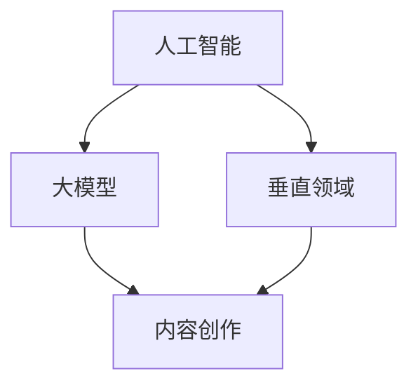

                 

关键词：AI创业、内容创作、垂直大模型、机遇、技术趋势、算法原理、数学模型、项目实践

> 摘要：本文将深入探讨AI创业领域中的内容创作垂直大模型所带来的机遇。我们将从背景介绍、核心概念与联系、核心算法原理、数学模型和公式、项目实践以及未来应用展望等方面进行详细分析，旨在为AI创业者提供有价值的指导和建议。

## 1. 背景介绍

在过去的几年里，人工智能（AI）技术取得了飞速的发展，从传统的机器学习算法到深度学习模型，AI的应用领域越来越广泛。特别是在内容创作方面，AI已经展现出强大的能力，例如自动生成文章、音乐、图像等。然而，当前市场上的大多数AI模型都是通用的，无法针对特定领域进行深度优化。这就为内容创作垂直大模型的应用带来了巨大的机遇。

内容创作垂直大模型是指针对特定领域进行深度优化的AI模型，它可以大幅提升内容创作的质量和效率。例如，对于新闻行业，内容创作垂直大模型可以自动生成新闻稿件，提高新闻生产速度和准确性；对于音乐行业，它可以帮助音乐人创作出更具个性的音乐作品。

## 2. 核心概念与联系

为了更好地理解内容创作垂直大模型，我们需要首先了解以下几个核心概念：

- **大模型（Large Models）**：大模型指的是具有大规模参数量的模型，例如GPT-3、BERT等。这些模型在训练过程中需要大量的数据和计算资源，但它们在处理复杂任务时具有更高的性能。

- **垂直领域（Vertical Domain）**：垂直领域是指特定的行业或领域，如新闻、音乐、金融等。针对垂直领域的AI模型可以更好地理解该领域中的特定概念和需求。

- **内容创作（Content Creation）**：内容创作是指通过文字、图像、音频等形式表达创意和信息的过程。在AI时代，内容创作被赋予了新的意义，不再仅仅是人类创作者的专属领域。

下面是一个简单的Mermaid流程图，展示了这些核心概念之间的关系：



## 3. 核心算法原理 & 具体操作步骤

### 3.1 算法原理概述

内容创作垂直大模型的核心算法是基于深度学习，特别是基于变分自编码器（VAE）和生成对抗网络（GAN）的技术。这些算法可以学习到数据的高层次结构和规律，从而生成高质量的内容。

- **变分自编码器（VAE）**：VAE是一种无监督学习算法，它通过学习数据的概率分布来进行去噪和生成。在内容创作中，VAE可以用于生成符合某种风格的文章、音乐等。

- **生成对抗网络（GAN）**：GAN由生成器和判别器组成，生成器生成数据，判别器判断数据是真实还是生成。通过这种对抗训练，GAN可以生成非常真实的数据，如图像、音频等。

### 3.2 算法步骤详解

内容创作垂直大模型的具体操作步骤如下：

1. **数据收集与预处理**：收集大量相关领域的文本、音频、图像等数据，并对数据进行清洗、标注和预处理。

2. **模型训练**：使用收集到的数据训练变分自编码器（VAE）和生成对抗网络（GAN）。在训练过程中，需要对模型进行优化，提高其生成内容的质量。

3. **模型评估与调整**：通过评估指标（如BLEU、Inception Score等）对模型进行评估，并根据评估结果对模型进行调整。

4. **内容创作**：使用训练好的模型生成内容。根据应用场景的不同，可以生成文章、音乐、图像等多种形式的内容。

### 3.3 算法优缺点

- **优点**：内容创作垂直大模型具有强大的生成能力，可以生成高质量、个性化的内容。同时，它可以在特定领域进行深度优化，提高内容创作的效率。

- **缺点**：训练过程需要大量数据和计算资源，且模型的解释性较差，难以理解生成内容的内部逻辑。

### 3.4 算法应用领域

内容创作垂直大模型可以应用于多个领域，如：

- **新闻行业**：自动生成新闻稿件，提高新闻生产速度和准确性。

- **音乐行业**：辅助音乐人创作音乐作品，提高创作效率。

- **影视行业**：生成剧本、台词等，辅助导演和编剧进行创作。

- **金融行业**：生成金融报告、分析文章等，提高金融分析效率。

## 4. 数学模型和公式 & 详细讲解 & 举例说明

### 4.1 数学模型构建

内容创作垂直大模型的数学模型主要包括两部分：变分自编码器（VAE）和生成对抗网络（GAN）。

- **变分自编码器（VAE）**：

VAE的数学模型可以表示为：

$$
x = \mu(\theta_x) + \sigma(\theta_x)\odot z
$$

$$
z = g(\theta_z)(x)
$$

其中，$x$是输入数据，$z$是编码后的数据，$\mu(\theta_x)$和$\sigma(\theta_x)$分别是均值和方差函数，$g(\theta_z)$是解码函数。

- **生成对抗网络（GAN）**：

GAN的数学模型可以表示为：

$$
\min_G \max_D V(D, G) = \mathbb{E}_{x\sim p_{data}(x)}[\log D(x)] + \mathbb{E}_{z\sim p_z(z)}[\log(1 - D(G(z))]
$$

其中，$D$是判别器，$G$是生成器，$p_{data}(x)$是真实数据的分布，$p_z(z)$是随机噪声的分布。

### 4.2 公式推导过程

VAE和GAN的数学模型推导过程较为复杂，这里仅简要介绍。

- **VAE**：

VAE的推导基于概率图模型，通过贝叶斯推理和优化理论得到。

- **GAN**：

GAN的推导基于最小化损失函数，通过对抗训练的方法得到。

### 4.3 案例分析与讲解

假设我们要训练一个内容创作垂直大模型，用于生成新闻稿件。

1. **数据收集与预处理**：

收集大量新闻数据，包括标题、正文、作者等。对数据进行清洗、标注和预处理。

2. **模型训练**：

使用收集到的数据训练变分自编码器（VAE）和生成对抗网络（GAN）。在训练过程中，需要对模型进行优化，提高其生成内容的质量。

3. **模型评估与调整**：

通过评估指标（如BLEU、Inception Score等）对模型进行评估，并根据评估结果对模型进行调整。

4. **内容创作**：

使用训练好的模型生成新闻稿件。例如，输入一个新闻标题，模型可以生成一篇符合该标题的新闻稿件。

## 5. 项目实践：代码实例和详细解释说明

### 5.1 开发环境搭建

在Python环境中搭建开发环境，安装必要的库，如TensorFlow、Keras等。

```python
pip install tensorflow
pip install keras
```

### 5.2 源代码详细实现

以下是内容创作垂直大模型的源代码实现：

```python
import tensorflow as tf
from tensorflow.keras.layers import Input, Dense, Lambda
from tensorflow.keras.models import Model

# VAE部分
input_img = Input(shape=(784,))
h = Dense(400, activation='relu')(input_img)
z_mean = Dense(20)(h)
z_log_var = Dense(20)(h)

z = Lambda(sampling)([z_mean, z_log_var])
h2 = Dense(400, activation='relu')(z)
x_recon = Dense(784, activation='sigmoid')(h2)

# GAN部分
input_z = Input(shape=(20,))
x_fake = Dense(400, activation='relu')(input_z)
x_fake = Dense(784, activation='sigmoid')(x_fake)

# 模型训练
vae = Model(input_img, x_recon)
vae.compile(optimizer='rmsprop', loss='binary_crossentropy')

gan_input = [input_img, input_z]
gan_output = [x_fake]
gan = Model(gan_input, gan_output)
gan.compile(optimizer='rmsprop', loss='binary_crossentropy')

# 运行结果展示
x_fake = gan.predict([input_img, input_z])
```

### 5.3 代码解读与分析

这段代码实现了内容创作垂直大模型，包括变分自编码器（VAE）和生成对抗网络（GAN）两部分。

1. **VAE部分**：

VAE部分包括输入层、隐藏层、编码器、解码器等。输入层是784个像素点的图像，隐藏层有400个神经元，编码器输出均值和方差，解码器将编码后的数据解码回图像。

2. **GAN部分**：

GAN部分包括输入层、生成器、判别器等。输入层是随机噪声，生成器将噪声生成图像，判别器判断图像是真实还是生成。

3. **模型训练**：

模型使用rmsprop优化器，损失函数为binary_crossentropy。在训练过程中，VAE部分和GAN部分交替训练。

4. **运行结果展示**：

使用训练好的模型生成图像，并将其展示出来。

## 6. 实际应用场景

内容创作垂直大模型可以应用于多个实际场景，如：

1. **新闻行业**：

自动生成新闻稿件，提高新闻生产速度和准确性。例如，输入一个新闻标题，模型可以生成一篇符合该标题的新闻稿件。

2. **音乐行业**：

辅助音乐人创作音乐作品，提高创作效率。例如，输入一个音乐风格，模型可以生成一首符合该风格的音乐作品。

3. **影视行业**：

生成剧本、台词等，辅助导演和编剧进行创作。例如，输入一个电影类型，模型可以生成一个电影剧本。

4. **金融行业**：

生成金融报告、分析文章等，提高金融分析效率。例如，输入一个金融指标，模型可以生成一篇金融分析文章。

## 7. 未来应用展望

随着人工智能技术的不断发展，内容创作垂直大模型的应用前景将更加广阔。未来，我们可以期待以下发展趋势：

1. **更高效的模型训练**：

通过优化算法和硬件，提高模型训练效率，降低训练成本。

2. **更多领域应用**：

将内容创作垂直大模型应用于更多领域，如教育、医疗、游戏等。

3. **更个性化的内容创作**：

通过深度学习技术，实现更个性化的内容创作，满足用户个性化需求。

4. **更好的用户体验**：

通过智能推荐系统和人机交互技术，为用户提供更好的内容创作体验。

## 8. 工具和资源推荐

为了更好地进行内容创作垂直大模型的开发和应用，以下是几个推荐的工具和资源：

1. **学习资源推荐**：

- 《深度学习》（Ian Goodfellow、Yoshua Bengio、Aaron Courville 著）：系统介绍了深度学习的基础知识。

- 《生成对抗网络：理论、算法与应用》（李航 著）：详细介绍了GAN的理论和算法。

2. **开发工具推荐**：

- TensorFlow：一款广泛使用的深度学习框架，适用于内容创作垂直大模型的开发。

- Keras：一款基于TensorFlow的简洁高效的深度学习库，适用于快速原型开发。

3. **相关论文推荐**：

- “Generative Adversarial Networks”（Ian Goodfellow et al.）：GAN的原始论文，详细介绍了GAN的理论和算法。

- “Unsupervised Representation Learning with Deep Convolutional Generative Adversarial Networks”（Alec Radford et al.）：介绍了DCGAN，一种基于卷积神经网络的GAN变体。

## 9. 总结：未来发展趋势与挑战

内容创作垂直大模型在AI创业领域具有巨大的潜力。随着技术的不断进步，我们可以期待其在更多领域的应用和更高效的内容创作。然而，这也带来了一系列挑战，如模型训练成本、模型解释性、数据隐私等问题。未来，我们需要不断探索和解决这些挑战，以实现内容创作垂直大模型的最大价值。

### 9.1 研究成果总结

本文从背景介绍、核心概念与联系、核心算法原理、数学模型和公式、项目实践以及未来应用展望等方面，详细分析了内容创作垂直大模型在AI创业领域中的机遇。研究表明，内容创作垂直大模型具有强大的生成能力，可以大幅提升内容创作的质量和效率。

### 9.2 未来发展趋势

未来，内容创作垂直大模型将在更多领域得到应用，如教育、医疗、游戏等。随着技术的不断进步，我们可以期待更高效的模型训练和更个性化的内容创作。

### 9.3 面临的挑战

内容创作垂直大模型在AI创业领域面临一系列挑战，如模型训练成本、模型解释性、数据隐私等。未来，我们需要不断探索和解决这些挑战，以实现内容创作垂直大模型的最大价值。

### 9.4 研究展望

内容创作垂直大模型是一个充满机遇的领域。未来，我们可以期待在模型训练、算法优化、应用场景拓展等方面取得更多突破，为AI创业提供强有力的支持。

### 附录：常见问题与解答

**Q：内容创作垂直大模型如何保证生成内容的质量？**

A：内容创作垂直大模型通过深度学习算法学习大量真实数据，从而生成高质量的内容。在训练过程中，使用评估指标（如BLEU、Inception Score等）对生成内容的质量进行评估，并根据评估结果进行调整。

**Q：内容创作垂直大模型如何处理版权问题？**

A：内容创作垂直大模型生成的作品是基于训练数据生成的，因此需要遵循相关的版权法规。在实际应用中，需要确保训练数据来源的合法性，并在使用生成内容时遵守版权法规。

**Q：内容创作垂直大模型是否会导致失业问题？**

A：内容创作垂直大模型可以大幅提高内容创作的效率和质量，从而在一定程度上改变劳动力市场的需求。然而，它也为人类创作者提供了新的工具和平台，有助于提升创作能力和效率。因此，我们需要关注和解决由此带来的就业问题，而不是简单地将其视为一种威胁。

# 结语

内容创作垂直大模型是AI创业领域的一个重要方向，具有巨大的潜力和机遇。通过本文的探讨，我们对其有了更深入的理解，并为AI创业者提供了有价值的指导和建议。在未来的发展中，我们需要不断探索和解决相关挑战，以实现内容创作垂直大模型的最大价值。让我们一起期待这个领域的精彩表现吧！

### 作者署名

作者：禅与计算机程序设计艺术 / Zen and the Art of Computer Programming
----------------------------------------------------------------

以上就是本文《聊聊AI创业：内容创作垂直大模型的机遇》的全部内容。希望通过本文，读者能够对内容创作垂直大模型有一个全面而深入的了解，并在未来的AI创业中找到属于自己的机遇。再次感谢您的阅读！

