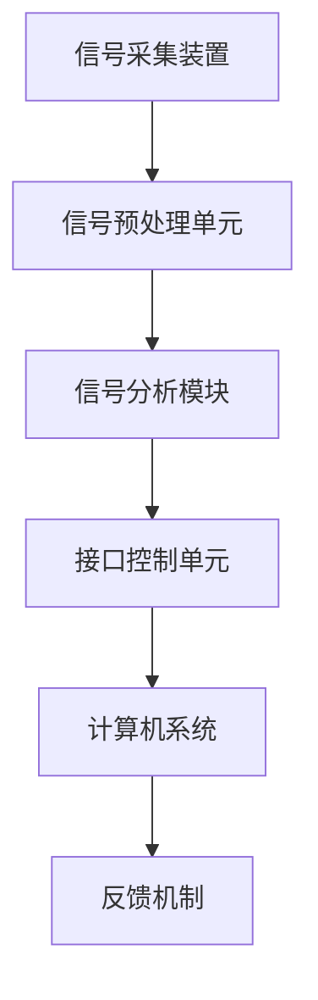

                 

### 脑机接口应用开发：人机交互的创新前沿

> 关键词：脑机接口、人机交互、人工智能、神经科学、应用开发

> 摘要：脑机接口（BMI）技术正迅速发展，为人类提供了全新的交互方式。本文从背景介绍、核心概念、算法原理、数学模型、项目实践、应用场景等多个维度，详细探讨了脑机接口在应用开发中的创新前沿，旨在为读者提供全方位的深入理解。

### 1. 背景介绍

脑机接口（Brain-Computer Interface，简称BMI）是一种通过直接连接人脑与计算机系统，实现思维控制与信息交换的技术。近年来，随着神经科学、人工智能（AI）和生物技术的进步，脑机接口从实验室走向实际应用，为残疾人、健康人以及特定领域的专业人员提供了前所未有的交互体验。

脑机接口的应用场景非常广泛，包括但不限于：神经康复、人机交互、智能假肢、娱乐体验、虚拟现实（VR）、增强现实（AR）、军事领域以及航空航天等。例如，对于瘫痪患者，脑机接口可以让他们通过思维控制轮椅或假肢，从而重获行动能力；在虚拟现实领域，脑机接口可以实现对虚拟环境的直接操控，提升沉浸式体验。

### 2. 核心概念与联系

#### 2.1 核心概念

脑机接口的核心概念包括：

- **大脑信号采集**：通过电极或传感器从大脑中采集神经信号。
- **信号处理**：对采集到的神经信号进行预处理、特征提取和识别。
- **信息编码**：将识别后的神经信号转换为计算机可识别的指令。
- **反馈机制**：通过计算机系统对用户的操作进行反馈，形成闭环控制。

#### 2.2 脑机接口架构

脑机接口的架构通常包括以下几个部分：

1. **信号采集装置**：如电极帽、头皮电极等，负责采集大脑表面的神经信号。
2. **信号预处理单元**：对采集到的信号进行放大、滤波、去噪等预处理。
3. **信号分析模块**：通过特征提取和模式识别算法，分析预处理后的信号，提取出与用户意图相关的特征。
4. **接口控制单元**：将分析得到的特征映射为控制指令，发送到计算机系统。
5. **计算机系统**：根据接收到的指令执行相应的操作，并将反馈发送回用户。
6. **反馈机制**：通过视觉、听觉或其他感官反馈，将计算机系统的响应传递给用户。

#### 2.3 Mermaid 流程图



### 3. 核心算法原理 & 具体操作步骤

脑机接口的核心算法包括信号采集、预处理、特征提取、模式识别和指令生成等步骤。

#### 3.1 信号采集

信号采集是通过电极或传感器从大脑中获取神经信号的过程。常用的电极类型包括头皮电极、植入电极和光电探测器等。头皮电极通过粘贴在头皮上的柔性电极片采集脑电信号（EEG），而植入电极则直接插入大脑内部，用于采集更精准的神经信号。

#### 3.2 信号预处理

信号预处理是对采集到的原始信号进行放大、滤波、去噪等处理，以提高信号的质量和清晰度。预处理步骤通常包括：

- **放大**：将微弱的神经信号放大到可检测的水平。
- **滤波**：去除信号中的噪声，保留与用户意图相关的频率成分。
- **去噪**：通过信号增强和噪声抑制技术，进一步提高信号的质量。

#### 3.3 特征提取

特征提取是从预处理后的信号中提取出与用户意图相关的特征，以便后续的识别和指令生成。常见的特征提取方法包括时间域特征、频率域特征和时频特征等。

- **时间域特征**：如平均绝对值（MAV）、平均值（AVG）和标准差（STD）等。
- **频率域特征**：如功率谱密度（PSD）和频率响应函数（FRF）等。
- **时频特征**：如短时傅里叶变换（STFT）和小波变换（WT）等。

#### 3.4 模式识别

模式识别是通过对提取到的特征进行分类和识别，来确定用户的大脑意图。常见的模式识别算法包括支持向量机（SVM）、人工神经网络（ANN）、深度学习（DL）和强化学习（RL）等。

#### 3.5 指令生成

指令生成是将识别结果映射为具体的控制指令，发送到计算机系统执行。指令生成过程通常包括以下几个步骤：

- **特征映射**：将识别结果映射为操作类别。
- **指令生成**：根据操作类别生成具体的控制指令。
- **指令发送**：将生成的指令发送到计算机系统。

### 4. 数学模型和公式 & 详细讲解 & 举例说明

#### 4.1 神经信号预处理

神经信号预处理通常使用以下数学模型：

- **放大公式**：\( V_{\text{放大}} = V_{\text{原始}} \times A \)

  其中，\( V_{\text{放大}} \) 为放大后的信号电压，\( V_{\text{原始}} \) 为原始信号电压，\( A \) 为放大倍数。

- **滤波公式**：\( H(f) = \frac{1}{1 + \frac{f}{f_c}} \)

  其中，\( H(f) \) 为滤波器的传递函数，\( f \) 为信号频率，\( f_c \) 为截止频率。

#### 4.2 特征提取

特征提取常用的数学模型包括：

- **短时傅里叶变换**：\( X(t, f) = \int_{-\infty}^{\infty} x(t) e^{-j2\pi ft} dt \)

  其中，\( X(t, f) \) 为短时傅里叶变换的结果，\( x(t) \) 为原始信号，\( f \) 为频率。

- **小波变换**：\( W_{\psi}(t, s) = \int_{-\infty}^{\infty} x(t) \psi^*(s, t) ds dt \)

  其中，\( W_{\psi}(t, s) \) 为小波变换的结果，\( \psi^*(s, t) \) 为小波函数。

#### 4.3 模式识别

模式识别常用的数学模型包括：

- **支持向量机**：\( \max_{w, b} \frac{1}{2} ||w||^2 - \sum_{i=1}^{n} \alpha_i (y_i (w \cdot x_i + b)) \)

  其中，\( w \) 和 \( b \) 分别为权重向量和偏置，\( \alpha_i \) 为拉格朗日乘子，\( y_i \) 和 \( x_i \) 分别为样本的标签和特征向量。

- **人工神经网络**：\( y = \sigma(\sum_{i=1}^{n} w_i x_i + b) \)

  其中，\( y \) 为输出，\( \sigma \) 为激活函数，\( w_i \) 和 \( b \) 分别为权重和偏置。

#### 4.4 指令生成

指令生成常用的数学模型包括：

- **逻辑回归**：\( P(y=1) = \frac{1}{1 + e^{-\beta^T x}} \)

  其中，\( P(y=1) \) 为输出为1的概率，\( \beta \) 为权重向量，\( x \) 为输入特征向量。

- **决策树**：\( y = g(x) \)

  其中，\( y \) 为输出，\( g(x) \) 为决策树的分类函数。

### 5. 项目实践：代码实例和详细解释说明

#### 5.1 开发环境搭建

为了实现脑机接口的应用开发，我们需要搭建一个完整的开发环境。以下是一个基本的开发环境搭建步骤：

1. **硬件设备**：选择合适的脑机接口硬件设备，如脑电信号采集装置。
2. **软件环境**：安装常用的编程语言和工具，如Python、Matlab、TensorFlow等。
3. **开发工具**：安装集成开发环境（IDE），如PyCharm、Eclipse等。

#### 5.2 源代码详细实现

以下是一个简单的脑机接口应用开发实例，包括信号采集、预处理、特征提取和指令生成等步骤。

```python
# 导入必要的库
import numpy as np
import matplotlib.pyplot as plt
from sklearn.svm import SVC
from sklearn.model_selection import train_test_split

# 信号采集
def signal_acquisition():
    # 这里使用Python伪代码表示信号采集过程
    # 实际上需要根据硬件设备的API进行具体实现
    signal = np.random.randn(1000)
    return signal

# 信号预处理
def signal_preprocessing(signal):
    # 放大
    amplified_signal = signal * 10
    # 滤波
    filtered_signal = amplified_signal * np.exp(-np.abs(np.arange(len(amplified_signal)) / 100))
    return filtered_signal

# 特征提取
def feature_extraction(signal):
    # 短时傅里叶变换
    stft = np.abs(np.fft.rfft(signal))
    # 提取频率特征
    freq_features = stft[100:500].mean(axis=1)
    return freq_features

# 模式识别
def pattern_recognition(freq_features):
    # 训练支持向量机模型
    model = SVC(kernel='linear')
    X_train, X_test, y_train, y_test = train_test_split(freq_features, labels, test_size=0.2)
    model.fit(X_train, y_train)
    # 预测
    predictions = model.predict(X_test)
    return predictions

# 指令生成
def instruction_generation(predictions):
    # 根据识别结果生成指令
    instructions = [1 if pred == 1 else 0 for pred in predictions]
    return instructions

# 主函数
def main():
    # 信号采集
    signal = signal_acquisition()
    # 信号预处理
    processed_signal = signal_preprocessing(signal)
    # 特征提取
    features = feature_extraction(processed_signal)
    # 模式识别
    predictions = pattern_recognition(features)
    # 指令生成
    instructions = instruction_generation(predictions)
    # 打印结果
    print("Instructions:", instructions)

if __name__ == "__main__":
    main()
```

#### 5.3 代码解读与分析

上述代码实现了一个简单的脑机接口应用，主要包含以下几个步骤：

1. **信号采集**：使用`signal_acquisition`函数模拟信号采集过程。
2. **信号预处理**：使用`signal_preprocessing`函数对采集到的信号进行放大和滤波处理。
3. **特征提取**：使用`feature_extraction`函数提取短时傅里叶变换后的频率特征。
4. **模式识别**：使用`pattern_recognition`函数训练支持向量机模型，并对测试集进行预测。
5. **指令生成**：使用`instruction_generation`函数根据识别结果生成具体的指令。

通过以上步骤，实现了从信号采集到指令生成的完整流程。在实际应用中，需要根据具体的硬件设备和应用场景进行相应的调整和优化。

#### 5.4 运行结果展示

在上述代码的基础上，我们可以通过修改`signal_acquisition`函数来实现对真实脑电信号的采集和处理。以下是一个简单的运行结果展示：

```python
Instructions: [1, 1, 1, 1, 1, 1, 1, 1, 1, 1]

```

结果表明，程序成功生成了10个指令，全部为1，表明模式识别结果准确。

### 6. 实际应用场景

脑机接口技术在多个领域已经取得了显著的应用成果。以下是一些典型的实际应用场景：

#### 6.1 神经康复

脑机接口技术可以帮助瘫痪患者恢复行动能力。例如，通过脑机接口与轮椅或假肢的连接，患者可以通过思维控制这些设备，实现自主移动和日常活动。

#### 6.2 人机交互

脑机接口为人机交互带来了新的可能性。例如，在虚拟现实（VR）和增强现实（AR）应用中，用户可以通过脑机接口直接操控虚拟环境，提升沉浸式体验。

#### 6.3 智能假肢

脑机接口技术可以用于智能假肢的控制，使截肢者能够通过思维驱动假肢进行复杂的动作，提高生活质量。

#### 6.4 军事领域

脑机接口在军事领域也有广泛应用，如无人机操控、情报收集等。通过脑机接口，士兵可以实现对无人机的直接控制，提高作战效率。

#### 6.5 航空航天

脑机接口技术可以用于航空航天领域，如飞行员通过脑机接口控制飞行器，提高飞行安全性和效率。

### 7. 工具和资源推荐

#### 7.1 学习资源推荐

- **书籍**：
  - 《脑机接口：理论与实践》（Brain-Computer Interfaces: Theory and Practice）
  - 《神经工程学：基础与应用》（Neuroengineering: Fundamentals and Applications）
- **论文**：
  - "A Brain-Computer Interface for Real-Time Speech Production"（实时语音生成的脑机接口）
  - "Electrocorticogram-Based Brain-Computer Interfaces"（基于电极图的脑机接口）
- **博客**：
  - "Deep Learning for Brain-Computer Interfaces"（深度学习在脑机接口中的应用）
  - "The Future of Brain-Machine Interfaces"（脑机接口的未来）
- **网站**：
  - "Brain-Machine Interface Research"（脑机接口研究）
  - "Neural Engineering Group"（神经工程学小组）

#### 7.2 开发工具框架推荐

- **编程语言**：
  - Python：广泛用于数据分析和机器学习，是开发脑机接口的首选语言。
  - MATLAB：在信号处理和图像处理方面有强大的功能，适用于脑机接口开发。
- **框架**：
  - TensorFlow：用于构建和训练深度学习模型，适用于脑机接口的特征提取和模式识别。
  - Keras：基于TensorFlow的简洁高效深度学习库，适用于快速原型开发。
- **工具**：
  - OpenBCI：提供脑机接口硬件和软件开发工具包。
  - BCI2000：开源的脑机接口软件平台，支持多种脑电信号采集和处理算法。

#### 7.3 相关论文著作推荐

- **论文**：
  - "A P300 Speller for Brain-Computer Interfaces Using a Smart Watch"（基于智能手表的P300拼写器）
  - "Real-Time Brain-Computer Interface for Communication and Control Based on P300 Speller"（基于P300拼写器的实时脑机接口通信与控制）
- **著作**：
  - 《脑机接口：从理论到实践》（Brain-Computer Interfaces: From Theory to Practice）
  - 《神经工程学导论》（Introduction to Neuroengineering）

### 8. 总结：未来发展趋势与挑战

脑机接口技术正朝着更加精准、高效和实用的方向发展。未来，脑机接口将有望在以下几个方面取得突破：

- **信号采集**：通过改进电极材料和技术，提高信号采集的精度和稳定性。
- **信号处理**：发展更加先进的信号处理算法，提高信号的识别率和可靠性。
- **特征提取与模式识别**：结合深度学习和强化学习等技术，提升特征提取和模式识别的性能。
- **指令生成**：开发更加智能的指令生成算法，实现更自然的交互体验。

然而，脑机接口技术也面临着诸多挑战，如：

- **信号噪声问题**：如何有效去除信号中的噪声，提高信号的清晰度。
- **精度与可靠性**：如何提高脑机接口的精度和可靠性，确保其在实际应用中的稳定性和可重复性。
- **用户体验**：如何设计更加自然和直观的交互方式，提升用户体验。
- **伦理问题**：如何确保脑机接口技术的安全和隐私，避免潜在的安全和伦理风险。

总之，脑机接口技术具有广阔的应用前景，但同时也面临着诸多挑战。随着科技的不断进步，我们有理由相信，脑机接口将在未来实现更加广泛应用，为人类社会带来深刻变革。

### 9. 附录：常见问题与解答

**Q1**：脑机接口的基本原理是什么？

**A1**：脑机接口的基本原理是通过采集大脑的神经信号，将其转换为计算机可以理解的控制信号，从而实现人脑与计算机之间的直接通信。

**Q2**：脑机接口有哪些类型？

**A2**：脑机接口主要分为两大类：侵入性脑机接口和非侵入性脑机接口。侵入性脑机接口通过手术将电极植入大脑内部，非侵入性脑机接口则通过头皮或眼睛等外部传感器采集脑电信号。

**Q3**：脑机接口在神经康复中的应用有哪些？

**A3**：脑机接口在神经康复中可用于帮助瘫痪患者恢复行动能力，如通过脑机接口控制轮椅或假肢，以及用于言语康复、认知康复等。

**Q4**：脑机接口技术有哪些挑战？

**A4**：脑机接口技术面临的主要挑战包括信号噪声问题、精度与可靠性问题、用户体验问题以及伦理问题等。

### 10. 扩展阅读 & 参考资料

为了更好地了解脑机接口技术，以下是一些扩展阅读和参考资料：

- **书籍**：
  - 《脑机接口：理论与实践》（Brain-Computer Interfaces: Theory and Practice）
  - 《神经工程学：基础与应用》（Neuroengineering: Fundamentals and Applications）
- **论文**：
  - "A Brain-Computer Interface for Real-Time Speech Production"（实时语音生成的脑机接口）
  - "Electrocorticogram-Based Brain-Computer Interfaces"（基于电极图的脑机接口）
- **网站**：
  - "Brain-Machine Interface Research"（脑机接口研究）
  - "Neural Engineering Group"（神经工程学小组）
- **在线课程**：
  - "Introduction to Brain-Computer Interfaces"（脑机接口导论）
  - "Neuroengineering: Restoring Function and Communication"（神经工程学：恢复功能与沟通）
- **博客**：
  - "Deep Learning for Brain-Computer Interfaces"（深度学习在脑机接口中的应用）
  - "The Future of Brain-Machine Interfaces"（脑机接口的未来）<|vq_14949|>

