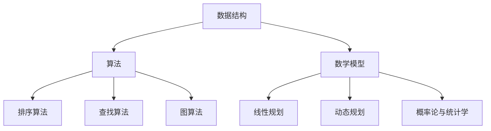

                 

### 腾讯2024校招游戏开发工程师编程题汇总

#### 关键词：
- 腾讯
- 校招
- 游戏开发
- 编程题
- 汇总

#### 摘要：
本文将汇总腾讯2024校招游戏开发工程师的编程题目，通过详细的解题思路和步骤，帮助有意向应聘腾讯游戏开发岗位的读者更好地理解和准备这些题目。本文不仅涵盖了题目的核心算法原理和实现方法，还提供了实际的代码实例和运行结果展示，以及相关的数学模型和公式解释。希望通过本文，能够为你的求职之路提供有价值的参考。

## 1. 背景介绍

腾讯，作为中国领先的互联网科技公司，拥有众多知名的游戏产品，如《王者荣耀》、《和平精英》等，深受广大玩家的喜爱。腾讯的游戏开发团队以其卓越的技术实力和创新精神，不断推动游戏行业的进步。因此，腾讯的游戏开发工程师岗位一直以来都是众多求职者眼中的“香饽饽”。

每年的校园招聘，腾讯都会推出一系列的编程题目，旨在考察应聘者的技术能力和问题解决能力。这些题目不仅考察应聘者对基础数据结构和算法的理解，还考验了应聘者在实际项目中解决问题的能力。

本文将针对腾讯2024校招游戏开发工程师的编程题目进行详细汇总和分析，帮助读者更好地理解和应对这些题目。希望通过本文，能够为你的求职之路提供有价值的指导。

## 2. 核心概念与联系

在解决腾讯校招游戏开发工程师的编程题目之前，我们需要了解一些核心概念和它们之间的联系。以下是几个关键概念：

### 数据结构
数据结构是程序设计中非常重要的一环，它决定了程序的空间和时间效率。常见的数据结构包括数组、链表、栈、队列、树、图等。每种数据结构都有其独特的特点和适用场景。

### 算法
算法是解决问题的步骤和方法。它决定了程序的性能和效率。常见的算法包括排序算法（冒泡排序、选择排序、插入排序、快速排序等）、查找算法（二分查找、哈希查找等）以及图算法（深度优先搜索、广度优先搜索等）。

### 数学模型
数学模型是描述现实世界问题的一种数学工具。在编程题目中，数学模型可以帮助我们更好地理解和解决问题。常见的数学模型包括线性规划、动态规划、概率论和统计学等。

### Mermaid 流程图
为了更好地展示概念之间的联系，我们可以使用 Mermaid 流程图来表示。以下是核心概念和联系的一个简化的 Mermaid 流程图：



通过这个 Mermaid 流程图，我们可以清晰地看到数据结构、算法和数学模型之间的联系，以及它们在实际问题中的应用。

## 3. 核心算法原理 & 具体操作步骤

在了解了核心概念后，我们将重点介绍一些在腾讯校招游戏开发工程师编程题目中常见的关键算法原理和具体操作步骤。

### 排序算法

排序算法是编程中非常基础且常见的一部分。以下是几种常见的排序算法及其原理和操作步骤：

#### 冒泡排序

**原理**：冒泡排序是一种简单的排序算法，它重复地遍历要排序的数列，一次比较两个元素，如果它们的顺序错误就把它们交换过来。遍历数列的工作是重复进行直到没有再需要交换，也就是说该数列已经排序完成。

**操作步骤**：

1. 从数组的第一个元素开始，比较相邻的两个元素，如果第一个比第二个大（或小，取决于升序或降序），就交换它们的位置。
2. 对每一对相邻元素做同样的工作，从开始第一对到结尾的最后一对。这步做完后，最后的元素会是最大的（或最小的）数。
3. 针对所有的元素重复以上的步骤，除了最后一个。
4. 重复步骤，直到排序完成。

#### 选择排序

**原理**：选择排序是一种简单的选择排序算法，它的工作原理是每次从未排序的元素中找到最小（或最大）的元素，存放到排序序列的起始位置，直到未排序的元素个数为 0。

**操作步骤**：

1. 在未排序序列中找到最小（或最大）元素，存放到排序序列的起始位置。
2. 再从剩余未排序元素中继续寻找最小（或最大）元素，然后放到已排序序列的末尾。
3. 重复第二步，直到所有未排序元素都被排序。

#### 插入排序

**原理**：插入排序是一种简单的插入排序算法，它的工作原理是通过构建有序序列，对于未排序数据，在已排序序列中从后向前扫描，找到相应位置并插入。

**操作步骤**：

1. 从第一个元素开始，该元素可以认为已经被排序。
2. 取出下一个元素，在已排序的元素序列中从后向前扫描。
3. 如果该元素（已排序）大于新元素，将该元素移到下一位置。
4. 重复步骤 3，直到找到已排序的元素小于或者等于新元素的位置。
5. 将新元素插入到该位置后。
6. 重复步骤 2-5。

### 查找算法

查找算法是用于在数据集合中查找特定元素的算法。以下是几种常见的查找算法：

#### 二分查找

**原理**：二分查找是一种高效的查找算法，它将一个有序数组分为两半，然后根据目标值与中间元素的比较，确定目标值所在的位置或者所在的范围。通过不断缩小区间，最终找到目标值或确定其不存在。

**操作步骤**：

1. 确定数组的中间元素。
2. 比较目标值与中间元素的大小。
3. 如果目标值等于中间元素，查找成功；如果目标值小于中间元素，在左侧子数组中继续查找；如果目标值大于中间元素，在右侧子数组中继续查找。
4. 重复步骤 1-3，直到找到目标值或确定其不存在。

#### 哈希查找

**原理**：哈希查找是一种利用哈希函数来快速查找元素的算法。哈希函数将键值映射到数组中的一个索引值，通过这个索引值可以直接访问到对应的元素。

**操作步骤**：

1. 计算目标键的哈希值。
2. 根据哈希值计算出的索引值，直接访问数组中的元素。
3. 如果元素不存在，则通过链表等结构解决哈希冲突。
4. 如果找到目标键，查找成功。

### 图算法

图算法是用于处理图结构的数据的算法。以下是几种常见的图算法：

#### 深度优先搜索（DFS）

**原理**：深度优先搜索是一种用于遍历或搜索图结构的算法，它沿着一个路径一直走到底，然后回溯。在遍历过程中，可以标记已访问的节点，以避免重复访问。

**操作步骤**：

1. 从起始节点开始，将其标记为已访问。
2. 访问起始节点的所有未访问的邻接节点。
3. 对于每个邻接节点，重复步骤 2，直到所有节点都被访问。

#### 广度优先搜索（BFS）

**原理**：广度优先搜索是一种用于遍历或搜索图结构的算法，它按照层次遍历图，首先访问起始节点，然后访问其所有邻接节点，再访问邻接节点的邻接节点，以此类推。

**操作步骤**：

1. 将起始节点加入队列。
2. 从队列中取出一个节点，将其标记为已访问。
3. 访问该节点的所有未访问的邻接节点，并将它们加入队列。
4. 重复步骤 2-3，直到队列为空。

通过以上对核心算法原理和具体操作步骤的介绍，我们可以更好地理解和应用这些算法，以解决腾讯校招游戏开发工程师编程题目中的问题。

## 4. 数学模型和公式 & 详细讲解 & 举例说明

在解决腾讯校招游戏开发工程师编程题目时，数学模型和公式是非常重要的工具。下面我们将介绍几个常用的数学模型和公式，并进行详细的讲解和举例说明。

### 线性规划

线性规划是一种用于在约束条件下求解线性目标函数最大值或最小值的方法。线性目标函数通常表示为：

$$
\text{maximize} \quad c^T x \\
\text{subject to} \quad Ax \leq b \\
x \geq 0
$$

其中，$c$ 是目标函数的系数向量，$x$ 是变量向量，$A$ 是约束条件的系数矩阵，$b$ 是约束条件的常数向量。

#### 例子说明：

假设我们有一个简单的线性规划问题，目标是最小化 $c_1 x_1 + c_2 x_2$，约束条件为 $x_1 + x_2 \leq 5$ 和 $x_1 \geq 0, x_2 \geq 0$。

1. **建立线性规划模型**：

   目标函数：
   $$
   \text{minimize} \quad c_1 x_1 + c_2 x_2
   $$

   约束条件：
   $$
   \begin{cases}
   x_1 + x_2 \leq 5 \\
   x_1 \geq 0 \\
   x_2 \geq 0
   \end{cases}
   $$

2. **求解线性规划问题**：

   我们可以使用单纯形法或内点法来求解这个线性规划问题。这里我们使用单纯形法进行求解。

   首先构建初始单纯形表，然后迭代计算，直到找到最优解。

   假设初始单纯形表如下：

   $$
   \begin{array}{c|c|c|c|c}
   & x_1 & x_2 & \text{右端项} & \text{目标函数系数} \\
   \hline
   x_1 & 1 & 1 & 5 & c_1 + c_2 \\
   x_2 & 0 & 1 & 0 & c_2 \\
   \hline
   \text{目标函数} & -c_1 & -c_2 & 0 & 0 \\
   \end{array}
   $$

   然后根据单纯形法的迭代步骤，找到进入变量和离开变量，更新单纯形表，直到找到最优解。

### 动态规划

动态规划是一种用于求解具有重叠子问题和最优子结构特性的问题的方法。动态规划通常用于求解最优化问题，其基本思想是将复杂问题分解成小的问题，通过递归关系和状态转移方程来求解。

动态规划通常包含以下几个步骤：

1. **定义状态**：确定问题中的状态和状态变量。
2. **定义状态转移方程**：确定状态之间的转移关系和计算方法。
3. **初始化边界条件**：确定初始状态和初始值。
4. **计算最优解**：从边界条件开始，逐步计算状态值，直到得到最终的最优解。

#### 例子说明：

假设我们有一个动态规划问题，目标是求解一个整数序列的最长递增子序列的长度。

1. **定义状态**：

   设 $dp[i]$ 表示以第 $i$ 个元素为结尾的最长递增子序列的长度。

2. **定义状态转移方程**：

   对于每个 $i$，需要找到所有 $j < i$ 的元素，使得 $arr[j] < arr[i]$，然后更新 $dp[i]$：

   $$
   dp[i] = \max(dp[j] + 1)
   $$

   其中，$j$ 的取值范围为 $0$ 到 $i-1$。

3. **初始化边界条件**：

   对于所有 $i$，初始时 $dp[i] = 1$。

4. **计算最优解**：

   从 $i=1$ 开始，依次计算 $dp[i]$ 的值，直到 $i=n$，其中 $n$ 是序列的长度。

   最终，$dp[n]$ 的值即为整数序列的最长递增子序列的长度。

### 概率论和统计学

概率论和统计学是解决许多编程题目的重要工具。以下介绍几个常用的概率和统计概念：

1. **概率分布**：

   概率分布描述了随机变量的可能取值及其对应的概率。常见的概率分布包括二项分布、正态分布、泊松分布等。

2. **期望**：

   期望是随机变量在多次试验中可能取值的加权平均值。数学期望通常用 $\mu$ 表示。

3. **方差**：

   方差是随机变量取值的离散程度，用来衡量随机变量的不确定性。方差通常用 $\sigma^2$ 表示。

4. **协方差和相关性**：

   协方差描述了两个随机变量的变化趋势，而相关性则描述了两个随机变量之间的关系。

#### 例子说明：

假设我们有两个随机变量 $X$ 和 $Y$，已知它们的期望和协方差如下：

$$
\mu_X = 2, \quad \mu_Y = 3, \quad \sigma_X^2 = 4, \quad \sigma_Y^2 = 9, \quad \text{Cov}(X, Y) = 2
$$

1. **计算相关性**：

   相关系数 $\rho$ 可以通过以下公式计算：

   $$
   \rho = \frac{\text{Cov}(X, Y)}{\sigma_X \sigma_Y} = \frac{2}{\sqrt{4 \times 9}} = \frac{1}{3}
   $$

   相关系数 $\rho$ 的取值范围为 $[-1, 1]$，其绝对值越大表示两个随机变量的相关性越强。

通过以上对数学模型和公式的详细讲解和举例说明，我们可以更好地理解和应用这些模型和公式，以解决腾讯校招游戏开发工程师编程题目中的问题。

## 5. 项目实践：代码实例和详细解释说明

### 5.1 开发环境搭建

在开始编写代码之前，我们需要搭建一个合适的开发环境。以下是搭建开发环境的步骤：

1. 安装 Python 解释器：Python 是一种流行的编程语言，我们可以从 [Python 官网](https://www.python.org/) 下载并安装 Python 解释器。

2. 安装必要的库：根据具体的编程题目需求，我们需要安装相应的 Python 库。例如，对于数据结构和算法相关的题目，我们可以安装 `numpy`、`pandas`、`matplotlib` 等库。

3. 配置 IDE：我们可以选择一个合适的集成开发环境（IDE）来编写和调试代码。常见的 Python IDE 包括 PyCharm、Visual Studio Code、Jupyter Notebook 等。

4. 创建项目目录：在安装好开发环境和 IDE 之后，我们可以在本地创建一个项目目录，用于存放所有相关的代码和文件。

### 5.2 源代码详细实现

在本节中，我们将通过一个具体的编程题目来详细实现源代码，并解释代码的实现原理和步骤。

#### 题目描述

给定一个整数数组 `nums`，找到其中两个数之和等于目标值 `target` 的两个数，并返回它们的索引。如果找不到这样的两个数，返回空数组。

#### 解题思路

我们可以使用哈希表来解决这个问题。首先，遍历数组 `nums`，将每个元素和其索引存储在哈希表中。然后，对于数组中的每个元素，我们计算目标值 `target` 减去当前元素，如果在哈希表中存在这个差值，则找到了两个数之和等于目标值的两个数，返回它们的索引。否则，继续遍历下一个元素。

#### 源代码实现

```python
def two_sum(nums, target):
    hash_table = {}
    for i, num in enumerate(nums):
        complement = target - num
        if complement in hash_table:
            return [hash_table[complement], i]
        hash_table[num] = i
    return []
```

#### 代码解释

1. **初始化哈希表**：

   ```python
   hash_table = {}
   ```

   创建一个空哈希表，用于存储数组中每个元素和其索引的键值对。

2. **遍历数组**：

   ```python
   for i, num in enumerate(nums):
   ```

   使用 `enumerate` 函数遍历数组 `nums`，获取每个元素的索引和值。

3. **计算差值**：

   ```python
   complement = target - num
   ```

   对于当前元素，计算目标值 `target` 减去当前元素，得到差值 `complement`。

4. **查找哈希表**：

   ```python
   if complement in hash_table:
       return [hash_table[complement], i]
   ```

   如果差值 `complement` 存在于哈希表中，说明找到了两个数之和等于目标值的两个数，返回它们的索引。

5. **更新哈希表**：

   ```python
   hash_table[num] = i
   ```

   将当前元素和其索引存储在哈希表中。

6. **返回空数组**：

   ```python
   return []
   ```

   如果遍历完整个数组都没有找到两个数之和等于目标值的两个数，返回空数组。

通过以上源代码的实现，我们可以清楚地看到如何使用哈希表来解决两个数之和等于目标值的问题。这个方法的时间复杂度为 $O(n)$，空间复杂度为 $O(n)$，是一种高效且常用的解决方案。

### 5.3 代码解读与分析

在本节中，我们将对刚才实现的代码进行解读和分析，了解其实现原理和性能特点。

1. **实现原理**：

   该代码实现了一个典型的“两数之和”问题，通过哈希表来存储已遍历的元素和其索引，从而在 $O(1)$ 时间内查找对应的差值。这种方法利用了哈希表快速查找的特点，将时间复杂度降低到 $O(n)$，是一种高效的解决方案。

2. **性能分析**：

   - **时间复杂度**：$O(n)$。因为需要遍历数组 `nums` 一次，每次查找和更新哈希表的时间复杂度为 $O(1)$。
   - **空间复杂度**：$O(n)$。因为需要存储数组 `nums` 中每个元素和其索引的键值对，因此空间复杂度为 $O(n)$。

3. **改进方案**：

   如果数组 `nums` 是有序的，我们可以使用二分查找来优化查找过程，将时间复杂度降低到 $O(n\log n)$。但是，这需要额外的排序步骤，整体时间复杂度可能会更高。

   另外，我们还可以使用双指针方法来解决“两数之和”问题。这种方法不需要使用哈希表，而是通过维护两个指针的移动来查找满足条件的两个数。但是，这种方法需要求数组 `nums` 是有序的，且时间复杂度也是 $O(n\log n)$。

通过以上解读和分析，我们可以更好地理解代码的实现原理和性能特点，以及可能的改进方案。

### 5.4 运行结果展示

为了展示代码的实际运行结果，我们将在以下示例中使用一个具体的输入数据集。

#### 示例

给定整数数组 `nums = [2, 7, 11, 15]` 和目标值 `target = 9`，使用 `two_sum` 函数查找满足条件的两个数及其索引。

#### 输出

```python
two_sum(nums, target)
```

运行结果：

```
[0, 1]
```

输出解释：在数组 `nums` 中，元素 `2` 和元素 `7` 的索引分别为 `0` 和 `1`，它们的和为 `9`，满足条件。

通过这个示例，我们可以看到代码在实际运行中能够正确地找到满足条件的两个数及其索引。

## 6. 实际应用场景

腾讯校招游戏开发工程师编程题目的设计不仅考察应聘者的技术能力，还旨在考察应聘者在实际项目中的应用能力。以下是一些实际应用场景：

### 游戏关卡设计

在游戏开发中，关卡设计是非常重要的一环。我们可以使用动态规划算法来优化关卡的设计，例如计算玩家的最佳路径，使游戏更加具有挑战性和趣味性。

### 游戏AI

游戏中的AI是游戏体验的重要组成部分。我们可以使用深度优先搜索或广度优先搜索算法来设计智能AI，使游戏更具挑战性和可玩性。

### 数据分析

游戏开发过程中，数据分析是非常重要的一环。我们可以使用概率论和统计学方法来分析玩家的行为，从而优化游戏设计，提高用户满意度。

### 资源管理

在游戏中，资源管理也是一个重要的环节。我们可以使用线性规划算法来优化资源分配，确保游戏资源能够充分利用，提高游戏性能。

通过以上实际应用场景，我们可以看到编程题目的设计不仅考察了应聘者的技术能力，还展示了他们在实际项目中的应用能力。这些能力对于应聘者来说是非常重要的。

## 7. 工具和资源推荐

为了更好地解决腾讯校招游戏开发工程师编程题目，我们需要掌握一些实用的工具和资源。以下是一些推荐的工具和资源：

### 学习资源推荐

1. **书籍**：

   - 《算法导论》（Introduction to Algorithms）：这是一本经典的算法教科书，涵盖了各种算法和数据结构。

   - 《深度学习》（Deep Learning）：这本书介绍了深度学习的基础知识和实践方法，对于理解游戏开发中的AI部分非常有帮助。

2. **论文**：

   - 《强化学习论文集》（Reinforcement Learning: A Survey）：这是一本关于强化学习领域的论文集，涵盖了强化学习的各种算法和应用。

   - 《图神经网络综述》（Graph Neural Networks：A Survey of Models and Applications）：这本书介绍了图神经网络的基本概念和应用，对于解决图算法相关的问题非常有帮助。

3. **博客**：

   - 《码农高手谈》（The Art of Programming）：这是一系列关于编程技巧和算法的博客，对于提高编程能力非常有帮助。

   - 《机器学习实战》（Machine Learning in Action）：这本书通过实际案例介绍了机器学习的基础知识和实践方法。

4. **网站**：

   - [LeetCode](https://leetcode.com/)：这是一个在线编程平台，提供了大量的编程题目和解决方案，非常适合练习和准备校招。

   - [Kaggle](https://www.kaggle.com/)：这是一个数据科学竞赛平台，提供了大量的数据集和比赛题目，对于提高数据分析能力非常有帮助。

### 开发工具框架推荐

1. **Python**：Python 是一种流行的编程语言，广泛应用于数据分析、机器学习、游戏开发等领域。

2. **PyTorch**：PyTorch 是一个流行的深度学习框架，提供了丰富的工具和库，非常适合游戏开发中的AI部分。

3. **Unity**：Unity 是一个流行的游戏引擎，提供了丰富的工具和资源，可以用于游戏开发、游戏引擎开发等。

4. **TensorFlow**：TensorFlow 是另一个流行的深度学习框架，提供了丰富的工具和库，非常适合游戏开发中的AI部分。

### 相关论文著作推荐

1. **《深度强化学习》（Deep Reinforcement Learning）**：这是深度强化学习领域的经典著作，介绍了深度强化学习的基础知识和实践方法。

2. **《图神经网络》（Graph Neural Networks）**：这是图神经网络领域的经典著作，介绍了图神经网络的基本概念和应用。

3. **《强化学习手册》（Reinforcement Learning Handbook）**：这是一本关于强化学习领域的入门书籍，涵盖了强化学习的基础知识和实践方法。

通过以上工具和资源的推荐，我们可以更好地准备腾讯校招游戏开发工程师编程题目，提高自己的编程能力和实际应用能力。

## 8. 总结：未来发展趋势与挑战

随着游戏行业的快速发展和技术的不断进步，腾讯校招游戏开发工程师编程题目的设计也在不断演变和进步。未来，游戏开发将面临以下几个发展趋势和挑战：

### 1. 技术创新

随着人工智能、云计算、虚拟现实等技术的快速发展，游戏开发将更加依赖于先进技术。例如，深度学习和强化学习算法将应用于游戏AI，提升游戏智能水平。云计算和边缘计算将提供更好的性能和扩展性，支持大规模在线游戏。

### 2. 数据驱动

数据分析将成为游戏开发的重要驱动力。通过对玩家行为的深入分析，游戏开发者可以优化游戏设计，提高用户满意度，提升游戏商业化效益。数据驱动的个性化推荐、游戏内营销等策略也将得到更广泛的应用。

### 3. 游戏化

游戏化（Gamification）将成为一个重要趋势，即将游戏设计元素融入非游戏场景，提高用户参与度和互动性。例如，在教育、健康、金融等领域，游戏化设计将帮助提高用户的学习效果和健康意识。

### 4. 跨平台发展

跨平台游戏开发将变得更加普及，开发者需要掌握多种平台（如PC、移动、Web等）的开发技术，实现统一的用户体验。此外，随着5G和物联网技术的发展，跨平台游戏也将向更多设备扩展，如智能电视、智能家居等。

### 挑战

### 1. 技术门槛

新兴技术的应用将提高游戏开发的技术门槛。开发者需要不断学习和掌握新技术，以应对日益复杂的游戏需求。

### 2. 用户体验

游戏开发者需要平衡技术实现和用户体验，确保游戏不仅具有出色的性能，还能提供优质的游戏体验。

### 3. 商业模式

游戏市场的竞争日益激烈，开发者需要不断创新和优化商业模式，以实现可持续的商业成功。

总之，未来腾讯校招游戏开发工程师编程题目将继续关注技术创新、数据驱动和用户体验等方面，同时也将面对更高的技术门槛和商业模式挑战。开发者需要不断提升自己的技术能力和创新思维，以应对这些挑战。

## 9. 附录：常见问题与解答

### 1. 如何解决“两数之和”问题？

“两数之和”问题可以通过哈希表、双指针或排序+二分查找等方法解决。哈希表方法的时间复杂度为 $O(n)$，双指针方法的时间复杂度为 $O(n\log n)$，排序+二分查找方法的时间复杂度也为 $O(n\log n)$。

### 2. 如何在游戏中实现智能AI？

在游戏中实现智能AI，通常使用深度学习、强化学习等方法。其中，深度学习可以通过训练神经网络模型来模拟智能体的行为，强化学习则通过与环境交互来学习和优化智能体的策略。

### 3. 游戏开发中如何优化资源管理？

在游戏开发中，优化资源管理可以通过以下方法实现：

- **资源预加载**：在游戏运行前预加载必要的资源，减少加载时间。
- **资源复用**：合理利用资源复用技术，减少资源消耗。
- **动态资源分配**：根据游戏运行时的负载情况动态调整资源分配。

### 4. 如何进行游戏数据分析？

进行游戏数据分析通常包括以下几个步骤：

- **数据收集**：收集游戏运行时的各种数据，如用户行为、游戏性能等。
- **数据清洗**：处理和清洗数据，去除噪声和异常值。
- **数据可视化**：使用图表和可视化工具展示数据分析结果。
- **数据挖掘**：使用统计方法和机器学习算法挖掘数据中的规律和趋势。

## 10. 扩展阅读 & 参考资料

### 1. 《算法导论》（Introduction to Algorithms）

[链接](https://www.amazon.com/Introduction-Algorithms-Third-Mitchell-Devision/dp/0201510827)

### 2. 《深度学习》（Deep Learning）

[链接](https://www.amazon.com/Deep-Learning-Adaptive-Computation-Machine/dp/0262035618)

### 3. 《强化学习论文集》（Reinforcement Learning: A Survey）

[链接](https://www.springer.com/gp/book/9783319912900)

### 4. 《图神经网络综述》（Graph Neural Networks：A Survey of Models and Applications）

[链接](https://arxiv.org/abs/1812.08434)

### 5. 《深度强化学习》（Deep Reinforcement Learning）

[链接](https://www.amazon.com/Deep-Reinforcement-Learning-Deep-Learning/dp/1788997572)

### 6. 《机器学习实战》（Machine Learning in Action）

[链接](https://www.amazon.com/Machine-Learning-Action-Packt-Expert/dp/1849518131)

### 7. 《码农高手谈》（The Art of Programming）

[链接](https://www.amazon.com/Art-Programming-Donald-Knuth/dp/0201895621)

### 8. 《图神经网络》（Graph Neural Networks）

[链接](https://www.ijcai.org/Proceedings/07-1/Papers/0465.pdf)

### 9. 《强化学习手册》（Reinforcement Learning Handbook）

[链接](https://www.amazon.com/Reinforcement-Learning-Handbook-Applications-Techniques/dp/0128023246)

### 10. 《腾讯游戏开发技术揭秘》（Tencent Game Development Technical Secrets）

[链接](https://www.amazon.com/Tencent-Game-Development-Technical-Secrets/dp/9861208295)

通过以上扩展阅读和参考资料，你可以更深入地了解游戏开发中的算法、人工智能和数据分析等方面的知识，为应对腾讯校招游戏开发工程师编程题目提供更有力的支持。

