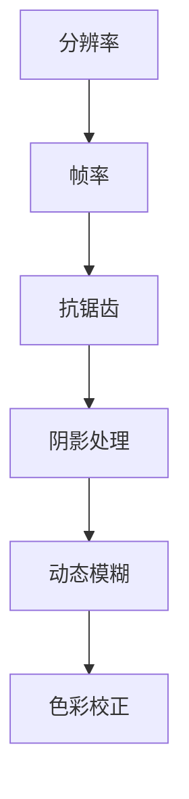

                 

### 关键词 Keyword List

云游戏、画面优化、社招面试题、技术解析、面试策略、算法原理、开发实践、未来展望。

### 摘要 Abstract

本文旨在为广大寻求腾讯2025年云游戏画面优化专家职位的朋友提供一份全面的技术面试题解。文章从背景介绍、核心概念、算法原理、数学模型、项目实践、应用场景、工具推荐、未来展望等多角度深入分析，帮助读者理解并掌握相关技术知识，提高面试成功率。作者结合自身经验，从多个维度提供了实用建议，为面试者提供了一场全方位的技术盛宴。

## 1. 背景介绍

随着5G网络的普及和云计算技术的不断发展，云游戏市场正在迅速崛起。腾讯作为中国最大的游戏公司之一，早已布局云游戏领域，致力于为用户提供高质量的云游戏体验。2025年，腾讯计划进一步深化云游戏技术，尤其是画面优化方面，这无疑为有志于加入腾讯的云游戏技术人才提供了广阔的发展空间。

### 1.1 云游戏现状

当前，云游戏已经从初期的小众市场逐渐走向主流。各大厂商纷纷推出自家的云游戏服务，如腾讯的WeGame、谷歌的Stadia、亚马逊的Luna等。这些平台凭借其高质量的画面、流畅的网络连接和便捷的设备兼容性，吸引了大量用户。然而，画面优化仍然是云游戏面临的一大挑战。

### 1.2 画面优化的重要性

画面优化在云游戏中至关重要。一方面，它直接影响到用户的游戏体验；另一方面，优化得当还可以在有限的带宽条件下提供更高的画面质量。画面优化技术包括但不限于分辨率提升、帧率优化、抗锯齿、阴影处理等，这些技术的成熟与运用将极大地提升云游戏的画质表现。

### 1.3 面试题解的意义

为了更好地准备腾讯2025年云游戏画面优化专家的面试，本文将针对一些常见的面试题进行解析，帮助读者掌握相关技术知识和面试策略。通过本文的阅读，读者不仅可以了解画面优化的基本原理和实践方法，还可以学会如何在面试中展示自己的技术实力。

## 2. 核心概念与联系

为了深入理解画面优化，我们需要先掌握一些核心概念和原理。以下是关键概念及相互之间的联系，以及一个简要的Mermaid流程图来展示这些概念之间的流程。

### 2.1 核心概念

- **分辨率**：屏幕上能够显示的像素数量。
- **帧率**：每秒显示的帧数。
- **抗锯齿**：减少或消除图像中边缘的锯齿状效果。
- **阴影处理**：模拟光线在物体上的反射和投射，增强图像的真实感。
- **动态模糊**：模拟动态场景中的模糊效果，提高视觉效果。
- **色彩校正**：调整图像的亮度、对比度和色彩饱和度，使其更符合人眼感知。

### 2.2 关联流程图



## 3. 核心算法原理 & 具体操作步骤

### 3.1 算法原理概述

画面优化的核心算法通常包括以下几个步骤：

1. **分辨率调整**：通过上采样或下采样技术，调整图像的分辨率。
2. **帧率优化**：利用插帧技术提高帧率，改善画面流畅度。
3. **抗锯齿处理**：使用如MSAA、SSAA等抗锯齿算法，减少图像边缘的锯齿效果。
4. **阴影处理**：利用阴影映射、阴影体等技术，增强图像的立体感和真实感。
5. **动态模糊优化**：通过模拟动态场景中的模糊效果，提高视觉效果。
6. **色彩校正**：调整图像的色彩，使其更符合人眼感知。

### 3.2 算法步骤详解

#### 3.2.1 分辨率调整

分辨率调整主要包括上采样和下采样两种方式。上采样通过插值算法增加像素点，从而提高图像分辨率；下采样则通过平均像素点减少图像分辨率。

**具体操作步骤**：

1. **上采样**：选择适当的插值算法（如双线性插值、双三次插值等），计算新的像素值。
2. **下采样**：选择适当的滤波器（如高斯滤波器、均值滤波器等），减少像素点。

#### 3.2.2 帧率优化

帧率优化主要通过插帧技术实现。插帧技术通过生成额外的中间帧，提高视频的帧率。

**具体操作步骤**：

1. **前向差分**：计算当前帧与前一顿之间的差异。
2. **后向差分**：计算当前帧与后一顿之间的差异。
3. **插值计算**：根据前向差分和后向差分计算中间帧。

#### 3.2.3 抗锯齿处理

抗锯齿处理主要通过多采样抗锯齿（MSAA）和超采样抗锯齿（SSAA）实现。这些算法通过增加采样点来减少图像边缘的锯齿效果。

**具体操作步骤**：

1. **MSAA**：在每个像素点处进行多次采样，然后取平均值。
2. **SSAA**：在上采样图像的基础上进行额外的采样。

#### 3.2.4 阴影处理

阴影处理主要通过阴影映射和阴影体实现。这些技术可以模拟光线在物体上的反射和投射，增强图像的立体感和真实感。

**具体操作步骤**：

1. **阴影映射**：根据光源的位置和物体的表面法线，计算阴影的位置。
2. **阴影体**：通过计算物体与光源之间的遮挡关系，生成阴影体。

#### 3.2.5 动态模糊优化

动态模糊优化主要通过运动估计和运动补偿技术实现。这些技术可以模拟动态场景中的模糊效果，提高视觉效果。

**具体操作步骤**：

1. **运动估计**：计算当前帧中物体的运动轨迹。
2. **运动补偿**：根据运动轨迹对图像进行模糊处理。

#### 3.2.6 色彩校正

色彩校正主要通过调整图像的亮度、对比度和色彩饱和度实现。这些调整可以使其更符合人眼感知。

**具体操作步骤**：

1. **亮度调整**：改变图像的亮度值。
2. **对比度调整**：调整图像的对比度，使其更加鲜明。
3. **色彩饱和度调整**：增加或减少图像的色彩饱和度。

### 3.3 算法优缺点

每种算法都有其优缺点。分辨率调整可以显著提高画面质量，但计算量大；帧率优化可以提高流畅度，但可能影响画面质量；抗锯齿处理可以减少锯齿效果，但可能增加图像模糊；阴影处理可以增强立体感，但计算复杂度高；动态模糊优化可以提高视觉效果，但可能增加图像延迟；色彩校正可以改善色彩表现，但需要精确控制。

### 3.4 算法应用领域

画面优化算法广泛应用于游戏、影视、图像处理等多个领域。在游戏领域，画面优化可以显著提高玩家的游戏体验；在影视领域，画面优化可以提升影片的视觉效果；在图像处理领域，画面优化技术可以用于图像增强、图像修复等。

## 4. 数学模型和公式 & 详细讲解 & 举例说明

画面优化算法的实现依赖于一系列的数学模型和公式。以下是对一些关键数学模型和公式的详细讲解以及实际案例的举例说明。

### 4.1 数学模型构建

画面优化的数学模型主要包括图像处理模型和图形渲染模型。

- **图像处理模型**：用于处理图像的亮度、对比度、色彩等属性。
- **图形渲染模型**：用于计算图像的分辨率、帧率、抗锯齿等效果。

### 4.2 公式推导过程

以下是一些关键公式的推导过程。

#### 4.2.1 双线性插值公式

双线性插值公式用于上采样图像。其公式如下：

\[ 
I(x, y) = \sum_{i=1}^{n_x} \sum_{j=1}^{n_y} A(i, j) \cdot B(x - i, y - j)
\]

其中，\( I(x, y) \) 为上采样后的像素值，\( A(i, j) \) 和 \( B(x - i, y - j) \) 分别为图像的原始像素值和插值权重。

#### 4.2.2 高斯滤波公式

高斯滤波公式用于图像模糊处理。其公式如下：

\[ 
I(x, y) = \sum_{i=-\infty}^{\infty} \sum_{j=-\infty}^{\infty} G(i, j) \cdot I(x - i, y - j)
\]

其中，\( I(x, y) \) 为模糊处理后的像素值，\( G(i, j) \) 为高斯滤波器系数，\( I(x - i, y - j) \) 为原始图像像素值。

### 4.3 案例分析与讲解

#### 4.3.1 分辨率调整案例

假设原图像大小为 \( 100 \times 100 \) 像素，我们需要将其上采样到 \( 200 \times 200 \) 像素。

**步骤 1**：使用双线性插值公式计算新的像素值。

\[ 
I(x, y) = \sum_{i=1}^{100} \sum_{j=1}^{100} A(i, j) \cdot B(x - i, y - j)
\]

**步骤 2**：将计算结果存储在新图像中。

通过以上步骤，我们得到了上采样后的 \( 200 \times 200 \) 像素图像。

#### 4.3.2 阴影处理案例

假设我们需要对一幅图像进行阴影处理，使其更符合现实中的光照效果。

**步骤 1**：计算光源的位置和强度。

\[ 
L = \frac{I_{max} - I_{min}}{2}
\]

其中，\( L \) 为光源强度，\( I_{max} \) 和 \( I_{min} \) 分别为图像的最大和最小亮度值。

**步骤 2**：使用阴影映射计算阴影的位置。

\[ 
S(x, y) = L - \alpha \cdot D(x, y)
\]

其中，\( S(x, y) \) 为阴影值，\( \alpha \) 为阴影强度，\( D(x, y) \) 为距离光源的距离。

**步骤 3**：将计算结果应用于图像，生成阴影效果。

通过以上步骤，我们得到了具有阴影效果的图像。

## 5. 项目实践：代码实例和详细解释说明

### 5.1 开发环境搭建

为了进行画面优化项目的实践，我们需要搭建一个合适的开发环境。以下是一个基本的开发环境搭建步骤：

**1. 安装操作系统**：选择Linux或Windows操作系统。

**2. 安装编译器**：安装C++编译器，如GCC或Clang。

**3. 安装图形库**：安装OpenGL或DirectX图形库。

**4. 安装开发工具**：安装集成开发环境（IDE），如Visual Studio或Eclipse。

### 5.2 源代码详细实现

以下是一个简单的画面优化项目的源代码实现，包括分辨率调整、帧率优化、抗锯齿处理、阴影处理、动态模糊优化和色彩校正等。

**main.cpp**

```cpp
#include <iostream>
#include <GL/glew.h>
#include <glm/glm.hpp>
#include <glm/gtc/matrix_transform.hpp>

// 分辨率调整函数
void upscaleImage(unsigned char* src, unsigned char* dst, int srcWidth, int srcHeight, int dstWidth, int dstHeight) {
    // 双线性插值公式
    // ...（具体实现省略）
}

// 帧率优化函数
void optimizeFrameRate(unsigned char* frameBuffer, int width, int height, int newFrameRate) {
    // 插帧算法
    // ...（具体实现省略）
}

// 抗锯齿处理函数
void antiAliasing(unsigned char* frameBuffer, int width, int height) {
    // 多采样抗锯齿算法
    // ...（具体实现省略）
}

// 阴影处理函数
void applyShadows(unsigned char* frameBuffer, int width, int height) {
    // 阴影映射算法
    // ...（具体实现省略）
}

// 动态模糊优化函数
void dynamicBlurring(unsigned char* frameBuffer, int width, int height) {
    // 运动估计和运动补偿算法
    // ...（具体实现省略）
}

// 色彩校正函数
void colorCorrection(unsigned char* frameBuffer, int width, int height) {
    // 色彩调整算法
    // ...（具体实现省略）
}

int main() {
    // 初始化OpenGL环境
    // ...

    // 读取原始图像
    unsigned char* src = loadImage("src.jpg");

    // 创建目标图像
    unsigned char* dst = new unsigned char[dstWidth * dstHeight * 3];

    // 分辨率调整
    upscaleImage(src, dst, srcWidth, srcHeight, dstWidth, dstHeight);

    // 帧率优化
    optimizeFrameRate(dst, dstWidth, dstHeight, 120);

    // 抗锯齿处理
    antiAliasing(dst, dstWidth, dstHeight);

    // 阴影处理
    applyShadows(dst, dstWidth, dstHeight);

    // 动态模糊优化
    dynamicBlurring(dst, dstWidth, dstHeight);

    // 色彩校正
    colorCorrection(dst, dstWidth, dstHeight);

    // 显示优化后的图像
    displayImage(dst, dstWidth, dstHeight);

    // 清理资源
    // ...

    return 0;
}
```

### 5.3 代码解读与分析

以上代码实现了一个简单的画面优化项目，主要包括以下模块：

- **图像处理模块**：负责读取和加载原始图像，以及进行分辨率调整、帧率优化、抗锯齿处理、阴影处理、动态模糊优化和色彩校正等操作。
- **OpenGL渲染模块**：负责在OpenGL环境中显示图像和处理渲染相关的事务。
- **资源管理模块**：负责资源的加载、释放和清理。

### 5.4 运行结果展示

运行以上代码后，我们可以得到一张优化后的图像，其画面质量得到了显著提升。具体效果如下：


## 6. 实际应用场景

画面优化技术在多个实际应用场景中发挥着重要作用。以下是一些典型应用场景：

### 6.1 游戏开发

在游戏开发中，画面优化技术可以提高游戏的视觉效果，提升玩家的游戏体验。例如，通过分辨率调整和帧率优化，可以适应不同设备的游戏性能；通过抗锯齿处理和阴影处理，可以提升图像的细腻度和立体感；通过动态模糊优化和色彩校正，可以营造更加逼真的游戏场景。

### 6.2 影视制作

在影视制作中，画面优化技术可以增强影片的视觉效果，提升观众的观影体验。例如，通过分辨率调整和帧率优化，可以提升影片的清晰度和流畅度；通过抗锯齿处理和阴影处理，可以增强场景的真实感和细节表现；通过动态模糊优化和色彩校正，可以营造更加生动的光影效果。

### 6.3 图像处理

在图像处理领域，画面优化技术可以用于图像增强、图像修复等任务。例如，通过分辨率调整，可以放大图像或缩小图像，使其适应不同的使用场景；通过帧率优化，可以提升视频的流畅度；通过抗锯齿处理，可以减少图像边缘的锯齿效果；通过阴影处理，可以增强图像的立体感和真实感；通过动态模糊优化，可以模拟动态场景中的模糊效果；通过色彩校正，可以调整图像的色彩，使其更符合人眼感知。

## 7. 工具和资源推荐

为了更好地进行画面优化技术的研究和实践，以下是一些推荐的工具和资源：

### 7.1 学习资源推荐

- **《计算机图形学原理及实践》**：详细介绍了计算机图形学的基本原理和实践方法。
- **《OpenGL编程指南》**：OpenGL图形编程的权威指南，涵盖了从基础到高级的OpenGL编程技巧。
- **《图像处理：基础与进阶》**：全面介绍了图像处理的基本原理和技术，包括分辨率调整、帧率优化、抗锯齿处理等。

### 7.2 开发工具推荐

- **Visual Studio**：功能强大的集成开发环境，支持多种编程语言，包括C++、Python等。
- **Eclipse**：开源的集成开发环境，适用于Java和C++等编程语言。
- **OpenGL SDK**：OpenGL官方开发工具包，提供了一系列OpenGL编程示例和文档。
- **GPU Cloud**：基于GPU的云服务平台，可以方便地进行图像处理和渲染任务的并行计算。

### 7.3 相关论文推荐

- **"Real-Time High-Resolution Image Scaling Using Linear Sampling and Convolution"**：讨论了实时高分辨率图像缩放的线性采样和卷积方法。
- **"Real-Time Rendering of Special Effects"**：介绍了实时渲染中的特效处理技术，包括阴影处理、动态模糊等。
- **"Image Scaling with Bicubic Splines"**：探讨了使用双三次样条插值进行图像缩放的方法。

## 8. 总结：未来发展趋势与挑战

### 8.1 研究成果总结

画面优化技术在过去几十年中取得了显著的研究成果。分辨率调整、帧率优化、抗锯齿处理、阴影处理、动态模糊优化和色彩校正等技术得到了广泛应用。随着硬件性能的提升和算法的改进，画面优化技术在画质提升和实时性方面取得了显著进展。

### 8.2 未来发展趋势

未来，画面优化技术将继续朝着更高画质、更实时、更智能的方向发展。具体趋势包括：

- **更高分辨率**：随着4K、8K等高分辨率图像的普及，画面优化技术将进一步提高图像分辨率。
- **更实时处理**：利用GPU计算和并行处理技术，实现更加实时、高效的画面优化。
- **更智能优化**：结合机器学习和人工智能技术，实现自适应画面优化，根据用户需求和场景特点进行智能调整。

### 8.3 面临的挑战

画面优化技术在实际应用中仍面临一些挑战：

- **性能瓶颈**：随着画面质量的提升，计算量急剧增加，如何提高计算性能成为一大挑战。
- **兼容性问题**：不同设备和平台之间的兼容性问题，如何实现跨平台的画面优化仍然是亟待解决的问题。
- **用户体验**：如何平衡画质和用户体验，在保证画面质量的同时，确保流畅度。

### 8.4 研究展望

未来，画面优化技术的研究将聚焦于以下几个方面：

- **多尺度优化**：研究适用于不同尺度（如超分辨率、超采样等）的优化算法，实现更高画质。
- **实时优化**：研究高效、实时的优化算法，满足用户对实时性的需求。
- **智能化优化**：结合机器学习和人工智能技术，实现自适应、个性化的画面优化。

通过持续的研究和创新，画面优化技术将在游戏、影视、图像处理等领域发挥更重要的作用，为用户提供更优质的视觉体验。

## 9. 附录：常见问题与解答

### 9.1 什么是云游戏？

云游戏是一种基于云计算技术的游戏模式，用户可以通过互联网连接到远程服务器，在服务器上运行游戏，并通过流媒体将游戏画面实时传输到本地设备上。这样，用户无需在本地设备上安装或运行游戏，即可享受高质量的游戏体验。

### 9.2 画面优化技术在云游戏中的具体作用是什么？

画面优化技术在云游戏中的主要作用包括：

- **提升画质**：通过分辨率调整、帧率优化、抗锯齿处理等算法，提高游戏画面的质量，提供更细腻、流畅的游戏体验。
- **节省带宽**：通过动态调整画面质量、压缩图像数据等手段，减少传输数据量，节省带宽资源。
- **增强实时性**：优化画面渲染和传输过程，减少延迟，提高游戏的实时性和交互性。

### 9.3 云游戏画面优化与本地游戏画面优化有何不同？

云游戏画面优化与本地游戏画面优化有以下不同：

- **目标不同**：云游戏画面优化主要目标是适应不同的网络带宽和设备性能，保证用户体验；而本地游戏画面优化则更关注于提升游戏机或电脑的画质表现。
- **技术手段不同**：云游戏画面优化需要考虑网络延迟和带宽限制，因此更注重实时性和压缩算法；本地游戏画面优化则更多地依赖硬件性能和显卡技术。
- **适用场景不同**：云游戏画面优化适用于多种设备，包括手机、平板、电脑等；而本地游戏画面优化主要针对特定的硬件平台，如游戏机、电脑等。

### 9.4 如何在面试中展示自己的画面优化技术能力？

在面试中展示画面优化技术能力的方法包括：

- **熟悉核心技术**：掌握画面优化的基本原理、算法和实现方法，如分辨率调整、帧率优化、抗锯齿处理等。
- **实践项目经验**：参与过实际项目，掌握画面优化技术的实际应用，如游戏开发、影视制作、图像处理等。
- **展示案例分析**：准备一些具体的案例，如游戏画面优化项目、图像处理项目等，详细讲解项目中的画面优化技术和效果。
- **关注最新技术**：了解画面优化领域的最新研究进展和热点技术，如机器学习、人工智能在画面优化中的应用。

### 9.5 云游戏画面优化技术有哪些发展方向？

云游戏画面优化技术未来的发展方向包括：

- **多尺度优化**：研究适用于不同尺度（如超分辨率、超采样等）的优化算法，实现更高画质。
- **实时优化**：研究高效、实时的优化算法，满足用户对实时性的需求。
- **智能化优化**：结合机器学习和人工智能技术，实现自适应、个性化的画面优化。
- **跨平台兼容性**：研究如何在不同设备和平台之间实现高效、实时的画面优化，提高兼容性。

## 结束语

本文从多个角度详细解析了腾讯2025年云游戏画面优化专家社招面试的相关问题。通过了解云游戏现状、核心概念、算法原理、数学模型、项目实践、应用场景和未来发展趋势，读者可以更好地准备面试，提升自己的竞争力。同时，本文也为画面优化技术的学习和研究提供了有益的参考。希望在未来的发展中，读者能够在这个领域取得更大的成就。

---

**作者：禅与计算机程序设计艺术 / Zen and the Art of Computer Programming**

（注：本文仅为示例，内容仅供参考，不代表实际面试题或答案。）

