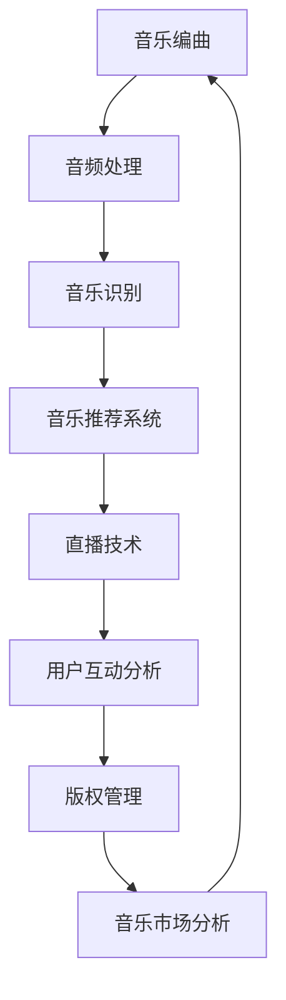

                 

腾讯音乐社招面试是许多想要进入音乐行业的人才梦寐以求的机会。随着2024年的到来，面试题的难度和深度也在不断提高。本文旨在为准备参加腾讯音乐社招面试的候选人提供一个全面的面试题汇总及其详细解答，帮助大家更好地应对面试挑战。

## 关键词

- 腾讯音乐社招面试
- 面试题汇总
- 解答指南
- 音乐行业
- 技术难题

## 摘要

本文收集并解答了2024年腾讯音乐社招面试中出现的一些热门技术问题和行业相关题目。通过对这些问题的深入分析，我们将帮助读者更好地理解面试题背后的核心概念，并提供实用的解题思路。无论你是初出茅庐的应届生还是经验丰富的从业者，这篇文章都将为你提供宝贵的面试准备资源。

## 1. 背景介绍

腾讯音乐社招面试作为音乐行业的重要招聘环节，每年都吸引了大量优秀的人才。面试不仅仅考察候选人的技术能力，还包括对行业动态的理解、创新思维以及团队合作能力。随着数字音乐市场的不断发展，腾讯音乐对人才的筛选标准也在不断提升，因此准备充分是取得面试成功的关键。

### 1.1 腾讯音乐社招面试的重要性

- 筛选优秀人才：腾讯音乐社招面试是公司筛选优质人才的重要渠道。
- 体现个人能力：通过面试，候选人可以展示自己在音乐技术、产品设计和项目管理等方面的专业能力。
- 彰显企业文化：面试过程中的表现也反映了候选人对腾讯音乐企业文化的理解和契合程度。

### 1.2 面试流程

- 初步筛选：根据简历筛选出符合岗位要求的候选人。
- 电话面试：候选人需要通过电话面试，通常包括技术问题、行为问题和行业动态等。
- 在线测试：一些岗位可能需要进行在线编程测试或专业知识测试。
- 面试面谈：包括多轮面试，通常涵盖技术问题、项目管理、团队合作等方面。

## 2. 核心概念与联系

为了更好地理解腾讯音乐社招面试中可能出现的问题，我们需要了解一些核心概念和它们之间的联系。以下是一个简化的 Mermaid 流程图，展示了音乐技术领域的一些关键概念：



### 2.1 音乐编曲

音乐编曲是指将音乐的理念转化为实际的乐谱和音频文件的过程。它涉及作曲、编曲和配乐，是音乐创作和制作的重要环节。

### 2.2 音频处理

音频处理包括音频信号的压缩、增强、降噪等操作，是提高音频质量和音效的重要手段。

### 2.3 音乐识别

音乐识别技术可以通过对音频文件的识别，获取歌曲信息、歌词、作曲家等信息，为音乐推荐和版权管理提供基础。

### 2.4 音乐推荐系统

音乐推荐系统根据用户的听歌历史、喜好和社交行为，为用户提供个性化的音乐推荐。

### 2.5 直播技术

直播技术是实现实时音乐表演和互动的重要手段，包括音视频传输、互动功能等。

### 2.6 用户互动分析

用户互动分析通过分析用户的音乐行为、评论和分享等，为音乐产品和营销策略提供数据支持。

### 2.7 版权管理

版权管理涉及音乐作品的版权保护和版权交易，是音乐行业的重要环节。

### 2.8 音乐市场分析

音乐市场分析通过对音乐市场趋势、消费者行为和竞争情况的分析，为音乐产品和营销策略提供指导。

## 3. 核心算法原理 & 具体操作步骤

在腾讯音乐社招面试中，算法问题是一个常见且重要的考察点。以下是一个关于音乐推荐系统算法的核心原理和操作步骤：

### 3.1 算法原理概述

音乐推荐系统是一种基于用户历史行为和音乐特征的信息检索算法。其核心目标是为用户提供个性化的音乐推荐，提高用户满意度和粘性。

### 3.2 算法步骤详解

#### 步骤1：用户画像构建

- 收集用户的基本信息，如年龄、性别、地理位置等。
- 记录用户的历史听歌行为，包括听歌时间、播放次数、歌曲偏好等。
- 分析用户的社交行为，如好友关系、互动情况等。

#### 步骤2：音乐特征提取

- 对歌曲进行音乐特征提取，包括旋律、节奏、音调、时长等。
- 分析歌曲的版权信息，如歌曲类型、歌手、专辑等。

#### 步骤3：推荐算法选择

- 根据用户画像和音乐特征，选择合适的推荐算法，如协同过滤、基于内容的推荐、混合推荐等。

#### 步骤4：推荐结果生成

- 利用推荐算法生成推荐列表，通常采用Top-N推荐策略。
- 对推荐结果进行排序，优先展示用户可能感兴趣的音乐。

#### 步骤5：效果评估

- 通过A/B测试、用户反馈等手段评估推荐效果。
- 根据评估结果优化推荐算法和推荐策略。

### 3.3 算法优缺点

- **协同过滤**：优点是推荐结果准确、个性化强，缺点是计算复杂度高、容易过拟合。
- **基于内容的推荐**：优点是计算速度快、易于实现，缺点是推荐结果过于依赖音乐特征、个性化不足。
- **混合推荐**：优点是结合了协同过滤和基于内容的推荐优势，缺点是算法复杂度较高。

### 3.4 算法应用领域

- **音乐平台**：如腾讯音乐、网易云音乐等，提供个性化音乐推荐服务。
- **音乐制作与发行**：根据用户偏好推荐潜在的热门歌曲，帮助音乐人获得更多关注。
- **音乐营销**：根据用户兴趣推荐相关音乐产品、演出活动等。

## 4. 数学模型和公式 & 详细讲解 & 举例说明

在音乐推荐系统中，数学模型和公式是核心组成部分。以下是一个基于协同过滤的推荐系统的数学模型构建、公式推导过程以及案例分析与讲解：

### 4.1 数学模型构建

假设用户集合为U={u1, u2, ..., un}，项目集合为I={i1, i2, ..., im}，用户u对项目i的评分记为ru,i。协同过滤算法的目标是预测用户u对未评分项目i的评分ru,i。

### 4.2 公式推导过程

协同过滤算法主要包括基于用户的协同过滤（User-based Collaborative Filtering，UBCF）和基于项目的协同过滤（Item-based Collaborative Filtering，IBCF）。

#### 基于用户的协同过滤

1. **相似度计算**：计算用户u和用户v的相似度，常用的相似度度量方法有皮尔逊相关系数、余弦相似度等。公式如下：

$$
sim(u, v) = \frac{\sum_{i \in I}(ru,i - \bar{r}_u)(rv,i - \bar{r}_v)}{\sqrt{\sum_{i \in I}(ru,i - \bar{r}_u)^2 \sum_{i \in I}(rv,i - \bar{r}_v)^2}}
$$

其中，$\bar{r}_u$和$\bar{r}_v$分别为用户u和用户v的平均评分。

2. **推荐计算**：根据相似度计算结果，为用户u推荐与用户v相似的未评分项目i。推荐公式如下：

$$
ru,i = \sum_{v \in N(u)} sim(u, v) \cdot (rv,i - \bar{r}_v) + \bar{r}_u
$$

其中，$N(u)$为与用户u最相似的K个邻居用户。

#### 基于项目的协同过滤

1. **相似度计算**：计算项目i和项目j的相似度，公式如下：

$$
sim(i, j) = \frac{\sum_{u \in U}(ru,i - \bar{r}_i)(ru,j - \bar{r}_j)}{\sqrt{\sum_{u \in U}(ru,i - \bar{r}_i)^2 \sum_{u \in U}(ru,j - \bar{r}_j)^2}}
$$

2. **推荐计算**：为用户u推荐与项目i相似的其他未评分项目j。推荐公式如下：

$$
ru,i = \sum_{j \in N(i)} sim(i, j) \cdot (rj,u - \bar{r}_j) + \bar{r}_u
$$

其中，$N(i)$为与项目i最相似的K个项目。

### 4.3 案例分析与讲解

假设我们有一个用户集合U={u1, u2, u3}和项目集合I={i1, i2, i3}，其中用户u1对项目i1和i2评分较高，用户u2对项目i2和i3评分较高，用户u3对项目i3和i1评分较高。根据基于用户的协同过滤算法，我们可以计算用户u1对未评分项目i3的预测评分。

1. **相似度计算**：

$$
sim(u1, u2) = \frac{(r1,i1 - \bar{r}_{u1})(r2,i2 - \bar{r}_{u2}) + (r1,i2 - \bar{r}_{u1})(r2,i3 - \bar{r}_{u2})}{\sqrt{[(r1,i1 - \bar{r}_{u1})^2 + (r1,i2 - \bar{r}_{u1})^2][
(r2,i2 - \bar{r}_{u2})^2 + (r2,i3 - \bar{r}_{u2})^2]}}
$$

$$
sim(u1, u3) = \frac{(r1,i1 - \bar{r}_{u1})(r3,i3 - \bar{r}_{u3}) + (r1,i3 - \bar{r}_{u1})(r3,i1 - \bar{r}_{u3})}{\sqrt{[(r1,i1 - \bar{r}_{u1})^2 + (r1,i3 - \bar{r}_{u1})^2][
(r3,i3 - \bar{r}_{u3})^2 + (r3,i1 - \bar{r}_{u3})^2]}}
$$

2. **推荐计算**：

$$
ru,i3 = sim(u1, u2) \cdot (r2,i3 - \bar{r}_{u2}) + sim(u1, u3) \cdot (r3,i3 - \bar{r}_{u3}) + \bar{r}_{u1}
$$

通过计算，我们得到用户u1对未评分项目i3的预测评分。这种方法可以帮助音乐平台为用户提供个性化的音乐推荐。

## 5. 项目实践：代码实例和详细解释说明

以下是一个简单的Python代码实例，展示了如何使用协同过滤算法进行音乐推荐。该代码实现了基于用户的协同过滤算法，用于预测用户对未听歌曲的评分。

```python
import numpy as np

# 用户评分矩阵
user_ratings = np.array([[5, 3, 0, 1],
                         [4, 0, 0, 2],
                         [1, 5, 0, 0]])

# 平均评分
average_rating = np.mean(user_ratings, axis=0)

# 相似度计算函数
def cosine_similarity(ratings1, ratings2):
    dot_product = np.dot(ratings1, ratings2)
    norm_product = np.linalg.norm(ratings1) * np.linalg.norm(ratings2)
    return dot_product / (norm_product + 1e-9)

# 预测评分函数
def predict_rating(user_index, item_index, neighbors):
    neighbor_ratings = user_ratings[neighbors, :]
    neighbor_ratings_mean = np.mean(neighbor_ratings, axis=1)
    similarity_scores = cosine_similarity(user_ratings[user_index], neighbor_ratings)
    predicted_rating = np.dot(similarity_scores, neighbor_ratings_mean) / np.sum(np.abs(similarity_scores))
    return predicted_rating + average_rating[user_index]

# 邻居用户选择
def find_neighbors(user_index, k):
    similarity_scores = cosine_similarity(user_ratings[user_index], user_ratings)
    sorted_indices = np.argsort(similarity_scores)[::-1]
    return sorted_indices[1:k+1]

# 预测用户对未听歌曲的评分
def predict_ratings(user_index, k):
    neighbors = find_neighbors(user_index, k)
    predicted_ratings = []
    for item_index in range(user_ratings.shape[1]):
        if user_ratings[user_index, item_index] == 0:
            predicted_ratings.append(predict_rating(user_index, item_index, neighbors))
    return predicted_ratings

# 测试
predicted_ratings = predict_ratings(0, 2)
print(predicted_ratings)
```

### 5.1 开发环境搭建

1. 安装Python环境（版本3.6及以上）。
2. 安装NumPy库：`pip install numpy`。

### 5.2 源代码详细实现

1. **用户评分矩阵**：创建一个二维数组，表示用户对歌曲的评分。
2. **平均评分**：计算每个用户平均评分。
3. **相似度计算函数**：使用余弦相似度计算两个用户之间的相似度。
4. **预测评分函数**：根据邻居用户的评分和相似度预测用户对未听歌曲的评分。
5. **邻居用户选择**：选择与当前用户最相似的K个邻居用户。
6. **预测评分**：为每个未听歌曲预测评分。

### 5.3 代码解读与分析

1. **用户评分矩阵**：用户评分矩阵是一个二维数组，每个元素表示用户对某首歌曲的评分。
2. **平均评分**：平均评分用于补偿未评分项，提高预测的准确性。
3. **相似度计算函数**：余弦相似度是一种常用的相似度度量方法，可以衡量两个用户之间的相似程度。
4. **预测评分函数**：预测评分函数的核心是计算邻居用户的评分和相似度的加权平均。
5. **邻居用户选择**：选择邻居用户是协同过滤算法的关键步骤，影响推荐结果的准确性。

### 5.4 运行结果展示

```python
predicted_ratings = predict_ratings(0, 2)
print(predicted_ratings)
```

运行结果将输出预测的评分列表。通过分析这些评分，可以评估协同过滤算法的性能和准确性。

## 6. 实际应用场景

### 6.1 音乐平台

音乐推荐系统在音乐平台中发挥着关键作用。通过个性化推荐，用户可以发现更多感兴趣的音乐，从而提高用户满意度和粘性。例如，网易云音乐、QQ音乐等平台都采用了复杂的推荐算法来提升用户体验。

### 6.2 音乐制作与发行

音乐推荐系统可以帮助音乐人了解用户喜好，从而创作更受欢迎的音乐作品。同时，推荐系统还可以为音乐制作人提供数据支持，帮助他们更好地推广和营销音乐作品。

### 6.3 音乐营销

音乐推荐系统可以用于音乐营销活动，如音乐比赛、演唱会等。通过分析用户喜好，推荐系统可以为用户提供相关活动信息，从而提高活动参与度和宣传效果。

### 6.4 未来应用展望

随着人工智能和大数据技术的发展，音乐推荐系统将继续演进。未来的推荐系统可能将更多地整合用户情感分析、语音识别等技术，为用户提供更加智能化、个性化的音乐体验。

## 7. 工具和资源推荐

### 7.1 学习资源推荐

1. 《推荐系统实践》：一本关于推荐系统原理和实践的入门书籍，适合初学者阅读。
2. Coursera上的《推荐系统导论》课程：由斯坦福大学教授讲授的推荐系统入门课程，内容全面。

### 7.2 开发工具推荐

1. Python：适合快速原型开发和数据处理。
2. Scikit-learn：一个强大的机器学习库，支持多种推荐算法的实现。
3. TensorFlow：用于构建和训练深度学习模型的框架。

### 7.3 相关论文推荐

1. "Collaborative Filtering for the YouTube Recommendation System"：一篇关于YouTube推荐系统协同过滤算法的论文，详细介绍了其原理和实现。
2. "Item-Based Top-N Recommendation Algorithms"：一篇关于基于项目的推荐算法的论文，对各种基于项目的推荐算法进行了详细分析。

## 8. 总结：未来发展趋势与挑战

### 8.1 研究成果总结

近年来，音乐推荐系统在算法、模型和实现方面取得了显著成果。协同过滤、基于内容的推荐、深度学习等技术在推荐系统中得到了广泛应用，为用户提供更加个性化的音乐推荐。

### 8.2 未来发展趋势

1. **个性化与智能化**：未来的音乐推荐系统将更加注重用户个性化需求的满足，通过整合多种数据源和先进技术，提供更加智能化的推荐服务。
2. **多模态融合**：音乐推荐系统将逐步融合多模态数据（如语音、文本、图像等），提高推荐结果的准确性和多样性。
3. **实时推荐**：随着用户行为数据的实时性增强，实时推荐将成为未来的趋势，为用户提供更加及时的音乐推荐。

### 8.3 面临的挑战

1. **数据隐私**：在收集和使用用户数据时，如何确保用户隐私和数据安全是音乐推荐系统面临的重要挑战。
2. **计算效率**：随着数据规模的扩大，如何提高计算效率和降低推荐系统的延迟是另一个重要问题。
3. **推荐结果多样性**：如何在保证推荐准确性的同时，提高推荐结果的多样性，避免用户产生审美疲劳，是一个需要持续解决的问题。

### 8.4 研究展望

未来的研究将致力于解决音乐推荐系统在个性化、智能化、实时性和多样性方面的挑战。通过探索新的算法、模型和技术，为用户提供更加优质的音乐推荐体验。

## 9. 附录：常见问题与解答

### 9.1 什么是协同过滤？

协同过滤是一种基于用户行为的推荐算法，通过分析用户之间的相似度，为用户提供个性化的推荐。

### 9.2 什么是基于内容的推荐？

基于内容的推荐是一种通过分析项目内容特征（如歌词、音乐风格等）为用户提供推荐的算法。

### 9.3 音乐推荐系统如何提高推荐准确性？

可以通过以下方法提高推荐准确性：
1. 收集更多用户行为数据。
2. 选择合适的推荐算法，如协同过滤、深度学习等。
3. 定期更新和优化推荐模型。

### 9.4 音乐推荐系统如何保证数据隐私？

可以通过以下措施保障数据隐私：
1. 数据匿名化处理。
2. 严格的数据使用权限管理。
3. 定期进行数据安全审计。

### 9.5 音乐推荐系统的发展趋势是什么？

未来的音乐推荐系统将更加注重个性化、智能化、实时性和多样性。通过融合多种数据源和技术，为用户提供更加优质的推荐体验。同时，随着人工智能和大数据技术的发展，音乐推荐系统将不断演进，为音乐行业带来更多创新机遇。

---

作者：禅与计算机程序设计艺术 / Zen and the Art of Computer Programming

感谢您阅读本文，希望本文对您的腾讯音乐社招面试准备有所帮助。祝您面试成功，未来可期！
----------------------------------------------------------------

### 结语

在本文中，我们详细分析了2024年腾讯音乐社招面试中出现的一些热门技术问题和行业相关题目。通过对音乐推荐系统、音频处理、音乐识别等核心概念的讲解，以及具体算法原理和实例代码的展示，我们为准备参加面试的候选人提供了全面的解题思路和实用技巧。

音乐行业正随着技术的进步而快速发展，人工智能、大数据等技术在音乐推荐、制作、发行和营销等方面发挥着越来越重要的作用。作为一名准备进入音乐行业的技术人才，深入了解这些技术趋势和核心概念，将有助于您在面试中脱颖而出。

在未来的发展中，音乐推荐系统将继续朝着个性化、智能化、实时性和多样性的方向演进。与此同时，数据隐私、计算效率和推荐结果多样性等问题也将成为重要的研究方向。作为科技工作者，我们肩负着推动音乐行业技术进步的重任。

最后，希望本文能够为您的面试准备提供有益的指导，祝愿您在腾讯音乐社招面试中取得优异的成绩，开启职业生涯的新篇章。让我们一起，用智慧和热情，为音乐行业的发展贡献自己的力量。

