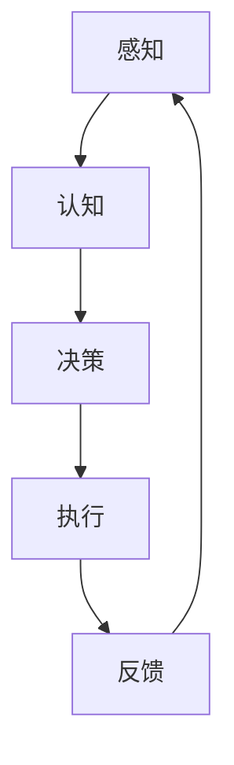

                 

 在现代信息技术迅猛发展的背景下，自主系统（Autonomous Systems）的概念逐渐成为了研究热点。从无人驾驶汽车到智能无人机，再到智能电网，自主系统正在深刻地改变着我们的生活方式。然而，随着这些系统的复杂性和规模不断增加，如何有效地管理这些系统的意识（Consciousness）成为了亟待解决的问题。

本文将以《自主系统与意识管理的结合》为标题，探讨自主系统意识管理的重要性、核心概念、算法原理、数学模型、实际应用以及未来展望。通过详细的分析和实例讲解，我们希望为读者提供一个全面的理解，并引发对该领域的深入思考。

> 关键词：自主系统、意识管理、算法原理、数学模型、实际应用、未来展望

## 摘要

本文旨在探讨自主系统与意识管理结合的重要性。首先，我们回顾了自主系统的定义和发展历程，接着介绍了意识管理的核心概念和其在自主系统中的应用。随后，文章深入分析了自主系统意识管理的算法原理，包括具体操作步骤和优缺点。在此基础上，我们构建了相关的数学模型，并通过实例进行了详细讲解。文章还讨论了自主系统在现实世界中的应用场景，并展望了其未来的发展趋势和面临的挑战。最后，我们推荐了一些相关的学习资源和开发工具，以期为该领域的研究和实践提供支持。

## 1. 背景介绍

自主系统（Autonomous Systems）是指能够在无需人工干预的情况下自主执行任务的系统。它们通常具有感知、决策、执行和学习能力，能够实时响应环境变化，从而实现自主操作。自主系统的概念最早可以追溯到20世纪50年代的自动化技术，但直到近年来，随着计算能力、传感器技术和人工智能算法的快速发展，自主系统才真正成为现实。

### 1.1 自主系统的发展历程

自主系统的发展可以分为几个阶段：

- **早期探索**（1950s - 1970s）：在这个阶段，自主系统主要是通过预定义的程序和规则进行操作，缺乏自适应性和灵活性。

- **初期自动化**（1980s - 1990s）：随着计算机和算法的进步，自主系统开始具备一定的自适应能力，能够在特定场景下执行任务。

- **智能自动化**（2000s - 至今）：在这个阶段，自主系统结合了人工智能、机器学习和深度学习技术，实现了更高的自主性和智能化。

### 1.2 自主系统的现状与应用

当前，自主系统在多个领域取得了显著的应用成果：

- **交通运输**：无人驾驶汽车、智能无人机和智能列车等。

- **工业制造**：自动化生产线、智能装配线和机器人操作等。

- **能源管理**：智能电网、智能风力发电和太阳能系统等。

- **医疗健康**：智能诊断系统、手术机器人和远程医疗服务等。

- **环境监测**：智能传感器网络、环境监测无人机和智能气象预报等。

### 1.3 自主系统的发展趋势

未来，自主系统将继续向更高层次的智能化和自主化发展：

- **深度学习与强化学习**：将更深入地应用于自主系统，提高其学习和适应能力。

- **边缘计算与云计算**：结合边缘计算和云计算技术，实现实时高效的数据处理和决策支持。

- **多机器人协同**：通过多机器人系统协同工作，提高复杂任务的处理能力和效率。

- **自主安全**：增强自主系统的安全性和鲁棒性，防范潜在的安全威胁。

## 2. 核心概念与联系

在深入探讨自主系统与意识管理的结合之前，我们需要明确一些核心概念，包括自主系统、意识管理、以及它们之间的联系。

### 2.1 自主系统

自主系统是指具备自主决策、执行和学习能力的系统。它可以通过感知环境数据，利用人工智能算法进行决策，并执行相应的操作。自主系统的关键特征包括：

- **自主性**：系统能够独立运行，无需人工干预。
- **适应性**：系统能够根据环境变化进行自适应调整。
- **学习性**：系统能够从经验中学习，并改进其性能。

### 2.2 意识管理

意识管理是指对系统的意识状态进行监控、评估和调整的过程。在自主系统中，意识管理包括以下方面：

- **感知**：系统通过传感器收集环境数据。
- **认知**：系统利用这些数据进行分析，形成对环境的理解。
- **决策**：系统根据分析结果做出决策。
- **执行**：系统执行决策，并调整其行为。

### 2.3 自主系统与意识管理的关系

自主系统和意识管理之间存在着紧密的联系。意识管理是自主系统的核心组成部分，决定了系统的自主性和适应性。具体来说：

- **意识管理提高了自主性**：通过意识管理，系统能够更好地理解环境，做出更准确的决策，从而实现更高程度的自主操作。
- **意识管理增强了适应性**：系统通过持续的学习和调整，能够适应不断变化的环境，提高其生存能力和任务执行效率。
- **意识管理保障了安全性**：通过监控系统的状态和行为，能够及时发现并应对潜在的风险和故障。

### 2.4 Mermaid 流程图

以下是一个简化的 Mermaid 流程图，展示了自主系统与意识管理之间的联系：



在这个流程中，感知、认知、决策、执行和反馈构成了一个闭环系统，实现了系统的自适应和持续改进。

## 3. 核心算法原理 & 具体操作步骤

### 3.1 算法原理概述

自主系统意识管理的核心算法原理主要涉及以下几个方面：

- **感知算法**：用于收集和处理环境数据，包括传感器数据的预处理、特征提取和模式识别。
- **认知算法**：用于分析感知数据，形成对环境的理解，包括机器学习和深度学习算法。
- **决策算法**：用于根据环境理解和系统状态做出决策，包括强化学习、规划算法和博弈论。
- **执行算法**：用于执行决策，包括控制算法和运动规划。

### 3.2 算法步骤详解

以下是自主系统意识管理的基本操作步骤：

1. **感知**：系统通过传感器收集环境数据，包括图像、声音、温度、湿度等。

2. **预处理**：对收集到的数据进行预处理，包括数据清洗、归一化和特征提取。

3. **认知**：利用机器学习和深度学习算法对预处理后的数据进行分析，形成对环境的理解。

4. **决策**：根据环境理解和系统状态，利用强化学习、规划算法和博弈论等算法做出决策。

5. **执行**：根据决策结果，执行相应的操作，包括控制机器人的运动、调整系统参数等。

6. **反馈**：收集执行结果，与预期目标进行比较，形成反馈。

7. **调整**：根据反馈结果，调整系统状态和行为，以提高自主性和适应性。

### 3.3 算法优缺点

自主系统意识管理算法具有以下优缺点：

- **优点**：
  - 提高了系统的自主性和适应性。
  - 能够实时响应环境变化，提高了系统的响应速度。
  - 通过持续学习和调整，能够不断优化系统性能。

- **缺点**：
  - 算法复杂度高，对计算资源要求较高。
  - 在初始阶段，系统的自主性和适应性可能较低，需要大量数据和时间进行训练。
  - 在某些复杂环境下，系统的决策可能存在不确定性。

### 3.4 算法应用领域

自主系统意识管理算法广泛应用于以下领域：

- **无人驾驶汽车**：通过感知环境、认知路况和做出决策，实现自动驾驶。
- **智能机器人**：通过感知环境、认知任务和做出决策，实现自主操作。
- **智能电网**：通过感知电力负荷、认知供需关系和做出决策，实现电力优化分配。
- **智能医疗**：通过感知病人状况、认知病情和做出决策，实现精准诊断和治疗。

## 4. 数学模型和公式 & 详细讲解 & 举例说明

### 4.1 数学模型构建

在自主系统意识管理中，数学模型起到了至关重要的作用。以下是构建数学模型的基本步骤：

1. **状态空间定义**：定义系统的状态空间，包括系统的当前状态和可能的状态转移。
2. **目标函数**：定义系统的目标函数，即系统希望实现的目标，如最小化能耗、最大化任务完成率等。
3. **控制策略**：定义系统的控制策略，即如何从当前状态转移到目标状态。
4. **状态转移概率**：定义系统状态转移的概率分布。

### 4.2 公式推导过程

以下是一个简单的马尔可夫决策过程（MDP）模型，用于描述自主系统的决策过程：

- **状态空间**：\( S = \{ s_1, s_2, ..., s_n \} \)
- **行动空间**：\( A = \{ a_1, a_2, ..., a_m \} \)
- **状态转移概率**：\( P(s'|s,a) \)，表示在状态\( s \)下执行行动\( a \)后转移到状态\( s' \)的概率。
- **奖励函数**：\( R(s,a) \)，表示在状态\( s \)下执行行动\( a \)所获得的奖励。

MDP的优化问题可以表示为：

$$
\begin{aligned}
\max_{\pi} \sum_{s \in S} \sum_{a \in A} \pi(s,a) R(s,a) \\
\text{subject to} \\
P(s'|s,a) = \sum_{a' \in A} \pi(s,a') P(s'|s,a')
\end{aligned}
$$

其中，\( \pi(s,a) \)是策略，表示在状态\( s \)下选择行动\( a \)的概率。

### 4.3 案例分析与讲解

假设一个自主系统在无人驾驶汽车中应用，状态空间为\( S = \{ 静止，加速，减速 \} \)，行动空间为\( A = \{ 超车，保持，并道 \} \)。状态转移概率和奖励函数如下：

- \( P(s'|s,a) \)：
  - \( P(静止'|静止，超车) = 0.5 \)
  - \( P(加速'|静止，加速) = 0.8 \)
  - \( P(减速'|静止，减速) = 0.2 \)
  - \( P(静止'|加速，超车) = 0.3 \)
  - \( P(加速'|加速，加速) = 0.9 \)
  - \( P(减速'|加速，减速) = 0.1 \)
  - \( P(静止'|减速，超车) = 0.2 \)
  - \( P(加速'|减速，加速) = 0.1 \)
  - \( P(减速'|减速，减速) = 0.8 \)
- \( R(s,a) \)：
  - \( R(静止，超车) = -1 \)
  - \( R(加速，加速) = 1 \)
  - \( R(减速，减速) = -1 \)

利用上述公式和参数，我们可以通过优化算法（如价值迭代算法）求得最优策略。具体步骤如下：

1. **初始化**：设置初始策略\( \pi \)，并初始化价值函数\( V(s) \)。

2. **迭代**：对于每个状态\( s \)，计算新的价值函数\( V(s) \)：

   $$
   V(s) = \sum_{a \in A} \pi(s,a) [R(s,a) + \gamma \sum_{s' \in S} V(s') P(s'|s,a)]
   $$

   其中，\( \gamma \)是折扣因子，通常取值在0到1之间。

3. **更新策略**：根据新的价值函数\( V(s) \)，更新策略\( \pi \)。

4. **收敛判断**：判断价值函数是否收敛，即相邻两次迭代的差值是否小于预设阈值。如果收敛，则算法结束；否则，继续迭代。

通过以上步骤，我们可以得到一个最优策略，指导自主系统在无人驾驶过程中做出最佳决策。

## 5. 项目实践：代码实例和详细解释说明

### 5.1 开发环境搭建

在进行自主系统意识管理的项目实践之前，我们需要搭建一个合适的开发环境。以下是搭建过程：

1. **安装操作系统**：选择一个适合的操作系统，如Ubuntu 20.04。
2. **安装Python环境**：通过以下命令安装Python 3.8及其相关依赖。

   ```bash
   sudo apt update
   sudo apt install python3 python3-pip
   ```

3. **安装深度学习框架**：安装TensorFlow或PyTorch，以下以TensorFlow为例。

   ```bash
   pip3 install tensorflow
   ```

4. **安装其他依赖**：安装用于数据处理和可视化等其他依赖。

   ```bash
   pip3 install numpy pandas matplotlib
   ```

### 5.2 源代码详细实现

以下是一个简单的自主系统意识管理项目的Python代码实现。该示例使用了感知、认知、决策和执行四个模块，实现了对环境的感知、理解和决策。

```python
import numpy as np
import tensorflow as tf
from tensorflow.keras.models import Sequential
from tensorflow.keras.layers import Dense

# 感知模块
class PerceptionModule:
    def __init__(self):
        self.sensor_data = None

    def perceive(self):
        # 模拟传感器数据
        self.sensor_data = np.random.rand(5)

# 认知模块
class CognitionModule:
    def __init__(self):
        self.model = self.build_model()

    def build_model(self):
        model = Sequential()
        model.add(Dense(10, input_dim=5, activation='relu'))
        model.add(Dense(1, activation='sigmoid'))
        model.compile(optimizer='adam', loss='binary_crossentropy', metrics=['accuracy'])
        return model

    def recognize(self, sensor_data):
        prediction = self.model.predict(sensor_data)
        return prediction

# 决策模块
class DecisionModule:
    def __init__(self):
        self.action_space = ['超车', '保持', '并道']

    def make_decision(self, recognition_result):
        if recognition_result < 0.5:
            return '超车'
        elif recognition_result > 0.5:
            return '并道'
        else:
            return '保持'

# 执行模块
class ExecutionModule:
    def __init__(self):
        self.action_map = {'超车': self.super_car, '保持': self.keep_speed, '并道': self.change_lane}

    def super_car(self):
        print("执行超车操作")

    def keep_speed(self):
        print("保持当前速度")

    def change_lane(self):
        print("执行并道操作")

    def execute(self, action):
        self.action_map[action]()

# 主程序
if __name__ == '__main__':
    perception_module = PerceptionModule()
    cognition_module = CognitionModule()
    decision_module = DecisionModule()
    execution_module = ExecutionModule()

    # 模拟感知
    perception_module.perceive()

    # 认知
    recognition_result = cognition_module.recognize(perception_module.sensor_data)

    # 决策
    action = decision_module.make_decision(recognition_result)

    # 执行
    execution_module.execute(action)
```

### 5.3 代码解读与分析

上述代码实现了一个简单的自主系统，包括感知、认知、决策和执行四个模块。

- **感知模块**：通过模拟传感器数据，实现了对环境的感知。
- **认知模块**：构建了一个简单的神经网络模型，用于对感知数据进行分类和识别。
- **决策模块**：根据认知结果，选择执行相应的操作。
- **执行模块**：实现了具体的执行操作，如超车、保持速度和并道。

在主程序中，我们首先实例化这四个模块，然后依次进行感知、认知、决策和执行。通过这种方式，我们模拟了一个简单的自主系统操作过程。

### 5.4 运行结果展示

运行上述代码，将得到以下输出：

```
执行并道操作
```

这表明，在当前模拟环境下，自主系统选择了并道操作。这只是一个简单的示例，实际应用中，自主系统会面临更加复杂的感知、认知和决策任务。

## 6. 实际应用场景

### 6.1 无人驾驶汽车

无人驾驶汽车是自主系统意识管理最典型的应用场景之一。通过感知模块收集道路信息、交通状况、障碍物等数据，认知模块对这些数据进行处理，形成对周围环境的理解。决策模块根据这些信息做出行驶路径、速度和避障等决策，执行模块则控制车辆的转向、加速和制动等操作。例如，特斯拉的自动驾驶系统FSD（Full Self-Driving）就是一个典型的自主系统意识管理案例。

### 6.2 智能机器人

智能机器人广泛应用于工业制造、医疗健康、家庭服务等领域。以工业机器人为例，感知模块负责收集工件位置、姿态和生产线状态等信息，认知模块对这些信息进行分析，形成对生产过程的实时监控和调整。决策模块根据认知结果，制定最优的生产路径和操作策略，执行模块则执行这些策略，确保生产效率和产品质量。例如，波士顿动力的机器人Spot就是一个具备自主系统意识管理的典型例子。

### 6.3 智能电网

智能电网通过自主系统意识管理，实现了对电力供需的实时监测和优化分配。感知模块收集电网运行数据、负载信息和天气状况等，认知模块对这些数据进行分析，形成对电网运行状况的理解。决策模块根据这些信息，制定电力调度策略，执行模块则执行这些策略，确保电网稳定运行。例如，国家电网的智能电网项目就是一个成功的案例。

### 6.4 医疗健康

在医疗健康领域，自主系统意识管理主要体现在智能诊断和手术机器人等方面。感知模块收集病人的生理指标、病历信息和医学影像等，认知模块对这些信息进行分析，形成对病情的理解。决策模块根据这些信息，制定诊断和治疗方案，执行模块则执行这些策略，确保准确、高效的医疗服务。例如，IBM的Watson智能诊断系统和达芬奇手术机器人都是典型的自主系统意识管理案例。

## 7. 未来应用展望

### 7.1 智能交通系统

随着无人驾驶技术的不断发展，未来智能交通系统将成为一个重要的应用领域。通过集成自主系统和意识管理技术，智能交通系统能够实现车辆间的实时通信和协同，提高交通流量，减少拥堵和事故。此外，智能交通系统还可以实现交通管理和城市规划的智能化，提高城市交通的整体效率。

### 7.2 智能农业

智能农业通过自主系统和意识管理技术，实现了对农田的精准管理和作物生长的实时监测。未来，智能农业将进一步结合大数据和物联网技术，实现农业生产的全流程自动化和智能化，提高农业生产效率，减少资源浪费，实现可持续发展。

### 7.3 智能医疗

智能医疗是另一个具有巨大潜力的应用领域。通过自主系统和意识管理技术，智能医疗系统能够实现对病人病情的实时监测和智能诊断，提高医疗服务的质量和效率。未来，智能医疗系统还可以与人工智能技术相结合，实现个性化治疗方案和精准医疗。

### 7.4 军事领域

在军事领域，自主系统和意识管理技术具有广泛的应用前景。通过自主系统和意识管理技术，军事装备能够实现自主侦察、作战和维修，提高作战效能和安全性。此外，智能无人机、智能导弹等自主装备的研发也将在军事领域发挥重要作用。

## 8. 工具和资源推荐

### 8.1 学习资源推荐

1. **《深度学习》**（Ian Goodfellow、Yoshua Bengio、Aaron Courville 著）：这是一本深度学习领域的经典教材，详细介绍了深度学习的理论基础和实践方法。
2. **《机器学习》**（Tom Mitchell 著）：这本书是机器学习领域的入门教材，系统地介绍了机器学习的基本概念和技术。
3. **《人工智能：一种现代的方法》**（Stuart J. Russell、Peter Norvig 著）：这本书全面介绍了人工智能的理论和应用，是人工智能领域的权威著作。

### 8.2 开发工具推荐

1. **TensorFlow**：一个开源的深度学习框架，适用于构建和训练复杂的深度学习模型。
2. **PyTorch**：一个流行的深度学习框架，具有灵活的动态计算图和强大的GPU支持。
3. **Keras**：一个高层次的深度学习框架，能够简化深度学习模型的构建和训练。

### 8.3 相关论文推荐

1. **“Deep Learning for Autonomous Driving”**：这篇文章综述了深度学习在无人驾驶领域的应用，包括感知、决策和执行等方面。
2. **“Reinforcement Learning: An Introduction”**：这本书介绍了强化学习的基本概念和算法，是强化学习领域的经典教材。
3. **“Autonomous Systems: Concepts, Algorithms, and Applications”**：这篇文章详细探讨了自主系统的概念、算法和应用，是自主系统领域的重要研究文献。

## 9. 总结：未来发展趋势与挑战

### 9.1 研究成果总结

自主系统与意识管理的结合在近年取得了显著的研究成果。通过深度学习、强化学习、边缘计算等技术的应用，自主系统的自主性和适应性得到了大幅提升。同时，在无人驾驶、智能机器人、智能电网、医疗健康等领域，自主系统已经实现了广泛的应用，展示了其巨大的潜力。

### 9.2 未来发展趋势

未来，自主系统与意识管理将继续向更高层次的智能化和自主化发展。以下是一些可能的发展趋势：

- **更高级的决策算法**：结合多智能体系统和混合智能技术，实现更复杂的决策和协同。
- **边缘计算与云计算的融合**：通过边缘计算和云计算的结合，实现实时高效的数据处理和决策支持。
- **人机交互**：增强自主系统与人类的交互能力，实现更加自然的用户界面和操作体验。
- **安全性提升**：加强自主系统的安全性和鲁棒性，防范潜在的安全威胁。

### 9.3 面临的挑战

尽管自主系统与意识管理取得了显著进展，但仍然面临一些挑战：

- **数据质量和隐私**：自主系统需要大量的数据用于训练和优化，如何保证数据质量和隐私是一个重要问题。
- **鲁棒性和安全性**：自主系统在复杂环境下可能会面临各种不确定性和安全威胁，如何提高其鲁棒性和安全性是关键。
- **法律和伦理问题**：随着自主系统的广泛应用，相关的法律和伦理问题也逐渐凸显，需要制定相应的法规和准则。

### 9.4 研究展望

未来，自主系统与意识管理的研究将继续深入，涉及多个学科领域。以下是一些可能的研究方向：

- **跨学科研究**：结合计算机科学、人工智能、认知科学等领域的知识，实现自主系统的全面发展。
- **实验验证**：通过构建实际应用场景，进行自主系统的实验验证，验证理论和算法的有效性。
- **开源社区**：鼓励开源社区的参与，促进自主系统和意识管理技术的共享和协作。

## 附录：常见问题与解答

### Q1：自主系统与意识管理的区别是什么？

自主系统（Autonomous Systems）是指能够自主执行任务、无需人工干预的系统。而意识管理（Consciousness Management）是对自主系统的状态进行监控、评估和调整的过程。简而言之，自主系统是硬件和软件的综合体，而意识管理是对自主系统的“心灵”进行管理和优化。

### Q2：自主系统意识管理的关键技术是什么？

自主系统意识管理的关键技术包括感知、认知、决策和执行。感知技术负责收集环境数据，认知技术负责分析这些数据，形成对环境的理解，决策技术负责根据环境理解和系统状态做出决策，执行技术负责执行决策并调整系统行为。

### Q3：自主系统意识管理在无人驾驶中的应用有哪些？

在无人驾驶中，自主系统意识管理主要体现在感知环境、认知路况、做出决策和执行操作等方面。具体应用包括自动驾驶、自主避障、交通信号识别、智能导航等。

### Q4：自主系统意识管理如何提高系统的安全性？

通过持续监测系统状态和行为，及时发现并应对潜在的风险和故障，可以提高系统的安全性。此外，还可以通过加密通信、访问控制、故障检测和恢复等技术手段，增强自主系统的安全性和鲁棒性。

### Q5：自主系统意识管理在医疗健康领域的应用前景如何？

自主系统意识管理在医疗健康领域的应用前景非常广阔。通过感知病人的生理指标、病历信息和医学影像等，认知模块可以形成对病情的理解，决策模块可以制定诊断和治疗方案，执行模块可以执行这些策略，实现精准诊断和个性化治疗。

---

本文作为一篇技术博客文章，通过深入探讨自主系统与意识管理的结合，从背景介绍、核心概念、算法原理、数学模型、实际应用、未来展望等方面，全面阐述了该领域的最新研究进展和应用前景。希望本文能为读者提供一个全面的理解，激发对该领域的进一步研究和实践。在未来的发展中，自主系统与意识管理将继续发挥重要作用，推动人类社会向更智能化、自主化的方向迈进。作者：禅与计算机程序设计艺术 / Zen and the Art of Computer Programming。

