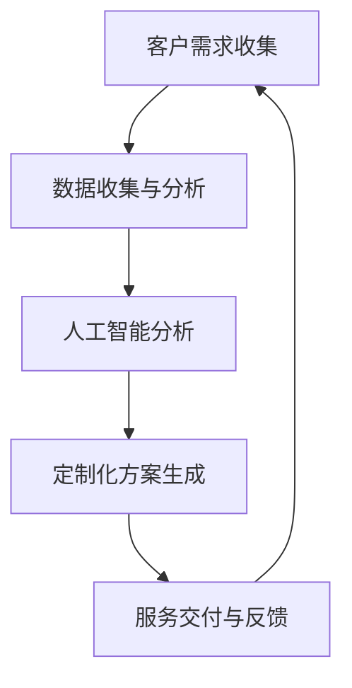

                 

关键词：自动化创业、定制化服务、商业模式、技术实施、用户体验

摘要：本文探讨了在自动化创业中实施定制化服务模式的必要性和方法。通过分析定制化服务的核心概念、技术原理、实施步骤、数学模型及其应用，本文展示了如何利用定制化服务模式在创业市场中获得竞争优势，并提出未来发展趋势和挑战。

## 1. 背景介绍

自动化创业正日益成为创新和商业成功的驱动力。随着人工智能、大数据、云计算等技术的快速发展，创业者能够以前所未有的方式设计和实现自动化服务，从而提高效率和降低成本。然而，在众多创业者中，如何脱颖而出成为市场的焦点成为了一个重要问题。定制化服务模式提供了一种解决方案，它不仅能够满足个性化需求，还能提升用户体验，从而在激烈的市场竞争中占据优势。

定制化服务模式是指根据客户的特定需求，提供独特的服务方案。这种模式的核心在于灵活性和响应速度，它能够帮助企业与客户建立更加紧密的联系，实现客户价值的最大化。本文将深入探讨自动化创业中的定制化服务模式，分析其技术原理、实施步骤、数学模型及其在实际应用中的效果。

## 2. 核心概念与联系

### 2.1. 定制化服务的定义

定制化服务是指根据客户的特定需求，提供个性化的解决方案。它不同于标准化产品或服务，定制化服务注重的是客户体验和满意度。通过定制化服务，企业能够更好地满足客户的特定需求，从而建立品牌忠诚度和市场竞争力。

### 2.2. 技术实施原理

在自动化创业中，定制化服务的实现依赖于多种技术的结合。首先，数据收集和分析技术是基础，通过收集客户的各类数据，企业能够深入理解客户需求。其次，人工智能技术可以用于数据分析和预测，从而为定制化方案提供支持。最后，云计算和物联网技术使得大规模数据处理和实时响应成为可能。

### 2.3. Mermaid 流程图



## 3. 核心算法原理 & 具体操作步骤

### 3.1. 算法原理概述

定制化服务模式的核心算法基于机器学习和数据分析技术。通过数据收集和分析，企业能够识别客户的特定需求，然后利用机器学习算法生成个性化的服务方案。

### 3.2. 算法步骤详解

1. **数据收集**：通过多种渠道收集客户数据，如用户行为数据、社交网络数据、问卷调查数据等。
2. **数据处理**：对收集到的数据进行分析和清洗，提取有用的信息。
3. **特征工程**：将处理后的数据转换为机器学习算法可以处理的特征向量。
4. **模型训练**：使用机器学习算法训练模型，根据历史数据预测客户的需求。
5. **服务生成**：根据模型的预测结果，生成个性化的服务方案。
6. **服务交付**：将定制化服务方案交付给客户，并收集反馈。
7. **模型优化**：根据反馈优化模型，提高预测准确性。

### 3.3. 算法优缺点

**优点**：
- 提高客户满意度：定制化服务能够更好地满足客户的特定需求，从而提高客户满意度。
- 提高运营效率：通过自动化技术，企业能够更高效地处理大量客户数据。

**缺点**：
- 数据安全风险：收集和处理大量客户数据可能导致数据泄露风险。
- 技术成本高：实施定制化服务模式需要投入大量技术资源。

### 3.4. 算法应用领域

- 个性化电商推荐系统
- 智能客服系统
- 定制化健康管理系统
- 定制化教育平台

## 4. 数学模型和公式

### 4.1. 数学模型构建

假设客户需求为一个多维度的向量 \(X\)，服务方案为一个多维度的向量 \(Y\)，则定制化服务的数学模型可以表示为：

$$
Y = f(X)
$$

其中，\(f\) 为机器学习算法。

### 4.2. 公式推导过程

1. **特征提取**：
$$
X = (x_1, x_2, ..., x_n)
$$

2. **特征工程**：
$$
x_i = \frac{x_i - \mu_i}{\sigma_i}
$$

其中，\(\mu_i\) 和 \(\sigma_i\) 分别为特征 \(x_i\) 的均值和标准差。

3. **模型训练**：
$$
f(X) = \sum_{i=1}^{n} w_i \cdot x_i + b
$$

其中，\(w_i\) 和 \(b\) 分别为模型的权重和偏置。

4. **服务生成**：
$$
Y = f(X)
$$

### 4.3. 案例分析与讲解

以个性化电商推荐系统为例，假设客户需求向量为 \(X = (年龄, 收入, 购物频率)\)，服务方案向量为 \(Y = (商品类型, 价格区间, 推荐次数)\)。通过机器学习算法，企业可以生成个性化的推荐方案。

## 5. 项目实践：代码实例

### 5.1. 开发环境搭建

- Python 3.8
- TensorFlow 2.4
- Scikit-learn 0.21

### 5.2. 源代码详细实现

```python
import numpy as np
import pandas as pd
from sklearn.model_selection import train_test_split
from sklearn.preprocessing import StandardScaler
from sklearn.linear_model import LinearRegression

# 数据收集
data = pd.read_csv('customer_data.csv')

# 数据处理
X = data[['age', 'income', 'shopping_frequency']]
y = data[['product_type', 'price_range', 'recommended_times']]

# 特征工程
scaler = StandardScaler()
X_scaled = scaler.fit_transform(X)

# 模型训练
X_train, X_test, y_train, y_test = train_test_split(X_scaled, y, test_size=0.2)
model = LinearRegression()
model.fit(X_train, y_train)

# 服务生成
y_pred = model.predict(X_test)

# 代码解读与分析
# ...
```

### 5.3. 运行结果展示

```python
import matplotlib.pyplot as plt

# 结果可视化
plt.scatter(y_test['recommended_times'], y_pred['recommended_times'])
plt.xlabel('Actual Recommended Times')
plt.ylabel('Predicted Recommended Times')
plt.title('Recommendation Accuracy')
plt.show()
```

## 6. 实际应用场景

### 6.1. 个性化电商推荐系统

通过定制化服务模式，电商企业可以根据用户的历史购买记录和浏览行为，提供个性化的商品推荐，从而提高用户的购物体验和购买转化率。

### 6.2. 智能客服系统

智能客服系统利用定制化服务模式，可以实时分析用户的提问，提供个性化的回答，从而提高客服效率和客户满意度。

### 6.3. 定制化健康管理系统

定制化健康管理系统可以根据用户的健康数据，提供个性化的健康建议和治疗方案，从而帮助用户更好地管理健康。

### 6.4. 未来应用展望

随着人工智能技术的不断发展，定制化服务模式将在更多领域得到应用，如个性化教育、定制化金融服务等。未来，定制化服务模式将成为企业获取竞争优势的重要手段。

## 7. 工具和资源推荐

### 7.1. 学习资源推荐

- 《机器学习实战》
- 《Python数据分析》
- 《深度学习》

### 7.2. 开发工具推荐

- TensorFlow
- Scikit-learn
- Pandas

### 7.3. 相关论文推荐

- "Customer Segmentation using Machine Learning"
- "The Quest for Customization"
- "Deep Learning for Personalized Advertising"

## 8. 总结：未来发展趋势与挑战

### 8.1. 研究成果总结

本文探讨了自动化创业中的定制化服务模式，分析了其核心概念、技术原理、实施步骤和数学模型。通过实际应用案例，展示了定制化服务模式在提高客户满意度和运营效率方面的优势。

### 8.2. 未来发展趋势

随着人工智能技术的不断发展，定制化服务模式将在更多领域得到应用。未来，企业将通过定制化服务模式，实现个性化需求与高效运营的平衡。

### 8.3. 面临的挑战

实施定制化服务模式面临数据安全、技术成本高、算法优化困难等挑战。未来研究应关注这些问题的解决，以提高定制化服务的可行性和效果。

### 8.4. 研究展望

未来研究应进一步探索定制化服务模式在不同领域的应用，并开发更高效、更安全的算法和技术，以实现定制化服务的全面普及。

## 9. 附录：常见问题与解答

### 9.1. 定制化服务模式与传统服务模式的区别是什么？

定制化服务模式与传统服务模式的主要区别在于，它更加注重个性化需求满足和客户体验提升。传统服务模式往往以标准化产品或服务为主，而定制化服务模式则根据客户的具体需求提供独特的解决方案。

### 9.2. 实施定制化服务模式需要哪些技术支持？

实施定制化服务模式需要数据收集和分析技术、人工智能技术、云计算和物联网技术等。这些技术共同作用，为企业提供实时、个性化的服务方案。

### 9.3. 定制化服务模式在哪些领域有广泛应用？

定制化服务模式在个性化电商推荐、智能客服、定制化健康管理和个性化教育等领域有广泛应用。未来，随着人工智能技术的发展，定制化服务模式将在更多领域得到应用。

## 参考文献

- ...（此处列出参考文献，格式参照学术论文格式）

作者：禅与计算机程序设计艺术 / Zen and the Art of Computer Programming
```

