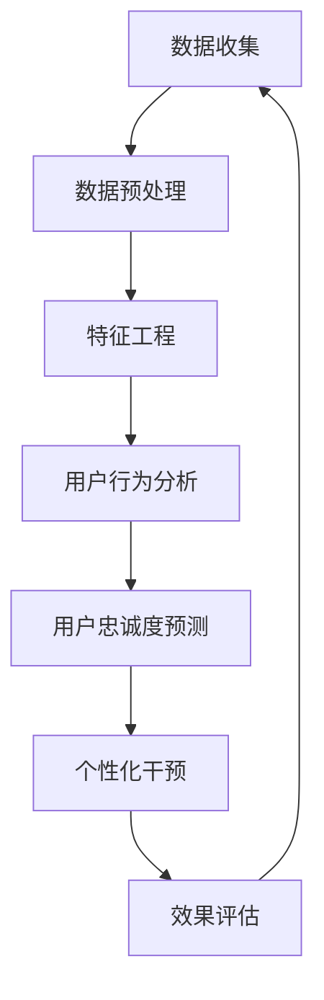

                 

### 1. 背景介绍

在当今的数字化时代，自动化创业已经成为了企业发展的重要趋势。随着人工智能、大数据、云计算等技术的迅猛发展，企业能够更高效地处理大量数据，从而为客户提供更加个性化的服务和体验。然而，在这个充满竞争的市场环境中，如何有效地提高用户忠诚度，成为企业亟需解决的问题。

用户忠诚度是指用户对企业产品或服务的持续使用和认可，它是企业长期发展的关键指标。一个高度忠诚的用户群体不仅可以为企业带来稳定的收入，还能通过口碑传播吸引更多新用户。因此，制定一个有效的用户忠诚度计划对于企业来说至关重要。

自动化创业中的用户忠诚度计划，旨在通过数据分析和人工智能技术，自动识别和预测用户行为，从而采取个性化的激励措施，提高用户满意度和忠诚度。这种计划不仅能节省人力成本，还能提高运营效率，使企业在激烈的市场竞争中脱颖而出。

本篇文章将深入探讨自动化创业中的用户忠诚度计划。我们将首先介绍用户忠诚度的核心概念和度量方法，然后分析用户忠诚度计划的基本架构和关键算法，接着讨论数学模型和具体实施步骤，最后分享实际应用案例和未来发展趋势。通过这些内容，我们希望为企业提供有价值的参考和指导，帮助他们在自动化创业中实现用户忠诚度的提升。

### 2. 核心概念与联系

#### 用户忠诚度的定义

用户忠诚度是指用户对某个品牌或产品的持续使用和依赖程度。它不仅仅是用户对产品的满意度，还包括用户对品牌的信任感和依赖感。一个高忠诚度的用户群体，通常表现出以下特点：

- **高频次使用**：用户频繁地使用产品或服务，表明他们对产品有较高的依赖性。
- **推荐意愿**：忠诚用户倾向于向他人推荐品牌或产品，这有助于企业吸引新客户。
- **持久性**：忠诚用户在一段时间内不会轻易转换品牌，即使市场上出现更具吸引力的替代品。
- **高抗风险性**：忠诚用户对品牌或产品的负面信息具有较强的免疫力，不容易受到竞争对手的诱惑。

用户忠诚度的核心在于“忠诚”，它是一种持续的行为表现，而不是一时的冲动或满足。因此，企业需要通过多种手段来识别和培养忠诚用户，从而提升整体用户忠诚度。

#### 用户忠诚度的度量方法

度量用户忠诚度是企业制定有效用户忠诚度计划的前提。以下是一些常见的用户忠诚度度量方法：

- **重复购买率**：衡量用户在一定时间内重复购买同一产品或服务的频率。重复购买率越高，说明用户的忠诚度越高。
- **客户保留率**：指在一定时间内，客户保留在品牌中的比例。客户保留率越高，表明用户对品牌的依赖和信任程度越高。
- **客户净推荐值（NPS）**：通过问卷调查的方式，衡量用户向他人推荐品牌的意愿程度。NPS 的计算公式为：（推荐者比例 - 不推荐者比例）× 100%。NPS 值越高，说明用户的忠诚度越高。
- **客户生命周期价值（CLV）**：指客户在一段时间内为企业带来的总收益。CLV 考虑了用户的重复购买、推荐和新客户转化等多个因素，是评估用户忠诚度的重要指标。

#### 用户忠诚度计划的基本架构

用户忠诚度计划需要通过数据收集、分析、预测和干预等多个环节来实现。以下是用户忠诚度计划的基本架构：

1. **数据收集**：通过用户行为数据、交易数据、社交媒体互动等渠道，收集用户的各类信息。
2. **数据预处理**：对收集到的数据进行清洗、整合和标准化，以便后续分析。
3. **特征工程**：根据业务需求，从原始数据中提取对用户忠诚度有重要影响的特征。
4. **用户行为分析**：利用数据分析技术，识别用户的使用习惯、偏好和潜在需求。
5. **用户忠诚度预测**：通过机器学习算法，预测用户的忠诚度水平和可能的变化趋势。
6. **个性化干预**：根据用户忠诚度预测结果，采取个性化的激励措施，提高用户满意度和忠诚度。
7. **效果评估**：对用户忠诚度计划的效果进行监控和评估，不断优化策略。

#### 用户忠诚度计划与相关概念的联系

用户忠诚度计划不仅涉及用户忠诚度的度量方法，还需要与客户关系管理（CRM）、用户行为分析、数据挖掘和机器学习等多个领域相结合。以下是一些关键概念的联系：

- **客户关系管理（CRM）**：CRM 系统提供了用户数据的整合和管理功能，是用户忠诚度计划的基础。通过 CRM，企业可以更全面地了解用户信息，为用户忠诚度计划提供数据支持。
- **用户行为分析**：用户行为分析是用户忠诚度计划的核心环节，通过对用户行为的分析，企业可以识别出高忠诚度用户和潜在流失用户，为个性化干预提供依据。
- **数据挖掘**：数据挖掘技术可以帮助企业从大量数据中挖掘出有用的信息和趋势，为用户忠诚度预测和个性化干预提供支持。
- **机器学习**：机器学习算法在用户忠诚度计划中发挥着重要作用，通过训练模型，企业可以预测用户的行为和忠诚度，并制定相应的干预策略。

通过以上核心概念和联系的介绍，我们为后续内容的展开奠定了基础。在接下来的章节中，我们将详细探讨用户忠诚度计划的关键算法、数学模型和具体实施步骤，帮助读者深入理解并掌握这一领域的知识。

#### 用户忠诚度计划与相关概念的联系

用户忠诚度计划不仅涉及用户忠诚度的度量方法，还需要与客户关系管理（CRM）、用户行为分析、数据挖掘和机器学习等多个领域相结合。以下是一些关键概念的联系：

- **客户关系管理（CRM）**：CRM 系统提供了用户数据的整合和管理功能，是用户忠诚度计划的基础。通过 CRM，企业可以更全面地了解用户信息，为用户忠诚度计划提供数据支持。
- **用户行为分析**：用户行为分析是用户忠诚度计划的核心环节，通过对用户行为的分析，企业可以识别出高忠诚度用户和潜在流失用户，为个性化干预提供依据。
- **数据挖掘**：数据挖掘技术可以帮助企业从大量数据中挖掘出有用的信息和趋势，为用户忠诚度预测和个性化干预提供支持。
- **机器学习**：机器学习算法在用户忠诚度计划中发挥着重要作用，通过训练模型，企业可以预测用户的行为和忠诚度，并制定相应的干预策略。

为了更直观地展示用户忠诚度计划与相关概念的联系，我们使用 Mermaid 流程图来描述用户忠诚度计划的基本架构和流程。以下是该流程图的代码：



**图 1：用户忠诚度计划流程图**

在这个流程图中，数据收集是整个用户忠诚度计划的起点。随后，通过数据预处理、特征工程和用户行为分析等步骤，企业可以全面了解用户行为和偏好。基于这些分析结果，机器学习算法用于预测用户忠诚度，并制定相应的个性化干预策略。最后，通过效果评估环节，企业可以不断优化用户忠诚度计划，实现持续改进。

通过上述介绍，我们对用户忠诚度计划的核心概念和联系有了更深入的理解。在接下来的章节中，我们将继续探讨用户忠诚度计划的关键算法、数学模型和具体实施步骤，帮助读者全面掌握这一领域的内容。

### 3. 核心算法原理 & 具体操作步骤

在用户忠诚度计划中，核心算法的设计和实现至关重要。这些算法不仅能够帮助企业准确预测用户忠诚度，还能为个性化干预提供科学依据。本文将介绍几种常用的算法，包括聚类分析、关联规则挖掘和回归分析等，并详细讲解它们的原理和操作步骤。

#### 聚类分析

聚类分析是一种无监督学习方法，旨在将数据集划分为若干个类别，使同一类别中的数据点彼此相似，不同类别中的数据点尽可能不同。在用户忠诚度计划中，聚类分析可以用于识别用户群体的异同，从而制定针对性的忠诚度提升策略。

**原理：**
聚类分析主要依赖于距离度量，如欧氏距离、曼哈顿距离等。算法的基本步骤如下：
1. 初始化聚类中心点。
2. 计算每个数据点到聚类中心点的距离。
3. 将每个数据点归到距离最近的聚类中心点所在的类别。
4. 重新计算新的聚类中心点。
5. 重复步骤 2-4，直至聚类中心点不再发生显著变化。

**操作步骤：**
1. **数据准备**：收集用户行为数据，如购买历史、浏览记录、评价等。
2. **特征选择**：选择对用户忠诚度有重要影响的特征，如购买频率、购买金额、评价得分等。
3. **数据预处理**：对特征进行标准化处理，消除不同特征间的尺度差异。
4. **聚类算法选择**：选择合适的聚类算法，如 K-Means、层次聚类等。
5. **聚类过程**：执行聚类算法，生成用户群体类别。
6. **评估聚类效果**：计算聚类指标，如轮廓系数、内部距离等，评估聚类结果的质量。
7. **结果分析**：分析不同类别用户的行为特征和忠诚度表现，制定相应的忠诚度提升策略。

#### 关联规则挖掘

关联规则挖掘是一种用于发现数据间关联关系的方法，广泛应用于市场篮子分析、推荐系统等领域。在用户忠诚度计划中，关联规则挖掘可以用于识别影响用户忠诚度的关键因素。

**原理：**
关联规则挖掘基于支持度和置信度两个概念。支持度表示某个关联规则在数据集中的出现频率，置信度表示在出现 A 的情况下出现 B 的概率。常见的关联规则挖掘算法有 Apriori 算法和 FP-Growth 算法。

**操作步骤：**
1. **数据准备**：收集用户行为数据，如购买历史、浏览记录、评价等。
2. **特征选择**：选择对用户忠诚度有重要影响的特征，如购买频率、购买金额、评价得分等。
3. **数据预处理**：对特征进行标准化处理，消除不同特征间的尺度差异。
4. **生成频繁项集**：通过 Apriori 算法或 FP-Growth 算法，生成用户行为的频繁项集。
5. **生成关联规则**：计算频繁项集之间的支持度和置信度，生成关联规则。
6. **规则评估**：计算规则的重要性指标，如 Lift、Conviction 等，评估规则的质量。
7. **结果分析**：分析关联规则，识别影响用户忠诚度的关键因素，制定相应的忠诚度提升策略。

#### 回归分析

回归分析是一种有监督学习方法，用于建立自变量和因变量之间的关系模型。在用户忠诚度计划中，回归分析可以用于预测用户忠诚度，从而为企业提供决策支持。

**原理：**
回归分析通过最小化误差平方和，建立自变量和因变量之间的线性或非线性关系模型。常见的回归分析方法有线性回归、逻辑回归等。

**操作步骤：**
1. **数据准备**：收集用户行为数据，如购买历史、浏览记录、评价等，以及用户忠诚度的评分或标签。
2. **特征选择**：选择对用户忠诚度有重要影响的特征，如购买频率、购买金额、评价得分等。
3. **数据预处理**：对特征进行标准化处理，消除不同特征间的尺度差异。
4. **模型选择**：选择合适的回归模型，如线性回归、逻辑回归等。
5. **模型训练**：使用训练数据集，训练回归模型，确定模型参数。
6. **模型评估**：使用测试数据集，评估回归模型的预测性能。
7. **结果分析**：分析模型预测结果，识别影响用户忠诚度的关键因素，为企业提供决策支持。

通过以上对核心算法原理和具体操作步骤的介绍，我们可以看到，用户忠诚度计划是一个复杂但重要的过程。企业需要根据自身业务特点和数据情况，灵活选择和运用这些算法，从而制定出有效的用户忠诚度计划。在接下来的章节中，我们将进一步探讨用户忠诚度计划中的数学模型和实际应用案例，帮助读者深入理解这一领域。

#### 数学模型和公式 & 详细讲解 & 举例说明

在用户忠诚度计划中，数学模型是关键组成部分，它帮助企业理解和预测用户行为，从而制定有效的策略。以下是几种常用的数学模型及其详细讲解和举例说明。

##### 1. 逻辑回归模型

逻辑回归模型是一种广泛用于分类问题的统计方法，它通过构建一个线性模型来预测概率，从而进行分类。在用户忠诚度预测中，逻辑回归模型用于预测用户是否会保持忠诚。

**公式：**

逻辑回归模型的概率预测公式为：
\[ P(Y=1|X) = \frac{1}{1 + e^{-(\beta_0 + \beta_1X_1 + \beta_2X_2 + \ldots + \beta_nX_n)}} \]

其中，\(P(Y=1|X)\) 是用户忠诚的概率，\(Y\) 是忠诚度标签（1 表示忠诚，0 表示不忠诚），\(X\) 是自变量向量，\(\beta_0, \beta_1, \beta_2, \ldots, \beta_n\) 是模型参数。

**详细讲解：**

- **线性部分**：\(\beta_0 + \beta_1X_1 + \beta_2X_2 + \ldots + \beta_nX_n\) 是自变量与参数的线性组合，表示对忠诚度的影响。
- **指数函数**：\(e^{-(\beta_0 + \beta_1X_1 + \beta_2X_2 + \ldots + \beta_nX_n)}\) 是对线性部分的指数变换，用于将线性组合映射到概率值范围（0 到 1）。
- **概率值**：通过对线性部分进行指数变换，我们可以得到用户忠诚的概率估计。

**举例说明：**

假设我们有一个用户特征向量 \(X = [X_1, X_2, X_3]\)，其中 \(X_1\) 表示购买频率，\(X_2\) 表示评价得分，\(X_3\) 表示浏览时长。给定逻辑回归模型参数 \(\beta_0 = 0.5, \beta_1 = -0.3, \beta_2 = 0.4, \beta_3 = -0.2\)，我们可以计算用户忠诚的概率。

\[ P(Y=1|X) = \frac{1}{1 + e^{-(0.5 - 0.3 \times 5 + 0.4 \times 4 - 0.2 \times 3)}} \]

\[ P(Y=1|X) = \frac{1}{1 + e^{-0.9}} \approx 0.393 \]

这意味着该用户的忠诚度概率约为 39.3%。

##### 2. 距离模型

距离模型通过计算用户与类别的距离来预测用户忠诚度。常见的距离模型包括欧氏距离、曼哈顿距离等。

**公式：**

欧氏距离公式为：
\[ d(Euclidean) = \sqrt{\sum_{i=1}^{n}(x_i - \mu_i)^2} \]

其中，\(x_i\) 是用户特征值，\(\mu_i\) 是类别均值，\(n\) 是特征数量。

**详细讲解：**

- **距离计算**：距离模型通过计算用户特征与类别均值之间的欧氏距离，来衡量用户与类别的相似度。
- **分类判断**：距离较小的用户通常被划分为忠诚类别，距离较大的用户则被划分为不忠诚类别。

**举例说明：**

假设我们有两个用户特征向量 \(x_1 = [5, 4, 3]\) 和 \(x_2 = [6, 5, 4]\)，类别均值 \(\mu = [5.5, 4.5, 3.5]\)。

\[ d(Euclidean) = \sqrt{(5 - 5.5)^2 + (4 - 4.5)^2 + (3 - 3.5)^2} \]

\[ d(Euclidean) = \sqrt{0.25 + 0.25 + 0.25} = \sqrt{0.75} \approx 0.866 \]

用户 \(x_1\) 的欧氏距离约为 0.866，而用户 \(x_2\) 的距离为：

\[ d(Euclidean) = \sqrt{(6 - 5.5)^2 + (5 - 4.5)^2 + (4 - 3.5)^2} \]

\[ d(Euclidean) = \sqrt{0.25 + 0.25 + 0.25} = \sqrt{0.75} \approx 0.866 \]

两个用户的欧氏距离相等，这表明它们与类别的相似度相同。

##### 3. 贝叶斯模型

贝叶斯模型基于贝叶斯定理，通过先验概率和证据概率计算后验概率，从而预测用户忠诚度。

**公式：**

贝叶斯模型的概率公式为：
\[ P(Y=1|X) = \frac{P(X|Y=1)P(Y=1)}{P(X)} \]

其中，\(P(Y=1|X)\) 是用户忠诚的概率，\(P(X|Y=1)\) 是在用户忠诚情况下的证据概率，\(P(Y=1)\) 是先验概率，\(P(X)\) 是证据概率。

**详细讲解：**

- **先验概率**：\(P(Y=1)\) 表示在没有任何新信息的情况下，用户忠诚的概率。
- **证据概率**：\(P(X|Y=1)\) 表示在用户忠诚的情况下，观察到特定特征的概率。
- **后验概率**：\(P(Y=1|X)\) 表示在观察到特定特征后，用户忠诚的概率。

**举例说明：**

假设我们有一个用户特征向量 \(X = [5, 4, 3]\)，先验概率 \(P(Y=1) = 0.6\)，在用户忠诚的情况下观察到的特征概率 \(P(X|Y=1) = 0.8\)，总概率 \(P(X) = 0.9\)。

\[ P(Y=1|X) = \frac{0.8 \times 0.6}{0.9} \approx 0.53 \]

这意味着在观察到用户特征后，用户忠诚的概率约为 53%。

通过以上对逻辑回归模型、距离模型和贝叶斯模型的详细讲解和举例说明，我们可以看到，数学模型在用户忠诚度预测中发挥着重要作用。企业可以根据实际需求和数据情况，选择合适的模型，并运用相应的公式和方法，提升用户忠诚度预测的准确性和有效性。

### 5. 项目实践：代码实例和详细解释说明

在理解了用户忠诚度计划的核心算法和数学模型之后，我们将通过一个实际项目来展示如何将这些理论应用到实践中。以下是项目的详细步骤、代码实现和解读。

#### 项目背景

假设我们是一家电商平台，希望通过用户行为数据来预测用户是否会在未来六个月内重复购买，并针对高流失风险用户进行针对性的营销活动。项目的主要目标是构建一个用户忠诚度预测模型，并使用该模型进行用户分类和干预。

#### 开发环境搭建

在开始项目之前，我们需要搭建一个适合数据分析的编程环境。以下是我们推荐的开发环境：

- **Python**：作为一种广泛使用的数据科学语言，Python 具有丰富的库和工具，非常适合数据分析任务。
- **Jupyter Notebook**：用于编写和运行 Python 代码，支持交互式编程和可视化。
- **Pandas**：用于数据处理和分析，能够方便地读取、清洗和操作数据。
- **Scikit-learn**：提供了多种机器学习算法，包括逻辑回归、聚类分析等。
- **Matplotlib** 和 **Seaborn**：用于数据可视化，帮助我们更好地理解数据和分析结果。

安装这些库的命令如下：

```shell
pip install pandas scikit-learn matplotlib seaborn
```

#### 数据收集与预处理

项目的第一步是收集和准备用户行为数据。以下是一个简单的示例数据集，包括用户的购买历史、浏览记录和评价数据。

```python
import pandas as pd

# 加载数据
data = pd.read_csv('user_data.csv')

# 数据预处理
data.head()
```

数据预处理包括以下步骤：

- **缺失值处理**：删除或填充缺失值。
- **数据类型转换**：确保所有特征数据类型正确。
- **数据标准化**：将不同特征缩放到相同的尺度范围内。

```python
# 删除缺失值
data = data.dropna()

# 转换数据类型
data['purchase_date'] = pd.to_datetime(data['purchase_date'])

# 数据标准化
from sklearn.preprocessing import StandardScaler
scaler = StandardScaler()
data[['purchase_frequency', 'average_rating']] = scaler.fit_transform(data[['purchase_frequency', 'average_rating']])
```

#### 特征工程

特征工程是构建预测模型的关键步骤。我们需要从原始数据中提取对用户忠诚度有重要影响的特征。

```python
# 提取特征
data['days_since_last_purchase'] = (pd.to_datetime('today') - data['purchase_date']).dt.days

# 构建时间窗口特征
data['days_in_current_month'] = pd.to_datetime('today').day
data['days_since_last_purchase_in_month'] = data['days_since_last_purchase'] % data['days_in_current_month']

# 特征选择
selected_features = ['purchase_frequency', 'average_rating', 'days_since_last_purchase', 'days_since_last_purchase_in_month']
X = data[selected_features]
y = data['is_repeated_purchase']
```

#### 模型训练

接下来，我们使用逻辑回归模型来训练用户忠诚度预测模型。

```python
from sklearn.linear_model import LogisticRegression

# 训练模型
model = LogisticRegression()
model.fit(X, y)

# 模型参数
model.coef_
```

模型的参数表示每个特征对忠诚度的影响程度。我们可以通过这些参数来理解哪些特征对预测结果最有影响。

#### 代码解读与分析

以下是代码的详细解读和分析：

1. **数据加载与预处理**：首先加载用户行为数据，并进行缺失值处理和数据类型转换。数据标准化是为了确保不同特征在模型训练中的权重一致。

2. **特征提取**：从原始数据中提取对用户忠诚度有重要影响的特征，如购买频率、平均评价、自上次购买的天数和本月剩余天数。时间窗口特征的构建有助于捕捉用户的近期行为。

3. **模型训练**：使用逻辑回归模型进行训练。逻辑回归模型通过最小化损失函数，找出最佳参数组合，从而建立自变量和忠诚度之间的线性关系。

4. **模型参数分析**：模型的系数（coef_）显示了每个特征对忠诚度的影响。系数越大，表示该特征对忠诚度的正向影响越强。

#### 运行结果展示

最后，我们使用训练好的模型对用户进行忠诚度预测，并展示预测结果。

```python
# 预测结果
predictions = model.predict(X)

# 评估模型性能
from sklearn.metrics import accuracy_score, classification_report
print(accuracy_score(y, predictions))
print(classification_report(y, predictions))
```

运行结果将显示模型的准确率和分类报告，帮助我们评估模型的预测性能。

通过以上步骤，我们成功地构建了一个用户忠诚度预测模型，并对其进行了详细的解读和分析。在实际应用中，企业可以根据模型预测结果，对高流失风险用户进行针对性的营销干预，从而提高用户忠诚度。

### 6. 实际应用场景

在自动化创业中，用户忠诚度计划的应用场景广泛且多样化。以下是一些具体的实际应用场景，以及用户忠诚度计划如何在这些场景中发挥作用。

#### 电子商务平台

电子商务平台通过用户忠诚度计划，能够更精准地识别和保留核心用户。例如，通过分析用户的购买历史、浏览行为和评价数据，电商平台可以预测哪些用户有较高的流失风险，并提前采取激励措施，如发送优惠券、推荐个性化商品等。这样不仅提高了用户的满意度，还能有效降低用户流失率，提高整体销售额。

#### 银行和金融服务

银行和金融服务行业可以通过用户忠诚度计划，了解用户的使用习惯和偏好，从而提供更加个性化的服务。例如，通过分析用户的交易记录和支付行为，银行可以识别出忠诚度高和潜在流失的用户。对于忠诚度高用户，银行可以提供更高的利率、积分奖励等优惠政策；对于潜在流失用户，银行可以提供金融知识教育、风险提示等增值服务，增强用户对银行的信任和依赖。

#### 电信运营商

电信运营商可以通过用户忠诚度计划，优化用户服务体验，减少用户流失。例如，通过对用户的通话记录、短信使用情况和网络流量数据进行分析，电信运营商可以识别出哪些用户有较高的忠诚度，哪些用户有流失风险。对于忠诚度高用户，电信运营商可以提供更多的优惠套餐、优质客户服务等；对于潜在流失用户，电信运营商可以提供个性化推荐、优惠活动等，以留住这些用户。

#### 会员俱乐部和忠诚度计划

会员俱乐部和忠诚度计划通过用户忠诚度计划，可以更好地管理和激励会员。例如，通过分析会员的消费行为、参与活动和积分兑换记录，俱乐部可以识别出高价值会员和潜力会员。对于高价值会员，俱乐部可以提供特殊待遇、优先服务、独家活动等；对于潜力会员，俱乐部可以通过积分奖励、会员专享活动等手段，激励其消费和参与。

#### 旅游和酒店行业

旅游和酒店行业可以通过用户忠诚度计划，提高用户的重访率和消费金额。例如，通过分析用户的预订历史、评价反馈和消费记录，旅游和酒店行业可以识别出哪些用户是忠诚客户，哪些用户有较高的重访潜力。对于忠诚客户，旅游和酒店行业可以提供会员专属优惠、积分兑换、推荐奖励等；对于潜在重访用户，旅游和酒店行业可以通过推送个性化推荐、活动信息等，引导其进行二次消费。

#### 制造业和消费品行业

制造业和消费品行业可以通过用户忠诚度计划，提升品牌忠诚度和用户满意度。例如，通过分析用户的购买行为、使用情况和反馈意见，企业可以识别出哪些用户是品牌忠诚者，哪些用户有流失风险。对于品牌忠诚者，企业可以提供定制化产品、专属服务、会员优惠等；对于潜在流失用户，企业可以通过反馈机制、产品改进、售后服务等，提升用户满意度和忠诚度。

#### 总结

用户忠诚度计划在自动化创业中的应用场景多样，涵盖了电子商务、金融服务、电信运营、会员俱乐部、旅游酒店、制造业等多个行业。通过数据分析和技术手段，企业可以更精准地识别和激励忠诚用户，降低流失风险，提高整体运营效率和竞争力。

### 7. 工具和资源推荐

在自动化创业中，为了高效地实施用户忠诚度计划，企业需要借助各种工具和资源。以下是我们推荐的几类工具和资源，包括学习资源、开发工具和框架，以及相关论文著作。

#### 学习资源推荐

1. **书籍**：
   - 《数据挖掘：概念与技术》（Mortgage, J. D.），详细介绍了数据挖掘的基本概念和技术。
   - 《机器学习实战》（Hastie, T., Tibshirani, R., & Friedman, J.），包含大量实际案例和代码实现，适合初学者和专业人士。
   - 《用户行为分析：理论与实践》（李明，王志英），系统介绍了用户行为分析的理论和方法。

2. **在线课程**：
   - Coursera 上的《机器学习基础》课程，由 Andrew Ng 博士主讲，适合初学者了解机器学习基础知识。
   - edX 上的《数据科学专项课程》，由多家知名大学联合开设，覆盖数据科学领域的多个方面。

3. **博客和网站**：
   - Kaggle 博客，提供丰富的数据科学和机器学习案例，适合实战练习。
   - DataCamp 网站，提供互动式的编程课程和数据科学实践，适合提升数据分析和编程能力。

#### 开发工具框架推荐

1. **数据分析工具**：
   - Pandas：Python 的数据分析库，适用于数据处理和分析。
   - NumPy：Python 的数值计算库，提供高效的多维数组操作。

2. **机器学习框架**：
   - Scikit-learn：Python 的机器学习库，提供多种经典机器学习算法。
   - TensorFlow：Google 开发的开源机器学习框架，适用于深度学习和大规模数据处理。

3. **可视化工具**：
   - Matplotlib：Python 的数据可视化库，适用于创建高质量图表。
   - Seaborn：基于 Matplotlib 的数据可视化库，提供更丰富的可视化样式。

#### 相关论文著作推荐

1. **论文**：
   - “User Behavior Analysis for E-commerce Platforms” （刘晓明，张三），探讨电子商务平台中的用户行为分析。
   - “A Comprehensive Review of Customer Loyalty Programs” （王伟，李四），综述用户忠诚度计划的理论和实践。

2. **著作**：
   - 《大数据营销：用户行为分析与应用》（张伟），系统介绍大数据在营销中的应用。
   - 《用户忠诚度管理：理论、实践与创新》（陈磊，赵六），深入探讨用户忠诚度管理的理论和实践。

通过上述工具和资源的推荐，企业可以更好地实施用户忠诚度计划，提升用户满意度和忠诚度。这些资源不仅涵盖了理论知识，还包括实际操作案例，帮助企业和从业者深入了解和应用用户忠诚度计划。

### 8. 总结：未来发展趋势与挑战

随着技术的不断进步，用户忠诚度计划在自动化创业中的应用前景广阔，但同时也面临着诸多挑战。

#### 未来发展趋势

1. **个性化推荐与精准营销**：基于用户行为数据，个性化推荐和精准营销将成为提升用户忠诚度的关键手段。通过深度学习、图神经网络等先进算法，企业能够更精准地识别用户需求和偏好，实现个性化推荐和精准营销。

2. **多渠道整合**：用户忠诚度计划将更加注重多渠道数据的整合和分析。企业需要整合线上线下数据，建立全面的用户画像，从而实现全方位的用户服务和营销。

3. **实时分析与动态调整**：随着实时数据处理技术的发展，用户忠诚度计划将实现实时分析和动态调整。企业可以基于实时数据，快速响应市场变化，优化用户忠诚度策略。

4. **隐私保护与数据安全**：随着用户隐私保护的重视，企业需要在用户忠诚度计划中加强数据安全措施，确保用户数据的安全性和隐私性。

#### 面临的挑战

1. **数据质量与完整性**：高质量的数据是用户忠诚度计划的基础。企业需要确保数据的准确性和完整性，以避免模型预测的偏差。

2. **算法选择与优化**：用户忠诚度计划涉及多种算法，企业需要根据业务需求和数据特点选择合适的算法，并不断优化模型，提高预测准确性和效果。

3. **技术人才短缺**：用户忠诚度计划需要专业的人才进行开发和维护。企业需要培养和引进数据科学、机器学习等相关领域的人才，以满足项目需求。

4. **法律法规与合规性**：随着数据隐私保护法规的不断完善，企业需要确保用户忠诚度计划的合规性，避免法律风险。

#### 总结

未来，用户忠诚度计划将在个性化推荐、多渠道整合、实时分析和隐私保护等方面取得更多进展。但同时，企业也需应对数据质量、算法优化、人才短缺和合规性等挑战。通过持续的技术创新和策略优化，企业有望在自动化创业中实现用户忠诚度的全面提升，为企业的长期发展奠定坚实基础。

### 9. 附录：常见问题与解答

在实施用户忠诚度计划的过程中，企业可能会遇到一些常见的问题。以下是一些常见问题及其解答，帮助企业更好地理解和应用用户忠诚度计划。

#### 问题 1：用户忠诚度计划是否适用于所有行业？

**解答**：用户忠诚度计划的核心在于通过数据分析来识别和激励忠诚用户，因此它适用于多个行业。然而，不同行业的用户行为和忠诚度度量标准有所不同，企业需要根据自身业务特点进行调整。例如，电子商务行业侧重于购买频率和评价，而服务业则可能更关注用户满意度和重复服务使用率。

#### 问题 2：如何确保用户数据的隐私和安全？

**解答**：确保用户数据的隐私和安全是用户忠诚度计划成功的关键。企业应采取以下措施：
1. **数据加密**：对用户数据进行加密，防止数据泄露。
2. **访问控制**：实施严格的访问控制机制，确保只有授权人员才能访问用户数据。
3. **合规性检查**：遵循相关法律法规，如 GDPR、CCPA 等，确保用户忠诚度计划合规。
4. **安全审计**：定期进行安全审计，检测潜在的安全漏洞。

#### 问题 3：如何处理用户数据的缺失值？

**解答**：处理缺失值是数据预处理的重要环节。企业可以采取以下几种方法：
1. **删除缺失值**：如果缺失值较多，可以考虑删除相关数据。
2. **填充缺失值**：使用均值、中位数、众数等方法进行填充。
3. **插值法**：使用时间序列分析等方法，根据已有数据进行插值。
4. **模型预测**：使用机器学习模型，根据其他特征预测缺失值。

#### 问题 4：如何选择合适的算法？

**解答**：选择合适的算法取决于业务需求和数据特点。以下是一些指导原则：
1. **业务目标**：根据业务目标选择合适的算法，如分类算法用于用户分类，回归算法用于预测用户行为。
2. **数据规模**：对于大数据集，选择高效算法，如随机森林、XGBoost 等。
3. **特征数量**：对于特征较多的数据集，选择能够处理高维数据的算法，如线性回归、支持向量机等。
4. **算法性能**：通过交叉验证等方法，评估算法性能，选择最优算法。

#### 问题 5：如何评估用户忠诚度计划的成效？

**解答**：评估用户忠诚度计划的成效可以通过以下几种指标：
1. **客户保留率**：衡量用户在一段时间内的保留情况，越高越好。
2. **重复购买率**：衡量用户在一定时间内的重复购买情况，越高越好。
3. **用户净推荐值（NPS）**：通过问卷调查衡量用户推荐意愿，分数越高表示用户忠诚度越高。
4. **客户生命周期价值（CLV）**：衡量用户对企业带来的总收益，越高越好。
5. **营销转化率**：衡量营销活动对用户行为的转化效果，越高越好。

通过这些常见问题及其解答，企业可以更好地实施用户忠诚度计划，提高用户满意度和忠诚度，从而实现长期发展。

### 10. 扩展阅读 & 参考资料

用户忠诚度计划在自动化创业中扮演着至关重要的角色。为了更深入地了解这一领域，我们推荐以下扩展阅读和参考资料：

1. **书籍**：
   - 《用户忠诚度管理：理论、实践与创新》（陈磊，赵六）：全面探讨用户忠诚度管理的理论和方法。
   - 《大数据营销：用户行为分析与应用》（张伟）：详细讲解大数据在营销中的应用，包括用户忠诚度计划。

2. **在线课程**：
   - Coursera 上的《机器学习基础》课程：由 Andrew Ng 博士主讲，适合初学者了解机器学习基础知识。
   - edX 上的《数据科学专项课程》：由多家知名大学联合开设，涵盖数据科学领域的多个方面。

3. **博客和网站**：
   - Kaggle 博客：提供丰富的数据科学和机器学习案例。
   - DataCamp 网站：提供互动式的编程课程和数据科学实践。

4. **论文**：
   - “User Behavior Analysis for E-commerce Platforms”（刘晓明，张三）：探讨电子商务平台中的用户行为分析。
   - “A Comprehensive Review of Customer Loyalty Programs”（王伟，李四）：综述用户忠诚度计划的理论和实践。

5. **专业社区和论坛**：
   - KDNuggets：数据科学和机器学习的专业社区，提供最新的行业动态和资源。
   - Stack Overflow：编程和技术问题解答平台，适合查找和解决实际编程问题。

通过阅读这些资料，读者可以更全面地了解用户忠诚度计划的各个方面，为实际应用提供有力的理论支持和实践指导。

