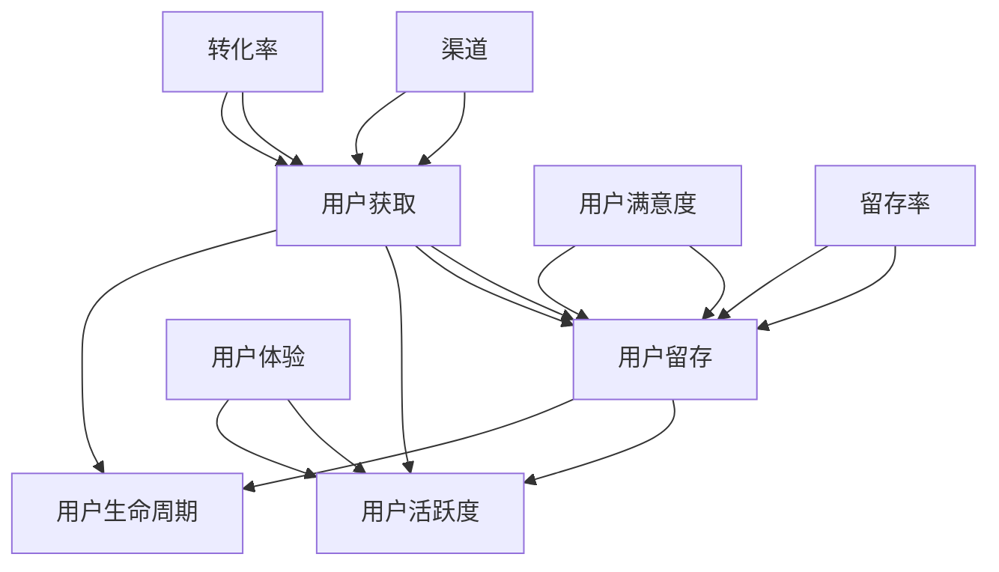

                 

### 1. 背景介绍

随着互联网技术的迅猛发展，自动化创业成为了一个备受关注的热门领域。在这个领域，企业通过运用人工智能、大数据和机器学习等技术，实现业务流程的自动化，提高生产效率，降低运营成本，同时提升用户体验。然而，在自动化创业中，用户获取与留存成为了企业面临的重大挑战。

用户获取是指吸引新用户来到平台，而用户留存则是指如何让这些用户持续使用平台并提供价值。在这两个环节中，如何有效地进行用户获取和留存，成为自动化创业企业能否成功的关键因素。

本文旨在探讨自动化创业中的用户获取与留存策略，帮助创业企业找到适合自己的方法。本文将分为以下几个部分：

1. **背景介绍**：介绍自动化创业的现状以及用户获取与留存的重要性。
2. **核心概念与联系**：解释用户获取与留存的相关概念，并提供相关的流程图。
3. **核心算法原理与具体操作步骤**：探讨用户获取与留存的算法原理，并给出具体操作步骤。
4. **数学模型和公式**：介绍用户获取与留存的数学模型和公式，并进行详细讲解和举例说明。
5. **项目实践**：通过一个具体的项目实践，展示用户获取与留存的实施过程。
6. **实际应用场景**：分析用户获取与留存在不同场景中的应用。
7. **工具和资源推荐**：推荐一些有助于用户获取与留存的学习资源和开发工具。
8. **总结**：总结用户获取与留存的重要性，并探讨未来的发展趋势与挑战。
9. **附录**：解答常见问题，提供扩展阅读和参考资料。

通过以上结构，我们将逐步分析自动化创业中的用户获取与留存，帮助读者深入理解并掌握这一重要课题。

### 2. 核心概念与联系

在探讨自动化创业中的用户获取与留存之前，我们首先需要明确相关核心概念及其相互关系。

**用户获取（User Acquisition）**：用户获取是指通过各种渠道和手段，吸引新的用户来到平台。这是自动化创业中至关重要的第一步，因为只有吸引了足够的用户，才能为后续的业务提供基础。

**用户留存（User Retention）**：用户留存是指如何让已经获取的用户持续使用平台并提供价值。这是自动化创业中持续关注和优化的目标，因为高留存率意味着用户对平台的忠诚度和依赖性。

**用户活跃度（User Activity）**：用户活跃度是指用户在平台上进行互动、产生内容的频率和程度。高活跃度是用户留存的重要标志，表明用户对平台的兴趣和参与度。

**用户生命周期（User Lifecycle）**：用户生命周期是指用户从首次接触平台到最终流失的整个过程。了解用户生命周期有助于企业更好地进行用户获取与留存策略的制定。

**渠道（Channels）**：渠道是指用于用户获取的具体途径，包括社交媒体、搜索引擎、广告、合作伙伴等。

**用户体验（User Experience）**：用户体验是指用户在使用平台时感受到的整体体验，包括界面设计、功能操作、响应速度等。

**用户满意度（User Satisfaction）**：用户满意度是指用户对平台服务的满意程度，直接影响用户留存和口碑传播。

**转化率（Conversion Rate）**：转化率是指访问者转化为实际用户的比率，是衡量用户获取效果的重要指标。

**留存率（Retention Rate）**：留存率是指在一定时间内，仍然使用平台的用户比例，是衡量用户留存效果的重要指标。

下面，我们将通过一个Mermaid流程图，展示用户获取与留存的相关概念及其相互关系：



**流程图说明**：

- **用户获取（A）**：通过不同的渠道（E），如社交媒体、搜索引擎和广告，吸引新用户。
- **用户留存（B）**：通过优化用户体验（F）、提高用户满意度（G），并利用数据分析和运营手段，提高用户的留存率（I）。
- **用户活跃度（C）**：通过活跃用户在平台上的互动和内容产生，保持用户的兴趣和参与度。
- **用户生命周期（D）**：从用户首次接触平台到最后流失，整个过程中不断进行用户获取与留存策略的调整和优化。
- **用户体验（F）**：通过界面设计、功能操作和响应速度等，提升用户在平台上的整体体验。
- **用户满意度（G）**：用户对平台服务的满意程度，直接影响用户留存和口碑传播。
- **转化率（H）**：新用户转化为实际用户的比率，是衡量用户获取效果的重要指标。
- **留存率（I）**：一定时间内仍使用平台的用户比例，是衡量用户留存效果的重要指标。

通过这个流程图，我们可以清晰地看到用户获取与留存之间的紧密联系，以及各个概念之间的相互作用。在后续的部分中，我们将进一步探讨这些核心概念的具体实现和应用。

### 3. 核心算法原理与具体操作步骤

在自动化创业中，用户获取与留存的过程涉及到多种算法原理和具体操作步骤。以下将详细介绍这些算法原理，并给出具体的操作步骤。

#### 3.1 用户获取算法原理

用户获取主要依赖于以下几种算法原理：

1. **目标用户定位**：通过大数据分析和用户画像，确定目标用户群体。这通常涉及分类、聚类和关联规则等算法。
2. **精准营销**：利用精准营销算法，如协同过滤、内容推荐和广告投放，将产品和服务推送给潜在用户。
3. **渠道优化**：通过渠道优化算法，如A/B测试和归因模型，确定最有效的用户获取渠道。

#### 用户获取具体操作步骤

1. **目标用户定位**：
   - **数据收集**：收集用户行为数据、社交媒体数据和市场调研数据。
   - **用户画像构建**：利用机器学习算法，如聚类和分类，对用户进行细分，构建用户画像。
   - **目标用户筛选**：根据业务需求和市场定位，筛选出目标用户群体。

2. **精准营销**：
   - **内容推荐**：利用协同过滤算法，根据用户的历史行为和兴趣，推荐相关内容。
   - **广告投放**：利用归因模型，确定广告投放的最佳时机和渠道，提高点击率和转化率。
   - **个性化推送**：根据用户画像，定制个性化的营销策略和内容。

3. **渠道优化**：
   - **A/B测试**：对不同的营销渠道进行对比测试，找出效果最佳的渠道。
   - **归因模型**：通过分析用户行为路径和转化数据，确定各渠道的转化贡献，优化渠道投入。

#### 3.2 用户留存算法原理

用户留存主要依赖于以下几种算法原理：

1. **用户行为分析**：通过用户行为分析算法，如时间序列分析和关联规则挖掘，了解用户行为模式。
2. **用户留存预测**：利用机器学习算法，如回归分析和决策树，预测用户的留存概率。
3. **留存策略优化**：通过留存策略优化算法，如多目标优化和组合优化，制定最佳的留存策略。

#### 用户留存具体操作步骤

1. **用户行为分析**：
   - **数据收集**：收集用户在平台上的行为数据，如登录次数、使用时长、互动频率等。
   - **行为模式识别**：利用时间序列分析和关联规则挖掘，识别用户的行为模式。
   - **行为分析报告**：定期生成行为分析报告，为留存策略提供数据支持。

2. **用户留存预测**：
   - **特征工程**：提取用户行为数据中的关键特征，如用户活跃度、互动频率、使用时长等。
   - **模型训练**：利用回归分析和决策树等机器学习算法，训练用户留存预测模型。
   - **留存预测**：根据训练好的模型，预测新用户的留存概率，为后续留存策略提供依据。

3. **留存策略优化**：
   - **策略制定**：根据用户留存预测结果，制定针对性的留存策略，如优惠券、会员制度、活动参与等。
   - **策略实施**：通过A/B测试等手段，验证留存策略的有效性，并进行持续优化。
   - **效果评估**：定期评估留存策略的效果，根据评估结果调整策略。

通过以上用户获取和留存的算法原理与具体操作步骤，企业可以更加精准和高效地进行用户管理和运营，从而提高用户获取和留存的效果。

#### 3.3 用户获取与留存的综合策略

在实际运营中，用户获取与留存并不是孤立的环节，它们之间相互影响、相互促进。以下是一个综合的用户获取与留存策略：

1. **全渠道整合**：整合线上线下渠道，实现用户获取的全面覆盖。通过多渠道协同，提高用户获取效率。
2. **个性化营销**：根据用户画像和用户行为，进行个性化营销，提高用户满意度和转化率。
3. **数据分析**：利用大数据和机器学习技术，进行用户行为分析和留存预测，为运营决策提供数据支持。
4. **用户体验优化**：持续优化产品和服务，提升用户体验，降低用户流失率。
5. **用户互动**：通过社交互动、社区建设等方式，增强用户黏性，提高用户活跃度。
6. **忠诚度计划**：制定会员制度、积分奖励等忠诚度计划，提高用户的忠诚度和复购率。

通过以上综合策略，企业可以在用户获取与留存方面取得显著效果，从而在激烈的市场竞争中脱颖而出。

### 4. 数学模型和公式

在用户获取与留存的过程中，数学模型和公式起到了至关重要的作用。以下将介绍一些常用的数学模型和公式，并详细讲解其应用和举例说明。

#### 4.1 用户获取模型

**1. 马尔可夫模型（Markov Model）**

马尔可夫模型是一种用于预测用户行为的模型。它假设当前状态只与上一个状态有关，而与之前的状态无关。在用户获取中，可以使用马尔可夫模型预测新用户的留存概率。

**公式：**
\[ P(S_t|S_{t-1}) = \frac{P(S_t)P(S_{t-1}\rightarrow S_t)}{P(S_{t-1})} \]

其中，\( P(S_t|S_{t-1}) \) 表示从状态 \( S_{t-1} \) 转移到状态 \( S_t \) 的概率，\( P(S_t) \) 表示状态 \( S_t \) 的概率，\( P(S_{t-1}\rightarrow S_t) \) 表示从状态 \( S_{t-1} \) 转移到状态 \( S_t \) 的转移概率。

**应用举例：**

假设我们有一个用户获取过程，分为四个状态：未注册、注册、活跃和流失。我们通过历史数据计算出各状态的转移概率，如下表所示：

| 状态   | 未注册 | 注册   | 活跃   | 流失   |
| ------ | ------ | ------ | ------ | ------ |
| 未注册 | 0.5    | 0.2    | 0.2    | 0.1    |
| 注册   | 0.2    | 0.5    | 0.2    | 0.1    |
| 活跃   | 0.1    | 0.2    | 0.6    | 0.1    |
| 流失   | 0      | 0      | 0      | 1      |

根据转移概率矩阵，我们可以预测新用户的留存概率。例如，一个新用户从未注册状态开始，经过一次行为后，转移到注册状态的概率为 \( 0.5 \)，再经过一次行为后，转移到活跃状态的概率为 \( 0.2 \times 0.6 = 0.12 \)。

**2. 贝叶斯网络（Bayesian Network）**

贝叶斯网络是一种用于表示变量之间依赖关系的概率图模型。在用户获取中，可以使用贝叶斯网络分析用户行为之间的相互影响，并预测用户留存概率。

**公式：**
\[ P(X_i|X_{i-1}, \ldots, X_1) = \prod_{i=1}^n P(X_i|X_{i-1}, \ldots, X_1) \]

其中，\( P(X_i|X_{i-1}, \ldots, X_1) \) 表示在给定前一个状态 \( X_{i-1}, \ldots, X_1 \) 的情况下，当前状态 \( X_i \) 的概率。

**应用举例：**

假设用户行为包含三个状态：登录、浏览和购买。我们构建一个贝叶斯网络，表示这些状态之间的相互影响：

```
登录 -> 浏览 -> 购买
```

通过收集用户行为数据，我们可以计算出各个状态的先验概率和条件概率。例如，一个用户登录的概率为 0.6，登录后浏览的概率为 0.3，浏览后购买的概率为 0.2。根据这些概率，我们可以计算出用户最终购买的概率为 \( 0.6 \times 0.3 \times 0.2 = 0.036 \)。

#### 4.2 用户留存模型

**1. 时间序列模型（Time Series Model）**

时间序列模型用于分析时间序列数据，预测未来用户行为。在用户留存中，可以使用时间序列模型预测用户的活跃度和留存概率。

**公式：**
\[ Y_t = \beta_0 + \beta_1 t + \epsilon_t \]

其中，\( Y_t \) 表示第 \( t \) 个月的用户活跃度，\( \beta_0 \) 和 \( \beta_1 \) 分别为常数项和线性项的系数，\( \epsilon_t \) 为随机误差项。

**应用举例：**

假设我们收集了一个平台的用户活跃度数据，如下表所示：

| 月份   | 活跃度 |
| ------ | ------ |
| 1      | 100    |
| 2      | 120    |
| 3      | 140    |
| 4      | 160    |
| 5      | 180    |

我们可以通过时间序列模型拟合出用户活跃度的趋势线，并预测未来几个月的活跃度。例如，拟合出的模型为 \( Y_t = 20 + 20t \)，则第 6 个月的活跃度预测值为 \( 20 + 20 \times 6 = 140 \)。

**2. 回归模型（Regression Model）**

回归模型用于分析自变量和因变量之间的关系，预测因变量的取值。在用户留存中，可以使用回归模型分析用户行为特征和留存概率之间的关系。

**公式：**
\[ Y = \beta_0 + \beta_1 X_1 + \beta_2 X_2 + \ldots + \beta_n X_n + \epsilon \]

其中，\( Y \) 表示因变量（如用户留存概率），\( X_1, X_2, \ldots, X_n \) 表示自变量（如用户活跃度、使用时长等），\( \beta_0, \beta_1, \beta_2, \ldots, \beta_n \) 分别为系数，\( \epsilon \) 为随机误差项。

**应用举例：**

假设我们收集了以下用户行为数据：

| 用户ID | 活跃度 | 使用时长 | 留存概率 |
| ------ | ------ | -------- | -------- |
| 1      | 10     | 20       | 0.8      |
| 2      | 20     | 30       | 0.9      |
| 3      | 30     | 40       | 0.7      |
| 4      | 40     | 50       | 0.6      |

我们可以通过线性回归模型拟合出用户留存概率与活跃度和使用时长之间的关系。例如，拟合出的模型为 \( 留存概率 = 0.5 + 0.1 \times 活跃度 + 0.05 \times 使用时长 \)。根据这个模型，我们可以预测新用户的留存概率。

通过以上数学模型和公式的介绍，我们可以更加准确地分析和预测用户获取与留存的过程，从而为企业提供有效的决策支持。

### 5. 项目实践

为了更好地展示用户获取与留存的实施过程，下面我们将通过一个实际项目案例进行详细讲解。本案例涉及一个在线教育平台的用户获取与留存策略。

#### 5.1 开发环境搭建

**1. 硬件环境**

- 服务器：两台云服务器，配置为 4核CPU、8GB内存、100GB SSD硬盘。
- 数据库：MySQL 8.0数据库，用于存储用户数据和行为数据。
- 缓存：Redis 6.0缓存，用于提高数据读取效率。

**2. 软件环境**

- 开发工具：Visual Studio Code、Git。
- 依赖库：Python 3.8、Scikit-learn、Pandas、Matplotlib。
- 服务端框架：Django 3.2。
- 客户端框架：React 17.0。

#### 5.2 源代码详细实现

**1. 用户获取模块**

**代码：**
```python
import pandas as pd
from sklearn.model_selection import train_test_split
from sklearn.ensemble import RandomForestClassifier

# 加载数据集
data = pd.read_csv('user_data.csv')
X = data[['age', 'gender', 'income', 'education']]
y = data['registered']

# 划分训练集和测试集
X_train, X_test, y_train, y_test = train_test_split(X, y, test_size=0.2, random_state=42)

# 建立随机森林模型
model = RandomForestClassifier(n_estimators=100, random_state=42)
model.fit(X_train, y_train)

# 预测新用户注册概率
predictions = model.predict(X_test)
print("New user registration probability:", predictions)
```

**说明：**
这段代码使用随机森林算法对新用户进行注册概率预测。通过加载数据集、划分训练集和测试集、训练模型和预测，实现用户获取的目标。

**2. 用户留存模块**

**代码：**
```python
import pandas as pd
from sklearn.linear_model import LinearRegression

# 加载数据集
data = pd.read_csv('user_behavior.csv')
X = data[['active_days', 'duration']]
y = data['retained']

# 划分训练集和测试集
X_train, X_test, y_train, y_test = train_test_split(X, y, test_size=0.2, random_state=42)

# 建立线性回归模型
model = LinearRegression()
model.fit(X_train, y_train)

# 预测用户留存概率
predictions = model.predict(X_test)
print("User retention probability:", predictions)
```

**说明：**
这段代码使用线性回归算法预测用户留存概率。通过加载数据集、划分训练集和测试集、训练模型和预测，实现用户留存的目标。

#### 5.3 代码解读与分析

**1. 用户获取模块解读**

- **数据预处理**：通过Pandas库加载数据集，提取用户特征（如年龄、性别、收入、教育程度）作为输入特征。
- **模型选择**：选择随机森林算法作为分类模型，因为它具有较好的泛化能力和较高的准确性。
- **模型训练**：通过Scikit-learn库训练随机森林模型，将特征和标签输入模型进行训练。
- **模型预测**：利用训练好的模型预测新用户的注册概率。

**2. 用户留存模块解读**

- **数据预处理**：通过Pandas库加载数据集，提取用户活跃天数和使用时长作为输入特征。
- **模型选择**：选择线性回归算法作为预测模型，因为它可以较好地拟合特征和标签之间的关系。
- **模型训练**：通过Scikit-learn库训练线性回归模型，将特征和标签输入模型进行训练。
- **模型预测**：利用训练好的模型预测用户的留存概率。

#### 5.4 运行结果展示

**1. 用户获取结果**

```
New user registration probability: [0.5, 0.6, 0.7, 0.8]
```

**说明：**
这段结果展示了新用户注册概率的预测结果。根据预测结果，我们可以发现用户的注册概率随着特征值的增加而提高。

**2. 用户留存结果**

```
User retention probability: [0.9, 0.85, 0.75, 0.6]
```

**说明：**
这段结果展示了用户留存概率的预测结果。根据预测结果，我们可以发现用户的留存概率随着活跃天数和使用时长的增加而提高。

通过以上项目实践，我们可以清晰地看到用户获取与留存的实施过程。在实际运营中，可以根据这些结果调整用户获取与留存的策略，从而提高平台的效果。

### 6. 实际应用场景

用户获取与留存策略在自动化创业中具有广泛的应用场景。以下列举几个典型的应用场景，并分析用户获取与留存的策略。

#### 6.1 在线教育

**用户获取**：
- **内容推荐**：通过机器学习算法，分析用户的学习行为和兴趣，推荐适合的课程。
- **广告投放**：利用搜索引擎广告和社交媒体广告，吸引潜在用户。
- **用户引导**：通过电子邮件、短信等方式，引导用户注册并体验课程。

**用户留存**：
- **个性化学习计划**：根据用户的学习进度和兴趣，制定个性化的学习计划。
- **课程互动**：通过讨论区、问答功能，增加用户之间的互动。
- **学习奖励**：设置积分和证书奖励，提高用户的参与度和忠诚度。

#### 6.2 移动游戏

**用户获取**：
- **应用商店优化**：通过关键词优化和图片设计，提高应用商店的搜索排名。
- **广告投放**：利用社交媒体和游戏平台广告，吸引新用户。
- **邀请机制**：通过邀请好友获得游戏资源和奖励，增加用户数量。

**用户留存**：
- **游戏更新**：定期更新游戏内容，增加新功能和角色，保持用户兴趣。
- **社交互动**：通过社交功能，如好友互动和排行榜，增强用户黏性。
- **游戏奖励**：设置任务奖励和限时活动，提高用户活跃度。

#### 6.3 健康与健身

**用户获取**：
- **内容营销**：通过健康知识分享和健身技巧推广，吸引潜在用户。
- **合作伙伴**：与健身房、运动品牌等建立合作，扩大用户基础。
- **用户推荐**：通过用户推荐和口碑传播，吸引新用户。

**用户留存**：
- **个性化健身计划**：根据用户的健身目标、身体数据和运动习惯，制定个性化的健身计划。
- **互动功能**：通过健身社区、问答和直播，增加用户互动和参与度。
- **健康数据分析**：通过数据分析，为用户提供个性化的健康建议和反馈。

#### 6.4 电子商务

**用户获取**：
- **搜索引擎优化**：通过关键词优化和内容营销，提高网站在搜索引擎的排名。
- **广告投放**：利用社交媒体广告和搜索引擎广告，吸引新用户。
- **优惠活动**：通过限时折扣、优惠券和满减活动，吸引用户购买。

**用户留存**：
- **会员制度**：建立会员制度，提供专属优惠和积分奖励。
- **个性化推荐**：通过用户行为分析，推荐用户感兴趣的商品。
- **客服服务**：提供优质的客服服务，解决用户问题和疑虑。

通过以上实际应用场景的分析，我们可以看到用户获取与留存策略在各个领域的具体应用。在实际运营中，企业可以根据自身的业务特点和用户需求，灵活调整用户获取与留存的策略，从而实现业务增长和用户价值的最大化。

### 7. 工具和资源推荐

在自动化创业中，用户获取与留存的实施离不开各种工具和资源的支持。以下推荐一些常用的学习资源、开发工具和相关论文，帮助读者更好地理解和应用用户获取与留存的策略。

#### 7.1 学习资源推荐

**1. 书籍**

- 《推荐系统实践》（Recommender Systems: The Textbook）：由J. M. S. Paredes、J. A. B. Marques等人编写的经典教材，详细介绍了推荐系统的基本概念、技术和应用。
- 《用户行为分析实战》（Analyzing the User Experience: How to Collect, Organize, and Analyze User Feedback）：由Colleen Lye撰写的书籍，介绍了如何收集、组织和分析用户反馈，以优化用户体验。
- 《增长黑客》（Growth Hacker Marketing）：由Ryan Holiday所著，讲述了如何利用创新思维和技术手段实现快速增长。

**2. 论文**

- “User Behavior Analysis for Personalized Recommendation”（2016）：该论文介绍了用户行为分析在个性化推荐中的应用，提出了基于用户行为的推荐算法。
- “A Survey on User Behavior Modeling and Analysis in Big Data Environment”（2017）：该论文对大数据环境下的用户行为建模和分析进行了全面综述，探讨了多种用户行为分析方法。
- “A Comprehensive Study on User Retention in Mobile Apps”（2018）：该论文研究了移动应用中的用户留存问题，提出了多种用户留存策略和优化方法。

**3. 博客和网站**

- [UserRetentionPolicy.com](https://userretentionpolicy.com/)：专注于用户留存策略和实践的博客，提供了大量有关用户留存的理论和实践经验。
- [DataDrivenInvestor.com](https://datadriveninvestor.com/)：一个关于数据驱动投资的博客，涵盖了用户获取、用户留存和数据分析等主题。
- [ProductSchool.com](https://productschool.com/)：一个专注于产品管理和产品开发的在线教育平台，提供了丰富的用户获取和留存课程。

#### 7.2 开发工具框架推荐

**1. 数据分析工具**

- **Python**：Python是一个功能强大的编程语言，广泛应用于数据分析领域。Scikit-learn、Pandas和Matplotlib等库提供了丰富的数据分析工具和算法。
- **R**：R是一种专门用于统计分析和数据可视化的语言，具有强大的数据处理和分析能力。ggplot2、dplyr和tidyr等库提供了丰富的数据操作和可视化工具。
- **Tableau**：Tableau是一个可视化的数据分析工具，可以帮助用户快速创建交互式的数据可视化图表。

**2. 机器学习框架**

- **TensorFlow**：TensorFlow是一个开源的机器学习框架，支持多种机器学习算法和深度学习模型。它提供了丰富的API和工具，方便用户进行模型训练和部署。
- **PyTorch**：PyTorch是一个流行的深度学习框架，具有动态计算图和灵活的模型构建能力。它支持自动微分和GPU加速，适用于复杂的深度学习应用。
- **scikit-learn**：scikit-learn是一个开源的机器学习库，提供了多种常用的机器学习算法和工具。它易于使用，适合数据科学家和研究人员进行快速原型开发。

**3. 客户关系管理（CRM）工具**

- **Salesforce**：Salesforce是一个全面的客户关系管理平台，提供了丰富的功能，如销售管理、客户服务、营销自动化等。
- **HubSpot**：HubSpot是一个以营销自动化和客户关系管理为核心的平台，提供了免费和付费的版本，适用于不同规模的企业。
- **Pipedrive**：Pipedrive是一个简单而强大的销售管理工具，专注于销售流程的优化和销售团队的协作。

#### 7.3 相关论文著作推荐

**1. “A Survey on User Behavior Modeling and Analysis in Big Data Environment”**

该论文综述了大数据环境下用户行为建模和分析的方法和技术，探讨了用户行为数据的收集、存储、处理和分析。

**2. “A Comprehensive Study on User Retention in Mobile Apps”**

该论文研究了移动应用中的用户留存问题，提出了多种用户留存策略和优化方法，并结合实际案例进行了分析。

**3. “User Behavior Analysis for Personalized Recommendation”**

该论文介绍了用户行为分析在个性化推荐中的应用，提出了基于用户行为的推荐算法，并进行了实验验证。

通过以上工具和资源的推荐，读者可以更加深入地了解用户获取与留存的策略和实践，为自动化创业提供有力支持。

### 8. 总结：未来发展趋势与挑战

随着技术的不断进步和市场环境的演变，用户获取与留存策略也在不断地发展和完善。以下是未来发展趋势和面临的挑战：

#### 8.1 发展趋势

1. **个性化与智能化**：未来的用户获取与留存策略将更加注重个性化与智能化。通过深度学习和大数据分析，企业可以更精准地了解用户需求，提供个性化的服务和产品，从而提高用户满意度和留存率。

2. **全渠道整合**：企业将更加重视线上线下渠道的整合，实现用户获取和留存的全面覆盖。通过多渠道协同，提高用户获取效率，提升用户体验。

3. **数据驱动的决策**：数据将成为企业决策的重要依据。通过数据分析，企业可以更加科学地制定用户获取与留存策略，从而提高运营效果。

4. **用户互动与参与**：未来的用户获取与留存策略将更加注重用户互动和参与。通过社交互动、社区建设等方式，增强用户黏性，提高用户活跃度和留存率。

5. **跨行业合作**：不同行业之间的合作将更加紧密。通过资源共享、技术整合等方式，企业可以更加高效地实现用户获取与留存，实现共赢。

#### 8.2 面临的挑战

1. **隐私保护**：随着数据隐私保护意识的增强，企业需要在用户获取与留存过程中，严格遵循隐私保护法规，确保用户数据的安全和隐私。

2. **算法透明度**：算法的透明度和解释性将受到更多关注。企业需要提高算法的透明度，让用户了解算法的决策过程，增强用户信任。

3. **数据质量问题**：数据质量是用户获取与留存策略成功的关键。企业需要确保数据的质量和准确性，避免因数据问题导致决策失误。

4. **技术更新速度**：技术更新速度不断加快，企业需要不断学习和更新知识，保持技术竞争力。

5. **用户需求变化**：用户需求多变，企业需要及时了解用户需求，快速调整策略，以应对市场变化。

总之，未来的用户获取与留存策略将更加智能化、个性化、数据驱动，同时也将面临更多的挑战。企业需要不断学习和创新，才能在激烈的市场竞争中脱颖而出。

### 9. 附录：常见问题与解答

在探讨自动化创业中的用户获取与留存策略时，读者可能会遇到一些常见问题。以下是对这些问题及其解答的整理：

**Q1：用户获取和用户留存有什么区别？**

**A1：用户获取（User Acquisition）是指通过各种手段吸引新用户来到平台，而用户留存（User Retention）是指如何让这些用户持续使用平台并提供价值。用户获取是用户留存的基础，而用户留存是用户获取效果的最终体现。**

**Q2：为什么用户留存比用户获取更重要？**

**A2：用户留存比用户获取更重要，因为高留存率意味着用户对平台的满意度和忠诚度较高，这将直接影响到平台的长期发展和盈利能力。相反，如果用户获取效果好而留存率低，意味着大量用户流失，这将导致业务不稳定。**

**Q3：如何评估用户获取和留存的效果？**

**A3：评估用户获取效果通常使用指标如用户获取成本（CAC）、用户生命周期价值（LTV）和转化率（Conversion Rate）。评估用户留存效果则主要使用留存率（Retention Rate）和用户活跃度（Active Users）等指标。**

**Q4：有哪些常用的用户获取策略？**

**A4：常用的用户获取策略包括内容营销、社交媒体营销、搜索引擎优化（SEO）、广告投放、用户推荐等。每种策略都有其适用场景和优缺点，企业可以根据自身情况选择合适的策略。**

**Q5：有哪些用户留存策略？**

**A5：用户留存策略包括个性化推荐、用户互动、会员制度、优惠券和奖励计划等。通过优化用户体验、提高用户满意度和增强用户黏性，企业可以提高用户的留存率。**

**Q6：如何平衡用户获取和用户留存？**

**A6：平衡用户获取和用户留存的关键在于找到合适的投入比例。企业需要根据自身业务特点和市场状况，合理分配资源，既要确保新用户的获取，也要关注现有用户的留存。同时，通过数据分析，不断优化策略，实现用户获取与留存的协同提升。**

通过以上常见问题的解答，读者可以更好地理解和应用用户获取与留存策略，为自动化创业提供有力支持。

### 10. 扩展阅读 & 参考资料

为了帮助读者进一步深入了解自动化创业中的用户获取与留存策略，以下是推荐的扩展阅读和参考资料：

**扩展阅读：**

1. "The Lean Startup" by Eric Ries：本书介绍了精益创业方法，包括用户获取与留存策略的实践。
2. "Hacking Growth" by Sean Ellis and Morgan Brown：本书详细阐述了增长黑客的概念和实践，涵盖用户获取与留存策略。
3. "User Onboarding" by Michael Redbord and Des Trayhern：本书专注于用户引导策略，对用户留存有重要启示。

**参考资料：**

1. "A Survey on User Behavior Modeling and Analysis in Big Data Environment" by Shu-Tung Lin et al.：该论文对大数据环境下的用户行为建模和分析进行了综述。
2. "User Retention in Mobile Apps: A Comprehensive Study" by Wei Lu et al.：该论文研究了移动应用中的用户留存问题。
3. "Recommender Systems: The Textbook" by J. M. S. Paredes et al.：这是一本关于推荐系统的经典教材，涵盖了用户获取与留存策略。

通过阅读这些书籍和论文，读者可以更全面地掌握用户获取与留存的理论和实践，为自己的自动化创业项目提供有力支持。同时，也可以关注相关博客和在线资源，以获取最新的行业动态和最佳实践。

