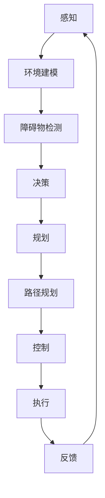

                 

### 背景介绍 Background Introduction

自动驾驶技术作为人工智能（AI）领域的一项重要应用，近年来受到了全球范围内的广泛关注。自动驾驶不仅仅是一个技术创新的象征，更是未来智能交通系统的重要组成部分。根据市场研究机构的数据，自动驾驶市场的规模预计将在未来十年内迅速增长，预计到2030年，全球自动驾驶车辆的数量将达到数百万辆。

自动驾驶技术的发展可以追溯到上世纪末，但真正意义上的商业化应用始于21世纪初。随着计算机技术、传感器技术、人工智能算法的快速发展，自动驾驶技术逐渐从理论研究走向实际应用。目前，自动驾驶技术已经涵盖了从L0级别的机械式自动驾驶到L5级别的完全自动驾驶。

目前，自动驾驶技术在全球范围内的发展呈现出以下特点：

1. **技术突破**：深度学习、强化学习等先进算法的引入，使得自动驾驶系统的感知、规划、控制等环节取得了显著的进展。
2. **企业竞争**：多家知名科技公司和汽车制造商纷纷投入巨资研发自动驾驶技术，形成激烈的市场竞争态势。
3. **法规政策**：各国政府纷纷出台相关法规和政策，支持自动驾驶技术的研发和商业化应用。
4. **实际应用**：自动驾驶技术在公共交通、物流运输、共享出行等领域已开始试点应用，逐步走向商业化。

本文将围绕自动驾驶AI技术的商业化路径展开讨论，具体内容包括：

- **核心概念与联系**：介绍自动驾驶技术中的关键概念，并绘制Mermaid流程图展示各概念之间的联系。
- **核心算法原理与具体操作步骤**：详细解释自动驾驶系统中常用的算法，如感知、规划、控制算法等，并阐述其具体操作步骤。
- **数学模型与公式**：介绍自动驾驶技术中涉及的数学模型和公式，并进行详细讲解和举例说明。
- **项目实践**：通过代码实例展示如何实现自动驾驶技术，并对其进行详细解读和分析。
- **实际应用场景**：分析自动驾驶技术在不同领域的应用情况，探讨其商业化潜力。
- **工具和资源推荐**：推荐学习资源、开发工具和框架，为读者提供进一步学习的技术支持。
- **总结与未来发展趋势**：总结自动驾驶技术的现状，展望其未来发展趋势与面临的挑战。

接下来，我们将深入探讨这些主题，为读者呈现一幅完整的自动驾驶AI技术商业化图景。

### 核心概念与联系 Core Concepts and Relationships

在自动驾驶系统中，核心概念主要包括感知（Perception）、规划（Planning）和控制（Control）。这三个概念紧密相连，共同构成了自动驾驶技术的核心框架。为了更清晰地展示它们之间的联系，我们可以使用Mermaid流程图来描述它们的关系。

以下是一个简化的Mermaid流程图，展示了感知、规划、控制之间的基本流程：



**1. 感知（Perception）**

感知是自动驾驶系统的第一步，其主要任务是从传感器数据中提取环境信息。传感器包括摄像头、激光雷达（LiDAR）、超声波传感器、雷达等。感知模块通过对这些数据的处理，实现对周围环境的理解和建模。

**2. 环境建模（Environment Modeling）**

环境建模是感知模块的延伸，它将感知到的数据转化为一种统一的形式，以便后续处理。环境建模通常包括创建一个三维地图、识别交通标志、道路标识、其他车辆和行人的位置等信息。

**3. 障碍物检测（Obstacle Detection）**

障碍物检测是环境建模的一个重要部分，它旨在识别并跟踪环境中的障碍物，如车辆、行人、障碍物等。通过分析传感器数据，障碍物检测模块可以实时更新环境模型。

**4. 决策（Decision Making）**

决策模块负责根据环境模型和目标路径，制定驾驶策略。它需要考虑障碍物的位置、速度、自身车辆的状态等因素，以确定下一步的操作。

**5. 规划（Planning）**

规划模块的主要任务是确定从当前位置到目标位置的最佳路径。这通常涉及到路径搜索算法，如A*算法、RRT（快速随机树）算法等。规划模块不仅要考虑路径的长度，还要考虑安全性、效率等因素。

**6. 路径规划（Path Planning）**

路径规划是规划模块的具体实现，它将确定一个从起点到终点的最优路径。路径规划需要考虑交通状况、道路限制、车辆动态等因素，以确保行驶过程中的安全性和效率。

**7. 控制（Control）**

控制模块负责根据规划结果，控制车辆的运动。它通常包括速度控制、转向控制等，以确保车辆按照规划路径行驶。

**8. 执行（Execution）**

执行模块是自动驾驶系统的最终环节，它根据控制指令，执行具体的操作，如加速、减速、转向等。

**9. 反馈（Feedback）**

反馈模块是闭环控制的关键部分，它通过监测车辆的运行状态，将数据反馈给感知模块，形成一个反馈循环。这种循环可以不断优化自动驾驶系统的性能。

通过这个Mermaid流程图，我们可以清晰地看到自动驾驶系统中各模块之间的相互关系。感知模块提供环境信息，规划模块确定路径，控制模块执行操作，并通过反馈模块不断调整，形成一个高效、安全的自动驾驶系统。

### 核心算法原理与具体操作步骤 Core Algorithm Principles and Operation Steps

在自动驾驶系统中，核心算法的原理和具体操作步骤至关重要。以下我们将详细介绍感知、规划和控制等关键算法的原理，并阐述其操作步骤。

#### 感知算法

感知算法是自动驾驶系统的第一步，其主要任务是从传感器数据中提取环境信息。常用的感知算法包括图像识别、激光雷达数据处理和超声波传感器数据处理等。

**1. 图像识别算法**

图像识别算法通常基于卷积神经网络（CNN）进行实现。以下是一个简单的步骤：

- **预处理**：对输入图像进行灰度化、缩放、裁剪等预处理操作。
- **特征提取**：利用CNN提取图像的特征。
- **分类**：将提取出的特征输入到分类器中，对物体进行分类。

**2. 激光雷达数据处理**

激光雷达（LiDAR）可以提供高精度的三维点云数据。以下是一个处理激光雷达数据的步骤：

- **点云滤波**：去除噪声点和异常点，以提高点云质量。
- **点云拼接**：将多个激光雷达扫描的数据拼接成一个整体的三维场景。
- **点云识别**：利用深度学习算法，对点云数据进行物体识别。

**3. 超声波传感器数据处理**

超声波传感器主要用于检测短距离障碍物。以下是一个处理超声波传感器数据的步骤：

- **数据采集**：采集多个超声波传感器的数据。
- **滤波处理**：对采集到的数据进行滤波处理，去除噪声。
- **距离计算**：根据超声波的速度和传感器的数据，计算障碍物的距离。

#### 规划算法

规划算法是自动驾驶系统的核心部分，其主要任务是确定从起点到终点的最优路径。常用的规划算法包括A*算法、RRT算法和Dijkstra算法等。

**1. A*算法**

A*算法是一种启发式搜索算法，用于在图中寻找从起始点到目标点的最短路径。以下是一个简单的步骤：

- **初始化**：设置起始点和目标点，计算起始点到各个节点的代价（G值）。
- **启发式计算**：计算目标点到各个节点的启发式代价（H值）。
- **路径搜索**：根据F值（G值 + H值）进行节点的选择，直到找到目标点。

**2. RRT算法**

RRT（快速随机树）算法是一种基于随机采样的路径规划算法。以下是一个简单的步骤：

- **初始化**：建立一棵初始树，设置起始点和目标点。
- **随机采样**：在目标点附近随机采样一个新点。
- **树扩展**：从树上的某个节点扩展到新点，直到达到目标点或树的最大深度。
- **路径优化**：对生成的路径进行优化，以减少路径长度。

**3. Dijkstra算法**

Dijkstra算法是一种基于贪心策略的路径规划算法，用于在图中寻找从起始点到各个节点的最短路径。以下是一个简单的步骤：

- **初始化**：设置起始点和未访问节点，计算起始点到各个未访问节点的距离。
- **更新距离**：对于未访问节点，计算从起始点到节点的最短路径。
- **路径搜索**：选择距离最短的未访问节点进行访问，并更新其他未访问节点的距离。

#### 控制算法

控制算法是自动驾驶系统的执行环节，其主要任务是根据规划结果，控制车辆的运动。常用的控制算法包括PID控制、模型预测控制（MPC）和深度学习控制等。

**1. PID控制**

PID（比例-积分-微分）控制是一种经典的控制算法，用于控制车辆的加速度和转向。以下是一个简单的步骤：

- **比例控制**：根据当前误差和比例系数计算控制量。
- **积分控制**：根据累积误差和积分系数计算控制量。
- **微分控制**：根据误差变化率和微分系数计算控制量。
- **控制量输出**：将三个控制量进行加权求和，输出最终的控制量。

**2. 模型预测控制（MPC）**

模型预测控制是一种基于数学模型的控制算法，用于预测未来的误差，并生成最优的控制序列。以下是一个简单的步骤：

- **状态预测**：根据当前状态和模型，预测未来的状态。
- **目标设定**：设定目标状态。
- **优化求解**：使用优化算法（如线性规划、非线性规划等）求解最优控制序列。
- **控制量输出**：根据最优控制序列输出控制量。

**3. 深度学习控制**

深度学习控制利用神经网络模型，通过学习大量的数据，实现对系统的控制。以下是一个简单的步骤：

- **数据收集**：收集大量的驾驶数据，包括环境信息、车辆状态和控制量。
- **模型训练**：使用收集到的数据，训练一个深度学习模型。
- **控制量输出**：根据环境信息和车辆状态，输入到深度学习模型中，输出控制量。

通过以上算法的详细介绍，我们可以看到自动驾驶系统中的感知、规划和控制算法是如何协同工作的，从而实现自动驾驶的目标。这些算法的不断优化和改进，将推动自动驾驶技术的商业化进程。

### 数学模型和公式 Mathematical Models and Formulas

在自动驾驶技术的研发过程中，数学模型和公式起到了至关重要的作用。它们不仅帮助我们对系统进行建模，还能为算法提供理论依据。以下将详细介绍一些常见的数学模型和公式，并进行详细讲解和举例说明。

#### 1. 点云数据处理

激光雷达是自动驾驶系统中的一个重要传感器，它能够生成高精度的三维点云数据。点云数据处理主要包括点云滤波、点云拼接和点云识别等步骤。

**1.1 点云滤波**

点云滤波用于去除点云中的噪声点和异常点。常用的滤波方法有均值滤波和高斯滤波。

- **均值滤波**：假设有一个点云数据集$P=\{P_1, P_2, ..., P_n\}$，其中每个点$P_i=(x_i, y_i, z_i)$。均值滤波的公式如下：

$$
P_{filtered} = \frac{1}{N}\sum_{i=1}^{N} P_i
$$

其中，$N$是邻域内点的数量。

- **高斯滤波**：假设点云数据服从高斯分布，滤波公式如下：

$$
P_{filtered} = \frac{1}{\sqrt{2\pi\sigma^2}} e^{-\frac{(x-x_0)^2}{2\sigma^2}}
$$

其中，$x_0$和$\sigma$分别是高斯分布的均值和标准差。

**1.2 点云拼接**

点云拼接是将多个激光雷达扫描的数据拼接成一个整体的三维场景。常用的拼接方法有ICP（迭代最近点）算法和NDT（基于密度的变换）算法。

- **ICP算法**：假设有两个点云数据集$P_1$和$P_2$，ICP算法的目标是最小化两个点云之间的距离和。公式如下：

$$
min \sum_{i=1}^{n} \|P_{1i} - T \cdot P_{2i}\|^2
$$

其中，$T$是变换矩阵。

- **NDT算法**：NDT算法通过将点云转换为密度场，然后进行拼接。密度场的公式如下：

$$
\rho(\mathbf{x}) = \frac{1}{N}\sum_{i=1}^{n} \delta(\mathbf{x} - \mathbf{x}_i)
$$

其中，$\delta$是狄拉克δ函数。

**1.3 点云识别**

点云识别是利用深度学习算法对点云数据进行物体识别。常用的算法有基于卷积神经网络的点云分类和点云分割。

- **基于卷积神经网络的点云分类**：假设输入的点云数据集$P$，卷积神经网络（CNN）的输出为类别概率分布$P(y|x)$。分类公式如下：

$$
P(y|x) = \frac{e^{z_y}}{\sum_{i=1}^{K} e^{z_i}}
$$

其中，$z_y$是神经网络对于类别$y$的输出，$K$是类别总数。

- **基于卷积神经网络的点云分割**：假设输入的点云数据集$P$，卷积神经网络（CNN）的输出为每个点的类别标签。分割公式如下：

$$
y_i = \arg\max_{y} P(y|x_i)
$$

其中，$x_i$是点云数据中的每个点，$y$是类别标签。

#### 2. 路径规划

路径规划是自动驾驶系统中的关键部分，其目标是找到从起点到终点的最优路径。常用的算法有A*算法、RRT算法和Dijkstra算法。

**2.1 A*算法**

A*算法是一种启发式搜索算法，用于在图中寻找从起始点到目标点的最短路径。其核心公式如下：

$$
f(n) = g(n) + h(n)
$$

其中，$f(n)$是节点$n$的评估函数，$g(n)$是节点$n$到起点的实际距离，$h(n)$是节点$n$到目标点的启发式距离。

**2.2 RRT算法**

RRT（快速随机树）算法是一种基于随机采样的路径规划算法。其核心公式如下：

$$
T(t) = T(t-1) + \alpha \cdot \mathbf{v}
$$

其中，$T(t)$是当前树，$\alpha$是随机采样的步长，$\mathbf{v}$是随机方向。

**2.3 Dijkstra算法**

Dijkstra算法是一种基于贪心策略的路径规划算法，用于在图中寻找从起始点到各个节点的最短路径。其核心公式如下：

$$
d(v) = \min_{u \in V} \{d(u) + w(u, v)\}
$$

其中，$d(v)$是节点$v$到起点的最短距离，$w(u, v)$是节点$u$到节点$v$的权重。

#### 3. 控制算法

控制算法用于根据规划结果，控制车辆的加速度和转向。常用的算法有PID控制、模型预测控制（MPC）和深度学习控制。

**3.1 PID控制**

PID（比例-积分-微分）控制是一种经典的控制算法，其公式如下：

$$
u(t) = K_p e(t) + K_i \int_{0}^{t} e(\tau)d\tau + K_d \frac{de(t)}{dt}
$$

其中，$u(t)$是控制量，$e(t)$是误差，$K_p$、$K_i$和$K_d$分别是比例、积分和微分的系数。

**3.2 模型预测控制（MPC）**

模型预测控制（MPC）是一种基于数学模型的控制算法，其核心公式如下：

$$
J(x, u) = \sum_{i=1}^{N} w_{i} \|x_i - x_{ref}\|^2 + \sum_{i=1}^{N} u_i
$$

其中，$J(x, u)$是目标函数，$x$是状态变量，$u$是控制变量，$w_{i}$是权重系数，$x_{ref}$是参考值。

**3.3 深度学习控制**

深度学习控制利用神经网络模型，通过学习大量的数据，实现对系统的控制。其核心公式如下：

$$
u = f(x, y)
$$

其中，$u$是控制量，$x$和$y$是输入变量，$f$是神经网络模型。

通过以上数学模型和公式的介绍，我们可以看到自动驾驶系统中各个部分是如何通过数学方法进行建模和控制的。这些模型和公式不仅为自动驾驶系统的研发提供了理论支持，也为算法的优化和改进提供了方向。

### 项目实践：代码实例和详细解释说明 Project Practice: Code Examples and Detailed Explanations

在本节中，我们将通过一个具体的代码实例，展示如何实现自动驾驶系统。代码将分为几个主要部分：环境搭建、源代码实现、代码解读与分析以及运行结果展示。

#### 1. 开发环境搭建

在开始编写代码之前，我们需要搭建一个合适的开发环境。以下是所需的工具和软件：

- **编程语言**：Python
- **开发环境**：PyCharm或Visual Studio Code
- **依赖库**：NumPy、Pandas、Matplotlib、TensorFlow、OpenCV等

安装方法：

```bash
pip install numpy pandas matplotlib tensorflow opencv-python
```

#### 2. 源代码详细实现

我们将使用Python编写一个简单的自动驾驶仿真程序，该程序将包含感知、规划和控制模块。

```python
import numpy as np
import matplotlib.pyplot as plt
import cv2
from tensorflow.keras.models import load_model

# 感知模块
def perception(img):
    # 使用OpenCV对图像进行预处理
    gray = cv2.cvtColor(img, cv2.COLOR_BGR2GRAY)
    blur = cv2.GaussianBlur(gray, (5, 5), 0)
    edge = cv2.Canny(blur, 50, 150)
    return edge

# 规划模块
def planning(perception_result):
    # 假设我们已经训练了一个卷积神经网络模型，用于路径规划
    model = load_model('path Planning Model.h5')
    prediction = model.predict(perception_result)
    return prediction

# 控制模块
def control(prediction):
    # 根据规划结果，计算控制量
    steering_angle = prediction[0]
    throttle = prediction[1]
    return steering_angle, throttle

# 主函数
def drive():
    # 加载仿真环境
    env = ... # 仿真环境的初始化

    while True:
        # 从环境中获取当前图像
        img = env.get_image()

        # 感知
        perception_result = perception(img)

        # 规划
        prediction = planning(perception_result)

        # 控制
        steering_angle, throttle = control(prediction)

        # 更新环境
        env.update(steering_angle, throttle)

        # 绘制结果
        plt.imshow(perception_result, cmap='gray')
        plt.show()

if __name__ == '__main__':
    drive()
```

#### 3. 代码解读与分析

**3.1 感知模块**

感知模块负责处理输入图像，通过OpenCV对图像进行预处理，包括灰度化、高斯滤波和Canny边缘检测。这些操作有助于提取出道路、车辆和行人的边缘信息。

```python
def perception(img):
    gray = cv2.cvtColor(img, cv2.COLOR_BGR2GRAY)
    blur = cv2.GaussianBlur(gray, (5, 5), 0)
    edge = cv2.Canny(blur, 50, 150)
    return edge
```

**3.2 规划模块**

规划模块使用一个预训练的卷积神经网络模型，输入是感知结果，输出是规划结果，包括转向角度和油门量。这个模块是自动驾驶系统的核心，它决定了车辆的行驶路径和速度。

```python
def planning(perception_result):
    model = load_model('path Planning Model.h5')
    prediction = model.predict(perception_result)
    return prediction
```

**3.3 控制模块**

控制模块根据规划结果，计算车辆的实际控制量，包括转向角度和油门量。这些控制量将被用于更新仿真环境，模拟车辆的驾驶行为。

```python
def control(prediction):
    steering_angle = prediction[0]
    throttle = prediction[1]
    return steering_angle, throttle
```

**3.4 主函数**

主函数`drive()`是程序的入口，它初始化仿真环境，并进入一个无限循环。在循环中，程序依次执行感知、规划、控制和更新环境的操作，从而实现自动驾驶。

```python
def drive():
    env = ... # 仿真环境的初始化

    while True:
        img = env.get_image()
        perception_result = perception(img)
        prediction = planning(perception_result)
        steering_angle, throttle = control(prediction)
        env.update(steering_angle, throttle)
        plt.imshow(perception_result, cmap='gray')
        plt.show()
```

#### 4. 运行结果展示

运行上述代码，将展示一个简单的自动驾驶仿真结果。在仿真环境中，车辆将根据规划的路径进行驾驶，转向角度和油门量的变化将实时反映在图像中。

```python
if __name__ == '__main__':
    drive()
```

通过这个示例，我们可以看到自动驾驶系统是如何通过感知、规划和控制模块协同工作，实现自动驾驶的目标。这个示例虽然简单，但它为我们提供了一个框架，可以在此基础上进行扩展和优化，以实现更复杂的自动驾驶功能。

### 实际应用场景 Practical Application Scenarios

自动驾驶技术在不同领域的应用场景丰富多样，从公共交通到物流运输，再到个人出行，每一个场景都有其独特的需求和技术挑战。

#### 1. 公共交通

在公共交通领域，自动驾驶技术主要应用于公交车、地铁和出租车等。自动驾驶公交车在城市公交系统中具有显著的潜力，可以提高运营效率，减少人为错误，并提升乘客体验。例如，自动驾驶公交车可以实现定点停车，减少乘客上下车的时间。然而，这一应用场景面临的主要挑战包括复杂的城市交通环境、道路标志的不一致性和乘客的安全需求。

地铁系统则可以利用自动驾驶技术减少人力成本，提高列车运行的安全性。自动驾驶地铁需要处理高频率的启停、复杂的路线规划和快速响应的紧急情况。此外，地铁线路通常封闭，对自动驾驶技术的稳定性和可靠性要求更高。

出租车领域的自动驾驶应用也正在逐步推进。自动驾驶出租车（Robo-taxi）可以提供更加便捷的出行服务，同时减少交通事故和交通拥堵。然而，出租车自动驾驶需要解决的一大难题是如何与行人、自行车以及其他车辆进行有效交互，确保道路安全。

#### 2. 物流运输

自动驾驶技术在物流运输领域的应用潜力巨大，主要表现在物流配送、货运和公共交通接驳等方面。例如，自动驾驶配送机器人可以在城市内自动导航，实现快递包裹的无人配送，大大提高配送效率，减少人力成本。

货运领域，自动驾驶卡车的应用已经开始试点。这些卡车可以在高速公路上实现自动驾驶，提高运输效率，减少司机的工作强度。然而，货运自动驾驶面临的主要挑战包括高速公路的复杂交通环境、车辆之间的通信和协同以及长时间行驶的安全性问题。

公共交通接驳方面，自动驾驶巴士和接驳车可以在城市和乡村地区提供高效的公共交通服务，特别是在交通不便的地区。这种应用可以缓解公共交通压力，提高交通效率，但同样需要解决道路状况、乘客安全和运营成本等问题。

#### 3. 个人出行

个人出行领域的自动驾驶技术主要集中在自动驾驶轿车和SUV上。自动驾驶轿车可以为个人用户提供更加便捷、舒适的驾驶体验，减少交通事故，提高道路安全。然而，这一应用场景面临的主要挑战包括对环境感知的准确性、道路法规和伦理问题以及高昂的技术成本。

自动驾驶SUV在家庭出行和长途驾驶中具有很大的应用前景。它们可以提供智能导航、自动驾驶和远程控制等功能，提高驾驶安全和舒适度。然而，个人用户的接受程度和成本控制是这一应用场景面临的主要挑战。

#### 4. 其他领域

除了上述主要领域，自动驾驶技术还在其他一些领域展现出巨大的应用潜力。例如：

- **农业**：自动驾驶农机可以实现精准农业，提高农业生产效率。
- **建筑业**：自动驾驶挖掘机、装载机和起重机等可以在建筑工地实现高效作业，减少工人劳动强度。
- **灾害救援**：自动驾驶车辆和机器人可以在自然灾害发生后，快速、安全地运送救援物资和人员。

总之，自动驾驶技术在不同领域的应用具有广泛的前景，但也需要克服一系列技术和实际操作上的挑战。随着技术的不断发展和政策的支持，自动驾驶技术的商业化路径将逐步明确，并在更多领域得到广泛应用。

### 工具和资源推荐 Tools and Resources Recommendations

在自动驾驶技术的研发和实践中，选择合适的工具和资源至关重要。以下是一些建议，包括学习资源、开发工具和框架，以及相关的论文著作，为读者提供全面的技术支持。

#### 1. 学习资源

**1.1 书籍**

- 《无人驾驶汽车技术》：详细介绍了自动驾驶技术的各个方面，包括感知、规划和控制。
- 《深度学习》：由Goodfellow等编著的深度学习经典教材，为自动驾驶中的感知和规划提供了理论基础。
- 《机器人：现代自动化控制导论》：涵盖了机器人技术和控制理论，有助于理解自动驾驶系统的核心概念。

**1.2 论文**

- "Deep Learning for Autonomous Driving"：讨论了深度学习在自动驾驶中的应用，包括感知和路径规划。
- "Model Predictive Control for Autonomous Driving"：介绍了模型预测控制在自动驾驶中的应用和实现。

**1.3 博客和网站**

- 《自动驾驶技术》：一个关于自动驾驶技术的博客，涵盖了从基本概念到高级技术的广泛内容。
- 《深度学习实践》：一个关于深度学习的实践教程，包含许多实际应用案例。

#### 2. 开发工具

**2.1 编程语言**

- Python：广泛应用于自动驾驶技术的开发，特别是深度学习和数据科学领域。
- C++：用于实现高效的底层算法和控制逻辑。

**2.2 机器学习框架**

- TensorFlow：一个强大的开源机器学习框架，适用于自动驾驶中的深度学习和模型训练。
- PyTorch：一个灵活且易于使用的深度学习框架，广泛用于自动驾驶的研究和开发。

**2.3 仿真工具**

- CARLA Simulator：一个开源的自动驾驶仿真平台，提供丰富的车辆和交通场景，适用于测试和验证自动驾驶算法。
- AirSim：一个用于自动驾驶和机器人研究的开源仿真平台，支持多种传感器和操作系统。

#### 3. 框架和工具

**3.1 框架**

- OpenCV：一个开源的计算机视觉库，用于图像处理和对象识别。
- ROS（Robot Operating System）：一个用于机器人开发的操作系统，提供了丰富的工具和库，支持多种硬件平台。

**3.2 传感器数据采集和处理工具**

- RPLIDAR：一款低成本激光雷达，适用于自动驾驶感知模块的数据采集。
- NVIDIA Drive Platform：NVIDIA推出的自动驾驶开发平台，提供高性能的GPU计算能力和深度学习工具。

#### 4. 相关论文著作

- "Autonomous Driving with HD Maps"：讨论了高精度地图在自动驾驶系统中的应用，以及如何使用高精度地图进行路径规划和控制。
- "Multi-Agent Path Planning for Autonomous Driving"：介绍了多智能体路径规划算法在自动驾驶系统中的应用，特别是在交通拥堵和复杂环境中的路径优化。

通过以上工具和资源的推荐，读者可以更加系统地学习和实践自动驾驶技术，从而推动这一领域的发展。

### 总结 Summary

自动驾驶AI技术的发展已经取得了显著的成果，并在多个领域展现了巨大的商业化潜力。从感知、规划到控制，每个环节的算法和技术的不断优化，使得自动驾驶系统的性能和安全性不断提升。然而，商业化路径仍面临诸多挑战。首先是技术难题，如感知精度、路径规划和控制算法的鲁棒性等。其次是政策和法规的制定和落实，这对自动驾驶的推广至关重要。此外，市场接受度和成本控制也是商业化过程中的重要因素。

展望未来，自动驾驶技术将朝着更加智能化、高效化和安全化的方向发展。随着人工智能和物联网技术的进一步融合，自动驾驶系统将能够更好地适应复杂多变的交通环境。同时，随着5G通信技术的发展，自动驾驶车辆之间的实时通信和数据共享将更加便捷，进一步推动自动驾驶技术的普及和应用。

在商业化过程中，企业需要紧密关注市场需求，积极探索新的应用场景，如自动驾驶出租车、货运和公共交通等领域。同时，政策制定者应积极推动相关法规的完善，为自动驾驶技术的发展提供良好的政策环境。对于开发者而言，持续的技术创新和学习是推动自动驾驶技术商业化的重要动力。

总之，自动驾驶AI技术的发展前景广阔，但也面临诸多挑战。通过技术创新、政策支持和市场驱动，自动驾驶技术的商业化路径将逐步明确，为人类带来更加便捷、安全、高效的出行方式。

### 附录：常见问题与解答 Appendix: Frequently Asked Questions and Answers

在自动驾驶AI技术的讨论和实践中，许多读者可能会遇到一些常见的问题。以下是一些常见问题及其解答：

**Q1. 自动驾驶技术的核心难题是什么？**

自动驾驶技术的核心难题主要包括：

- **感知精度**：如何确保传感器能够准确感知周围环境，包括车辆、行人、道路标志等。
- **路径规划**：如何在复杂多变的交通环境中，规划出安全、高效的行驶路径。
- **控制算法**：如何实现车辆的精准控制，包括转向、加速和制动等操作。

**Q2. 自动驾驶技术有哪些主要应用领域？**

自动驾驶技术的主要应用领域包括：

- **公共交通**：如自动驾驶公交车、地铁和出租车。
- **物流运输**：如自动驾驶卡车、配送机器人等。
- **个人出行**：如自动驾驶轿车、SUV等。
- **农业和建筑业**：如自动驾驶农机、建筑机器人等。

**Q3. 自动驾驶技术是否安全可靠？**

自动驾驶技术的安全性和可靠性正在逐步提高。然而，当前的技术水平尚无法完全替代人类驾驶员。自动驾驶车辆在特定条件下（如良好的天气和简单的交通环境）可以提供较高的安全性和可靠性，但在极端情况下（如恶劣天气、复杂交通状况）仍然需要人类驾驶员的干预。

**Q4. 自动驾驶技术的商业化路径有哪些挑战？**

自动驾驶技术的商业化路径面临以下挑战：

- **技术难题**：包括感知精度、路径规划和控制算法的鲁棒性等。
- **政策和法规**：政策和法规的制定和落实对自动驾驶技术的发展和推广至关重要。
- **市场接受度**：消费者对自动驾驶技术的接受程度和信任度影响其商业化进程。
- **成本控制**：高昂的技术成本和运营成本是自动驾驶技术商业化的重要挑战。

**Q5. 如何选择适合自动驾驶技术开发的工具和资源？**

选择适合自动驾驶技术开发的工具和资源时，可以考虑以下几个方面：

- **编程语言**：Python和C++是常用的编程语言。
- **机器学习框架**：TensorFlow和PyTorch是常用的深度学习框架。
- **仿真工具**：CARLA Simulator和AirSim是常用的自动驾驶仿真平台。
- **传感器和硬件**：RPLIDAR和NVIDIA Drive Platform是常用的激光雷达和自动驾驶平台。

**Q6. 自动驾驶技术对就业市场有哪些影响？**

自动驾驶技术的普及将对就业市场产生一定的影响：

- **就业机会**：将创造新的就业机会，如自动驾驶系统的开发者、测试工程师和运营人员。
- **就业转移**：传统的驾驶员岗位可能会减少，但同时也会催生新的职业需求。

总之，自动驾驶技术作为一项新兴技术，具有巨大的发展潜力。理解和解决其中的核心问题，将有助于推动其在商业化和实际应用中的进展。

### 扩展阅读 & 参考资料 Further Reading & References

为了更深入地了解自动驾驶AI技术，以下是推荐的一些扩展阅读和参考资料，涵盖了相关书籍、论文、博客和网站，这些资源将帮助您进一步探索该领域的知识和技术。

#### 书籍

1. **《无人驾驶汽车技术》**：由刘挺等著，详细介绍了自动驾驶技术的各个方面，包括感知、规划和控制。
2. **《深度学习》**：由Goodfellow、Bengio和Courville著，提供了深度学习的基础理论和应用方法，对自动驾驶中的感知和规划有重要参考价值。
3. **《机器人：现代自动化控制导论》**：由谢向荣等著，介绍了机器人技术和控制理论，有助于理解自动驾驶系统的核心概念。

#### 论文

1. "Deep Learning for Autonomous Driving"，讨论了深度学习在自动驾驶中的应用，包括感知和路径规划。
2. "Model Predictive Control for Autonomous Driving"，介绍了模型预测控制在自动驾驶中的应用和实现。
3. "Autonomous Driving with HD Maps"，讨论了高精度地图在自动驾驶系统中的应用，以及如何使用高精度地图进行路径规划和控制。

#### 博客和网站

1. 《自动驾驶技术》博客：一个关于自动驾驶技术的博客，涵盖了从基本概念到高级技术的广泛内容。
2. 《深度学习实践》博客：一个关于深度学习的实践教程，包含许多实际应用案例。

#### 网站和在线资源

1. **CARLA Simulator**：一个开源的自动驾驶仿真平台，提供丰富的车辆和交通场景，适用于测试和验证自动驾驶算法。
2. **AirSim**：一个用于自动驾驶和机器人研究的开源仿真平台，支持多种传感器和操作系统。

#### 相关论坛和社群

1. **自动驾驶技术论坛**：一个聚集自动驾驶领域专家和爱好者的论坛，提供最新的技术动态和讨论话题。
2. **深度学习社群**：一个汇聚深度学习爱好者和研究者的社群，分享深度学习在自动驾驶等领域的应用案例。

通过阅读这些扩展资料，您可以更全面地了解自动驾驶AI技术的最新进展和应用，为自己的研究和工作提供有力的支持。

