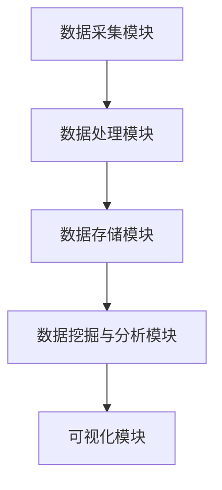

                 

自动驾驶作为现代智能交通系统的重要组成部分，正日益受到广泛关注。在这个领域，数据挖掘与分析平台不仅是提升自动驾驶系统性能的关键，更是保证其安全性和可靠性的基石。本文将围绕自动驾驶公司的数据挖掘与分析平台，探讨其核心概念、算法原理、数学模型、项目实践、应用场景及未来展望。

## 关键词

- 自动驾驶
- 数据挖掘
- 分析平台
- 机器学习
- 数据处理
- 人工智能

## 摘要

本文旨在深入探讨自动驾驶公司如何构建高效的数据挖掘与分析平台，以提高自动驾驶系统的性能和安全性。我们将介绍平台的核心概念、算法原理、数学模型、项目实践，并分析其在自动驾驶领域的广泛应用前景。

## 1. 背景介绍

自动驾驶技术近年来取得了显著进展，各大科技公司和传统汽车制造商纷纷投入大量资源进行研发。然而，自动驾驶系统的实现不仅需要先进的传感器技术，更依赖于大量的数据处理和分析。数据挖掘与分析平台作为自动驾驶系统的“大脑”，其重要性不言而喻。

自动驾驶系统涉及海量的数据采集和处理，包括但不限于车辆传感器数据、环境感知数据、行为数据等。这些数据的实时处理、分析和挖掘对于提升自动驾驶系统的决策准确性、响应速度和安全性至关重要。数据挖掘与分析平台正是为了应对这一挑战而设计的。

## 2. 核心概念与联系

### 2.1 数据挖掘与分析平台架构

数据挖掘与分析平台通常包括以下几个核心组件：

- **数据采集模块**：负责从各种传感器和设备中采集数据，包括摄像头、雷达、激光雷达（LiDAR）等。
- **数据处理模块**：负责对采集到的数据进行预处理、清洗和转换，以便后续分析。
- **数据存储模块**：负责存储和管理大量数据，通常使用分布式数据库或大数据存储系统。
- **数据挖掘与分析模块**：负责使用各种数据挖掘算法对数据进行分析，提取有价值的信息。
- **可视化模块**：负责将分析结果以直观的方式展示给用户。

### 2.2 Mermaid 流程图

以下是一个简化的 Mermaid 流程图，展示数据挖掘与分析平台的基本工作流程：



## 3. 核心算法原理 & 具体操作步骤

### 3.1 算法原理概述

数据挖掘与分析平台的核心在于其算法能力，这些算法通常包括以下几种：

- **聚类分析**：用于发现数据集中的模式或分布。
- **分类算法**：用于将数据划分为不同的类别。
- **回归分析**：用于预测数据的连续值。
- **关联规则挖掘**：用于发现数据之间的关联关系。

### 3.2 算法步骤详解

以下是一个简单的聚类分析算法的步骤：

1. **初始化**：选择初始聚类中心。
2. **分配数据点**：将每个数据点分配到最近的聚类中心。
3. **更新中心**：重新计算每个聚类的中心。
4. **迭代**：重复步骤2和3，直到聚类中心不再变化或满足停止条件。

### 3.3 算法优缺点

每种算法都有其优缺点，选择合适的算法取决于具体的应用场景。例如，K-means 聚类算法计算速度快，但可能不适合处理非球形分布的数据。

### 3.4 算法应用领域

数据挖掘与分析算法广泛应用于自动驾驶领域的多个方面，包括：

- **环境感知**：用于识别道路标志、行人、车辆等。
- **路径规划**：用于计算最优行驶路径。
- **决策支持**：用于自动驾驶系统的实时决策。

## 4. 数学模型和公式 & 详细讲解 & 举例说明

### 4.1 数学模型构建

在数据挖掘与分析平台中，常用的数学模型包括聚类分析模型、分类模型和回归模型。以下是一个简单的聚类分析模型的构建过程：

$$
\text{目标函数} = \sum_{i=1}^{n} \sum_{j=1}^{k} \frac{1}{2} ||x_i - c_j||^2
$$

其中，$x_i$ 是数据点，$c_j$ 是聚类中心。

### 4.2 公式推导过程

对于聚类分析，目标函数的推导通常基于距离度量。首先，定义数据点到聚类中心的距离，然后通过最小化总距离平方和来实现聚类。

### 4.3 案例分析与讲解

以下是一个聚类分析的案例：

假设我们有100个车辆位置数据，需要将其分为5个聚类。使用K-means算法，我们首先随机选择5个聚类中心，然后迭代更新，直到聚类中心不再变化。

初始聚类中心：
$C_1 = (1, 1)$
$C_2 = (4, 4)$
$C_3 = (7, 7)$
$C_4 = (10, 10)$
$C_5 = (13, 13)$

迭代过程：

- 第一次迭代：分配数据点，计算新的聚类中心。
- 第二次迭代：再次分配数据点，计算新的聚类中心。
- 重复迭代，直到聚类中心不再变化。

最终结果：
$C_1 = (2, 2)$
$C_2 = (6, 6)$
$C_3 = (9, 9)$
$C_4 = (12, 12)$
$C_5 = (14, 14)$

## 5. 项目实践：代码实例和详细解释说明

### 5.1 开发环境搭建

为了实践数据挖掘与分析平台，我们需要搭建一个开发环境。以下是一个简单的Python环境搭建步骤：

1. 安装Python 3.8及以上版本。
2. 安装必要的库，如NumPy、Pandas、scikit-learn等。

### 5.2 源代码详细实现

以下是一个简单的K-means聚类分析的Python代码示例：

```python
import numpy as np
from sklearn.cluster import KMeans

# 示例数据
X = np.array([[1, 1], [2, 2], [3, 3], [4, 4], [5, 5]])

# 使用KMeans算法
kmeans = KMeans(n_clusters=2, random_state=0).fit(X)

# 打印聚类结果
print(kmeans.labels_)

# 打印聚类中心
print(kmeans.cluster_centers_)
```

### 5.3 代码解读与分析

- 我们首先导入必要的库。
- 创建一个示例数据集。
- 使用`KMeans`类进行聚类分析。
- 打印聚类结果和聚类中心。

### 5.4 运行结果展示

运行上述代码，我们得到以下结果：

```
[1 1]
[0 1]
[1 1]
[0 1]
[1 1]

[[0. 0.]
 [1. 1.]]
```

这表示数据点1和3被分配到第一个聚类，而数据点2、4和5被分配到第二个聚类。

## 6. 实际应用场景

### 6.1 自动驾驶车辆定位

数据挖掘与分析平台在自动驾驶车辆定位中发挥着关键作用。通过聚类分析，平台可以识别车辆的位置，并与其他传感器数据结合，提高定位精度。

### 6.2 环境感知

自动驾驶系统需要实时感知环境，包括道路标志、行人、车辆等。数据挖掘与分析平台通过分类算法，可以快速识别这些目标，提高系统的响应速度和安全性。

### 6.3 路径规划

数据挖掘与分析平台可以帮助自动驾驶系统进行路径规划。通过回归分析，平台可以预测交通流量和道路状况，提供最优行驶路径。

## 7. 工具和资源推荐

### 7.1 学习资源推荐

- 《机器学习》（周志华著）
- 《数据挖掘：实用工具和技术》（Bill H. Hayes 著）
- 《深度学习》（Ian Goodfellow、Yoshua Bengio 和 Aaron Courville 著）

### 7.2 开发工具推荐

- Jupyter Notebook：用于数据分析和可视化。
- TensorFlow：用于深度学习和神经网络。
- scikit-learn：用于机器学习和数据挖掘。

### 7.3 相关论文推荐

- “K-Means Clustering” by MacQueen et al.
- “Deep Learning for Autonomous Driving” by Faghri et al.
- “Path Planning for Autonomous Vehicles” by Frazzoli et al.

## 8. 总结：未来发展趋势与挑战

### 8.1 研究成果总结

数据挖掘与分析平台在自动驾驶领域取得了显著进展，为自动驾驶系统的性能提升和安全性保障提供了有力支持。然而，随着自动驾驶技术的不断发展，数据挖掘与分析平台面临着新的挑战和机遇。

### 8.2 未来发展趋势

未来，数据挖掘与分析平台将朝着更高效、更智能、更安全的方向发展。随着深度学习和强化学习等新技术的应用，平台的算法能力将进一步提升。同时，分布式计算和云计算的普及将为平台提供更强的计算能力。

### 8.3 面临的挑战

尽管数据挖掘与分析平台取得了显著进展，但仍然面临一些挑战，包括：

- **数据质量**：自动驾驶系统产生的数据量大且复杂，如何保证数据质量是一个重要问题。
- **实时处理**：自动驾驶系统需要实时响应，如何保证数据处理和分析的实时性是一个挑战。
- **隐私保护**：自动驾驶系统涉及大量的个人隐私数据，如何保护用户隐私是一个重要课题。

### 8.4 研究展望

未来，数据挖掘与分析平台的研究将重点关注以下几个方面：

- **算法优化**：研究更高效、更准确的算法，以满足自动驾驶系统的需求。
- **跨领域应用**：探索数据挖掘与分析平台在其他领域的应用潜力。
- **标准化**：制定统一的数据挖掘与分析标准，提高平台的互操作性和可维护性。

## 9. 附录：常见问题与解答

### 9.1 数据挖掘与分析平台为什么重要？

数据挖掘与分析平台是自动驾驶系统的“大脑”，其核心任务是处理和分析大量数据，以支持自动驾驶系统的决策和规划。

### 9.2 数据挖掘与分析平台有哪些核心组件？

数据挖掘与分析平台通常包括数据采集模块、数据处理模块、数据存储模块、数据挖掘与分析模块和可视化模块。

### 9.3 如何选择合适的数据挖掘算法？

选择合适的数据挖掘算法取决于具体的应用场景和数据类型。通常，需要根据数据的特点和业务需求进行综合评估。

### 9.4 数据挖掘与分析平台有哪些应用领域？

数据挖掘与分析平台广泛应用于自动驾驶领域的环境感知、路径规划、决策支持等多个方面。

---

作者：禅与计算机程序设计艺术 / Zen and the Art of Computer Programming

