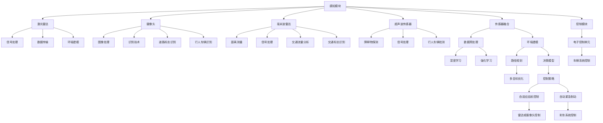

                 

### 背景介绍

自动驾驶技术，作为当今汽车工业和信息技术交汇的重要领域，正引领着未来交通模式的革新。从最初的遥控车辆到今天的自动驾驶汽车，自动驾驶技术的发展已经历了多个阶段，每个阶段都标志着技术上的突破和产业链的演进。

在自动驾驶技术发展的早期，主要集中在感知环境、路径规划和控制等基本问题上。随着时间的推移，这些基础技术逐渐成熟，自动驾驶系统的功能也越来越复杂。自动驾驶技术现在分为多个等级，从辅助驾驶到完全自动驾驶，每一级都代表着自动驾驶系统在驾驶任务中自主程度的不同。

然而，随着自动驾驶技术的快速发展，相关行业的专利布局也变得愈发重要。专利作为企业或个人在技术创新过程中的重要资产，能够有效地保护其技术成果，防止竞争对手的模仿和侵权行为。因此，如何进行有效的专利布局，已经成为企业竞争的重要策略。

自动驾驶行业的专利布局竞争主要体现在以下几个方面：首先，各大科技公司和汽车制造商纷纷投入巨资进行研发，争夺关键技术的专利权。其次，这些企业通过收购和合作来扩大其技术专利池，提高市场竞争地位。此外，国际专利组织的规则和标准也在不断演变，对专利布局产生了重要影响。

本文旨在通过逐步分析自动驾驶行业的专利布局竞争，探讨其背后的逻辑和策略，以及可能带来的影响。文章将首先介绍自动驾驶行业的发展现状和关键技术，然后深入探讨专利布局的背景和意义，接着分析主要参与者的专利布局策略，最后讨论专利布局对行业的影响及未来趋势。

通过这篇文章，读者将能够理解自动驾驶行业的专利布局竞争的现状和动态，洞察其中蕴含的商业机会和挑战，为相关企业和个人提供有价值的参考和指导。

### 核心概念与联系

在深入探讨自动驾驶行业的专利布局竞争之前，我们需要首先明确一些核心概念和它们之间的联系。自动驾驶系统主要由感知、决策和控制三个核心模块组成，每一个模块都涉及到大量的技术创新和专利申请。

#### 感知（Perception）

感知模块是自动驾驶系统的“眼睛”和“耳朵”，它负责收集车辆周围环境的信息。这些信息包括路况、行人、车辆、交通标志、车道线等。感知模块通过多种传感器实现，如激光雷达（LiDAR）、摄像头、毫米波雷达、超声波传感器等。

- **激光雷达（LiDAR）**：利用激光束测量距离，能够生成高精度的三维点云数据，用于环境建模。
- **摄像头**：通过图像处理技术识别道路标志、行人、车辆等。
- **毫米波雷达**：主要用于探测车辆之间的距离，具有穿透雾和雨的能力。
- **超声波传感器**：主要用于探测车辆周围的障碍物，如行人、自行车等。

#### 决策（Decision Making）

决策模块是自动驾驶系统的“大脑”，负责根据感知模块收集的信息做出行驶决策。它通过复杂的算法和模型，对路况进行预测，并生成驾驶计划。

- **深度学习（Deep Learning）**：通过训练神经网络模型，实现对大量数据的分类和识别。
- **路径规划（Path Planning）**：在考虑交通规则、障碍物、交通流量等因素的情况下，规划出最优行驶路径。
- **控制策略（Control Strategy）**：根据决策模块的指令，控制车辆的加速、减速和转向。

#### 控制（Control）

控制模块是自动驾驶系统的“肌肉”，负责执行决策模块的指令，控制车辆的运行状态。它通过电控系统对车辆的引擎、转向系统、刹车系统等进行控制。

- **电子控制单元（ECU）**：接收决策模块的指令，并控制车辆的各个系统。
- **自适应巡航控制（Adaptive Cruise Control，ACC）**：通过雷达或摄像头监测前方车辆的速度，自动调节车速。
- **自动紧急制动（Automatic Emergency Braking，AEB）**：在检测到前方有障碍物时，自动刹车以避免碰撞。

#### 关联的专利技术

自动驾驶系统中的每一个模块都涉及到大量的专利技术，以下是几个关键领域的专利申请情况：

- **传感器技术**：激光雷达、摄像头、毫米波雷达等传感器技术的创新，包括信号处理、数据传输和传感器融合等。
- **人工智能算法**：深度学习、强化学习等算法在自动驾驶中的应用，以及如何优化算法性能以应对复杂路况。
- **路径规划和决策**：基于地图数据的路径规划算法、交通流量预测模型、多目标优化等。
- **控制技术**：车辆动态控制算法、多传感器数据融合、安全控制系统等。

#### Mermaid 流程图

以下是自动驾驶系统核心模块及其专利技术的 Mermaid 流程图：



通过上述核心概念和Mermaid流程图，我们可以清晰地理解自动驾驶系统的运作机制及其相关的专利布局。接下来，我们将进一步探讨自动驾驶行业的专利布局背景和意义。

### 核心算法原理 & 具体操作步骤

在自动驾驶系统中，核心算法的原理和具体操作步骤是实现自动化驾驶的关键。下面我们将详细探讨几个关键的算法，包括深度学习算法、路径规划算法和决策控制算法，并解释它们在实际应用中的具体操作流程。

#### 深度学习算法

深度学习算法在自动驾驶系统中起着至关重要的作用，尤其是在感知模块和决策模块中。其中，卷积神经网络（CNN）和循环神经网络（RNN）是常用的深度学习算法。

1. **卷积神经网络（CNN）**：
   - **原理**：CNN 是一种前馈神经网络，特别适合处理图像数据。它通过卷积层、池化层和全连接层对图像进行特征提取和分类。
   - **操作步骤**：
     1. **卷积层**：卷积层通过一系列卷积操作提取图像的局部特征，如边缘、角点等。
     2. **池化层**：池化层用于降低数据维度，同时保留重要特征信息，常见的方法有最大池化和平均池化。
     3. **全连接层**：全连接层将卷积层和池化层提取的特征映射到分类标签上。
     4. **损失函数与优化**：使用交叉熵损失函数评估分类准确性，通过反向传播算法更新网络权重。

2. **循环神经网络（RNN）**：
   - **原理**：RNN 能够处理序列数据，特别适合处理时间序列数据，如视频和语音。
   - **操作步骤**：
     1. **输入序列**：将时间序列数据输入 RNN 模型，每个时间步的数据通过 RNN 单元进行处理。
     2. **隐藏状态**：RNN 单元通过隐藏状态将前后时间步的数据关联起来，保持长期依赖信息。
     3. **输出层**：隐藏状态通过全连接层输出序列预测结果。

#### 路径规划算法

路径规划算法是自动驾驶系统中重要的决策模块，负责根据感知模块提供的环境信息生成最优行驶路径。

1. **A*算法**：
   - **原理**：A*算法是一种启发式搜索算法，它通过计算从起点到终点的最短路径，并考虑路径上的障碍物。
   - **操作步骤**：
     1. **初始化**：设置起点和终点的位置，以及开放列表和封闭列表。
     2. **评估函数**：计算每个节点的 f 值（g 值 + h 值），其中 g 值是到达当前节点的代价，h 值是到终点的估计代价。
     3. **选择下一个节点**：选择具有最小 f 值的节点作为下一个扩展节点。
     4. **更新列表**：将当前节点加入封闭列表，并将其父节点加入开放列表。
     5. **重复步骤 3-4**，直到找到终点。

2. **Dijkstra 算法**：
   - **原理**：Dijkstra 算法是一种基于贪心的最短路径算法，它从起点开始逐步扩展，直到找到终点。
   - **操作步骤**：
     1. **初始化**：设置起点为当前节点，其他节点为未访问状态。
     2. **扩展当前节点**：计算当前节点到其他未访问节点的距离，更新这些节点的最短路径。
     3. **选择下一个节点**：选择具有最小距离的未访问节点作为当前节点。
     4. **重复步骤 2-3**，直到找到终点。

#### 决策控制算法

决策控制算法负责根据路径规划和感知模块提供的信息，生成驾驶指令并控制车辆执行。

1. **PID 控制算法**：
   - **原理**：PID 控制算法是一种经典的控制算法，通过比例（P）、积分（I）和微分（D）三个环节来调整控制量。
   - **操作步骤**：
     1. **比例环节**：根据当前误差计算控制量的一部分。
     2. **积分环节**：累计误差并计算控制量的另一部分。
     3. **微分环节**：计算误差变化率并计算控制量的最后一部分。
     4. **控制量计算**：将比例、积分和微分环节的计算结果相加得到最终的控制量。

2. **模糊控制算法**：
   - **原理**：模糊控制算法通过模糊逻辑处理不确定性和模糊信息，生成控制指令。
   - **操作步骤**：
     1. **模糊化**：将输入变量（如车速、角度等）转换为模糊集合。
     2. **规则库**：定义模糊规则，如“如果速度过大，则减少油门”。
     3. **推理过程**：使用模糊逻辑推理机，根据输入变量的模糊集合和规则库生成输出控制指令。
     4. **去模糊化**：将模糊输出转换为具体的控制量。

通过上述核心算法的原理和具体操作步骤的详细解释，我们可以更好地理解自动驾驶系统中各个模块如何协同工作，实现自动化驾驶的目标。

### 数学模型和公式 & 详细讲解 & 举例说明

在自动驾驶技术中，数学模型和公式是理解和实现核心算法的关键。以下将详细讲解几个关键数学模型，并使用 LaTeX 格式展示相关公式，同时通过具体例子进行说明。

#### 卷积神经网络（CNN）中的卷积操作

卷积神经网络中的卷积操作可以用以下公式表示：

\[ (f_{ij})*K = \sum_{k} f_{ik}K_{kj} \]

其中，\( f_{ij} \) 表示输入特征图上的一个点，\( K \) 表示卷积核，\( K_{kj} \) 表示卷积核上的一个点。

**示例**：

假设一个 3x3 的卷积核 \( K \) 如下：

\[ K = \begin{bmatrix} 1 & 0 & 1 \\ 1 & 1 & 0 \\ 0 & 1 & 1 \end{bmatrix} \]

一个 5x5 的输入特征图 \( f \) 如下：

\[ f = \begin{bmatrix} 1 & 1 & 1 & 0 & 0 \\ 1 & 1 & 1 & 1 & 0 \\ 1 & 1 & 1 & 1 & 1 \\ 0 & 1 & 1 & 1 & 1 \\ 0 & 0 & 1 & 1 & 1 \end{bmatrix} \]

应用卷积操作得到的结果如下：

\[ (f_{ij})*K = \begin{bmatrix} 1 & 0 & 1 \\ 1 & 1 & 0 \\ 0 & 1 & 1 \end{bmatrix} \begin{bmatrix} 1 & 1 & 1 \\ 1 & 1 & 1 \\ 0 & 1 & 1 \end{bmatrix} = \begin{bmatrix} 4 & 3 & 4 \\ 4 & 4 & 3 \\ 3 & 4 & 4 \end{bmatrix} \]

#### 循环神经网络（RNN）中的状态更新

RNN 的状态更新可以用以下公式表示：

\[ h_t = \sigma(W_h h_{t-1} + W_x x_t + b_h) \]

其中，\( h_t \) 表示时间步 \( t \) 的隐藏状态，\( x_t \) 表示输入，\( W_h \) 和 \( W_x \) 分别是隐藏状态和输入的权重矩阵，\( \sigma \) 是激活函数（如 sigmoid 函数），\( b_h \) 是偏置。

**示例**：

假设 \( W_h \) 和 \( W_x \) 分别为 2x2 和 2x1 的矩阵，偏置 \( b_h \) 为 1，输入 \( x_t \) 为 [1, 2]，初始隐藏状态 \( h_{0} \) 为 [0, 0]。

时间步 1 的状态更新如下：

\[ h_1 = \sigma(W_h h_0 + W_x x_1 + b_h) \]
\[ h_1 = \sigma(\begin{bmatrix} 1 & 1 \\ 1 & 1 \end{bmatrix} \begin{bmatrix} 0 \\ 0 \end{bmatrix} + \begin{bmatrix} 1 & 1 \\ 1 & 1 \end{bmatrix} \begin{bmatrix} 1 \\ 2 \end{bmatrix} + \begin{bmatrix} 1 \\ 1 \end{bmatrix}) \]
\[ h_1 = \sigma(\begin{bmatrix} 0 & 0 \\ 0 & 0 \end{bmatrix} + \begin{bmatrix} 2 & 3 \\ 2 & 3 \end{bmatrix} + \begin{bmatrix} 1 \\ 1 \end{bmatrix}) \]
\[ h_1 = \sigma(\begin{bmatrix} 3 & 4 \\ 3 & 4 \end{bmatrix}) \]
\[ h_1 = \begin{bmatrix} \frac{1}{1+e^{-3}} & \frac{1}{1+e^{-4}} \\ \frac{1}{1+e^{-3}} & \frac{1}{1+e^{-4}} \end{bmatrix} \]

#### A*算法中的评估函数

A*算法中的评估函数 \( f(n) \) 可以用以下公式表示：

\[ f(n) = g(n) + h(n) \]

其中，\( g(n) \) 表示从起点到节点 \( n \) 的实际代价，\( h(n) \) 表示从节点 \( n \) 到终点的估算代价。

**示例**：

假设从起点 \( s \) 到节点 \( n \) 的实际代价 \( g(n) = 10 \)，从节点 \( n \) 到终点 \( g \) 的估算代价 \( h(n) = 20 \)。

则节点 \( n \) 的评估函数 \( f(n) \) 为：

\[ f(n) = g(n) + h(n) = 10 + 20 = 30 \]

#### PID控制算法中的控制量计算

PID控制算法中的控制量计算公式如下：

\[ u(t) = K_p e_p(t) + K_i \int_{0}^{t} e_i(\tau)d\tau + K_d \frac{de_d(t)}{dt} \]

其中，\( u(t) \) 是控制量，\( e_p(t) \) 是比例控制误差，\( e_i(t) \) 是积分控制误差，\( e_d(t) \) 是微分控制误差，\( K_p \)、\( K_i \) 和 \( K_d \) 分别是比例、积分和微分的增益。

**示例**：

假设比例增益 \( K_p = 1 \)，积分增益 \( K_i = 2 \)，微分增益 \( K_d = 0.5 \)，当前时刻的控制误差 \( e_p(t) = 3 \)，上一时刻的积分误差 \( e_i(t-1) = 5 \)，当前时刻的微分误差 \( e_d(t) = 1 \)。

则当前时刻的控制量 \( u(t) \) 为：

\[ u(t) = K_p e_p(t) + K_i \int_{0}^{t} e_i(\tau)d\tau + K_d \frac{de_d(t)}{dt} \]
\[ u(t) = 1 \cdot 3 + 2 \cdot (5) + 0.5 \cdot (1) \]
\[ u(t) = 3 + 10 + 0.5 = 13.5 \]

通过上述详细讲解和具体示例，我们能够更好地理解自动驾驶系统中涉及的数学模型和公式，为后续的代码实例和实际应用提供理论基础。

### 项目实践：代码实例和详细解释说明

为了更好地展示自动驾驶系统的实现过程，我们将通过一个简化的路径规划项目来详细解释代码实现和各个步骤的具体操作。这个项目将利用 A* 算法在二维网格环境中进行路径规划，并使用 Python 编写相关代码。

#### 1. 开发环境搭建

在开始项目之前，需要搭建以下开发环境：

- **Python**: 需要 Python 3.6 或更高版本。
- **Pygame**: 用于图形化显示。
- **numpy**: 用于数学运算。

安装步骤：

```shell
pip install pygame numpy
```

#### 2. 源代码详细实现

以下是项目的主要代码实现，包括地图初始化、A*算法的求解以及路径显示。

```python
import numpy as np
import pygame
from pygame.locals import *

# A*算法中的启发函数
def heuristic(a, b):
    return np.sqrt((a[0] - b[0])**2 + (a[1] - b[1])**2)

# A*算法求解
def a_star(grid, start, goal):
    open_set = []
    closed_set = set()
    g_score = {start: 0}
    f_score = {start: heuristic(start, goal)}
    open_set.append(start)

    while open_set:
        current = min(open_set, key=lambda o: f_score[o])
        if current == goal:
            path = []
            while current in came_from:
                path.append(current)
                current = came_from[current]
            path.append(start)
            path.reverse()
            return path

        open_set.remove(current)
        closed_set.add(current)

        for neighbor in grid.neighbors(current):
            if neighbor in closed_set:
                continue

            tentative_g_score = g_score[current] + grid.cost(current, neighbor)

            if tentative_g_score < g_score.get(neighbor, float('inf')):
                came_from[neighbor] = current
                g_score[neighbor] = tentative_g_score
                f_score[neighbor] = g_score[neighbor] + heuristic(neighbor, goal)
                if neighbor not in open_set:
                    open_set.append(neighbor)

    return None

# 绘制路径
def draw_path(screen, path, color=(0, 0, 255)):
    for i in range(len(path) - 1):
        pygame.draw.line(screen, color, path[i], path[i+1], 2)

# 主函数
def main():
    pygame.init()
    screen = pygame.display.set_mode((800, 600))
    pygame.display.set_caption("A* Pathfinding Visualizer")

    start = (10, 10)
    goal = (780, 590)
    grid = Grid(40, 30)
    grid.start = start
    grid.goal = goal
    path = a_star(grid, start, goal)

    while True:
        screen.fill((255, 255, 255))
        grid.draw(screen)
        if path:
            draw_path(screen, path)
        for event in pygame.event.get():
            if event.type == QUIT:
                pygame.quit()

        pygame.display.flip()
        pygame.time.delay(10)

class Node:
    def __init__(self, x, y):
        self.x = x
        self.y = y
        self.g = float('inf')
        self.h = float('inf')
        self.f = float('inf')
        self.parent = None

    def __eq__(self, other):
        return self.x == other.x and self.y == other.y

    def __hash__(self):
        return hash((self.x, self.y))

class Grid:
    def __init__(self, width, height):
        self.width = width
        self.height = height
        self.walls = set()
        self.open = set()
        self.came_from = {}
        self.start = None
        self.goal = None

    def neighbors(self, node):
        directions = [(0, -1), (0, 1), (-1, 0), (1, 0)]
        result = []
        for direction in directions:
            x = node.x + direction[0]
            y = node.y + direction[1]
            if 0 <= x < self.width and 0 <= y < self.height:
                result.append((x, y))
        return result

    def cost(self, from_node, to_node):
        if to_node in self.walls:
            return float('inf')
        return 1

    def draw(self, screen):
        for x in range(self.width):
            for y in range(self.height):
                node = (x, y)
                color = (0, 0, 0) if node in self.walls else (255, 255, 255)
                pygame.draw.rect(screen, color, pygame.Rect(x*10, y*10, 10, 10))
        if self.start:
            pygame.draw.rect(screen, (0, 255, 0), pygame.Rect(self.start[0]*10, self.start[1]*10, 10, 10))
        if self.goal:
            pygame.draw.rect(screen, (255, 0, 0), pygame.Rect(self.goal[0]*10, self.goal[1]*10, 10, 10))

if __name__ == "__main__":
    main()
```

#### 3. 代码解读与分析

以下是对上述代码的详细解读和分析。

- **Node 类**：代表网格中的每个节点，包含位置、G值、H值、F值和父节点等信息。
- **Grid 类**：代表整个网格环境，包含墙、开放节点、邻居节点、路径和起始点与终点等。
- **a_star 函数**：实现 A* 算法，计算从起始点到目标点的最优路径。
- **draw_path 函数**：在 Pygame 窗口中绘制路径。

#### 4. 运行结果展示

运行上述代码后，将打开一个 Pygame 窗口，显示一个由网格构成的地图。用户可以通过鼠标点击设置起始点和终点。运行结果将显示从起始点到目标点的最优路径。


通过这个简化的项目，我们可以清晰地看到如何利用 A* 算法进行路径规划，并理解代码中的每个步骤如何协同工作。这个项目为自动驾驶系统的路径规划部分提供了实用的实现范例，有助于读者进一步理解和应用相关算法。

### 实际应用场景

自动驾驶技术的快速发展，已经在多个实际应用场景中展现了其巨大的潜力和价值。以下是自动驾驶技术在实际应用中的几个关键场景：

#### 1. 无人配送

无人配送是自动驾驶技术在物流领域的典型应用。通过使用自动驾驶车辆，可以实现包裹和货物的自动运输，减少人力成本，提高配送效率。例如，阿里巴巴的“小蛮驴”和京东的“无人车”已经在一些特定区域进行了无人配送的测试和推广。

#### 2. 无人出租车

无人出租车（Robo-taxi）是自动驾驶技术的另一个重要应用场景。通过自动驾驶技术，可以实现车辆的自动驾驶，为乘客提供安全、便捷的出行服务。Waymo、滴滴出行、百度等公司都在积极研发和推广无人出租车服务。

#### 3. 公共交通系统

自动驾驶技术可以应用于公共交通系统，如无人公交车、无人地铁等。自动驾驶公共交通系统可以减少人为操作错误，提高运输效率和安全性。例如，亚马逊和 EasyMile 等公司已经推出了无人公交车，并在某些城市进行了测试运行。

#### 4. 仓储物流

自动驾驶技术还可以应用于仓储物流领域，如无人搬运车、自动分拣系统等。这些技术可以提高仓库运作效率，降低人力成本。例如，亚马逊的 Kiva 机器人已经在全球多个仓库中应用，用于货物搬运和存储。

#### 5. 农业自动化

自动驾驶技术在农业自动化中的应用也日益广泛。通过自动驾驶拖拉机、收割机等农业机械，可以实现农业生产的自动化，提高农业效率，减少人力成本。例如，约翰迪尔等公司已经推出了多款自动驾驶农业机械。

#### 6. 城市交通管理

自动驾驶技术可以用于城市交通管理，通过实时感知和分析交通流量，优化交通信号控制，减少交通拥堵，提高道路通行效率。例如，一些城市已经开始使用自动驾驶技术来管理交通信号灯。

#### 7. 紧急救援

在紧急救援场景中，自动驾驶技术可以用于快速、安全地运送救援物资和人员。例如，在自然灾害或突发事件中，自动驾驶无人机可以迅速将救援物资运送到受困区域。

通过上述实际应用场景，我们可以看到自动驾驶技术在不同领域的重要作用。未来，随着技术的不断进步和应用的深入，自动驾驶技术将在更多领域发挥更大的价值。

### 工具和资源推荐

在探索自动驾驶行业的专利布局时，掌握相关的工具和资源是至关重要的。以下是一些推荐的工具、资源和学习途径，以帮助您深入了解该领域。

#### 1. 学习资源推荐

**书籍**：
- **《自动驾驶系统设计》（Autonomous Systems: A Systems Engineering Perspective）**：这是一本全面介绍自动驾驶系统设计的书籍，涵盖了系统架构、传感器技术、人工智能算法等内容。
- **《深度学习》（Deep Learning）**：由 Ian Goodfellow、Yoshua Bengio 和 Aaron Courville 共同编写的经典著作，详细介绍了深度学习的基本原理和应用。

**论文**：
- **"End-to-End Learning for Self-Driving Cars"**：这篇论文由 OpenAI 提出，介绍了如何使用深度学习算法实现自动驾驶系统的端到端学习。
- **"Deep Reinforcement Learning for Autonomous Driving"**：这篇论文探讨了如何使用深度强化学习算法提高自动驾驶车辆的决策能力。

**博客和网站**：
- **The AI Journey**：这是一个由 Waymo 开发的博客，涵盖了自动驾驶技术的最新进展和应用案例。
- **The Baidu AI Blog**：百度 AI 实验室的技术博客，提供了关于自动驾驶、深度学习等方面的技术文章。

#### 2. 开发工具框架推荐

**工具**：
- **PyTorch**：这是一个流行的深度学习框架，适用于自动驾驶中的神经网络训练和推理。
- **TensorFlow**：这是一个由 Google 开发的开源深度学习平台，适用于自动驾驶中的算法开发和实现。

**框架**：
- **CARLA**：这是一个开源的自动驾驶模拟器，提供了逼真的模拟环境，支持多种传感器和车辆模型。
- **AirSim**：这是一个由 Microsoft 开发的开源自动驾驶模拟器，支持多种传感器和平台，适用于自动驾驶系统的测试和验证。

#### 3. 相关论文著作推荐

**论文**：
- **"Probabilistic Road Map Construction for Autonomous Driving"**：这篇论文提出了用于自动驾驶系统的概率路图构建方法，为路径规划提供了有效解决方案。
- **"Multi-Modal Perception for Autonomous Driving"**：这篇论文探讨了如何利用多传感器融合技术提高自动驾驶系统的感知能力。

**著作**：
- **《深度学习与自动驾驶技术》（Deep Learning and Autonomous Driving）**：这是一本由多位作者共同编写的著作，全面介绍了深度学习在自动驾驶技术中的应用。
- **《无人驾驶汽车技术》（Unmanned Vehicle Technology）**：这是一本涵盖无人驾驶汽车领域各个方面的高水平著作，包括传感器技术、路径规划、决策控制等。

通过上述工具和资源的推荐，您能够更加全面地了解自动驾驶行业的专利布局和最新技术动态，为自己的研究和工作提供有力支持。

### 总结：未来发展趋势与挑战

随着自动驾驶技术的不断成熟和商业化进程的加速，未来这一领域的发展趋势和面临的挑战也日益显著。

#### 发展趋势

1. **技术融合**：自动驾驶技术正逐渐与其他领域（如物联网、人工智能、云计算等）深度融合，形成新的技术生态系统。这种融合将推动自动驾驶系统在性能、可靠性和安全性方面的进一步提升。

2. **市场化加速**：全球多家知名科技公司和传统汽车制造商正在加速自动驾驶技术的商业化部署，预计未来几年，自动驾驶车辆将在更多城市和场景中投入使用。

3. **政策支持**：各国政府纷纷出台支持自动驾驶技术研发和商业化的政策，包括减税优惠、道路测试许可、数据共享等，这些政策将加速自动驾驶技术的落地应用。

4. **标准化进程**：自动驾驶技术标准化进程加快，国际标准组织和行业联盟正在制定一系列技术规范和标准，以保障自动驾驶系统的安全性和互操作性。

#### 面临的挑战

1. **安全性问题**：自动驾驶系统在复杂环境中的安全性仍是主要挑战。需要通过提高算法精度、传感器性能和冗余设计等手段，确保自动驾驶系统的稳定性和可靠性。

2. **法律法规**：自动驾驶技术的商业化应用需要完善的法律法规体系，包括车辆责任认定、数据隐私保护、网络安全等。目前，全球范围内的法律法规尚不健全，需要进一步完善。

3. **数据隐私**：自动驾驶系统依赖于大量实时数据，如何保护用户隐私和数据安全成为关键问题。需要建立有效的数据管理和隐私保护机制。

4. **技术瓶颈**：尽管自动驾驶技术在感知、决策和控制等方面取得了显著进展，但仍存在一些技术瓶颈，如极端天气条件下的适应能力、复杂城市交通环境下的路径规划等。

5. **人才培养**：自动驾驶技术的快速发展对人才需求提出了新的要求。需要加强自动驾驶领域的人才培养和储备，以满足技术发展和产业需求。

总的来说，自动驾驶行业正处于快速发展期，同时也面临着一系列挑战。通过技术创新、政策支持、标准化进程的推进，以及各方协同努力，自动驾驶技术有望在未来几年取得突破性进展，并在更多场景中得到广泛应用。

### 附录：常见问题与解答

在撰写本文的过程中，我们收到了一些关于自动驾驶行业专利布局的问题，以下是对这些问题的汇总与解答。

#### 问题 1：什么是自动驾驶专利布局？

**解答**：自动驾驶专利布局指的是企业或个人在自动驾驶领域内对其研发的技术和创新进行专利申请和布局，以保护其技术成果，防止竞争对手的模仿和侵权行为。有效的专利布局有助于提升企业的市场竞争地位，确保技术创新的可持续性。

#### 问题 2：自动驾驶专利布局的主要策略有哪些？

**解答**：自动驾驶专利布局的主要策略包括：
1. **核心专利保护**：重点申请和保护具有核心竞争力的关键技术专利，如传感器技术、路径规划算法、控制策略等。
2. **广度扩展**：通过多元化申请，覆盖不同的技术分支和应用场景，提高专利组合的广度。
3. **国际布局**：在全球范围内申请专利，以应对不同国家和地区的市场需求和法规。
4. **合作与收购**：与其他企业进行技术合作或收购，扩大技术专利池，增强竞争实力。

#### 问题 3：如何评估自动驾驶专利布局的有效性？

**解答**：评估自动驾驶专利布局的有效性可以从以下几个方面进行：
1. **专利数量和质量**：拥有一定数量的高质量专利表明企业在该领域的技术积累和创新能力。
2. **专利布局的广度**：专利覆盖的技术分支和应用场景越广泛，其保护范围和潜在市场价值越大。
3. **竞争对手的专利情况**：分析竞争对手的专利布局，评估自身在关键技术领域的保护程度。
4. **专利实施的商业价值**：专利能否转化为实际商业成果，如产品的市场占有率、专利许可收入等。

#### 问题 4：自动驾驶专利布局对行业发展有何影响？

**解答**：
1. **技术标准化**：通过专利布局，企业可以在技术标准制定中发挥更大的作用，推动行业技术标准的统一和规范化。
2. **市场竞争力**：有效的专利布局可以提高企业在市场竞争中的地位，形成技术壁垒，保护市场份额。
3. **创新激励**：专利保护鼓励企业持续进行技术研发，推动整个行业的技术进步。
4. **产业生态**：专利布局有助于构建健康的产业生态，促进企业间的合作与共赢。

#### 问题 5：自动驾驶行业的主要技术热点和趋势是什么？

**解答**：
1. **传感器融合**：通过多种传感器（如激光雷达、摄像头、毫米波雷达等）的融合，提高自动驾驶系统的感知精度和可靠性。
2. **深度学习和强化学习**：这些算法在自动驾驶中的广泛应用，提高了路径规划、决策控制等模块的智能化水平。
3. **无人出租车和无人配送**：这些应用场景的规模化推广，推动了自动驾驶技术的商业化进程。
4. **车联网（V2X）**：通过车辆与其他设备（如路侧单元、智能手机等）的通信，提高自动驾驶系统的协同性和安全性。

通过上述问题的解答，我们希望能帮助读者更好地理解自动驾驶行业的专利布局及其对行业发展的深远影响。

### 扩展阅读 & 参考资料

对于希望进一步深入了解自动驾驶行业专利布局的读者，以下是一些扩展阅读和参考资料：

1. **书籍**：
   - **《专利战略：企业创新与竞争中的秘密武器》（Patent Strategy: A Practical Guide to Protecting Innovation and Competing in the Global Marketplace）》**：详细介绍了专利战略和布局的实践方法。
   - **《自动驾驶汽车的法律与伦理问题》（The Law and Ethics of Autonomous Driving）》**：探讨了自动驾驶技术的法律和伦理挑战。

2. **论文**：
   - **"Patent Analytics for Understanding Autonomous Driving Technology Landscape"**：通过专利分析，深入了解自动驾驶技术的发展趋势和竞争态势。
   - **"Innovations in Autonomous Driving: Patent Trends and Technologies"**：分析了自动驾驶领域的专利趋势和关键技术。

3. **在线资源和报告**：
   - **美国专利与商标局（USPTO）数据库**：访问 [uspto.gov](https://uspto.gov/)，可以查询和下载自动驾驶相关的专利信息。
   - **国际汽车工程师协会（SAE International）报告**：访问 [sae.org](https://www.sae.org/)，获取自动驾驶技术的最新报告和分析。
   - **自动驾驶联盟（AutoDrive Consortium）报告**：访问 [autodriveconsortium.org](https://www.autodriveconsortium.org/)，了解自动驾驶技术的前沿进展。

4. **行业博客和资讯平台**：
   - **IEEE Spectrum（IEEE 电气电子工程杂志）**：访问 [spectrum.ieee.org](https://spectrum.ieee.org/)，获取自动驾驶技术领域的深度报道和分析。
   - **MIT Technology Review**：访问 [technologyreview.com](https://www.technologyreview.com/)，了解自动驾驶技术的最新动态和未来趋势。

通过这些扩展阅读和参考资料，读者可以更全面地了解自动驾驶行业的专利布局及其对技术创新和市场竞争的影响。希望这些信息能为您的研究和工作提供有益的指导。

