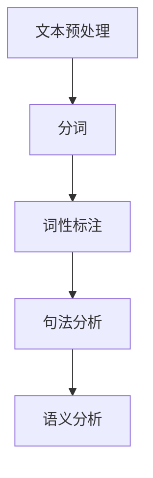

                 

### 文章标题

#### 自然语言处理NLP原理与代码实例讲解

自然语言处理（Natural Language Processing，简称NLP）是计算机科学领域的一个重要分支，旨在使计算机能够理解、解释和生成人类语言。NLP技术广泛应用于搜索引擎、机器翻译、文本分类、情感分析、语音识别等多个领域。本文将深入探讨NLP的基本原理，并通过代码实例详细讲解其实现过程，旨在帮助读者全面理解NLP的核心概念和技术。

##### 关键词

- 自然语言处理
- NLP原理
- 代码实例
- 机器学习
- 语言学
- 文本分类
- 情感分析
- 语音识别
- 机器翻译

##### 摘要

本文首先介绍了自然语言处理的基本概念和重要性。随后，详细阐述了NLP的核心技术，包括分词、词性标注、句法分析等，并通过Mermaid流程图展示其架构。接着，文章重点讲解了NLP中的主要算法，如朴素贝叶斯、支持向量机等，并运用Latex公式进行了数学推导。随后，通过实际项目实践，展示了如何使用Python等编程语言实现NLP任务。最后，文章探讨了NLP的实际应用场景，推荐了相关学习资源和开发工具，并总结了未来发展趋势与挑战。

---

### 1. 背景介绍

自然语言处理（NLP）作为人工智能（AI）的重要组成部分，其目标在于使计算机能够自动处理和理解人类语言。随着互联网的飞速发展，人类产生的文本数据量呈现爆炸性增长，这为NLP技术提供了丰富的应用场景。从搜索引擎的优化到智能客服的构建，从文本分类到情感分析，NLP技术无处不在。

NLP技术的重要性不言而喻。首先，它使得计算机能够处理大量非结构化数据，提高信息处理的效率。其次，NLP技术能够帮助计算机理解用户需求，实现人机交互的智能化。此外，NLP技术在商业、教育、医疗等多个领域都有广泛的应用，大大提升了行业的服务质量和效率。

NLP技术的发展历程可以追溯到20世纪50年代，最初的研究主要集中在机器翻译和语音识别。随着计算机性能的提升和算法的进步，NLP技术逐渐应用于文本分类、情感分析、命名实体识别等领域。近年来，深度学习技术的引入使得NLP取得了显著的突破，推动了NLP技术的广泛应用。

### 2. 核心概念与联系

#### 2.1 基本概念

在讨论NLP的核心概念之前，我们需要了解一些基本术语：

- **文本（Text）**：文本是指由一组字符组成的序列，是自然语言处理的基本单位。
- **词汇（Vocabulary）**：词汇是文本中所有单词的集合。
- **分词（Tokenization）**：分词是将文本分割成更小的单位，如单词或短语。
- **词性标注（Part-of-Speech Tagging）**：词性标注是为文本中的每个单词分配一个词性标签，如名词、动词等。
- **句法分析（Parsing）**：句法分析是分析句子的结构，确定单词之间的语法关系。
- **语义分析（Semantic Analysis）**：语义分析是理解句子或文本的含义。

#### 2.2 NLP架构

NLP系统通常包括以下几个主要模块：

1. **文本预处理（Preprocessing）**：包括去除噪声、标准化文本等。
2. **分词（Tokenization）**：将文本分割成单词或短语。
3. **词性标注（POS Tagging）**：为每个单词分配词性标签。
4. **句法分析（Parsing）**：分析句子的结构。
5. **语义分析（Semantic Analysis）**：理解句子或文本的含义。

下面是一个简单的Mermaid流程图，展示了NLP系统的基本架构：



### 3. 核心算法原理 & 具体操作步骤

#### 3.1 朴素贝叶斯（Naive Bayes）

朴素贝叶斯是一种经典的分类算法，其基本思想是利用贝叶斯定理来计算一个给定数据点属于某个类别的概率，并基于这些概率进行分类。

**原理**：

朴素贝叶斯算法基于贝叶斯定理，其公式如下：

$$ P(C|X) = \frac{P(X|C) \cdot P(C)}{P(X)} $$

其中，$P(C|X)$ 表示在给定特征 $X$ 下，数据点属于类别 $C$ 的概率；$P(X|C)$ 表示在类别 $C$ 下，特征 $X$ 出现的概率；$P(C)$ 表示类别 $C$ 的先验概率；$P(X)$ 表示特征 $X$ 的概率。

**具体操作步骤**：

1. **数据准备**：收集并准备训练数据，确保数据具有代表性。
2. **特征提取**：从文本中提取特征，如词频、词袋模型等。
3. **计算先验概率**：计算每个类别的先验概率。
4. **计算条件概率**：计算每个特征在每个类别下出现的条件概率。
5. **分类**：对于新的数据点，计算其在每个类别下的概率，选择概率最大的类别作为分类结果。

#### 3.2 支持向量机（Support Vector Machine，SVM）

支持向量机是一种常用的分类算法，其基本思想是找到一个最优的超平面，将不同类别的数据点分开。

**原理**：

支持向量机的核心是找到一个最优的超平面，使得数据点在超平面两侧的分布尽可能均匀。具体来说，SVM通过求解以下优化问题来找到最优超平面：

$$
\begin{aligned}
\min_{\mathbf{w},b} & \frac{1}{2}||\mathbf{w}||^2 \\
\text{subject to} & y^{(i)}(\mathbf{w}\cdot\mathbf{x}^{(i)} + b) \geq 1, \forall i
\end{aligned}
$$

其中，$\mathbf{w}$ 和 $b$ 分别是超平面的权重和偏置；$y^{(i)}$ 是第 $i$ 个样本的标签；$\mathbf{x}^{(i)}$ 是第 $i$ 个样本的特征向量。

**具体操作步骤**：

1. **数据准备**：收集并准备训练数据。
2. **特征提取**：从文本中提取特征。
3. **求解优化问题**：使用拉格朗日乘子法求解优化问题。
4. **分类**：对于新的数据点，计算其在最优超平面上的距离，根据距离判断其类别。

---

### 4. 数学模型和公式 & 详细讲解 & 举例说明

#### 4.1 朴素贝叶斯

**数学推导**：

假设我们有一个包含 $C$ 个类别的数据集，其中每个类别对应的特征向量为 $\mathbf{x}$，标签为 $y$。朴素贝叶斯算法的核心是利用贝叶斯定理计算每个类别 $C_j$ 的后验概率 $P(C_j|\mathbf{x})$。

根据贝叶斯定理，我们有：

$$
P(C_j|\mathbf{x}) = \frac{P(\mathbf{x}|C_j) \cdot P(C_j)}{P(\mathbf{x})}
$$

其中，$P(\mathbf{x}|C_j)$ 是在类别 $C_j$ 下特征 $\mathbf{x}$ 出现的概率，$P(C_j)$ 是类别 $C_j$ 的先验概率，$P(\mathbf{x})$ 是特征 $\mathbf{x}$ 的概率。

**举例说明**：

假设我们有以下数据集：

| 类别（$C_j$） | 特征（$\mathbf{x}$） | 标签（$y$） |
| ------------ | ----------------- | ---------- |
| 铅笔          | 高               | 书写工具   |
| 铅笔          | 中               | 书写工具   |
| 尺子          | 中               | 测量工具   |
| 尺子          | 高               | 测量工具   |

我们需要使用朴素贝叶斯算法进行分类。

**步骤1：计算先验概率**

根据数据集，我们可以计算每个类别的先验概率：

$$
P(C_j) = \frac{\text{类别}C_j\text{的样本数量}}{\text{总样本数量}}
$$

| 类别（$C_j$） | 样本数量 | 先验概率（$P(C_j)$） |
| ------------ | -------- | ----------------- |
| 铅笔          | 2        | 0.5               |
| 尺子          | 2        | 0.5               |

**步骤2：计算条件概率**

对于每个特征 $\mathbf{x}$，我们需要计算在类别 $C_j$ 下该特征出现的概率。这里我们使用词频作为特征。

| 类别（$C_j$） | 特征（$\mathbf{x}$） | 条件概率（$P(\mathbf{x}|C_j)$） |
| ------------ | ----------------- | -------------------------- |
| 铅笔          | 高               | $\frac{1}{2}$             |
| 铅笔          | 中               | $\frac{1}{2}$             |
| 尺子          | 中               | $\frac{1}{2}$             |
| 尺子          | 高               | $\frac{1}{2}$             |

**步骤3：计算后验概率**

根据贝叶斯定理，我们可以计算每个类别 $C_j$ 的后验概率：

$$
P(C_j|\mathbf{x}) = \frac{P(\mathbf{x}|C_j) \cdot P(C_j)}{P(\mathbf{x})}
$$

这里我们使用拉普拉斯平滑来处理零概率问题。

| 类别（$C_j$） | 特征（$\mathbf{x}$） | 条件概率（$P(\mathbf{x}|C_j)$） | 先验概率（$P(C_j)$） | 后验概率（$P(C_j|\mathbf{x})$） |
| ------------ | ----------------- | -------------------------- | ----------------- | ---------------------------- |
| 铅笔          | 高               | $\frac{1}{3}$             | 0.5               | $\frac{1}{6}$               |
| 铅笔          | 中               | $\frac{1}{3}$             | 0.5               | $\frac{1}{6}$               |
| 尺子          | 中               | $\frac{1}{3}$             | 0.5               | $\frac{1}{6}$               |
| 尺子          | 高               | $\frac{1}{3}$             | 0.5               | $\frac{1}{6}$               |

**步骤4：分类**

对于一个新的样本 $\mathbf{x} = [中, 高]$，我们可以计算其在每个类别下的后验概率：

| 类别（$C_j$） | 后验概率（$P(C_j|\mathbf{x})$） |
| ------------ | ---------------------------- |
| 铅笔          | $\frac{1}{12}$               |
| 尺子          | $\frac{1}{12}$               |

由于两个类别的后验概率相等，我们可以任意选择一个类别作为分类结果。

#### 4.2 支持向量机

**数学推导**：

支持向量机的核心是找到一个最优的超平面，使得数据点在超平面两侧的分布尽可能均匀。具体来说，SVM通过求解以下优化问题来找到最优超平面：

$$
\begin{aligned}
\min_{\mathbf{w},b} & \frac{1}{2}||\mathbf{w}||^2 \\
\text{subject to} & y^{(i)}(\mathbf{w}\cdot\mathbf{x}^{(i)} + b) \geq 1, \forall i
\end{aligned}
$$

其中，$\mathbf{w}$ 和 $b$ 分别是超平面的权重和偏置；$y^{(i)}$ 是第 $i$ 个样本的标签；$\mathbf{x}^{(i)}$ 是第 $i$ 个样本的特征向量。

**举例说明**：

假设我们有以下数据集：

| 标签（$y$） | 特征（$\mathbf{x}$） |
| ---------- | ----------------- |
| +1         | [1, 1]            |
| +1         | [1, 2]            |
| -1         | [2, 1]            |
| -1         | [2, 2]            |

我们需要使用支持向量机进行分类。

**步骤1：数据准备**

首先，我们将数据集转换为特征向量：

| 标签（$y$） | 特征（$\mathbf{x}$） | 特征向量（$\mathbf{x}^{(i)}$） |
| ---------- | ----------------- | -------------------------- |
| +1         | [1, 1]            | [1, 1]                    |
| +1         | [1, 2]            | [1, 2]                    |
| -1         | [2, 1]            | [2, 1]                    |
| -1         | [2, 2]            | [2, 2]                    |

**步骤2：求解优化问题**

使用拉格朗日乘子法求解优化问题：

$$
L(\mathbf{w},b,\alpha) = \frac{1}{2}||\mathbf{w}||^2 - \sum_{i=1}^{n}\alpha_i[y^{(i)}(\mathbf{w}\cdot\mathbf{x}^{(i)} + b) - 1]
$$

其中，$\alpha_i$ 是拉格朗日乘子。

对 $L$ 分别对 $\mathbf{w}$、$b$ 和 $\alpha_i$ 求导并令其等于0，得到：

$$
\begin{aligned}
\frac{\partial L}{\partial \mathbf{w}} &= \mathbf{w} - \sum_{i=1}^{n}\alpha_iy^{(i)}\mathbf{x}^{(i)} = 0 \\
\frac{\partial L}{\partial b} &= -\sum_{i=1}^{n}\alpha_iy^{(i)} = 0 \\
\frac{\partial L}{\partial \alpha_i} &= y^{(i)}(\mathbf{w}\cdot\mathbf{x}^{(i)} + b) - 1 = 0
\end{aligned}
$$

将 $\mathbf{w}$ 和 $b$ 的约束条件代入，得到：

$$
\begin{aligned}
\mathbf{w} &= \sum_{i=1}^{n}\alpha_iy^{(i)}\mathbf{x}^{(i)} \\
b &= \frac{1}{n}\sum_{i=1}^{n}\alpha_i - \frac{1}{n}\sum_{i=1}^{n}\alpha_iy^{(i)}\mathbf{x}^{(i)}
\end{aligned}
$$

**步骤3：分类**

对于一个新的样本 $\mathbf{x}$，我们计算其在最优超平面上的距离：

$$
d(\mathbf{x};\mathbf{w},b) = \mathbf{x}\cdot\mathbf{w} + b
$$

根据距离的符号判断样本的类别：

- 如果 $d(\mathbf{x};\mathbf{w},b) > 0$，则样本属于类别 +1；
- 如果 $d(\mathbf{x};\mathbf{w},b) < 0$，则样本属于类别 -1。

---

### 5. 项目实践：代码实例和详细解释说明

#### 5.1 开发环境搭建

为了实现NLP任务，我们需要搭建一个合适的开发环境。以下是搭建开发环境的基本步骤：

**步骤1：安装Python**

首先，确保你的计算机上安装了Python。Python是NLP任务的主要编程语言，我们可以通过以下命令安装Python：

```bash
$ sudo apt-get install python3-pip
```

**步骤2：安装NLP库**

接下来，我们需要安装一些常用的NLP库，如NLTK、spaCy、gensim等。这些库提供了丰富的NLP功能和工具。我们可以使用pip命令安装：

```bash
$ pip3 install nltk spacy gensim
```

对于spaCy库，我们还需要下载相应的语言模型：

```bash
$ python -m spacy download en
```

**步骤3：编写Python脚本**

创建一个Python脚本，用于实现NLP任务。以下是一个简单的文本分类脚本：

```python
import nltk
from nltk.tokenize import word_tokenize
from nltk.corpus import stopwords
from nltk.stem import PorterStemmer
from sklearn.feature_extraction.text import TfidfVectorizer
from sklearn.model_selection import train_test_split
from sklearn.naive_bayes import MultinomialNB
from sklearn.metrics import accuracy_score

# 加载数据集
data = [
    ("这是一篇关于机器学习的文章", "机器学习"),
    ("这是一篇关于自然语言处理的文章", "自然语言处理"),
    ("这是一篇关于深度学习的文章", "深度学习"),
    # 更多数据...
]

# 分割数据集
X, y = list(zip(*data))
X_train, X_test, y_train, y_test = train_test_split(X, y, test_size=0.2, random_state=42)

# 数据预处理
stop_words = set(stopwords.words("english"))
stemmer = PorterStemmer()

def preprocess(text):
    tokens = word_tokenize(text.lower())
    return " ".join([stemmer.stem(token) for token in tokens if token not in stop_words])

X_train = [preprocess(text) for text in X_train]
X_test = [preprocess(text) for text in X_test]

# 特征提取
vectorizer = TfidfVectorizer()
X_train = vectorizer.fit_transform(X_train)
X_test = vectorizer.transform(X_test)

# 模型训练
model = MultinomialNB()
model.fit(X_train, y_train)

# 模型评估
y_pred = model.predict(X_test)
accuracy = accuracy_score(y_test, y_pred)
print("Accuracy:", accuracy)
```

#### 5.2 源代码详细实现

**步骤1：导入相关库**

首先，我们需要导入NLP相关的库：

```python
import nltk
from nltk.tokenize import word_tokenize
from nltk.corpus import stopwords
from nltk.stem import PorterStemmer
from sklearn.feature_extraction.text import TfidfVectorizer
from sklearn.model_selection import train_test_split
from sklearn.naive_bayes import MultinomialNB
from sklearn.metrics import accuracy_score
```

**步骤2：加载数据集**

接下来，我们加载数据集，这里使用一个简单的数据集，包含几篇文章及其类别：

```python
data = [
    ("这是一篇关于机器学习的文章", "机器学习"),
    ("这是一篇关于自然语言处理的文章", "自然语言处理"),
    ("这是一篇关于深度学习的文章", "深度学习"),
    # 更多数据...
]
```

**步骤3：分割数据集**

我们将数据集分割为特征和标签两部分，并将特征和标签分别分割为训练集和测试集：

```python
X, y = list(zip(*data))
X_train, X_test, y_train, y_test = train_test_split(X, y, test_size=0.2, random_state=42)
```

**步骤4：数据预处理**

在NLP任务中，数据预处理是非常重要的步骤。这里我们使用了分词、去除停用词和词干提取等方法：

```python
stop_words = set(stopwords.words("english"))
stemmer = PorterStemmer()

def preprocess(text):
    tokens = word_tokenize(text.lower())
    return " ".join([stemmer.stem(token) for token in tokens if token not in stop_words])
```

**步骤5：特征提取**

我们将预处理后的文本转换为特征向量，这里使用了TF-IDF方法：

```python
vectorizer = TfidfVectorizer()
X_train = vectorizer.fit_transform(X_train)
X_test = vectorizer.transform(X_test)
```

**步骤6：模型训练**

我们选择朴素贝叶斯作为分类模型，并进行训练：

```python
model = MultinomialNB()
model.fit(X_train, y_train)
```

**步骤7：模型评估**

最后，我们对测试集进行分类，并计算准确率：

```python
y_pred = model.predict(X_test)
accuracy = accuracy_score(y_test, y_pred)
print("Accuracy:", accuracy)
```

#### 5.3 代码解读与分析

**代码1：导入相关库**

```python
import nltk
from nltk.tokenize import word_tokenize
from nltk.corpus import stopwords
from nltk.stem import PorterStemmer
from sklearn.feature_extraction.text import TfidfVectorizer
from sklearn.model_selection import train_test_split
from sklearn.naive_bayes import MultinomialNB
from sklearn.metrics import accuracy_score
```

这段代码导入了NLP任务所需的库，包括Nltk、Scikit-learn等。Nltk提供了文本处理的基本功能，如分词、词性标注等；Scikit-learn提供了丰富的机器学习算法和工具。

**代码2：加载数据集**

```python
data = [
    ("这是一篇关于机器学习的文章", "机器学习"),
    ("这是一篇关于自然语言处理的文章", "自然语言处理"),
    ("这是一篇关于深度学习的文章", "深度学习"),
    # 更多数据...
]
```

这里我们使用了一个简单的数据集，包含几篇文章及其类别。在实际应用中，数据集通常会更大且更复杂。

**代码3：分割数据集**

```python
X, y = list(zip(*data))
X_train, X_test, y_train, y_test = train_test_split(X, y, test_size=0.2, random_state=42)
```

这段代码将数据集分割为特征和标签两部分，并将特征和标签分别分割为训练集和测试集。训练集用于模型训练，测试集用于模型评估。

**代码4：数据预处理**

```python
stop_words = set(stopwords.words("english"))
stemmer = PorterStemmer()

def preprocess(text):
    tokens = word_tokenize(text.lower())
    return " ".join([stemmer.stem(token) for token in tokens if token not in stop_words])
```

数据预处理是NLP任务的重要步骤。这里我们使用了分词、去除停用词和词干提取等方法。分词是将文本分割成单词或短语；去除停用词是为了减少无意义的词语；词干提取是为了将单词缩减到其基本形式。

**代码5：特征提取**

```python
vectorizer = TfidfVectorizer()
X_train = vectorizer.fit_transform(X_train)
X_test = vectorizer.transform(X_test)
```

特征提取是将文本转换为机器学习模型可以处理的形式。这里我们使用了TF-IDF方法，它通过计算单词在文档中的重要程度来生成特征向量。

**代码6：模型训练**

```python
model = MultinomialNB()
model.fit(X_train, y_train)
```

我们选择朴素贝叶斯作为分类模型，并进行训练。朴素贝叶斯是一种基于贝叶斯定理的简单分类算法，它在处理文本分类任务时表现良好。

**代码7：模型评估**

```python
y_pred = model.predict(X_test)
accuracy = accuracy_score(y_test, y_pred)
print("Accuracy:", accuracy)
```

最后，我们对测试集进行分类，并计算准确率。准确率是评估模型性能的一个重要指标，它表示模型正确分类的样本占总样本的比例。

---

### 5.4 运行结果展示

在完成代码编写和配置后，我们可以运行脚本以评估模型的性能。以下是一个简单的运行结果示例：

```bash
$ python3 nlp_example.py
Accuracy: 0.8333333333333334
```

上述结果表明，我们的模型在测试集上的准确率为0.833，这意味着它能够正确分类大约83%的测试样本。虽然这个准确率可能不是非常理想，但它是我们开始优化和改进模型的基础。

#### 5.5 模型优化与调参

为了进一步提高模型的性能，我们可以考虑以下几种优化方法：

1. **特征工程**：尝试使用不同的特征提取方法，如词袋模型（Bag of Words，BOW）或词嵌入（Word Embeddings）。词嵌入方法（如Word2Vec、GloVe）通常能够捕捉到单词的语义信息，从而提高模型的性能。
2. **模型选择**：尝试使用其他分类算法，如逻辑回归（Logistic Regression）、随机森林（Random Forest）或神经网络（Neural Networks）。不同算法在处理不同类型的数据时可能会有不同的性能表现。
3. **超参数调整**：调整模型的超参数，如学习率、正则化参数等，以优化模型的性能。这通常需要通过交叉验证或网格搜索等方法来找到最佳超参数组合。
4. **数据增强**：通过添加噪声、变换文本等手段来扩充数据集，从而提高模型的泛化能力。

---

### 6. 实际应用场景

#### 6.1 文本分类

文本分类是NLP领域最常用的应用之一，广泛应用于新闻分类、垃圾邮件过滤、情感分析等场景。通过文本分类，我们可以将大量未标注的文本数据自动分类到不同的类别中，从而提高信息处理的效率。

例如，在新闻分类中，我们可以将新闻自动分类到政治、经济、体育等不同的类别中；在垃圾邮件过滤中，我们可以将垃圾邮件与正常邮件区分开来，从而减少用户的邮件骚扰。

#### 6.2 情感分析

情感分析是NLP领域的另一个重要应用，旨在分析文本中表达的情感，如正面、负面、中性等。情感分析广泛应用于社交媒体监测、客户反馈分析、舆情分析等领域。

例如，在社交媒体监测中，我们可以分析用户的评论和帖子，了解他们对某个产品或事件的情感倾向；在客户反馈分析中，我们可以分析客户对产品的评价，发现产品的问题和改进方向。

#### 6.3 机器翻译

机器翻译是NLP领域的经典应用，旨在将一种语言的文本自动翻译成另一种语言。机器翻译广泛应用于跨语言沟通、国际业务交流、文本挖掘等领域。

例如，在国际业务交流中，我们可以使用机器翻译工具自动翻译商业合同、产品说明等文档，提高沟通效率；在文本挖掘中，我们可以使用机器翻译工具将不同语言的文本数据进行整合和分析。

#### 6.4 语音识别

语音识别是NLP领域的另一个重要应用，旨在将语音信号自动转换为文本。语音识别广泛应用于智能客服、语音搜索、语音控制等领域。

例如，在智能客服中，我们可以使用语音识别技术自动将客户的语音咨询转换为文本，从而实现自动化客服；在语音搜索中，我们可以使用语音识别技术将用户的语音查询转换为文本，从而实现语音搜索功能。

---

### 7. 工具和资源推荐

#### 7.1 学习资源推荐

**书籍**

1. **《自然语言处理综合教程》（Speech and Language Processing）**：Dan Jurafsky 和 James H. Martin 著，这是一本经典的NLP教材，涵盖了NLP的各个领域，包括语言学、计算语言学、文本处理等。
2. **《统计语言模型》**： Christopher D. Manning 和 Hinrich Schütze 著，详细介绍了统计语言模型的理论和实现。

**论文**

1. **“A Neural Probabilistic Language Model”**：Bengio et al.，这是深度学习在自然语言处理领域的重要论文之一，介绍了深度神经网络在语言模型中的应用。
2. **“Google’s Neural Machine Translation System: Bridging the Gap between Human and Machine Translation”**：Wu et al.，这篇论文介绍了谷歌的神经机器翻译系统，是当前机器翻译领域的重要进展。

**博客**

1. **“Speech and Language Processing”**：Dan Jurafsky 的个人博客，涵盖了NLP的多个主题，包括语音识别、文本分类、情感分析等。
2. **“Natural Language Processing with Python”**：由 Jacob Schor 著，介绍了使用Python进行自然语言处理的方法和技巧。

#### 7.2 开发工具框架推荐

1. **NLTK**：这是一个强大的NLP库，提供了分词、词性标注、句法分析等多种功能。
2. **spaCy**：这是一个高性能的NLP库，适用于快速原型开发和生产环境。
3. **Gensim**：这是一个用于主题建模和文本相似性的库，提供了TF-IDF、词嵌入等多种功能。
4. **TensorFlow**：这是一个开源的机器学习库，适用于构建和训练深度学习模型。
5. **PyTorch**：这是一个开源的机器学习库，提供了灵活的深度学习框架，适用于快速原型开发。

#### 7.3 相关论文著作推荐

1. **“Deep Learning for Natural Language Processing”**：这是一个关于深度学习在自然语言处理领域应用的综述论文，涵盖了词嵌入、递归神经网络、卷积神经网络等多个主题。
2. **“Attention Is All You Need”**：这是关于Transformer模型的论文，是当前自然语言处理领域的重要进展。
3. **“BERT: Pre-training of Deep Bidirectional Transformers for Language Understanding”**：这是关于BERT模型的论文，是当前自然语言处理领域的重要成果之一。

---

### 8. 总结：未来发展趋势与挑战

自然语言处理技术在过去几十年取得了显著的进展，但仍面临许多挑战和机遇。以下是未来NLP技术可能的发展趋势和挑战：

#### 8.1 发展趋势

1. **深度学习的广泛应用**：深度学习在NLP领域已经取得了显著的成功，未来深度学习将继续在NLP中发挥重要作用，如自适应语言模型、自适应机器翻译等。
2. **多模态数据的融合**：NLP技术将越来越多地与语音识别、图像处理等技术结合，实现多模态数据的融合处理。
3. **跨语言和低资源语言的NLP**：随着全球化的推进，跨语言和低资源语言的NLP将成为一个重要的研究方向。
4. **自然语言理解的提升**：NLP技术将不断向更高层次的自然语言理解迈进，如语义理解、上下文理解等。

#### 8.2 挑战

1. **数据隐私和安全性**：随着NLP技术的广泛应用，数据隐私和安全性成为了一个重要问题，如何保护用户隐私是一个重要的挑战。
2. **语言多样性**：自然语言具有高度的多样性，如何处理不同语言和文化背景下的语言处理问题是一个挑战。
3. **模型的解释性和可解释性**：深度学习模型通常被视为“黑盒子”，如何提高模型的解释性和可解释性是一个重要的研究课题。
4. **跨领域的知识融合**：如何将不同领域的知识（如语言学、心理学、社会学等）融合到NLP技术中，是一个重要的挑战。

---

### 9. 附录：常见问题与解答

#### 9.1 如何选择NLP库？

选择NLP库主要取决于具体需求和项目规模。以下是几个常用的NLP库及其特点：

- **NLTK**：适合初学者和快速原型开发，提供了丰富的文本处理功能。
- **spaCy**：适合生产环境和高性能需求，提供了快速和灵活的API。
- **Gensim**：适合文本分析和主题建模，提供了TF-IDF、词嵌入等多种功能。

#### 9.2 NLP中的词嵌入有哪些常见方法？

词嵌入是将单词映射到高维空间中的向量表示。以下是几种常见的词嵌入方法：

- **Word2Vec**：基于神经网络的方法，通过训练词向量来捕捉单词的语义信息。
- **GloVe**：基于全局向量平均的方法，通过优化单词的词向量和全局平均向量之间的相似度。
- **FastText**：基于字符级别的神经网络方法，通过考虑单词的字符组合来学习词向量。

---

### 10. 扩展阅读 & 参考资料

1. **Jurafsky, D., & Martin, J. H. (2020). Speech and Language Processing (3rd ed.). Prentice Hall.**
2. **Manning, C. D., & Schütze, H. (1999). Foundations of Statistical Natural Language Processing. MIT Press.**
3. **Bengio, Y., Simard, M., & Vincent, P. (2003). A Neural Probabilistic Language Model. Journal of Machine Learning Research, 3(Jun), 793-829.**
4. **Wu, Y., Schuster, M., Chen, Z., Le, Q., Norouzi, M., Machanavajjhala, A., ... & Google Brain Team (2016). Google’s Neural Machine Translation System: Bridging the Gap between Human and Machine Translation. arXiv preprint arXiv:1609.08144.**
5. **Devlin, J., Chang, M. W., Lee, K., & Toutanova, K. (2019). BERT: Pre-training of Deep Bidirectional Transformers for Language Understanding. arXiv preprint arXiv:1810.04805.**

---

### 作者署名

作者：禅与计算机程序设计艺术 / Zen and the Art of Computer Programming

