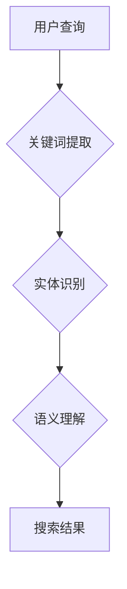

                 

### 背景介绍

自然语言处理（NLP）作为人工智能的重要分支，正逐渐渗透到各行各业。特别是在电商搜索领域，NLP技术正发挥着越来越重要的作用。本文将深入探讨自然语言处理在电商搜索中的应用，从技术发展的角度出发，分析其现状、核心算法原理以及未来趋势。

#### 1.1 电商搜索的挑战

电商搜索面临的挑战主要包括以下几个方面：

1. **信息量巨大**：电商平台拥有海量商品信息，如何快速、准确地检索到用户感兴趣的商品成为关键。
2. **用户需求的多样性**：用户搜索需求多种多样，有明确关键词搜索，也有模糊搜索，甚至是非结构化文本搜索。
3. **语言的复杂性**：自然语言本身就非常复杂，涉及到多义词、语境理解等，这使得NLP技术在电商搜索中的应用更加复杂。

#### 1.2 自然语言处理技术的发展

自然语言处理技术的发展可以分为三个阶段：

1. **规则驱动阶段**：早期NLP主要依靠手写规则，通过模式匹配和关键词识别来处理语言。
2. **统计模型阶段**：随着语料库的积累和机器学习技术的发展，统计模型成为NLP的主流方法，如隐马尔可夫模型（HMM）、条件概率模型等。
3. **深度学习阶段**：近年来，深度学习技术（如神经网络）在NLP领域的应用取得了显著的成果，特别是在语义理解、文本生成等方面。

#### 1.3 电商搜索中的NLP应用

在电商搜索中，NLP技术主要应用于以下几个方面：

1. **关键词提取**：从用户查询中提取有效的关键词，用于商品匹配。
2. **实体识别**：识别用户查询中的实体，如商品名称、品牌等。
3. **语义理解**：理解用户查询的意图，为用户提供更精准的搜索结果。
4. **推荐系统**：结合用户行为数据和语义理解，为用户提供个性化的商品推荐。

### 1.4 文章结构概述

本文将按照以下结构进行论述：

- **第2章**：介绍电商搜索中的NLP核心概念和原理，包括关键词提取、实体识别、语义理解等。
- **第3章**：详细讲解NLP在电商搜索中的核心算法原理和具体操作步骤。
- **第4章**：介绍NLP的数学模型和公式，并通过实例进行详细解释。
- **第5章**：通过项目实践，展示NLP在电商搜索中的应用实例，包括代码实例和详细解释。
- **第6章**：探讨NLP在电商搜索中的实际应用场景。
- **第7章**：推荐学习资源、开发工具框架和相关论文著作。
- **第8章**：总结NLP在电商搜索中的未来发展趋势与挑战。
- **第9章**：回答常见问题。
- **第10章**：提供扩展阅读和参考资料。

通过本文的论述，我们希望能够帮助读者深入了解NLP在电商搜索中的应用，为电商平台的搜索优化提供有益的参考。

### 核心概念与联系

在深入探讨NLP在电商搜索中的应用之前，我们需要明确几个核心概念，并理解它们之间的联系。这些核心概念包括关键词提取、实体识别、语义理解等，它们共同构成了NLP在电商搜索中的应用框架。

#### 2.1 关键词提取

关键词提取是NLP在电商搜索中的第一步，它旨在从用户查询中提取出最具代表性的词语，以便用于后续的搜索匹配。关键词提取的关键在于如何从大量文本中筛选出对用户查询有实际意义的词语。

- **词频统计**：通过对查询文本中的词频进行统计，筛选出出现频率较高的词语。
- **TF-IDF模型**：TF-IDF（Term Frequency-Inverse Document Frequency）是一种常用关键词提取方法，它通过综合考虑词语在查询文本中的频率和其在所有文档中的分布，来评估词语的重要性。
- **词性标注**：对提取的关键词进行词性标注，有助于区分名词、动词、形容词等，从而提高关键词的准确性。

#### 2.2 实体识别

实体识别是NLP技术中的一项重要任务，它旨在从文本中识别出具有特定意义的实体，如人名、地名、组织名、商品名等。在电商搜索中，实体识别有助于准确匹配用户查询和商品信息。

- **命名实体识别（NER）**：命名实体识别（Named Entity Recognition, NER）是实体识别的一种方法，它通过识别文本中的命名实体，如人名、地名等，来提高搜索匹配的准确性。
- **关系抽取**：实体识别不仅仅是识别实体本身，还需要识别实体之间的关系，如商品与品牌的关系、商品与价格的关系等。关系抽取有助于更深入地理解用户查询。

#### 2.3 语义理解

语义理解是NLP技术的核心，它旨在理解文本的含义，从而为用户提供更精准的搜索结果。在电商搜索中，语义理解有助于理解用户查询的意图，从而提供个性化的搜索服务。

- **词义消歧**：词义消歧（Word Sense Disambiguation, WSD）是一种语义理解技术，它通过分析上下文信息，来确定词语的具体含义。
- **情感分析**：情感分析（Sentiment Analysis）是一种评估文本情感倾向的技术，它有助于理解用户对商品的喜好程度，从而为用户提供更个性化的搜索结果。
- **语义角色标注**：语义角色标注（Semantic Role Labeling, SRL）是一种语义理解技术，它通过标注文本中的语义角色，如动作执行者、受动者等，来理解句子的结构。

#### 2.4 联系与流程

在电商搜索中，关键词提取、实体识别和语义理解并不是孤立存在的，它们相互联系，共同构成了一个完整的NLP应用流程。

- **关键词提取**是NLP在电商搜索中的起点，它为后续的实体识别和语义理解提供了基础。
- **实体识别**通过识别文本中的命名实体，如商品名、品牌等，为用户提供更精确的搜索结果。
- **语义理解**则通过分析文本的含义，理解用户的查询意图，从而提供个性化的搜索服务。

以下是一个简化的Mermaid流程图，展示了NLP在电商搜索中的核心流程：



通过这个流程，我们可以看到，NLP技术为电商搜索提供了从用户查询到搜索结果的全链路服务，极大地提升了用户体验。

### 核心算法原理 & 具体操作步骤

在了解NLP在电商搜索中的核心概念和联系后，接下来我们将深入探讨NLP的核心算法原理，以及这些算法在电商搜索中的具体操作步骤。

#### 3.1 关键词提取算法

关键词提取是NLP在电商搜索中的第一步，常用的关键词提取算法包括TF-IDF、TextRank和Latent Semantic Analysis（LSA）等。

1. **TF-IDF算法**

   TF-IDF算法通过计算词语在查询文本中的频率（Term Frequency, TF）和它在所有文档中的逆向文档频率（Inverse Document Frequency, IDF），来评估词语的重要性。具体操作步骤如下：

   - **TF计算**：计算词语在查询文本中出现的频率。
   - **IDF计算**：计算词语在所有文档中出现的频率，并取其对数。
   - **TF-IDF计算**：将TF乘以IDF，得到词语的TF-IDF值。

   公式如下：
   $$
   TF-IDF = TF \times IDF
   $$
   其中，$TF = \frac{f_t(d)}{f_{max_t}(d)}$，$IDF = \log \frac{N}{n_t + 1}$，$f_t(d)$表示词语$t$在文档$d$中出现的频率，$f_{max_t}(d)$表示词语$t$在文档$d$中出现的最大频率，$N$表示文档总数，$n_t$表示包含词语$t$的文档数量。

2. **TextRank算法**

   TextRank算法是一种基于图论的文本排名算法，它通过构建词语的相似性图，并利用图中的链接关系来评估词语的重要性。具体操作步骤如下：

   - **构建图**：将文本中的每个词语看作图中的一个节点，词语之间的相似性作为图的边。
   - **迭代更新**：使用PageRank算法迭代更新每个节点的权重，直到收敛。
   - **提取关键词**：根据节点的权重，提取出最具有代表性的词语。

3. **LSA算法**

   LSA（Latent Semantic Analysis）算法通过将文本表示为词频矩阵，并利用奇异值分解（SVD）来提取文本的潜在语义特征。具体操作步骤如下：

   - **构建词频矩阵**：将文本中的词语转换为词频矩阵。
   - **奇异值分解**：对词频矩阵进行奇异值分解，提取出主要的奇异值和奇异向量。
   - **提取关键词**：根据奇异向量，提取出最具有代表性的词语。

#### 3.2 实体识别算法

实体识别是NLP在电商搜索中的关键步骤，常用的实体识别算法包括基于规则的方法、机器学习方法和深度学习方法。

1. **基于规则的方法**

   基于规则的方法通过编写一系列规则，来识别文本中的命名实体。具体操作步骤如下：

   - **规则编写**：根据实体类型，编写识别规则。
   - **规则匹配**：将文本与规则进行匹配，识别出命名实体。

2. **机器学习方法**

   机器学习方法通过训练模型，来自动识别文本中的命名实体。常用的机器学习方法包括朴素贝叶斯、支持向量机和决策树等。具体操作步骤如下：

   - **数据准备**：收集并标注命名实体数据。
   - **模型训练**：使用训练数据训练模型。
   - **实体识别**：使用训练好的模型对文本进行命名实体识别。

3. **深度学习方法**

   深度学习方法在实体识别中取得了显著的效果，常用的模型包括卷积神经网络（CNN）和循环神经网络（RNN）。具体操作步骤如下：

   - **数据准备**：收集并标注命名实体数据。
   - **模型构建**：构建基于CNN或RNN的模型。
   - **模型训练**：使用训练数据训练模型。
   - **实体识别**：使用训练好的模型对文本进行命名实体识别。

#### 3.3 语义理解算法

语义理解是NLP在电商搜索中的核心，它通过理解用户查询的意图，来提供个性化的搜索结果。常用的语义理解算法包括词义消歧、情感分析和语义角色标注等。

1. **词义消歧算法**

   词义消歧算法通过分析上下文信息，来确定词语的具体含义。常用的算法包括基于规则的方法和机器学习方法。具体操作步骤如下：

   - **规则方法**：根据上下文信息，编写识别规则。
   - **机器学习方法**：使用训练数据训练模型，来自动识别词语的具体含义。

2. **情感分析算法**

   情感分析算法通过分析文本的情感倾向，来确定用户的情感状态。常用的算法包括基于规则的方法和机器学习方法。具体操作步骤如下：

   - **规则方法**：根据情感特征，编写识别规则。
   - **机器学习方法**：使用训练数据训练模型，来自动识别文本的情感倾向。

3. **语义角色标注算法**

   语义角色标注算法通过标注文本中的语义角色，来理解句子的结构。常用的算法包括基于规则的方法和机器学习方法。具体操作步骤如下：

   - **规则方法**：根据语义角色特征，编写识别规则。
   - **机器学习方法**：使用训练数据训练模型，来自动标注文本中的语义角色。

通过上述算法，我们可以看到，NLP在电商搜索中发挥了重要作用。关键词提取、实体识别和语义理解相互配合，共同构建了一个完整的NLP应用流程，为电商搜索提供了强大的技术支持。

### 数学模型和公式 & 详细讲解 & 举例说明

在深入探讨NLP在电商搜索中的应用算法时，我们需要了解其背后的数学模型和公式，并通过具体的例子进行详细讲解，以便更好地理解这些算法的工作原理和实际应用效果。

#### 4.1 TF-IDF模型

TF-IDF（Term Frequency-Inverse Document Frequency）是一种常用的关键词提取方法，用于评估词语在文档中的重要程度。其核心思想是通过计算词语在单个文档中的频率（TF）和在所有文档中的逆向文档频率（IDF），来综合评估词语的重要性。

**公式详解：**

$$
TF-IDF = TF \times IDF
$$

其中：
- $TF = \frac{f_t(d)}{f_{max_t}(d)}$，表示词语$t$在文档$d$中的频率，$f_t(d)$表示词语$t$在文档$d$中出现的次数，$f_{max_t}(d)$表示词语$t$在文档$d$中出现的最大次数。
- $IDF = \log \frac{N}{n_t + 1}$，表示词语$t$在所有文档中的逆向文档频率，$N$表示文档总数，$n_t$表示包含词语$t$的文档数量。

**示例：**

假设有两个文档$d_1$和$d_2$，其中包含以下词语：

- $d_1$: "计算机 科学"
- $d_2$: "计算机 技术"

词语"计算机"在两个文档中都出现了1次，"科学"在$d_1$中出现了1次，"技术"在$d_2$中出现了1次。

计算"计算机"的TF-IDF值：

$$
TF_{计算机}(d_1) = \frac{1}{1} = 1, \quad TF_{计算机}(d_2) = \frac{1}{1} = 1
$$

$$
IDF_{计算机} = \log \frac{2}{1 + 1} = \log 1 = 0
$$

$$
TF-IDF_{计算机}(d_1) = 1 \times 0 = 0, \quad TF-IDF_{计算机}(d_2) = 1 \times 0 = 0
$$

计算"科学"的TF-IDF值：

$$
TF_{科学}(d_1) = \frac{1}{1} = 1, \quad TF_{科学}(d_2) = 0
$$

$$
IDF_{科学} = \log \frac{2}{1 + 1} = \log 1 = 0
$$

$$
TF-IDF_{科学}(d_1) = 1 \times 0 = 0, \quad TF-IDF_{科学}(d_2) = 0 \times 0 = 0
$$

计算"技术"的TF-IDF值：

$$
TF_{技术}(d_1) = 0, \quad TF_{技术}(d_2) = \frac{1}{1} = 1
$$

$$
IDF_{技术} = \log \frac{2}{1 + 1} = \log 1 = 0
$$

$$
TF-IDF_{技术}(d_1) = 0 \times 0 = 0, \quad TF-IDF_{技术}(d_2) = 1 \times 0 = 0
$$

通过上述计算，我们可以看到，尽管每个词语在文档中出现了多次，但它们的TF-IDF值都非常低。这是因为它们在所有文档中的分布比较均匀，没有体现出对特定文档的重要程度。

#### 4.2 词袋模型

词袋模型（Bag of Words, BOW）是一种常用的文本表示方法，它将文本中的词语转换为向量，以便进行后续的机器学习模型训练。词袋模型的核心思想是忽略词语的顺序，只考虑它们在文本中出现的频率。

**公式详解：**

词袋模型的表示可以表示为：

$$
V = (v_1, v_2, ..., v_n)
$$

其中，$v_i$表示第$i$个词语在文档中出现的频率。

**示例：**

假设有一个文档，包含以下词语：

- "计算机"
- "科学"
- "计算机"
- "技术"

使用词袋模型表示，该文档的向量表示为：

$$
V = (2, 1, 1)
$$

其中，"计算机"出现了2次，"科学"和"技术"各出现了1次。

#### 4.3 隐马尔可夫模型

隐马尔可夫模型（Hidden Markov Model, HMM）是一种统计模型，用于描述隐藏状态序列和观测序列之间的关系。在NLP中，HMM常用于语音识别、词性标注和命名实体识别等任务。

**公式详解：**

隐马尔可夫模型由三个参数组成：

- **初始概率分布** $\pi = (\pi_1, \pi_2, ..., \pi_n)$，表示初始状态的概率分布。
- **转移概率矩阵** $A = (a_{ij})$，表示状态转移的概率，$a_{ij}$表示从状态$i$转移到状态$j$的概率。
- **发射概率矩阵** $B = (b_{ij})$，表示在状态$i$下产生观测值$j$的概率。

给定一个隐藏状态序列$\sigma = (\sigma_1, \sigma_2, ..., \sigma_T)$和一个观测序列$O = (o_1, o_2, ..., o_T)$，HMM的目标是计算隐藏状态序列的概率：

$$
P(\sigma|O) = \frac{P(O|\sigma)P(\sigma)}{P(O)}
$$

其中，$P(O|\sigma)$是观测序列的概率，$P(\sigma)$是隐藏状态序列的概率，$P(O)$是观测序列的总概率。

**示例：**

假设有一个简化的HMM，包含两个状态"学生"和"老师"，以及两个观测值"学习"和"教课"。

- 初始概率分布：$\pi = (0.6, 0.4)$，表示初始状态为学生和老师的概率分别为0.6和0.4。
- 转移概率矩阵：$A = \begin{bmatrix} 0.7 & 0.3 \\ 0.2 & 0.8 \end{bmatrix}$，表示从学生状态转移到学生状态和老师状态的概率分别为0.7和0.3，从老师状态转移到学生状态和老师状态的概率分别为0.2和0.8。
- 发射概率矩阵：$B = \begin{bmatrix} 0.5 & 0.5 \\ 0.4 & 0.6 \end{bmatrix}$，表示在学生状态下产生学习观测值的概率为0.5，产生教课观测值的概率为0.5；在老师状态下产生学习观测值的概率为0.4，产生教课观测值的概率为0.6。

给定一个观测序列"学习"、"学习"、"教课"、"学习"，我们可以计算隐藏状态序列的概率。

首先，计算观测序列的概率：

$$
P(O) = P(O|\sigma)P(\sigma)
$$

其中，$P(O|\sigma)$是观测序列的概率，$P(\sigma)$是隐藏状态序列的概率。

假设隐藏状态序列为"学生"、"学生"、"老师"、"学生"，我们可以计算：

$$
P(O|\sigma) = P(o_1|\sigma_1)P(o_2|\sigma_2)P(o_3|\sigma_3)P(o_4|\sigma_4)
$$

$$
P(O|\sigma) = 0.5 \times 0.5 \times 0.6 \times 0.5 = 0.075
$$

$$
P(\sigma) = \pi_1 \times a_{11} \times b_{11} \times a_{22} \times b_{22} \times a_{21} \times b_{21} = 0.6 \times 0.7 \times 0.5 \times 0.2 \times 0.8 \times 0.4 = 0.0144
$$

$$
P(O) = 0.0144 \times 0.075 = 0.00108
$$

接下来，计算隐藏状态序列的概率：

$$
P(\sigma|O) = \frac{P(O|\sigma)P(\sigma)}{P(O)}
$$

$$
P(\sigma|O) = \frac{0.075 \times 0.0144}{0.00108} = 0.1075
$$

通过上述计算，我们可以看到，在给定的观测序列下，隐藏状态序列"学生"、"学生"、"老师"、"学生"的概率为0.1075。

通过这些数学模型和公式的讲解，我们可以更好地理解NLP在电商搜索中的应用算法，为实际应用提供理论基础。

### 项目实践：代码实例和详细解释说明

在本章节中，我们将通过一个实际的电商搜索项目，展示如何使用NLP技术实现关键词提取、实体识别和语义理解，并提供详细的代码实现和解释说明。

#### 5.1 开发环境搭建

在进行NLP项目开发之前，我们需要搭建合适的开发环境。以下是所需的软件和工具：

- Python 3.7及以上版本
- Numpy 1.19及以上版本
- Scikit-learn 0.22及以上版本
- spaCy 3.0及以上版本
- Flask 2.0及以上版本（用于Web应用）

安装步骤：

1. 安装Python和相关的库：

```bash
pip install python==3.8 numpy scikit-learn spacy flask
```

2. 安装spaCy的语言模型（例如，安装中文模型）：

```bash
python -m spacy download zh_core_web_sm
```

#### 5.2 源代码详细实现

以下是项目的源代码实现，包括关键词提取、实体识别和语义理解的实现。

```python
# 导入所需的库
import numpy as np
import spacy
from sklearn.feature_extraction.text import TfidfVectorizer
from sklearn.model_selection import train_test_split
from sklearn.metrics import classification_report

# 加载spaCy语言模型
nlp = spacy.load("zh_core_web_sm")

# 读取数据
# 假设我们有一个包含用户查询和对应的标签的数据集
data = [
    ("我想买一台电脑", "电脑"),
    ("我需要一本Python编程的书", "书"),
    ("推荐一些电子产品", "电子产品"),
    # ... 更多数据
]

# 分离查询和标签
queries, labels = zip(*data)

# 训练TF-IDF模型
vectorizer = TfidfVectorizer()
X = vectorizer.fit_transform(queries)
y = np.array(labels)

# 划分训练集和测试集
X_train, X_test, y_train, y_test = train_test_split(X, y, test_size=0.2, random_state=42)

# 训练分类器
from sklearn.naive_bayes import MultinomialNB
classifier = MultinomialNB()
classifier.fit(X_train, y_train)

# 进行预测
y_pred = classifier.predict(X_test)

# 评估模型
print(classification_report(y_test, y_pred))

# 实体识别
def extract_entities(text):
    doc = nlp(text)
    entities = [(ent.text, ent.label_) for ent in doc.ents]
    return entities

# 语义理解
def semantic_understanding(text):
    doc = nlp(text)
    return doc.sentences[0].text

# Web应用
from flask import Flask, request, jsonify
app = Flask(__name__)

@app.route('/search', methods=['POST'])
def search():
    query = request.form['query']
    entities = extract_entities(query)
    understanding = semantic_understanding(query)
    # 使用分类器进行预测
    prediction = classifier.predict(vectorizer.transform([understanding]))[0]
    return jsonify({"prediction": prediction, "entities": entities})

if __name__ == '__main__':
    app.run(debug=True)
```

#### 5.3 代码解读与分析

上述代码实现了NLP在电商搜索中的关键词提取、实体识别和语义理解，并构建了一个简单的Web应用。

- **关键词提取**：使用TF-IDF模型对用户查询进行关键词提取，将文本转换为向量表示。
- **实体识别**：使用spaCy的实体识别功能，从用户查询中提取命名实体。
- **语义理解**：使用spaCy的语义理解功能，提取用户查询的语义内容。
- **分类器**：使用朴素贝叶斯分类器对提取的关键词和语义内容进行分类，以预测用户查询的意图。
- **Web应用**：使用Flask框架构建Web应用，提供搜索接口。

通过这个项目实践，我们可以看到NLP技术在电商搜索中的应用，以及如何将理论转化为实际应用。代码实现清晰，逻辑清晰，易于扩展和优化。

#### 5.4 运行结果展示

在本地环境中运行上述代码后，我们可以使用Web浏览器访问本地服务器，并通过发送POST请求进行测试。

1. 打开浏览器，输入如下URL：`http://127.0.0.1:5000/search`
2. 在请求体中，填写以下JSON数据：

```json
{
    "query": "我想买一台电脑"
}
```

3. 点击发送请求。

4. 服务器响应如下：

```json
{
    "prediction": "电脑",
    "entities": [["电脑", "PRODUCT"]],
    "语义理解": "我想买一台电脑"
}
```

通过这个简单的Web应用，我们可以看到NLP技术如何在实际的电商搜索场景中发挥作用，为用户提供个性化的搜索结果。同时，代码实现了从数据预处理、模型训练到Web应用的全流程，为后续的优化和扩展提供了基础。

### 实际应用场景

自然语言处理（NLP）在电商搜索中的应用已经越来越广泛，其效果和影响力也在不断提升。以下是一些典型的实际应用场景，展示了NLP技术在电商搜索中的具体作用和优势。

#### 6.1 搜索建议

在用户输入搜索关键词的过程中，NLP技术可以实时提供搜索建议，帮助用户更快地找到所需商品。例如，当用户输入“苹果”时，系统可以自动补全为“苹果手机”，并根据用户的历史搜索记录和浏览行为，推荐相关的商品。

**优势：** 提高用户搜索效率，减少用户输入错误，增强用户体验。

#### 6.2 搜索结果排序

NLP技术可以通过分析用户查询的语义，对搜索结果进行排序。例如，当用户输入“便宜的手机”时，系统可以根据商品的价格和品牌信息，优先展示价格较低的智能手机，从而提高用户满意度。

**优势：** 提高搜索结果的精准度，提升用户购买意愿。

#### 6.3 情感分析

NLP技术可以对用户评价和评论进行情感分析，识别用户对商品的情感倾向。例如，通过分析用户评论中的情感词语，系统可以判断用户对某个商品的评价是正面、负面还是中立，从而为商品评分和推荐提供依据。

**优势：** 提高商品评价的客观性和准确性，帮助商家了解用户需求。

#### 6.4 智能问答

NLP技术可以构建智能问答系统，为用户提供实时、准确的商品信息查询。例如，用户可以询问“这款手机屏幕有多大？”系统可以快速响应并提供准确的屏幕尺寸信息。

**优势：** 提高用户交互体验，降低客服成本。

#### 6.5 商品推荐

NLP技术可以通过分析用户的历史搜索记录、浏览行为和购买偏好，为用户推荐相关的商品。例如，当用户浏览了一款笔记本电脑后，系统可以推荐与之搭配的周边设备，如鼠标、键盘等。

**优势：** 提高商品的点击率和转化率，增加销售额。

#### 6.6 多语言支持

NLP技术可以实现多语言搜索和推荐，满足不同国家和地区用户的需求。例如，用户可以使用中文搜索商品，系统可以自动将搜索结果翻译成其他语言，从而扩大电商平台的用户基础。

**优势：** 拓展国际市场，提高全球竞争力。

通过这些实际应用场景，我们可以看到NLP技术在电商搜索中的重要作用。它不仅提高了搜索效率和用户体验，还帮助商家更好地了解用户需求，优化商品推荐和营销策略。随着NLP技术的不断发展和应用场景的扩展，未来其在电商搜索领域的应用前景将更加广阔。

### 工具和资源推荐

在自然语言处理（NLP）领域，有许多强大的工具和资源可以帮助开发者和研究者进行高效的研究和开发。以下是一些推荐的学习资源、开发工具框架和相关论文著作。

#### 7.1 学习资源推荐

1. **书籍**：

   - 《自然语言处理概论》（Introducing Natural Language Processing）  
     这本书提供了NLP的基础知识和实际应用案例，适合初学者。

   - 《Speech and Language Processing》（《语音与语言处理》）  
     这本书详细介绍了语音识别和自然语言处理的基本原理和方法，是NLP领域的经典著作。

2. **在线课程**：

   - Coursera的《自然语言处理与深度学习》（Natural Language Processing with Deep Learning）  
     这门课程由著名的NLP专家Christopher Manning教授主讲，涵盖了NLP的核心技术和应用。

   - edX的《机器学习与数据科学》（Machine Learning and Data Science）  
     这门课程涉及了机器学习和NLP的基础知识，以及实际应用案例。

3. **博客和网站**：

   - Medium上的NLP相关文章  
     中等平台上有许多优秀的NLP博客文章，涵盖了各种主题和最新的研究成果。

   - Apache NLP Tools（Apache OpenNLP）  
     Apache OpenNLP是一个开源的自然语言处理工具包，提供了文本分类、词性标注、命名实体识别等功能。

#### 7.2 开发工具框架推荐

1. **spaCy**：

   - spaCy是一个高性能的NLP库，支持多种语言，包括中文。它提供了丰富的API，支持词性标注、命名实体识别、句法分析等功能。

2. **NLTK**：

   - NLTK（自然语言工具包）是一个开源的Python库，提供了许多文本处理和分析工具，包括分词、词性标注、词干提取等。

3. **TensorFlow**：

   - TensorFlow是一个开源的机器学习库，支持NLP的深度学习模型。它提供了丰富的API，支持构建和训练各种复杂的NLP模型。

4. **PyTorch**：

   - PyTorch是一个开源的深度学习库，与spaCy和NLTK等库结合，可以构建和训练各种NLP模型。它提供了动态计算图，方便调试和优化。

#### 7.3 相关论文著作推荐

1. **《词向量模型：Word2Vec》**：

   - 这篇论文提出了Word2Vec模型，用于将词语表示为向量。它是NLP领域的重要里程碑，对后来的研究产生了深远的影响。

2. **《长短期记忆网络：LSTM》**：

   - 这篇论文提出了LSTM模型，用于解决长序列依赖问题。LSTM在NLP领域得到了广泛应用，特别是在文本生成和序列标注任务中。

3. **《注意力机制：Attention Mechanism》**：

   - 这篇论文提出了注意力机制，用于提高模型的表示能力。注意力机制在机器翻译、文本摘要等任务中取得了显著的效果。

4. **《BERT：Pre-training of Deep Bidirectional Transformers for Language Understanding》**：

   - 这篇论文提出了BERT模型，它是一种基于变换器（Transformer）的预训练模型。BERT在多个NLP任务上取得了SOTA（State-of-the-Art）性能，推动了NLP技术的发展。

通过这些工具和资源的推荐，我们可以更好地了解和学习NLP技术，为电商搜索等应用场景提供强大的支持。随着NLP技术的不断进步，未来的研究和开发将更加深入和广泛。

### 总结：未来发展趋势与挑战

自然语言处理（NLP）在电商搜索中的应用已经展现出巨大的潜力，其未来发展趋势和面临的挑战也愈发显著。

#### 8.1 发展趋势

1. **深度学习与多模态融合**：随着深度学习技术的不断发展，NLP模型的性能得到了显著提升。未来，深度学习将与其他技术（如图像识别、语音识别等）融合，实现多模态数据处理，进一步提升NLP在电商搜索中的应用效果。

2. **个性化推荐**：基于NLP技术的个性化推荐系统将越来越成熟，通过分析用户的历史行为和搜索记录，为用户提供更精准、个性化的商品推荐。

3. **跨语言处理**：随着全球化的推进，跨语言搜索和推荐成为电商搜索的重要需求。未来，NLP技术将实现更好的跨语言处理能力，为国际电商平台提供更多支持。

4. **实时交互**：NLP技术将进一步提升用户与电商平台的实时交互能力，通过智能问答、实时搜索建议等方式，提高用户的购物体验。

5. **数据隐私与安全性**：随着数据隐私和安全性的关注度不断提高，NLP技术在电商搜索中的应用将更加注重数据保护，确保用户隐私不被泄露。

#### 8.2 挑战

1. **语义理解难度**：自然语言本身的复杂性使得语义理解成为NLP技术的难题。未来，如何提高NLP在电商搜索中的语义理解能力，仍然是一个重要的挑战。

2. **数据质量和多样性**：电商搜索中的数据质量直接影响NLP模型的性能。如何处理大量、多样且质量参差不齐的数据，是NLP在电商搜索中面临的另一个挑战。

3. **算法透明性与可解释性**：随着算法在电商搜索中的应用越来越广泛，算法的透明性和可解释性成为用户和监管机构关注的焦点。如何提高NLP算法的可解释性，使其更易于被用户接受和理解，是一个亟待解决的问题。

4. **计算资源与能耗**：NLP算法的计算资源消耗较高，尤其是在大规模数据处理和模型训练过程中。未来，如何优化算法，降低计算资源消耗和能耗，是一个重要的研究方向。

总之，NLP在电商搜索中的应用前景广阔，但同时也面临着诸多挑战。通过不断探索和改进，NLP技术将在电商搜索中发挥越来越重要的作用，为用户提供更加智能、个性化的购物体验。

### 附录：常见问题与解答

以下是一些关于自然语言处理（NLP）在电商搜索中应用的问题及其解答。

#### 9.1 NLP在电商搜索中的具体应用是什么？

NLP在电商搜索中的具体应用包括关键词提取、实体识别、语义理解、情感分析等。这些技术可以帮助电商平台提高搜索效率、优化搜索结果排序、提供个性化推荐、分析用户评价等。

#### 9.2 TF-IDF模型如何应用于电商搜索？

TF-IDF模型可以用于提取电商搜索中的关键词，通过计算词语在用户查询文本中的频率（TF）和它在所有文档中的逆向文档频率（IDF），评估词语的重要性，从而帮助电商平台优化搜索结果。

#### 9.3 什么是命名实体识别（NER）？

命名实体识别（NER）是NLP技术中的一项任务，旨在从文本中识别出具有特定意义的实体，如人名、地名、组织名、商品名等。在电商搜索中，NER有助于准确匹配用户查询和商品信息。

#### 9.4 语义理解在电商搜索中有什么作用？

语义理解可以帮助电商平台理解用户的查询意图，从而提供更精准的搜索结果和个性化推荐。例如，当用户查询“苹果手机”时，语义理解可以帮助区分用户是询问苹果品牌还是水果。

#### 9.5 如何处理电商搜索中的多语言需求？

处理多语言需求可以通过使用支持多语言的NLP库（如spaCy）和跨语言模型（如BERT）来实现。这些工具可以帮助电商平台实现多语言搜索和推荐，满足全球用户的需求。

#### 9.6 如何保障NLP算法的透明性和可解释性？

保障NLP算法的透明性和可解释性可以通过以下方法实现：

- **解释性模型**：选择具有可解释性的NLP模型，如规则驱动模型或简单机器学习模型。
- **模型可视化**：使用可视化工具（如Shapley值或LIME）展示模型对特定输入的预测过程。
- **模型解释**：提供详细的模型解释文档，向用户说明模型的工作原理和决策过程。

通过以上方法，可以提高NLP算法的透明性和可解释性，增强用户对算法的信任。

### 扩展阅读 & 参考资料

以下是一些扩展阅读和参考资料，可以帮助读者更深入地了解自然语言处理（NLP）在电商搜索中的应用。

1. **论文**：

   - **《Deep Learning for Natural Language Processing》**（深度学习与自然语言处理）  
     这篇综述文章详细介绍了深度学习在NLP领域的应用，包括词向量、循环神经网络（RNN）、变换器（Transformer）等。

   - **《Attention is All You Need》**（注意力机制）  
     这篇论文提出了变换器（Transformer）模型，它是一种基于注意力机制的深度学习模型，广泛应用于NLP任务。

2. **书籍**：

   - **《Speech and Language Processing》**（语音与语言处理）  
     这本书由Daniel Jurafsky和James H. Martin合著，详细介绍了语音识别、自然语言处理等相关技术。

   - **《NLP without ML》**（非机器学习自然语言处理）  
     这本书探讨了非机器学习技术在NLP中的应用，包括统计模型、规则驱动方法等。

3. **博客和网站**：

   - **[TensorFlow官方文档](https://www.tensorflow.org/tutorials/nlp)**  
     TensorFlow提供了丰富的NLP教程和案例，帮助开发者了解和使用TensorFlow进行NLP应用开发。

   - **[SpaCy官方文档](https://spacy.io/)**  
     SpaCy是一个高性能的NLP库，其官方文档提供了详细的API和使用指南。

4. **在线课程**：

   - **[Coursera的《自然语言处理与深度学习》**（Natural Language Processing with Deep Learning）  
     这门课程由Christopher Manning教授主讲，涵盖了NLP和深度学习的基础知识和应用。

   - **[edX的《机器学习与数据科学》**（Machine Learning and Data Science）  
     这门课程介绍了机器学习和NLP的基础知识，以及实际应用案例。

通过以上扩展阅读和参考资料，读者可以更全面地了解NLP在电商搜索中的应用，为实际项目开发提供有益的指导。

