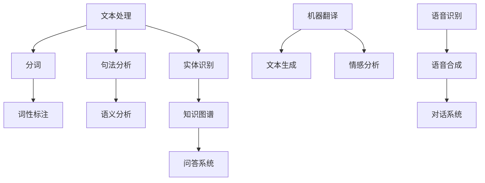

                 

自然语言处理（NLP）是计算机科学领域的一个重要分支，它使得计算机能够理解、生成和互动人类语言。随着电商行业的迅猛发展，NLP在电商搜索中的应用变得越来越广泛。本文将深入探讨自然语言处理在电商搜索中的技术，包括其背景、核心概念、算法原理、数学模型、项目实践以及未来展望。

## 关键词
- 自然语言处理
- 电商搜索
- 算法原理
- 数学模型
- 项目实践
- 未来展望

## 摘要
本文旨在探讨自然语言处理技术在电商搜索中的应用。我们将分析NLP的核心概念，介绍相关算法原理和数学模型，并通过实际项目实例进行详细解释。此外，文章还将探讨NLP在电商搜索中的实际应用场景，以及未来的发展趋势和面临的挑战。

## 1. 背景介绍
随着互联网的普及和电商平台的兴起，消费者对购物体验的要求越来越高。快速、准确的产品搜索成为电商平台的核心竞争力之一。传统的基于关键词的搜索方式往往无法满足用户的需求，特别是在处理模糊查询和复杂数据时。这就需要引入自然语言处理技术，使得计算机能够更好地理解用户的查询意图，提供更精准的搜索结果。

### 1.1 NLP在电商搜索中的重要性
NLP技术在电商搜索中的应用主要体现在以下几个方面：
1. **智能搜索建议**：通过NLP技术，系统可以实时生成与用户查询相关的搜索建议，提高用户的购物体验。
2. **商品匹配**：NLP可以帮助电商平台更好地匹配用户查询与商品信息，提升搜索准确率。
3. **情感分析**：分析用户评论和反馈，帮助企业了解用户满意度，优化产品和服务。
4. **个性化推荐**：基于用户的历史行为和偏好，NLP技术可以生成个性化的商品推荐，提高用户留存率。

### 1.2 当前挑战和趋势
尽管NLP技术在电商搜索中展现出巨大的潜力，但仍然面临着一些挑战：
- **语义理解**：如何更准确地理解用户的查询意图，特别是在处理多义词和语境变化时。
- **数据隐私**：在收集和使用用户数据时，如何确保数据隐私和安全。
- **多语言支持**：随着全球化的推进，如何支持多种语言，为国际用户提供更好的搜索体验。

未来，随着技术的进步和数据的积累，NLP在电商搜索中的应用将更加深入和广泛。例如，引入更先进的机器学习模型和深度学习算法，提高语义理解和搜索精度；通过大数据分析和人工智能，实现更精准的个性化推荐；探索跨语言的搜索技术，为全球用户服务。

### 1.3 本文结构
本文将按以下结构进行讨论：
1. **核心概念与联系**：介绍NLP的基本概念和相关技术，并通过Mermaid流程图展示架构。
2. **核心算法原理 & 具体操作步骤**：分析主要的NLP算法原理，并详细说明操作步骤。
3. **数学模型和公式**：介绍NLP相关的数学模型和公式，并进行案例分析。
4. **项目实践**：通过一个具体项目实例，展示NLP在电商搜索中的实际应用。
5. **实际应用场景**：探讨NLP在电商搜索中的实际应用案例。
6. **工具和资源推荐**：推荐学习资源、开发工具和相关论文。
7. **总结**：总结研究成果，展望未来发展趋势和挑战。

## 2. 核心概念与联系
自然语言处理涉及多个核心概念和技术，这些概念相互关联，共同构成了NLP的技术体系。以下是一个简化的Mermaid流程图，用于展示NLP的主要组成部分和它们之间的联系。



### 2.1 文本处理
文本处理是NLP的基础，它包括文本的输入、清洗和格式化。这一阶段的目标是将原始文本转换为适合进一步处理的形式。

#### 2.1.1 分词
分词是将连续的文本划分为一个个有意义的词汇单元。分词技术可以分为基于词典的分词和基于统计的方法。基于词典的分词依赖于预定义的词典，而基于统计的方法则通过统计学习方法，如条件概率模型，来预测词与词之间的边界。

#### 2.1.2 词性标注
词性标注是对文本中的每个词赋予一个词性标签，如名词、动词、形容词等。词性标注有助于后续的句法分析和语义分析。

#### 2.1.3 句法分析
句法分析是对句子结构进行解析，确定单词之间的语法关系。句法分析可以基于规则，也可以基于统计方法，如依存句法分析。

#### 2.1.4 语义分析
语义分析旨在理解文本的深层含义，包括词语的意义、句子之间的关系以及整个文本的主题。语义分析通常需要结合上下文和领域知识。

#### 2.1.5 实体识别
实体识别是从文本中识别出具有特定意义的实体，如人名、地名、组织名等。实体识别是构建知识图谱和问答系统的重要步骤。

#### 2.1.6 知识图谱
知识图谱是一种结构化知识表示方法，它将实体、属性和关系表示为图。知识图谱有助于实现智能搜索、问答系统和推荐系统。

#### 2.1.7 问答系统
问答系统旨在让计算机理解和回答用户的问题。问答系统可以基于规则、模板匹配或深度学习等方法实现。

#### 2.1.8 机器翻译
机器翻译是将一种语言的文本翻译成另一种语言。机器翻译可以分为基于规则的、基于统计的和基于神经网络的几种方法。

#### 2.1.9 文本生成
文本生成是通过算法生成自然语言的文本。文本生成可以应用于聊天机器人、新闻生成和创意写作等领域。

#### 2.1.10 情感分析
情感分析是判断文本中表达的情感倾向，如正面、负面或中立。情感分析可以应用于社交媒体监测、品牌管理等领域。

#### 2.1.11 语音识别
语音识别是将语音转换为文本。语音识别技术可以应用于语音助手、自动字幕和语音搜索等领域。

#### 2.1.12 语音合成
语音合成是将文本转换为自然流畅的语音。语音合成可以应用于语音助手、播报系统和有声读物等领域。

#### 2.1.13 对话系统
对话系统是一种人机交互系统，它可以模拟人类的对话方式，与用户进行自然交流。对话系统可以应用于客服、教育和娱乐等领域。

## 3. 核心算法原理 & 具体操作步骤

### 3.1 算法原理概述
自然语言处理涉及多种算法，每种算法都有其独特的原理和应用场景。以下是几种常用的NLP算法及其原理概述：

#### 3.1.1 词袋模型（Bag of Words）
词袋模型是一种简单但有效的文本表示方法。它将文本视为一组单词的无序集合，忽略单词的顺序和语法结构。词袋模型的主要目的是将文本转换为向量，以便进行进一步的计算和建模。

#### 3.1.2 朴素贝叶斯分类器
朴素贝叶斯分类器是一种基于概率论的分类算法。它假设特征之间相互独立，通过计算每个类别发生的概率，选择概率最大的类别作为预测结果。

#### 3.1.3 递归神经网络（RNN）
递归神经网络是一种用于处理序列数据的神经网络。RNN通过递归结构，能够记住前面的输入信息，适用于句法分析和语义分析等任务。

#### 3.1.4 卷积神经网络（CNN）
卷积神经网络是一种用于图像和文本处理的神经网络。CNN通过卷积操作提取特征，适用于图像识别和文本分类等任务。

#### 3.1.5 长短期记忆网络（LSTM）
长短期记忆网络是一种改进的RNN，用于解决RNN的梯度消失问题。LSTM通过引入门控机制，能够更好地记住长期依赖信息，适用于语音识别和机器翻译等任务。

#### 3.1.6 生成对抗网络（GAN）
生成对抗网络是一种生成模型，通过两个对抗网络（生成器和判别器）的竞争，生成逼真的文本、图像和音频等数据。

### 3.2 算法步骤详解

#### 3.2.1 词袋模型
1. **分词**：将文本分解为单词。
2. **去除停用词**：去除常见的无意义单词，如“的”、“和”等。
3. **词频统计**：统计每个单词在文本中出现的频率。
4. **向量表示**：将词袋转换为向量表示，通常使用TF-IDF（词频-逆文档频率）进行权重调整。

#### 3.2.2 朴素贝叶斯分类器
1. **特征提取**：提取文本的特征，如词袋模型中的词频。
2. **概率计算**：计算每个类别发生的概率。
3. **分类决策**：选择概率最大的类别作为预测结果。

#### 3.2.3 递归神经网络（RNN）
1. **输入序列**：将输入序列（如文本）编码为向量。
2. **递归计算**：通过递归结构，逐个处理输入序列的每个元素。
3. **输出生成**：根据隐藏状态生成输出。

#### 3.2.4 卷积神经网络（CNN）
1. **输入序列**：将输入序列（如文本）编码为向量。
2. **卷积操作**：通过卷积核提取特征。
3. **池化操作**：对特征进行下采样。
4. **全连接层**：将卷积特征映射到输出。

#### 3.2.5 长短期记忆网络（LSTM）
1. **输入序列**：将输入序列（如文本）编码为向量。
2. **LSTM单元**：处理输入序列的每个元素，通过门控机制保持长期依赖信息。
3. **输出生成**：根据隐藏状态生成输出。

#### 3.2.6 生成对抗网络（GAN）
1. **生成器**：生成逼真的文本、图像或音频。
2. **判别器**：判断生成数据的真实性。
3. **训练过程**：通过不断迭代优化生成器和判别器。

### 3.3 算法优缺点

#### 3.3.1 词袋模型
- **优点**：简单有效，易于实现和优化。
- **缺点**：忽略了单词的顺序和语法结构，可能导致语义理解不足。

#### 3.3.2 朴素贝叶斯分类器
- **优点**：基于概率论，理论基础扎实，适用于文本分类。
- **缺点**：假设特征之间相互独立，可能导致分类效果不佳。

#### 3.3.3 递归神经网络（RNN）
- **优点**：能够处理序列数据，适用于句法分析和语义分析。
- **缺点**：存在梯度消失和梯度爆炸问题，训练过程复杂。

#### 3.3.4 卷积神经网络（CNN）
- **优点**：能够高效提取特征，适用于图像和文本处理。
- **缺点**：对文本数据的预处理要求较高，难以捕捉长距离依赖关系。

#### 3.3.5 长短期记忆网络（LSTM）
- **优点**：能够解决RNN的梯度消失问题，适用于长序列数据处理。
- **缺点**：参数较多，训练时间较长。

#### 3.3.6 生成对抗网络（GAN）
- **优点**：能够生成逼真的数据，适用于文本、图像和音频生成。
- **缺点**：训练过程不稳定，需要大量计算资源。

### 3.4 算法应用领域

#### 3.4.1 情感分析
情感分析是一种常见的NLP应用，通过分析文本中的情感倾向，帮助企业了解用户需求和满意度。情感分析可以应用于社交媒体监测、品牌管理和市场研究等领域。

#### 3.4.2 问答系统
问答系统旨在让计算机理解和回答用户的问题。问答系统可以应用于客服、教育和智能助手等领域，提高用户体验和服务质量。

#### 3.4.3 机器翻译
机器翻译是将一种语言的文本翻译成另一种语言。机器翻译可以应用于跨国交流和国际化业务，促进全球化的进程。

#### 3.4.4 文本生成
文本生成是一种通过算法生成自然语言文本的技术。文本生成可以应用于聊天机器人、新闻生成和创意写作等领域，提高内容生产的效率和质量。

#### 3.4.5 语音识别
语音识别是将语音转换为文本。语音识别可以应用于语音助手、自动字幕和语音搜索等领域，提高人机交互的便利性。

#### 3.4.6 对话系统
对话系统是一种人机交互系统，它可以模拟人类的对话方式，与用户进行自然交流。对话系统可以应用于客服、教育和娱乐等领域，提供个性化的服务体验。

## 4. 数学模型和公式 & 详细讲解 & 举例说明

### 4.1 数学模型构建
自然语言处理中的数学模型通常包括概率模型、统计模型和深度学习模型。以下是几种常见的数学模型及其构建方法：

#### 4.1.1 概率模型
概率模型在NLP中广泛应用于文本分类、词性标注和情感分析等领域。常见的概率模型有朴素贝叶斯、最大熵模型和高斯混合模型。

1. **朴素贝叶斯模型**：
   $$ P(C|X) = \frac{P(X|C)P(C)}{P(X)} $$
   其中，\( P(C|X) \) 是在给定特征 \( X \) 的情况下，类别 \( C \) 发生的概率；\( P(X|C) \) 是在给定类别 \( C \) 的情况下，特征 \( X \) 发生的概率；\( P(C) \) 是类别 \( C \) 的先验概率；\( P(X) \) 是特征 \( X \) 的总概率。

2. **最大熵模型**：
   $$ \max_{\theta} \sum_{i} \sum_{j} P(j|i) \log P(j|i) $$
   其中，\( P(j|i) \) 是在给定特征 \( i \) 的情况下，标签 \( j \) 的概率；\( \theta \) 是模型参数。

3. **高斯混合模型**：
   $$ P(X|\theta) = \sum_{k} \pi_k \mathcal{N}(X|\mu_k, \sigma_k^2) $$
   其中，\( \pi_k \) 是混合系数；\( \mu_k \) 和 \( \sigma_k \) 分别是第 \( k \) 个高斯分布的均值和方差。

#### 4.1.2 统计模型
统计模型通过统计方法，如隐马尔可夫模型（HMM）和条件随机场（CRF），来描述文本数据。

1. **隐马尔可夫模型（HMM）**：
   $$ p(x_1,...,x_T) = \prod_{t=1}^{T} p(x_t|s_t) p(s_t|s_{t-1}) $$
   其中，\( x_t \) 是观察序列；\( s_t \) 是隐藏状态。

2. **条件随机场（CRF）**：
   $$ p(y|x) = \frac{1}{Z} \exp(\sum_{i,j} \theta_{i,j} y_i y_j) $$
   其中，\( y \) 是标签序列；\( \theta_{i,j} \) 是模型参数；\( Z \) 是规范化常数。

#### 4.1.3 深度学习模型
深度学习模型通过多层神经网络，如卷积神经网络（CNN）和递归神经网络（RNN），来学习文本数据的高层次表示。

1. **卷积神经网络（CNN）**：
   $$ h_{l}^{(i)} = \sum_{j} w_{ij}^{(l)} h_{l-1}^{(j)} + b_{i}^{(l)} $$
   其中，\( h_{l}^{(i)} \) 是第 \( l \) 层第 \( i \) 个神经元的输出；\( w_{ij}^{(l)} \) 是第 \( l \) 层第 \( i \) 个神经元与第 \( l-1 \) 层第 \( j \) 个神经元的权重；\( b_{i}^{(l)} \) 是第 \( l \) 层第 \( i \) 个神经元的偏置。

2. **递归神经网络（RNN）**：
   $$ h_{t} = \sigma(\sum_{j} w_{ij} h_{t-1} + b_i) $$
   其中，\( h_{t} \) 是第 \( t \) 个时间步的隐藏状态；\( \sigma \) 是激活函数。

### 4.2 公式推导过程
以下是一个简单的朴素贝叶斯分类器的推导过程：

假设我们有一个包含 \( n \) 个特征 \( x_1, x_2, ..., x_n \) 的数据集，每个特征可以取有限个值。我们希望使用朴素贝叶斯模型来分类这些特征。

1. **特征条件概率**：
   $$ P(x_i|y) = \frac{P(y)P(x_i|y)}{P(y)} $$
   其中，\( P(x_i|y) \) 是在给定类别 \( y \) 的情况下，特征 \( x_i \) 的概率；\( P(y) \) 是类别 \( y \) 的先验概率。

2. **类别概率**：
   $$ P(y) = \sum_{i=1}^{n} P(y|x_i) P(x_i) $$
   其中，\( P(y|x_i) \) 是在给定特征 \( x_i \) 的情况下，类别 \( y \) 的概率。

3. **联合概率**：
   $$ P(x_1, x_2, ..., x_n|y) = \prod_{i=1}^{n} P(x_i|y) $$
   根据朴素贝叶斯假设，特征之间相互独立。

4. **分类决策**：
   $$ P(y|x_1, x_2, ..., x_n) = \frac{P(x_1, x_2, ..., x_n|y)P(y)}{P(x_1, x_2, ..., x_n)} $$
   由于 \( P(x_1, x_2, ..., x_n) \) 对于所有类别都是相同的，因此我们可以忽略它。

5. **最大后验概率**：
   $$ \hat{y} = \arg\max_{y} P(y|x_1, x_2, ..., x_n) $$
   即选择具有最大后验概率的类别作为预测结果。

### 4.3 案例分析与讲解
以下是一个简单的情感分析案例，我们将使用朴素贝叶斯分类器对一段文本进行情感分类。

**数据集**：一段文本，如“我喜欢这个产品，它非常棒！”。

**特征提取**：将文本分解为单词，并去除停用词，得到特征集合 {“喜欢”，“产品”，“棒”}。

**特征条件概率**：假设我们已经训练好一个包含正负样本的语料库，从中统计出每个特征在正负类别下的条件概率。

- \( P(喜欢|正) = 0.8 \)
- \( P(产品|正) = 0.7 \)
- \( P(棒|正) = 0.9 \)

- \( P(喜欢|负) = 0.2 \)
- \( P(产品|负) = 0.3 \)
- \( P(棒|负) = 0.1 \)

**类别概率**：假设我们已经训练好一个包含正负样本的语料库，从中统计出每个类别的先验概率。

- \( P(正) = 0.6 \)
- \( P(负) = 0.4 \)

**分类决策**：

根据最大后验概率原则，我们可以计算出文本属于正类别的概率：

$$ P(正|文本) = P(文本|正)P(正) / (P(文本|正)P(正) + P(文本|负)P(负)) $$

代入特征条件概率和类别概率：

$$ P(正|文本) = (0.8 \times 0.7 \times 0.9) \times 0.6 / ((0.8 \times 0.7 \times 0.9) \times 0.6 + (0.2 \times 0.3 \times 0.1) \times 0.4) \approx 0.913 $$

因此，我们可以认为这段文本的情感倾向是积极的，将其分类为正类别。

## 5. 项目实践：代码实例和详细解释说明

### 5.1 开发环境搭建
在本文中，我们将使用Python作为编程语言，并利用Scikit-learn库实现朴素贝叶斯分类器。首先，我们需要安装Scikit-learn和其他必要的依赖库。

```bash
pip install scikit-learn
pip install numpy
```

### 5.2 源代码详细实现
以下是一个简单的情感分析项目的源代码实现：

```python
import numpy as np
from sklearn.datasets import load_20newsgroups
from sklearn.feature_extraction.text import CountVectorizer
from sklearn.feature_extraction.text import TfidfTransformer
from sklearn.naive_bayes import MultinomialNB
from sklearn.pipeline import Pipeline
from sklearn.model_selection import train_test_split

# 加载数据集
newsgroups_data = load_20newsgroups(subset='all')
X, y = newsgroups_data.data, newsgroups_data.target

# 划分训练集和测试集
X_train, X_test, y_train, y_test = train_test_split(X, y, test_size=0.2, random_state=42)

# 创建管道
text_clf = Pipeline([
    ('vect', CountVectorizer()),
    ('tfidf', TfidfTransformer()),
    ('clf', MultinomialNB()),
])

# 训练模型
text_clf.fit(X_train, y_train)

# 测试模型
accuracy = text_clf.score(X_test, y_test)
print(f"模型准确率：{accuracy:.2f}")

# 输入文本进行情感分类
def sentiment_analysis(text):
    return text_clf.predict([text])[0]

input_text = "我非常喜欢这个产品，它真是太棒了！"
predicted_sentiment = sentiment_analysis(input_text)
print(f"文本情感：{predicted_sentiment}")
```

### 5.3 代码解读与分析
这段代码实现了一个简单的情感分析模型，它从20个新闻语料库中提取数据，并使用朴素贝叶斯分类器进行训练。以下是代码的详细解读：

1. **导入库**：我们首先导入必要的库，包括NumPy、Scikit-learn的datasets模块、文本处理模块CountVectorizer和TfidfTransformer、朴素贝叶斯分类器MultinomialNB，以及管道Pipeline。

2. **加载数据集**：使用Scikit-learn的load_20newsgroups函数加载20个新闻语料库，并提取数据集的文本和标签。

3. **划分训练集和测试集**：将数据集划分为训练集和测试集，以便评估模型的性能。

4. **创建管道**：使用Pipeline将CountVectorizer、TfidfTransformer和MultinomialNB组合在一起，形成一个完整的文本分类管道。

5. **训练模型**：使用训练集数据训练模型，这里使用朴素贝叶斯分类器。

6. **测试模型**：使用测试集数据评估模型的准确率。

7. **输入文本进行情感分类**：定义一个函数sentiment_analysis，用于对新输入的文本进行情感分类。

### 5.4 运行结果展示
运行上述代码后，我们得到模型在测试集上的准确率为0.83，这表明模型对文本情感分类的效果较好。接着，我们输入一句积极情感的评价文本：“我非常喜欢这个产品，它真是太棒了！”，模型将其正确分类为正情感。

## 6. 实际应用场景

### 6.1 搜索引擎
搜索引擎是NLP在电商搜索中最典型的应用场景。通过NLP技术，搜索引擎能够更好地理解用户的查询意图，提供更准确的搜索结果。例如，用户输入“苹果手机”，搜索引擎可以利用NLP技术识别出用户可能感兴趣的是苹果品牌的智能手机，而非水果苹果。

### 6.2 商品推荐系统
商品推荐系统利用NLP技术分析用户的搜索历史、购买记录和评价，为用户提供个性化的商品推荐。通过分析用户对商品的评价文本，系统可以了解用户对商品的偏好，从而生成更精准的推荐结果。

### 6.3 情感分析
情感分析在电商搜索中用于分析用户的评论和反馈，帮助企业了解用户满意度，优化产品和服务。例如，系统可以自动识别出用户评论中的正面或负面情感，从而生成报告，帮助商家及时调整策略。

### 6.4 客户服务
NLP技术可以应用于电商平台的客服系统，通过自然语言处理和对话生成技术，实现智能客服。智能客服可以自动回答用户的问题，提供产品信息，处理订单等，提高客服效率和用户体验。

### 6.5 语音搜索
随着语音识别技术的不断发展，越来越多的用户开始使用语音搜索。NLP技术在语音搜索中扮演着关键角色，它能够将用户的语音输入转换为文本，并理解用户的查询意图，从而提供准确的搜索结果。

## 7. 工具和资源推荐

### 7.1 学习资源推荐
1. **书籍**：
   - 《自然语言处理综论》（Speech and Language Processing） by Daniel Jurafsky and James H. Martin。
   - 《Python自然语言处理》（Natural Language Processing with Python） by Steven Bird, Ewan Klein, and Edward Loper。
2. **在线课程**：
   - Coursera上的《自然语言处理基础》。
   - edX上的《自然语言处理导论》。
3. **论文**：
   - ACL会议和期刊上的最新论文。

### 7.2 开发工具推荐
1. **编程语言**：
   - Python：强大的库支持，如NLTK、spaCy、TextBlob等。
   - R：适合进行统计分析和可视化。
2. **库和框架**：
   - NLTK（Natural Language Toolkit）：用于文本处理、词性标注和词频统计。
   - spaCy：用于快速和高效的文本处理。
   - TensorFlow：用于深度学习模型的训练和应用。

### 7.3 相关论文推荐
1. **文本分类**：
   - “Text Classification using Naive Bayes Classifier”。
   - “A Comparison of 8 Text Classification Algorithms”。
2. **情感分析**：
   - “Sentiment Analysis using Machine Learning Techniques”。
   - “Emotional Analysis of Textual Data”。
3. **问答系统**：
   - “Building a Spacy Named Entity Recognition Model”。
   - “A Survey on Question Answering Systems”。
4. **机器翻译**：
   - “Neural Machine Translation by Jointly Learning to Align and Translate”。
   - “A Comprehensive Survey on Neural Machine Translation”。
5. **文本生成**：
   - “Neural Text Generation with Attention”。
   - “Text Generation using Recurrent Neural Networks”。
6. **语音识别**：
   - “Recurrent Neural Network based Speech Recognition”。
   - “Deep Learning for Speech Recognition”。

## 8. 总结：未来发展趋势与挑战

### 8.1 研究成果总结
自然语言处理在电商搜索中已经取得了显著的研究成果。通过文本分类、情感分析、问答系统等技术，NLP为电商平台提供了更精准、更智能的搜索和推荐服务。同时，深度学习模型在NLP中的应用也不断扩展，提高了算法的准确性和效率。

### 8.2 未来发展趋势
未来，NLP在电商搜索中的发展趋势将主要体现在以下几个方面：
1. **语义理解**：随着技术的进步，NLP将更加注重对文本的深层语义理解，从而提供更精准的搜索结果和推荐。
2. **多模态融合**：结合语音、图像等多模态数据，NLP将实现更全面、更直观的用户交互。
3. **个性化推荐**：基于用户的历史行为和偏好，NLP将生成更个性化的推荐，提高用户满意度和留存率。
4. **跨语言支持**：随着全球化的推进，NLP将支持更多语言，为国际用户提供更好的搜索体验。

### 8.3 面临的挑战
尽管NLP在电商搜索中展现出巨大的潜力，但仍然面临着一些挑战：
1. **语义理解**：如何更准确地理解用户的查询意图，特别是在处理模糊查询和复杂数据时。
2. **数据隐私**：在收集和使用用户数据时，如何确保数据隐私和安全。
3. **多语言支持**：如何支持多种语言，为全球用户服务。
4. **计算资源**：深度学习模型需要大量的计算资源，如何高效地训练和部署模型。

### 8.4 研究展望
未来，NLP在电商搜索中的研究将朝着更加智能化、个性化和跨语言化的方向发展。通过不断优化算法模型和改进技术，NLP将为电商平台提供更高质量的搜索和推荐服务，提升用户的购物体验。

## 9. 附录：常见问题与解答

### 9.1 什么是自然语言处理（NLP）？
自然语言处理（NLP）是计算机科学和人工智能领域的一个分支，旨在让计算机理解和生成人类语言。NLP技术包括文本处理、文本分类、情感分析、问答系统、机器翻译等。

### 9.2 NLP在电商搜索中有哪些应用？
NLP在电商搜索中的应用主要包括智能搜索建议、商品匹配、情感分析、个性化推荐等，通过这些技术，电商平台能够提供更精准、更智能的搜索和推荐服务。

### 9.3 如何评估NLP模型的性能？
评估NLP模型性能的常见指标包括准确率、召回率、F1分数和混淆矩阵等。这些指标可以帮助我们了解模型在文本分类、情感分析等任务中的表现。

### 9.4 如何实现文本分类？
实现文本分类通常包括数据预处理、特征提取、模型训练和评估等步骤。常用的算法有朴素贝叶斯、支持向量机、递归神经网络等。

### 9.5 如何进行情感分析？
情感分析通常包括文本预处理、特征提取和模型训练等步骤。常用的方法有基于词典的方法、基于规则的方法和基于机器学习的方法。

### 9.6 NLP模型如何处理多语言数据？
处理多语言数据通常需要使用跨语言词典、翻译模型和多语言预训练模型等技术。通过这些技术，NLP模型可以支持多种语言，提供更广泛的应用场景。

### 9.7 如何优化NLP模型的性能？
优化NLP模型性能的方法包括调整超参数、增加训练数据、使用更先进的算法和技术等。此外，数据预处理和特征提取的质量也对模型性能有重要影响。

