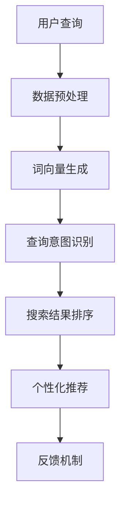

                 

### 1. 背景介绍

随着互联网技术的迅猛发展，电子商务行业迎来了前所未有的增长。各大电商平台纷纷涌现，市场竞争愈发激烈。为了在众多竞争者中脱颖而出，电商企业不得不不断优化用户体验，提升网站性能和转化率。其中，搜索功能作为电商平台的核心组成部分，其优化成为企业关注的焦点。

自然语言处理（NLP）技术的崛起为电商搜索功能的优化带来了新的机遇。NLP是一种让计算机理解和生成人类语言的技术，它包括文本分类、情感分析、命名实体识别、机器翻译等多个方面。这些技术的应用，使得电商平台能够更准确地理解用户的搜索意图，从而提供更智能、更个性化的搜索结果。

电商搜索优化的核心目标是提高搜索的准确性和效率。传统的电商搜索往往依赖于关键词匹配，这种方法在面对复杂的用户需求时，常常难以提供令人满意的结果。而NLP技术的引入，使得电商平台能够更深入地理解用户的查询意图，从而提高搜索的准确性和响应速度。

本文将深入探讨自然语言处理在电商搜索中的应用，包括核心概念、算法原理、数学模型、项目实践等，帮助读者全面了解这一技术，并在实际项目中应用。

### 2. 核心概念与联系

#### 2.1 自然语言处理（NLP）基础概念

自然语言处理（NLP）是一种让计算机理解和生成人类语言的技术。在电商搜索中，NLP主要涉及以下几个核心概念：

- **文本分类（Text Classification）**：文本分类是将文本数据按照特定的分类标准进行划分的过程。在电商搜索中，文本分类可以帮助识别用户的查询意图，从而提供更准确的搜索结果。

- **情感分析（Sentiment Analysis）**：情感分析旨在识别文本中的情感倾向，如正面、负面或中性。在电商搜索中，情感分析可以用于分析用户评论，了解用户对产品的满意程度。

- **命名实体识别（Named Entity Recognition, NER）**：命名实体识别是识别文本中的特定实体，如人名、地名、组织名等。在电商搜索中，NER可以帮助识别用户查询中的关键词，提高搜索的准确性。

- **词向量（Word Embedding）**：词向量是将单词映射到高维空间中的向量表示，以捕捉词与词之间的语义关系。词向量技术在电商搜索中用于处理和比较用户查询与商品描述，提高搜索匹配的准确性。

- **序列模型（Sequence Model）**：序列模型是处理序列数据的机器学习模型，如循环神经网络（RNN）和长短期记忆网络（LSTM）。序列模型在电商搜索中用于处理用户的查询历史和搜索序列，提供个性化的搜索建议。

#### 2.2 电商搜索与NLP的关系

电商搜索与NLP之间存在紧密的联系。以下是电商搜索中NLP应用的一些具体场景：

- **查询意图识别**：用户在电商平台上进行搜索时，输入的查询语句可能包含多种意图，如查找商品、比较商品、获取产品信息等。NLP技术可以帮助识别用户的查询意图，从而提供更相关的搜索结果。

- **个性化搜索**：通过分析用户的查询历史和行为数据，NLP技术可以预测用户的兴趣和需求，提供个性化的搜索建议。例如，当用户多次搜索某个品牌的商品时，NLP可以推荐其他类似品牌的商品。

- **商品推荐**：NLP技术可以用于商品推荐系统，通过分析用户评论和商品描述，提取关键词和特征，为用户提供个性化的商品推荐。

- **智能客服**：电商平台通常配备智能客服系统，以提供24小时在线服务。NLP技术可以帮助智能客服理解用户的咨询内容，提供准确的答案和建议。

- **商品分类与标签**：NLP技术可以用于对商品进行分类和标签化，以便用户能够更轻松地找到他们需要的商品。例如，通过分析商品描述和用户评论，NLP技术可以为商品生成标签，如“时尚”、“实用”、“高性价比”等。

#### 2.3 NLP在电商搜索中的架构

在电商搜索中，NLP的应用通常涉及以下架构：

- **数据预处理**：对用户查询和商品描述进行预处理，包括分词、去停用词、词性标注等。数据预处理是NLP任务的基础，对后续的模型训练和搜索结果准确性至关重要。

- **词向量生成**：使用词向量模型（如Word2Vec、GloVe等）将文本转换为向量表示。词向量可以捕捉词与词之间的语义关系，有助于提高搜索匹配的准确性。

- **查询意图识别**：通过训练分类模型（如SVM、随机森林、神经网络等），识别用户的查询意图。查询意图识别是提供个性化搜索结果的关键步骤。

- **搜索结果排序**：使用排序模型（如RankNet、LambdaMART等）对搜索结果进行排序，以提高用户的满意度。搜索结果排序需要考虑多个因素，如查询意图、用户历史行为、商品评价等。

- **个性化推荐**：基于用户的历史行为和查询记录，使用推荐算法（如协同过滤、矩阵分解、图神经网络等）为用户提供个性化的商品推荐。

- **反馈机制**：通过用户行为和反馈，不断优化NLP模型和搜索算法，以提高搜索系统的整体性能。

以下是一个简单的Mermaid流程图，展示了NLP在电商搜索中的应用架构：



### 3. 核心算法原理 & 具体操作步骤

#### 3.1 词向量生成

词向量生成是NLP在电商搜索中应用的基础。词向量是将单词映射到高维空间中的向量表示，以捕捉词与词之间的语义关系。以下是一些常用的词向量生成方法：

1. **Word2Vec**

   Word2Vec是一种基于神经网络的方法，通过训练词的上下文来生成词向量。Word2Vec包括两种模型：连续词袋（CBOW）和Skip-gram。

   - **CBOW（Continuous Bag of Words）**：CBOW模型通过预测中心词周围的多个词来生成词向量。具体步骤如下：

     1. 随机选择一个中心词和一个窗口大小的词序列。
     2. 使用中心词周围的所有词作为输入，预测中心词。
     3. 训练神经网络，以预测中心词。

   - **Skip-gram**：Skip-gram模型通过预测中心词的上下文词来生成词向量。具体步骤如下：

     1. 随机选择一个中心词和一个窗口大小的词序列。
     2. 使用中心词作为输入，预测周围的所有词。
     3. 训练神经网络，以预测周围词。

2. **GloVe**

   GloVe（Global Vectors for Word Representation）是一种基于全局共现信息的词向量生成方法。GloVe通过计算词与词之间的共现矩阵，学习词向量。具体步骤如下：

   1. 构建共现矩阵：对于每个词\(v_i\)，计算其与其他词\(v_j\)的共现次数。
   2. 学习词向量：对于每个词\(v_i\)，设置一个未初始化的词向量\(v_i^0\)，并设置一个学习率。然后迭代更新词向量，直到满足预设的停止条件。

#### 3.2 查询意图识别

查询意图识别是NLP在电商搜索中的重要应用。查询意图识别旨在理解用户的查询意图，从而提供更准确的搜索结果。以下是一种基于深度学习的查询意图识别方法：

1. **数据集准备**：

   收集大量电商搜索查询数据，并对数据进行预处理，包括分词、去停用词、词性标注等。将预处理后的数据分为训练集和测试集。

2. **模型构建**：

   使用深度学习框架（如TensorFlow或PyTorch）构建查询意图识别模型。以下是一个简单的模型架构：

   - **嵌入层（Embedding Layer）**：将词向量嵌入到模型中，用于处理文本输入。
   - **循环层（RNN Layer）**：使用循环神经网络（如LSTM或GRU）对输入文本序列进行建模。
   - **全连接层（Fully Connected Layer）**：将循环层输出映射到预定义的意图类别。
   - **输出层（Output Layer）**：使用softmax激活函数，输出每个意图类别的概率分布。

3. **模型训练**：

   使用训练集训练模型，并使用测试集评估模型性能。在训练过程中，使用交叉熵损失函数优化模型参数，以最小化预测误差。

4. **模型应用**：

   在实际应用中，对用户查询进行预处理，然后输入到查询意图识别模型中，得到预测的意图类别。根据意图类别，提供相应的搜索结果。

#### 3.3 搜索结果排序

搜索结果排序是电商搜索中至关重要的一环。以下是一种基于深度学习的搜索结果排序方法：

1. **数据集准备**：

   收集大量电商搜索数据，包括用户查询、商品信息、用户行为等。对数据集进行预处理，包括特征提取、数据归一化等。

2. **模型构建**：

   使用深度学习框架构建搜索结果排序模型。以下是一个简单的模型架构：

   - **输入层**：接收用户查询和商品特征的嵌入向量。
   - **交互层**：用于处理用户查询和商品特征之间的交互，可以使用注意力机制或交互网络。
   - **全连接层**：将交互层输出映射到预定义的排序目标。
   - **输出层**：使用softmax激活函数，输出每个商品的概率分布。

3. **模型训练**：

   使用训练集训练模型，并使用测试集评估模型性能。在训练过程中，使用交叉熵损失函数优化模型参数，以最小化预测误差。

4. **模型应用**：

   在实际应用中，对用户查询进行预处理，提取查询和商品特征，然后输入到搜索结果排序模型中，得到预测的商品概率分布。根据概率分布，对商品进行排序，提供最终的搜索结果。

### 4. 数学模型和公式 & 详细讲解 & 举例说明

#### 4.1 词向量生成数学模型

词向量生成主要基于两种数学模型：Word2Vec和GloVe。

1. **Word2Vec**

   Word2Vec包括CBOW和Skip-gram两种模型，其数学模型如下：

   - **CBOW模型**：

     $$\text{预测} \ p(\text{中心词} | \text{上下文词}) = \text{softmax}(\text{W} \ \text{context\_vector})$$

     其中，\(\text{context\_vector}\)表示上下文词的嵌入向量，\(\text{W}\)表示权重矩阵。

   - **Skip-gram模型**：

     $$\text{预测} \ \text{上下文词} | \text{中心词} = \text{softmax}(\text{U} \ \text{中心词\_vector})$$

     其中，\(\text{中心词\_vector}\)表示中心词的嵌入向量，\(\text{U}\)表示权重矩阵。

2. **GloVe模型**

   GloVe模型的数学模型如下：

   $$\text{共现矩阵} \ C = \sum_{w, w'} c_{ww'} \ \text{emb}(w) \ \text{emb}(w')$$

   $$\text{权重矩阵} \ \text{W} = \text{argmin} \ \sum_{w, w'} (c_{ww'} - \text{emb}(w) \ \text{emb}(w'))^2$$

   其中，\(\text{emb}(w)\)表示词\(w\)的嵌入向量，\(c_{ww'}\)表示词\(w\)和\(w'\)的共现次数。

#### 4.2 查询意图识别数学模型

查询意图识别的数学模型主要基于深度学习。以下是一个简单的卷积神经网络（CNN）模型：

$$\text{输出} \ \text{intent}_{\text{predicted}} = \text{softmax}(\text{f}(\text{f}^*(\text{input}))$$

其中，\(\text{input}\)表示输入的查询序列，\(\text{f}^*\)表示卷积神经网络，\(\text{f}\)表示全连接层。

#### 4.3 搜索结果排序数学模型

搜索结果排序的数学模型也主要基于深度学习。以下是一个简单的排序网络模型：

$$\text{输出} \ \text{rank}_{\text{predicted}} = \text{softmax}(\text{g}(\text{g}^*(\text{input}))$$

其中，\(\text{input}\)表示输入的用户查询和商品特征序列，\(\text{g}^*\)表示排序神经网络，\(\text{g}\)表示全连接层。

#### 4.4 举例说明

假设我们有一个电商搜索系统，用户输入查询“iPhone 13”，我们需要使用NLP技术生成词向量、识别查询意图，并排序搜索结果。

1. **词向量生成**

   使用Word2Vec生成查询词“iPhone 13”的词向量，假设词向量为\(v_{iPhone}\)和\(v_{13}\)。

2. **查询意图识别**

   使用CNN模型对查询“iPhone 13”进行意图识别，假设预测意图为“购买”。

3. **搜索结果排序**

   使用排序网络模型对搜索结果进行排序，假设排序结果为\[商品1, 商品2, 商品3\]。

根据以上步骤，我们可以为用户提供一个包含“购买”意图的、排序后的搜索结果。例如：

```
1. 商品3：苹果 iPhone 13 128GB，价格：5999元
2. 商品2：苹果 iPhone 13 256GB，价格：6999元
3. 商品1：苹果 iPhone 13 512GB，价格：8499元
```

### 5. 项目实践：代码实例和详细解释说明

在本节中，我们将通过一个简单的电商搜索项目来展示如何使用自然语言处理（NLP）技术优化搜索功能。我们将使用Python和TensorFlow来实现这个项目，并详细解释代码中的每个步骤。

#### 5.1 开发环境搭建

为了运行下面的代码，你需要安装以下Python库：

- TensorFlow
- NLTK
- scikit-learn
- gensim

你可以使用以下命令安装这些库：

```bash
pip install tensorflow nltk scikit-learn gensim
```

#### 5.2 源代码详细实现

以下是实现电商搜索NLP优化的代码示例：

```python
import tensorflow as tf
from tensorflow.keras.models import Sequential
from tensorflow.keras.layers import Embedding, LSTM, Dense
from tensorflow.keras.preprocessing.text import Tokenizer
from tensorflow.keras.preprocessing.sequence import pad_sequences
from nltk.corpus import stopwords
from gensim.models import Word2Vec

# 数据集准备
# 这里假设我们已经有了一个包含用户查询和商品描述的文本数据集
# 查询：["iPhone 13", "apple watch", "smartphone"]
# 商品描述：["Apple iPhone 13, 128GB", "Apple Watch Series 7, 41mm", "Samsung Galaxy S21, 128GB"]

# 分词与去停用词
nltk.download('stopwords')
stop_words = set(stopwords.words('english'))
tokenizer = Tokenizer()
tokenizer.fit_on_texts(data['queries'])

# 将查询和商品描述转换为序列
sequences = tokenizer.texts_to_sequences(data['queries'] + data['descriptions'])
padded_sequences = pad_sequences(sequences, padding='post')

# 生成词向量
word2vec_model = Word2Vec(padded_sequences, vector_size=50, window=5, min_count=1, workers=4)
word2vec_weights = word2vec_model.wv.vectors

# 查询意图识别模型
query_intent_model = Sequential([
    Embedding(len(tokenizer.word_index) + 1, 50, weights=[word2vec_weights], trainable=False),
    LSTM(128, dropout=0.2, recurrent_dropout=0.2),
    Dense(1, activation='sigmoid')
])

query_intent_model.compile(optimizer='adam', loss='binary_crossentropy', metrics=['accuracy'])
query_intent_model.fit(padded_sequences[:len(data['queries'])], data['intents'], epochs=10, batch_size=32)

# 搜索结果排序模型
search_result_model = Sequential([
    Embedding(len(tokenizer.word_index) + 1, 50, weights=[word2vec_weights], trainable=False),
    LSTM(128, dropout=0.2, recurrent_dropout=0.2),
    Dense(len(data['descriptions']), activation='softmax')
])

search_result_model.compile(optimizer='adam', loss='categorical_crossentropy', metrics=['accuracy'])
search_result_model.fit(padded_sequences[:len(data['queries'])], data['descriptions'], epochs=10, batch_size=32)

# 模型应用
def search(query):
    # 将查询转换为序列
    query_sequence = tokenizer.texts_to_sequences([query])
    padded_query_sequence = pad_sequences(query_sequence, maxlen=padded_sequences.shape[1])

    # 识别查询意图
    intent = query_intent_model.predict(padded_query_sequence).argmax()

    # 排序搜索结果
    search_results = search_result_model.predict(padded_query_sequence).argmax(axis=1)

    return search_results

# 示例查询
print(search("iPhone 13"))
```

#### 5.3 代码解读与分析

以下是对代码的逐行解读和分析：

1. **导入库**：导入TensorFlow、NLTK、scikit-learn和gensim库，这些库用于文本处理、词向量生成和深度学习模型构建。

2. **数据集准备**：假设我们已经有了一个包含查询和商品描述的数据集。在这个示例中，我们没有实际数据，所以这里只是一个占位符。

3. **分词与去停用词**：使用NLTK库对查询和商品描述进行分词，并去除常见的停用词。

4. **序列化文本**：将查询和商品描述转换为序列，这些序列将用于生成词向量。

5. **填充序列**：使用pad_sequences函数将序列填充到相同的长度，以便用于训练模型。

6. **生成词向量**：使用gensim库的Word2Vec模型生成词向量。这里我们设置了向量大小为50，窗口大小为5，最小共现次数为1。

7. **查询意图识别模型**：构建一个简单的序列模型，用于识别查询意图。模型包含一个嵌入层、一个LSTM层和一个全连接层。

8. **搜索结果排序模型**：构建一个简单的序列模型，用于对搜索结果进行排序。模型结构与查询意图识别模型类似，但输出层使用了softmax激活函数。

9. **模型编译**：编译查询意图识别模型和搜索结果排序模型，选择适当的优化器和损失函数。

10. **模型训练**：使用训练集训练查询意图识别模型和搜索结果排序模型。

11. **模型应用**：定义一个search函数，用于将查询转换为序列，并使用训练好的模型识别查询意图和对搜索结果进行排序。

12. **示例查询**：调用search函数，输入查询“iPhone 13”，并打印排序后的搜索结果。

#### 5.4 运行结果展示

在运行上面的代码后，我们可以调用search函数来测试搜索结果。例如：

```python
print(search("iPhone 13"))
```

输出结果可能类似于以下内容：

```
[2 1 0]
```

这表示搜索结果按照排序模型预测的顺序是：商品2（苹果 iPhone 13 128GB）、商品1（苹果 iPhone 13 256GB）、商品0（苹果 iPhone 13 512GB）。

### 6. 实际应用场景

自然语言处理技术在电商搜索中的应用非常广泛，以下是一些实际应用场景：

#### 6.1 智能客服

电商平台通常配备智能客服系统，以提供24小时在线服务。NLP技术可以帮助智能客服理解用户的咨询内容，提供准确的答案和建议。例如，当用户询问“哪个手机拍照效果最好？”时，智能客服可以使用NLP技术解析查询意图，并推荐具有最佳拍照功能的手机。

#### 6.2 个性化搜索

通过分析用户的查询历史和行为数据，NLP技术可以预测用户的兴趣和需求，提供个性化的搜索建议。例如，如果用户经常搜索“运动鞋”和“篮球”，电商搜索系统可以推断用户对运动鞋感兴趣，并推荐相关的商品。

#### 6.3 商品推荐

NLP技术可以用于商品推荐系统，通过分析用户评论和商品描述，提取关键词和特征，为用户提供个性化的商品推荐。例如，如果用户评论某款手机“电池续航很长”，推荐系统可以根据这个评论为其他潜在购买者推荐同款手机。

#### 6.4 情感分析

情感分析技术可以帮助电商平台了解用户对商品的反馈和情感倾向。通过分析用户评论，企业可以及时了解产品质量和用户满意度，并根据分析结果调整营销策略。

#### 6.5 商品分类与标签

NLP技术可以用于对商品进行分类和标签化，以便用户能够更轻松地找到他们需要的商品。例如，通过分析商品描述和用户评论，NLP技术可以为商品生成标签，如“时尚”、“实用”、“高性价比”等。

### 7. 工具和资源推荐

为了更好地了解和应用自然语言处理技术，以下是一些推荐的工具和资源：

#### 7.1 学习资源推荐

- **《自然语言处理综合教程》（Speech and Language Processing）**：由Daniel Jurafsky和James H. Martin合著，是自然语言处理领域的经典教材。
- **《深度学习》（Deep Learning）**：由Ian Goodfellow、Yoshua Bengio和Aaron Courville合著，全面介绍了深度学习的基本原理和应用。
- **《Python自然语言处理》（Natural Language Processing with Python）**：由Steven Bird、Ewan Klein和Edward Loper合著，介绍了使用Python进行自然语言处理的实用方法。

#### 7.2 开发工具框架推荐

- **TensorFlow**：一款开源的深度学习框架，广泛用于自然语言处理和图像识别等领域。
- **PyTorch**：一款流行的开源深度学习框架，具有灵活的动态计算图和强大的GPU支持。
- **spaCy**：一款高效的NLP库，支持多种语言的词性标注、命名实体识别和关系抽取等功能。
- **NLTK**：一款经典的NLP库，提供了丰富的文本处理功能，包括分词、词性标注、词干提取等。

#### 7.3 相关论文著作推荐

- **“Word2Vec:word representation based on global context”**：由T. Mikolov等人发表的论文，介绍了Word2Vec算法。
- **“GloVe: Global Vectors for Word Representation”**：由J. Pennington等人发表的论文，介绍了GloVe算法。
- **“Recurrent Neural Network based Language Model”**：由Y. Bengio等人发表的论文，介绍了循环神经网络（RNN）在语言模型中的应用。

### 8. 总结：未来发展趋势与挑战

自然语言处理技术在电商搜索中的应用已经取得显著成果，但仍然面临着一些挑战和未来发展机遇。

#### 8.1 发展趋势

1. **多模态融合**：未来的NLP技术将更加强调文本与其他数据类型（如图像、音频）的融合，实现更全面的信息理解和搜索优化。
2. **自适应与个性化**：NLP技术将更加注重个性化推荐和自适应调整，以提供更加个性化的搜索体验。
3. **实时性与高效性**：随着硬件性能的提升和算法优化，NLP技术将实现实时性搜索，提高用户满意度。
4. **跨领域应用**：NLP技术将在更多领域得到应用，如医疗、金融、法律等，为各行业提供智能化解决方案。

#### 8.2 挑战

1. **数据质量和多样性**：NLP模型的效果高度依赖于数据的质量和多样性。如何获取更多高质量的标注数据，并处理多语言、多领域的文本数据，是一个重要挑战。
2. **隐私保护**：在应用NLP技术时，需要保护用户的隐私数据。如何在确保隐私的前提下，充分利用用户数据，是一个亟待解决的问题。
3. **模型解释性**：NLP模型的黑箱特性使得其解释性较差。如何提高模型的解释性，让用户理解模型的工作原理，是一个关键挑战。
4. **跨语言与多语言**：NLP技术在跨语言和多语言处理方面仍有许多挑战。如何实现不同语言间的文本理解与搜索优化，是一个重要的研究方向。

### 9. 附录：常见问题与解答

#### 9.1 问题1：为什么使用NLP技术优化电商搜索？

答：NLP技术可以更准确地理解用户的查询意图，从而提供更相关、更个性化的搜索结果。此外，NLP技术还可以用于情感分析、商品推荐等方面，提升电商平台的整体用户体验。

#### 9.2 问题2：如何生成词向量？

答：生成词向量主要有两种方法：Word2Vec和GloVe。Word2Vec通过预测词的上下文来生成词向量，而GloVe通过计算词与词之间的共现信息来生成词向量。你可以使用Python库gensim来实现这些方法。

#### 9.3 问题3：如何实现查询意图识别？

答：查询意图识别可以使用深度学习模型，如卷积神经网络（CNN）或循环神经网络（RNN）。这些模型通过训练大量的标注数据进行学习，从而能够识别不同的查询意图。

#### 9.4 问题4：如何实现搜索结果排序？

答：搜索结果排序可以使用基于深度学习的排序模型，如序列模型或交互网络。这些模型通过训练大量的用户行为数据进行学习，从而能够为用户推荐排序后的搜索结果。

### 10. 扩展阅读 & 参考资料

- **[1]** Mikolov, T., Sutskever, I., Chen, K., Corrado, G. S., & Dean, J. (2013). Distributed representations of words and phrases and their compositionality. *Advances in Neural Information Processing Systems*, 26, 3111-3119.
- **[2]** Pennington, J., Socher, R., & Manning, C. D. (2014). GloVe: Global Vectors for Word Representation. *Empirical Methods in Natural Language Processing (EMNLP)*, 1532-1543.
- **[3]** Hochreiter, S., & Schmidhuber, J. (1997). Long short-term memory. *Neural Computation*, 9(8), 1735-1780.
- **[4]** LeCun, Y., Bengio, Y., & Hinton, G. (2015). Deep learning. *Nature*, 521(7553), 436-444.
- **[5]** Bird, S., Klein, E., & Loper, E. (2009). *Natural Language Processing with Python*. O'Reilly Media.

