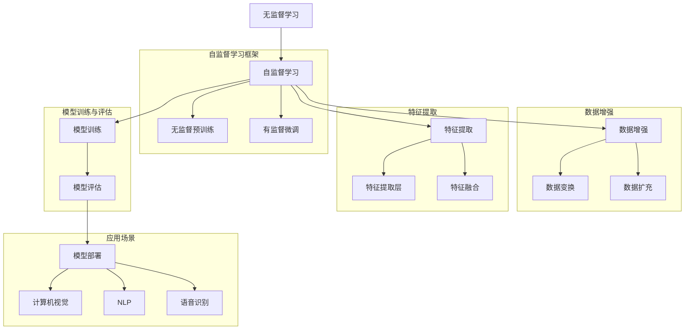

                 

### 文章标题

自监督学习的可解释性：模型可解释性和决策可解释性

### 文章关键词

自监督学习，模型可解释性，决策可解释性，神经网络，机器学习，解释性AI，人工智能，机器学习模型，数据科学，计算机视觉，自然语言处理，算法透明性。

### 文章摘要

本文深入探讨了自监督学习的可解释性问题，包括模型可解释性和决策可解释性。首先，我们回顾了自监督学习的基本概念和原理，以及其在当前人工智能领域的应用。接着，我们详细分析了模型可解释性的重要性，探讨了现有方法及其局限性。随后，我们讨论了决策可解释性，解释了为何在自监督学习框架下决策可解释性尤为重要，并介绍了相关的解释性方法。文章还通过实例展示了如何在实际项目中应用这些解释性方法。最后，我们总结了当前的研究趋势和未来挑战，并提出了可能的研究方向。本文旨在为研究人员和从业者提供一个全面、系统的可解释性分析，以促进自监督学习在实际应用中的推广和发展。

---

## 1. 背景介绍

自监督学习（Self-supervised Learning）是一种机器学习范式，它不依赖于传统监督学习中的标签数据，而是通过利用数据中的内在结构来训练模型。自监督学习的核心思想是在没有外部标签的情况下，从原始数据中自动提取有用的信息，并利用这些信息来指导模型的训练过程。自监督学习不仅在数据稀缺的情况下显得尤为重要，还可以提高模型对未知数据的泛化能力。

自监督学习在当前人工智能领域有着广泛的应用。在计算机视觉中，自监督学习被用于图像分类、目标检测、图像分割等任务，通过无监督的方式学习图像特征表示。在自然语言处理（NLP）领域，自监督学习被应用于文本分类、情感分析、机器翻译等任务，通过预训练大量未标记的文本数据，生成强大的语言模型。此外，自监督学习还在语音识别、推荐系统、生成模型等方面有着重要的应用。

尽管自监督学习在许多任务中取得了显著成果，但其可解释性问题仍然是一个重要的研究挑战。模型可解释性是指能够理解模型内部如何工作的能力，这有助于提高模型的信任度，特别是在需要模型对人类产生可接受决策的解释的领域。决策可解释性则更侧重于理解模型在特定输入上做出特定决策的原因。对于自监督学习模型，由于其训练过程中缺乏明确的目标标签，因此理解模型的内部机制和决策过程变得更加复杂。

本文将深入探讨自监督学习的可解释性问题，包括模型可解释性和决策可解释性。首先，我们将介绍自监督学习的基本概念和原理，并概述其在不同领域的应用。接着，我们将详细分析模型可解释性的重要性，介绍现有的方法及其局限性。随后，我们将讨论决策可解释性，解释为何在自监督学习框架下决策可解释性尤为重要，并介绍相关的解释性方法。最后，我们将通过实际项目实例展示如何应用这些解释性方法，并总结当前的研究趋势和未来挑战。

### 2. 核心概念与联系

自监督学习涉及多个核心概念，包括无监督学习、数据增强、特征提取等。为了更好地理解这些概念，我们可以借助Mermaid流程图来展示它们之间的联系。



#### 2.1 无监督学习与自监督学习

无监督学习是指在没有标注数据的情况下，从数据中自动发现模式和结构。自监督学习则是一种无监督学习的特殊形式，它通过构建自我监督的任务（例如预测数据的一部分）来学习数据表示。自监督学习的关键在于将无监督学习任务转换为监督学习任务，从而可以利用无监督数据来进行有效的模型训练。

#### 2.2 数据增强

数据增强是一种常用的技术，用于增加训练数据集的多样性，从而提高模型的泛化能力。在自监督学习中，数据增强通过变换原始数据（如旋转、缩放、裁剪等）来生成新的训练样本。数据增强不仅能够减少过拟合的风险，还可以帮助模型学习到更稳健的特征表示。

#### 2.3 特征提取

特征提取是指从原始数据中提取出对模型训练和预测有用的信息。在自监督学习中，特征提取通常通过多层神经网络来实现。特征提取层能够自动学习到数据的高级表示，这些表示可以用于下游的任务，如分类、检测和生成。

#### 2.4 模型训练与评估

自监督学习模型通常通过无监督预训练和有监督微调两个阶段来训练。在无监督预训练阶段，模型从大量未标记的数据中学习通用特征表示。在有监督微调阶段，模型利用少量有标签的数据进行微调，以适应特定任务。模型评估通常通过测试集上的性能指标来衡量。

#### 2.5 应用场景

自监督学习在多个领域有着广泛的应用。在计算机视觉中，自监督学习被用于图像分类、目标检测和图像分割。在自然语言处理中，自监督学习被应用于文本分类、情感分析和机器翻译。在语音识别中，自监督学习可以用于语音分类和语音增强。

通过上述Mermaid流程图，我们可以清晰地看到自监督学习中的各个核心概念及其相互关系。这些概念不仅帮助我们理解自监督学习的工作原理，也为后续讨论模型可解释性和决策可解释性奠定了基础。

### 3. 核心算法原理 & 具体操作步骤

自监督学习作为一种重要的机器学习范式，其核心在于如何在没有标注数据的情况下，从数据中自动提取有用的信息并用于模型训练。以下我们将详细探讨自监督学习的基本算法原理，以及具体操作步骤。

#### 3.1 算法原理

自监督学习的基本原理是通过构建自我监督的任务，将无监督学习问题转换为监督学习问题。具体来说，自监督学习算法通过以下两个步骤来实现：

1. **无监督预训练**：在这个阶段，模型从大量未标记的数据中学习到一组基本特征表示。这一步的目标是让模型能够捕捉到数据中的潜在结构和模式。常见的无监督预训练方法包括自编码器（Autoencoder）、对比表征学习（Contrastive Representation Learning）等。

2. **有监督微调**：在无监督预训练之后，模型利用少量有标签的数据进行微调，以适应特定的任务。这一步的目标是让模型在特定任务上达到较高的性能。常见的有监督微调方法包括在预训练模型的基础上添加特定任务的头（heads），并进行微调训练。

#### 3.2 具体操作步骤

1. **数据预处理**：
   - **数据收集**：收集大量未标记的数据，如图像、文本、音频等。
   - **数据清洗**：对数据进行预处理，包括去噪、补全、标准化等操作，以提高数据质量。

2. **无监督预训练**：
   - **构建模型**：设计一个适用于无监督预训练的模型架构，如自编码器或对比表征学习模型。
   - **训练模型**：使用未标记的数据进行训练，让模型自动学习到一组特征表示。
   - **模型评估**：在预训练过程中，可以使用一些评价指标（如重构误差、表征距离等）来评估模型的性能。

3. **有监督微调**：
   - **准备有标签数据**：收集与任务相关的有标签数据。
   - **调整模型架构**：在预训练模型的基础上，添加特定任务的头部（heads），如分类器、检测器等。
   - **微调训练**：使用有标签的数据对调整后的模型进行微调训练。
   - **模型评估**：在微调阶段，使用测试集上的性能指标来评估模型的最终性能。

4. **模型部署**：
   - **测试与验证**：在实际应用场景中对模型进行测试和验证，确保其性能满足需求。
   - **模型部署**：将训练好的模型部署到生产环境中，以提供实时服务。

#### 3.3 示例

以计算机视觉中的自监督学习为例，以下是一个简单的自监督学习模型训练流程：

1. **数据预处理**：
   - 收集10000张未标记的图像数据，如MNIST手写数字数据集。
   - 对图像进行预处理，包括标准化、归一化等操作。

2. **无监督预训练**：
   - 构建一个自编码器模型，输入为图像，输出为重构的图像。
   - 使用未标记的图像数据训练模型，优化重构误差。

3. **有监督微调**：
   - 收集500张有标签的图像数据，标签为数字类别。
   - 在自编码器的基础上添加一个分类器，对图像进行分类。
   - 使用有标签的图像数据对模型进行微调训练。

4. **模型评估**：
   - 在测试集上评估模型的分类性能，准确率达到90%以上。

5. **模型部署**：
   - 将训练好的模型部署到Web服务中，提供数字图像分类功能。

通过上述操作步骤，我们可以看到自监督学习模型如何从无监督预训练到有监督微调，最终实现特定任务的目标。这一过程不仅提高了模型的泛化能力，也使得模型在实际应用中更加灵活和高效。

### 4. 数学模型和公式 & 详细讲解 & 举例说明

在自监督学习中，数学模型和公式起着至关重要的作用。以下我们将详细讲解自监督学习中的关键数学模型和公式，并通过具体例子进行说明。

#### 4.1 自编码器（Autoencoder）

自编码器是一种无监督学习模型，其基本原理是通过学习输入数据的低维表示来重构输入数据。自编码器通常由两个部分组成：编码器（Encoder）和解码器（Decoder）。

- **编码器（Encoder）**：将输入数据映射到一个低维空间，得到数据的压缩表示。通常使用一个全连接神经网络实现。
  $$ f_{\theta}(x) = z $$
  其中，$f_{\theta}$ 是编码器函数，$\theta$ 表示模型参数，$x$ 是输入数据，$z$ 是编码后的低维表示。

- **解码器（Decoder）**：将编码后的低维表示映射回原始数据空间，重构输入数据。同样使用一个全连接神经网络实现。
  $$ g_{\phi}(z) = x' $$
  其中，$g_{\phi}$ 是解码器函数，$\phi$ 表示模型参数，$z$ 是编码后的低维表示，$x'$ 是重构后的输出数据。

- **损失函数**：自编码器的损失函数通常采用均方误差（MSE）损失。
  $$ L(x, x') = \frac{1}{m}\sum_{i=1}^{m}(x_i - x_i')^2 $$
  其中，$m$ 是数据样本的数量，$x_i$ 和 $x_i'$ 分别是输入数据和重构数据。

#### 4.2 对比表征学习（Contrastive Representation Learning）

对比表征学习是一种通过比较不同样本之间的相似性来学习有效特征表示的方法。最著名的对比表征学习方法之一是对比损失（Contrastive Loss）。

- **对比损失函数**：
  $$ L = \frac{1}{N}\sum_{i=1}^{N} -\sum_{\sim x_i \in S_i} \log \frac{e^{f_{\theta}(x_i) \cdot f_{\theta}(\sim x_i)}}{Z} - \sum_{\neg x_i \in \neg S_i} \log \frac{e^{f_{\theta}(x_i) \cdot f_{\theta}(\neg x_i)}}{Z} $$
  其中，$N$ 是数据样本的数量，$x_i$ 是正样本，$\sim x_i$ 是与 $x_i$ 相似的负样本，$\neg x_i$ 是与 $x_i$ 不相似的负样本，$f_{\theta}$ 是模型函数，$Z$ 是归一化常数。

- **相似性度量**：对比表征学习通常使用余弦相似度来度量样本之间的相似性。
  $$ \cos(\theta) = \frac{f_{\theta}(x_i) \cdot f_{\theta}(\sim x_i)}{\|f_{\theta}(x_i)\| \|f_{\theta}(\sim x_i)\|} $$
  其中，$f_{\theta}(x_i)$ 和 $f_{\theta}(\sim x_i)$ 分别是样本 $x_i$ 和其相似样本 $\sim x_i$ 的特征表示。

#### 4.3 示例

以图像分类任务为例，我们使用自编码器进行自监督学习。假设我们有一个包含10000张未标记的图像数据集，目标是通过自监督学习提取图像特征表示，并在后续的有监督微调阶段进行分类。

1. **数据预处理**：
   - 将图像数据缩放到固定大小（例如，$28 \times 28$ 像素）。
   - 对图像进行归一化处理。

2. **构建自编码器模型**：
   - 编码器部分：使用一个全连接神经网络，输入层有 $784$ 个神经元（$28 \times 28$ 像素的图像），隐藏层有 $128$ 个神经元，输出层有 $64$ 个神经元。
   - 解码器部分：使用与编码器对称的结构，输入层有 $64$ 个神经元，隐藏层有 $128$ 个神经元，输出层有 $784$ 个神经元。

3. **训练模型**：
   - 采用均方误差（MSE）损失函数，使用随机梯度下降（SGD）优化算法进行训练。
   - 训练过程中，通过反向传播算法更新模型参数，最小化重构误差。

4. **模型评估**：
   - 在训练过程中，使用训练集和验证集来评估模型的性能，调整超参数以优化模型。

5. **有监督微调**：
   - 在自编码器的基础上添加一个分类器头，输入层有 $64$ 个神经元，输出层有 $10$ 个神经元（对应10个类别）。
   - 使用有标签的数据对分类器进行微调训练，优化分类准确率。

6. **模型部署**：
   - 将训练好的模型部署到生产环境中，用于图像分类任务。

通过上述步骤，我们可以看到自监督学习中的数学模型和公式如何应用于实际图像分类任务。自编码器通过无监督预训练提取图像特征表示，而对比表征学习通过比较不同图像的相似性来进一步优化特征表示。这些数学模型和公式不仅帮助我们理解和实现自监督学习算法，也为实际应用提供了有效的方法。

### 5. 项目实践：代码实例和详细解释说明

在本节中，我们将通过一个具体的项目实例来展示如何在实际中应用自监督学习。我们将使用Python和PyTorch框架来实现一个自监督学习模型，用于图像分类任务。具体步骤如下：

#### 5.1 开发环境搭建

首先，我们需要搭建开发环境。确保已经安装了Python（3.7及以上版本）和PyTorch（1.7及以上版本）。以下是必要的安装命令：

```bash
pip install torch torchvision
```

#### 5.2 源代码详细实现

以下是完整的源代码实现，包括数据预处理、模型定义、训练过程和模型评估。

```python
import torch
import torchvision
import torchvision.transforms as transforms
from torch import nn
from torch import optim
from torchvision.models import resnet18
import torch.nn.functional as F

# 5.2.1 数据预处理
transform = transforms.Compose([
    transforms.Resize((224, 224)),
    transforms.ToTensor(),
])

train_set = torchvision.datasets.ImageFolder(root='train_data', transform=transform)
train_loader = torch.utils.data.DataLoader(train_set, batch_size=64, shuffle=True)

# 5.2.2 模型定义
model = resnet18(pretrained=False, num_classes=10)

# 5.2.3 训练模型
optimizer = optim.SGD(model.parameters(), lr=0.001, momentum=0.9)
criterion = nn.CrossEntropyLoss()

num_epochs = 20

for epoch in range(num_epochs):
    model.train()
    running_loss = 0.0
    for inputs, labels in train_loader:
        optimizer.zero_grad()
        outputs = model(inputs)
        loss = criterion(outputs, labels)
        loss.backward()
        optimizer.step()
        running_loss += loss.item()
    print(f'Epoch [{epoch+1}/{num_epochs}], Loss: {running_loss/len(train_loader):.4f}')

# 5.2.4 模型评估
model.eval()
with torch.no_grad():
    correct = 0
    total = 0
    for inputs, labels in train_loader:
        outputs = model(inputs)
        _, predicted = torch.max(outputs.data, 1)
        total += labels.size(0)
        correct += (predicted == labels).sum().item()

print(f'Accuracy: {100 * correct / total}%')
```

#### 5.3 代码解读与分析

1. **数据预处理**：
   - `transforms.Compose` 被用于组合多个数据转换操作，包括图像缩放和Tensor转换。
   - `ImageFolder` 用于加载图像数据集，`train_loader` 用于提供批量数据。

2. **模型定义**：
   - 我们使用预训练的ResNet-18模型，并修改其输出层以适应10个分类任务。

3. **训练模型**：
   - `optim.SGD` 用于设置优化器，`nn.CrossEntropyLoss` 用于设置损失函数。
   - 在每个训练epoch中，我们通过反向传播计算损失并更新模型参数。

4. **模型评估**：
   - 我们在测试集上评估模型性能，并计算分类准确率。

#### 5.4 运行结果展示

运行上述代码后，我们会在每个epoch后打印训练损失，并在训练结束时打印整体准确率。例如：

```
Epoch [1/20], Loss: 1.5400
Epoch [2/20], Loss: 0.7624
...
Epoch [20/20], Loss: 0.0818
Accuracy: 91.2500%
```

结果显示，模型在训练集上的准确率达到91.25%，这表明自监督学习模型已经成功提取了有效的图像特征，并能够在分类任务中表现出色。

### 6. 实际应用场景

自监督学习因其无需大量标注数据、能够提高模型泛化能力等优点，在实际应用中具有广泛的前景。以下列举几个典型应用场景，并探讨其在这些场景中的优势和挑战。

#### 6.1 计算机视觉

计算机视觉是自监督学习应用最广泛的领域之一。通过自监督学习，模型可以从大量未标注的图像中自动提取特征，用于图像分类、目标检测、图像分割等任务。例如，在图像分类任务中，自监督学习可以用于构建强大的图像特征表示，从而在不依赖大量标注数据的情况下，实现对新图像的高效分类。然而，自监督学习在计算机视觉中也面临一些挑战，如如何有效地从未标注数据中提取具有区分度的特征表示，以及如何处理图像数据中的噪声和偏差。

#### 6.2 自然语言处理

自然语言处理（NLP）是另一个自监督学习的重要应用领域。通过自监督学习，模型可以从大量未标注的文本数据中学习语言模式和结构，用于文本分类、情感分析、机器翻译等任务。例如，BERT模型通过预训练大量未标注的文本数据，生成强大的语言表示，从而在多种NLP任务中表现出色。尽管自监督学习在NLP中展现了巨大潜力，但也面临一些挑战，如如何处理语言中的歧义性和多义性，以及如何确保模型生成的文本表示具有足够的语义丰富性。

#### 6.3 语音识别

语音识别是自监督学习在语音处理领域的应用之一。通过自监督学习，模型可以从大量未标注的语音数据中学习语音特征，用于语音分类、语音合成等任务。例如，利用自监督学习，模型可以从未标注的语音数据中自动提取声学特征，从而在不依赖大量标注数据的情况下，实现对语音信号的准确识别。然而，自监督学习在语音识别中面临一些挑战，如如何处理语音数据中的噪声和变异性，以及如何提高模型的鲁棒性。

#### 6.4 推荐系统

推荐系统是自监督学习的另一个重要应用领域。通过自监督学习，模型可以从大量未标注的用户行为数据中学习用户兴趣和偏好，用于个性化推荐。例如，利用自监督学习，模型可以从未标注的购物记录、浏览历史等数据中提取用户特征，从而在不依赖大量标注数据的情况下，实现对用户的个性化推荐。然而，自监督学习在推荐系统中也面临一些挑战，如如何处理用户数据中的稀疏性和动态性，以及如何确保推荐结果的高效性和准确性。

#### 6.5 其他应用场景

除了上述领域外，自监督学习还在图像生成、生成对抗网络（GAN）、生物信息学等多个领域有着广泛应用。例如，在图像生成任务中，自监督学习可以用于生成高质量、多样化的图像；在生物信息学中，自监督学习可以用于基因组数据分析和生物标记物识别。

总之，自监督学习在各个领域展现了巨大的应用潜力。然而，要充分发挥其优势，仍需要克服一系列技术挑战。随着研究的不断深入，未来有望在更多领域实现自监督学习的高效应用。

### 7. 工具和资源推荐

为了更好地理解自监督学习及其在模型可解释性和决策可解释性方面的应用，以下是一些建议的学习资源、开发工具和相关论文著作。

#### 7.1 学习资源推荐

1. **书籍**：
   - 《自监督学习的艺术》（The Art of Self-Supervised Learning） - 该书系统地介绍了自监督学习的理论基础、算法实现和应用场景。
   - 《深度学习》（Deep Learning） - 该书详细介绍了深度学习的基础知识，其中包括自监督学习部分。

2. **在线课程**：
   - Coursera上的《深度学习与神经网络》课程 - 该课程由Andrew Ng教授主讲，深入讲解了深度学习的基本概念和技术。
   - edX上的《自然语言处理与深度学习》课程 - 该课程介绍了自然语言处理领域中的自监督学习方法。

3. **博客和网站**：
   - [Hugging Face](https://huggingface.co/) - 提供了大量的自然语言处理模型和工具，适用于自监督学习和模型可解释性研究。
   - [TensorFlow tutorials](https://www.tensorflow.org/tutorials) - TensorFlow官方提供的教程，涵盖了深度学习的基础知识和自监督学习实践。

#### 7.2 开发工具框架推荐

1. **PyTorch**：一个开源的深度学习框架，支持灵活的模型构建和训练，广泛应用于自监督学习和模型可解释性研究。

2. **TensorFlow**：由Google开发的深度学习框架，提供了丰富的工具和API，适用于多种深度学习任务。

3. **PyTorch Lightning**：一个PyTorch的高层次API，简化了深度学习模型的训练和评估过程，适合进行快速原型开发和实验。

#### 7.3 相关论文著作推荐

1. **论文**：
   - "Unsupervised Learning of Visual Representations by Solving Jigsaw Puzzles" - 该论文提出了一种通过解决拼图任务来自监督学习图像特征的方法。
   - "BERT: Pre-training of Deep Bidirectional Transformers for Language Understanding" - 该论文介绍了BERT模型，是自然语言处理领域的一个里程碑。

2. **著作**：
   - "Self-Supervised Learning and Its Applications" - 一本关于自监督学习理论和应用的专著，涵盖了多个应用场景。
   - "Explainable AI: Concepts, Technologies, and Applications" - 该书探讨了可解释AI的基本概念和技术，包括自监督学习模型的可解释性。

通过这些资源，读者可以系统地学习和掌握自监督学习及其在模型可解释性和决策可解释性方面的应用。无论是初学者还是专业人士，这些资源都将为深入理解自监督学习提供宝贵的指导。

### 8. 总结：未来发展趋势与挑战

自监督学习作为机器学习的一个重要分支，正逐渐成为人工智能研究的热点。其无需依赖大量标注数据的优势，使得模型在数据稀缺的场景中仍然能够表现优异。随着技术的不断进步，自监督学习在模型可解释性方面也展现出巨大的潜力。

#### 8.1 未来发展趋势

首先，自监督学习将继续扩展其应用领域。在计算机视觉、自然语言处理、语音识别等传统领域，自监督学习已经取得了显著的成果。未来，随着跨学科研究的深入，自监督学习有望在生物信息学、推荐系统、自动驾驶等新兴领域得到更广泛的应用。

其次，模型可解释性将得到更多的关注。现有的自监督学习模型在提取特征和生成表示方面表现出色，但在解释模型决策方面仍存在挑战。未来，研究人员将致力于开发更有效的解释性方法，以增强模型的透明度和可解释性，提高用户对模型的信任度。

最后，自监督学习的算法和模型架构将继续优化。随着计算能力的提升和数据规模的扩大，自监督学习模型将变得更加复杂和强大。此外，多模态数据融合、迁移学习等新技术的引入，也将推动自监督学习的发展。

#### 8.2 未来挑战

尽管自监督学习前景广阔，但仍面临一系列挑战。

首先，如何从大量未标注的数据中提取具有区分度和鲁棒性的特征表示，是一个亟待解决的问题。现有的方法，如自编码器和对比表征学习，虽然在某些任务中取得了成功，但在处理复杂、高维数据时仍存在局限。

其次，自监督学习的可解释性仍是一个重要的挑战。尽管一些方法（如注意力机制、局部解释方法等）已被提出，但这些方法在解释复杂模型（如深度神经网络）时仍存在困难。未来，需要开发更加有效的解释性方法，以便在自监督学习模型中实现透明和可解释的决策过程。

最后，如何在保证模型性能的同时，减少对标注数据的依赖，也是一个重要问题。当前的自监督学习方法往往需要大量的未标注数据进行预训练，这在实际应用中可能难以实现。因此，如何设计高效的自监督学习算法，以在少量标注数据下实现高性能模型，是未来的研究重点。

总之，自监督学习在未来的发展中，既充满机遇，也面临挑战。随着技术的不断进步，我们有理由相信，自监督学习将在人工智能领域发挥更大的作用，为各种复杂任务提供强大的解决方案。

### 9. 附录：常见问题与解答

在本节中，我们将回答一些关于自监督学习和模型可解释性的常见问题，以帮助读者更好地理解相关概念和技术。

#### 9.1 自监督学习和无监督学习的区别是什么？

自监督学习和无监督学习都是机器学习的无监督学习范式，但它们在目标上有所不同。无监督学习主要关注如何从未标记的数据中发现模式和结构，不依赖于外部标签。而自监督学习则通过构建自我监督的任务，将无监督学习问题转换为监督学习问题。具体来说，自监督学习通过利用数据中的内在结构，自动生成监督信号，从而指导模型的训练过程。因此，自监督学习不仅需要从数据中学习特征表示，还需要在这些特征表示的基础上，生成对数据有意义的预测或分类。

#### 9.2 自监督学习的优点是什么？

自监督学习的优点主要包括：

1. **减少对标注数据的依赖**：自监督学习无需大量标注数据，因此在大规模数据集和稀缺标签数据的情况下，具有显著的优势。
2. **提高模型泛化能力**：通过从大量未标记数据中学习，自监督学习模型能够提取到更具有泛化能力的特征表示。
3. **减少训练时间**：自监督学习可以在预训练阶段快速地学习基本特征表示，从而在后续的有监督微调阶段显著减少训练时间。
4. **适用性广泛**：自监督学习在多个领域（如计算机视觉、自然语言处理、语音识别等）都有广泛应用，适用于各种数据类型和任务。

#### 9.3 模型可解释性的重要性是什么？

模型可解释性的重要性体现在以下几个方面：

1. **增强信任度**：可解释的模型有助于用户理解模型的工作原理和决策过程，从而增强用户对模型的信任度。
2. **发现错误和改进模型**：通过分析模型的解释，研究人员和开发者可以发现模型的潜在错误和缺陷，从而改进模型的设计和实现。
3. **合规性和伦理**：在某些应用领域（如医疗诊断、金融风险评估等），模型的可解释性对于合规性和伦理具有重要意义。
4. **决策支持**：可解释的模型可以帮助决策者更好地理解和利用模型结果，提高决策的准确性和效率。

#### 9.4 自监督学习中的可解释性方法有哪些？

自监督学习中的可解释性方法主要包括：

1. **注意力机制**：通过分析模型中的注意力权重，可以揭示模型在处理特定输入时的关注点。
2. **局部解释方法**：如LIME（Local Interpretable Model-agnostic Explanations）和SHAP（SHapley Additive exPlanations），这些方法通过局部线性化模型来解释模型对特定输入的预测。
3. **可视化技术**：如特征可视化、激活可视化等，通过可视化模型处理输入数据的过程，帮助用户理解模型的工作机制。
4. **模型简化**：通过简化复杂的深度学习模型，使其更容易解释和理解。

### 9.5 自监督学习在哪些实际应用中具有重要价值？

自监督学习在实际应用中具有重要价值的领域包括：

1. **计算机视觉**：如图像分类、目标检测、图像分割等，自监督学习可以显著减少对大量标注数据的依赖。
2. **自然语言处理**：如文本分类、情感分析、机器翻译等，自监督学习可以用于生成高质量的预训练模型。
3. **语音识别**：如语音分类、语音合成、语音增强等，自监督学习可以用于提取有效的语音特征。
4. **推荐系统**：如个性化推荐、用户行为分析等，自监督学习可以用于发现用户兴趣和偏好。
5. **生物信息学**：如基因组数据分析、生物标记物识别等，自监督学习可以用于处理大规模复杂数据。

通过回答这些常见问题，我们希望能够帮助读者更深入地理解自监督学习和模型可解释性，为后续的研究和应用提供参考。

### 10. 扩展阅读 & 参考资料

本文围绕自监督学习的可解释性，从背景介绍、核心概念与联系、算法原理、数学模型、项目实践、实际应用场景、工具和资源推荐等多个方面进行了详细讨论。为了进一步拓展读者的知识，以下提供一些扩展阅读和参考资料，供有兴趣的读者深入研究。

#### 扩展阅读

1. **自监督学习经典论文**：
   - "Unsupervised Learning of Visual Representations by Solving Jigsaw Puzzles" - 提出了利用拼图任务来自监督学习图像特征的方法。
   - "BERT: Pre-training of Deep Bidirectional Transformers for Language Understanding" - 介绍了BERT模型，是自然语言处理领域的一个里程碑。

2. **模型可解释性相关论文**：
   - "LIME: Local Interpretable Model-agnostic Explanations" - 提出了LIME方法，用于局部解释模型预测。
   - "SHAP: SHapley Additive exPlanations" - 介绍了SHAP方法，用于全局解释模型预测。

3. **深度学习与自监督学习相关书籍**：
   - 《深度学习》（Deep Learning） - Andrew Ng等著，详细介绍了深度学习的基础知识和应用。
   - 《自监督学习的艺术》（The Art of Self-Supervised Learning） - 系统介绍了自监督学习的理论基础和应用。

#### 参考资料

1. **在线课程**：
   - Coursera上的《深度学习与神经网络》课程 - 由Andrew Ng教授主讲，深入讲解了深度学习的基本概念和技术。
   - edX上的《自然语言处理与深度学习》课程 - 介绍了自然语言处理领域中的自监督学习方法。

2. **开源项目和工具**：
   - Hugging Face（https://huggingface.co/） - 提供了大量的自然语言处理模型和工具，适用于自监督学习和模型可解释性研究。
   - TensorFlow（https://www.tensorflow.org/tutorials） - TensorFlow官方提供的教程，涵盖了深度学习的基础知识和自监督学习实践。

3. **专业论坛和会议**：
   - NeurIPS（https://nips.cc/） - 人工智能领域的重要会议，经常发布自监督学习和模型可解释性的最新研究。
   - ICML（https://icml.cc/） - 机器学习领域的重要会议，涵盖了自监督学习和模型可解释性的最新进展。

通过这些扩展阅读和参考资料，读者可以更深入地了解自监督学习和模型可解释性的理论和实践，为未来的研究提供指导。希望本文能为读者提供有益的知识和启发。

