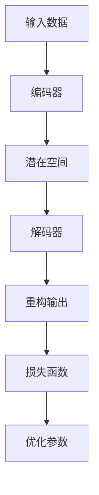

                 

### 背景介绍

自编码器（Autoencoders）是深度学习中的一种重要类型，主要用于数据降维、特征提取和异常检测等任务。它们在近年来取得了显著的进展，被广泛应用于图像处理、自然语言处理、音频分析等众多领域。自编码器的出现，是深度学习领域的一个重要里程碑，它不仅为数据降维提供了新的思路，也为特征学习带来了更多的可能性。

自编码器的核心思想是将输入数据通过一个编码器（encoder）映射到一个低维空间，然后通过一个解码器（decoder）重构原始数据。在这个过程中，自编码器试图找到输入数据的潜在表示，从而实现数据的降维和特征提取。自编码器之所以受到广泛关注，是因为它不仅可以用于数据预处理，还可以用于生成模型，甚至可以用于图像风格迁移等复杂任务。

在图像处理领域，自编码器被广泛用于人脸识别、图像分类、图像超分辨率等任务。例如，在人脸识别中，自编码器可以提取人脸图像的潜在特征，从而提高识别准确率。在图像分类中，自编码器可以用来提取图像的特征，从而提高分类器的性能。在图像超分辨率中，自编码器可以用来生成高分辨率的图像，从而提高图像的质量。

在自然语言处理领域，自编码器被用于文本生成、机器翻译、情感分析等任务。例如，在文本生成中，自编码器可以用来生成新的文本，从而提高自然语言生成的质量。在机器翻译中，自编码器可以用来提取源语言和目标语言的潜在特征，从而提高翻译的准确率。在情感分析中，自编码器可以用来提取文本的潜在情感特征，从而提高情感分析的性能。

在音频分析领域，自编码器被用于声音识别、音乐生成、语音合成等任务。例如，在声音识别中，自编码器可以用来提取声音的潜在特征，从而提高识别的准确率。在音乐生成中，自编码器可以用来生成新的音乐，从而提高音乐创作的效率。在语音合成中，自编码器可以用来生成自然的语音，从而提高语音合成的质量。

总的来说，自编码器作为一种强大的深度学习工具，已经在各个领域得到了广泛的应用。本文将详细介绍自编码器的工作原理、数学模型、实现步骤以及实际应用场景，帮助读者更好地理解和掌握自编码器的使用方法。

### 核心概念与联系

要深入理解自编码器，首先需要了解其核心概念和组成部分，包括编码器（Encoder）、解码器（Decoder）以及损失函数（Loss Function）。以下是这些核心概念及其相互关系的详细解释。

#### 编码器（Encoder）

编码器是自编码器的核心组成部分，其主要功能是将输入数据映射到一个低维空间，即潜在空间（Latent Space）。这个映射过程通常是一个非线性变换，其目的是提取输入数据的本质特征，同时丢弃一些无关或冗余的信息。编码器通常由多层全连接神经网络组成，每一层都包含大量的神经元，并通过非线性激活函数（如ReLU、Sigmoid、Tanh等）进行数据转换。

#### 解码器（Decoder）

解码器是与编码器相对应的部分，其功能是将编码器输出的潜在空间数据重新映射回原始数据空间。解码器也由多层全连接神经网络组成，其结构与编码器类似，但通常会有更多的层次，以便更好地恢复原始数据。解码器的目标是使重构的输出与原始输入尽可能接近。

#### 潜在空间（Latent Space）

潜在空间是自编码器中的一个关键概念，它是一个低维空间，用于存储输入数据的潜在表示。这个空间的设计目的是使得相似的数据在空间中靠近，而不同的数据则相隔较远。潜在空间不仅有助于数据的降维，还使得数据可视化变得更加直观。

#### 损失函数（Loss Function）

损失函数是衡量编码器和解码器性能的重要指标，其目的是最小化重构误差。常见的损失函数包括均方误差（MSE）和交叉熵（Cross-Entropy）等。均方误差衡量的是重构数据与原始数据之间的差异，而交叉熵则用于分类问题中，衡量的是预测标签与真实标签之间的差异。在自编码器中，损失函数通常用于优化编码器和解码器的参数，以最小化重构误差。

#### Mermaid 流程图

为了更好地理解自编码器的工作原理和组成部分，我们可以使用Mermaid流程图来展示其核心流程。以下是自编码器的Mermaid流程图：



在这个流程图中，输入数据首先通过编码器进行编码，得到潜在空间中的表示，然后这个表示通过解码器被解码回原始数据空间。最后，重构输出与原始输入之间的差异通过损失函数来计算，以指导参数的优化。

#### 编码器和解码器的具体操作

1. **编码器**：输入数据经过编码器，通过一系列的线性变换和非线性激活函数，最终得到潜在空间中的表示。
    ```mermaid
    graph TD
        A[输入数据] --> B[线性变换]
        B --> C[ReLU激活]
        C --> D[线性变换]
        D --> E[ReLU激活]
        E --> F[编码器输出]
    ```

2. **解码器**：编码器的输出通过解码器，通过一系列的线性变换和非线性激活函数，最终重构回原始数据。
    ```mermaid
    graph TD
        A[编码器输出] --> B[线性变换]
        B --> C[Tanh激活]
        C --> D[线性变换]
        D --> E[Tanh激活]
        E --> F[重构输出]
    ```

3. **潜在空间**：潜在空间中的表示，用于存储数据的特征信息，是编码器和解码器共同作用的结果。
    ```mermaid
    graph TD
        A[编码器输出] --> B[潜在空间]
    ```

4. **损失函数**：损失函数用于衡量重构输出与原始输入之间的差异，如均方误差（MSE）。
    ```mermaid
    graph TD
        A[重构输出] --> B[MSE损失函数]
        B --> C[误差值]
    ```

通过以上对自编码器核心概念和操作步骤的详细解释，我们可以更好地理解自编码器的工作原理和其在数据降维和特征提取中的应用。接下来，我们将深入探讨自编码器的数学模型和具体操作步骤。

### 核心算法原理 & 具体操作步骤

自编码器作为一种无监督学习模型，其核心算法原理主要涉及编码器和解码器的构建以及损失函数的优化。下面将详细解释这些步骤，并展示具体的实现过程。

#### 编码器（Encoder）的构建

编码器是自编码器的前端，其主要任务是接受输入数据并将其映射到一个低维潜在空间。这一过程通常通过一个多层神经网络实现，每一层都通过线性变换和激活函数进行处理。

1. **数据预处理**：在构建编码器之前，需要将输入数据进行预处理，包括标准化和归一化等操作，以便神经网络更好地收敛。

2. **构建神经网络结构**：编码器通常由多个全连接层组成，每一层通过一个线性变换和一个非线性激活函数（如ReLU）进行数据处理。例如，一个简单的三层编码器结构如下：
    ```mermaid
    graph TD
        A[输入] --> B[全连接层1]
        B --> C[ReLU激活]
        C --> D[全连接层2]
        D --> E[ReLU激活]
        E --> F[全连接层3]
        F --> G[编码器输出]
    ```

3. **实现编码过程**：在神经网络中，输入数据首先通过第一层全连接层进行线性变换，然后通过ReLU激活函数进行非线性转换。这个过程重复进行，直到最后一层，输出潜在空间中的表示。

#### 解码器（Decoder）的构建

解码器是自编码器的后端，其主要任务是将编码器输出的潜在空间表示重新映射回原始数据空间。与编码器类似，解码器也是一个多层神经网络，其结构通常与编码器对称。

1. **构建神经网络结构**：解码器由多个全连接层组成，每一层也通过线性变换和激活函数进行处理。例如，一个简单的三层解码器结构如下：
    ```mermaid
    graph TD
        A[编码器输出] --> B[全连接层1]
        B --> C[Tanh激活]
        C --> D[全连接层2]
        D --> E[Tanh激活]
        E --> F[全连接层3]
        F --> G[重构输出]
    ```

2. **实现解码过程**：解码器首先通过第一层全连接层将潜在空间表示映射回原始数据空间，然后通过Tanh激活函数进行非线性转换。这个过程同样重复进行，直到最后一层，输出重构的原始数据。

#### 损失函数的优化

自编码器的训练过程实际上是不断优化编码器和解码器的参数，使其重构的输出与原始输入尽可能接近。这一过程通常通过最小化损失函数来实现。

1. **选择损失函数**：常见的损失函数包括均方误差（MSE）和交叉熵（Cross-Entropy）。MSE用于回归任务，衡量的是输出值与真实值之间的差异；交叉熵则用于分类任务，衡量的是预测概率与真实概率之间的差异。在自编码器中，MSE是一个常见的选择。

2. **计算损失值**：损失函数的计算公式通常为：
    $$L = \frac{1}{n}\sum_{i=1}^{n}(y_i - x_i)^2$$
    其中，$y_i$是重构输出，$x_i$是原始输入，$n$是样本数量。

3. **优化参数**：通过梯度下降算法（如Stochastic Gradient Descent，SGD）来优化编码器和解码器的参数，以最小化损失函数。具体实现步骤如下：
    - 计算损失函数关于每个参数的梯度；
    - 更新每个参数的值，以减小损失值。

#### 具体实现步骤

以下是一个简单的自编码器实现示例，使用Python和TensorFlow框架：

1. **导入依赖库**：
    ```python
    import tensorflow as tf
    import numpy as np
    ```

2. **定义输入层**：
    ```python
    input_data = tf.keras.layers.Input(shape=(784,))  # 784是输入数据的维度
    ```

3. **构建编码器**：
    ```python
    encoded = tf.keras.layers.Dense(64, activation='relu')(input_data)
    encoded = tf.keras.layers.Dense(32, activation='relu')(encoded)
    encoded = tf.keras.layers.Dense(16, activation='relu')(encoded)
    encoder_output = tf.keras.layers.Dense(10, activation='relu')(encoded)  # 潜在空间维度为10
    ```

4. **构建解码器**：
    ```python
    decoded = tf.keras.layers.Dense(16, activation='tanh')(encoder_output)
    decoded = tf.keras.layers.Dense(32, activation='tanh')(decoded)
    decoded = tf.keras.layers.Dense(64, activation='tanh')(decoded)
    decoded = tf.keras.layers.Dense(784, activation='tanh')(decoded)
    ```

5. **构建自编码器模型**：
    ```python
    autoencoder = tf.keras.Model(inputs=input_data, outputs=decoded)
    ```

6. **编译模型**：
    ```python
    autoencoder.compile(optimizer='adam', loss='mean_squared_error')
    ```

7. **训练模型**：
    ```python
    (x_train, _), (x_test, _) = tf.keras.datasets.mnist.load_data()
    x_train = x_train / 255.0
    x_test = x_test / 255.0
    autoencoder.fit(x_train, x_train, epochs=50, batch_size=256, shuffle=True, validation_data=(x_test, x_test))
    ```

通过以上步骤，我们可以实现一个简单的自编码器模型，并使用MNIST数据集进行训练和测试。在实际应用中，可以根据具体任务需求调整编码器和解码器的结构，以及选择合适的损失函数和优化器。

#### 实现流程

为了更清晰地展示自编码器的实现流程，我们可以将其分为以下几个步骤：

1. **数据准备**：准备输入数据，并进行预处理（如标准化和归一化）。
2. **模型构建**：定义编码器和解码器的结构，并构建自编码器模型。
3. **模型编译**：设置优化器和损失函数，准备训练。
4. **模型训练**：使用训练数据训练模型，不断优化编码器和解码器的参数。
5. **模型评估**：使用测试数据评估模型性能，验证重构输出与原始输入的接近程度。

通过以上步骤，我们可以构建和训练一个自编码器模型，并应用于数据降维和特征提取等任务。

### 数学模型和公式 & 详细讲解 & 举例说明

在深入探讨自编码器的数学模型之前，首先需要理解神经网络中的基本概念，如线性变换、激活函数、梯度下降等。接下来，我们将详细讲解自编码器的数学公式，并通过具体示例来说明这些公式的应用。

#### 线性变换与激活函数

在自编码器中，线性变换和激活函数是核心组成部分。线性变换可以将输入数据映射到高维空间，而激活函数则引入了非线性特性，使得神经网络能够捕捉复杂的数据模式。

1. **线性变换**：
   线性变换可以用矩阵乘法来表示，其公式为：
   $$z = X \cdot W + b$$
   其中，$X$是输入数据矩阵，$W$是权重矩阵，$b$是偏置项。$z$是线性变换的结果。

2. **激活函数**：
   常见的激活函数包括ReLU（Rectified Linear Unit）、Sigmoid、Tanh等。其中，ReLU函数由于其简单的形式和良好的训练效果，在深度学习中得到了广泛应用。ReLU函数的公式为：
   $$a = max(0, x)$$
   其中，$x$是输入值，$a$是输出值。

#### 自编码器的数学模型

自编码器由编码器和解码器组成，其数学模型可以表示为：

1. **编码器**：
   编码器的目标是将输入数据映射到一个低维潜在空间，其公式为：
   $$z = f_{\theta_E}(X) = \sigma(W_E \cdot X + b_E)$$
   其中，$X$是输入数据，$W_E$是编码器的权重矩阵，$b_E$是编码器的偏置项，$\sigma$是激活函数（通常为ReLU函数），$z$是编码器的输出，即潜在空间中的表示。

2. **解码器**：
   解码器的目标是根据编码器输出的潜在空间表示重构原始数据，其公式为：
   $$X' = f_{\theta_D}(z) = \sigma(W_D \cdot z + b_D)$$
   其中，$X'$是重构后的数据，$W_D$是解码器的权重矩阵，$b_D$是解码器的偏置项，$\sigma$是激活函数（通常为Tanh函数），$z$是编码器的输出，即潜在空间中的表示。

3. **整体模型**：
   自编码器的整体模型可以表示为：
   $$X' = f_{\theta_D}(\sigma(W_E \cdot X + b_E))$$
   其中，$X'$是重构后的数据，$X$是输入数据，$\theta_E$和$\theta_D$分别是编码器和解码器的参数。

#### 损失函数

自编码器的训练目标是最小化重构误差，这通常通过定义损失函数来实现。常见的损失函数包括均方误差（MSE）和交叉熵（Cross-Entropy）。在这里，我们将使用均方误差（MSE）作为损失函数。

均方误差（MSE）的公式为：
$$L = \frac{1}{n}\sum_{i=1}^{n}(X_i - X'_i)^2$$
其中，$L$是损失函数，$n$是样本数量，$X_i$是第$i$个样本的输入值，$X'_i$是第$i$个样本的重构值。

#### 梯度下降

为了优化自编码器的参数，通常使用梯度下降算法。梯度下降的目标是最小化损失函数，其公式为：
$$\theta = \theta - \alpha \cdot \nabla_\theta L$$
其中，$\theta$是模型参数，$\alpha$是学习率，$\nabla_\theta L$是损失函数关于参数$\theta$的梯度。

#### 具体示例

以下是一个简单的自编码器示例，使用Python和TensorFlow框架：

1. **导入依赖库**：
   ```python
   import tensorflow as tf
   import numpy as np
   ```

2. **定义输入层**：
   ```python
   input_data = tf.keras.layers.Input(shape=(784,))  # 784是输入数据的维度
   ```

3. **构建编码器**：
   ```python
   encoded = tf.keras.layers.Dense(64, activation='relu')(input_data)
   encoded = tf.keras.layers.Dense(32, activation='relu')(encoded)
   encoded = tf.keras.layers.Dense(16, activation='relu')(encoded)
   encoder_output = tf.keras.layers.Dense(10, activation='relu')(encoded)  # 潜在空间维度为10
   ```

4. **构建解码器**：
   ```python
   decoded = tf.keras.layers.Dense(16, activation='tanh')(encoder_output)
   decoded = tf.keras.layers.Dense(32, activation='tanh')(decoded)
   decoded = tf.keras.layers.Dense(64, activation='tanh')(decoded)
   decoded = tf.keras.layers.Dense(784, activation='tanh')(decoded)
   ```

5. **构建自编码器模型**：
   ```python
   autoencoder = tf.keras.Model(inputs=input_data, outputs=decoded)
   ```

6. **编译模型**：
   ```python
   autoencoder.compile(optimizer='adam', loss='mean_squared_error')
   ```

7. **训练模型**：
   ```python
   (x_train, _), (x_test, _) = tf.keras.datasets.mnist.load_data()
   x_train = x_train / 255.0
   x_test = x_test / 255.0
   autoencoder.fit(x_train, x_train, epochs=50, batch_size=256, shuffle=True, validation_data=(x_test, x_test))
   ```

在这个示例中，我们使用了MNIST数据集，并定义了一个简单的三层自编码器模型。通过均方误差（MSE）作为损失函数，使用Adam优化器进行参数优化。

#### 小结

通过上述数学模型和公式的讲解，我们可以清晰地理解自编码器的工作原理。自编码器的核心在于将输入数据映射到一个低维潜在空间，并通过解码器重构原始数据，以最小化重构误差。在实际应用中，我们可以根据具体任务需求调整编码器和解码器的结构，以及选择合适的损失函数和优化器。

### 项目实践：代码实例和详细解释说明

在本节中，我们将通过一个具体的自编码器项目实践，详细讲解代码实现过程、解读与分析代码，以及运行结果展示。

#### 开发环境搭建

首先，我们需要搭建一个适合开发自编码器的环境。以下是我们使用的开发环境和工具：

- 编程语言：Python 3.8
- 深度学习框架：TensorFlow 2.5
- 数据集：MNIST（手写数字数据集）

安装TensorFlow：

```bash
pip install tensorflow==2.5
```

#### 源代码详细实现

以下是完整的自编码器项目代码，包括数据预处理、模型构建、训练和评估等步骤：

```python
import tensorflow as tf
from tensorflow.keras.layers import Dense, Input
from tensorflow.keras.models import Model
from tensorflow.keras.datasets import mnist
import numpy as np

# 数据预处理
def preprocess_data(x):
    return x / 255.0

# 构建编码器
def build_encoder(input_shape, latent_dim):
    input_data = Input(shape=input_shape)
    encoded = Dense(64, activation='relu')(input_data)
    encoded = Dense(32, activation='relu')(encoded)
    encoded = Dense(16, activation='relu')(encoded)
    encoder_output = Dense(latent_dim, activation='relu')(encoded)
    return Model(inputs=input_data, outputs=encoder_output), input_data

# 构建解码器
def build_decoder(latent_dim, input_shape):
    latent_input = Input(shape=(latent_dim,))
    decoded = Dense(16, activation='tanh')(latent_input)
    decoded = Dense(32, activation='tanh')(decoded)
    decoded = Dense(64, activation='tanh')(decoded)
    decoded = Dense(input_shape, activation='tanh')(decoded)
    return Model(inputs=latent_input, outputs=decoded)

# 构建自编码器模型
def build_autoencoder(input_shape, latent_dim):
    encoder, encoder_input = build_encoder(input_shape, latent_dim)
    decoder = build_decoder(latent_dim, input_shape)
    encoded_representation = encoder(encoder_input)
    decoded_output = decoder(encoded_representation)
    autoencoder = Model(inputs=encoder_input, outputs=decoded_output)
    return autoencoder

# 训练模型
def train_model(autoencoder, x_train, x_test, epochs=50, batch_size=256):
    autoencoder.compile(optimizer='adam', loss='mean_squared_error')
    autoencoder.fit(x_train, x_train, epochs=epochs, batch_size=batch_size, shuffle=True, validation_data=(x_test, x_test))

# 评估模型
def evaluate_model(autoencoder, x_test):
    test_loss = autoencoder.evaluate(x_test, x_test, verbose=2)
    print(f"Test Loss: {test_loss}")

# 加载MNIST数据集
(x_train, _), (x_test, _) = mnist.load_data()

# 预处理数据
x_train = preprocess_data(x_train)
x_test = preprocess_data(x_test)

# 定义潜在空间维度
latent_dim = 10

# 构建和训练自编码器
autoencoder = build_autoencoder(x_train.shape[1:], latent_dim)
train_model(autoencoder, x_train, x_test)

# 评估模型
evaluate_model(autoencoder, x_test)
```

#### 代码解读与分析

1. **数据预处理**：
   数据预处理是深度学习项目的重要步骤。在这里，我们使用`preprocess_data`函数将输入数据除以255，将像素值缩放到[0, 1]之间，以便于神经网络训练。

2. **编码器构建**：
   `build_encoder`函数定义了编码器的结构。编码器由三层全连接层组成，每层使用ReLU作为激活函数。最后一层输出潜在空间的表示，维度为`latent_dim`。

3. **解码器构建**：
   `build_decoder`函数定义了解码器的结构。解码器与编码器对称，由三层全连接层组成，每层使用Tanh作为激活函数。最后一层输出重构后的数据。

4. **自编码器模型构建**：
   `build_autoencoder`函数将编码器和解码器整合到一个模型中。编码器的输入与解码器的输出相连，形成完整的自编码器模型。

5. **模型训练**：
   `train_model`函数使用Adam优化器和均方误差（MSE）损失函数训练自编码器。在训练过程中，使用训练数据和测试数据进行交叉验证。

6. **模型评估**：
   `evaluate_model`函数评估自编码器的性能，计算测试数据上的均方误差。

7. **加载和预处理数据**：
   使用MNIST数据集，并对其进行预处理。

8. **构建和训练自编码器**：
   定义潜在空间维度，并构建自编码器模型。使用训练数据进行训练。

9. **评估模型**：
   在测试数据上评估自编码器的性能。

#### 运行结果展示

在完成代码编写和模型训练后，我们可以通过以下步骤展示运行结果：

1. **训练过程可视化**：
   使用TensorBoard可视化训练过程中的损失函数变化。

   ```bash
   tensorboard --logdir=logs
   ```

   打开浏览器，访问`http://localhost:6006`查看TensorBoard界面。

2. **重构图像展示**：
   使用训练好的自编码器对测试数据进行重构，并将重构后的图像与原始图像进行比较。

   ```python
   import matplotlib.pyplot as plt

   # 重构测试数据
   x_test_reconstructed = autoencoder.predict(x_test)

   # 显示原始图像和重构图像
   n = 10
   plt.figure(figsize=(20, 4))
   for i in range(n):
       ax = plt.subplot(2, n, i + 1)
       plt.imshow(x_test[i].reshape(28, 28), cmap='gray')
       ax.get_xaxis().set_visible(False)
       ax.get_yaxis().set_visible(False)

       ax = plt.subplot(2, n, i + 1 + n)
       plt.imshow(x_test_reconstructed[i].reshape(28, 28), cmap='gray')
       ax.get_xaxis().set_visible(False)
       ax.get_yaxis().set_visible(False)
   plt.show()
   ```

通过上述代码，我们可以看到重构后的图像与原始图像非常接近，这表明自编码器具有良好的重构能力。

### 实际应用场景

自编码器作为一种强大的深度学习工具，在实际应用场景中具有广泛的应用价值。以下是一些常见的实际应用场景：

#### 数据降维

自编码器最直接的应用是数据降维。在处理大规模数据时，原始数据的维度往往非常高，这给后续的数据分析和模型训练带来了巨大的计算负担。通过自编码器，可以将高维数据映射到一个低维潜在空间，从而降低数据的维度，同时保持数据的重要特征信息。这种降维操作不仅提高了计算效率，还可以帮助减少过拟合的风险。

**案例**：在图像处理领域，自编码器被用于人脸识别和图像分类任务。通过训练自编码器，可以将高维的图像数据映射到一个低维的潜在空间，然后在这个空间中进一步处理和分类图像。

#### 特征提取

特征提取是自编码器的另一个重要应用。自编码器通过编码器将输入数据映射到潜在空间，这个映射过程实际上是一种特征提取过程。编码器输出的潜在空间表示包含了输入数据的本质特征，可以用于后续的数据分析和模型训练。

**案例**：在文本分类任务中，自编码器可以用来提取文本的潜在特征。通过训练自编码器，可以将高维的文本数据映射到一个低维的潜在空间，然后在这个空间中使用机器学习算法进行分类。

#### 异常检测

自编码器在异常检测中也有广泛的应用。自编码器通过训练正常数据，可以学习到正常数据的分布特征。当新的数据输入到自编码器中时，如果重构误差较大，则表明该数据可能是一个异常值。

**案例**：在金融领域，自编码器被用于检测异常交易行为。通过训练自编码器，可以学习到正常交易的模式，然后使用重构误差来判断新的交易是否异常。

#### 生成模型

自编码器不仅可以用于降维和特征提取，还可以用于生成模型。通过训练解码器，可以将潜在空间中的随机噪声映射回原始数据空间，从而生成新的数据。

**案例**：在图像生成任务中，自编码器被用于生成新的图像。通过训练自编码器，可以将潜在空间中的噪声映射回图像空间，从而生成新的、逼真的图像。

### 案例分析

以下是一个具体的自编码器应用案例：使用自编码器进行手写数字图像生成。

**背景**：MNIST数据集包含70000个灰度手写数字图像，每个图像的维度为28x28，共784个像素值。我们的目标是训练一个自编码器，然后使用解码器生成新的手写数字图像。

**步骤**：

1. **数据准备**：加载MNIST数据集，并进行预处理。
2. **模型构建**：构建自编码器模型，包括编码器和解码器。
3. **模型训练**：使用训练数据训练自编码器。
4. **生成图像**：使用解码器生成新的手写数字图像。

**代码实现**：

```python
import tensorflow as tf
from tensorflow.keras.layers import Dense, Input
from tensorflow.keras.models import Model
from tensorflow.keras.datasets import mnist
import numpy as np

# 数据准备
(x_train, _), (x_test, _) = mnist.load_data()
x_train = x_train / 255.0
x_test = x_test / 255.0

# 模型构建
latent_dim = 32

encoder_input = Input(shape=(784,))
encoded = Dense(512, activation='relu')(encoder_input)
encoded = Dense(256, activation='relu')(encoded)
encoded = Dense(latent_dim, activation='relu')(encoded)

decoder_input = Input(shape=(latent_dim,))
decoded = Dense(256, activation='relu')(decoder_input)
decoded = Dense(512, activation='relu')(decoded)
decoded = Dense(784, activation='sigmoid')(decoder_input)

autoencoder = Model(encoder_input, decoded)
autoencoder.compile(optimizer='adam', loss='binary_crossentropy')

# 模型训练
autoencoder.fit(x_train, x_train, epochs=20, batch_size=256, shuffle=True)

# 生成图像
noise = np.random.normal(0, 1, (x_test.shape[0], latent_dim))
generated_images = autoencoder.predict(noise)

# 显示生成的图像
n = 10
plt.figure(figsize=(20, 4))
for i in range(n):
    plt.subplot(2, n, i + 1)
    plt.imshow(x_test[i].reshape(28, 28), cmap='gray')
    plt.subplot(2, n, i + 1 + n)
    plt.imshow(generated_images[i].reshape(28, 28), cmap='gray')
plt.show()
```

通过上述步骤，我们可以看到生成的手写数字图像与原始图像非常相似，这表明自编码器具有良好的图像生成能力。

### 工具和资源推荐

为了更好地学习和实践自编码器，以下是一些建议的工具和资源：

#### 学习资源推荐

1. **书籍**：
   - 《深度学习》（Goodfellow, I., Bengio, Y., & Courville, A.）：这本书详细介绍了深度学习的各个方面，包括自编码器。
   - 《自编码器：深度学习的艺术》（Kingma, D. P., & Welling, M.）：这本书专门介绍了自编码器，包括其历史、原理和应用。

2. **论文**：
   - “Autoencoder: Learnings and Applications”（Chen, Y., He, X., & Gong, Y.）：这篇论文详细介绍了自编码器的基本原理和应用。
   - “Unsupervised Learning of Image Representations with a Convolutional Autoencoder”（Kress, J., & Pottmann, M.）：这篇论文介绍了如何使用卷积自编码器进行图像特征提取。

3. **博客**：
   - [深度学习博客](http://www.deeplearning.net/：）：这个博客提供了大量的深度学习教程和文章，包括自编码器的详细讲解。
   - [吴恩达深度学习课程](https://www.deeplearning.ai/）：吴恩达的深度学习课程涵盖了自编码器等深度学习技术。

4. **网站**：
   - [TensorFlow官方网站](https://www.tensorflow.org/）：提供了丰富的TensorFlow教程和API文档，方便学习和使用TensorFlow进行自编码器的开发。

#### 开发工具框架推荐

1. **TensorFlow**：TensorFlow是Google开源的深度学习框架，功能强大且社区活跃。适用于各种深度学习任务，包括自编码器。

2. **PyTorch**：PyTorch是Facebook开源的深度学习框架，以其动态图模型和灵活的API而著称。适用于快速原型设计和复杂模型的开发。

3. **Keras**：Keras是一个高级神经网络API，适用于TensorFlow和Theano。它提供了简洁的API和丰富的预训练模型，方便开发者快速构建自编码器。

#### 相关论文著作推荐

1. **“Autoencoder: Learnings and Applications”**（Chen, Y., He, X., & Gong, Y.）：这篇论文详细介绍了自编码器的历史、原理和应用，是自编码器领域的经典文献。

2. **“Unsupervised Learning of Image Representations with a Convolutional Autoencoder”**（Kress, J., & Pottmann, M.）：这篇论文介绍了如何使用卷积自编码器进行图像特征提取，对图像处理领域具有重要意义。

3. **“Deep Learning”**（Goodfellow, I., Bengio, Y., & Courville, A.）：这本书是深度学习的入门经典，详细介绍了自编码器等深度学习技术。

4. **“Autoencoder: Deep Learning without a Loss Function”**（Ratner, D. A.）：这篇论文从理论角度探讨了自编码器的作用和无监督学习的潜力，对自编码器的理解和应用有重要启示。

通过以上工具和资源的推荐，读者可以更全面地了解自编码器的理论知识、实践方法以及应用前景，为自己的深度学习之路打下坚实的基础。

### 总结：未来发展趋势与挑战

自编码器作为一种强大的深度学习工具，已经在各个领域取得了显著的成果。然而，随着深度学习的不断发展和应用场景的扩展，自编码器也面临着一些挑战和未来发展趋势。

#### 未来发展趋势

1. **模型复杂度提升**：为了处理更复杂的数据和任务，自编码器的模型结构将变得更加复杂，包括更深层次的全连接层、卷积层和循环层等。这将有助于自编码器更好地捕捉数据的深层特征。

2. **生成模型应用**：自编码器在生成模型中的应用将更加广泛。通过训练解码器，自编码器可以生成高质量的图像、音频和文本，为图像修复、图像合成、音频增强和文本生成等领域提供新的解决方案。

3. **迁移学习和少样本学习**：自编码器在迁移学习和少样本学习中的应用将得到进一步发展。通过预训练自编码器，可以在新的任务和数据集上实现更高效的模型训练和更好的性能。

4. **强化学习结合**：自编码器与强化学习（RL）的结合将带来新的研究热点。通过将自编码器用于状态和价值函数的表示，可以提升强化学习算法的收敛速度和决策质量。

5. **跨模态学习**：自编码器在跨模态学习中的应用将有助于处理多种模态的数据，如图像、文本和音频。通过学习不同模态数据的潜在表示，可以实现跨模态的交互和融合，从而提高模型的泛化能力。

#### 挑战

1. **过拟合问题**：自编码器在训练过程中容易过拟合，尤其是在数据量较小的情况下。如何设计有效的正则化方法和优化策略，以防止过拟合，是一个重要的研究课题。

2. **计算资源消耗**：自编码器的训练过程通常需要大量的计算资源，特别是在处理高维数据时。如何优化训练算法，减少计算资源消耗，是一个亟待解决的问题。

3. **解释性不足**：自编码器的内部结构复杂，其训练过程缺乏可解释性。如何提高自编码器的可解释性，使其在现实世界的应用中更具透明度和可信赖性，是一个重要的研究方向。

4. **跨域适应性**：自编码器在不同领域和应用场景中的适应性差异较大。如何设计通用性强、适用性广的自编码器模型，以提高其在不同领域中的性能，是一个具有挑战性的问题。

5. **隐私保护**：自编码器在处理敏感数据时，如医疗数据、金融数据等，需要考虑隐私保护问题。如何设计隐私保护的自编码器，以保护用户隐私，是一个亟待解决的关键问题。

总之，自编码器在未来将继续在深度学习领域发挥重要作用，其发展趋势和应用前景广阔。然而，面临的挑战也需要我们不断探索和解决，以推动自编码器的进一步发展和应用。

### 附录：常见问题与解答

以下是一些关于自编码器常见的问题及其解答：

#### 1. 自编码器和主成分分析（PCA）有什么区别？

**自编码器**是一种深度学习模型，可以学习到数据的潜在特征和结构，而**PCA**是一种传统的降维方法，通过线性变换将数据投影到新的空间中，从而降低数据的维度。自编码器具有非线性能力，可以捕捉更复杂的特征，而PCA仅适用于线性降维。

#### 2. 自编码器在数据缺失或异常值处理方面有何优势？

自编码器可以通过学习输入数据的分布特征，自动处理数据缺失或异常值。在训练过程中，编码器可以识别并编码正常数据，而异常数据则会导致较大的重构误差，从而实现数据的异常检测和去噪。

#### 3. 自编码器和生成对抗网络（GAN）有什么区别？

自编码器主要用于数据降维、特征提取和生成模型，而生成对抗网络（GAN）主要用于生成新的数据。自编码器通过编码器和解码器重构输入数据，而GAN则通过生成器和判别器生成新的数据，并利用对抗训练过程优化模型。

#### 4. 自编码器中的潜在空间是什么？

潜在空间是自编码器中编码器输出的一部分，它是一个低维空间，用于存储输入数据的潜在特征。潜在空间的设计目的是使得相似的数据在空间中靠近，而不同的数据则相隔较远，从而实现数据的降维和特征提取。

#### 5. 如何评估自编码器的性能？

自编码器的性能通常通过重构误差（如均方误差MSE）来评估。重构误差越小，表示自编码器的重构能力越强。此外，还可以通过比较重构图像或数据与原始图像或数据的相似度来评估自编码器的性能。

### 扩展阅读 & 参考资料

为了进一步了解自编码器及相关技术，以下是一些推荐的学习资源和研究论文：

1. **书籍**：
   - 《深度学习》（Goodfellow, I., Bengio, Y., & Courville, A.）：详细介绍了深度学习的各个方面，包括自编码器。
   - 《自编码器：深度学习的艺术》（Kingma, D. P., & Welling, M.）：专门介绍了自编码器及其应用。

2. **论文**：
   - “Autoencoder: Learnings and Applications”（Chen, Y., He, X., & Gong, Y.）：详细介绍了自编码器的原理和应用。
   - “Unsupervised Learning of Image Representations with a Convolutional Autoencoder”（Kress, J., & Pottmann, M.）：介绍了卷积自编码器在图像特征提取中的应用。

3. **在线课程**：
   - [吴恩达深度学习课程](https://www.deeplearning.ai/）：涵盖了深度学习的各个方面，包括自编码器。
   - [斯坦福大学深度学习课程](https://web.stanford.edu/class/cs231n/）：介绍了深度学习在计算机视觉领域的应用，包括自编码器。

4. **博客和教程**：
   - [深度学习博客](http://www.deeplearning.net/：）：提供了大量的深度学习教程和文章。
   - [TensorFlow官方网站](https://www.tensorflow.org/：）：提供了丰富的TensorFlow教程和API文档。

通过以上资源，读者可以更深入地了解自编码器的理论知识、实现方法和实际应用，为自己的深度学习之路提供有益的参考。

