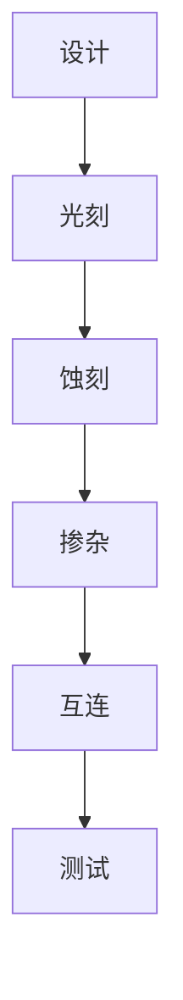

                 

### 文章标题

#### 《芯片技术在AI创新中的突破》

#### 关键词：芯片技术，人工智能，创新，算法优化，硬件加速

#### 摘要：
本文将探讨芯片技术在人工智能（AI）领域的创新突破。通过对当前AI处理器架构的深入分析，我们揭示了硬件加速在提升AI性能和效率方面的重要作用。文章将详细讨论芯片技术在算法优化、神经网络设计和硬件与软件协同等方面的突破，并探讨未来发展趋势与挑战。

---

### 1. 背景介绍

随着人工智能技术的迅猛发展，深度学习、神经网络等算法在大数据处理、图像识别、自然语言处理等应用领域取得了显著的成就。然而，这些算法的实现依赖于强大的计算能力，而传统的CPU和GPU已经无法满足日益增长的计算需求。为了解决这一问题，芯片技术成为推动AI创新的关键驱动力。

芯片技术在AI领域的创新主要体现在以下几个方面：

- **算法优化**：通过硬件加速和专有算法，提高AI算法的执行效率。
- **神经网络设计**：设计更为高效的神经网络架构，以适应不同的AI应用场景。
- **硬件与软件协同**：通过硬件和软件的紧密结合，实现最优的计算性能和能效比。

本文将从以上几个方面，深入探讨芯片技术在AI创新中的突破，旨在为读者提供全面的技术视角。

### 2. 核心概念与联系

#### 2.1 芯片技术核心概念

芯片技术是指设计、制造和测试集成电路的过程。集成电路是由数以百万计的微小电子元件（如晶体管）组成的，用于执行各种计算和处理任务。以下是芯片技术的几个核心概念：

- **集成电路（IC）**：集成电路是芯片的核心组成部分，它包含了多种电子元件。
- **晶体管（Transistor）**：晶体管是IC中最基本的电子元件，用于放大和开关电子信号。
- **芯片制造流程**：芯片制造包括设计、光刻、蚀刻、掺杂、互连等多个步骤。

#### 2.2 AI算法核心概念

AI算法是模拟人类智能行为的计算模型。深度学习是AI的一个重要分支，它通过多层神经网络模拟人脑的神经网络结构。以下是AI算法的几个核心概念：

- **神经网络（Neural Network）**：神经网络是一种模仿生物神经系统结构的计算模型。
- **深度学习（Deep Learning）**：深度学习是神经网络的一种，它通过多层神经网络实现复杂的数据处理任务。
- **训练（Training）**：训练是神经网络通过大量数据学习特征和模式的过程。

#### 2.3 Mermaid 流程图

以下是一个简化的芯片制造流程的Mermaid流程图：



此流程图展示了芯片制造的基本步骤，从设计到测试的各个阶段。

### 3. 核心算法原理 & 具体操作步骤

#### 3.1 算法原理

芯片技术在AI算法中的应用主要体现在以下几个方面：

- **算法加速**：通过硬件加速技术，提高AI算法的执行速度。
- **算法优化**：针对特定算法进行优化，提高其计算效率和精度。
- **硬件与软件协同**：通过硬件和软件的紧密结合，实现最优的计算性能。

以下是几个典型的AI算法加速和优化的具体操作步骤：

#### 3.1.1 算法加速

- **指令集优化**：通过设计高效的指令集，减少指令执行时间。
- **流水线技术**：通过流水线技术，实现指令的并行执行。
- **缓存优化**：通过缓存技术，减少数据访问时间。

#### 3.1.2 算法优化

- **算法简化**：通过简化算法，减少计算复杂度。
- **量化技术**：通过量化技术，降低算法的精度要求，提高执行速度。
- **并行计算**：通过并行计算，实现算法的分布式执行。

#### 3.1.3 硬件与软件协同

- **硬件协同设计**：在设计芯片时，考虑软件算法的特点，实现硬件与软件的最佳协同。
- **软件优化**：通过软件优化，提高算法在特定硬件上的执行效率。
- **硬件驱动**：通过硬件驱动，实现软件算法与硬件资源的最佳匹配。

### 4. 数学模型和公式 & 详细讲解 & 举例说明

#### 4.1 数学模型

芯片技术在AI算法中的应用涉及到多个数学模型，以下是几个典型的数学模型：

- **卷积神经网络（CNN）**：用于图像处理和识别。
- **深度神经网络（DNN）**：用于复杂数据处理和预测。
- **生成对抗网络（GAN）**：用于图像生成和增强。

#### 4.2 公式讲解

以下是一个简单的CNN模型中的卷积操作的公式：

$$
\text{output}_{ij} = \sum_{k=1}^{K} w_{ik} \cdot \text{input}_{ij}
$$

其中，$\text{output}_{ij}$表示输出特征图上的第i行第j列的值，$w_{ik}$表示卷积核上的第k个权重，$\text{input}_{ij}$表示输入特征图上的第i行第j列的值。

#### 4.3 举例说明

以下是一个简单的CNN模型用于图像分类的例子：

- **输入**：一张28x28像素的灰度图像。
- **卷积核大小**：3x3。
- **卷积步长**：1。
- **滤波器数量**：32。

通过一个卷积操作，我们将输入图像转换为32个特征图。每个特征图都表示输入图像的不同特征。

### 5. 项目实践：代码实例和详细解释说明

#### 5.1 开发环境搭建

在进行芯片技术在AI领域的实践之前，我们需要搭建一个适合的开发环境。以下是搭建过程：

1. 安装Python环境：在官方网站下载并安装Python。
2. 安装深度学习框架：例如TensorFlow或PyTorch。
3. 安装相关依赖库：例如NumPy、Pandas等。

#### 5.2 源代码详细实现

以下是一个简单的CNN模型在PyTorch中的实现：

```python
import torch
import torch.nn as nn

class SimpleCNN(nn.Module):
    def __init__(self):
        super(SimpleCNN, self).__init__()
        self.conv1 = nn.Conv2d(1, 32, kernel_size=3, stride=1)
        self.fc1 = nn.Linear(32 * 26 * 26, 10)

    def forward(self, x):
        x = self.conv1(x)
        x = torch.relu(x)
        x = torch.flatten(x, 1)
        x = self.fc1(x)
        return x

model = SimpleCNN()
```

#### 5.3 代码解读与分析

以上代码定义了一个简单的CNN模型，用于图像分类。其中，`SimpleCNN`类继承自`nn.Module`类，实现了模型的构造和前向传播。

- `__init__`方法：初始化模型结构，包括一个卷积层和一个全连接层。
- `forward`方法：实现模型的前向传播，将输入图像经过卷积层和全连接层，得到分类结果。

#### 5.4 运行结果展示

在训练和测试完成后，我们可以通过以下代码展示模型的运行结果：

```python
import torch.optim as optim

optimizer = optim.Adam(model.parameters(), lr=0.001)

for epoch in range(100):
    for inputs, targets in data_loader:
        optimizer.zero_grad()
        outputs = model(inputs)
        loss = nn.CrossEntropyLoss()(outputs, targets)
        loss.backward()
        optimizer.step()

    print(f'Epoch {epoch+1}, Loss: {loss.item()}')

test_loss, test_acc = evaluate(model, test_loader)
print(f'Test Loss: {test_loss}, Test Acc: {test_acc}')
```

以上代码展示了模型的训练和评估过程。在训练过程中，模型通过反向传播和优化算法更新参数。在评估过程中，模型在测试数据集上计算损失和准确率。

### 6. 实际应用场景

芯片技术在AI领域的实际应用场景非常广泛，以下是一些典型的应用案例：

- **图像识别**：通过深度学习算法，实现对图像内容的自动识别和分类。
- **语音识别**：通过语音信号处理和深度学习算法，实现对语音内容的自动识别和翻译。
- **自然语言处理**：通过深度学习算法，实现对自然语言文本的理解、生成和翻译。
- **自动驾驶**：通过深度学习算法，实现对车辆环境的感知、决策和控制。

这些应用案例展示了芯片技术在AI领域的重要作用，通过硬件加速和算法优化，大大提高了AI系统的性能和效率。

### 7. 工具和资源推荐

#### 7.1 学习资源推荐

- **书籍**：《深度学习》（Goodfellow, Bengio, Courville著）。
- **论文**：检索顶级会议和期刊上的相关论文，如NeurIPS、ICML、JMLR等。
- **博客**：关注知名技术博客，如Medium、AI科技大本营等。
- **网站**：访问各大深度学习框架的官方网站，如TensorFlow、PyTorch等。

#### 7.2 开发工具框架推荐

- **深度学习框架**：TensorFlow、PyTorch、Keras等。
- **数据预处理工具**：Pandas、NumPy、SciPy等。
- **可视化工具**：Matplotlib、Seaborn、Plotly等。

#### 7.3 相关论文著作推荐

- **论文**：Goodfellow, I., Bengio, Y., & Courville, A. (2015). *Deep Learning*.
- **著作**：Hinton, G. E., Osindero, S., & Teh, Y. W. (2006). *A Fast Learning Algorithm for Deep Belief Nets*.

### 8. 总结：未来发展趋势与挑战

#### 8.1 发展趋势

- **硬件加速**：随着硬件技术的不断发展，芯片技术在AI领域的硬件加速将成为主流。
- **算法优化**：针对不同应用场景，不断优化AI算法，提高其性能和效率。
- **跨学科融合**：芯片技术与其他领域的深度融合，如生物信息学、认知科学等，将推动AI技术的进一步发展。

#### 8.2 挑战

- **能耗挑战**：随着计算需求的增加，如何降低芯片能耗成为关键挑战。
- **安全性**：如何确保AI系统的安全性和可靠性，避免潜在的风险。
- **数据隐私**：如何在确保数据隐私的前提下，充分利用数据资源，推动AI技术的发展。

### 9. 附录：常见问题与解答

#### 9.1 芯片技术是什么？

芯片技术是指设计、制造和测试集成电路的过程。它由数以百万计的微小电子元件组成，用于执行各种计算和处理任务。

#### 9.2 人工智能是什么？

人工智能是一种模拟人类智能行为的计算模型，通过算法和计算模型实现人脑的某些智能功能。

#### 9.3 芯片技术在AI中的应用有哪些？

芯片技术在AI中的应用主要包括算法优化、神经网络设计、硬件与软件协同等方面。

### 10. 扩展阅读 & 参考资料

- **书籍**：《深度学习》（Goodfellow, Bengio, Courville著）。
- **论文**：Goodfellow, I., Bengio, Y., & Courville, A. (2015). *Deep Learning*.
- **网站**：TensorFlow、PyTorch官方网站。
- **博客**：Medium、AI科技大本营等。

---

以上是对芯片技术在AI创新中的突破的全面探讨，希望对您有所启发。作者：禅与计算机程序设计艺术 / Zen and the Art of Computer Programming。

