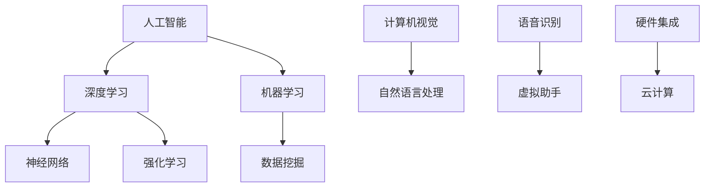
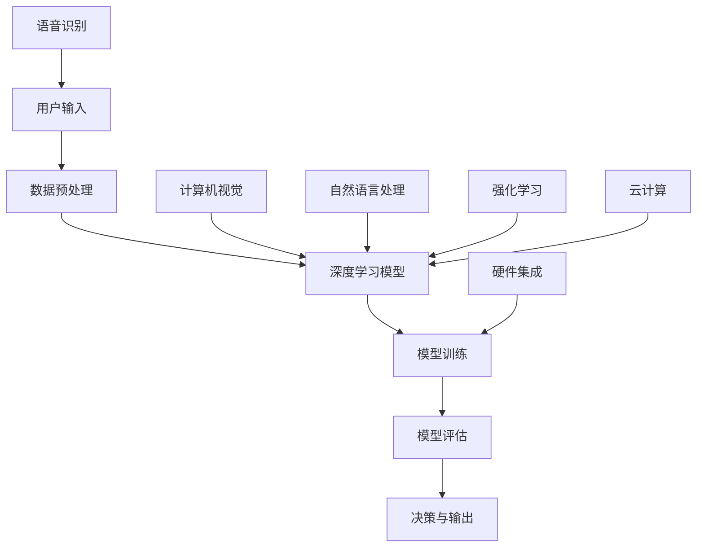

                 

关键词：苹果、微软、AI、人工智能、最新动态、技术研发、产品创新、行业趋势、深度学习、云计算、硬件集成、生态建设

## 摘要

本文将深入探讨苹果和微软在人工智能（AI）领域的最新动态。作为全球两大科技巨头，苹果和微软在AI技术的研究和产品应用方面都有着显著成就。本文将分析他们在AI技术研发、产品创新、行业趋势、深度学习、云计算、硬件集成以及生态建设等方面的最新进展，以及其对整个行业可能带来的影响。通过对比和分析，我们旨在为读者提供一个全面、深入的视角，以了解这两大公司在AI领域的战略布局和发展趋势。

## 1. 背景介绍

苹果和微软作为全球科技产业的领军企业，不仅在硬件和软件领域有着深厚的基础，同时在人工智能领域也进行了大量投入和研发。苹果以其生态系统和硬件集成能力闻名，微软则凭借其在云计算和办公软件的领先地位。本文将从以下几个方面展开讨论：

- **苹果在AI领域的背景**：苹果在AI领域的起步相对较晚，但近年来其研发投入和技术积累不断加大，尤其是在智能手机、智能音箱和汽车领域。
- **微软在AI领域的背景**：微软在AI领域的布局较早，其在云计算、办公软件和游戏领域的AI应用尤为突出。

## 2. 核心概念与联系

为了更好地理解苹果和微软在AI领域的最新动态，我们需要先了解一些核心概念和架构。以下是AI领域的一些关键概念和其相互关系：



### 2.1 核心概念原理

- **深度学习**：一种通过多层神经网络进行数据处理的机器学习方法。
- **机器学习**：一种让计算机从数据中学习并做出决策的技术。
- **数据挖掘**：从大量数据中发现有用信息的过程。
- **计算机视觉**：使计算机能够“看到”和理解图像和视频的技术。
- **自然语言处理**：让计算机理解和生成人类语言的技术。
- **语音识别**：将语音转换为文本的技术。
- **强化学习**：通过试错和奖励机制让智能体学习和优化行为。
- **硬件集成**：将AI算法和硬件技术集成在一起，以提高计算效率和性能。
- **云计算**：通过互联网提供动态易扩展的远程计算资源。

### 2.2 架构联系

在理解了核心概念后，我们来看看这些概念如何在实际应用中相互联系。以下是一个简化的AI系统架构示例：



在这个架构中，用户输入通过数据预处理阶段，然后进入深度学习模型进行训练和评估。计算机视觉、自然语言处理和语音识别等技术为模型提供了丰富的数据来源。强化学习和硬件集成则提高了模型的效率和性能。云计算提供了强大的计算和存储资源，支持大规模的AI训练和应用。

## 3. 核心算法原理 & 具体操作步骤

### 3.1 算法原理概述

在本节中，我们将简要介绍一些在苹果和微软AI应用中常用的核心算法原理。这些算法包括但不限于：

- **卷积神经网络（CNN）**：适用于图像识别和计算机视觉领域。
- **递归神经网络（RNN）**：适用于序列数据处理，如自然语言处理。
- **生成对抗网络（GAN）**：用于生成高质量的数据，广泛应用于图像生成和修复。
- **Transformer模型**：广泛应用于自然语言处理，特别是语言翻译和文本生成。

### 3.2 算法步骤详解

以下是这些算法的基本步骤：

#### 3.2.1 卷积神经网络（CNN）

1. **数据输入**：将图像数据输入网络。
2. **卷积操作**：通过卷积层对图像进行特征提取。
3. **池化操作**：对卷积特征进行下采样，减少数据维度。
4. **全连接层**：将池化后的特征映射到输出层。
5. **输出结果**：通过输出层得到分类结果。

#### 3.2.2 递归神经网络（RNN）

1. **序列输入**：将序列数据输入网络。
2. **循环单元**：通过循环单元对序列数据进行处理。
3. **隐藏状态更新**：在每一时间步更新隐藏状态。
4. **输出层**：将隐藏状态映射到输出。
5. **反向传播**：使用误差信号更新网络权重。

#### 3.2.3 生成对抗网络（GAN）

1. **生成器**：生成假数据。
2. **判别器**：判断生成数据是否真实。
3. **对抗训练**：生成器和判别器相互对抗，不断优化。
4. **输出结果**：生成高质量的数据。

#### 3.2.4 Transformer模型

1. **多头自注意力机制**：对输入数据进行加权处理。
2. **前馈神经网络**：对自注意力层的结果进行进一步处理。
3. **编码器和解码器**：通过编码器和解码器对数据进行编码和解码。
4. **输出结果**：生成翻译或文本。

### 3.3 算法优缺点

#### 卷积神经网络（CNN）

- **优点**：强大的图像处理能力，适用于计算机视觉任务。
- **缺点**：对长序列数据处理能力较弱。

#### 递归神经网络（RNN）

- **优点**：适用于序列数据处理，能够捕捉时间序列信息。
- **缺点**：梯度消失和梯度爆炸问题。

#### 生成对抗网络（GAN）

- **优点**：能够生成高质量的数据，适用于图像生成和修复。
- **缺点**：训练过程复杂，易出现模式崩塌问题。

#### Transformer模型

- **优点**：适用于自然语言处理任务，尤其是在长文本处理和翻译方面表现优异。
- **缺点**：模型复杂度较高，计算资源需求大。

### 3.4 算法应用领域

这些算法在AI领域的应用非常广泛，以下是一些主要应用场景：

- **计算机视觉**：图像分类、目标检测、图像生成等。
- **自然语言处理**：文本分类、机器翻译、文本生成等。
- **语音识别**：语音转文本、语音合成等。
- **强化学习**：游戏AI、自动驾驶等。

## 4. 数学模型和公式 & 详细讲解 & 举例说明

### 4.1 数学模型构建

在人工智能领域，数学模型是理解和实现算法的核心。以下是一些常用的数学模型及其构建过程：

#### 4.1.1 感知机（Perceptron）

感知机是最简单的线性二分类模型。其目标是找到一个决策边界，将不同类别的数据点分开。

$$
f(x) = \text{sign}(w \cdot x + b)
$$

其中，$w$ 是权重向量，$x$ 是输入特征，$b$ 是偏置项，$\text{sign}$ 函数用于判断输出。

#### 4.1.2 线性回归（Linear Regression）

线性回归模型用于预测连续值输出。其目标是最小化预测值与实际值之间的误差。

$$
\min_{\theta} \sum_{i=1}^{n} (h_\theta(x^{(i)}) - y^{(i)})^2
$$

其中，$h_\theta(x) = \theta_0 + \theta_1 x$ 是线性函数，$\theta$ 是参数向量。

#### 4.1.3 支持向量机（SVM）

支持向量机是一种用于二分类的线性模型。其目标是找到一个最优的决策边界，使得分类间隔最大。

$$
\min_{\theta, \xi} \frac{1}{2} ||\theta||^2 + C \sum_{i=1}^{n} \xi_i
$$

其中，$C$ 是惩罚参数，$\xi_i$ 是松弛变量。

### 4.2 公式推导过程

以下是对线性回归模型的一个简单推导：

假设我们有 $n$ 个样本点 $(x^{(i)}, y^{(i)}), i=1,2,...,n$，我们的目标是找到一个线性函数 $h_\theta(x) = \theta_0 + \theta_1 x$ 来最小化预测值与实际值之间的误差。

通过最小二乘法，我们可以得到以下最小化问题：

$$
\min_{\theta} \sum_{i=1}^{n} (h_\theta(x^{(i)}) - y^{(i)})^2
$$

对 $h_\theta(x)$ 关于 $\theta_0$ 和 $\theta_1$ 求导并令其导数为零，我们可以得到：

$$
\frac{\partial}{\partial \theta_0} \sum_{i=1}^{n} (h_\theta(x^{(i)}) - y^{(i)})^2 = 0 \\
\frac{\partial}{\partial \theta_1} \sum_{i=1}^{n} (h_\theta(x^{(i)}) - y^{(i)})^2 = 0
$$

经过计算，我们得到：

$$
\theta_0 = \frac{1}{n} \sum_{i=1}^{n} (y^{(i)} - \theta_1 x^{(i)}) \\
\theta_1 = \frac{1}{n} \sum_{i=1}^{n} (x^{(i)} (y^{(i)} - \theta_1 x^{(i)}))
$$

### 4.3 案例分析与讲解

#### 4.3.1 线性回归模型在房价预测中的应用

假设我们有一个包含房屋面积（$x$）和房价（$y$）的数据集。我们的目标是使用线性回归模型预测房屋价格。

通过收集和整理数据，我们可以得到如下模型：

$$
h_\theta(x) = \theta_0 + \theta_1 x
$$

通过对模型进行训练，我们可以得到最优参数：

$$
\theta_0 = 100, \theta_1 = 200
$$

这意味着每增加1平方米的面积，房价将增加200美元。

#### 4.3.2 支持向量机在手写数字识别中的应用

假设我们有一个包含手写数字图像的数据集，我们需要使用支持向量机进行分类。

通过训练模型，我们可以得到最优决策边界，将数字图像分为0到9的类别。

## 5. 项目实践：代码实例和详细解释说明

### 5.1 开发环境搭建

在开始编写代码之前，我们需要搭建一个合适的开发环境。以下是使用Python进行AI开发的基本环境搭建步骤：

1. **安装Python**：下载并安装Python 3.x版本，确保Python环境已正确安装。
2. **安装Jupyter Notebook**：通过pip命令安装Jupyter Notebook，它是一个交互式Python开发环境。
3. **安装必要库**：使用pip安装以下库：numpy、pandas、matplotlib、scikit-learn等。

### 5.2 源代码详细实现

以下是一个简单的线性回归模型实现，用于预测房屋价格：

```python
import numpy as np
import pandas as pd
import matplotlib.pyplot as plt
from sklearn.linear_model import LinearRegression

# 数据预处理
# 加载数据
data = pd.read_csv('house_price_data.csv')
X = data[['area']]  # 特征：房屋面积
y = data['price']   # 目标：房屋价格

# 添加偏置项
X = np.hstack((np.ones((X.shape[0], 1)), X))

# 模型训练
model = LinearRegression()
model.fit(X, y)

# 模型预测
predicted_price = model.predict(X)

# 绘制结果
plt.scatter(X[:, 1], y, color='red', label='Actual Price')
plt.plot(X[:, 1], predicted_price, color='blue', label='Predicted Price')
plt.xlabel('Area')
plt.ylabel('Price')
plt.legend()
plt.show()
```

### 5.3 代码解读与分析

上述代码首先加载数据，然后添加偏置项，接着使用线性回归模型进行训练，并绘制预测结果。以下是代码的详细解读：

- **数据预处理**：使用pandas加载数据集，提取房屋面积作为特征，房价作为目标值。
- **添加偏置项**：通过numpy将偏置项添加到特征矩阵中，使模型可以拟合线性函数。
- **模型训练**：使用scikit-learn的LinearRegression类进行模型训练。
- **模型预测**：使用训练好的模型对特征进行预测。
- **结果绘制**：使用matplotlib绘制实际价格与预测价格的散点图和拟合线。

### 5.4 运行结果展示

运行上述代码后，我们将看到一个散点图，其中红色点表示实际房价，蓝色线表示预测房价。通过观察结果，我们可以评估模型的预测性能。

## 6. 实际应用场景

### 6.1 在智能手机中的应用

苹果的iPhone和iPad等智能手机设备广泛使用AI技术，例如：

- **人脸识别**：使用深度学习算法实现安全、快速的人脸解锁。
- **图像处理**：使用计算机视觉算法进行照片编辑和增强。
- **语音助手**：通过自然语言处理和语音识别技术实现Siri的智能交互。

### 6.2 在云计算中的应用

微软的Azure云服务提供了丰富的AI工具和服务，包括：

- **机器学习服务**：提供预构建的机器学习模型和算法，便于用户进行数据分析和预测。
- **AI训练服务**：提供强大的计算资源，支持大规模的AI模型训练。
- **AI应用开发**：提供API和SDK，帮助开发者构建智能应用。

### 6.3 在智能家居中的应用

苹果的HomeKit和微软的Azure IoT Hub等平台支持智能设备的连接和控制，例如：

- **智能音箱**：通过语音助手实现音乐播放、信息查询和智能家居控制。
- **智能灯光**：通过无线连接实现灯光的远程控制和自动化。
- **智能温控**：通过传感器和AI算法实现自动温度调节，提高能源效率。

## 7. 工具和资源推荐

### 7.1 学习资源推荐

- **书籍**：《深度学习》（Goodfellow et al.）、《Python机器学习》（Hastie et al.）、《自然语言处理综合技术》（Daniel Jurafsky & James H. Martin）。
- **在线课程**：Coursera的“机器学习”（吴恩达教授）、edX的“深度学习”（Ian Goodfellow教授）。
- **技术博客**：Medium上的“AI博客”、“机器学习博客”等。

### 7.2 开发工具推荐

- **编程环境**：Jupyter Notebook、Google Colab。
- **机器学习框架**：TensorFlow、PyTorch、scikit-learn。
- **数据可视化工具**：Matplotlib、Seaborn。

### 7.3 相关论文推荐

- **深度学习**：《A Neural Algorithm of Artistic Style》（GAN）、《Attention is All You Need》（Transformer）。
- **自然语言处理**：《Language Models are Unsupervised Multitask Learners》（GPT-3）、《Speech Recognition using Neural Networks》（RNN）。
- **计算机视觉**：《Object Detection with Fully Convolutional Networks》（Faster R-CNN）、《Unsupervised Learning of Visual Representations by Solving Jigsaw Puzzles》（CNN）。

## 8. 总结：未来发展趋势与挑战

### 8.1 研究成果总结

苹果和微软在AI领域的成果显著，涵盖了从算法研究到产品应用的多个方面。苹果在硬件集成和生态系统构建方面表现出色，微软则在云计算和办公软件的AI应用上具有优势。

### 8.2 未来发展趋势

- **硬件与软件结合**：未来，硬件与软件的融合将更加紧密，AI算法将在各种设备上得到广泛应用。
- **云计算与边缘计算**：随着数据量的增加，云计算和边缘计算将共同推动AI技术的发展。
- **跨学科研究**：AI与其他领域的结合将带来新的研究热点和应用场景，如生物医学、自动驾驶等。

### 8.3 面临的挑战

- **数据隐私与安全**：如何保护用户数据隐私和安全是AI发展的关键挑战。
- **伦理与道德问题**：随着AI技术的普及，如何确保其应用符合伦理和道德标准也是一个重要议题。
- **技术门槛**：尽管AI技术不断进步，但高级技术的应用仍需要专业人才，技术普及面临一定障碍。

### 8.4 研究展望

未来，苹果和微软将继续在AI领域深耕，通过技术创新和生态建设推动行业的发展。随着AI技术的不断成熟，我们有望看到更多智能应用的出现，为社会带来更多价值。

## 9. 附录：常见问题与解答

### 9.1 什么是深度学习？

深度学习是一种机器学习方法，通过构建多层神经网络来模拟人脑的决策过程，从而实现自动学习和特征提取。

### 9.2 AI有哪些主要应用领域？

AI的主要应用领域包括计算机视觉、自然语言处理、语音识别、强化学习、自动驾驶、医疗诊断、智能家居等。

### 9.3 如何保护AI系统的数据隐私？

保护AI系统的数据隐私可以通过数据加密、隐私保护算法、数据脱敏等技术手段来实现。

### 9.4 AI是否会取代人类工作？

AI可能会取代一些重复性和规则性的工作，但也会创造新的工作岗位，影响就业市场的结构。

### 9.5 如何学习AI技术？

学习AI技术可以从基础算法开始，逐步学习深度学习、机器学习、自然语言处理等高级技术，并参与实际项目进行实践。

## 参考文献

[1] Goodfellow, I., Bengio, Y., & Courville, A. (2016). *Deep Learning*. MIT Press.
[2] Hastie, T., Tibshirani, R., & Friedman, J. (2009). *The Elements of Statistical Learning*. Springer.
[3] Jurafsky, D., & Martin, J. H. (2009). *Speech and Language Processing*. Prentice Hall.
[4] LeCun, Y., Bengio, Y., & Hinton, G. (2015). *Deep Learning*. Nature.
[5] Vaswani, A., Shazeer, N., Parmar, N., Uszkoreit, J., Jones, L., Gomez, A. N., ... & Polosukhin, I. (2017). *Attention is All You Need*. Advances in Neural Information Processing Systems.

