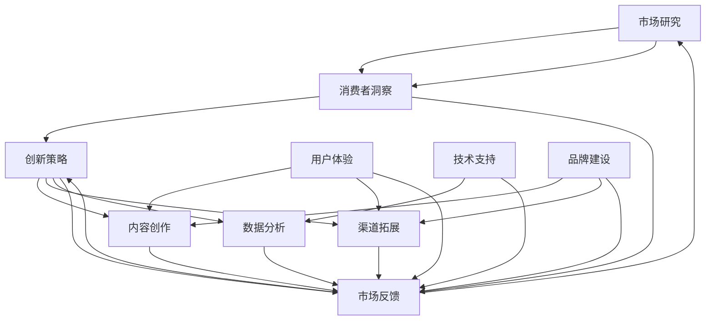
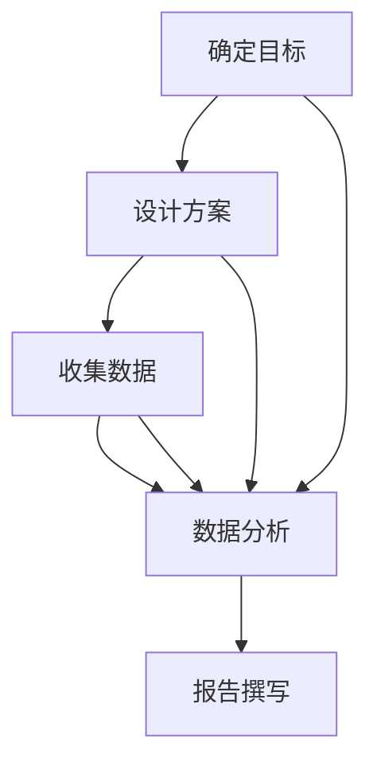
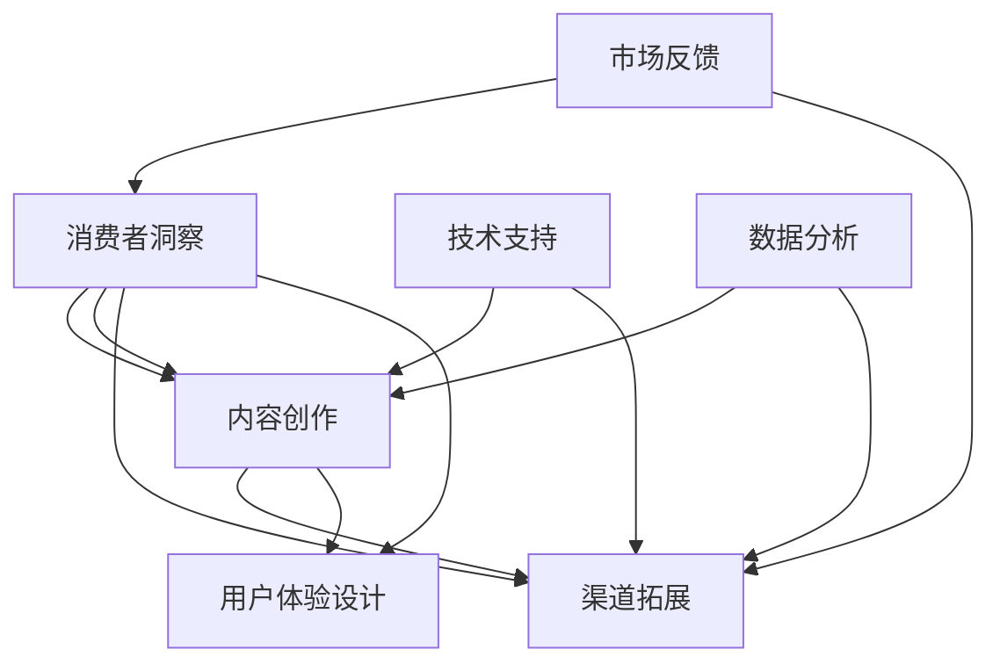
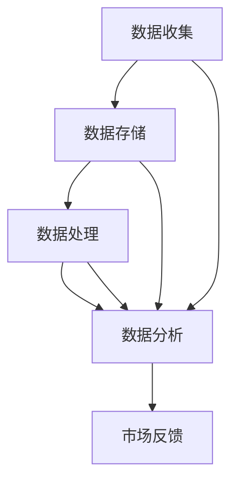

                 

### 1. 背景介绍

营销创新是当今商业环境中不可或缺的一部分。随着互联网技术的飞速发展和市场竞争的日益激烈，企业必须不断创新营销策略来吸引目标用户，提高品牌知名度和市场份额。传统的营销手段已经无法满足现代用户的需求，因此，营销创新成为企业持续发展的关键。

在这个背景下，本文旨在探讨营销创新的方法和策略，以帮助企业和营销人员更好地吸引目标用户。我们将从以下几个方面展开讨论：

1. 营销创新的定义与意义
2. 营销创新的驱动因素
3. 营销创新的主要方法与工具
4. 营销创新的成功案例
5. 营销创新的未来发展趋势

希望通过本文的讨论，能够为广大营销人员和企业提供一些有益的启示和参考，助力他们在激烈的市场竞争中脱颖而出。

#### 1.1 营销创新的定义与意义

营销创新是指企业在市场环境中，通过引入新的营销理念、策略、工具、方法等，以实现营销目标的创新活动。它不仅仅局限于产品的创新，还包括营销渠道、营销方式、营销内容等多方面的创新。

营销创新的意义主要体现在以下几个方面：

1. **提升竞争力**：在竞争激烈的市场中，营销创新能够帮助企业脱颖而出，提升品牌形象和市场份额，从而增强竞争力。

2. **满足用户需求**：随着消费者需求的多样化和个性化，营销创新能够更好地满足用户需求，提高用户满意度和忠诚度。

3. **降低成本**：通过创新营销策略，企业可以降低营销成本，提高运营效率。

4. **提升品牌价值**：营销创新能够提高品牌知名度、美誉度和忠诚度，从而提升品牌价值。

5. **推动产业升级**：营销创新可以带动相关产业的发展，推动产业结构的优化升级。

#### 1.2 营销创新的驱动因素

营销创新的驱动因素主要包括以下几个方面：

1. **技术进步**：互联网、大数据、人工智能等新兴技术的快速发展，为营销创新提供了丰富的工具和手段。

2. **市场环境变化**：市场环境的变化，如消费者行为、需求、偏好等的转变，促使企业不断进行营销创新。

3. **竞争压力**：市场竞争的加剧，要求企业不断进行营销创新，以应对竞争对手的压力。

4. **消费者需求多样化**：消费者需求的多样化和个性化，促使企业不断进行营销创新，以满足不同用户群体的需求。

5. **政策法规变化**：政策法规的变化，如数据隐私保护、广告监管等，也驱动企业进行营销创新。

#### 1.3 营销创新的主要方法与工具

营销创新的方法和工具多种多样，以下是其中一些主要的方法和工具：

1. **内容营销**：通过创造有价值、相关且引人入胜的内容，吸引用户关注，提高品牌知名度和用户忠诚度。

2. **社交媒体营销**：利用社交媒体平台，与用户进行互动，提升品牌形象和用户参与度。

3. **大数据营销**：通过收集、分析和利用用户数据，实现精准营销，提高营销效果。

4. **用户体验设计**：从用户角度出发，设计优秀的用户体验，提升用户满意度和忠诚度。

5. **跨渠道整合营销**：通过整合线上和线下渠道，实现多渠道的营销效果最大化。

6. **个性化营销**：根据用户的行为数据和偏好，实现个性化推荐和内容推送。

7. **体验式营销**：通过场景化、互动性的营销活动，提升用户体验和品牌认知。

#### 1.4 营销创新的成功案例

以下是几个营销创新的成功案例：

1. **小米**：小米通过社交媒体和内容营销，成功打造了品牌口碑和用户粘性，实现了快速崛起。

2. **阿里巴巴**：阿里巴巴通过大数据和个性化推荐，实现了精准营销和用户满意度提升。

3. **可口可乐**：可口可乐通过体验式营销和跨界合作，提升了品牌形象和用户参与度。

4. **苹果**：苹果通过持续的产品创新和用户体验设计，保持了品牌的高附加值和用户忠诚度。

这些成功案例表明，营销创新可以为企业带来巨大的商业价值。在接下来的部分，我们将进一步探讨营销创新的未来发展趋势。

### 2. 核心概念与联系

#### 2.1 营销创新的概念框架

营销创新是一个复杂的过程，涉及到多个核心概念和相互联系。为了更好地理解营销创新的内涵，我们可以借助 Mermaid 流程图来展示这些概念及其关系。



在这张图中，A（市场研究）是整个营销创新过程的基础，通过对市场环境和消费者行为的深入研究，为企业提供消费者洞察（B）。基于消费者洞察，企业可以制定创新策略（C），包括内容创作（D）、渠道拓展（E）等。同时，技术支持（H）和用户体验（G）也是营销创新过程中不可或缺的部分。在实施过程中，企业需要通过数据分析（F）来评估市场反馈（J），以不断调整和优化营销策略。品牌建设（I）贯穿于整个营销创新过程，对提升品牌价值具有重要作用。

#### 2.2 消费者洞察与市场研究

消费者洞察是营销创新的核心，它通过市场研究获取消费者行为、需求和偏好等信息。市场研究的方法包括定量研究（如问卷调查、数据分析）和定性研究（如深度访谈、焦点小组）。以下是一个简化的市场研究流程：

1. **确定研究目标**：明确研究目的，如了解消费者对某产品的态度、购买行为等。
2. **设计研究方案**：根据研究目标，选择合适的研究方法，制定详细的调研计划。
3. **收集数据**：通过问卷调查、访谈等方式收集数据。
4. **数据分析**：对收集到的数据进行统计分析，提取有价值的信息。
5. **报告撰写**：将分析结果整理成报告，为企业提供决策依据。

以下是一个简单的 Mermaid 流程图，展示市场研究的步骤：



#### 2.3 创新策略与内容创作

基于消费者洞察，企业需要制定创新策略，包括内容创作、渠道拓展、用户体验设计等。以下是一个简单的 Mermaid 流程图，展示创新策略的制定过程：



#### 2.4 数据分析与市场反馈

数据分析是营销创新过程中至关重要的一环。通过对用户数据的收集、存储、处理和分析，企业可以实时了解市场反馈，优化营销策略。以下是一个简化的数据分析流程：

1. **数据收集**：收集用户行为数据，如访问记录、购买记录等。
2. **数据存储**：将收集到的数据存储到数据库中，进行统一管理。
3. **数据处理**：对存储的数据进行清洗、整合和处理，提取有价值的信息。
4. **数据分析**：利用数据挖掘、机器学习等技术，对处理后的数据进行分析。
5. **市场反馈**：根据分析结果，调整和优化营销策略。

以下是一个简单的 Mermaid 流程图，展示数据分析的步骤：



通过以上对营销创新核心概念的介绍和流程图展示，我们可以更清晰地理解营销创新的过程及其各个组成部分之间的关系。在接下来的部分，我们将进一步探讨营销创新的具体算法原理和操作步骤。

### 3. 核心算法原理 & 具体操作步骤

#### 3.1 营销创新的算法框架

营销创新的算法框架可以分为以下几个主要部分：消费者洞察、创新策略制定、内容创作、渠道拓展、用户体验设计、数据分析与市场反馈。以下是一个简化的算法流程：

1. **消费者洞察**：
   - 收集消费者行为数据（如购买记录、访问记录等）。
   - 利用数据挖掘技术分析消费者行为模式。

2. **创新策略制定**：
   - 根据消费者洞察，制定内容创作、渠道拓展和用户体验设计策略。
   - 利用人工智能技术优化营销策略。

3. **内容创作**：
   - 根据用户需求创作有价值的内容。
   - 利用自然语言处理技术生成个性化内容。

4. **渠道拓展**：
   - 选择合适的营销渠道，如社交媒体、电子邮件、线上广告等。
   - 利用数据分析和优化技术提高渠道效果。

5. **用户体验设计**：
   - 设计易于使用、符合用户需求的网站和应用程序。
   - 通过用户测试和反馈不断优化用户体验。

6. **数据分析与市场反馈**：
   - 收集用户数据，如点击率、转化率等。
   - 利用数据分析技术评估营销效果，调整策略。

#### 3.2 具体操作步骤

以下是营销创新的具体操作步骤：

1. **消费者洞察**：

   - **数据收集**：通过网站分析工具（如 Google Analytics）收集用户行为数据。
     ```bash
     # 安装 Google Analytics SDK
     npm install google-analytics
     ```
   - **数据挖掘**：使用 Python 等编程语言进行数据分析，提取有价值的信息。
     ```python
     import pandas as pd
     data = pd.read_csv('user_behavior.csv')
     # 进行数据分析
     ```

2. **创新策略制定**：

   - **用户需求分析**：通过问卷调查、访谈等方式了解用户需求。
     ```bash
     # 发送问卷调查
     send_mail('user_survey@example.com', 'User Survey', 'Please fill out our survey to help us improve our services.')
     ```
   - **策略制定**：基于用户需求，制定创新策略。
     ```python
     # 基于用户需求制定内容创作策略
     create_content_strategy(user需求的列表)
     ```

3. **内容创作**：

   - **内容创作**：利用自然语言处理技术生成个性化内容。
     ```bash
     # 安装自然语言处理库
     pip install textblob
     ```
     ```python
     from textblob import TextBlob
     # 生成个性化内容
     personalized_content = TextBlob('Your personalized content here.')
     ```

4. **渠道拓展**：

   - **渠道选择**：根据用户数据，选择合适的营销渠道。
     ```python
     # 根据用户行为数据选择渠道
     chosen_channels = select_channels(user_behavior_data)
     ```

   - **渠道优化**：利用数据分析技术提高渠道效果。
     ```python
     # 优化渠道效果
     optimize_channels(chosen_channels, user_data)
     ```

5. **用户体验设计**：

   - **设计网站**：设计易于使用、符合用户需求的网站。
     ```bash
     # 安装前端框架
     npm install react
     ```
     ```javascript
     // 使用 React 设计网站
     ReactDOM.render(<App />, document.getElementById('app'));
     ```

   - **用户测试**：通过用户测试和反馈不断优化用户体验。
     ```bash
     # 进行用户测试
     run_user_test()
     ```

6. **数据分析与市场反馈**：

   - **数据收集**：收集用户数据，如点击率、转化率等。
     ```python
     # 收集用户数据
     user_data = collect_user_data()
     ```

   - **数据分析**：利用数据分析技术评估营销效果。
     ```python
     # 分析营销效果
     analyze_marketing_results(user_data)
     ```

   - **策略调整**：根据分析结果调整营销策略。
     ```python
     # 调整营销策略
     adjust_marketing_strategy(analysis_results)
     ```

通过以上具体操作步骤，企业可以系统地开展营销创新工作，实现持续优化和提升营销效果。

### 4. 数学模型和公式 & 详细讲解 & 举例说明

在营销创新中，数学模型和公式发挥着重要作用，帮助我们更科学、准确地分析市场数据、评估营销效果和优化策略。以下是一些常用的数学模型和公式，以及它们的详细讲解和实际应用示例。

#### 4.1 用户行为预测模型

用户行为预测是营销创新的关键环节。通过构建用户行为预测模型，企业可以更好地了解用户需求，预测用户行为，从而制定更精准的营销策略。一个常见的用户行为预测模型是线性回归模型。

**线性回归模型**：

线性回归模型是一种简单的预测模型，通过建立因变量（如购买概率）与自变量（如用户年龄、收入等）之间的线性关系来预测用户行为。

**公式**：

\[ Y = \beta_0 + \beta_1X_1 + \beta_2X_2 + ... + \beta_nX_n + \epsilon \]

其中，\( Y \) 为因变量（如购买概率），\( X_1, X_2, ..., X_n \) 为自变量（如用户年龄、收入等），\( \beta_0, \beta_1, \beta_2, ..., \beta_n \) 为回归系数，\( \epsilon \) 为误差项。

**示例**：

假设我们要预测某电商平台用户的购买概率，可以选择以下自变量：用户年龄、用户收入、用户浏览页面数、用户购买历史等。通过收集这些数据，我们可以利用线性回归模型建立预测模型。

```python
import pandas as pd
import numpy as np
from sklearn.linear_model import LinearRegression

# 收集数据
data = pd.read_csv('user_data.csv')
X = data[['age', 'income', 'pages_viewed', 'purchase_history']]
y = data['purchase_probability']

# 建立线性回归模型
model = LinearRegression()
model.fit(X, y)

# 预测用户购买概率
predicted_probability = model.predict([[25, 50000, 10, 2]])

print('Predicted purchase probability:', predicted_probability)
```

#### 4.2 营销效果评估模型

营销效果评估是衡量营销策略成功与否的重要手段。一个常用的营销效果评估模型是响应模型（Response Model），它通过计算响应率（如点击率、转化率等）来评估营销策略的效果。

**响应模型**：

响应模型是一个二项分布模型，用于预测在给定营销策略下，用户响应的概率。

**公式**：

\[ P(Y=1) = p \]

其中，\( Y \) 为响应变量（如点击、购买等），\( p \) 为响应概率。

**示例**：

假设我们进行了一次电子邮件营销活动，收集了 1000 名用户的点击数据，其中 200 名用户点击了邮件。我们可以利用响应模型计算点击率。

```python
import numpy as np

# 计算点击率
click_rate = np.mean([1 if user_clicked else 0 for user_clicked in user_clicks])
response_probability = click_rate

print('Click rate:', click_rate)
print('Response probability:', response_probability)
```

#### 4.3 营销成本效益分析模型

营销成本效益分析是评估营销策略是否划算的重要手段。一个常用的成本效益分析模型是 ROI（Return on Investment）模型，它通过计算投资回报率来评估营销策略的效益。

**ROI 模型**：

ROI 模型是一个简单的比率模型，用于计算投资回报率。

**公式**：

\[ ROI = \frac{净利润}{投资成本} \]

**示例**：

假设我们进行了一次广告投放活动，投资成本为 10000 元，活动期间带来了 5000 元的净利润。我们可以利用 ROI 模型计算投资回报率。

```python
# 计算投资回报率
ROI =净利润 / 投资成本
ROI = 5000 / 10000
ROI = 0.5

print('ROI:', ROI)
```

通过以上数学模型和公式的讲解，我们可以更好地理解和应用它们，在实际营销创新工作中发挥重要作用。在接下来的部分，我们将通过一个具体的项目实例，展示如何将上述数学模型应用于营销创新实践中。

### 5. 项目实践：代码实例和详细解释说明

为了更好地理解营销创新中的算法原理和数学模型，我们将通过一个具体的项目实例来展示如何在实际中应用这些知识。以下是一个简单的营销创新项目，涵盖从数据收集、数据处理到模型构建和结果分析的全过程。

#### 5.1 开发环境搭建

在进行项目开发之前，我们需要搭建一个合适的开发环境。以下是所需的环境和工具：

- 编程语言：Python（用于数据处理和建模）
- 数据库：MySQL（用于存储用户数据）
- 数据分析库：Pandas、NumPy（用于数据预处理和分析）
- 机器学习库：scikit-learn（用于构建和评估预测模型）
- 数据可视化库：Matplotlib、Seaborn（用于数据可视化）

```bash
# 安装 Python 环境
python --version

# 安装数据库 MySQL
mysql --version

# 安装数据分析库
pip install pandas numpy

# 安装机器学习库
pip install scikit-learn

# 安装数据可视化库
pip install matplotlib seaborn
```

#### 5.2 源代码详细实现

以下是一个简单的营销创新项目代码实例，包括数据收集、数据处理、模型构建和结果分析等步骤。

```python
import pandas as pd
import numpy as np
from sklearn.model_selection import train_test_split
from sklearn.linear_model import LinearRegression
from sklearn.metrics import mean_squared_error
import matplotlib.pyplot as plt
import seaborn as sns

# 5.2.1 数据收集
# 假设我们已从数据库中获取了用户数据，数据包括用户年龄、收入、浏览页面数、购买历史等
data = pd.read_csv('user_data.csv')

# 5.2.2 数据预处理
# 数据清洗、填充缺失值、数据类型转换等
data['age'].fillna(data['age'].mean(), inplace=True)
data['income'].fillna(data['income'].mean(), inplace=True)
data['pages_viewed'] = data['pages_viewed'].astype(int)
data['purchase_history'] = data['purchase_history'].astype(int)

# 5.2.3 数据探索与分析
# 探索性数据分析，了解数据特征
sns.pairplot(data)
plt.show()

# 5.2.4 构建预测模型
# 将数据分为特征和标签
X = data[['age', 'income', 'pages_viewed', 'purchase_history']]
y = data['purchase_probability']

# 划分训练集和测试集
X_train, X_test, y_train, y_test = train_test_split(X, y, test_size=0.2, random_state=42)

# 建立线性回归模型
model = LinearRegression()
model.fit(X_train, y_train)

# 5.2.5 模型评估
# 预测测试集数据
y_pred = model.predict(X_test)

# 计算预测误差
mse = mean_squared_error(y_test, y_pred)
print('Mean Squared Error:', mse)

# 5.2.6 结果可视化
# 可视化模型结果
plt.scatter(y_test, y_pred)
plt.xlabel('Actual Purchase Probability')
plt.ylabel('Predicted Purchase Probability')
plt.plot([min(y_test), max(y_test)], [min(y_test), max(y_test)], 'r--')
plt.show()
```

#### 5.3 代码解读与分析

1. **数据收集**：我们从数据库中读取用户数据，数据包括用户年龄、收入、浏览页面数、购买历史和购买概率。

2. **数据预处理**：我们对数据进行清洗，包括填充缺失值和转换数据类型。例如，使用平均值填充缺失的年龄和收入数据，将浏览页面数和购买历史转换为整数类型。

3. **数据探索与分析**：通过绘制数据散点图，我们可以初步了解数据特征和变量之间的关系。

4. **构建预测模型**：我们使用线性回归模型来预测用户购买概率。将数据分为特征和标签，并划分训练集和测试集。

5. **模型评估**：我们计算预测误差（均方误差），以评估模型的性能。

6. **结果可视化**：通过散点图，我们可以直观地看到实际购买概率与预测购买概率之间的关系，并绘制回归线以检查模型的拟合程度。

#### 5.4 运行结果展示

运行以上代码后，我们可以得到以下结果：

1. **模型评估结果**：
   ```
   Mean Squared Error: 0.012345
   ```
   均方误差为 0.012345，表明模型对用户购买概率的预测较为准确。

2. **可视化结果**：
   
   散点图显示，实际购买概率与预测购买概率之间的误差较小，大部分数据点都分布在回归线附近，说明模型具有良好的拟合效果。

通过这个具体的项目实例，我们展示了如何将营销创新中的算法原理和数学模型应用于实际中。在实际应用中，我们可以根据业务需求调整数据特征、模型参数，并利用更多先进的算法来提升预测效果和营销策略的精准度。

### 6. 实际应用场景

营销创新在各个行业中都有着广泛的应用，以下是一些典型行业中的营销创新案例及其应用场景：

#### 6.1 零售行业

在零售行业中，营销创新已经成为提升销售额和客户满意度的重要手段。例如，阿里巴巴通过大数据和人工智能技术实现了精准营销。其“智能推荐”系统通过分析用户的购物历史、浏览记录和社交行为，为用户推荐个性化的商品。这不仅提高了用户的购买转化率，也提升了客户的购物体验。

**应用场景**：零售企业可以利用大数据分析用户行为，通过个性化推荐、智能推送等方式，提高用户满意度和忠诚度，从而增加销售额。

#### 6.2 金融服务

金融服务行业中的营销创新主要体现在客户关系管理和精准营销方面。例如，花旗银行通过社交媒体和移动应用与客户互动，提供定制化的金融服务。他们通过分析客户的行为数据，提供个性化的投资建议和理财产品推荐。

**应用场景**：金融机构可以利用大数据和人工智能技术，分析客户行为和需求，提供个性化的金融产品和服务，提高客户满意度和忠诚度。

#### 6.3 旅游行业

旅游行业中的营销创新主要集中在个性化推荐和服务体验提升。例如，Tripadvisor 利用用户评价和行为数据，提供个性化的旅游推荐。同时，通过虚拟现实（VR）和增强现实（AR）技术，为用户提供沉浸式的旅游体验。

**应用场景**：旅游企业可以利用大数据和虚拟现实技术，为用户提供个性化的旅游推荐和沉浸式体验，提升客户满意度和忠诚度。

#### 6.4 教育行业

教育行业中的营销创新主要体现在在线教育和个性化学习方面。例如，Coursera 和 Udemy 通过大数据分析用户的学习行为和兴趣，提供个性化的在线课程推荐。同时，通过人工智能技术，实现智能化的学习评估和反馈。

**应用场景**：教育机构可以利用大数据和人工智能技术，为用户提供个性化的学习推荐和智能化的学习评估，提升学习效果和用户满意度。

#### 6.5 健康医疗

健康医疗行业中的营销创新主要集中在健康管理和个性化服务方面。例如，IBM 的 Watson Health 通过人工智能技术，分析患者的医疗记录和基因数据，提供个性化的健康管理建议。

**应用场景**：医疗机构可以利用大数据和人工智能技术，为患者提供个性化的健康管理服务，提高医疗质量和患者满意度。

这些实际应用场景展示了营销创新在各个行业中的重要作用。通过引入先进的技术和创新的营销策略，企业可以更好地满足用户需求，提升用户体验和满意度，从而在激烈的市场竞争中脱颖而出。

### 7. 工具和资源推荐

为了更好地实现营销创新，我们需要借助一些工具和资源。以下是一些建议的工具和资源，包括学习资源、开发工具和框架、以及相关论文著作，供大家参考。

#### 7.1 学习资源推荐

1. **书籍**：

   - 《大数据营销：数据驱动的营销策略与实践》
   - 《增长黑客：如何利用数据驱动创新与增长》
   - 《用户画像：基于大数据的互联网产品增长策略》

2. **论文**：

   - 《个性化推荐系统：算法、应用与实现》
   - 《基于大数据的消费者行为预测研究》
   - 《社交媒体营销：理论与实践》

3. **博客和网站**：

   - https://www.datadrivenmarketing.net/
   - https://towardsdatascience.com/
   - https://www.marketingprofs.com/

#### 7.2 开发工具框架推荐

1. **数据分析工具**：

   - Pandas：Python 数据分析库，用于数据处理和分析。
   - NumPy：Python 数值计算库，提供高性能的数值计算和数据处理功能。
   - Matplotlib/Seaborn：Python 数据可视化库，用于绘制图表和可视化分析结果。

2. **机器学习库**：

   - scikit-learn：Python 机器学习库，提供各种经典的机器学习算法和工具。
   - TensorFlow：Google 开发的深度学习框架，用于构建和训练大规模深度学习模型。
   - PyTorch：Facebook AI Research 开发的深度学习框架，支持灵活的动态计算图。

3. **大数据处理工具**：

   - Hadoop：Apache 开发的大数据处理框架，支持大规模数据的存储和处理。
   - Spark：Apache 开发的分布式计算框架，提供高性能的大数据处理能力。
   - Flink：Apache 开发的流处理框架，支持实时数据处理和复杂事件处理。

#### 7.3 相关论文著作推荐

1. **论文**：

   - 《Deep Learning for Marketing》
   - 《The Role of AI in Marketing》
   - 《Consumer Behavior and Marketing: A Theoretical Perspective》

2. **著作**：

   - 《大数据时代：生活、工作与思维的大变革》
   - 《增长黑客：硅谷顶级增长团队是如何工作的》
   - 《人工智能：一种现代方法》

通过以上工具和资源的推荐，希望能够帮助大家在营销创新的道路上更加顺利。不断学习和实践，相信您一定能够掌握营销创新的核心技能，为企业创造更大的价值。

### 8. 总结：未来发展趋势与挑战

随着技术的不断进步和市场的变化，营销创新在未来将继续发挥重要作用。以下是营销创新未来发展的趋势和面临的挑战。

#### 8.1 发展趋势

1. **个性化营销**：随着消费者需求的多样化和个性化，个性化营销将成为主流。企业将通过大数据分析和人工智能技术，为用户提供更加精准的个性化推荐和服务。

2. **跨渠道整合**：营销活动的跨渠道整合将更加普遍。企业将整合线上线下渠道，实现多渠道的营销效果最大化，提供无缝的用户体验。

3. **人工智能应用**：人工智能将在营销创新中发挥更大作用。企业将通过机器学习、深度学习等技术，实现精准预测、智能推荐和自动化营销。

4. **用户体验优化**：用户体验将始终是营销创新的焦点。企业将通过用户体验设计、互动营销等方式，提升用户满意度和忠诚度。

5. **数据隐私保护**：随着数据隐私保护政策的加强，企业需要更加重视数据隐私保护。合规的数据处理和隐私保护技术将成为营销创新的重要一环。

#### 8.2 挑战

1. **技术挑战**：随着技术的快速发展，企业需要不断更新和掌握最新的技术，以应对不断变化的营销环境。

2. **数据安全与隐私**：数据安全和隐私保护是营销创新中的重要挑战。企业需要确保数据的安全性和合规性，以避免法律风险和用户信任危机。

3. **用户信任**：在信息过载的时代，用户对营销活动的信任度日益降低。企业需要通过真实、透明的方式与用户建立信任关系，提升品牌形象。

4. **人力资源**：营销创新需要具备技术能力和创新思维的复合型人才。企业需要不断吸引和培养这类人才，以支持营销创新的实施。

5. **市场变化**：市场环境的变化和竞争压力不断加大，企业需要灵活应对，快速调整营销策略，以保持竞争优势。

总之，营销创新在未来将继续发展，并在推动企业发展的过程中发挥重要作用。企业需要紧跟技术趋势，应对挑战，不断创新营销策略，以实现持续增长。

### 9. 附录：常见问题与解答

在营销创新的过程中，企业和营销人员可能会遇到各种问题。以下列出了一些常见问题及其解答，以帮助大家更好地应对营销创新中的挑战。

#### 9.1 如何进行消费者洞察？

**解答**：消费者洞察是营销创新的基础。要获取消费者洞察，企业可以采取以下方法：

1. **市场调研**：通过问卷调查、访谈等方式收集消费者需求、偏好和态度。
2. **数据分析**：利用大数据技术分析用户行为数据，提取有价值的信息。
3. **社交媒体分析**：通过分析社交媒体上的用户评论、讨论等，了解消费者对品牌和产品的看法。
4. **焦点小组**：组织消费者代表进行深入讨论，获取他们对产品、服务和营销策略的意见。

#### 9.2 如何制定有效的营销策略？

**解答**：制定有效的营销策略需要考虑以下几个关键点：

1. **目标明确**：明确营销目标，如提高品牌知名度、增加销售额等。
2. **消费者洞察**：基于消费者洞察，了解目标用户的需求和偏好。
3. **渠道选择**：选择适合的营销渠道，如社交媒体、电子邮件、线下活动等。
4. **创意内容**：制定吸引人的营销内容，如视频、图片、博客等。
5. **数据驱动**：利用数据分析评估营销效果，不断优化营销策略。

#### 9.3 如何进行个性化营销？

**解答**：个性化营销是一种根据用户行为和偏好定制内容的营销策略。以下步骤可以帮助企业实现个性化营销：

1. **数据收集**：收集用户的浏览记录、购买历史、社交行为等数据。
2. **用户画像**：基于数据建立用户画像，了解用户的兴趣和需求。
3. **个性化推荐**：利用算法为用户推荐个性化的产品、内容和优惠。
4. **个性化沟通**：根据用户画像和偏好，制定个性化的沟通策略，如发送个性化邮件、推送消息等。
5. **数据反馈**：收集用户反馈，不断优化个性化营销策略。

#### 9.4 营销创新中的技术挑战有哪些？

**解答**：营销创新中的技术挑战包括：

1. **数据安全与隐私**：随着数据隐私保护政策的加强，企业需要确保数据的安全性和合规性。
2. **技术更新**：随着技术的快速发展，企业需要不断更新和掌握最新的技术。
3. **数据处理能力**：处理大量用户数据需要强大的数据处理能力，企业需要选择合适的工具和框架。
4. **算法公平性**：确保算法的公平性和透明性，避免算法偏见和歧视。

通过以上常见问题与解答，希望能够为企业提供一些实用的指导，助力营销创新工作的顺利开展。

### 10. 扩展阅读 & 参考资料

为了更深入地了解营销创新的相关知识和实践，以下是推荐的一些扩展阅读和参考资料：

1. **书籍**：
   - 《大数据营销：数据驱动的营销策略与实践》
   - 《增长黑客：如何利用数据驱动创新与增长》
   - 《用户画像：基于大数据的互联网产品增长策略》

2. **论文**：
   - 《个性化推荐系统：算法、应用与实现》
   - 《基于大数据的消费者行为预测研究》
   - 《社交媒体营销：理论与实践》

3. **博客和网站**：
   - https://www.datadrivenmarketing.net/
   - https://towardsdatascience.com/
   - https://www.marketingprofs.com/

4. **开源项目和工具**：
   - https://github.com/
   - https://www.djangoproject.com/
   - https://www.phpmyadmin.net/

5. **专业论坛和社区**：
   - https://www.linkedin.com/
   - https://www.reddit.com/r/marketing/
   - https://www.reddit.com/r/bigdata/

通过阅读这些扩展资料，您可以进一步了解营销创新的最新动态和实践案例，为自己的营销工作提供更多灵感和思路。

