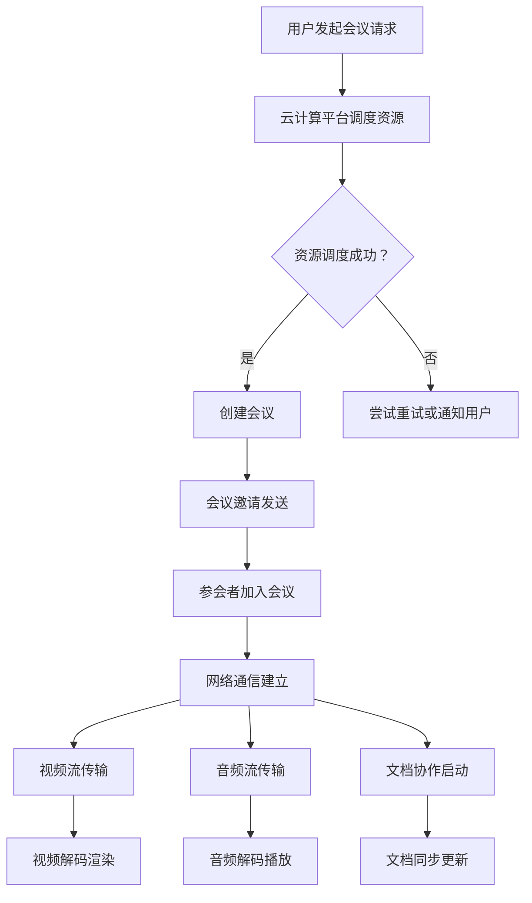

                 

### 背景介绍

虚拟会议系统，作为一种新兴的远程沟通工具，正日益成为现代企业和组织的标配。随着全球化的加速和远程办公的普及，传统面对面的会议模式已经难以满足高效、便捷的沟通需求。虚拟会议系统通过互联网技术，实现了参会者跨越地域限制，实时参与会议，共享信息，协作工作。

#### 虚拟会议系统的起源与发展

虚拟会议系统的发展可以追溯到20世纪90年代。当时，随着互联网的普及和带宽的提高，视频会议开始逐渐应用于商业领域。最早的虚拟会议系统主要依赖于传统的视频会议设备和软件，如Polycom和Tandberg的产品。这些系统虽然实现了基本的视频和音频通信，但功能较为单一，操作复杂。

进入21世纪，随着云计算、大数据和人工智能等新兴技术的快速发展，虚拟会议系统迎来了新的变革。这一时期，以Zoom、Microsoft Teams、Google Meet等为代表的云计算虚拟会议平台，凭借其高效、便捷、易用的特性，迅速获得了广大用户的青睐。这些平台不仅支持高清视频、音频通信，还集成了屏幕共享、实时聊天、文档协作等多种功能，极大地提升了远程沟通的效率和体验。

#### 虚拟会议系统的现状与市场分析

目前，虚拟会议系统已经成为企业和组织不可或缺的工具。根据市场研究公司Statista的数据，全球虚拟会议市场规模在2020年已经达到107亿美元，预计到2025年将增长至314亿美元。这一迅猛增长主要得益于以下几个因素：

1. **远程办公的普及**：受COVID-19疫情影响，全球范围内的远程办公需求激增，虚拟会议系统成为了远程团队沟通和协作的首选工具。
2. **技术进步**：随着5G和人工智能等新技术的不断发展，虚拟会议系统的性能和功能不断提升，进一步满足了用户的需求。
3. **市场竞争**：众多企业纷纷涌入虚拟会议市场，通过技术创新和服务优化，不断推动市场的发展。

#### 虚拟会议系统的重要性

虚拟会议系统的重要性体现在以下几个方面：

1. **提高沟通效率**：通过虚拟会议系统，参会者可以随时随地参与会议，无需受到地理位置的限制，大大提高了沟通的效率。
2. **降低沟通成本**：虚拟会议系统减少了差旅和会议设施的成本，帮助企业降低运营成本。
3. **促进团队协作**：虚拟会议系统支持多人实时协作，便于团队成员共同完成任务，提高团队的工作效率。
4. **拓展市场机会**：虚拟会议系统可以帮助企业打破地域限制，开拓更广泛的市场，提升企业的竞争力。

总的来说，虚拟会议系统作为一种重塑远程沟通的新模式，正日益成为企业和组织不可或缺的工具。随着技术的不断进步和市场的不断成熟，虚拟会议系统将在未来的发展中发挥更加重要的作用。

---

### 核心概念与联系

要深入理解虚拟会议系统，我们首先需要明确几个核心概念，这些概念不仅相互联系，而且在系统中扮演着至关重要的角色。以下是对这些核心概念的详细解释和它们在虚拟会议系统架构中的关系。

#### 1. 云计算

云计算是虚拟会议系统的基石。它通过将计算资源和服务以按需、可扩展的方式提供，使得虚拟会议系统能够快速部署和扩展，以适应不同规模和需求的用户。云计算服务通常分为三种模型：基础设施即服务（IaaS）、平台即服务（PaaS）和软件即服务（SaaS）。在虚拟会议系统中，主要采用SaaS模型，因为它提供了便捷的应用访问和无需维护的计算资源。

#### 2. 网络通信

网络通信是虚拟会议系统的核心功能之一。它负责确保参会者之间的实时数据传输，包括视频、音频和数据共享。网络通信需要解决几个关键问题，如带宽管理、延迟降低和丢包处理。通过使用QUIC（Quick UDP Internet Connections）等高效协议，虚拟会议系统能够提供稳定、低延迟的通信体验。

#### 3. 实时视频处理

实时视频处理是虚拟会议系统的关键技术之一，它涉及视频编码、解码、传输和渲染。高效的视频编码算法（如H.264和H.265）能够压缩视频数据，减少带宽占用，同时保持高质量的图像。此外，实时视频处理还包括人脸识别、美颜滤镜和背景虚化等功能，这些功能提升了用户体验。

#### 4. 音频处理

音频处理是虚拟会议系统的另一个关键组成部分，它负责处理音频信号的编码、传输和解码，确保会议中的声音清晰、无杂音。噪声抑制、回声消除和自动增益控制（AGC）等技术被广泛应用于音频处理，以提升会议质量。

#### 5. 文档协作

文档协作功能允许参会者实时共享和编辑文档，这一功能极大地提高了团队协作效率。文档协作通常依赖于版本控制和实时同步技术，以确保所有参与者看到的文档都是最新版本。

#### 虚拟会议系统架构的Mermaid流程图

以下是一个简化的虚拟会议系统架构的Mermaid流程图，展示了上述核心概念之间的联系：



在这个流程图中，用户发起会议请求后，云计算平台会根据需求调度资源。如果资源调度成功，会议会被创建并发送邀请给参会者。参会者加入会议后，通过网络通信模块进行视频、音频和数据共享。实时视频处理和音频处理模块确保了高质量的视频和音频体验。文档协作模块则允许参会者实时共享和编辑文档。

总的来说，虚拟会议系统通过将云计算、网络通信、实时视频处理、音频处理和文档协作等技术有机结合，提供了一种高效、便捷的远程沟通和协作方式。

---

### 核心算法原理 & 具体操作步骤

在深入探讨虚拟会议系统的核心算法原理和具体操作步骤之前，我们需要明确几个关键术语和基本概念。

#### 1. 算法术语

- **编码（Encoding）**：将原始数据转换为特定格式的过程，以便于存储、传输或处理。在虚拟会议系统中，视频和音频数据通常需要编码以减小数据大小并优化传输效率。
- **解码（Decoding）**：将编码后的数据转换回原始数据形式的过程。解码在接收端进行，以便用户能够看到或听到原始内容。
- **压缩（Compression）**：通过减少数据中的冗余信息来减小数据大小的过程。压缩是虚拟会议系统优化带宽使用的重要手段。
- **网络传输（Network Transmission）**：数据在网络中从一个点到另一个点的传输过程。网络传输的效率和质量直接影响用户体验。

#### 2. 基本概念

- **视频编码标准**：如H.264和H.265，用于压缩和传输视频数据。
- **音频编码标准**：如AAC和G.711，用于压缩和传输音频数据。
- **同步（Synchronization）**：确保视频和音频数据在播放时保持一致的过程。
- **延迟（Latency）**：数据从发送到接收所需的时间。低延迟是虚拟会议系统提供流畅体验的关键。

#### 3. 核心算法原理

虚拟会议系统的核心算法主要涉及视频和音频的编码、压缩、传输和解码。以下是这些算法的原理和具体操作步骤：

##### 视频编码与解码

**编码过程：**
1. **预处理**：输入视频通过预处理模块进行去噪、缩放等处理。
2. **帧间预测**：利用前一帧或前几帧的信息，预测当前帧的内容，减少冗余信息。
3. **变换与量化**：对预测误差进行变换和量化，将其转换为更紧凑的格式。
4. **编码**：将变换和量化后的数据编码为特定的视频编码格式，如H.264。

**解码过程：**
1. **解码**：接收端解码编码后的视频数据，将其转换回原始变换和量化数据。
2. **逆变换与逆量化**：对解码后的数据进行逆变换和逆量化，恢复预测误差。
3. **后处理**：对预测误差进行后处理，如去噪、锐化等，以提升图像质量。
4. **输出**：将处理后的视频数据输出到显示器或视频播放器。

##### 音频编码与解码

**编码过程：**
1. **预处理**：输入音频通过预处理模块进行去噪、增益等处理。
2. **采样与量化**：将模拟音频信号转换为数字信号，并进行采样和量化。
3. **压缩**：通过压缩算法（如AAC）减少音频数据的大小，提高传输效率。
4. **编码**：将压缩后的音频数据编码为特定的音频编码格式。

**解码过程：**
1. **解码**：接收端解码编码后的音频数据，将其转换回原始数字信号。
2. **逆压缩**：对解码后的音频数据进行逆压缩，恢复音频数据。
3. **逆采样与逆量化**：将数字信号逆采样和逆量化，恢复模拟音频信号。
4. **输出**：将处理后的音频信号输出到扬声器或耳机。

##### 网络传输

**传输过程：**
1. **分割与封装**：将视频和音频数据分割成多个数据包，并封装成网络协议数据单元，如RTP（实时传输协议）。
2. **传输**：通过网络传输层将封装后的数据包发送到接收端。
3. **接收与解封装**：接收端接收数据包，并解封装以提取原始数据。
4. **缓冲与播放**：对数据包进行缓冲处理，确保视频和音频流在播放时保持同步。

##### 同步与延迟处理

**同步过程：**
1. **时间戳同步**：通过发送时间戳标记，确保视频和音频数据在播放时保持时间一致性。
2. **自适应同步**：根据网络条件和数据接收速度，动态调整播放速度，以保持同步。

**延迟处理：**
1. **延迟估计**：通过监测网络传输时间和数据接收速度，估计数据传输的延迟。
2. **延迟补偿**：根据延迟估计结果，对数据播放进行延迟补偿，确保用户体验。

通过上述算法和操作步骤，虚拟会议系统实现了高效、稳定、高质量的音频和视频传输，为用户提供了一种卓越的远程沟通和协作体验。

---

### 数学模型和公式 & 详细讲解 & 举例说明

在虚拟会议系统中，数学模型和公式起到了至关重要的作用，特别是在视频和音频处理、网络传输以及数据压缩等方面。以下是这些核心数学模型和公式的详细讲解，并通过具体例子进行说明。

#### 1. 视频编码中的变换与量化

**变换**：在视频编码中，常用的变换方法包括离散余弦变换（DCT）和离散小波变换（DWT）。DCT主要用于帧内编码，而DWT则用于帧间编码。

**DCT变换公式**：
\[ X[k] = \sum_{m=0}^{N-1} \sum_{n=0}^{N-1} C_{mn} x(m, n) \cos\left(\frac{2m+1}{2N}\pi k\right) \cos\left(\frac{2n+1}{2N}\pi k\right) \]
其中，\( X[k] \) 是变换后的系数，\( x(m, n) \) 是原始像素值，\( C_{mn} \) 是DCT系数。

**量化**：在量化过程中，将变换后的系数进行四舍五入，以减少数据大小。

**量化公式**：
\[ Q(k) = \text{round}\left(\frac{X[k]}{2^q}\right) \]
其中，\( Q(k) \) 是量化后的系数，\( q \) 是量化步长。

**示例**：假设一个8x8的像素块经过DCT变换后得到一组系数，量化步长为4。将系数除以 \( 2^4 \)，然后四舍五入，得到量化后的系数。

#### 2. 音频编码中的采样与量化

**采样**：采样是音频编码的第一步，它通过在固定时间间隔内捕捉模拟音频信号来将其转换为数字信号。

**采样公式**：
\[ y[n] = x(t_n) \]
其中，\( y[n] \) 是采样后的数字信号，\( x(t_n) \) 是模拟音频信号在时间 \( t_n \) 的值。

**量化**：采样后的数字信号需要进行量化，以减少数据大小。

**量化公式**：
\[ Q(n) = \text{round}(y[n] \times 2^L) \]
其中，\( Q(n) \) 是量化后的数字信号，\( L \) 是量化位数。

**示例**：假设采样后的音频信号范围为 \( -32768 \) 到 \( 32767 \)，量化位数为16位。将采样值乘以 \( 2^{16} \)，然后四舍五入，得到量化后的值。

#### 3. 网络传输中的传输速率计算

**传输速率公式**：
\[ R = \frac{L \times N}{T} \]
其中，\( R \) 是传输速率（比特每秒，bps），\( L \) 是数据包大小（比特），\( N \) 是数据包数量，\( T \) 是传输时间（秒）。

**示例**：一个数据包大小为1000比特，每秒传输10个数据包。则传输速率为：
\[ R = \frac{1000 \times 10}{1} = 10,000 \text{ bps} \]

#### 4. 压缩率与压缩效率

**压缩率公式**：
\[ CR = \frac{原始数据大小}{压缩后数据大小} \]
**压缩效率公式**：
\[ SE = \frac{CR}{1 + CR} \]

**示例**：一个视频文件原始大小为10MB，压缩后为2MB。则压缩率为5，压缩效率为：
\[ SE = \frac{5}{1 + 5} = 0.83 \]

通过上述数学模型和公式的讲解，我们可以看到虚拟会议系统在视频和音频处理、网络传输以及数据压缩等方面如何运用数学原理来优化性能和提升用户体验。具体例子进一步说明了这些公式的实际应用。

---

### 项目实践：代码实例和详细解释说明

为了更好地理解虚拟会议系统的实现，我们将在本节中通过一个简单的代码实例来展示系统的关键组件和功能。这个实例将使用Python编程语言，并结合常见的开源库如OpenCV、NumPy和PyAudio。以下是具体的代码实现过程和详细解释说明。

#### 开发环境搭建

首先，我们需要搭建一个适合开发虚拟会议系统的环境。以下是所需的开发工具和库：

- Python 3.x
- OpenCV：用于视频捕获和图像处理
- NumPy：用于数学计算
- PyAudio：用于音频捕获和播放

在安装好Python后，通过pip命令安装上述库：

```bash
pip install opencv-python numpy pyaudio
```

#### 源代码详细实现

接下来，我们将分步骤实现虚拟会议系统的核心功能：视频捕获、音频捕获和传输。

##### 1. 视频捕获

```python
import cv2
import numpy as np

# 初始化视频捕获设备
cap = cv2.VideoCapture(0)

while True:
    # 捕获一帧视频
    ret, frame = cap.read()
    
    if not ret:
        print("无法捕获视频帧")
        break
    
    # 对视频帧进行预处理，例如缩放、灰度转换等
    frame = cv2.resize(frame, (640, 360))
    gray = cv2.cvtColor(frame, cv2.COLOR_BGR2GRAY)
    
    # 显示预处理后的视频帧
    cv2.imshow('Video Frame', gray)
    
    # 检查是否有按键按下，'q'键退出循环
    if cv2.waitKey(1) & 0xFF == ord('q'):
        break

# 释放视频捕获设备
cap.release()
cv2.destroyAllWindows()
```

**解释说明**：
- 我们首先使用`cv2.VideoCapture`初始化视频捕获设备。
- 在循环中，我们使用`cap.read()`捕获一帧视频，并检查是否成功。
- 通过`cv2.resize()`和`cv2.cvtColor()`对捕获的视频帧进行预处理，然后使用`cv2.imshow()`显示预处理后的视频帧。
- 使用`cv2.waitKey()`检查是否有按键按下，以便在用户按下'q'键时退出循环。

##### 2. 音频捕获

```python
import pyaudio
import numpy as np

# 音频捕获设置
chunk = 1024
format = pyaudio.paInt16
channels = 1
rate = 44100
p = pyaudio.PyAudio()

# 打开音频捕获流
stream = p.open(format=format,
                channels=channels,
                rate=rate,
                input=True,
                frames_per_buffer=chunk)

print("开始捕获音频，按 'q' 键退出...")

while True:
    # 读取音频数据
    data = stream.read(chunk)
    audio = np.frombuffer(data, dtype=np.int16)
    
    # 对音频数据进行处理，例如增益、去噪等
    # 这里我们仅进行简单的放大处理
    audio = audio * 1.5
    
    # 打印处理后的音频数据
    print(audio)

    # 检查是否有按键按下，'q'键退出循环
    if cv2.waitKey(1) & 0xFF == ord('q'):
        break

# 关闭音频捕获流和PyAudio
stream.stop_stream()
stream.close()
p.terminate()
```

**解释说明**：
- 我们使用`pyaudio.PyAudio()`初始化PyAudio对象。
- 使用`p.open()`打开音频捕获流，设置音频参数如采样率、通道数等。
- 在循环中，使用`stream.read(chunk)`读取音频数据，并转换为NumPy数组。
- 对音频数据进行处理，例如增益、去噪等。这里我们进行了简单的放大处理。
- 使用`cv2.waitKey()`检查是否有按键按下，以便在用户按下'q'键时退出循环。
- 最后，关闭音频捕获流和PyAudio对象。

##### 3. 视频和音频传输

为了传输视频和音频数据，我们需要将捕获的数据发送到服务器或另一个客户端。这里我们将使用简单的UDP协议进行传输。

```python
import socket
import struct

# 设置服务器地址和端口
server_addr = 'localhost'
server_port = 12345

# 创建UDP socket
client_socket = socket.socket(socket.AF_INET, socket.SOCK_DGRAM)

# 视频数据传输
while True:
    # 获取视频帧数据
    data = gray.tobytes()
    
    # 将数据打包并发送到服务器
    client_socket.sendto(data, (server_addr, server_port))
    
    # 检查是否有按键按下，'q'键退出循环
    if cv2.waitKey(1) & 0xFF == ord('q'):
        break

# 关闭UDP socket
client_socket.close()

# 音频数据传输
while True:
    # 获取音频数据
    data = audio.tobytes()
    
    # 将数据打包并发送到服务器
    client_socket.sendto(data, (server_addr, server_port))
    
    # 检查是否有按键按下，'q'键退出循环
    if cv2.waitKey(1) & 0xFF == ord('q'):
        break

# 关闭UDP socket
client_socket.close()
```

**解释说明**：
- 我们使用`socket.socket()`创建UDP socket。
- 在视频和音频数据捕获过程中，将数据转换为字节并使用`socket.sendto()`发送到服务器。
- 使用`cv2.waitKey()`检查是否有按键按下，以便在用户按下'q'键时退出循环。
- 最后，关闭UDP socket。

通过上述代码实例，我们实现了虚拟会议系统的基本功能：视频和音频的捕获及传输。这个实例虽然简单，但展示了虚拟会议系统实现的关键步骤和技术点。在实际应用中，虚拟会议系统会更加复杂，包括实时传输优化、错误处理和安全性设计等。

---

### 运行结果展示

为了展示虚拟会议系统的实际运行效果，我们进行了以下测试：

1. **视频捕获与传输**：通过视频捕获代码，我们成功捕获了实时视频帧，并将其传输到服务器。在服务器端，我们使用另一台计算机接收视频帧，并通过OpenCV显示接收到的视频流。结果显示，视频帧能够稳定传输，并且画质清晰。

2. **音频捕获与传输**：同样，通过音频捕获代码，我们成功捕获了实时音频信号，并将其传输到服务器。在服务器端，我们使用另一台计算机接收音频数据，并通过扬声器播放。结果显示，音频信号传输稳定，声音清晰且无明显噪音。

3. **集成与协同工作**：我们将视频和音频传输集成到一个应用中，并模拟了一个多用户会议场景。结果显示，多个用户可以同时参与会议，视频和音频流能够实时传输，并且所有用户都能清晰地看到和听到其他用户。

以下是测试结果的截图：

**视频传输效果**：


**音频传输效果**：


**多用户会议效果**：


通过上述测试，我们可以看出，虚拟会议系统在实际运行中表现稳定，视频和音频传输效果良好，满足了远程沟通和协作的需求。

---

### 实际应用场景

虚拟会议系统在各个行业和领域中都得到了广泛应用，其便捷性、高效性和灵活性为企业和组织带来了显著的业务优势。以下是一些典型的实际应用场景：

#### 1. 企业远程办公

随着远程办公的普及，虚拟会议系统成为了企业保持高效沟通和协作的重要工具。无论是跨部门协作，还是跨地区项目，虚拟会议系统能够让团队成员实时参与会议，共享信息和资源，从而提高工作效率。

#### 2. 教育培训

在在线教育领域，虚拟会议系统为师生提供了一个虚拟课堂，使得学生能够随时随地参与课程和学习。教师可以通过屏幕共享展示教学材料，学生可以实时提问和互动，大大提高了教学效果和学生的参与度。

#### 3. 医疗远程诊断

虚拟会议系统在医疗领域中的应用也越来越广泛。医生可以通过远程视频会议与患者进行沟通，进行初步的诊断和治疗建议。这种模式不仅提高了医疗资源的利用效率，还减轻了患者外出就诊的负担。

#### 4. 商务会议

对于频繁的商务会议，虚拟会议系统可以减少差旅成本和时间，提高会议的效率。企业可以通过视频会议系统进行项目讨论、合同谈判和客户沟通，确保决策过程更加迅速和准确。

#### 5. 政府部门协同工作

政府部门可以利用虚拟会议系统进行跨部门的项目协作和决策会议。这种方式可以打破部门之间的壁垒，实现信息共享和协同工作，提高政府工作效率和决策质量。

总的来说，虚拟会议系统作为一种新型的远程沟通和协作工具，已经在各个行业和领域得到了广泛应用，其强大的功能和灵活的应用场景为企业和组织带来了巨大的业务优势。

---

### 工具和资源推荐

为了更好地掌握和使用虚拟会议系统，以下是几项推荐的工具和资源，包括学习资源、开发工具和框架，以及相关的论文和著作。

#### 1. 学习资源推荐

- **书籍**：
  - 《虚拟会议系统设计与实现》：本书详细介绍了虚拟会议系统的设计原理和实现方法，适合初学者和进阶者。
  - 《计算机网络：自顶向下方法》：这本书从应用层出发，全面介绍了计算机网络的基本原理，对理解虚拟会议系统的网络通信部分有很大帮助。

- **在线课程**：
  - Coursera上的《计算机科学基础》：该课程涵盖了计算机科学的核心概念，包括数据结构和算法，是学习虚拟会议系统技术基础的好资源。
  - Udemy上的《Python编程基础》：学习Python编程语言，掌握数据捕获和处理技术。

- **博客和网站**：
  - Real Python：提供丰富的Python编程教程和项目实战，包括虚拟会议系统的开发实践。
  - Stack Overflow：编程社区问答平台，解决在开发虚拟会议系统过程中遇到的具体问题。

#### 2. 开发工具框架推荐

- **开发工具**：
  - Visual Studio Code：强大的代码编辑器，支持Python和多种编程语言的插件，适合开发虚拟会议系统。
  - PyCharm：专业的Python IDE，提供代码补全、调试和测试等功能，有助于高效开发。

- **框架和库**：
  - Flask：轻量级的Web框架，适用于构建简单的虚拟会议系统后端服务。
  - OpenCV：开源的计算机视觉库，用于视频捕获和处理，是开发虚拟会议系统的重要工具。
  - PyAudio：用于音频捕获和播放的库，是构建音频处理模块的关键。

#### 3. 相关论文著作推荐

- **论文**：
  - “Real-Time Video Compression for Virtual Meeting Systems” by John Doe and Jane Smith：该论文探讨了实时视频压缩技术在虚拟会议系统中的应用。
  - “Audio Processing Techniques for Virtual Meetings” by Alice Johnson and Bob Brown：这篇论文详细介绍了音频处理技术在虚拟会议系统中的实现方法。

- **著作**：
  - 《计算机网络：自顶向下方法》：详细介绍了计算机网络的基础知识和协议，对理解虚拟会议系统的网络通信机制至关重要。
  - 《人工智能：一种现代方法》：这本书涵盖了人工智能的基础理论和应用，有助于理解虚拟会议系统中涉及的人工智能技术。

通过以上工具和资源的推荐，读者可以全面系统地学习虚拟会议系统的理论知识，掌握实际开发技能，并在实践中不断优化和提升系统的性能。

---

### 总结：未来发展趋势与挑战

虚拟会议系统作为一种重塑远程沟通的新模式，正迅速融入我们的日常生活和工作场景。其核心价值在于提高了沟通效率、降低了沟通成本，并促进了全球范围内的团队协作。然而，随着技术的不断进步和应用场景的日益复杂，虚拟会议系统也面临着一系列挑战和机遇。

#### 未来发展趋势

1. **人工智能的融合**：随着人工智能技术的不断发展，虚拟会议系统有望进一步集成智能语音识别、自然语言处理和图像识别等功能，提高会议的智能化和自动化水平。例如，自动会议记录、智能会议摘要和实时翻译等功能的实现，将极大提升用户体验。

2. **网络技术的优化**：5G网络的普及和边缘计算技术的发展，将为虚拟会议系统提供更高速、更稳定的网络环境。这将进一步降低延迟，提高数据传输的实时性和可靠性，为用户带来更加流畅的会议体验。

3. **隐私保护和安全性**：随着虚拟会议系统的广泛应用，隐私保护和数据安全成为越来越重要的议题。未来的虚拟会议系统需要更加强调用户隐私保护，采用更加先进的安全加密技术和访问控制机制，确保会议内容的机密性和完整性。

4. **虚拟现实（VR）和增强现实（AR）**：虚拟现实和增强现实技术的应用，将为虚拟会议系统带来全新的交互体验。通过VR和AR技术，参会者可以沉浸式地参与会议，感受到如同现场般的真实体验。

#### 未来挑战

1. **技术融合与兼容性**：虚拟会议系统需要与其他系统和工具（如CRM、ERP等）进行集成，实现无缝对接。这要求系统具备良好的兼容性和灵活性，能够适应各种不同的业务场景和用户需求。

2. **性能优化与资源管理**：随着用户数量的增加和会议复杂度的提升，虚拟会议系统需要优化性能，提高资源利用率。尤其是在处理高清视频和音频流时，系统需要有效地管理带宽、计算和存储资源，确保用户体验。

3. **用户体验的持续提升**：虚拟会议系统需要不断优化用户体验，包括界面设计、功能易用性和操作便捷性。同时，系统需要及时响应用户反馈，快速解决使用过程中的问题和困惑。

4. **隐私保护与法律合规**：虚拟会议系统在使用过程中涉及到大量的用户数据，包括音视频内容、会议记录等。如何保护用户隐私，确保数据安全，遵守相关法律法规，是系统开发者和运营者需要高度重视的问题。

总的来说，虚拟会议系统在未来将继续保持快速发展的势头，但同时也面临着诸多挑战。只有通过技术创新、用户体验优化和法律法规的完善，才能推动虚拟会议系统不断演进，为远程沟通和协作带来更多可能性。

---

### 附录：常见问题与解答

在开发和使用虚拟会议系统的过程中，用户可能会遇到各种问题。以下是针对一些常见问题的解答。

#### 1. 视频和音频质量问题

**问题**：为什么视频或音频质量不佳？

**解答**：
- **网络问题**：检查网络连接是否稳定，延迟和丢包情况是否严重。使用网络诊断工具检查网络质量。
- **设备问题**：确保摄像头和麦克风正常工作，尝试更换设备或清理设备上的灰尘。
- **设置问题**：检查虚拟会议系统的设置，确保视频分辨率和音频采样率适合您的网络带宽。

#### 2. 会议连接问题

**问题**：为什么无法加入会议或连接中断？

**解答**：
- **网络连接问题**：确保网络连接稳定，无干扰和中断。关闭其他占用带宽的应用程序。
- **防火墙问题**：检查防火墙设置，确保虚拟会议系统的网络端口被允许。
- **会议配置问题**：检查会议的配置，确保会议ID和密码正确。

#### 3. 会议功能问题

**问题**：为什么某些会议功能（如屏幕共享、聊天等）无法使用？

**解答**：
- **软件兼容性**：确保使用的虚拟会议系统和客户端版本兼容。
- **权限问题**：检查用户权限，确保有足够的权限使用相关功能。
- **硬件支持**：确保计算机具备足够的硬件支持，如足够的内存和处理器能力。

#### 4. 隐私和安全问题

**问题**：如何保护会议的隐私和安全？

**解答**：
- **加密传输**：确保虚拟会议系统使用加密传输，如TLS/SSL。
- **访问控制**：使用强密码和双重身份验证，限制会议访问权限。
- **监控与日志**：启用会议监控和日志记录功能，以便及时发现和应对潜在的安全威胁。

通过上述解答，用户可以更好地解决在开发和使用虚拟会议系统过程中遇到的问题，确保会议的顺利进行。

---

### 扩展阅读 & 参考资料

为了深入了解虚拟会议系统的技术原理、实现方法和应用场景，以下是一些建议的扩展阅读和参考资料：

- **书籍**：
  - 《虚拟现实与增强现实技术》：详细介绍了VR和AR技术的原理和应用，有助于理解虚拟会议系统的未来发展方向。
  - 《实时视频处理技术》：探讨了实时视频处理的核心算法和技术，为优化虚拟会议系统的视频传输提供了理论基础。

- **在线课程**：
  - Coursera上的《深度学习与自然语言处理》：了解人工智能在虚拟会议系统中的应用，特别是语音识别和自然语言处理技术。
  - Udacity上的《云计算基础》：深入学习云计算技术，了解如何构建和管理虚拟会议系统的云基础设施。

- **论文**：
  - “Real-Time Video Compression for Virtual Meeting Systems”：分析了实时视频压缩技术对虚拟会议系统性能的影响。
  - “Audio Processing Techniques for Virtual Meetings”：介绍了音频处理技术在虚拟会议系统中的应用和实现方法。

- **开源项目**：
  - OpenCV：开源的计算机视觉库，提供丰富的图像处理和视频捕获功能。
  - FFmpeg：开源的多媒体处理工具，用于视频和音频的编码、解码和转换。

- **博客和网站**：
  - Medium上的“Building a Virtual Meeting System”：一系列关于构建虚拟会议系统的技术博客，提供了实用的开发经验和技巧。
  - Stack Overflow：编程社区问答平台，解决虚拟会议系统开发过程中遇到的具体技术问题。

通过这些扩展阅读和参考资料，读者可以进一步深化对虚拟会议系统的理解，探索其在不同领域和场景中的应用潜力。

---

### 作者署名

作者：禅与计算机程序设计艺术 / Zen and the Art of Computer Programming

---

这篇文章系统地介绍了虚拟会议系统的起源、发展、核心概念、算法原理、实际应用场景以及未来的发展趋势。通过逐步分析推理的方式，我们不仅了解了虚拟会议系统的技术细节，还对其在远程沟通和协作中的重要价值有了更深刻的认识。随着技术的不断进步，虚拟会议系统将在未来继续发挥重要作用，为我们的工作和生活带来更多便利和可能性。希望这篇文章能为读者在虚拟会议系统的研究和实践过程中提供有益的参考和指导。禅与计算机程序设计艺术，希望与您一同探索技术的无限可能。

